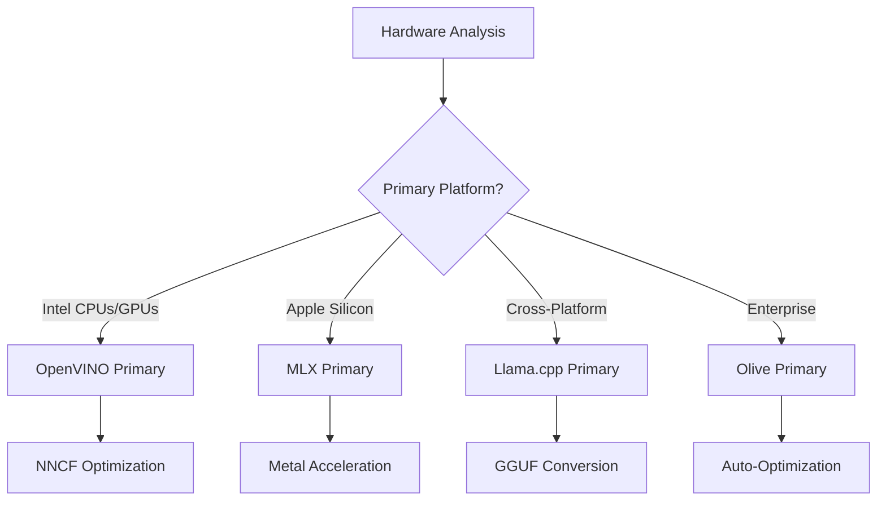
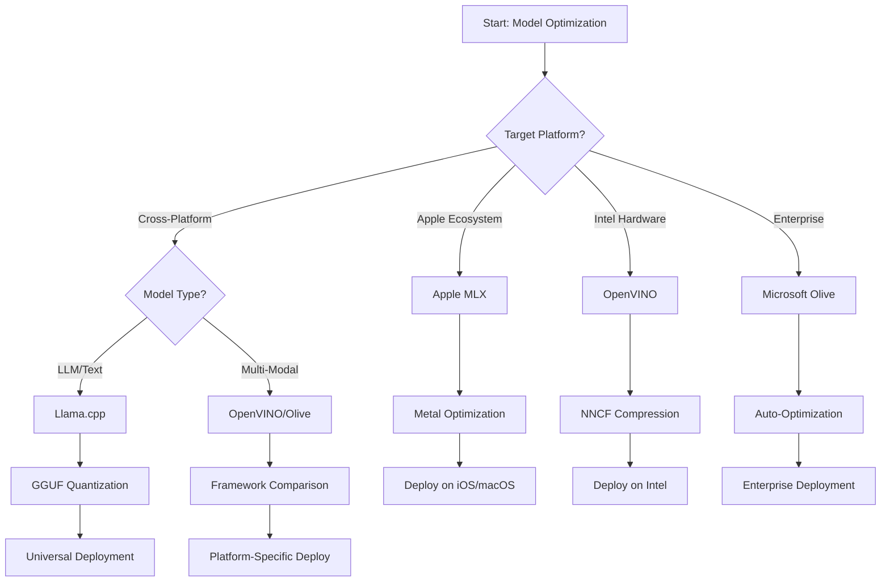

<!--
CO_OP_TRANSLATOR_METADATA:
{
  "original_hash": "6719c4a7e44b948230ac5f5cab3699bd",
  "translation_date": "2025-09-17T23:33:16+00:00",
  "source_file": "Module04/06.workflow-synthesis.md",
  "language_code": "pa"
}
-->
# ਸੈਕਸ਼ਨ 6: ਐਜ AI ਵਿਕਾਸ ਵਰਕਫਲੋ ਸਿੰਥੇਸਿਸ

## ਸੂਚੀ
1. [ਪ੍ਰਸਤਾਵਨਾ](../../../Module04)
2. [ਸਿੱਖਣ ਦੇ ਉਦੇਸ਼](../../../Module04)
3. [ਇਕਜੁਟ ਵਰਕਫਲੋ ਝਲਕ](../../../Module04)
4. [ਫਰੇਮਵਰਕ ਚੋਣ ਮੈਟ੍ਰਿਕਸ](../../../Module04)
5. [ਸਰਵੋਤਮ ਅਭਿਆਸ ਸਿੰਥੇਸਿਸ](../../../Module04)
6. [ਡਿਪਲੌਇਮੈਂਟ ਰਣਨੀਤੀ ਗਾਈਡ](../../../Module04)
7. [ਪ੍ਰਦਰਸ਼ਨ ਅਪਟਿਮਾਈਜ਼ੇਸ਼ਨ ਵਰਕਫਲੋ](../../../Module04)
8. [ਉਤਪਾਦਨ ਤਿਆਰੀ ਚੈੱਕਲਿਸਟ](../../../Module04)
9. [ਟ੍ਰਬਲਸ਼ੂਟਿੰਗ ਅਤੇ ਮਾਨੀਟਰਿੰਗ](../../../Module04)
10. [ਤੁਹਾਡੇ ਐਜ AI ਪਾਈਪਲਾਈਨ ਨੂੰ ਭਵਿੱਖ-ਸੁਰੱਖਿਅਤ ਬਣਾਉਣਾ](../../../Module04)

## ਪ੍ਰਸਤਾਵਨਾ

ਐਜ AI ਵਿਕਾਸ ਵਿੱਚ ਕਈ ਅਪਟਿਮਾਈਜ਼ੇਸ਼ਨ ਫਰੇਮਵਰਕਸ, ਡਿਪਲੌਇਮੈਂਟ ਰਣਨੀਤੀਆਂ ਅਤੇ ਹਾਰਡਵੇਅਰ ਦੇ ਵਿਚਾਰਾਂ ਦੀ ਗਹਿਰਾਈ ਸਮਝ ਦੀ ਲੋੜ ਹੁੰਦੀ ਹੈ। ਇਹ ਵਿਸਤ੍ਰਿਤ ਸਿੰਥੇਸਿਸ Llama.cpp, Microsoft Olive, OpenVINO, ਅਤੇ Apple MLX ਤੋਂ ਗਿਆਨ ਨੂੰ ਇਕਜੁਟ ਕਰਦਾ ਹੈ, ਜਿਸ ਨਾਲ ਇੱਕ ਵਰਕਫਲੋ ਬਣਦਾ ਹੈ ਜੋ ਕੁਸ਼ਲਤਾ ਨੂੰ ਵਧਾਉਂਦਾ ਹੈ, ਗੁਣਵੱਤਾ ਨੂੰ ਬਣਾਈ ਰੱਖਦਾ ਹੈ, ਅਤੇ ਸਫਲ ਉਤਪਾਦਨ ਡਿਪਲੌਇਮੈਂਟ ਨੂੰ ਯਕੀਨੀ ਬਣਾਉਂਦਾ ਹੈ।

ਇਸ ਕੋਰਸ ਦੌਰਾਨ, ਅਸੀਂ ਵਿਅਕਤੀਗਤ ਅਪਟਿਮਾਈਜ਼ੇਸ਼ਨ ਫਰੇਮਵਰਕਸ ਦੀ ਖੋਜ ਕੀਤੀ ਹੈ, ਜਿਨ੍ਹਾਂ ਵਿੱਚ ਹਰ ਇੱਕ ਦੇ ਵਿਸ਼ੇਸ਼ ਤਾਕਤ ਅਤੇ ਵਿਸ਼ੇਸ਼ਤਾਵਾਂ ਹਨ। ਹਾਲਾਂਕਿ, ਅਸਲ-ਦੁਨੀਆ ਦੇ ਐਜ AI ਪ੍ਰੋਜੈਕਟ ਅਕਸਰ ਕਈ ਫਰੇਮਵਰਕਸ ਤੋਂ ਤਕਨੀਕਾਂ ਨੂੰ ਜੋੜਨ ਜਾਂ ਇਹ ਫੈਸਲਾ ਕਰਨ ਦੀ ਲੋੜ ਹੁੰਦੀ ਹੈ ਕਿ ਕਿਹੜਾ ਦ੍ਰਿਸ਼ਟੀਕੋਣ ਵਿਸ਼ੇਸ਼ ਪਾਬੰਦੀਆਂ ਅਤੇ ਜ਼ਰੂਰਤਾਂ ਲਈ ਸਭ ਤੋਂ ਵਧੀਆ ਨਤੀਜੇ ਦੇਵੇਗਾ।

ਇਹ ਸੈਕਸ਼ਨ ਸਾਰੇ ਫਰੇਮਵਰਕਸ ਤੋਂ ਇਕੱਠੇ ਗਿਆਨ ਨੂੰ ਕਾਰਗਰ ਵਰਕਫਲੋਜ਼, ਫੈਸਲੇ ਦੇ ਰੁੱਖਾਂ, ਅਤੇ ਸਰਵੋਤਮ ਅਭਿਆਸਾਂ ਵਿੱਚ ਸਿੰਥੇਸਾਈਜ਼ ਕਰਦਾ ਹੈ, ਜੋ ਤੁਹਾਨੂੰ ਉਤਪਾਦਨ-ਤਿਆਰ ਐਜ AI ਹੱਲਾਂ ਨੂੰ ਕੁਸ਼ਲਤਾ ਅਤੇ ਪ੍ਰਭਾਵੀ ਤਰੀਕੇ ਨਾਲ ਬਣਾਉਣ ਯੋਗ ਬਣਾਉਂਦਾ ਹੈ। ਚਾਹੇ ਤੁਸੀਂ ਮੋਬਾਈਲ ਡਿਵਾਈਸਾਂ, ਐਮਬੈਡਡ ਸਿਸਟਮਾਂ, ਜਾਂ ਐਜ ਸਰਵਰਾਂ ਲਈ ਅਪਟਿਮਾਈਜ਼ ਕਰ ਰਹੇ ਹੋਵੋ, ਇਹ ਗਾਈਡ ਤੁਹਾਡੇ ਵਿਕਾਸ ਚੱਕਰ ਦੌਰਾਨ ਸੂਚਿਤ ਫੈਸਲੇ ਕਰਨ ਲਈ ਰਣਨੀਤਿਕ ਫਰੇਮਵਰਕ ਪ੍ਰਦਾਨ ਕਰਦੀ ਹੈ।

## ਸਿੱਖਣ ਦੇ ਉਦੇਸ਼

ਇਸ ਸੈਕਸ਼ਨ ਦੇ ਅੰਤ ਤੱਕ, ਤੁਸੀਂ ਇਹ ਕਰਨ ਦੇ ਯੋਗ ਹੋਵੋਗੇ:

### ਰਣਨੀਤਿਕ ਫੈਸਲੇ ਕਰਨ ਦੀ ਯੋਗਤਾ
- **ਮੁਲਾਂਕਣ ਅਤੇ ਚੋਣ** ਕਰੋ ਕਿ ਪ੍ਰੋਜੈਕਟ ਦੀਆਂ ਜ਼ਰੂਰਤਾਂ, ਹਾਰਡਵੇਅਰ ਪਾਬੰਦੀਆਂ, ਅਤੇ ਡਿਪਲੌਇਮੈਂਟ ਦ੍ਰਿਸ਼ਾਂ ਦੇ ਆਧਾਰ 'ਤੇ ਸਭ ਤੋਂ ਵਧੀਆ ਅਪਟਿਮਾਈਜ਼ੇਸ਼ਨ ਫਰੇਮਵਰਕ ਕਿਹੜਾ ਹੈ।
- **ਵਿਸਤ੍ਰਿਤ ਵਰਕਫਲੋਜ਼ ਡਿਜ਼ਾਈਨ** ਕਰੋ ਜੋ ਵੱਧ ਕੁਸ਼ਲਤਾ ਲਈ ਕਈ ਅਪਟਿਮਾਈਜ਼ੇਸ਼ਨ ਤਕਨੀਕਾਂ ਨੂੰ ਜੋੜਦੇ ਹਨ।
- **ਤੋਲ-ਮੋਲ ਦਾ ਮੁਲਾਂਕਣ** ਕਰੋ ਮਾਡਲ ਦੀ ਸ਼ੁੱਧਤਾ, ਇੰਫਰੈਂਸ ਦੀ ਗਤੀ, ਮੈਮਰੀ ਦੀ ਵਰਤੋਂ, ਅਤੇ ਵੱਖ-ਵੱਖ ਫਰੇਮਵਰਕਸ ਵਿੱਚ ਡਿਪਲੌਇਮੈਂਟ ਦੀ ਜਟਿਲਤਾ ਦੇ ਵਿਚਕਾਰ।

### ਵਰਕਫਲੋ ਇੰਟੀਗ੍ਰੇਸ਼ਨ
- **ਇਕਜੁਟ ਵਿਕਾਸ ਪਾਈਪਲਾਈਨ ਲਾਗੂ ਕਰੋ** ਜੋ ਕਈ ਅਪਟਿਮਾਈਜ਼ੇਸ਼ਨ ਫਰੇਮਵਰਕਸ ਦੀਆਂ ਤਾਕਤਾਂ ਦਾ ਲਾਭ ਲੈਂਦੇ ਹਨ।
- **ਪੁਨਰਉਤਪਾਦਯੋਗ ਵਰਕਫਲੋਜ਼ ਬਣਾਓ** ਜੋ ਵੱਖ-ਵੱਖ ਵਾਤਾਵਰਣਾਂ ਵਿੱਚ ਮਾਡਲ ਅਪਟਿਮਾਈਜ਼ੇਸ਼ਨ ਅਤੇ ਡਿਪਲੌਇਮੈਂਟ ਲਈ ਸਥਿਰਤਾ ਪ੍ਰਦਾਨ ਕਰਦੇ ਹਨ।
- **ਗੁਣਵੱਤਾ ਗੇਟਸ ਸਥਾਪਿਤ ਕਰੋ** ਅਤੇ ਵੈਰੀਫਿਕੇਸ਼ਨ ਪ੍ਰਕਿਰਿਆਵਾਂ ਨੂੰ ਯਕੀਨੀ ਬਣਾਉਣ ਲਈ ਕਿ ਅਪਟਿਮਾਈਜ਼ ਕੀਤੇ ਮਾਡਲ ਉਤਪਾਦਨ ਦੀਆਂ ਜ਼ਰੂਰਤਾਂ ਨੂੰ ਪੂਰਾ ਕਰਦੇ ਹਨ।

### ਪ੍ਰਦਰਸ਼ਨ ਅਪਟਿਮਾਈਜ਼ੇਸ਼ਨ
- **ਪ੍ਰਣਾਲੀਬੱਧ ਅਪਟਿਮਾਈਜ਼ੇਸ਼ਨ ਰਣਨੀਤੀਆਂ ਲਾਗੂ ਕਰੋ** ਜਿਵੇਂ ਕਿ ਕੁਆਂਟੀਜ਼ੇਸ਼ਨ, ਪ੍ਰੂਨਿੰਗ, ਅਤੇ ਹਾਰਡਵੇਅਰ-ਵਿਸ਼ੇਸ਼ ਤਰੱਕੀ ਤਕਨੀਕਾਂ।
- **ਮਾਡਲ ਦੇ ਪ੍ਰਦਰਸ਼ਨ ਦੀ ਨਿਗਰਾਨੀ ਅਤੇ ਬੈਂਚਮਾਰਕਿੰਗ ਕਰੋ** ਵੱਖ-ਵੱਖ ਅਪਟਿਮਾਈਜ਼ੇਸ਼ਨ ਪੱਧਰਾਂ ਅਤੇ ਡਿਪਲੌਇਮੈਂਟ ਟਾਰਗਟਸ 'ਤੇ।
- **ਖਾਸ ਹਾਰਡਵੇਅਰ ਪਲੇਟਫਾਰਮਾਂ ਲਈ ਅਪਟਿਮਾਈਜ਼ ਕਰੋ** ਜਿਵੇਂ ਕਿ CPU, GPU, NPU, ਅਤੇ ਵਿਸ਼ੇਸ਼ ਐਜ ਐਕਸਲੇਰੇਟਰ।

### ਉਤਪਾਦਨ ਡਿਪਲੌਇਮੈਂਟ
- **ਸਕੇਲਯੋਗ ਡਿਪਲੌਇਮੈਂਟ ਆਰਕੀਟੈਕਚਰ ਡਿਜ਼ਾਈਨ ਕਰੋ** ਜੋ ਕਈ ਮਾਡਲ ਫਾਰਮੈਟਸ ਅਤੇ ਇੰਫਰੈਂਸ ਇੰਜਨਾਂ ਨੂੰ ਸਮਰਥਨ ਕਰਦੇ ਹਨ।
- **ਮਾਨੀਟਰਿੰਗ ਅਤੇ ਨਿਗਰਾਨੀ ਲਾਗੂ ਕਰੋ** ਉਤਪਾਦਨ ਵਾਤਾਵਰਣਾਂ ਵਿੱਚ ਐਜ AI ਐਪਲੀਕੇਸ਼ਨਾਂ ਲਈ।
- **ਮਾਡਲ ਅਪਡੇਟਸ, ਪ੍ਰਦਰਸ਼ਨ ਨਿਗਰਾਨੀ, ਅਤੇ ਸਿਸਟਮ ਅਪਟਿਮਾਈਜ਼ੇਸ਼ਨ ਲਈ ਰਖਰਖਾਅ ਵਰਕਫਲੋਜ਼ ਸਥਾਪਿਤ ਕਰੋ।**

### ਕ੍ਰਾਸ-ਪਲੇਟਫਾਰਮ ਸ਼੍ਰੇਸ਼ਠਤਾ
- **ਵੱਖ-ਵੱਖ ਹਾਰਡਵੇਅਰ ਪਲੇਟਫਾਰਮਾਂ 'ਤੇ ਅਪਟਿਮਾਈਜ਼ ਕੀਤੇ ਮਾਡਲ ਡਿਪਲੌਇ ਕਰੋ** ਜਦੋਂ ਕਿ ਸਥਿਰ ਪ੍ਰਦਰਸ਼ਨ ਨੂੰ ਬਣਾਈ ਰੱਖਦੇ ਹੋ।
- **ਪਲੇਟਫਾਰਮ-ਵਿਸ਼ੇਸ਼ ਅਪਟਿਮਾਈਜ਼ੇਸ਼ਨ ਨੂੰ ਸੰਭਾਲੋ** Windows, macOS, Linux, ਮੋਬਾਈਲ, ਅਤੇ ਐਮਬੈਡਡ ਸਿਸਟਮਾਂ ਲਈ।
- **ਅਬਸਟਰੈਕਸ਼ਨ ਲੇਅਰ ਬਣਾਓ** ਜੋ ਵੱਖ-ਵੱਖ ਐਜ ਵਾਤਾਵਰਣਾਂ ਵਿੱਚ ਸਹੀ ਡਿਪਲੌਇਮੈਂਟ ਯਕੀਨੀ ਬਣਾਉਂਦੇ ਹਨ।

## ਇਕਜੁਟ ਵਰਕਫਲੋ ਝਲਕ

### ਚਰਨ 1: ਜ਼ਰੂਰਤਾਂ ਦਾ ਵਿਸ਼ਲੇਸ਼ਣ ਅਤੇ ਫਰੇਮਵਰਕ ਚੋਣ

ਸਫਲ ਐਜ AI ਡਿਪਲੌਇਮੈਂਟ ਦੀ ਬੁਨਿਆਦ ਇੱਕ ਵਿਸਥਾਰਿਤ ਜ਼ਰੂਰਤਾਂ ਦਾ ਵਿਸ਼ਲੇਸ਼ਣ ਹੈ ਜੋ ਫਰੇਮਵਰਕ ਚੋਣ ਅਤੇ ਅਪਟਿਮਾਈਜ਼ੇਸ਼ਨ ਰਣਨੀਤੀ ਨੂੰ ਜਾਣਕਾਰੀ ਪ੍ਰਦਾਨ ਕਰਦਾ ਹੈ।

#### 1.1 ਹਾਰਡਵੇਅਰ ਮੁਲਾਂਕਣ


**ਮੁੱਖ ਵਿਚਾਰ:**
- **CPU ਆਰਕੀਟੈਕਚਰ**: x86, ARM, Apple Silicon ਦੀ ਸਮਰਥਾ
- **ਐਕਸਲੇਰੇਟਰ ਉਪਲਬਧਤਾ**: GPU, NPU, VPU, ਵਿਸ਼ੇਸ਼ AI ਚਿਪਸ
- **ਮੈਮਰੀ ਪਾਬੰਦੀਆਂ**: RAM ਦੀ ਸੀਮਾ, ਸਟੋਰੇਜ ਸਮਰਥਾ
- **ਪਾਵਰ ਬਜਟ**: ਬੈਟਰੀ ਲਾਈਫ, ਥਰਮਲ ਪਾਬੰਦੀਆਂ
- **ਕਨੈਕਟਿਵਿਟੀ**: ਆਫਲਾਈਨ ਜ਼ਰੂਰਤਾਂ, ਬੈਂਡਵਿਡਥ ਸੀਮਾਵਾਂ

#### 1.2 ਐਪਲੀਕੇਸ਼ਨ ਜ਼ਰੂਰਤਾਂ ਮੈਟ੍ਰਿਕਸ

| ਜ਼ਰੂਰਤ | Llama.cpp | Microsoft Olive | OpenVINO | Apple MLX |
|---------|-----------|-----------------|----------|-----------|
| ਕ੍ਰਾਸ-ਪਲੇਟਫਾਰਮ | ✅ ਸ਼ਾਨਦਾਰ | ⚡ ਚੰਗਾ | ⚡ ਚੰਗਾ | ❌ ਸਿਰਫ਼ Apple |
| ਐਂਟਰਪ੍ਰਾਈਜ਼ ਇੰਟੀਗ੍ਰੇਸ਼ਨ | ⚡ ਬੁਨਿਆਦੀ | ✅ ਸ਼ਾਨਦਾਰ | ✅ ਸ਼ਾਨਦਾਰ | ⚡ ਸੀਮਿਤ |
| ਮੋਬਾਈਲ ਡਿਪਲੌਇਮੈਂਟ | ✅ ਸ਼ਾਨਦਾਰ | ⚡ ਚੰਗਾ | ⚡ ਚੰਗਾ | ✅ iOS ਸ਼ਾਨਦਾਰ |
| ਰੀਅਲ-ਟਾਈਮ ਇੰਫਰੈਂਸ | ✅ ਸ਼ਾਨਦਾਰ | ✅ ਸ਼ਾਨਦਾਰ | ✅ ਸ਼ਾਨਦਾਰ | ✅ ਸ਼ਾਨਦਾਰ |
| ਮਾਡਲ ਵਿਵਿਧਤਾ | ✅ LLM ਫੋਕਸ | ✅ ਸਾਰੇ ਮਾਡਲ | ✅ ਸਾਰੇ ਮਾਡਲ | ✅ LLM ਫੋਕਸ |
| ਵਰਤੋਂ ਦੀ ਸਹੂਲਤ | ✅ ਸਧਾਰਨ | ✅ ਆਟੋਮੈਟਿਕ | ⚡ ਮਧਿਮ | ✅ ਸਧਾਰਨ |

### ਚਰਨ 2: ਮਾਡਲ ਤਿਆਰੀ ਅਤੇ ਅਪਟਿਮਾਈਜ਼ੇਸ਼ਨ

#### 2.1 ਯੂਨੀਵਰਸਲ ਮਾਡਲ ਮੁਲਾਂਕਣ ਪਾਈਪਲਾਈਨ

```python
# Universal Model Assessment Framework
class EdgeAIModelAssessment:
    def __init__(self, model_path, target_hardware):
        self.model_path = model_path
        self.target_hardware = target_hardware
        self.optimization_frameworks = []
        
    def assess_model_characteristics(self):
        """Analyze model size, architecture, and complexity"""
        return {
            'model_size': self.get_model_size(),
            'parameter_count': self.get_parameter_count(),
            'architecture_type': self.detect_architecture(),
            'quantization_compatibility': self.check_quantization_support()
        }
    
    def recommend_optimization_strategy(self):
        """Recommend optimal frameworks and techniques"""
        characteristics = self.assess_model_characteristics()
        
        if self.target_hardware.startswith('apple'):
            return self.mlx_optimization_strategy(characteristics)
        elif self.target_hardware.startswith('intel'):
            return self.openvino_optimization_strategy(characteristics)
        elif characteristics['model_size'] > 7_000_000_000:  # 7B+ parameters
            return self.enterprise_optimization_strategy(characteristics)
        else:
            return self.lightweight_optimization_strategy(characteristics)
```

#### 2.2 ਮਲਟੀ-ਫਰੇਮਵਰਕ ਅਪਟਿਮਾਈਜ਼ੇਸ਼ਨ ਪਾਈਪਲਾਈਨ

**ਕ੍ਰਮਬੱਧ ਅਪਟਿਮਾਈਜ਼ੇਸ਼ਨ ਦ੍ਰਿਸ਼ਟੀਕੋਣ:**
1. **ਸ਼ੁਰੂਆਤੀ ਰੂਪਾਂਤਰਨ**: ਅੰਤਰਮਿਧੀ ਫਾਰਮੈਟ ਵਿੱਚ ਰੂਪਾਂਤਰਨ (ਜਿੱਥੇ ਸੰਭਵ ਹੋਵੇ ONNX)
2. **ਫਰੇਮਵਰਕ-ਵਿਸ਼ੇਸ਼ ਅਪਟਿਮਾਈਜ਼ੇਸ਼ਨ**: ਵਿਸ਼ੇਸ਼ ਤਕਨੀਕਾਂ ਲਾਗੂ ਕਰੋ
3. **ਕ੍ਰਾਸ-ਵੈਰੀਫਿਕੇਸ਼ਨ**: ਟਾਰਗਟ ਪਲੇਟਫਾਰਮਾਂ 'ਤੇ ਪ੍ਰਦਰਸ਼ਨ ਦੀ ਪੁਸ਼ਟੀ ਕਰੋ
4. **ਅੰਤਮ ਪੈਕੇਜਿੰਗ**: ਡਿਪਲੌਇਮੈਂਟ ਲਈ ਤਿਆਰ ਕਰੋ

```bash
# Multi-Framework Optimization Script
#!/bin/bash

MODEL_NAME="phi-3-mini"
BASE_MODEL="microsoft/Phi-3-mini-4k-instruct"

# Phase 1: ONNX Conversion (Universal)
python convert_to_onnx.py --model $BASE_MODEL --output models/onnx/

# Phase 2: Platform-Specific Optimization
if [[ "$TARGET_PLATFORM" == "intel" ]]; then
    # OpenVINO Optimization
    python optimize_openvino.py --input models/onnx/ --output models/openvino/
elif [[ "$TARGET_PLATFORM" == "apple" ]]; then
    # MLX Optimization
    python optimize_mlx.py --input $BASE_MODEL --output models/mlx/
elif [[ "$TARGET_PLATFORM" == "cross" ]]; then
    # Llama.cpp Optimization
    python convert_to_gguf.py --input models/onnx/ --output models/gguf/
fi

# Phase 3: Validation
python validate_optimization.py --original $BASE_MODEL --optimized models/$TARGET_PLATFORM/
```

### ਚਰਨ 3: ਪ੍ਰਦਰਸ਼ਨ ਵੈਰੀਫਿਕੇਸ਼ਨ ਅਤੇ ਬੈਂਚਮਾਰਕਿੰਗ

#### 3.1 ਵਿਸਥਾਰਿਤ ਬੈਂਚਮਾਰਕਿੰਗ ਫਰੇਮਵਰਕ

```python
class EdgeAIBenchmark:
    def __init__(self, optimized_models):
        self.models = optimized_models
        self.metrics = {
            'inference_time': [],
            'memory_usage': [],
            'accuracy_score': [],
            'throughput': [],
            'energy_consumption': []
        }
    
    def run_comprehensive_benchmark(self):
        """Execute standardized benchmarks across all optimized models"""
        test_inputs = self.generate_test_inputs()
        
        for model_framework, model_path in self.models.items():
            print(f"Benchmarking {model_framework}...")
            
            # Latency Testing
            latency = self.measure_inference_latency(model_path, test_inputs)
            
            # Memory Profiling
            memory = self.profile_memory_usage(model_path)
            
            # Accuracy Validation
            accuracy = self.validate_model_accuracy(model_path, test_inputs)
            
            # Throughput Analysis
            throughput = self.measure_throughput(model_path)
            
            self.record_metrics(model_framework, latency, memory, accuracy, throughput)
    
    def generate_optimization_report(self):
        """Create comprehensive comparison report"""
        report = {
            'recommendations': self.analyze_performance_trade_offs(),
            'deployment_guidance': self.generate_deployment_recommendations(),
            'monitoring_requirements': self.define_monitoring_metrics()
        }
        return report
```

## ਫਰੇਮਵਰਕ ਚੋਣ ਮੈਟ੍ਰਿਕਸ

### ਫਰੇਮਵਰਕ ਚੋਣ ਲਈ ਫੈਸਲੇ ਦਾ ਰੁੱਖ



### ਵਿਸਥਾਰਿਤ ਚੋਣ ਮਾਪਦੰਡ

#### 1. ਮੁੱਖ ਵਰਤੋਂ ਦੇ ਕੇਸ ਦਾ ਅਨੁਕੂਲਤਾ

**ਵੱਡੇ ਭਾਸ਼ਾ ਮਾਡਲ (LLMs):**
- **Llama.cpp**: CPU-ਕੇਂਦਰਿਤ, ਕ੍ਰਾਸ-ਪਲੇਟਫਾਰਮ ਡਿਪਲੌਇਮੈਂਟ ਲਈ ਸਭ ਤੋਂ ਵਧੀਆ
- **Apple MLX**: Apple Silicon ਲਈ ਉਤਕ੍ਰਿਸ਼ਟ, ਯੂਨਿਫਾਈਡ ਮੈਮਰੀ ਨਾਲ
- **OpenVINO**: Intel ਹਾਰਡਵੇਅਰ ਲਈ ਸ਼ਾਨਦਾਰ, NNCF ਅਪਟਿਮਾਈਜ਼ੇਸ਼ਨ ਨਾਲ
- **Microsoft Olive**: ਐਂਟਰਪ੍ਰਾਈਜ਼ ਵਰਕਫਲੋਜ਼ ਲਈ ਆਦਰਸ਼, ਆਟੋਮੈਟਿਕ ਅਪਟਿਮਾਈਜ਼ੇਸ਼ਨ ਨਾਲ

**ਮਲਟੀ-ਮੋਡਲ ਮਾਡਲ:**
- **OpenVINO**: ਵਿਜ਼ਨ, ਆਡੀਓ, ਅਤੇ ਟੈਕਸਟ ਲਈ ਵਿਸਥਾਰਿਤ ਸਮਰਥਨ
- **Microsoft Olive**: ਜਟਿਲ ਪਾਈਪਲਾਈਨ ਲਈ ਐਂਟਰਪ੍ਰਾਈਜ਼-ਗਰੇਡ ਅਪਟਿਮਾਈਜ਼ੇਸ਼ਨ
- **Llama.cpp**: ਸਿਰਫ਼ ਟੈਕਸਟ-ਅਧਾਰਿਤ ਮਾਡਲਾਂ ਲਈ ਸੀਮਿਤ
- **Apple MLX**: ਮਲਟੀ-ਮੋਡਲ ਐਪਲੀਕੇਸ਼ਨਾਂ ਲਈ ਵਧ ਰਹੇ ਸਮਰਥਨ

#### 2. ਹਾਰਡਵੇਅਰ ਪਲੇਟਫਾਰਮ ਮੈਟ੍ਰਿਕਸ

| ਪਲੇਟਫਾਰਮ | ਮੁੱਖ ਫਰੇਮਵਰਕ | ਦੂਜਾ ਵਿਕਲਪ | ਵਿਸ਼ੇਸ਼ਤਾਵਾਂ |
|----------|--------------|------------|-------------|
| Intel CPU/GPU | OpenVINO | Microsoft Olive | NNCF ਕੰਪ੍ਰੈਸ਼ਨ, Intel ਅਪਟਿਮਾਈਜ਼ੇਸ਼ਨ |
| NVIDIA GPU | Microsoft Olive | OpenVINO | CUDA ਤਰੱਕੀ, ਐਂਟਰਪ੍ਰਾਈਜ਼ ਵਿਸ਼ੇਸ਼ਤਾਵਾਂ |
| Apple Silicon | Apple MLX | Llama.cpp | ਮੈਟਲ ਸ਼ੇਡਰ, ਯੂਨਿਫਾਈਡ ਮੈਮਰੀ |
| ARM ਮੋਬਾਈਲ | Llama.cpp | OpenVINO | ਕ੍ਰਾਸ-ਪਲੇਟਫਾਰਮ, ਘੱਟ ਨਿਰਭਰਤਾਵਾਂ |
| Edge TPU | OpenVINO | Microsoft Olive | ਵਿਸ਼ੇਸ਼ ਐਕਸਲੇਰੇਟਰ ਸਮਰਥਨ |
| ਐਮਬੈਡਡ ARM | Llama.cpp | OpenVINO | ਘੱਟ ਫੁਟਪ੍ਰਿੰਟ, ਕੁਸ਼ਲ ਇੰਫਰੈਂਸ |

#### 3. ਵਿਕਾਸ ਵਰਕਫਲੋ ਪਸੰਦ

**ਤੇਜ਼ ਪ੍ਰੋਟੋਟਾਈਪਿੰਗ:**
1. **Llama.cpp**: ਸਭ ਤੋਂ ਤੇਜ਼ ਸੈਟਅਪ, ਤੁਰੰਤ ਨਤੀਜੇ
2. **Apple MLX**: ਸਧਾਰਨ Python API, ਤੇਜ਼ ਦੁਹਰਾਈ
3. **Microsoft Olive**: ਆਟੋਮੈਟਿਕ ਅਪਟਿਮਾਈਜ਼ੇਸ਼ਨ, ਘੱਟ ਸੰਰਚਨਾ
4. **OpenVINO**: ਵਧੇਰੇ ਜਟਿਲ ਸੈਟਅਪ, ਵਿਸਥਾਰਿਤ ਵਿਸ਼ੇਸ਼ਤਾਵਾਂ

**ਐਂਟਰਪ੍ਰਾਈਜ਼ ਉਤਪਾਦਨ:**
1. **Microsoft Olive**: ਐਂਟਰਪ੍ਰਾਈਜ਼ ਵਿਸ਼ੇਸ਼ਤਾਵਾਂ, Azure ਇੰਟੀਗ੍ਰੇਸ਼ਨ
2. **OpenVINO**: Intel ਪਲੇਟਫਾਰਮ, ਵਿਸਥਾਰਿਤ ਟੂਲਸ
3. **Apple MLX**: Apple-ਵਿਸ਼ੇਸ਼ ਐਂਟਰਪ੍ਰਾਈਜ਼ ਐਪਲੀਕੇਸ਼ਨ
4. **Llama.cpp**: ਸਧਾਰਨ ਡਿਪਲੌਇਮੈਂਟ, ਸੀਮਿਤ ਐਂਟਰਪ੍ਰਾਈਜ਼ ਵਿਸ਼ੇਸ਼ਤਾਵਾਂ

## ਸਰਵੋਤਮ ਅਭਿਆਸ ਸਿੰਥੇਸਿਸ

### ਯੂਨੀਵਰਸਲ ਅਪਟਿਮਾਈਜ਼ੇਸ਼ਨ ਸਿਧਾਂਤ

#### 1. ਪ੍ਰਗਤੀਸ਼ੀਲ ਅਪਟਿਮਾਈਜ਼ੇਸ਼ਨ ਰਣਨੀਤੀ

```python
class ProgressiveOptimization:
    def __init__(self, base_model):
        self.base_model = base_model
        self.optimization_stages = [
            'baseline_measurement',
            'format_conversion',
            'quantization_optimization',
            'hardware_acceleration',
            'production_validation'
        ]
    
    def execute_progressive_optimization(self):
        """Apply optimization techniques incrementally"""
        
        # Stage 1: Baseline Measurement
        baseline_metrics = self.measure_baseline_performance()
        
        # Stage 2: Format Conversion
        converted_model = self.convert_to_optimal_format()
        conversion_metrics = self.measure_performance(converted_model)
        
        # Stage 3: Quantization
        quantized_model = self.apply_quantization(converted_model)
        quantization_metrics = self.measure_performance(quantized_model)
        
        # Stage 4: Hardware Acceleration
        accelerated_model = self.enable_hardware_acceleration(quantized_model)
        acceleration_metrics = self.measure_performance(accelerated_model)
        
        # Stage 5: Validation
        production_ready = self.validate_for_production(accelerated_model)
        
        return self.compile_optimization_report(
            baseline_metrics, conversion_metrics, 
            quantization_metrics, acceleration_metrics
        )
```

#### 2. ਗੁਣਵੱਤਾ ਗੇਟ ਲਾਗੂ ਕਰਨਾ

**ਸ਼ੁੱਧਤਾ ਸੁਰੱਖਿਆ ਗੇਟਸ:**
- ਮੂਲ ਮਾਡਲ ਦੀ ਸ਼ੁੱਧਤਾ ਦਾ >95% ਬਣਾਈ ਰੱਖੋ
- ਪ੍ਰਤੀਨਿਧੀ ਟੈਸਟ ਡੇਟਾਸੈਟਸ ਦੇ ਖਿਲਾਫ ਵੈਰੀਫਾਈ ਕਰੋ
- ਉਤਪਾਦਨ ਵੈਰੀਫਿਕੇਸ਼ਨ ਲਈ A/B ਟੈਸਟਿੰਗ ਲਾਗੂ ਕਰੋ

**ਪ੍ਰਦਰਸ਼ਨ ਸੁਧਾਰ ਗੇਟਸ:**
- ਘੱਟੋ-ਘੱਟ 2x ਗਤੀ ਸੁਧਾਰ ਪ੍ਰਾਪਤ ਕਰੋ
- ਮੈਮਰੀ ਫੁਟਪ੍ਰਿੰਟ ਨੂੰ ਘੱਟੋ-ਘੱਟ 50% ਘਟਾਓ
- ਇੰਫਰੈਂਸ ਸਮੇਂ ਦੀ ਸਥਿਰਤਾ ਦੀ ਪੁਸ਼ਟੀ ਕਰੋ

**ਉਤਪਾਦਨ ਤਿਆਰੀ ਗੇਟਸ:**
- ਲੋਡ ਦੇ ਹੇਠਾਂ ਸਟ੍ਰੈਸ ਟੈਸਟਿੰਗ ਪਾਸ ਕਰੋ
- ਸਮੇਂ ਦੇ ਨਾਲ ਸਥਿਰ ਪ੍ਰਦਰਸ਼ਨ ਦਿਖਾਓ
- ਸੁਰੱਖਿਆ ਅਤੇ ਗੋਪਨੀਯਤਾ ਦੀਆਂ ਜ਼ਰੂਰਤਾਂ ਦੀ ਪੁ
ਯਾਦ ਰੱਖੋ ਕਿ ਸਭ ਤੋਂ ਵਧੀਆ ਅਪਟਿਮਾਈਜ਼ੇਸ਼ਨ ਰਣਨੀਤੀ ਉਹ ਹੈ ਜੋ ਤੁਹਾਡੇ ਖਾਸ ਜ਼ਰੂਰਤਾਂ ਨੂੰ ਪੂਰਾ ਕਰਦੀ ਹੈ ਅਤੇ ਉਹਨਾਂ ਜ਼ਰੂਰਤਾਂ ਦੇ ਵਿਕਾਸ ਦੇ ਨਾਲ ਅਨੁਕੂਲ ਹੋਣ ਦੀ ਲਚਕਤਾ ਨੂੰ ਬਣਾਈ ਰੱਖਦੀ ਹੈ। ਇਸ ਗਾਈਡ ਨੂੰ ਜਾਣਕਾਰੀ ਦੇ ਆਧਾਰ 'ਤੇ ਫੈਸਲੇ ਕਰਨ ਲਈ ਇੱਕ ਢਾਂਚੇ ਵਜੋਂ ਵਰਤੋ, ਪਰ ਹਮੇਸ਼ਾ ਆਪਣੇ ਚੋਣਾਂ ਨੂੰ ਅਨੁਭਵਿਕ ਟੈਸਟਿੰਗ ਅਤੇ ਅਸਲ-ਦੁਨੀਆ ਵਿੱਚ ਤੈਨਾਤ ਕਰਨ ਦੇ ਤਜਰਬੇ ਰਾਹੀਂ ਪ੍ਰਮਾਣਿਤ ਕਰੋ।

## ➡️ ਅਗਲਾ ਕੀ ਹੈ

ਆਪਣੀ Edge AI ਯਾਤਰਾ ਨੂੰ [Module 5: SLMOps and Production Deployment](../Module05/README.md) ਦੀ ਖੋਜ ਕਰਕੇ ਜਾਰੀ ਰੱਖੋ, ਜਿੱਥੇ ਛੋਟੇ ਭਾਸ਼ਾ ਮਾਡਲ ਦੇ ਜੀਵਨ ਚੱਕਰ ਪ੍ਰਬੰਧਨ ਦੇ ਚਾਲੂ ਪੱਖਾਂ ਬਾਰੇ ਸਿੱਖਿਆ ਜਾਵੇਗੀ।

---

**ਅਸਵੀਕਰਤੀ**:  
ਇਹ ਦਸਤਾਵੇਜ਼ AI ਅਨੁਵਾਦ ਸੇਵਾ [Co-op Translator](https://github.com/Azure/co-op-translator) ਦੀ ਵਰਤੋਂ ਕਰਕੇ ਅਨੁਵਾਦ ਕੀਤਾ ਗਿਆ ਹੈ। ਜਦੋਂ ਕਿ ਅਸੀਂ ਸਹੀ ਹੋਣ ਦੀ ਕੋਸ਼ਿਸ਼ ਕਰਦੇ ਹਾਂ, ਕਿਰਪਾ ਕਰਕੇ ਧਿਆਨ ਦਿਓ ਕਿ ਸਵੈਚਾਲਿਤ ਅਨੁਵਾਦਾਂ ਵਿੱਚ ਗਲਤੀਆਂ ਜਾਂ ਅਸੁਚਤਤਾਵਾਂ ਹੋ ਸਕਦੀਆਂ ਹਨ। ਇਸ ਦੀ ਮੂਲ ਭਾਸ਼ਾ ਵਿੱਚ ਮੂਲ ਦਸਤਾਵੇਜ਼ ਨੂੰ ਅਧਿਕਾਰਤ ਸਰੋਤ ਮੰਨਿਆ ਜਾਣਾ ਚਾਹੀਦਾ ਹੈ। ਮਹੱਤਵਪੂਰਨ ਜਾਣਕਾਰੀ ਲਈ, ਪੇਸ਼ੇਵਰ ਮਨੁੱਖੀ ਅਨੁਵਾਦ ਦੀ ਸਿਫਾਰਸ਼ ਕੀਤੀ ਜਾਂਦੀ ਹੈ। ਇਸ ਅਨੁਵਾਦ ਦੀ ਵਰਤੋਂ ਤੋਂ ਪੈਦਾ ਹੋਣ ਵਾਲੇ ਕਿਸੇ ਵੀ ਗਲਤਫਹਿਮੀ ਜਾਂ ਗਲਤ ਵਿਆਖਿਆ ਲਈ ਅਸੀਂ ਜ਼ਿੰਮੇਵਾਰ ਨਹੀਂ ਹਾਂ।