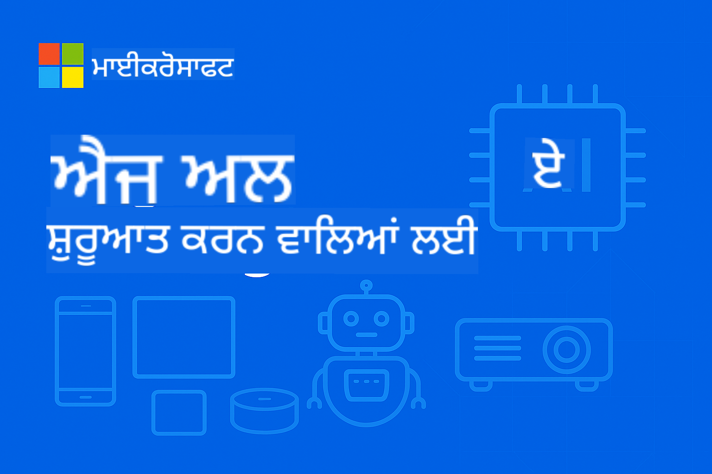

<!--
CO_OP_TRANSLATOR_METADATA:
{
  "original_hash": "dbe223abcd2955df69a08033ff16d389",
  "translation_date": "2025-10-03T07:50:32+00:00",
  "source_file": "README.md",
  "language_code": "pa"
}
-->
# ਬਿਗਿਨਰਜ਼ ਲਈ ਐਜ ਏਆਈ



[](https://GitHub.com/microsoft/edgeai-for-beginners/graphs/contributors)
[](https://GitHub.com/microsoft/edgeai-for-beginners/issues)
[](https://GitHub.com/microsoft/edgeai-for-beginners/pulls)
[](http://makeapullrequest.com)

[](https://GitHub.com/microsoft/edgeai-for-beginners/watchers)
[](https://GitHub.com/microsoft/edgeai-for-beginners/fork)
[](https://GitHub.com/microsoft/edgeai-for-beginners/stargazers)

[](https://discord.com/invite/ByRwuEEgH4)

ਇਹ ਸਰੋਤਾਂ ਦੀ ਵਰਤੋਂ ਸ਼ੁਰੂ ਕਰਨ ਲਈ ਹੇਠਾਂ ਦਿੱਤੇ ਕਦਮਾਂ ਦੀ ਪਾਲਣਾ ਕਰੋ:

1. **ਰੇਪੋਜ਼ਟਰੀ ਫੋਰਕ ਕਰੋ**: ਕਲਿਕ ਕਰੋ [](https://GitHub.com/microsoft/edgeai-for-beginners/fork)
2. **ਰੇਪੋਜ਼ਟਰੀ ਕਲੋਨ ਕਰੋ**: `git clone https://github.com/microsoft/edgeai-for-beginners.git`
3. [**Azure AI Foundry Discord ਵਿੱਚ ਸ਼ਾਮਲ ਹੋਵੋ ਅਤੇ ਮਾਹਰਾਂ ਅਤੇ ਹੋਰ ਡਿਵੈਲਪਰਾਂ ਨਾਲ ਮਿਲੋ**](https://discord.com/invite/ByRwuEEgH4)

### 🌐 ਬਹੁ-ਭਾਸ਼ਾ ਸਹਾਇਤਾ

#### GitHub Action ਰਾਹੀਂ ਸਹਾਇਤ (ਆਟੋਮੈਟਿਕ ਅਤੇ ਹਮੇਸ਼ਾ ਅਪ-ਟੂ-ਡੇਟ)

[ਅਰਬੀ](../ar/README.md) | [ਬੰਗਾਲੀ](../bn/README.md) | [ਬੁਲਗੇਰੀਅਨ](../bg/README.md) | [ਬਰਮੀ (ਮਿਆਂਮਾਰ)](../my/README.md) | [ਚੀਨੀ (ਸਰਲ)](../zh/README.md) | [ਚੀਨੀ (ਪ੍ਰੰਪਰਾਗਤ, ਹਾਂਗ ਕਾਂਗ)](../hk/README.md) | [ਚੀਨੀ (ਪ੍ਰੰਪਰਾਗਤ, ਮਕਾਉ)](../mo/README.md) | [ਚੀਨੀ (ਪ੍ਰੰਪਰਾਗਤ, ਤਾਈਵਾਨ)](../tw/README.md) | [ਕਰੋਏਸ਼ੀਅਨ](../hr/README.md) | [ਚੈਕ](../cs/README.md) | [ਡੈਨਿਸ਼](../da/README.md) | [ਡੱਚ](../nl/README.md) | [ਫਿਨਿਸ਼](../fi/README.md) | [ਫਰੈਂਚ](../fr/README.md) | [ਜਰਮਨ](../de/README.md) | [ਗ੍ਰੀਕ](../el/README.md) | [ਹਿਬਰੂ](../he/README.md) | [ਹਿੰਦੀ](../hi/README.md) | [ਹੰਗਰੀਅਨ](../hu/README.md) | [ਇੰਡੋਨੇਸ਼ੀਅਨ](../id/README.md) | [ਇਟਾਲੀਅਨ](../it/README.md) | [ਜਾਪਾਨੀ](../ja/README.md) | [ਕੋਰੀਅਨ](../ko/README.md) | [ਮਲਾਯ](../ms/README.md) | [ਮਰਾਠੀ](../mr/README.md) | [ਨੇਪਾਲੀ](../ne/README.md) | [ਨਾਰਵੇਜੀਅਨ](../no/README.md) | [ਫਾਰਸੀ (ਫਾਰਸੀ)](../fa/README.md) | [ਪੋਲਿਸ਼](../pl/README.md) | [ਪੁਰਤਗਾਲੀ (ਬ੍ਰਾਜ਼ੀਲ)](../br/README.md) | [ਪੁਰਤਗਾਲੀ (ਪੁਰਤਗਾਲ)](../pt/README.md) | [ਪੰਜਾਬੀ (ਗੁਰਮੁਖੀ)](./README.md) | [ਰੋਮਾਨੀਅਨ](../ro/README.md) | [ਰੂਸੀ](../ru/README.md) | [ਸਰਬੀਅਨ (ਸਿਰਿਲਿਕ)](../sr/README.md) | [ਸਲੋਵਾਕ](../sk/README.md) | [ਸਲੋਵੇਨੀਅਨ](../sl/README.md) | [ਸਪੈਨਿਸ਼](../es/README.md) | [ਸਵਾਹਿਲੀ](../sw/README.md) | [ਸਵੀਡਿਸ਼](../sv/README.md) | [ਟੈਗਾਲੋਗ (ਫਿਲੀਪੀਨੋ)](../tl/README.md) | [ਥਾਈ](../th/README.md) | [ਤੁਰਕੀ](../tr/README.md) | [ਯੂਕਰੇਨੀ](../uk/README.md) | [ਉਰਦੂ](../ur/README.md) | [ਵਿਯਤਨਾਮੀ](../vi/README.md)

**ਜੇ ਤੁਸੀਂ ਹੋਰ ਭਾਸ਼ਾਵਾਂ ਵਿੱਚ ਅਨੁਵਾਦ ਕਰਵਾਉਣਾ ਚਾਹੁੰਦੇ ਹੋ, ਸਹਾਇਤ ਭਾਸ਼ਾਵਾਂ ਦੀ ਸੂਚੀ [ਇੱਥੇ](https://github.com/Azure/co-op-translator/blob/main/getting_started/supported-languages.md) ਦਿੱਤੀ ਗਈ ਹੈ।**

## ਪੇਸ਼ਕਸ਼

**EdgeAI for Beginners** ਵਿੱਚ ਤੁਹਾਡਾ ਸਵਾਗਤ ਹੈ – Edge Artificial Intelligence ਦੀ ਬਦਲਦੀ ਦੁਨੀਆ ਵਿੱਚ ਤੁਹਾਡਾ ਵਿਸਤ੍ਰਿਤ ਯਾਤਰਾ। ਇਹ ਕੋਰਸ ਸ਼ਕਤੀਸ਼ਾਲੀ AI ਸਮਰੱਥਾਵਾਂ ਅਤੇ ਐਜ ਡਿਵਾਈਸਾਂ 'ਤੇ ਅਮਲ ਕਰਨ ਦੇ ਅਧਾਰ ਵਿੱਚ ਪੂਲ ਬਣਾਉਂਦਾ ਹੈ, ਤੁਹਾਨੂੰ ਸਿੱਧੇ ਉਥੇ AI ਦੀ ਸਮਰੱਥਾ ਨੂੰ ਵਰਤਣ ਲਈ ਸਸ਼ਕਤ ਕਰਦਾ ਹੈ ਜਿੱਥੇ ਡੇਟਾ ਬਣਦਾ ਹੈ ਅਤੇ ਫੈਸਲੇ ਲਏ ਜਾਂਦੇ ਹਨ।

### ਤੁਸੀਂ ਕੀ ਸਿੱਖੋਗੇ

ਇਹ ਕੋਰਸ ਤੁਹਾਨੂੰ ਮੁੱਢਲੇ ਧਾਰਨਾਵਾਂ ਤੋਂ ਲੈ ਕੇ ਉਤਪਾਦਨ-ਤਿਆਰ ਅਮਲਾਂ ਤੱਕ ਲੈ ਜਾਂਦਾ ਹੈ, ਜਿਸ ਵਿੱਚ ਸ਼ਾਮਲ ਹੈ:
- **ਛੋਟੇ ਭਾਸ਼ਾ ਮਾਡਲ (SLMs)** ਜੋ ਐਜ ਡਿਪਲਾਇਮੈਂਟ ਲਈ ਅਨੁਕੂਲਿਤ ਹਨ
- **ਹਾਰਡਵੇਅਰ-ਅਵੇਅਰ ਅਪਟਿਮਾਈਜ਼ੇਸ਼ਨ** ਵੱਖ-ਵੱਖ ਪਲੇਟਫਾਰਮਾਂ 'ਤੇ
- **ਰੀਅਲ-ਟਾਈਮ ਇੰਫਰੈਂਸ** ਗੋਪਨੀਯਤਾ-ਸੰਭਾਲ ਸਮਰੱਥਾਵਾਂ ਨਾਲ
- **ਉਤਪਾਦਨ ਡਿਪਲਾਇਮੈਂਟ** ਕਾਰੋਬਾਰੀ ਐਪਲੀਕੇਸ਼ਨਾਂ ਲਈ ਰਣਨੀਤੀਆਂ

### EdgeAI ਕਿਉਂ ਮਹੱਤਵਪੂਰਨ ਹੈ

Edge AI ਇੱਕ ਨਵਾਂ ਮਾਡਲ ਹੈ ਜੋ ਆਧੁਨਿਕ ਸਮੱਸਿਆਵਾਂ ਦਾ ਹੱਲ ਪੇਸ਼ ਕਰਦਾ ਹੈ:
- **ਗੋਪਨੀਯਤਾ ਅਤੇ ਸੁਰੱਖਿਆ**: ਸੰਵੇਦਨਸ਼ੀਲ ਡੇਟਾ ਨੂੰ ਕਲਾਉਡ ਵਿੱਚ ਭੇਜਣ ਤੋਂ ਬਿਨਾਂ ਸਥਾਨਕ ਤੌਰ 'ਤੇ ਪ੍ਰੋਸੈਸ ਕਰੋ
- **ਰੀਅਲ-ਟਾਈਮ ਪ੍ਰਦਰਸ਼ਨ**: ਸਮੇਂ-ਸੰਵੇਦਨਸ਼ੀਲ ਐਪਲੀਕੇਸ਼ਨਾਂ ਲਈ ਨੈਟਵਰਕ ਲੈਟੈਂਸੀ ਨੂੰ ਖਤਮ ਕਰੋ
- **ਲਾਗਤ ਦੀ ਕੁਸ਼ਲਤਾ**: ਬੈਂਡਵਿਡਥ ਅਤੇ ਕਲਾਉਡ ਕੰਪਿਊਟਿੰਗ ਖਰਚੇ ਘਟਾਓ
- **ਲਚਕਦਾਰ ਕਾਰਵਾਈ**: ਨੈਟਵਰਕ ਬੰਦ ਹੋਣ ਦੌਰਾਨ ਕਾਰਗੁਜ਼ਾਰੀ ਜਾਰੀ ਰੱਖੋ
- **ਨਿਯਮਕ ਅਨੁਕੂਲਤਾ**: ਡੇਟਾ ਸਾਰਵਭੌਮਤਾ ਦੀਆਂ ਜ਼ਰੂਰਤਾਂ ਨੂੰ ਪੂਰਾ ਕਰੋ

### Edge AI

Edge AI ਦਾ ਮਤਲਬ ਹੈ AI ਐਲਗੋਰਿਥਮ ਅਤੇ ਭਾਸ਼ਾ ਮਾਡਲਾਂ ਨੂੰ ਸਥਾਨਕ ਤੌਰ 'ਤੇ ਹਾਰਡਵੇਅਰ 'ਤੇ ਚਲਾਉਣਾ, ਜਿੱਥੇ ਡੇਟਾ ਬਣਦਾ ਹੈ, ਕਲਾਉਡ ਸਰੋਤਾਂ 'ਤੇ ਨਿਰਭਰ ਕੀਤੇ ਬਿਨਾਂ। ਇਹ ਲੈਟੈਂਸੀ ਨੂੰ ਘਟਾਉਂਦਾ ਹੈ, ਗੋਪਨੀਯਤਾ ਨੂੰ ਵਧਾਉਂਦਾ ਹੈ, ਅਤੇ ਰੀਅਲ-ਟਾਈਮ ਫੈਸਲੇ ਲੈਣ ਦੀ ਸਮਰੱਥਾ ਦਿੰਦਾ ਹੈ।

### ਮੁੱਖ ਸਿਧਾਂਤ:
- **ਡਿਵਾਈਸ 'ਤੇ ਇੰਫਰੈਂਸ**: AI ਮਾਡਲ ਐਜ ਡਿਵਾਈਸਾਂ (ਫੋਨ, ਰਾਊਟਰ, ਮਾਈਕਰੋਕੰਟਰੋਲਰ, ਉਦਯੋਗਿਕ PCs) 'ਤੇ ਚਲਦੇ ਹਨ
- **ਆਫਲਾਈਨ ਸਮਰੱਥਾ**: ਲਗਾਤਾਰ ਇੰਟਰਨੈਟ ਕਨੈਕਸ਼ਨ ਤੋਂ ਬਿਨਾਂ ਕੰਮ ਕਰਦਾ ਹੈ
- **ਘੱਟ ਲੈਟੈਂਸੀ**: ਰੀਅਲ-ਟਾਈਮ ਸਿਸਟਮਾਂ ਲਈ ਤੁਰੰਤ ਜਵਾਬ
- **ਡੇਟਾ ਸਾਰਵਭੌਮਤਾ**: ਸੰਵੇਦਨਸ਼ੀਲ ਡੇਟਾ ਨੂੰ ਸਥਾਨਕ ਰੱਖਦਾ ਹੈ, ਸੁਰੱਖਿਆ ਅਤੇ ਅਨੁਕੂਲਤਾ ਨੂੰ ਵਧਾਉਂਦਾ ਹੈ

### ਛੋਟੇ ਭਾਸ਼ਾ ਮਾਡਲ (SLMs)

Phi-4, Mistral-7B, ਅਤੇ Gemma ਵਰਗੇ SLMs ਵੱਡੇ LLMs ਦੇ ਅਨੁਕੂਲਿਤ ਸੰਸਕਰਣ ਹਨ—ਜੋ ਇਸ ਲਈ ਤਿਆਰ ਕੀਤੇ ਜਾਂਦੇ ਹਨ:
- **ਸਮੁੱਚੇ ਮੈਮੋਰੀ ਦੀ ਘਟਤ ਵਰਤੋਂ**: ਐਜ ਡਿਵਾਈਸਾਂ ਦੀ ਸੀਮਿਤ ਮੈਮੋਰੀ ਦਾ ਕੁਸ਼ਲਤਾਪੂਰਵਕ ਵਰਤੋਂ
- **ਘੱਟ ਕੰਪਿਊਟ ਦੀ ਮੰਗ**: CPU ਅਤੇ ਐਜ GPU ਪ੍ਰਦਰਸ਼ਨ ਲਈ ਅਨੁਕੂਲਿਤ
- **ਤੇਜ਼ ਸ਼ੁਰੂਆਤ ਸਮਾਂ**: ਜਵਾਬਦੇਹ ਐਪਲੀਕੇਸ਼ਨਾਂ ਲਈ ਤੇਜ਼ ਸ਼ੁਰੂਆਤ

ਇਹ ਸ਼ਕਤੀਸ਼ਾਲੀ NLP ਸਮਰੱਥਾਵਾਂ ਨੂੰ ਖੋਲ੍ਹਦੇ ਹਨ ਜਦੋਂ ਕਿ ਹੇਠਾਂ ਦਿੱਤੇ ਸੀਮਾਵਾਂ ਨੂੰ ਪੂਰਾ ਕਰਦੇ ਹਨ:
- **ਐਮਬੈਡਡ ਸਿਸਟਮ**: IoT ਡਿਵਾਈਸਾਂ ਅਤੇ ਉਦਯੋਗਿਕ ਕੰਟਰੋਲਰ
- **ਮੋਬਾਈਲ ਡਿਵਾਈਸ**: ਸਮਾਰਟਫੋਨ ਅਤੇ ਟੈਬਲਟ ਆਫਲਾਈਨ ਸਮਰੱਥਾਵਾਂ ਨਾਲ
- **IoT ਡਿਵਾਈਸ**: ਸੀਮਿਤ ਸਰੋਤਾਂ ਵਾਲੇ ਸੈਂਸਰ ਅਤੇ ਸਮਾਰਟ ਡਿਵਾਈਸ
- **ਐਜ ਸਰਵਰ**: ਸੀਮਿਤ GPU ਸਰੋਤਾਂ ਵਾਲੇ ਸਥਾਨਕ ਪ੍ਰੋਸੈਸਿੰਗ ਯੂਨਿਟ
- **ਪ੍ਰਸਨਲ ਕੰਪਿਊਟਰ**: ਡੈਸਕਟਾਪ ਅਤੇ ਲੈਪਟਾਪ ਡਿਪਲਾਇਮੈਂਟ ਸਥਿਤੀਆਂ

## ਕੋਰਸ ਮੋਡੀਊਲ ਅਤੇ ਨੈਵੀਗੇਸ਼ਨ

| ਮੋਡੀਊਲ | ਵਿਸ਼ਾ | ਫੋਕਸ ਖੇਤਰ | ਮੁੱਖ ਸਮੱਗਰੀ | ਪੱਧਰ | ਸਮਾਂ |
|--------|-------|------------|-------------|--------|----------|
| [📖 00 ](./introduction.md) | [EdgeAI ਦਾ ਪੇਸ਼ਕਸ਼](./introduction.md) | ਬੁਨਿਆਦ ਅਤੇ ਸੰਦਰਭ | EdgeAI ਝਲਕ • ਉਦਯੋਗਿਕ ਐਪਲੀਕੇਸ਼ਨ • SLM ਪੇਸ਼ਕਸ਼ • ਸਿੱਖਣ ਦੇ ਉਦੇਸ਼ | ਬਿਗਿਨਰ | 1-2 ਘੰਟੇ |
| [📚 01](../../Module01) | [EdgeAI ਬੁਨਿਆਦ](./Module01/README.md) | ਕਲਾਉਡ ਵਿਰੁੱਧ Edge AI ਤੁਲਨਾ | EdgeAI ਬੁਨਿਆਦ • ਅਸਲ ਦੁਨੀਆ ਦੇ ਕੇਸ ਅਧਿਐਨ • ਅਮਲ ਗਾਈਡ • Edge ਡਿਪਲਾਇਮੈਂਟ | ਬਿਗਿਨਰ | 3-4 ਘੰਟੇ |
| [🧠 02](../../Module02) | [SLM ਮਾਡਲ ਬੁਨਿਆਦ](./Module02/README.md) | ਮਾਡਲ ਪਰਿਵਾਰ ਅਤੇ ਆਰਕੀਟੈਕਚਰ | Phi ਪਰਿਵਾਰ • Qwen ਪਰਿਵਾਰ • Gemma ਪਰਿਵਾਰ • BitNET • μModel • Phi-Silica | ਬਿਗਿਨਰ | 4-5 ਘੰਟੇ |
| [🚀 03](../../Module03) | [SLM ਡਿਪਲਾਇਮੈਂਟ ਅਭਿਆਸ](./Module03/README.md) | ਸਥਾਨਕ ਅਤੇ ਕਲਾਉਡ ਡਿਪਲਾਇਮੈਂਟ | ਉੱਚਤ ਸਿੱਖਣ • ਸਥਾਨਕ ਵਾਤਾਵਰਣ • ਕਲਾਉਡ ਡਿਪਲਾਇਮੈਂਟ | ਮੱਧਮ | 4-5 ਘੰਟੇ |
| [⚙️ 04](../../Module04) | [ਮਾਡਲ ਅਪਟਿਮਾਈਜ਼ੇਸ਼ਨ ਟੂਲਕਿਟ](./Module04/README.md) | ਪਲੇਟਫਾਰਮਾਂ ਵਿੱਚ ਅਨੁਕੂਲਤਾ | ਪੇਸ਼ਕਸ਼ • Llama.cpp • Microsoft Olive • OpenVINO • Apple MLX • ਵਰਕਫਲੋ ਸਿੰਥੇਸਿਸ | ਮੱਧਮ | 5-6 ਘੰਟੇ |
| [🔧 05](../../Module05) | [SLMOps ਉਤਪਾਦਨ](./Module05/README.md) | ਉਤਪਾਦਨ ਕਾਰਵਾਈ | SLMOps ਪੇਸ਼ਕਸ਼ • ਮਾਡਲ ਡਿਸਟਿਲੇਸ਼ਨ • ਫਾਈਨ-ਟਿਊਨਿੰਗ • ਉਤਪਾਦਨ ਡਿਪਲਾਇਮੈਂਟ | ਉੱਚਤ | 5-6 ਘੰਟੇ |
| [🤖 06](../../Module06) | [AI ਏਜੰਟ ਅਤੇ ਫੰਕਸ਼ਨ ਕਾਲਿੰਗ](./Module06/README.md) | ਏਜੰਟ ਫਰੇਮਵਰਕ ਅਤੇ MCP | ਏਜੰਟ ਪੇਸ਼ਕਸ਼ • ਫੰਕਸ਼ਨ ਕਾਲਿੰਗ • ਮਾਡਲ ਸੰਦਰਭ ਪ੍ਰੋਟੋਕੋਲ | ਉੱਚਤ | 4-5 ਘੰਟੇ |
| [💻 07](../../Module07) | [ਪਲੇਟਫਾਰਮ ਅਮਲ](./Module07/README.md) | ਪਲੇਟਫਾਰਮਾਂ ਵਿੱਚ ਨਮੂਨੇ | AI ਟੂਲਕਿਟ • Foundry Local • Windows ਡਿਵੈਲਪਮੈਂਟ | ਉੱਚਤ | 3-4 ਘੰਟੇ |
| [🏭 08](../../Module08) | [Foundry Local ਟੂਲਕਿਟ](./Module08/README.md) | ਉਤਪਾਦਨ-ਤਿਆਰ ਨਮੂਨੇ | ਨਮੂਨਾ ਐਪਲੀਕੇਸ਼ਨ (ਵੇਰਵੇ ਹੇਠਾਂ ਵੇਖੋ) | ਮਾਹਰ | 8-10 ਘੰਟੇ |

### 🏭 **ਮੋਡੀਊਲ 08: ਨਮੂਨਾ ਐਪਲੀਕੇਸ਼ਨ**

- [01: REST Chat Quickstart](./Module08/samples/01/README.md)
- [02: OpenAI SDK Integration](./Module08/samples/02/README.md)
- [03: Model Discovery & Benchmarking](./Module08/samples/03/README.md)
- [04: Chainlit RAG Application](./Module08/samples/04/README.md)
- [05: Multi-Agent Orchestration](./Module08/samples/05/README.md)
- [06: Models-as-Tools Router](./Module08/samples/06/README.md)
- [07: Direct API Client](./Module08/samples/07/README.md)
- [08: Windows 11 Chat App](./Module08/samples/08/README.md)
- [09: Advanced Multi-Agent System](./Module08/samples/09/README.md)
- [10: Foundry Tools Framework](./Module08/samples/10/README.md)

### 📊 **ਸਿੱਖਣ ਦਾ ਪਾਥ ਸੰਖੇਪ**
- **ਕੁੱਲ ਸਮਾਂ**: 36-45 ਘੰਟੇ
- **ਬਿਗਿਨਰ ਪਾਥ**: ਮੋਡੀਊਲ 01-02 (7-9 ਘੰਟੇ)  
- **ਮੱਧਮ ਪਾਥ**: ਮੋਡੀਊਲ 03-04 (9-11 ਘੰਟੇ)
- **ਉੱਚਤ ਪਾਥ**: ਮੋਡੀਊਲ 05-07 (12-15 ਘੰਟੇ)

3. **🚀 ਪ੍ਰੋਡਕਸ਼ਨ** (ਮੋਡਿਊਲ 05-06): SLMOps + AI ਏਜੰਟ + ਫੰਕਸ਼ਨ ਕਾਲਿੰਗ  
4. **💻 ਇੰਪਲੀਮੈਂਟੇਸ਼ਨ** (ਮੋਡਿਊਲ 07-08): ਪਲੇਟਫਾਰਮ ਸੈਂਪਲ + Foundry Local ਟੂਲਕਿਟ  

ਹਰ ਮੋਡਿਊਲ ਵਿੱਚ ਸਿਧਾਂਤ, ਹੱਥ-ਅਜਮਾਈ ਕਸਰਤਾਂ, ਅਤੇ ਪ੍ਰੋਡਕਸ਼ਨ-ਤਿਆਰ ਕੋਡ ਸੈਂਪਲ ਸ਼ਾਮਲ ਹਨ।  

## ਕਰੀਅਰ ਪ੍ਰਭਾਵ  

**ਤਕਨੀਕੀ ਭੂਮਿਕਾਵਾਂ**: EdgeAI ਸੋਲੂਸ਼ਨ ਆਰਕੀਟੈਕਟ • ML ਇੰਜੀਨੀਅਰ (Edge) • IoT AI ਡਿਵੈਲਪਰ • ਮੋਬਾਈਲ AI ਡਿਵੈਲਪਰ  

**ਉਦਯੋਗ ਖੇਤਰ**: ਮੈਨੂਫੈਕਚਰਿੰਗ 4.0 • ਹੈਲਥਕੇਅਰ ਟੈਕ • ਸਵੈਚਾਲਿਤ ਸਿਸਟਮ • FinTech • ਕਨਜ਼ਿਊਮਰ ਇਲੈਕਟ੍ਰਾਨਿਕਸ  

**ਪੋਰਟਫੋਲਿਓ ਪ੍ਰੋਜੈਕਟ**: ਮਲਟੀ-ਏਜੰਟ ਸਿਸਟਮ • ਪ੍ਰੋਡਕਸ਼ਨ RAG ਐਪਸ • ਕ੍ਰਾਸ-ਪਲੇਟਫਾਰਮ ਡਿਪਲੌਇਮੈਂਟ • ਪ੍ਰਦਰਸ਼ਨ ਅਪਟਿਮਾਈਜ਼ੇਸ਼ਨ  

## ਰਿਪੋਜ਼ਟਰੀ ਸਟ੍ਰਕਚਰ  

```
edgeai-for-beginners/
├── 📖 introduction.md  # Foundation: EdgeAI Overview & Learning Framework
├── 📚 Module01-04/     # Fundamentals → SLMs → Deployment → Optimization  
├── 🔧 Module05-06/     # SLMOps → AI Agents → Function Calling
├── 💻 Module07/        # Platform Samples (VS Code, Windows, Jetson, Mobile)
├── 🏭 Module08/        # Foundry Local Toolkit + 10 Comprehensive Samples
│   ├── samples/01-06/  # Foundation: REST, SDK, RAG, Agents, Routing
│   └── samples/07-10/  # Advanced: API Client, Windows App, Enterprise Agents, Tools
├── 🌐 translations/    # Multi-language support (8+ languages)
└── 📋 STUDY_GUIDE.md   # Structured learning paths & time allocation
```
  

## ਕੋਰਸ ਹਾਈਲਾਈਟਸ  

✅ **ਤਰੱਕੀਸ਼ੀਲ ਸਿੱਖਿਆ**: ਸਿਧਾਂਤ → ਅਭਿਆਸ → ਪ੍ਰੋਡਕਸ਼ਨ ਡਿਪਲੌਇਮੈਂਟ  
✅ **ਅਸਲੀ ਕੇਸ ਸਟਡੀਜ਼**: Microsoft, Japan Airlines, ਐਨਟਰਪ੍ਰਾਈਜ਼ ਇੰਪਲੀਮੈਂਟੇਸ਼ਨ  
✅ **ਹੱਥ-ਅਜਮਾਈ ਸੈਂਪਲ**: 50+ ਉਦਾਹਰਨਾਂ, 10 ਵਿਸਤ੍ਰਿਤ Foundry Local ਡੈਮੋ  
✅ **ਪ੍ਰਦਰਸ਼ਨ 'ਤੇ ਧਿਆਨ**: 85% ਗਤੀ ਵਿੱਚ ਸੁਧਾਰ, 75% ਆਕਾਰ ਵਿੱਚ ਕਟੌਤੀ  
✅ **ਮਲਟੀ-ਪਲੇਟਫਾਰਮ**: Windows, ਮੋਬਾਈਲ, ਐਮਬੈਡਡ, ਕਲਾਉਡ-ਐਜ ਹਾਈਬ੍ਰਿਡ  
✅ **ਪ੍ਰੋਡਕਸ਼ਨ ਤਿਆਰ**: ਮਾਨੀਟਰਿੰਗ, ਸਕੇਲਿੰਗ, ਸੁਰੱਖਿਆ, ਅਨੁਕੂਲਤਾ ਫਰੇਮਵਰਕ  

📖 **[ਅਧਿਐਨ ਗਾਈਡ ਉਪਲਬਧ](STUDY_GUIDE.md)**: 20-ਘੰਟੇ ਦੀ ਸੰਰਚਿਤ ਸਿੱਖਣ ਯੋਜਨਾ, ਸਮਾਂ ਵੰਡਣ ਦੀ ਸਲਾਹ ਅਤੇ ਸਵੈ-ਮੁਲਾਂਕਣ ਟੂਲ।  

---  

**EdgeAI ਭਵਿੱਖ ਦੇ AI ਡਿਪਲੌਇਮੈਂਟ ਦਾ ਪ੍ਰਤੀਕ ਹੈ**: ਸਥਾਨਕ-ਪਹਿਲਾਂ, ਗੋਪਨੀਯਤਾ-ਸੰਭਾਲਣ ਵਾਲਾ, ਅਤੇ ਕੁਸ਼ਲ। ਇਹ ਹੁਨਰ ਸਿੱਖੋ ਤਾਂ ਜੋ ਅਗਲੀ ਪੀੜ੍ਹੀ ਦੇ ਸਮਰੱਥ ਐਪਲੀਕੇਸ਼ਨ ਬਣਾਉਣ ਵਿੱਚ ਮਾਹਰ ਹੋ ਸਕੋ।  

## ਹੋਰ ਕੋਰਸ  

ਸਾਡੀ ਟੀਮ ਹੋਰ ਕੋਰਸ ਵੀ ਬਣਾਉਂਦੀ ਹੈ! ਵੇਖੋ:  

- [MCP ਫਾਰ ਬਿਗਿਨਰਜ਼](https://github.com/microsoft/mcp-for-beginners)  
- [AI ਏਜੰਟਸ ਫਾਰ ਬਿਗਿਨਰਜ਼](https://github.com/microsoft/ai-agents-for-beginners?WT.mc_id=academic-105485-koreyst)  
- [Generative AI ਫਾਰ ਬਿਗਿਨਰਜ਼ ਯੂਜ਼ਿੰਗ .NET](https://github.com/microsoft/Generative-AI-for-beginners-dotnet?WT.mc_id=academic-105485-koreyst)  
- [Generative AI ਫਾਰ ਬਿਗਿਨਰਜ਼ ਯੂਜ਼ਿੰਗ ਜਾਵਾਸਕ੍ਰਿਪਟ](https://github.com/microsoft/generative-ai-with-javascript?WT.mc_id=academic-105485-koreyst)  
- [Generative AI ਫਾਰ ਬਿਗਿਨਰਜ਼](https://github.com/microsoft/generative-ai-for-beginners?WT.mc_id=academic-105485-koreyst)  
- [ML ਫਾਰ ਬਿਗਿਨਰਜ਼](https://aka.ms/ml-beginners?WT.mc_id=academic-105485-koreyst)  
- [ਡਾਟਾ ਸਾਇੰਸ ਫਾਰ ਬਿਗਿਨਰਜ਼](https://aka.ms/datascience-beginners?WT.mc_id=academic-105485-koreyst)  
- [AI ਫਾਰ ਬਿਗਿਨਰਜ਼](https://aka.ms/ai-beginners?WT.mc_id=academic-105485-koreyst)  
- [ਸਾਇਬਰਸੁਰੱਖਿਆ ਫਾਰ ਬਿਗਿਨਰਜ਼](https://github.com/microsoft/Security-101??WT.mc_id=academic-96948-sayoung)  
- [ਵੈਬ ਡਿਵੈਲਪਮੈਂਟ ਫਾਰ ਬਿਗਿਨਰਜ਼](https://aka.ms/webdev-beginners?WT.mc_id=academic-105485-koreyst)  
- [IoT ਫਾਰ ਬਿਗਿਨਰਜ਼](https://aka.ms/iot-beginners?WT.mc_id=academic-105485-koreyst)  
- [XR ਡਿਵੈਲਪਮੈਂਟ ਫਾਰ ਬਿਗਿਨਰਜ਼](https://github.com/microsoft/xr-development-for-beginners?WT.mc_id=academic-105485-koreyst)  
- [GitHub Copilot ਫਾਰ AI Paired Programming ਵਿੱਚ ਮਾਹਰ ਬਣੋ](https://aka.ms/GitHubCopilotAI?WT.mc_id=academic-105485-koreyst)  
- [GitHub Copilot ਫਾਰ C#/.NET ਡਿਵੈਲਪਰਜ਼ ਵਿੱਚ ਮਾਹਰ ਬਣੋ](https://github.com/microsoft/mastering-github-copilot-for-dotnet-csharp-developers?WT.mc_id=academic-105485-koreyst)  
- [Choose Your Own Copilot Adventure](https://github.com/microsoft/CopilotAdventures?WT.mc_id=academic-105485-koreyst)  

## ਮਦਦ ਪ੍ਰਾਪਤ ਕਰਨਾ  

ਜੇ ਤੁਸੀਂ ਫਸ ਜਾਓ ਜਾਂ AI ਐਪਸ ਬਣਾਉਣ ਬਾਰੇ ਕੋਈ ਸਵਾਲ ਹੋਵੇ, ਤਾਂ ਸ਼ਾਮਲ ਹੋਵੋ:  

[](https://aka.ms/foundry/discord)  

ਜੇ ਤੁਹਾਡੇ ਕੋਲ ਉਤਪਾਦ ਫੀਡਬੈਕ ਹੈ ਜਾਂ ਬਣਾਉਣ ਦੌਰਾਨ ਕੋਈ ਗਲਤੀ ਆਉਂਦੀ ਹੈ, ਤਾਂ ਜਾਓ:  

[](https://aka.ms/foundry/forum)  

---

**ਅਸਵੀਕਰਤੀ**:  
ਇਹ ਦਸਤਾਵੇਜ਼ AI ਅਨੁਵਾਦ ਸੇਵਾ [Co-op Translator](https://github.com/Azure/co-op-translator) ਦੀ ਵਰਤੋਂ ਕਰਕੇ ਅਨੁਵਾਦ ਕੀਤਾ ਗਿਆ ਹੈ। ਹਾਲਾਂਕਿ ਅਸੀਂ ਸਹੀ ਹੋਣ ਦੀ ਕੋਸ਼ਿਸ਼ ਕਰਦੇ ਹਾਂ, ਕਿਰਪਾ ਕਰਕੇ ਧਿਆਨ ਦਿਓ ਕਿ ਸਵੈਚਾਲਿਤ ਅਨੁਵਾਦਾਂ ਵਿੱਚ ਗਲਤੀਆਂ ਜਾਂ ਅਸੁਚਤਤਾਵਾਂ ਹੋ ਸਕਦੀਆਂ ਹਨ। ਇਸ ਦਸਤਾਵੇਜ਼ ਦਾ ਮੂਲ ਰੂਪ ਇਸਦੀ ਮੂਲ ਭਾਸ਼ਾ ਵਿੱਚ ਅਧਿਕਾਰਤ ਸਰੋਤ ਮੰਨਿਆ ਜਾਣਾ ਚਾਹੀਦਾ ਹੈ। ਮਹੱਤਵਪੂਰਨ ਜਾਣਕਾਰੀ ਲਈ, ਪੇਸ਼ੇਵਰ ਮਨੁੱਖੀ ਅਨੁਵਾਦ ਦੀ ਸਿਫਾਰਸ਼ ਕੀਤੀ ਜਾਂਦੀ ਹੈ। ਇਸ ਅਨੁਵਾਦ ਦੀ ਵਰਤੋਂ ਤੋਂ ਪੈਦਾ ਹੋਣ ਵਾਲੇ ਕਿਸੇ ਵੀ ਗਲਤਫਹਿਮੀ ਜਾਂ ਗਲਤ ਵਿਆਖਿਆ ਲਈ ਅਸੀਂ ਜ਼ਿੰਮੇਵਾਰ ਨਹੀਂ ਹਾਂ।