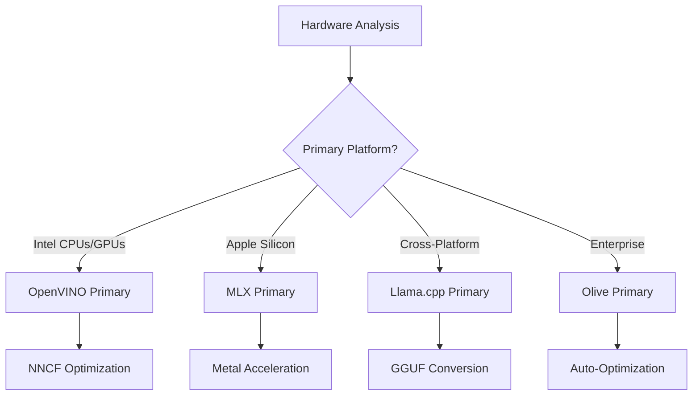
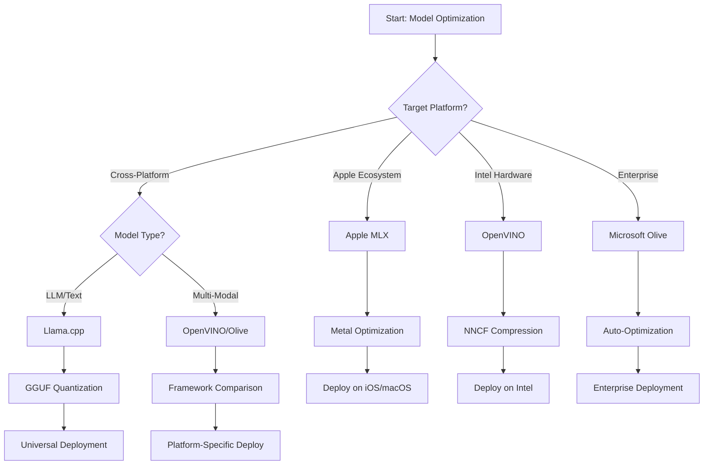
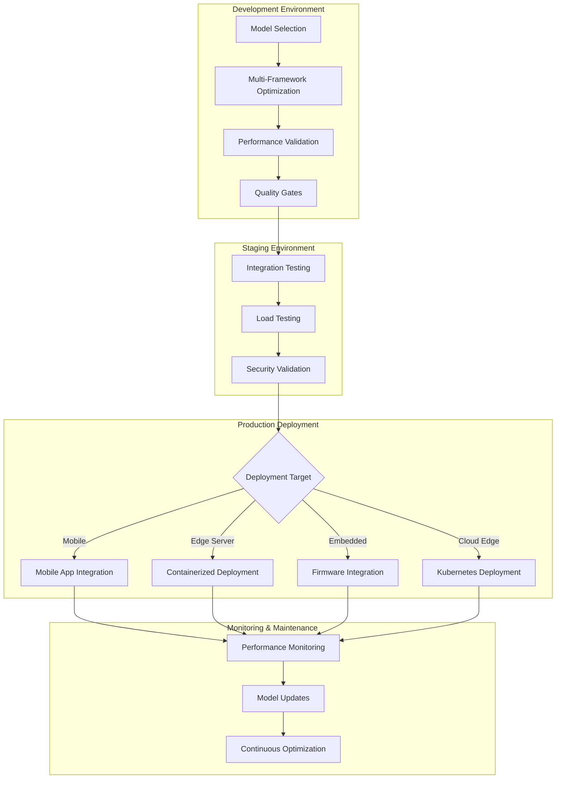

<!--
CO_OP_TRANSLATOR_METADATA:
{
  "original_hash": "6719c4a7e44b948230ac5f5cab3699bd",
  "translation_date": "2025-09-17T15:38:21+00:00",
  "source_file": "Module04/06.workflow-synthesis.md",
  "language_code": "pl"
}
-->
# Sekcja 6: Synteza przepływu pracy w rozwoju Edge AI

## Spis treści
1. [Wprowadzenie](../../../Module04)
2. [Cele nauki](../../../Module04)
3. [Przegląd zintegrowanego przepływu pracy](../../../Module04)
4. [Macierz wyboru frameworków](../../../Module04)
5. [Synteza najlepszych praktyk](../../../Module04)
6. [Przewodnik strategii wdrożenia](../../../Module04)
7. [Przepływ optymalizacji wydajności](../../../Module04)
8. [Lista kontrolna gotowości produkcyjnej](../../../Module04)
9. [Rozwiązywanie problemów i monitorowanie](../../../Module04)
10. [Przygotowanie pipeline'u Edge AI na przyszłość](../../../Module04)

## Wprowadzenie

Rozwój Edge AI wymaga zaawansowanego zrozumienia wielu frameworków optymalizacyjnych, strategii wdrożeniowych oraz aspektów sprzętowych. Ta kompleksowa synteza łączy wiedzę z Llama.cpp, Microsoft Olive, OpenVINO i Apple MLX, tworząc zintegrowany przepływ pracy, który maksymalizuje efektywność, utrzymuje jakość i zapewnia sukces w środowisku produkcyjnym.

W trakcie tego kursu zgłębialiśmy poszczególne frameworki optymalizacyjne, każdy z unikalnymi zaletami i specjalistycznymi zastosowaniami. Jednak rzeczywiste projekty Edge AI często wymagają połączenia technik z różnych frameworków lub podejmowania strategicznych decyzji dotyczących wyboru najlepszego podejścia dla określonych ograniczeń i wymagań.

Ta sekcja syntetyzuje zbiorową wiedzę z wszystkich frameworków w formie praktycznych przepływów pracy, drzew decyzyjnych i najlepszych praktyk, które umożliwiają efektywne i skuteczne budowanie rozwiązań Edge AI gotowych do produkcji. Niezależnie od tego, czy optymalizujesz dla urządzeń mobilnych, systemów wbudowanych czy serwerów brzegowych, ten przewodnik dostarcza strategicznych ram do podejmowania świadomych decyzji na każdym etapie cyklu rozwoju.

## Cele nauki

Na koniec tej sekcji będziesz w stanie:

### Podejmowanie strategicznych decyzji
- **Ocenić i wybrać** optymalny framework optymalizacyjny na podstawie wymagań projektu, ograniczeń sprzętowych i scenariuszy wdrożeniowych
- **Projektować kompleksowe przepływy pracy**, które integrują różne techniki optymalizacyjne dla maksymalnej efektywności
- **Analizować kompromisy** między dokładnością modelu, szybkością wnioskowania, użyciem pamięci a złożonością wdrożenia w różnych frameworkach

### Integracja przepływu pracy
- **Implementować zintegrowane pipeline'y rozwojowe**, które wykorzystują zalety różnych frameworków optymalizacyjnych
- **Tworzyć powtarzalne przepływy pracy** dla spójnej optymalizacji modeli i wdrożenia w różnych środowiskach
- **Ustanawiać bramy jakości** i procesy walidacyjne, aby zapewnić, że zoptymalizowane modele spełniają wymagania produkcyjne

### Optymalizacja wydajności
- **Stosować systematyczne strategie optymalizacyjne** z użyciem kwantyzacji, przycinania i technik przyspieszenia specyficznych dla sprzętu
- **Monitorować i benchmarkować** wydajność modeli na różnych poziomach optymalizacji i celach wdrożeniowych
- **Optymalizować dla konkretnych platform sprzętowych**, takich jak CPU, GPU, NPU i specjalistyczne akceleratory brzegowe

### Wdrożenie produkcyjne
- **Projektować skalowalne architektury wdrożeniowe**, które obsługują różne formaty modeli i silniki wnioskowania
- **Implementować monitorowanie i obserwowalność** dla aplikacji Edge AI w środowiskach produkcyjnych
- **Ustanawiać przepływy pracy konserwacyjne** dla aktualizacji modeli, monitorowania wydajności i optymalizacji systemu

### Doskonałość międzyplatformowa
- **Wdrażać zoptymalizowane modele** na różnych platformach sprzętowych, zachowując spójną wydajność
- **Obsługiwać optymalizacje specyficzne dla platform**, takich jak Windows, macOS, Linux, urządzenia mobilne i systemy wbudowane
- **Tworzyć warstwy abstrakcji**, które umożliwiają płynne wdrożenie w różnych środowiskach brzegowych

## Przegląd zintegrowanego przepływu pracy

### Faza 1: Analiza wymagań i wybór frameworku

Podstawą udanego wdrożenia Edge AI jest dokładna analiza wymagań, która informuje o wyborze frameworku i strategii optymalizacji.

#### 1.1 Ocena sprzętu


**Kluczowe aspekty:**
- **Architektura CPU**: możliwości x86, ARM, Apple Silicon
- **Dostępność akceleratorów**: GPU, NPU, VPU, specjalistyczne układy AI
- **Ograniczenia pamięci**: ograniczenia RAM, pojemność pamięci masowej
- **Budżet energetyczny**: żywotność baterii, ograniczenia termiczne
- **Łączność**: wymagania offline, ograniczenia przepustowości

#### 1.2 Macierz wymagań aplikacji

| Wymaganie | Llama.cpp | Microsoft Olive | OpenVINO | Apple MLX |
|-----------|-----------|-----------------|----------|-----------|
| Międzyplatformowość | ✅ Doskonała | ⚡ Dobra | ⚡ Dobra | ❌ Tylko Apple |
| Integracja korporacyjna | ⚡ Podstawowa | ✅ Doskonała | ✅ Doskonała | ⚡ Ograniczona |
| Wdrożenie mobilne | ✅ Doskonałe | ⚡ Dobre | ⚡ Dobre | ✅ iOS Doskonałe |
| Wnioskowanie w czasie rzeczywistym | ✅ Doskonałe | ✅ Doskonałe | ✅ Doskonałe | ✅ Doskonałe |
| Różnorodność modeli | ✅ Skupienie na LLM | ✅ Wszystkie modele | ✅ Wszystkie modele | ✅ Skupienie na LLM |
| Łatwość użycia | ✅ Proste | ✅ Zautomatyzowane | ⚡ Umiarkowane | ✅ Proste |

### Faza 2: Przygotowanie i optymalizacja modelu

#### 2.1 Uniwersalny pipeline oceny modelu

```python
# Universal Model Assessment Framework
class EdgeAIModelAssessment:
    def __init__(self, model_path, target_hardware):
        self.model_path = model_path
        self.target_hardware = target_hardware
        self.optimization_frameworks = []
        
    def assess_model_characteristics(self):
        """Analyze model size, architecture, and complexity"""
        return {
            'model_size': self.get_model_size(),
            'parameter_count': self.get_parameter_count(),
            'architecture_type': self.detect_architecture(),
            'quantization_compatibility': self.check_quantization_support()
        }
    
    def recommend_optimization_strategy(self):
        """Recommend optimal frameworks and techniques"""
        characteristics = self.assess_model_characteristics()
        
        if self.target_hardware.startswith('apple'):
            return self.mlx_optimization_strategy(characteristics)
        elif self.target_hardware.startswith('intel'):
            return self.openvino_optimization_strategy(characteristics)
        elif characteristics['model_size'] > 7_000_000_000:  # 7B+ parameters
            return self.enterprise_optimization_strategy(characteristics)
        else:
            return self.lightweight_optimization_strategy(characteristics)
```

#### 2.2 Pipeline optymalizacji wieloframeworkowej

**Podejście sekwencyjne do optymalizacji:**
1. **Początkowa konwersja**: Konwersja do formatu pośredniego (ONNX, jeśli to możliwe)
2. **Optymalizacja specyficzna dla frameworku**: Zastosowanie technik specjalistycznych
3. **Walidacja krzyżowa**: Weryfikacja wydajności na docelowych platformach
4. **Końcowe pakowanie**: Przygotowanie do wdrożenia

```bash
# Multi-Framework Optimization Script
#!/bin/bash

MODEL_NAME="phi-3-mini"
BASE_MODEL="microsoft/Phi-3-mini-4k-instruct"

# Phase 1: ONNX Conversion (Universal)
python convert_to_onnx.py --model $BASE_MODEL --output models/onnx/

# Phase 2: Platform-Specific Optimization
if [[ "$TARGET_PLATFORM" == "intel" ]]; then
    # OpenVINO Optimization
    python optimize_openvino.py --input models/onnx/ --output models/openvino/
elif [[ "$TARGET_PLATFORM" == "apple" ]]; then
    # MLX Optimization
    python optimize_mlx.py --input $BASE_MODEL --output models/mlx/
elif [[ "$TARGET_PLATFORM" == "cross" ]]; then
    # Llama.cpp Optimization
    python convert_to_gguf.py --input models/onnx/ --output models/gguf/
fi

# Phase 3: Validation
python validate_optimization.py --original $BASE_MODEL --optimized models/$TARGET_PLATFORM/
```

### Faza 3: Walidacja wydajności i benchmarki

#### 3.1 Kompleksowy framework benchmarkowy

```python
class EdgeAIBenchmark:
    def __init__(self, optimized_models):
        self.models = optimized_models
        self.metrics = {
            'inference_time': [],
            'memory_usage': [],
            'accuracy_score': [],
            'throughput': [],
            'energy_consumption': []
        }
    
    def run_comprehensive_benchmark(self):
        """Execute standardized benchmarks across all optimized models"""
        test_inputs = self.generate_test_inputs()
        
        for model_framework, model_path in self.models.items():
            print(f"Benchmarking {model_framework}...")
            
            # Latency Testing
            latency = self.measure_inference_latency(model_path, test_inputs)
            
            # Memory Profiling
            memory = self.profile_memory_usage(model_path)
            
            # Accuracy Validation
            accuracy = self.validate_model_accuracy(model_path, test_inputs)
            
            # Throughput Analysis
            throughput = self.measure_throughput(model_path)
            
            self.record_metrics(model_framework, latency, memory, accuracy, throughput)
    
    def generate_optimization_report(self):
        """Create comprehensive comparison report"""
        report = {
            'recommendations': self.analyze_performance_trade_offs(),
            'deployment_guidance': self.generate_deployment_recommendations(),
            'monitoring_requirements': self.define_monitoring_metrics()
        }
        return report
```

## Macierz wyboru frameworków

### Drzewo decyzyjne dla wyboru frameworku



### Kompleksowe kryteria wyboru

#### 1. Dopasowanie do głównego zastosowania

**Duże modele językowe (LLM):**
- **Llama.cpp**: Najlepszy dla wdrożeń skoncentrowanych na CPU i międzyplatformowych
- **Apple MLX**: Optymalny dla Apple Silicon z pamięcią zunifikowaną
- **OpenVINO**: Doskonały dla sprzętu Intel z optymalizacją NNCF
- **Microsoft Olive**: Idealny dla korporacyjnych przepływów pracy z automatyzacją

**Modele multimodalne:**
- **OpenVINO**: Kompleksowe wsparcie dla wizji, audio i tekstu
- **Microsoft Olive**: Optymalizacja na poziomie korporacyjnym dla złożonych pipeline'ów
- **Llama.cpp**: Ograniczony do modeli tekstowych
- **Apple MLX**: Rosnące wsparcie dla aplikacji multimodalnych

#### 2. Macierz platform sprzętowych

| Platforma | Główny framework | Opcja dodatkowa | Funkcje specjalistyczne |
|-----------|------------------|------------------|-------------------------|
| Intel CPU/GPU | OpenVINO | Microsoft Olive | Kompresja NNCF, optymalizacja Intel |
| NVIDIA GPU | Microsoft Olive | OpenVINO | Przyspieszenie CUDA, funkcje korporacyjne |
| Apple Silicon | Apple MLX | Llama.cpp | Shadery Metal, pamięć zunifikowana |
| ARM Mobile | Llama.cpp | OpenVINO | Międzyplatformowość, minimalne zależności |
| Edge TPU | OpenVINO | Microsoft Olive | Wsparcie dla specjalistycznych akceleratorów |
| Wbudowany ARM | Llama.cpp | OpenVINO | Minimalny ślad, efektywne wnioskowanie |

#### 3. Preferencje przepływu pracy rozwojowej

**Szybkie prototypowanie:**
1. **Llama.cpp**: Najszybsza konfiguracja, natychmiastowe wyniki
2. **Apple MLX**: Proste API Python, szybka iteracja
3. **Microsoft Olive**: Zautomatyzowana optymalizacja, minimalna konfiguracja
4. **OpenVINO**: Bardziej złożona konfiguracja, kompleksowe funkcje

**Produkcja korporacyjna:**
1. **Microsoft Olive**: Funkcje korporacyjne, integracja z Azure
2. **OpenVINO**: Ekosystem Intel, kompleksowe narzędzia
3. **Apple MLX**: Aplikacje korporacyjne specyficzne dla Apple
4. **Llama.cpp**: Proste wdrożenie, ograniczone funkcje korporacyjne

## Synteza najlepszych praktyk

### Uniwersalne zasady optymalizacji

#### 1. Strategia progresywnej optymalizacji

```python
class ProgressiveOptimization:
    def __init__(self, base_model):
        self.base_model = base_model
        self.optimization_stages = [
            'baseline_measurement',
            'format_conversion',
            'quantization_optimization',
            'hardware_acceleration',
            'production_validation'
        ]
    
    def execute_progressive_optimization(self):
        """Apply optimization techniques incrementally"""
        
        # Stage 1: Baseline Measurement
        baseline_metrics = self.measure_baseline_performance()
        
        # Stage 2: Format Conversion
        converted_model = self.convert_to_optimal_format()
        conversion_metrics = self.measure_performance(converted_model)
        
        # Stage 3: Quantization
        quantized_model = self.apply_quantization(converted_model)
        quantization_metrics = self.measure_performance(quantized_model)
        
        # Stage 4: Hardware Acceleration
        accelerated_model = self.enable_hardware_acceleration(quantized_model)
        acceleration_metrics = self.measure_performance(accelerated_model)
        
        # Stage 5: Validation
        production_ready = self.validate_for_production(accelerated_model)
        
        return self.compile_optimization_report(
            baseline_metrics, conversion_metrics, 
            quantization_metrics, acceleration_metrics
        )
```

#### 2. Implementacja bram jakości

**Bramy zachowania dokładności:**
- Utrzymanie >95% dokładności oryginalnego modelu
- Walidacja na reprezentatywnych zestawach testowych
- Implementacja testów A/B dla walidacji produkcyjnej

**Bramy poprawy wydajności:**
- Osiągnięcie minimum 2x poprawy szybkości
- Redukcja użycia pamięci o co najmniej 50%
- Walidacja spójności czasu wnioskowania

**Bramy gotowości produkcyjnej:**
- Przejście testów obciążeniowych
- Demonstracja stabilnej wydajności w czasie
- Walidacja wymagań dotyczących bezpieczeństwa i prywatności

### Integracja najlepszych praktyk specyficznych dla frameworków

#### 1. Synteza strategii kwantyzacji

```python
# Unified Quantization Approach
class UnifiedQuantizationStrategy:
    def __init__(self, model, target_platform):
        self.model = model
        self.platform = target_platform
        
    def select_optimal_quantization(self):
        """Choose best quantization based on platform and requirements"""
        
        if self.platform == 'apple_silicon':
            return self.mlx_quantization_strategy()
        elif self.platform == 'intel_hardware':
            return self.openvino_quantization_strategy()
        elif self.platform == 'cross_platform':
            return self.llamacpp_quantization_strategy()
        else:
            return self.olive_quantization_strategy()
    
    def mlx_quantization_strategy(self):
        """Apple MLX-specific quantization"""
        return {
            'method': 'mlx_quantize',
            'precision': 'int4',
            'group_size': 64,
            'optimization_target': 'unified_memory'
        }
    
    def openvino_quantization_strategy(self):
        """OpenVINO NNCF quantization"""
        return {
            'method': 'nncf_quantize',
            'precision': 'int8',
            'calibration_method': 'post_training',
            'optimization_target': 'intel_hardware'
        }
```

#### 2. Optymalizacja przyspieszenia sprzętowego

**Synteza optymalizacji CPU:**
- **Instrukcje SIMD**: Wykorzystanie zoptymalizowanych jąder w różnych frameworkach
- **Przepustowość pamięci**: Optymalizacja układów danych dla efektywności pamięci podręcznej
- **Wątkowanie**: Równoważenie równoległości z ograniczeniami zasobów

**Najlepsze praktyki przyspieszenia GPU:**
- **Przetwarzanie wsadowe**: Maksymalizacja przepustowości przy odpowiednich rozmiarach wsadu
- **Zarządzanie pamięcią**: Optymalizacja alokacji pamięci GPU i transferów
- **Precyzja**: Użycie FP16, jeśli obsługiwane, dla lepszej wydajności

**Optymalizacja NPU/specjalistycznych akceleratorów:**
- **Architektura modelu**: Zapewnienie zgodności z możliwościami akceleratora
- **Przepływ danych**: Optymalizacja pipeline'ów wejścia/wyjścia dla efektywności akceleratora
- **Strategie awaryjne**: Implementacja awaryjnego przejścia na CPU dla nieobsługiwanych operacji

## Przewodnik strategii wdrożenia

### Uniwersalna architektura wdrożeniowa



### Wzorce wdrożenia specyficzne dla platform

#### 1. Strategia wdrożenia mobilnego

```yaml
# Mobile Deployment Configuration
mobile_deployment:
  ios:
    framework: apple_mlx
    optimization:
      quantization: int4
      memory_mapping: true
      background_execution: limited
    packaging:
      format: mlx
      bundle_size: <50MB
      
  android:
    framework: llama_cpp
    optimization:
      quantization: q4_k_m
      threading: android_optimized
      memory_management: conservative
    packaging:
      format: gguf
      apk_size: <100MB
      
  cross_platform:
    framework: onnx_runtime
    optimization:
      quantization: int8
      execution_provider: cpu
    packaging:
      format: onnx
      shared_libraries: minimal
```

#### 2. Wdrożenie serwera brzegowego

```yaml
# Edge Server Deployment Configuration
edge_server:
  intel_based:
    framework: openvino
    optimization:
      quantization: int8
      acceleration: cpu_gpu_auto
      batch_processing: dynamic
    deployment:
      container: openvino_runtime
      orchestration: kubernetes
      scaling: horizontal
      
  nvidia_based:
    framework: microsoft_olive
    optimization:
      quantization: int4
      acceleration: cuda
      tensor_parallelism: true
    deployment:
      container: nvidia_triton
      orchestration: kubernetes
      scaling: gpu_aware
```

### Najlepsze praktyki konteneryzacji

```dockerfile
# Multi-Framework Edge AI Container
FROM ubuntu:22.04 as base

# Install common dependencies
RUN apt-get update && apt-get install -y \
    python3 \
    python3-pip \
    build-essential \
    cmake \
    && rm -rf /var/lib/apt/lists/*

# Framework-specific stages
FROM base as openvino
RUN pip install openvino nncf optimum[intel]

FROM base as llamacpp
RUN git clone https://github.com/ggerganov/llama.cpp.git \
    && cd llama.cpp && make LLAMA_OPENBLAS=1

FROM base as olive
RUN pip install olive-ai[auto-opt] onnxruntime-genai

# Production stage with selected framework
FROM openvino as production
COPY models/ /app/models/
COPY src/ /app/src/
WORKDIR /app

EXPOSE 8080
CMD ["python3", "src/inference_server.py"]
```

## Przepływ optymalizacji wydajności

### Systematyczne dostrajanie wydajności

#### 1. Pipeline profilowania wydajności

```python
class EdgeAIPerformanceProfiler:
    def __init__(self, model_path, framework):
        self.model_path = model_path
        self.framework = framework
        self.profiling_results = {}
    
    def comprehensive_profiling(self):
        """Execute comprehensive performance analysis"""
        
        # CPU Profiling
        cpu_profile = self.profile_cpu_usage()
        
        # Memory Profiling
        memory_profile = self.profile_memory_usage()
        
        # Inference Latency
        latency_profile = self.profile_inference_latency()
        
        # Throughput Analysis
        throughput_profile = self.profile_throughput()
        
        # Energy Consumption (where available)
        energy_profile = self.profile_energy_consumption()
        
        return self.compile_performance_report(
            cpu_profile, memory_profile, latency_profile,
            throughput_profile, energy_profile
        )
    
    def identify_bottlenecks(self):
        """Automatically identify performance bottlenecks"""
        bottlenecks = []
        
        if self.profiling_results['cpu_utilization'] > 80:
            bottlenecks.append('cpu_bound')
        
        if self.profiling_results['memory_usage'] > 90:
            bottlenecks.append('memory_bound')
        
        if self.profiling_results['inference_variance'] > 20:
            bottlenecks.append('inconsistent_performance')
        
        return self.generate_optimization_recommendations(bottlenecks)
```

#### 2. Zautomatyzowany pipeline optymalizacji

```python
class AutomatedOptimizationPipeline:
    def __init__(self, base_model, target_constraints):
        self.base_model = base_model
        self.constraints = target_constraints
        self.optimization_history = []
    
    def execute_optimization_search(self):
        """Systematically search optimization space"""
        
        optimization_candidates = [
            {'quantization': 'int8', 'pruning': 0.1},
            {'quantization': 'int4', 'pruning': 0.2},
            {'quantization': 'int8', 'acceleration': 'gpu'},
            {'quantization': 'int4', 'acceleration': 'npu'}
        ]
        
        best_configuration = None
        best_score = 0
        
        for config in optimization_candidates:
            optimized_model = self.apply_optimization(config)
            score = self.evaluate_optimization(optimized_model)
            
            if score > best_score and self.meets_constraints(optimized_model):
                best_score = score
                best_configuration = config
            
            self.optimization_history.append({
                'config': config,
                'score': score,
                'model': optimized_model
            })
        
        return best_configuration, self.optimization_history
```

### Optymalizacja wieloobiektowa

#### 1. Optymalizacja Pareto dla Edge AI

```python
class ParetoOptimization:
    def __init__(self, objectives=['speed', 'accuracy', 'memory']):
        self.objectives = objectives
        self.pareto_frontier = []
    
    def find_pareto_optimal_solutions(self, optimization_results):
        """Identify Pareto-optimal configurations"""
        
        for result in optimization_results:
            is_dominated = False
            
            for frontier_point in self.pareto_frontier:
                if self.dominates(frontier_point, result):
                    is_dominated = True
                    break
            
            if not is_dominated:
                # Remove dominated points from frontier
                self.pareto_frontier = [
                    point for point in self.pareto_frontier 
                    if not self.dominates(result, point)
                ]
                
                self.pareto_frontier.append(result)
        
        return self.pareto_frontier
    
    def recommend_configuration(self, user_preferences):
        """Recommend configuration based on user preferences"""
        
        weighted_scores = []
        for config in self.pareto_frontier:
            score = sum(
                user_preferences[obj] * config['metrics'][obj] 
                for obj in self.objectives
            )
            weighted_scores.append((score, config))
        
        return max(weighted_scores, key=lambda x: x[0])[1]
```

## Lista kontrolna gotowości produkcyjnej

### Kompleksowa walidacja produkcyjna

#### 1. Zapewnienie jakości modelu

```python
class ProductionReadinessValidator:
    def __init__(self, optimized_model, production_requirements):
        self.model = optimized_model
        self.requirements = production_requirements
        self.validation_results = {}
    
    def validate_model_quality(self):
        """Comprehensive model quality validation"""
        
        # Accuracy Validation
        accuracy_result = self.validate_accuracy()
        
        # Performance Validation
        performance_result = self.validate_performance()
        
        # Robustness Testing
        robustness_result = self.validate_robustness()
        
        # Security Assessment
        security_result = self.validate_security()
        
        # Compliance Verification
        compliance_result = self.validate_compliance()
        
        return self.compile_validation_report(
            accuracy_result, performance_result, robustness_result,
            security_result, compliance_result
        )
    
    def generate_certification_report(self):
        """Generate production certification report"""
        return {
            'model_signature': self.generate_model_signature(),
            'validation_timestamp': datetime.now(),
            'validation_results': self.validation_results,
            'deployment_approval': self.check_deployment_approval(),
            'monitoring_requirements': self.define_monitoring_requirements()
        }
```

#### 2. Lista kontrolna wdrożenia produkcyjnego

**Walidacja przed wdrożeniem:**
- [ ] Dokładność modelu spełnia minimalne wymagania (>95% wartości bazowej)
- [ ] Osiągnięto cele wydajnościowe (opóźnienie, przepustowość, pamięć)
- [ ] Zidentyfikowano i zminimalizowano podatności na zagrożenia bezpieczeństwa
- [ ] Przeprowadzono testy obciążeniowe pod spodziewanym obciążeniem
- [ ] Przetestowano scenariusze awaryjne i zweryfikowano procedury odzyskiwania
- [ ] Skonfigurowano systemy monitorowania i alertów
- [ ] Przetestowano i udokumentowano procedury wycofania

**Proces wdrożenia:**
- [ ] Zaimplementowano strategię wdrożenia blue-green
- [ ] Skonfigurowano stopniowe zwiększanie ruchu
- [ ] Aktywne pulpity monitorowania w czasie rzeczywistym
- [ ] Ustanowiono wartości bazowe wydajności
- [ ] Zdefiniowano progi wskaźników błędów
- [ ] Skonfigurowano automatyczne wyzwalacze wycofania

**Monitorowanie po wdrożeniu:**
- [ ] Aktywne wykrywanie dryfu modelu
- [ ] Skonfigurowano alerty degradacji wydajności
- [ ] Włączono monitorowanie wykorzystania zasobów
- [ ] Śledzenie metryk doświadczenia użytkownika
- [ ] Utrzymanie wersjonowania i rodowodu modelu
- [ ] Zaplanowano regularne przeglądy wydajności modelu

### Ciągła integracja/ciągłe wdrożenie (CI/CD)

```yaml
# Edge AI CI/CD Pipeline Configuration
edge_ai_pipeline:
  stages:
    - model_validation
    - optimization
    - testing
    - staging_deployment
    - production_deployment
    - monitoring
  
  model_validation:
    accuracy_threshold: 0.95
    performance_baseline: required
    security_scan: enabled
    
  optimization:
    frameworks:
      - llama_cpp
      - openvino
      - microsoft_olive
    validation:
      cross_validation: enabled
      performance_comparison: required
      
  testing:
    unit_tests: comprehensive
    integration_tests: full_pipeline
    load_tests: production_scale
    security_tests: comprehensive
    
  deployment:
    strategy: blue_green
    traffic_ramping: gradual
    rollback: automatic
    monitoring: real_time
```

## Rozwiązywanie problemów i monitorowanie

### Uniwersalny framework rozwiązywania problemów

#### 1. Typowe problemy i rozwiązania

**Problemy z wydajnością:**
```python
class PerformanceTroubleshooter:
    def __init__(self, model_metrics):
        self.metrics = model_metrics
        
    def diagnose_performance_issues(self):
        """Systematic performance issue diagnosis"""
        
        issues = []
        
        # High latency diagnosis
        if self.metrics['avg_latency'] > self.metrics['target_latency']:
            issues.append(self.diagnose_latency_issues())
        
        # Memory usage diagnosis
        if self.metrics['memory_usage'] > self.metrics['memory_limit']:
            issues.append(self.diagnose_memory_issues())
        
        # Throughput diagnosis
        if self.metrics['throughput'] < self.metrics['target_throughput']:
            issues.append(self.diagnose_throughput_issues())
        
        return self.generate_resolution_plan(issues)
    
    def diagnose_latency_issues(self):
        """Specific latency troubleshooting"""
        potential_causes = []
        
        if self.metrics['cpu_utilization'] > 80:
            potential_causes.append('cpu_bottleneck')
        
        if self.metrics['memory_bandwidth'] > 90:
            potential_causes.append('memory_bandwidth_limit')
        
        if self.metrics['model_size'] > self.metrics['optimal_size']:
            potential_causes.append('model_too_large')
        
        return {
            'issue': 'high_latency',
            'causes': potential_causes,
            'solutions': self.generate_latency_solutions(potential_causes)
        }
```

**Rozwiązywanie problemów specyficznych dla frameworków:**

| Problem | Llama.cpp | Microsoft Olive | OpenVINO | Apple MLX |
|---------|-----------|-----------------|----------|-----------|
| Problemy z pamięcią | Zmniejsz długość kontekstu | Zmniejsz rozmiar wsadu | Włącz buforowanie | Użyj mapowania pamięci |
| Wolne wnioskowanie | Włącz SIMD | Sprawdź kwantyzację | Optymalizuj wątkowanie | Włącz Metal |
| Utrata dokładności | Wyższa kwantyzacja | Ponowne trenowanie z QAT | Zwiększ kalibrację | Dostosuj po kwantyzacji |
| Kompatybilność | Sprawdź format modelu | Zweryfikuj wersję frameworku | Zaktualizuj sterowniki | Sprawdź wersję macOS |

#### 2. Strategia monitorowania produkcji

```python
class EdgeAIMonitoring:
    def __init__(self, deployment_config):
        self.config = deployment_config
        self.metrics_collectors = []
        self.alerting_rules = []
    
    def setup_comprehensive_monitoring(self):
        """Configure comprehensive monitoring for Edge AI deployment"""
        
        # Model Performance Monitoring
        self.setup_model_performance_monitoring()
        
        # Infrastructure Monitoring
        self.setup_infrastructure_monitoring()
        
        # Business Metrics Monitoring
        self.setup_business_metrics_monitoring()
        
        # Security Monitoring
        self.setup_security_monitoring()
    
    def setup_model_performance_monitoring(self):
        """Model-specific performance monitoring"""
        metrics = [
            'inference_latency_p50',
            'inference_latency_p95',
            'inference_latency_p99',
            'model_accuracy_drift',
            'prediction_confidence_distribution',
            'error_rate',
            'throughput_requests_per_second'
        ]
        
        for metric in metrics:
            self.add_metric_collector(metric)
            self.add_alerting_rule(metric)
    
    def detect_model_drift(self):
        """Automated model drift detection"""
        drift_indicators = [
            self.statistical_drift_detection(),
            self.performance_drift_detection(),
            self.data_distribution_shift_detection()
        ]
        
        return self.aggregate_drift_signals(drift_indicators)
```

### Automatyczne rozwiązywanie problemów

```python
class AutomatedIssueResolution:
    def __init__(self, monitoring_system):
        self.monitoring = monitoring_system
        self.resolution_strategies = {}
    
    def handle_performance_degradation(self, alert):
        """Automated performance issue resolution"""
        
        if alert['type'] == 'high_latency':
            return self.resolve_latency_issue(alert)
        elif alert['type'] == 'high_memory_usage':
            return self.resolve_memory_issue(alert)
        elif alert['type'] == 'accuracy_drift':
            return self.resolve_accuracy_issue(alert)
        
    def resolve_latency_issue(self, alert):
        """Automated latency issue resolution"""
        resolution_steps = [
            'increase_cpu_allocation',
            'enable_model_caching',
            'reduce_batch_size',
            'switch_to_quantized_model'
        ]
        
        for step in resolution_steps:
            if self.apply_resolution_step(step):
                return f"Resolved latency issue with: {step}"
        
        return "Escalating to human operator"
```

## Przygotowanie pipeline'u Edge AI na przyszłość

### Integracja technologii przyszłości

#### 1. Wsparcie dla sprzętu nowej generacji

```python
class FutureHardwareIntegration:
    def __init__(self):
        self.supported_accelerators = [
            'npu_next_gen',
            'quantum_processors',
            'neuromorphic_chips',
            'optical_processors'
        ]
    
    def design_adaptive_pipeline(self):
        """Create hardware-agnostic optimization pipeline"""
        
        pipeline = {
            'model_preparation': self.universal_model_preparation(),
            'hardware_detection': self.dynamic_hardware_detection(),
            'optimization_selection': self.adaptive_optimization_selection(),
            'performance_validation': self.hardware_agnostic_validation()
        }
        
        return pipeline
    
    def adaptive_optimization_selection(self):
        """Dynamically select optimization based on available hardware"""
        
        def optimize_for_hardware(model, available_hardware):
            if 'npu' in available_hardware:
                return self.npu_optimization(model)
            elif 'quantum' in available_hardware:
                return self.quantum_optimization(model)
            elif 'neuromorphic' in available_hardware:
                return self.neuromorphic_optimization(model)
            else:
                return self.fallback_optimization(model)
        
        return optimize_for_hardware
```

#### 2. Ewolucja architektury modelu

**Wsparcie dla nowych architektur:**
- **Mixture of Experts (MoE)**: Rzadkie architektury modeli dla efektywności
- **Retrieval-Augmented Generation**: Hybrydowe systemy model + baza wiedzy
- **Modele multimodalne**: Integracja wizji + języka + audio
- **Federated Learning**: Rozproszone trenowanie i optymalizacja

```python
class NextGenModelSupport:
    def __init__(self):
        self.architecture_handlers = {
            'moe': self.handle_mixture_of_experts,
            'rag': self.handle_retrieval_augmented,
            'multimodal': self.handle_multimodal,
            'federated': self.handle_federated_learning
        }
    
    def handle_mixture_of_experts(self, model):
        """Optimize Mixture of Experts models for edge deployment"""
        optimization_strategy = {
            'expert_pruning': True,
            'routing_optimization': True,
            'expert_quantization': 'per_expert',
            'load_balancing': 'dynamic'
        }
        return self.apply_moe_optimization(model, optimization_strategy)
```

### Ciągłe uczenie
Pamiętaj, że najlepsza strategia optymalizacji to taka, która spełnia Twoje konkretne wymagania, jednocześnie zachowując elastyczność, aby dostosować się do ich ewolucji. Użyj tego przewodnika jako ramy do podejmowania świadomych decyzji, ale zawsze weryfikuj swoje wybory poprzez testy empiryczne i doświadczenia z rzeczywistym wdrożeniem.

## ➡️ Co dalej

Kontynuuj swoją podróż z Edge AI, eksplorując [Moduł 5: SLMOps i wdrożenie produkcyjne](../Module05/README.md), aby dowiedzieć się więcej o operacyjnych aspektach zarządzania cyklem życia Małych Modeli Językowych.

---

**Zastrzeżenie**:  
Ten dokument został przetłumaczony za pomocą usługi tłumaczenia AI [Co-op Translator](https://github.com/Azure/co-op-translator). Chociaż dokładamy wszelkich starań, aby tłumaczenie było precyzyjne, prosimy pamiętać, że automatyczne tłumaczenia mogą zawierać błędy lub nieścisłości. Oryginalny dokument w jego rodzimym języku powinien być uznawany za autorytatywne źródło. W przypadku informacji o kluczowym znaczeniu zaleca się skorzystanie z profesjonalnego tłumaczenia przez człowieka. Nie ponosimy odpowiedzialności za jakiekolwiek nieporozumienia lub błędne interpretacje wynikające z użycia tego tłumaczenia.