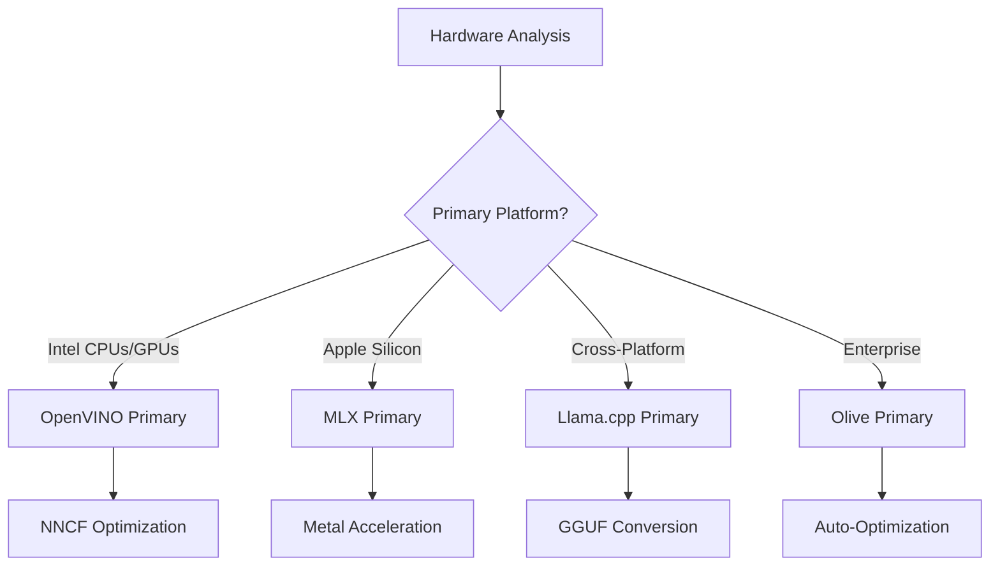
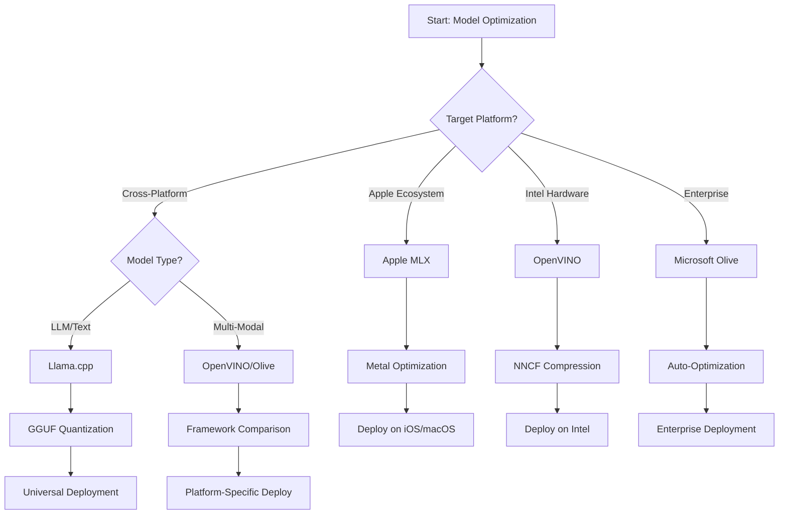
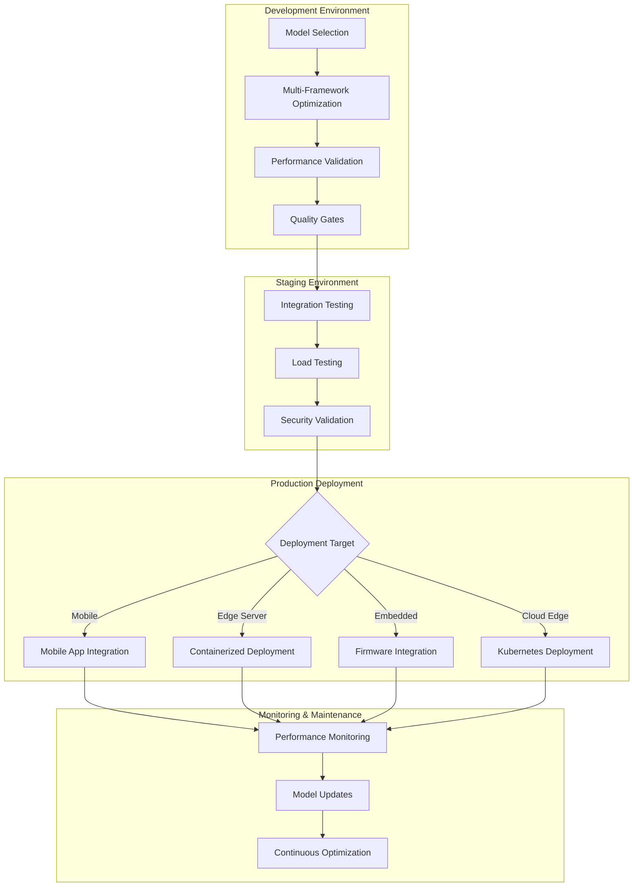

<!--
CO_OP_TRANSLATOR_METADATA:
{
  "original_hash": "6719c4a7e44b948230ac5f5cab3699bd",
  "translation_date": "2025-09-18T18:52:10+00:00",
  "source_file": "Module04/06.workflow-synthesis.md",
  "language_code": "ro"
}
-->
# Secțiunea 6: Sinteza fluxului de lucru pentru dezvoltarea Edge AI

## Cuprins
1. [Introducere](../../../Module04)
2. [Obiective de învățare](../../../Module04)
3. [Prezentare generală a fluxului de lucru unificat](../../../Module04)
4. [Matrice de selecție a cadrelor](../../../Module04)
5. [Sinteză de bune practici](../../../Module04)
6. [Ghid de strategie pentru implementare](../../../Module04)
7. [Flux de lucru pentru optimizarea performanței](../../../Module04)
8. [Listă de verificare pentru pregătirea producției](../../../Module04)
9. [Depanare și monitorizare](../../../Module04)
10. [Asigurarea viitorului pipeline-ului Edge AI](../../../Module04)

## Introducere

Dezvoltarea Edge AI necesită o înțelegere sofisticată a mai multor cadre de optimizare, strategii de implementare și considerații hardware. Această sinteză cuprinzătoare reunește cunoștințele din Llama.cpp, Microsoft Olive, OpenVINO și Apple MLX pentru a crea un flux de lucru unificat care maximizează eficiența, menține calitatea și asigură o implementare de succes în producție.

Pe parcursul acestui curs, am explorat cadre de optimizare individuale, fiecare cu puncte forte unice și cazuri de utilizare specializate. Totuși, proiectele Edge AI din lumea reală necesită adesea combinarea tehnicilor din mai multe cadre sau luarea unor decizii strategice despre care abordare va oferi cele mai bune rezultate pentru constrângerile și cerințele specifice.

Această secțiune sintetizează înțelepciunea colectivă din toate cadrele în fluxuri de lucru acționabile, arbori decizionali și bune practici care vă permit să construiți soluții Edge AI pregătite pentru producție, eficient și eficace. Indiferent dacă optimizați pentru dispozitive mobile, sisteme încorporate sau servere edge, acest ghid oferă cadrul strategic pentru luarea deciziilor informate pe parcursul ciclului de dezvoltare.

## Obiective de învățare

Până la finalul acestei secțiuni, veți putea:

### Luarea deciziilor strategice
- **Evaluați și selectați** cadrul de optimizare optim pe baza cerințelor proiectului, constrângerilor hardware și scenariilor de implementare
- **Proiectați fluxuri de lucru cuprinzătoare** care integrează mai multe tehnici de optimizare pentru eficiență maximă
- **Analizați compromisurile** între acuratețea modelului, viteza de inferență, utilizarea memoriei și complexitatea implementării în diferite cadre

### Integrarea fluxului de lucru
- **Implementați pipeline-uri de dezvoltare unificate** care valorifică punctele forte ale mai multor cadre de optimizare
- **Creați fluxuri de lucru reproducibile** pentru optimizarea și implementarea consistentă a modelelor în diferite medii
- **Stabiliți porți de calitate** și procese de validare pentru a asigura că modelele optimizate îndeplinesc cerințele de producție

### Optimizarea performanței
- **Aplicați strategii de optimizare sistematică** utilizând cuantificarea, tăierea și tehnici de accelerare specifice hardware-ului
- **Monitorizați și evaluați performanța modelului** la diferite niveluri de optimizare și ținte de implementare
- **Optimizați pentru platforme hardware specifice** inclusiv CPU, GPU, NPU și acceleratoare edge specializate

### Implementarea în producție
- **Proiectați arhitecturi de implementare scalabile** care să acomodeze multiple formate de model și motoare de inferență
- **Implementați monitorizarea și observabilitatea** pentru aplicațiile Edge AI în medii de producție
- **Stabiliți fluxuri de lucru de întreținere** pentru actualizări de model, monitorizarea performanței și optimizarea sistemului

### Excelență cross-platform
- **Implementați modele optimizate** pe diverse platforme hardware menținând performanța consistentă
- **Gestionați optimizările specifice platformei** pentru Windows, macOS, Linux, mobile și sisteme încorporate
- **Creați straturi de abstractizare** care permit implementarea fără probleme în diferite medii edge

## Prezentare generală a fluxului de lucru unificat

### Faza 1: Analiza cerințelor și selecția cadrului

Fundamentul unei implementări de succes Edge AI începe cu o analiză amănunțită a cerințelor care informează selecția cadrului și strategia de optimizare.

#### 1.1 Evaluarea hardware-ului


**Considerații cheie:**
- **Arhitectura CPU**: Capacități x86, ARM, Apple Silicon
- **Disponibilitatea acceleratorului**: GPU, NPU, VPU, cipuri AI specializate
- **Constrângeri de memorie**: Limitări RAM, capacitate de stocare
- **Buget de energie**: Durata bateriei, constrângeri termice
- **Conectivitate**: Cerințe offline, limitări de lățime de bandă

#### 1.2 Matricea cerințelor aplicației

| Cerință | Llama.cpp | Microsoft Olive | OpenVINO | Apple MLX |
|---------|-----------|-----------------|----------|-----------|
| Cross-platform | ✅ Excelent | ⚡ Bun | ⚡ Bun | ❌ Doar Apple |
| Integrare enterprise | ⚡ De bază | ✅ Excelent | ✅ Excelent | ⚡ Limitat |
| Implementare mobilă | ✅ Excelent | ⚡ Bun | ⚡ Bun | ✅ iOS Excelent |
| Inferență în timp real | ✅ Excelent | ✅ Excelent | ✅ Excelent | ✅ Excelent |
| Diversitate modele | ✅ Focus LLM | ✅ Toate modelele | ✅ Toate modelele | ✅ Focus LLM |
| Ușurință în utilizare | ✅ Simplu | ✅ Automatizat | ⚡ Moderat | ✅ Simplu |

### Faza 2: Pregătirea și optimizarea modelului

#### 2.1 Pipeline universal de evaluare a modelului

```python
# Universal Model Assessment Framework
class EdgeAIModelAssessment:
    def __init__(self, model_path, target_hardware):
        self.model_path = model_path
        self.target_hardware = target_hardware
        self.optimization_frameworks = []
        
    def assess_model_characteristics(self):
        """Analyze model size, architecture, and complexity"""
        return {
            'model_size': self.get_model_size(),
            'parameter_count': self.get_parameter_count(),
            'architecture_type': self.detect_architecture(),
            'quantization_compatibility': self.check_quantization_support()
        }
    
    def recommend_optimization_strategy(self):
        """Recommend optimal frameworks and techniques"""
        characteristics = self.assess_model_characteristics()
        
        if self.target_hardware.startswith('apple'):
            return self.mlx_optimization_strategy(characteristics)
        elif self.target_hardware.startswith('intel'):
            return self.openvino_optimization_strategy(characteristics)
        elif characteristics['model_size'] > 7_000_000_000:  # 7B+ parameters
            return self.enterprise_optimization_strategy(characteristics)
        else:
            return self.lightweight_optimization_strategy(characteristics)
```

#### 2.2 Pipeline de optimizare multi-cadru

**Abordare de optimizare secvențială:**
1. **Conversie inițială**: Conversie în format intermediar (ONNX, dacă este posibil)
2. **Optimizare specifică cadrului**: Aplicarea tehnicilor specializate
3. **Validare încrucișată**: Verificarea performanței pe platformele țintă
4. **Ambalare finală**: Pregătirea pentru implementare

```bash
# Multi-Framework Optimization Script
#!/bin/bash

MODEL_NAME="phi-3-mini"
BASE_MODEL="microsoft/Phi-3-mini-4k-instruct"

# Phase 1: ONNX Conversion (Universal)
python convert_to_onnx.py --model $BASE_MODEL --output models/onnx/

# Phase 2: Platform-Specific Optimization
if [[ "$TARGET_PLATFORM" == "intel" ]]; then
    # OpenVINO Optimization
    python optimize_openvino.py --input models/onnx/ --output models/openvino/
elif [[ "$TARGET_PLATFORM" == "apple" ]]; then
    # MLX Optimization
    python optimize_mlx.py --input $BASE_MODEL --output models/mlx/
elif [[ "$TARGET_PLATFORM" == "cross" ]]; then
    # Llama.cpp Optimization
    python convert_to_gguf.py --input models/onnx/ --output models/gguf/
fi

# Phase 3: Validation
python validate_optimization.py --original $BASE_MODEL --optimized models/$TARGET_PLATFORM/
```

### Faza 3: Validarea performanței și evaluarea

#### 3.1 Cadru cuprinzător de evaluare

```python
class EdgeAIBenchmark:
    def __init__(self, optimized_models):
        self.models = optimized_models
        self.metrics = {
            'inference_time': [],
            'memory_usage': [],
            'accuracy_score': [],
            'throughput': [],
            'energy_consumption': []
        }
    
    def run_comprehensive_benchmark(self):
        """Execute standardized benchmarks across all optimized models"""
        test_inputs = self.generate_test_inputs()
        
        for model_framework, model_path in self.models.items():
            print(f"Benchmarking {model_framework}...")
            
            # Latency Testing
            latency = self.measure_inference_latency(model_path, test_inputs)
            
            # Memory Profiling
            memory = self.profile_memory_usage(model_path)
            
            # Accuracy Validation
            accuracy = self.validate_model_accuracy(model_path, test_inputs)
            
            # Throughput Analysis
            throughput = self.measure_throughput(model_path)
            
            self.record_metrics(model_framework, latency, memory, accuracy, throughput)
    
    def generate_optimization_report(self):
        """Create comprehensive comparison report"""
        report = {
            'recommendations': self.analyze_performance_trade_offs(),
            'deployment_guidance': self.generate_deployment_recommendations(),
            'monitoring_requirements': self.define_monitoring_metrics()
        }
        return report
```

## Matrice de selecție a cadrelor

### Arbore decizional pentru selecția cadrului



### Criterii de selecție cuprinzătoare

#### 1. Alinierea la cazurile de utilizare principale

**Modele de limbaj extins (LLMs):**
- **Llama.cpp**: Cel mai bun pentru implementare cross-platform, axată pe CPU
- **Apple MLX**: Optim pentru Apple Silicon cu memorie unificată
- **OpenVINO**: Excelent pentru hardware Intel cu optimizare NNCF
- **Microsoft Olive**: Ideal pentru fluxuri de lucru enterprise cu automatizare

**Modele multi-modale:**
- **OpenVINO**: Suport cuprinzător pentru viziune, audio și text
- **Microsoft Olive**: Optimizare enterprise pentru pipeline-uri complexe
- **Llama.cpp**: Limitat la modele bazate pe text
- **Apple MLX**: Suport în creștere pentru aplicații multi-modale

#### 2. Matricea platformei hardware

| Platformă | Cadru principal | Opțiune secundară | Funcții specializate |
|-----------|-----------------|-------------------|----------------------|
| CPU/GPU Intel | OpenVINO | Microsoft Olive | Compresie NNCF, optimizare Intel |
| GPU NVIDIA | Microsoft Olive | OpenVINO | Accelerare CUDA, funcții enterprise |
| Apple Silicon | Apple MLX | Llama.cpp | Shadere Metal, memorie unificată |
| ARM Mobile | Llama.cpp | OpenVINO | Cross-platform, dependențe minime |
| Edge TPU | OpenVINO | Microsoft Olive | Suport pentru acceleratoare specializate |
| ARM încorporat | Llama.cpp | OpenVINO | Amprentă minimă, inferență eficientă |

#### 3. Preferințe pentru fluxul de lucru de dezvoltare

**Prototipare rapidă:**
1. **Llama.cpp**: Configurare rapidă, rezultate imediate
2. **Apple MLX**: API Python simplu, iterație rapidă
3. **Microsoft Olive**: Optimizare automatizată, configurare minimă
4. **OpenVINO**: Configurare mai complexă, funcții cuprinzătoare

**Producție enterprise:**
1. **Microsoft Olive**: Funcții enterprise, integrare Azure
2. **OpenVINO**: Ecosistem Intel, instrumente cuprinzătoare
3. **Apple MLX**: Aplicații enterprise specifice Apple
4. **Llama.cpp**: Implementare simplă, funcții enterprise limitate

## Sinteză de bune practici

### Principii universale de optimizare

#### 1. Strategie de optimizare progresivă

```python
class ProgressiveOptimization:
    def __init__(self, base_model):
        self.base_model = base_model
        self.optimization_stages = [
            'baseline_measurement',
            'format_conversion',
            'quantization_optimization',
            'hardware_acceleration',
            'production_validation'
        ]
    
    def execute_progressive_optimization(self):
        """Apply optimization techniques incrementally"""
        
        # Stage 1: Baseline Measurement
        baseline_metrics = self.measure_baseline_performance()
        
        # Stage 2: Format Conversion
        converted_model = self.convert_to_optimal_format()
        conversion_metrics = self.measure_performance(converted_model)
        
        # Stage 3: Quantization
        quantized_model = self.apply_quantization(converted_model)
        quantization_metrics = self.measure_performance(quantized_model)
        
        # Stage 4: Hardware Acceleration
        accelerated_model = self.enable_hardware_acceleration(quantized_model)
        acceleration_metrics = self.measure_performance(accelerated_model)
        
        # Stage 5: Validation
        production_ready = self.validate_for_production(accelerated_model)
        
        return self.compile_optimization_report(
            baseline_metrics, conversion_metrics, 
            quantization_metrics, acceleration_metrics
        )
```

#### 2. Implementarea porților de calitate

**Porți pentru păstrarea acurateței:**
- Menținerea >95% din acuratețea originală a modelului
- Validarea pe seturi de date de test reprezentative
- Implementarea testării A/B pentru validarea în producție

**Porți pentru îmbunătățirea performanței:**
- Obținerea unei îmbunătățiri minime de 2x a vitezei
- Reducerea amprentei de memorie cu cel puțin 50%
- Validarea consistenței timpului de inferență

**Porți pentru pregătirea producției:**
- Trecerea testelor de stres sub sarcină
- Demonstrarea performanței stabile în timp
- Validarea cerințelor de securitate și confidențialitate

### Integrarea celor mai bune practici specifice cadrelor

#### 1. Sinteza strategiei de cuantificare

```python
# Unified Quantization Approach
class UnifiedQuantizationStrategy:
    def __init__(self, model, target_platform):
        self.model = model
        self.platform = target_platform
        
    def select_optimal_quantization(self):
        """Choose best quantization based on platform and requirements"""
        
        if self.platform == 'apple_silicon':
            return self.mlx_quantization_strategy()
        elif self.platform == 'intel_hardware':
            return self.openvino_quantization_strategy()
        elif self.platform == 'cross_platform':
            return self.llamacpp_quantization_strategy()
        else:
            return self.olive_quantization_strategy()
    
    def mlx_quantization_strategy(self):
        """Apple MLX-specific quantization"""
        return {
            'method': 'mlx_quantize',
            'precision': 'int4',
            'group_size': 64,
            'optimization_target': 'unified_memory'
        }
    
    def openvino_quantization_strategy(self):
        """OpenVINO NNCF quantization"""
        return {
            'method': 'nncf_quantize',
            'precision': 'int8',
            'calibration_method': 'post_training',
            'optimization_target': 'intel_hardware'
        }
```

#### 2. Optimizarea accelerării hardware

**Sinteza optimizării CPU:**
- **Instrucțiuni SIMD**: Utilizarea nucleelor optimizate în toate cadrele
- **Lățimea de bandă a memoriei**: Optimizarea layout-urilor de date pentru eficiența cache-ului
- **Threading**: Echilibrarea paralelismului cu constrângerile de resurse

**Cele mai bune practici pentru accelerarea GPU:**
- **Procesare în loturi**: Maximizarea debitului cu dimensiuni adecvate ale loturilor
- **Gestionarea memoriei**: Optimizarea alocării și transferurilor de memorie GPU
- **Precizie**: Utilizarea FP16, dacă este suportată, pentru performanță mai bună

**Optimizarea NPU/Acceleratoarelor specializate:**
- **Arhitectura modelului**: Asigurarea compatibilității cu capacitățile acceleratorului
- **Fluxul de date**: Optimizarea pipeline-urilor de intrare/ieșire pentru eficiența acceleratorului
- **Strategii de rezervă**: Implementarea fallback-ului CPU pentru operațiuni nesuportate

## Ghid de strategie pentru implementare

### Arhitectură universală de implementare



### Modele de implementare specifice platformei

#### 1. Strategie de implementare mobilă

```yaml
# Mobile Deployment Configuration
mobile_deployment:
  ios:
    framework: apple_mlx
    optimization:
      quantization: int4
      memory_mapping: true
      background_execution: limited
    packaging:
      format: mlx
      bundle_size: <50MB
      
  android:
    framework: llama_cpp
    optimization:
      quantization: q4_k_m
      threading: android_optimized
      memory_management: conservative
    packaging:
      format: gguf
      apk_size: <100MB
      
  cross_platform:
    framework: onnx_runtime
    optimization:
      quantization: int8
      execution_provider: cpu
    packaging:
      format: onnx
      shared_libraries: minimal
```

#### 2. Implementare pe server edge

```yaml
# Edge Server Deployment Configuration
edge_server:
  intel_based:
    framework: openvino
    optimization:
      quantization: int8
      acceleration: cpu_gpu_auto
      batch_processing: dynamic
    deployment:
      container: openvino_runtime
      orchestration: kubernetes
      scaling: horizontal
      
  nvidia_based:
    framework: microsoft_olive
    optimization:
      quantization: int4
      acceleration: cuda
      tensor_parallelism: true
    deployment:
      container: nvidia_triton
      orchestration: kubernetes
      scaling: gpu_aware
```

### Cele mai bune practici pentru containerizare

```dockerfile
# Multi-Framework Edge AI Container
FROM ubuntu:22.04 as base

# Install common dependencies
RUN apt-get update && apt-get install -y \
    python3 \
    python3-pip \
    build-essential \
    cmake \
    && rm -rf /var/lib/apt/lists/*

# Framework-specific stages
FROM base as openvino
RUN pip install openvino nncf optimum[intel]

FROM base as llamacpp
RUN git clone https://github.com/ggerganov/llama.cpp.git \
    && cd llama.cpp && make LLAMA_OPENBLAS=1

FROM base as olive
RUN pip install olive-ai[auto-opt] onnxruntime-genai

# Production stage with selected framework
FROM openvino as production
COPY models/ /app/models/
COPY src/ /app/src/
WORKDIR /app

EXPOSE 8080
CMD ["python3", "src/inference_server.py"]
```

## Flux de lucru pentru optimizarea performanței

### Ajustarea sistematică a performanței

#### 1. Pipeline de profilare a performanței

```python
class EdgeAIPerformanceProfiler:
    def __init__(self, model_path, framework):
        self.model_path = model_path
        self.framework = framework
        self.profiling_results = {}
    
    def comprehensive_profiling(self):
        """Execute comprehensive performance analysis"""
        
        # CPU Profiling
        cpu_profile = self.profile_cpu_usage()
        
        # Memory Profiling
        memory_profile = self.profile_memory_usage()
        
        # Inference Latency
        latency_profile = self.profile_inference_latency()
        
        # Throughput Analysis
        throughput_profile = self.profile_throughput()
        
        # Energy Consumption (where available)
        energy_profile = self.profile_energy_consumption()
        
        return self.compile_performance_report(
            cpu_profile, memory_profile, latency_profile,
            throughput_profile, energy_profile
        )
    
    def identify_bottlenecks(self):
        """Automatically identify performance bottlenecks"""
        bottlenecks = []
        
        if self.profiling_results['cpu_utilization'] > 80:
            bottlenecks.append('cpu_bound')
        
        if self.profiling_results['memory_usage'] > 90:
            bottlenecks.append('memory_bound')
        
        if self.profiling_results['inference_variance'] > 20:
            bottlenecks.append('inconsistent_performance')
        
        return self.generate_optimization_recommendations(bottlenecks)
```

#### 2. Pipeline de optimizare automatizată

```python
class AutomatedOptimizationPipeline:
    def __init__(self, base_model, target_constraints):
        self.base_model = base_model
        self.constraints = target_constraints
        self.optimization_history = []
    
    def execute_optimization_search(self):
        """Systematically search optimization space"""
        
        optimization_candidates = [
            {'quantization': 'int8', 'pruning': 0.1},
            {'quantization': 'int4', 'pruning': 0.2},
            {'quantization': 'int8', 'acceleration': 'gpu'},
            {'quantization': 'int4', 'acceleration': 'npu'}
        ]
        
        best_configuration = None
        best_score = 0
        
        for config in optimization_candidates:
            optimized_model = self.apply_optimization(config)
            score = self.evaluate_optimization(optimized_model)
            
            if score > best_score and self.meets_constraints(optimized_model):
                best_score = score
                best_configuration = config
            
            self.optimization_history.append({
                'config': config,
                'score': score,
                'model': optimized_model
            })
        
        return best_configuration, self.optimization_history
```

### Optimizare multi-obiectiv

#### 1. Optimizare Pareto pentru Edge AI

```python
class ParetoOptimization:
    def __init__(self, objectives=['speed', 'accuracy', 'memory']):
        self.objectives = objectives
        self.pareto_frontier = []
    
    def find_pareto_optimal_solutions(self, optimization_results):
        """Identify Pareto-optimal configurations"""
        
        for result in optimization_results:
            is_dominated = False
            
            for frontier_point in self.pareto_frontier:
                if self.dominates(frontier_point, result):
                    is_dominated = True
                    break
            
            if not is_dominated:
                # Remove dominated points from frontier
                self.pareto_frontier = [
                    point for point in self.pareto_frontier 
                    if not self.dominates(result, point)
                ]
                
                self.pareto_frontier.append(result)
        
        return self.pareto_frontier
    
    def recommend_configuration(self, user_preferences):
        """Recommend configuration based on user preferences"""
        
        weighted_scores = []
        for config in self.pareto_frontier:
            score = sum(
                user_preferences[obj] * config['metrics'][obj] 
                for obj in self.objectives
            )
            weighted_scores.append((score, config))
        
        return max(weighted_scores, key=lambda x: x[0])[1]
```

## Listă de verificare pentru pregătirea producției

### Validare cuprinzătoare pentru producție

#### 1. Asigurarea calității modelului

```python
class ProductionReadinessValidator:
    def __init__(self, optimized_model, production_requirements):
        self.model = optimized_model
        self.requirements = production_requirements
        self.validation_results = {}
    
    def validate_model_quality(self):
        """Comprehensive model quality validation"""
        
        # Accuracy Validation
        accuracy_result = self.validate_accuracy()
        
        # Performance Validation
        performance_result = self.validate_performance()
        
        # Robustness Testing
        robustness_result = self.validate_robustness()
        
        # Security Assessment
        security_result = self.validate_security()
        
        # Compliance Verification
        compliance_result = self.validate_compliance()
        
        return self.compile_validation_report(
            accuracy_result, performance_result, robustness_result,
            security_result, compliance_result
        )
    
    def generate_certification_report(self):
        """Generate production certification report"""
        return {
            'model_signature': self.generate_model_signature(),
            'validation_timestamp': datetime.now(),
            'validation_results': self.validation_results,
            'deployment_approval': self.check_deployment_approval(),
            'monitoring_requirements': self.define_monitoring_requirements()
        }
```

#### 2. Listă de verificare pentru implementarea în producție

**Validare pre-implementare:**
- [ ] Acuratețea modelului îndeplinește cerințele minime (>95% din baza de referință)
- [ ] Țintele de performanță sunt atinse (latență, debit, memorie)
- [ ] Vulnerabilitățile de securitate sunt evaluate și atenuate
- [ ] Testele de stres sunt finalizate sub sarcina așteptată
- [ ] Scenariile de eșec sunt testate și procedurile de recuperare validate
- [ ] Sistemele de monitorizare și alertare sunt configurate
- [ ] Procedurile de rollback sunt testate și documentate

**Proces de implementare:**
- [ ] Strategia de implementare blue-green este implementată
- [ ] Creșterea treptată a traficului este configurată
- [ ] Dashboard-uri de monitorizare în timp real sunt active
- [ ] Bazele de performanță sunt stabilite
- [ ] Pragurile de rată de eroare sunt definite
- [ ] Triggere automate de rollback sunt configurate

**Monitorizare post-implementare:**
- [ ] Detectarea driftului modelului este activă
- [ ] Alertele de degradare a performanței sunt configurate
- [ ] Monitorizarea utilizării resurselor este activată
- [ ] Metricile experienței utilizatorului sunt urmărite
- [ ] Versionarea și linia de evoluție a modelului sunt menținute
- [ ] Recenzii regulate ale performanței modelului sunt programate

### Integrare continuă/Implementare continuă (CI/CD)

```yaml
# Edge AI CI/CD Pipeline Configuration
edge_ai_pipeline:
  stages:
    - model_validation
    - optimization
    - testing
    - staging_deployment
    - production_deployment
    - monitoring
  
  model_validation:
    accuracy_threshold: 0.95
    performance_baseline: required
    security_scan: enabled
    
  optimization:
    frameworks:
      - llama_cpp
      - openvino
      - microsoft_olive
    validation:
      cross_validation: enabled
      performance_comparison: required
      
  testing:
    unit_tests: comprehensive
    integration_tests: full_pipeline
    load_tests: production_scale
    security_tests: comprehensive
    
  deployment:
    strategy: blue_green
    traffic_ramping: gradual
    rollback: automatic
    monitoring: real_time
```

## Depanare și monitorizare

### Cadru universal de depanare

#### 1. Probleme comune și soluții

**Probleme de performanță:**
```python
class PerformanceTroubleshooter:
    def __init__(self, model_metrics):
        self.metrics = model_metrics
        
    def diagnose_performance_issues(self):
        """Systematic performance issue diagnosis"""
        
        issues = []
        
        # High latency diagnosis
        if self.metrics['avg_latency'] > self.metrics['target_latency']:
            issues.append(self.diagnose_latency_issues())
        
        # Memory usage diagnosis
        if self.metrics['memory_usage'] > self.metrics['memory_limit']:
            issues.append(self.diagnose_memory_issues())
        
        # Throughput diagnosis
        if self.metrics['throughput'] < self.metrics['target_throughput']:
            issues.append(self.diagnose_throughput_issues())
        
        return self.generate_resolution_plan(issues)
    
    def diagnose_latency_issues(self):
        """Specific latency troubleshooting"""
        potential_causes = []
        
        if self.metrics['cpu_utilization'] > 80:
            potential_causes.append('cpu_bottleneck')
        
        if self.metrics['memory_bandwidth'] > 90:
            potential_causes.append('memory_bandwidth_limit')
        
        if self.metrics['model_size'] > self.metrics['optimal_size']:
            potential_causes.append('model_too_large')
        
        return {
            'issue': 'high_latency',
            'causes': potential_causes,
            'solutions': self.generate_latency_solutions(potential_causes)
        }
```

**Depanare specifică cadrului:**

| Problemă | Llama.cpp | Microsoft Olive | OpenVINO | Apple MLX |
|----------|-----------|-----------------|----------|-----------|
| Probleme de memorie | Reduceți lungimea contextului | Scădeți dimensiunea lotului | Activați caching-ul | Utilizați maparea memoriei |
| Inferență lentă | Activați SIMD | Verificați cuantificarea | Optimizați threading-ul | Activați Metal |
| Pierdere de acuratețe | Cuantificare mai mare | Reantrenați cu QAT | Creșteți calibrarea | Ajustați post-cuanti |
| Compatibilitate | Verificați formatul modelului | Verificați versiunea cadrului | Actualizați driverele | Verificați versiunea macOS |

#### 2. Strategie de monitorizare în producție

```python
class EdgeAIMonitoring:
    def __init__(self, deployment_config):
        self.config = deployment_config
        self.metrics_collectors = []
        self.alerting_rules = []
    
    def setup_comprehensive_monitoring(self):
        """Configure comprehensive monitoring for Edge AI deployment"""
        
        # Model Performance Monitoring
        self.setup_model_performance_monitoring()
        
        # Infrastructure Monitoring
        self.setup_infrastructure_monitoring()
        
        # Business Metrics Monitoring
        self.setup_business_metrics_monitoring()
        
        # Security Monitoring
        self.setup_security_monitoring()
    
    def setup_model_performance_monitoring(self):
        """Model-specific performance monitoring"""
        metrics = [
            'inference_latency_p50',
            'inference_latency_p95',
            'inference_latency_p99',
            'model_accuracy_drift',
            'prediction_confidence_distribution',
            'error_rate',
            'throughput_requests_per_second'
        ]
        
        for metric in metrics:
            self.add_metric_collector(metric)
            self.add_alerting_rule(metric)
    
    def detect_model_drift(self):
        """Automated model drift detection"""
        drift_indicators = [
            self.statistical_drift_detection(),
            self.performance_drift_detection(),
            self.data_distribution_shift_detection()
        ]
        
        return self.aggregate_drift_signals(drift_indicators)
```

### Rezolvarea automată a problemelor

```python
class AutomatedIssueResolution:
    def __init__(self, monitoring_system):
        self.monitoring = monitoring_system
        self.resolution_strategies = {}
    
    def handle_performance_degradation(self, alert):
        """Automated performance issue resolution"""
        
        if alert['type'] == 'high_latency':
            return self.resolve_latency_issue(alert)
        elif alert['type'] == 'high_memory_usage':
            return self.resolve_memory_issue(alert)
        elif alert['type'] == 'accuracy_drift':
            return self.resolve_accuracy_issue(alert)
        
    def resolve_latency_issue(self, alert):
        """Automated latency issue resolution"""
        resolution_steps = [
            'increase_cpu_allocation',
            'enable_model_caching',
            'reduce_batch_size',
            'switch_to_quantized_model'
        ]
        
        for step in resolution_steps:
            if self.apply_resolution_step(step):
                return f"Resolved latency issue with: {step}"
        
        return "Escalating to human operator"
```

## Asigurarea viitorului pipeline-ului Edge AI

### Integrarea tehnologiilor emergente

#### 1. Suport pentru hardware de generație următoare

```python
class FutureHardwareIntegration:
    def __init__(self):
        self.supported_accelerators = [
            'npu_next_gen',
            'quantum_processors',
            'neuromorphic_chips',
            'optical_processors'
        ]
    
    def design_adaptive_pipeline(self):
        """Create hardware-agnostic optimization pipeline"""
        
        pipeline = {
            'model_preparation': self.universal_model_preparation(),
            'hardware_detection': self.dynamic_hardware_detection(),
            'optimization_selection': self.adaptive_optimization_selection(),
            'performance_validation': self.hardware_agnostic_validation()
        }
        
        return pipeline
    
    def adaptive_optimization_selection(self):
        """Dynamically select optimization based on available hardware"""
        
        def optimize_for_hardware(model, available_hardware):
            if 'npu' in available_hardware:
                return self.npu_optimization(model)
            elif 'quantum' in available_hardware:
                return self.quantum_optimization(model)
            elif 'neuromorphic' in available_hardware:
                return self.neuromorphic_optimization(model)
            else:
                return self.fallback_optimization(model)
        
        return optimize_for_hardware
```

#### 2. Evoluția arhitecturii modelului

**Suport pentru arhitecturi emergente:**
- **Mixture of Experts (MoE)**: Arhitecturi sparse pentru eficiență
- **Retrieval-Augmented Generation**: Sisteme hibride model + bază de cunoștințe
- **Modele multimodale**: Integrare viziune + limbaj + audio
- **Învățare federată**: Antrenament și optimizare distribuită

```python
class NextGenModelSupport:
    def __init__(self):
        self.architecture_handlers = {
            'moe': self.handle_mixture_of_experts,
            'rag': self.handle_retrieval_augmented,
            'multimodal': self.handle_multimodal,
            'federated': self.handle_federated_learning
        }
    
    def handle_mixture_of_experts(self, model):
        """Optimize Mixture of Experts models for edge deployment"""
        optimization_strategy = {
            'expert_pruning': True,
            'routing_optimization': True,
            'expert_quantization': 'per_expert',
            'load_balancing': 'dynamic'
        }
        return self.apply_moe_optimization(model, optimization_strategy)
```

### Învățare și adaptare continuă

#### 1. Integrarea învățării online

```python
class EdgeOnlineLearning:
    def __init__(self, base_model, learning_rate=0.001):
        self.base_model = base_model
        self.learning_rate = learning_rate
        self.adaptation_buffer = []
    
    def continuous_adaptation(self, new_data, feedback):
        """Continuously adapt model based on edge data"""
        
        # Privacy-preserving local adaptation
        local_updates = self.compute_local_gradients(new_data, feedback)
        
        # Apply updates with constraints
        adapted_model = self.apply_constrained_updates(
            self.base_model, local_updates
        )
        
        # Validate adaptation quality
        if self.validate_adaptation(adapted_model):
            self.base_model = adapted_model
            return True
        
        return False
    
    def federated_learning_participation(self):
        """Participate in federated learning while preserving privacy"""
        
        # Compute local model updates
        local_updates = self.compute_private_updates()
        
        # Differential privacy protection
        private_updates = self.apply_differential_privacy(local_updates)
        
        # Share with federated learning coordinator
        return self.share_updates(private_updates)
```

#### 2. Sustenabilitate și Green AI

```python
class GreenEdgeAI:
    def __init__(self, sustainability_targets):
        self.targets = sustainability_targets
        self.energy_monitor = EnergyMonitor()
    
    def optimize_for_sustainability(self, model):
        """Optimize model for minimal environmental impact"""
        
        optimization_objectives = [
            'minimize_energy_consumption',
            'maximize_hardware_utilization',
            'reduce_model_training_cost',
            'extend_device_lifetime'
        ]
        
        return self.multi_objective_green_optimization(
            model, optimization_objectives
        )
    
    def carbon_aware_deployment(self):
        """Deploy models considering carbon footprint"""
        
        deployment_strategy = {
            'prefer_renewable_energy_regions': True,
            'optimize_for_energy_efficiency': True,
            'minimize_data_transfer': True,
            'lifecycle_carbon_accounting': True
        }
        
        return deployment_strategy
```

## Concluzie

Această sinteză cuprinzătoare a fluxului de lucru reprezintă culminarea cunoștințelor de optimizare Edge AI, reunind cele mai bune practici din toate cadrele majore de optimizare într-o abordare unificată, pregătită pentru producție. Urmând aceste linii directoare, veți putea:

**Obține performanță optimă**: Prin selecția sistematică a cadrului, optimizarea progresivă și validarea cuprinzătoare, asigurându-vă că aplicațiile Edge AI oferă eficiență maximă.

**Asigurați pregătirea pentru producție**: Cu testare riguroasă, monitorizare și por
Amintește-ți că cea mai bună strategie de optimizare este cea care îndeplinește cerințele tale specifice, menținând în același timp flexibilitatea de a se adapta pe măsură ce aceste cerințe evoluează. Folosește acest ghid ca un cadru pentru a lua decizii informate, dar validează întotdeauna alegerile prin testare empirică și experiență din implementări reale.

## ➡️ Ce urmează

Continuă călătoria ta în domeniul Edge AI explorând [Module 5: SLMOps and Production Deployment](../Module05/README.md) pentru a învăța despre aspectele operaționale ale gestionării ciclului de viață al modelelor lingvistice mici.

---

**Declinare de responsabilitate**:  
Acest document a fost tradus folosind serviciul de traducere AI [Co-op Translator](https://github.com/Azure/co-op-translator). Deși ne străduim să asigurăm acuratețea, vă rugăm să fiți conștienți că traducerile automate pot conține erori sau inexactități. Documentul original în limba sa natală ar trebui considerat sursa autoritară. Pentru informații critice, se recomandă traducerea profesională realizată de un specialist uman. Nu ne asumăm responsabilitatea pentru eventualele neînțelegeri sau interpretări greșite care pot apărea din utilizarea acestei traduceri.