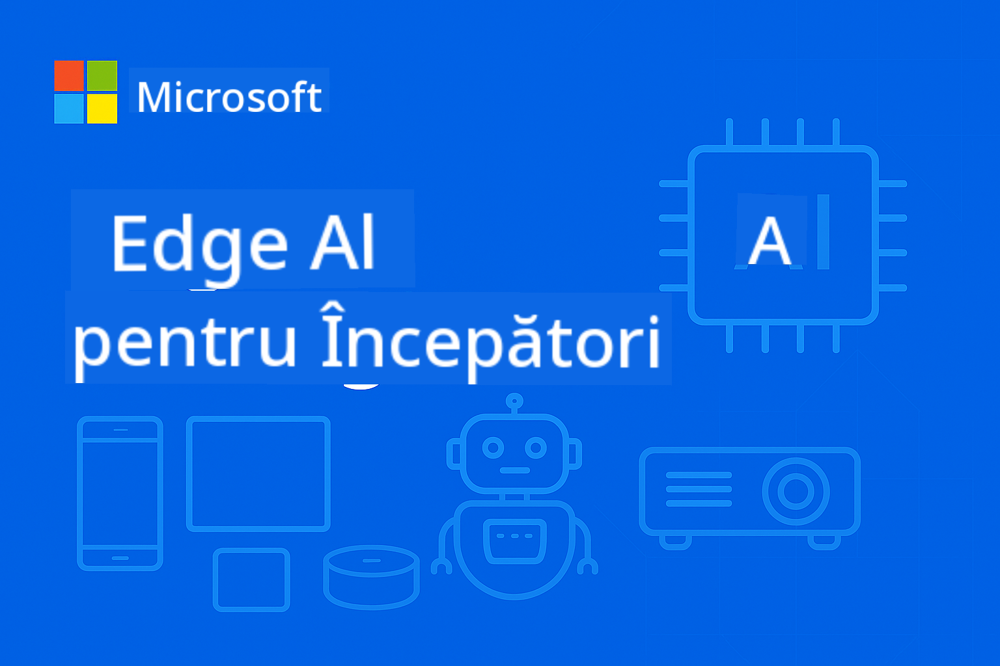

<!--
CO_OP_TRANSLATOR_METADATA:
{
  "original_hash": "cd9cb76aab17c30bfb19ef73060c5fb0",
  "translation_date": "2025-10-11T10:48:52+00:00",
  "source_file": "README.md",
  "language_code": "ro"
}
-->
# EdgeAI pentru Începători



[](https://GitHub.com/microsoft/edgeai-for-beginners/graphs/contributors)
[](https://GitHub.com/microsoft/edgeai-for-beginners/issues)
[](https://GitHub.com/microsoft/edgeai-for-beginners/pulls)
[](http://makeapullrequest.com)

[](https://GitHub.com/microsoft/edgeai-for-beginners/watchers)
[](https://GitHub.com/microsoft/edgeai-for-beginners/fork)
[](https://GitHub.com/microsoft/edgeai-for-beginners/stargazers)

[](https://discord.com/invite/ByRwuEEgH4)

Urmați acești pași pentru a începe să utilizați aceste resurse:

1. **Forkați Repozitoriul**: Click [](https://GitHub.com/microsoft/edgeai-for-beginners/fork)
2. **Clonați Repozitoriul**:   `git clone https://github.com/microsoft/edgeai-for-beginners.git`
3. [**Alăturați-vă Discord-ului Azure AI Foundry și întâlniți experți și alți dezvoltatori**](https://discord.com/invite/ByRwuEEgH4)

### 🌐 Suport Multi-Limbă

#### Suportat prin GitHub Action (Automatizat & Întotdeauna Actualizat)

<!-- CO-OP TRANSLATOR LANGUAGES TABLE START -->
[Arabic](../ar/README.md) | [Bengali](../bn/README.md) | [Bulgarian](../bg/README.md) | [Burmese (Myanmar)](../my/README.md) | [Chinese (Simplified)](../zh/README.md) | [Chinese (Traditional, Hong Kong)](../hk/README.md) | [Chinese (Traditional, Macau)](../mo/README.md) | [Chinese (Traditional, Taiwan)](../tw/README.md) | [Croatian](../hr/README.md) | [Czech](../cs/README.md) | [Danish](../da/README.md) | [Dutch](../nl/README.md) | [Estonian](../et/README.md) | [Finnish](../fi/README.md) | [French](../fr/README.md) | [German](../de/README.md) | [Greek](../el/README.md) | [Hebrew](../he/README.md) | [Hindi](../hi/README.md) | [Hungarian](../hu/README.md) | [Indonesian](../id/README.md) | [Italian](../it/README.md) | [Japanese](../ja/README.md) | [Korean](../ko/README.md) | [Lithuanian](../lt/README.md) | [Malay](../ms/README.md) | [Marathi](../mr/README.md) | [Nepali](../ne/README.md) | [Norwegian](../no/README.md) | [Persian (Farsi)](../fa/README.md) | [Polish](../pl/README.md) | [Portuguese (Brazil)](../br/README.md) | [Portuguese (Portugal)](../pt/README.md) | [Punjabi (Gurmukhi)](../pa/README.md) | [Romanian](./README.md) | [Russian](../ru/README.md) | [Serbian (Cyrillic)](../sr/README.md) | [Slovak](../sk/README.md) | [Slovenian](../sl/README.md) | [Spanish](../es/README.md) | [Swahili](../sw/README.md) | [Swedish](../sv/README.md) | [Tagalog (Filipino)](../tl/README.md) | [Tamil](../ta/README.md) | [Thai](../th/README.md) | [Turkish](../tr/README.md) | [Ukrainian](../uk/README.md) | [Urdu](../ur/README.md) | [Vietnamese](../vi/README.md)
<!-- CO-OP TRANSLATOR LANGUAGES TABLE END -->

**Dacă doriți să aveți suport pentru alte limbi, limbile disponibile sunt listate [aici](https://github.com/Azure/co-op-translator/blob/main/getting_started/supported-languages.md)**

## Introducere

Bine ați venit la **EdgeAI pentru Începători** – călătoria dumneavoastră completă în lumea transformatoare a Inteligenței Artificiale la Margine (Edge AI). Acest curs face legătura între capabilitățile puternice ale AI și implementarea practică în lumea reală pe dispozitive edge, oferindu-vă posibilitatea de a valorifica potențialul AI direct acolo unde datele sunt generate și deciziile trebuie luate.

### Ce Veți Învăța

Acest curs vă duce de la concepte fundamentale la implementări gata de producție, acoperind:
- **Modele de Limbaj Mici (SLM)** optimizate pentru implementare la margine
- **Optimizare conștientă de hardware** pe platforme diverse
- **Inferență în timp real** cu capabilități de protejare a confidențialității
- **Strategii de implementare în producție** pentru aplicații enterprise

### De ce este Important EdgeAI

Edge AI reprezintă o schimbare de paradigmă care abordează provocările moderne critice:
- **Confidențialitate & Securitate**: Procesați date sensibile local, fără expunere în cloud
- **Performanță în timp real**: Eliminați latența rețelei pentru aplicații critice
- **Eficiență a costurilor**: Reduceți cheltuielile cu lățimea de bandă și calculul în cloud
- **Operațiuni reziliente**: Mențineți funcționalitatea în timpul întreruperilor de rețea
- **Conformitate cu reglementările**: Respectați cerințele de suveranitate a datelor

### Edge AI

Edge AI se referă la rularea algoritmilor AI și a modelelor de limbaj local pe hardware, aproape de locul unde sunt generate datele, fără a se baza pe resurse cloud pentru inferență. Acest lucru reduce latența, îmbunătățește confidențialitatea și permite luarea deciziilor în timp real.

### Principii de Bază:
- **Inferență pe dispozitiv**: Modelele AI rulează pe dispozitive edge (telefoane, routere, microcontrolere, PC-uri industriale)
- **Capacitate offline**: Funcționează fără conectivitate persistentă la internet
- **Latență scăzută**: Răspunsuri imediate potrivite pentru sisteme în timp real
- **Suveranitatea datelor**: Păstrează datele sensibile local, îmbunătățind securitatea și conformitatea

### Modele de Limbaj Mici (SLM)

SLM-urile precum Phi-4, Mistral-7B și Gemma sunt versiuni optimizate ale LLM-urilor mai mari – antrenate sau distilate pentru:
- **Amprentă de memorie redusă**: Utilizare eficientă a memoriei limitate a dispozitivelor edge
- **Cerere redusă de calcul**: Optimizate pentru performanța CPU și GPU edge
- **Timpuri de pornire mai rapide**: Inițializare rapidă pentru aplicații receptive

Acestea oferă capabilități NLP puternice respectând constrângerile:
- **Sisteme încorporate**: Dispozitive IoT și controlere industriale
- **Dispozitive mobile**: Smartphone-uri și tablete cu capabilități offline
- **Dispozitive IoT**: Senzori și dispozitive inteligente cu resurse limitate
- **Servere edge**: Unități de procesare locală cu resurse GPU limitate
- **Calculatoare personale**: Scenarii de implementare pe desktop și laptop

## Modulele Cursului & Navigare

| Modul | Subiect | Zonă de Focus | Conținut Cheie | Nivel | Durată |
|--------|-------|------------|-------------|--------|----------|
| [📖 00 ](./introduction.md) | [Introducere în EdgeAI](./introduction.md) | Fundamente & Context | Prezentare EdgeAI • Aplicații Industriale • Introducere SLM • Obiective de Învățare | Începător | 1-2 ore |
| [📚 01](../../Module01) | [Fundamentele EdgeAI](./Module01/README.md) | Comparație Cloud vs Edge AI | Fundamente EdgeAI • Studii de Caz Reale • Ghid de Implementare • Implementare Edge | Începător | 3-4 ore |
| [🧠 02](../../Module02) | [Fundamentele Modelului SLM](./Module02/README.md) | Familii de modele & arhitectură | Familia Phi • Familia Qwen • Familia Gemma • BitNET • μModel • Phi-Silica | Începător | 4-5 ore |
| [🚀 03](../../Module03) | [Practica de Implementare SLM](./Module03/README.md) | Implementare locală & în cloud | Învățare Avansată • Mediu Local • Implementare în Cloud | Intermediar | 4-5 ore |
| [⚙️ 04](../../Module04) | [Trusa de Optimizare a Modelului](./Module04/README.md) | Optimizare cross-platform | Introducere • Llama.cpp • Microsoft Olive • OpenVINO • Apple MLX • Sinteza Fluxului de Lucru | Intermediar | 5-6 ore |
| [🔧 05](../../Module05) | [SLMOps în Producție](./Module05/README.md) | Operațiuni de producție | Introducere SLMOps • Distilarea Modelului • Fine-tuning • Implementare în Producție | Avansat | 5-6 ore |
| [🤖 06](../../Module06) | [Agenți AI & Apelarea Funcțiilor](./Module06/README.md) | Framework-uri de agenți & MCP | Introducere Agenți • Apelarea Funcțiilor • Protocolul de Context al Modelului | Avansat | 4-5 ore |
| [💻 07](../../Module07) | [Implementare pe Platformă](./Module07/README.md) | Exemple cross-platform | Trusa AI • Foundry Local • Dezvoltare Windows | Avansat | 3-4 ore |
| [🏭 08](../../Module08) | [Trusa Foundry Local](./Module08/README.md) | Exemple gata de producție | Aplicații de exemplu (vezi detalii mai jos) | Expert | 8-10 ore |

### 🏭 **Modul 08: Aplicații de Exemplu**

- [01: Pornire Rapidă REST Chat](./Module08/samples/01/README.md)
- [02: Integrare SDK OpenAI](./Module08/samples/02/README.md)
- [03: Descoperirea & Benchmarking-ul Modelului](./Module08/samples/03/README.md)
- [04: Aplicație Chainlit RAG](./Module08/samples/04/README.md)
- [05: Orchestrare Multi-Agent](./Module08/samples/05/README.md)
- [06: Router pentru Modele-ca-Unelte](./Module08/samples/06/README.md)
- [07: Client API Direct](./Module08/samples/07/README.md)
- [08: Aplicație Chat Windows 11](./Module08/samples/08/README.md)
- [09: Sistem Multi-Agent Avansat](./Module08/samples/09/README.md)
- [10: Framework-ul Foundry Tools](./Module08/samples/10/README.md)

### 🎓 **Atelier: Parcurs Practic de Învățare**

Materiale complete pentru ateliere practice cu implementări gata de producție:

- **[Ghidul Atelierului](./Workshop/Readme.md)** - Obiective complete de învățare, rezultate și navigare în resurse
- **Exemple Python** (6 sesiuni) - Actualizate cu bune practici, gestionarea erorilor și documentație completă
- **Jupyter Notebooks** (8 interactive) - Tutoriale pas cu pas cu benchmark-uri și monitorizare a performanței
- **Ghiduri de Sesiune** - Ghiduri detaliate în markdown pentru fiecare sesiune de atelier
- **Unelte de Validare** - Scripturi pentru verificarea calității codului și teste rapide

**Ce Veți Construi:**
- Aplicații locale de chat AI cu suport pentru streaming
- Pipeline-uri RAG cu evaluare a calității (RAGAS)
- Unelte de benchmarking și comparare multi-model
- Sisteme de orchestrare multi-agent
- Rutare inteligentă a modelelor bazată pe sarcini

### 📊 **Rezumatul Parcursului de Învățare**
- **Durată Totală**: 36-45 ore
- **Parcurs Începător**: Modulele 01-02 (7-9 ore)  
- **Parcurs Intermediar**: Modulele 03-04 (9-11 ore)
- **Parcurs Avansat**: Modulele 05-07 (12-15 ore)
- **Parcurs Expert**: Modulul 08 (8-10 ore)

## Ce Veți Construi

### 🎯 Competențe de Bază
- **Arhitectura Edge AI**: Proiectați sisteme AI locale cu integrare în cloud
- **Optimizarea Modelului**: Quantizați și comprimați modelele pentru implementare la margine (creștere de 85% a vitezei, reducere de 75% a dimensiunii)
- **Implementare Multi-Platformă**: Sisteme Windows, mobile, încorporate și hibride cloud-edge
- **Operațiuni de producție**: Monitorizare, scalare și întreținere a AI-ului edge în producție

### 🏗️ Proiecte practice
- **Aplicații de chat local Foundry**: Aplicație nativă Windows 11 cu schimbare de model
- **Sisteme multi-agent**: Coordonator cu agenți specializați pentru fluxuri de lucru complexe  
- **Aplicații RAG**: Procesare de documente locale cu căutare vectorială
- **Routere de modele**: Selecție inteligentă între modele bazată pe analiza sarcinilor
- **Framework-uri API**: Clienți gata de producție cu streaming și monitorizare a stării
- **Instrumente cross-platform**: Modele de integrare LangChain/Semantic Kernel

### 🏢 Aplicații în industrie
**Producție** • **Sănătate** • **Vehicule autonome** • **Orașe inteligente** • **Aplicații mobile**

## Start rapid

**Cale de învățare recomandată** (20-30 ore în total):

0. **📖 Introducere** ([Introduction.md](./introduction.md)): Fundamente EdgeAI + context industrial + cadru de învățare
1. **📚 Fundamente** (Modulele 01-02): Concepte EdgeAI + familii de modele SLM
2. **⚙️ Optimizare** (Modulele 03-04): Implementare + cadre de cuantizare  
3. **🚀 Producție** (Modulele 05-06): SLMOps + agenți AI + apelarea funcțiilor
4. **💻 Implementare** (Modulele 07-08): Exemple de platformă + toolkit Foundry Local

Fiecare modul include teorie, exerciții practice și exemple de cod gata de producție.

## Impact asupra carierei

**Roluri tehnice**: Arhitect de soluții EdgeAI • Inginer ML (Edge) • Dezvoltator IoT AI • Dezvoltator AI mobil

**Sectore industriale**: Producție 4.0 • Tehnologie medicală • Sisteme autonome • FinTech • Electronice de consum

**Proiecte de portofoliu**: Sisteme multi-agent • Aplicații RAG de producție • Implementare cross-platform • Optimizare performanță

## Structura depozitului

```
edgeai-for-beginners/
├── 📖 introduction.md  # Foundation: EdgeAI Overview & Learning Framework
├── 📚 Module01-04/     # Fundamentals → SLMs → Deployment → Optimization  
├── 🔧 Module05-06/     # SLMOps → AI Agents → Function Calling
├── 💻 Module07/        # Platform Samples (VS Code, Windows, Jetson, Mobile)
├── 🏭 Module08/        # Foundry Local Toolkit + 10 Comprehensive Samples
│   ├── samples/01-06/  # Foundation: REST, SDK, RAG, Agents, Routing
│   └── samples/07-10/  # Advanced: API Client, Windows App, Enterprise Agents, Tools
├── 🌐 translations/    # Multi-language support (8+ languages)
└── 📋 STUDY_GUIDE.md   # Structured learning paths & time allocation
```

## Repere ale cursului

✅ **Învățare progresivă**: Teorie → Practică → Implementare în producție  
✅ **Studii de caz reale**: Microsoft, Japan Airlines, implementări în întreprinderi  
✅ **Exemple practice**: Peste 50 de exemple, 10 demonstrații complete Foundry Local  
✅ **Focus pe performanță**: Îmbunătățiri de viteză de 85%, reduceri de dimensiune de 75%  
✅ **Multi-platformă**: Windows, mobil, embedded, hibrid cloud-edge  
✅ **Gata de producție**: Monitorizare, scalare, securitate, cadre de conformitate

📖 **[Ghid de studiu disponibil](STUDY_GUIDE.md)**: Cale de învățare structurată de 20 de ore cu orientări privind alocarea timpului și instrumente de autoevaluare.

---

**EdgeAI reprezintă viitorul implementării AI**: local-prim, care protejează confidențialitatea și eficient. Stăpânește aceste abilități pentru a construi următoarea generație de aplicații inteligente.

## Alte cursuri

Echipa noastră produce și alte cursuri! Verifică:

- [MCP pentru începători](https://github.com/microsoft/mcp-for-beginners)
- [Agenți AI pentru începători](https://github.com/microsoft/ai-agents-for-beginners?WT.mc_id=academic-105485-koreyst)
- [AI generativ pentru începători folosind .NET](https://github.com/microsoft/Generative-AI-for-beginners-dotnet?WT.mc_id=academic-105485-koreyst)
- [AI generativ pentru începători folosind JavaScript](https://github.com/microsoft/generative-ai-with-javascript?WT.mc_id=academic-105485-koreyst)
- [AI generativ pentru începători](https://github.com/microsoft/generative-ai-for-beginners?WT.mc_id=academic-105485-koreyst)
- [ML pentru începători](https://aka.ms/ml-beginners?WT.mc_id=academic-105485-koreyst)
- [Știința datelor pentru începători](https://aka.ms/datascience-beginners?WT.mc_id=academic-105485-koreyst)
- [AI pentru începători](https://aka.ms/ai-beginners?WT.mc_id=academic-105485-koreyst)
- [Securitate cibernetică pentru începători](https://github.com/microsoft/Security-101??WT.mc_id=academic-96948-sayoung)
- [Dezvoltare web pentru începători](https://aka.ms/webdev-beginners?WT.mc_id=academic-105485-koreyst)
- [IoT pentru începători](https://aka.ms/iot-beginners?WT.mc_id=academic-105485-koreyst)
- [Dezvoltare XR pentru începători](https://github.com/microsoft/xr-development-for-beginners?WT.mc_id=academic-105485-koreyst)
- [Stăpânirea GitHub Copilot pentru programare asistată de AI](https://aka.ms/GitHubCopilotAI?WT.mc_id=academic-105485-koreyst)
- [Stăpânirea GitHub Copilot pentru dezvoltatori C#/.NET](https://github.com/microsoft/mastering-github-copilot-for-dotnet-csharp-developers?WT.mc_id=academic-105485-koreyst)
- [Alege-ți propria aventură Copilot](https://github.com/microsoft/CopilotAdventures?WT.mc_id=academic-105485-koreyst)

## Obținerea ajutorului

Dacă întâmpini dificultăți sau ai întrebări despre construirea aplicațiilor AI, alătură-te:

[](https://aka.ms/foundry/discord)

Dacă ai feedback despre produs sau erori în timpul construirii, vizitează:

[](https://aka.ms/foundry/forum)

---

**Declinare de responsabilitate**:  
Acest document a fost tradus folosind serviciul de traducere AI [Co-op Translator](https://github.com/Azure/co-op-translator). Deși ne străduim să asigurăm acuratețea, vă rugăm să fiți conștienți că traducerile automate pot conține erori sau inexactități. Documentul original în limba sa maternă ar trebui considerat sursa autoritară. Pentru informații critice, se recomandă traducerea profesională realizată de un specialist. Nu ne asumăm responsabilitatea pentru eventualele neînțelegeri sau interpretări greșite care pot apărea din utilizarea acestei traduceri.