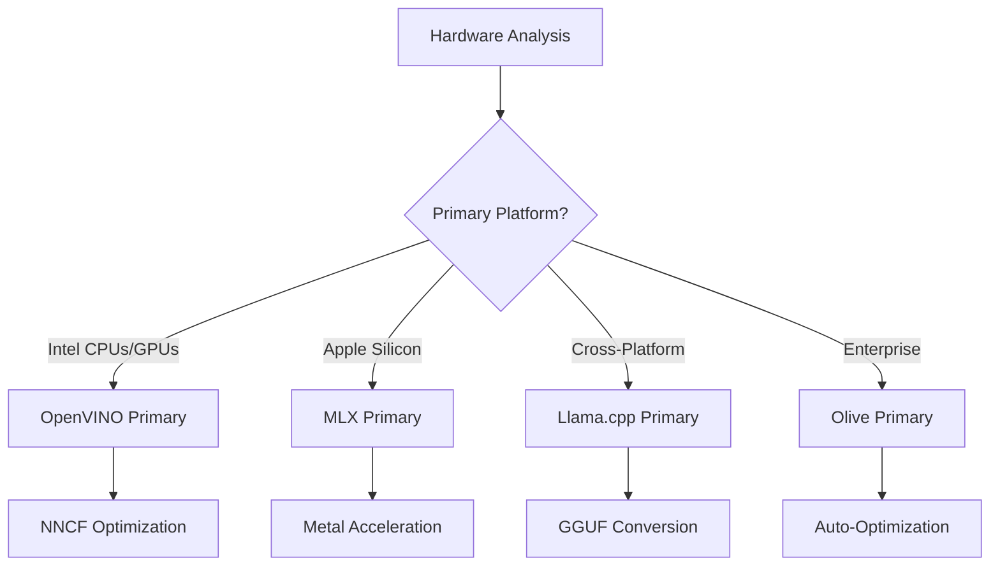
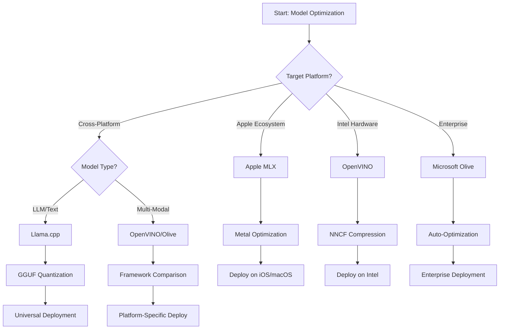
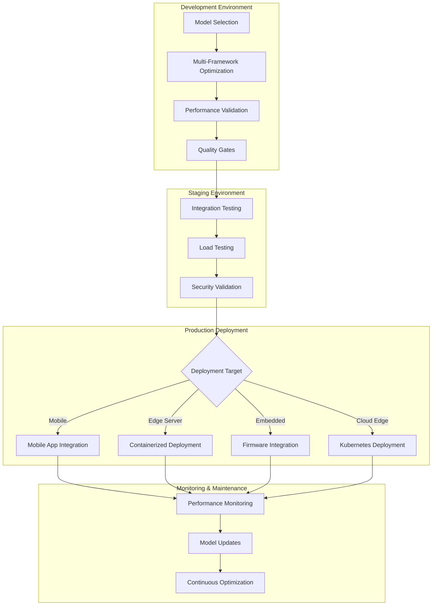

<!--
CO_OP_TRANSLATOR_METADATA:
{
  "original_hash": "6719c4a7e44b948230ac5f5cab3699bd",
  "translation_date": "2025-09-17T17:50:37+00:00",
  "source_file": "Module04/06.workflow-synthesis.md",
  "language_code": "ru"
}
-->
# Раздел 6: Синтез рабочего процесса разработки Edge AI

## Содержание
1. [Введение](../../../Module04)
2. [Цели обучения](../../../Module04)
3. [Обзор унифицированного рабочего процесса](../../../Module04)
4. [Матрица выбора фреймворков](../../../Module04)
5. [Синтез лучших практик](../../../Module04)
6. [Руководство по стратегии развертывания](../../../Module04)
7. [Рабочий процесс оптимизации производительности](../../../Module04)
8. [Контрольный список готовности к производству](../../../Module04)
9. [Устранение неполадок и мониторинг](../../../Module04)
10. [Обеспечение долгосрочной актуальности вашего Edge AI](../../../Module04)

## Введение

Разработка Edge AI требует глубокого понимания множества фреймворков оптимизации, стратегий развертывания и особенностей оборудования. Этот всеобъемлющий синтез объединяет знания из Llama.cpp, Microsoft Olive, OpenVINO и Apple MLX, создавая унифицированный рабочий процесс, который максимизирует эффективность, сохраняет качество и обеспечивает успешное развертывание в производстве.

На протяжении курса мы изучали отдельные фреймворки оптимизации, каждый из которых обладает уникальными преимуществами и специализированными сценариями использования. Однако реальные проекты Edge AI часто требуют комбинирования техник из нескольких фреймворков или принятия стратегических решений о том, какой подход обеспечит наилучшие результаты с учетом конкретных ограничений и требований.

Этот раздел объединяет накопленный опыт всех фреймворков в практические рабочие процессы, деревья решений и лучшие практики, которые помогут вам эффективно и быстро создавать готовые к производству решения Edge AI. Независимо от того, оптимизируете ли вы для мобильных устройств, встроенных систем или серверов на периферии, это руководство предоставляет стратегическую основу для принятия обоснованных решений на протяжении всего цикла разработки.

## Цели обучения

К концу этого раздела вы сможете:

### Стратегическое принятие решений
- **Оценивать и выбирать** оптимальный фреймворк оптимизации на основе требований проекта, ограничений оборудования и сценариев развертывания
- **Проектировать комплексные рабочие процессы**, интегрирующие несколько техник оптимизации для максимальной эффективности
- **Оценивать компромиссы** между точностью модели, скоростью вывода, использованием памяти и сложностью развертывания в разных фреймворках

### Интеграция рабочих процессов
- **Реализовывать унифицированные конвейеры разработки**, использующие преимущества нескольких фреймворков оптимизации
- **Создавать воспроизводимые рабочие процессы** для последовательной оптимизации моделей и их развертывания в разных средах
- **Устанавливать контрольные точки качества** и процессы проверки, чтобы гарантировать соответствие оптимизированных моделей требованиям производства

### Оптимизация производительности
- **Применять систематические стратегии оптимизации**, используя квантование, обрезку и аппаратно-специфические техники ускорения
- **Мониторить и тестировать** производительность моделей на разных уровнях оптимизации и целевых платформах
- **Оптимизировать для конкретных аппаратных платформ**, включая CPU, GPU, NPU и специализированные ускорители на периферии

### Развертывание в производстве
- **Проектировать масштабируемые архитектуры развертывания**, поддерживающие различные форматы моделей и движки вывода
- **Реализовывать мониторинг и наблюдаемость** для приложений Edge AI в производственных средах
- **Устанавливать процессы обслуживания** для обновления моделей, мониторинга производительности и оптимизации систем

### Кросс-платформенная эффективность
- **Развертывать оптимизированные модели** на различных аппаратных платформах, сохраняя стабильную производительность
- **Управлять платформенно-специфическими оптимизациями** для Windows, macOS, Linux, мобильных и встроенных систем
- **Создавать слои абстракции**, обеспечивающие бесшовное развертывание в разных средах на периферии

## Обзор унифицированного рабочего процесса

### Этап 1: Анализ требований и выбор фреймворка

Успешное развертывание Edge AI начинается с тщательного анализа требований, который определяет выбор фреймворка и стратегию оптимизации.

#### 1.1 Оценка оборудования


**Основные аспекты:**
- **Архитектура CPU**: возможности x86, ARM, Apple Silicon
- **Наличие ускорителей**: GPU, NPU, VPU, специализированные AI-чипы
- **Ограничения памяти**: объем RAM, емкость хранилища
- **Энергопотребление**: срок службы батареи, тепловые ограничения
- **Связь**: требования к работе офлайн, ограничения пропускной способности

#### 1.2 Матрица требований приложения

| Требование | Llama.cpp | Microsoft Olive | OpenVINO | Apple MLX |
|------------|-----------|-----------------|----------|-----------|
| Кросс-платформенность | ✅ Отлично | ⚡ Хорошо | ⚡ Хорошо | ❌ Только Apple |
| Интеграция в корпоративные системы | ⚡ Базовая | ✅ Отлично | ✅ Отлично | ⚡ Ограниченная |
| Развертывание на мобильных устройствах | ✅ Отлично | ⚡ Хорошо | ⚡ Хорошо | ✅ iOS Отлично |
| Вывод в реальном времени | ✅ Отлично | ✅ Отлично | ✅ Отлично | ✅ Отлично |
| Разнообразие моделей | ✅ Фокус на LLM | ✅ Все модели | ✅ Все модели | ✅ Фокус на LLM |
| Простота использования | ✅ Просто | ✅ Автоматизировано | ⚡ Умеренно | ✅ Просто |

### Этап 2: Подготовка и оптимизация модели

#### 2.1 Универсальный конвейер оценки модели

```python
# Universal Model Assessment Framework
class EdgeAIModelAssessment:
    def __init__(self, model_path, target_hardware):
        self.model_path = model_path
        self.target_hardware = target_hardware
        self.optimization_frameworks = []
        
    def assess_model_characteristics(self):
        """Analyze model size, architecture, and complexity"""
        return {
            'model_size': self.get_model_size(),
            'parameter_count': self.get_parameter_count(),
            'architecture_type': self.detect_architecture(),
            'quantization_compatibility': self.check_quantization_support()
        }
    
    def recommend_optimization_strategy(self):
        """Recommend optimal frameworks and techniques"""
        characteristics = self.assess_model_characteristics()
        
        if self.target_hardware.startswith('apple'):
            return self.mlx_optimization_strategy(characteristics)
        elif self.target_hardware.startswith('intel'):
            return self.openvino_optimization_strategy(characteristics)
        elif characteristics['model_size'] > 7_000_000_000:  # 7B+ parameters
            return self.enterprise_optimization_strategy(characteristics)
        else:
            return self.lightweight_optimization_strategy(characteristics)
```

#### 2.2 Конвейер оптимизации для нескольких фреймворков

**Последовательный подход к оптимизации:**
1. **Первоначальная конвертация**: преобразование в промежуточный формат (ONNX, если возможно)
2. **Оптимизация для конкретного фреймворка**: применение специализированных техник
3. **Кросс-проверка**: проверка производительности на целевых платформах
4. **Финальная упаковка**: подготовка к развертыванию

```bash
# Multi-Framework Optimization Script
#!/bin/bash

MODEL_NAME="phi-3-mini"
BASE_MODEL="microsoft/Phi-3-mini-4k-instruct"

# Phase 1: ONNX Conversion (Universal)
python convert_to_onnx.py --model $BASE_MODEL --output models/onnx/

# Phase 2: Platform-Specific Optimization
if [[ "$TARGET_PLATFORM" == "intel" ]]; then
    # OpenVINO Optimization
    python optimize_openvino.py --input models/onnx/ --output models/openvino/
elif [[ "$TARGET_PLATFORM" == "apple" ]]; then
    # MLX Optimization
    python optimize_mlx.py --input $BASE_MODEL --output models/mlx/
elif [[ "$TARGET_PLATFORM" == "cross" ]]; then
    # Llama.cpp Optimization
    python convert_to_gguf.py --input models/onnx/ --output models/gguf/
fi

# Phase 3: Validation
python validate_optimization.py --original $BASE_MODEL --optimized models/$TARGET_PLATFORM/
```

### Этап 3: Проверка производительности и тестирование

#### 3.1 Всеобъемлющий фреймворк тестирования

```python
class EdgeAIBenchmark:
    def __init__(self, optimized_models):
        self.models = optimized_models
        self.metrics = {
            'inference_time': [],
            'memory_usage': [],
            'accuracy_score': [],
            'throughput': [],
            'energy_consumption': []
        }
    
    def run_comprehensive_benchmark(self):
        """Execute standardized benchmarks across all optimized models"""
        test_inputs = self.generate_test_inputs()
        
        for model_framework, model_path in self.models.items():
            print(f"Benchmarking {model_framework}...")
            
            # Latency Testing
            latency = self.measure_inference_latency(model_path, test_inputs)
            
            # Memory Profiling
            memory = self.profile_memory_usage(model_path)
            
            # Accuracy Validation
            accuracy = self.validate_model_accuracy(model_path, test_inputs)
            
            # Throughput Analysis
            throughput = self.measure_throughput(model_path)
            
            self.record_metrics(model_framework, latency, memory, accuracy, throughput)
    
    def generate_optimization_report(self):
        """Create comprehensive comparison report"""
        report = {
            'recommendations': self.analyze_performance_trade_offs(),
            'deployment_guidance': self.generate_deployment_recommendations(),
            'monitoring_requirements': self.define_monitoring_metrics()
        }
        return report
```

## Матрица выбора фреймворков

### Дерево решений для выбора фреймворка



### Всеобъемлющие критерии выбора

#### 1. Соответствие основному сценарию использования

**Модели больших языков (LLM):**
- **Llama.cpp**: Лучший выбор для CPU-ориентированного, кросс-платформенного развертывания
- **Apple MLX**: Оптимально для Apple Silicon с унифицированной памятью
- **OpenVINO**: Отлично для оборудования Intel с оптимизацией NNCF
- **Microsoft Olive**: Идеально для корпоративных рабочих процессов с автоматизацией

**Мультимодальные модели:**
- **OpenVINO**: Полная поддержка зрения, аудио и текста
- **Microsoft Olive**: Оптимизация корпоративного уровня для сложных конвейеров
- **Llama.cpp**: Ограничено текстовыми моделями
- **Apple MLX**: Растущая поддержка мультимодальных приложений

#### 2. Матрица аппаратных платформ

| Платформа | Основной фреймворк | Второй вариант | Специализированные функции |
|-----------|--------------------|----------------|----------------------------|
| Intel CPU/GPU | OpenVINO | Microsoft Olive | Сжатие NNCF, оптимизация Intel |
| NVIDIA GPU | Microsoft Olive | OpenVINO | Ускорение CUDA, корпоративные функции |
| Apple Silicon | Apple MLX | Llama.cpp | Metal-шейдеры, унифицированная память |
| ARM Mobile | Llama.cpp | OpenVINO | Кросс-платформенность, минимальные зависимости |
| Edge TPU | OpenVINO | Microsoft Olive | Поддержка специализированных ускорителей |
| Встроенный ARM | Llama.cpp | OpenVINO | Минимальный размер, эффективный вывод |

#### 3. Предпочтения рабочего процесса разработки

**Быстрое прототипирование:**
1. **Llama.cpp**: Быстрая настройка, мгновенные результаты
2. **Apple MLX**: Простой Python API, быстрая итерация
3. **Microsoft Olive**: Автоматизированная оптимизация, минимальная конфигурация
4. **OpenVINO**: Более сложная настройка, обширные функции

**Корпоративное производство:**
1. **Microsoft Olive**: Корпоративные функции, интеграция с Azure
2. **OpenVINO**: Экосистема Intel, обширные инструменты
3. **Apple MLX**: Приложения для корпоративного уровня на Apple
4. **Llama.cpp**: Простое развертывание, ограниченные корпоративные функции

## Синтез лучших практик

### Универсальные принципы оптимизации

#### 1. Стратегия прогрессивной оптимизации

```python
class ProgressiveOptimization:
    def __init__(self, base_model):
        self.base_model = base_model
        self.optimization_stages = [
            'baseline_measurement',
            'format_conversion',
            'quantization_optimization',
            'hardware_acceleration',
            'production_validation'
        ]
    
    def execute_progressive_optimization(self):
        """Apply optimization techniques incrementally"""
        
        # Stage 1: Baseline Measurement
        baseline_metrics = self.measure_baseline_performance()
        
        # Stage 2: Format Conversion
        converted_model = self.convert_to_optimal_format()
        conversion_metrics = self.measure_performance(converted_model)
        
        # Stage 3: Quantization
        quantized_model = self.apply_quantization(converted_model)
        quantization_metrics = self.measure_performance(quantized_model)
        
        # Stage 4: Hardware Acceleration
        accelerated_model = self.enable_hardware_acceleration(quantized_model)
        acceleration_metrics = self.measure_performance(accelerated_model)
        
        # Stage 5: Validation
        production_ready = self.validate_for_production(accelerated_model)
        
        return self.compile_optimization_report(
            baseline_metrics, conversion_metrics, 
            quantization_metrics, acceleration_metrics
        )
```

#### 2. Реализация контрольных точек качества

**Контрольные точки сохранения точности:**
- Сохранение >95% точности исходной модели
- Проверка на репрезентативных тестовых наборах данных
- Реализация A/B-тестирования для проверки в производстве

**Контрольные точки улучшения производительности:**
- Достижение минимум 2-кратного улучшения скорости
- Снижение объема памяти минимум на 50%
- Проверка стабильности времени вывода

**Контрольные точки готовности к производству:**
- Успешное прохождение стресс-тестов под нагрузкой
- Демонстрация стабильной производительности с течением времени
- Проверка требований безопасности и конфиденциальности

### Интеграция лучших практик для конкретных фреймворков

#### 1. Синтез стратегии квантования

```python
# Unified Quantization Approach
class UnifiedQuantizationStrategy:
    def __init__(self, model, target_platform):
        self.model = model
        self.platform = target_platform
        
    def select_optimal_quantization(self):
        """Choose best quantization based on platform and requirements"""
        
        if self.platform == 'apple_silicon':
            return self.mlx_quantization_strategy()
        elif self.platform == 'intel_hardware':
            return self.openvino_quantization_strategy()
        elif self.platform == 'cross_platform':
            return self.llamacpp_quantization_strategy()
        else:
            return self.olive_quantization_strategy()
    
    def mlx_quantization_strategy(self):
        """Apple MLX-specific quantization"""
        return {
            'method': 'mlx_quantize',
            'precision': 'int4',
            'group_size': 64,
            'optimization_target': 'unified_memory'
        }
    
    def openvino_quantization_strategy(self):
        """OpenVINO NNCF quantization"""
        return {
            'method': 'nncf_quantize',
            'precision': 'int8',
            'calibration_method': 'post_training',
            'optimization_target': 'intel_hardware'
        }
```

#### 2. Оптимизация аппаратного ускорения

**Оптимизация для CPU:**
- **SIMD инструкции**: Использование оптимизированных ядер во всех фреймворках
- **Пропускная способность памяти**: Оптимизация структуры данных для эффективности кэша
- **Потоки**: Балансировка параллелизма с ограничениями ресурсов

**Лучшие практики ускорения на GPU:**
- **Пакетная обработка**: Максимизация пропускной способности с подходящими размерами пакетов
- **Управление памятью**: Оптимизация выделения памяти GPU и передачи данных
- **Точность**: Использование FP16, если поддерживается, для повышения производительности

**Оптимизация для NPU/специализированных ускорителей:**
- **Архитектура модели**: Обеспечение совместимости с возможностями ускорителя
- **Поток данных**: Оптимизация входных/выходных конвейеров для эффективности ускорителя
- **Резервные стратегии**: Реализация резервного вывода на CPU для неподдерживаемых операций

## Руководство по стратегии развертывания

### Универсальная архитектура развертывания



### Платформенно-специфические шаблоны развертывания

#### 1. Стратегия развертывания на мобильных устройствах

```yaml
# Mobile Deployment Configuration
mobile_deployment:
  ios:
    framework: apple_mlx
    optimization:
      quantization: int4
      memory_mapping: true
      background_execution: limited
    packaging:
      format: mlx
      bundle_size: <50MB
      
  android:
    framework: llama_cpp
    optimization:
      quantization: q4_k_m
      threading: android_optimized
      memory_management: conservative
    packaging:
      format: gguf
      apk_size: <100MB
      
  cross_platform:
    framework: onnx_runtime
    optimization:
      quantization: int8
      execution_provider: cpu
    packaging:
      format: onnx
      shared_libraries: minimal
```

#### 2. Развертывание на сервере периферии

```yaml
# Edge Server Deployment Configuration
edge_server:
  intel_based:
    framework: openvino
    optimization:
      quantization: int8
      acceleration: cpu_gpu_auto
      batch_processing: dynamic
    deployment:
      container: openvino_runtime
      orchestration: kubernetes
      scaling: horizontal
      
  nvidia_based:
    framework: microsoft_olive
    optimization:
      quantization: int4
      acceleration: cuda
      tensor_parallelism: true
    deployment:
      container: nvidia_triton
      orchestration: kubernetes
      scaling: gpu_aware
```

### Лучшие практики контейнеризации

```dockerfile
# Multi-Framework Edge AI Container
FROM ubuntu:22.04 as base

# Install common dependencies
RUN apt-get update && apt-get install -y \
    python3 \
    python3-pip \
    build-essential \
    cmake \
    && rm -rf /var/lib/apt/lists/*

# Framework-specific stages
FROM base as openvino
RUN pip install openvino nncf optimum[intel]

FROM base as llamacpp
RUN git clone https://github.com/ggerganov/llama.cpp.git \
    && cd llama.cpp && make LLAMA_OPENBLAS=1

FROM base as olive
RUN pip install olive-ai[auto-opt] onnxruntime-genai

# Production stage with selected framework
FROM openvino as production
COPY models/ /app/models/
COPY src/ /app/src/
WORKDIR /app

EXPOSE 8080
CMD ["python3", "src/inference_server.py"]
```

## Рабочий процесс оптимизации производительности

### Систематическая настройка производительности

#### 1. Конвейер профилирования производительности

```python
class EdgeAIPerformanceProfiler:
    def __init__(self, model_path, framework):
        self.model_path = model_path
        self.framework = framework
        self.profiling_results = {}
    
    def comprehensive_profiling(self):
        """Execute comprehensive performance analysis"""
        
        # CPU Profiling
        cpu_profile = self.profile_cpu_usage()
        
        # Memory Profiling
        memory_profile = self.profile_memory_usage()
        
        # Inference Latency
        latency_profile = self.profile_inference_latency()
        
        # Throughput Analysis
        throughput_profile = self.profile_throughput()
        
        # Energy Consumption (where available)
        energy_profile = self.profile_energy_consumption()
        
        return self.compile_performance_report(
            cpu_profile, memory_profile, latency_profile,
            throughput_profile, energy_profile
        )
    
    def identify_bottlenecks(self):
        """Automatically identify performance bottlenecks"""
        bottlenecks = []
        
        if self.profiling_results['cpu_utilization'] > 80:
            bottlenecks.append('cpu_bound')
        
        if self.profiling_results['memory_usage'] > 90:
            bottlenecks.append('memory_bound')
        
        if self.profiling_results['inference_variance'] > 20:
            bottlenecks.append('inconsistent_performance')
        
        return self.generate_optimization_recommendations(bottlenecks)
```

#### 2. Автоматизированный конвейер оптимизации

```python
class AutomatedOptimizationPipeline:
    def __init__(self, base_model, target_constraints):
        self.base_model = base_model
        self.constraints = target_constraints
        self.optimization_history = []
    
    def execute_optimization_search(self):
        """Systematically search optimization space"""
        
        optimization_candidates = [
            {'quantization': 'int8', 'pruning': 0.1},
            {'quantization': 'int4', 'pruning': 0.2},
            {'quantization': 'int8', 'acceleration': 'gpu'},
            {'quantization': 'int4', 'acceleration': 'npu'}
        ]
        
        best_configuration = None
        best_score = 0
        
        for config in optimization_candidates:
            optimized_model = self.apply_optimization(config)
            score = self.evaluate_optimization(optimized_model)
            
            if score > best_score and self.meets_constraints(optimized_model):
                best_score = score
                best_configuration = config
            
            self.optimization_history.append({
                'config': config,
                'score': score,
                'model': optimized_model
            })
        
        return best_configuration, self.optimization_history
```

### Многоцелевая оптимизация

#### 1. Оптимизация Парето для Edge AI

```python
class ParetoOptimization:
    def __init__(self, objectives=['speed', 'accuracy', 'memory']):
        self.objectives = objectives
        self.pareto_frontier = []
    
    def find_pareto_optimal_solutions(self, optimization_results):
        """Identify Pareto-optimal configurations"""
        
        for result in optimization_results:
            is_dominated = False
            
            for frontier_point in self.pareto_frontier:
                if self.dominates(frontier_point, result):
                    is_dominated = True
                    break
            
            if not is_dominated:
                # Remove dominated points from frontier
                self.pareto_frontier = [
                    point for point in self.pareto_frontier 
                    if not self.dominates(result, point)
                ]
                
                self.pareto_frontier.append(result)
        
        return self.pareto_frontier
    
    def recommend_configuration(self, user_preferences):
        """Recommend configuration based on user preferences"""
        
        weighted_scores = []
        for config in self.pareto_frontier:
            score = sum(
                user_preferences[obj] * config['metrics'][obj] 
                for obj in self.objectives
            )
            weighted_scores.append((score, config))
        
        return max(weighted_scores, key=lambda x: x[0])[1]
```

## Контрольный список готовности к производству

### Всеобъемлющая проверка готовности к производству

#### 1. Гарантия качества модели

```python
class ProductionReadinessValidator:
    def __init__(self, optimized_model, production_requirements):
        self.model = optimized_model
        self.requirements = production_requirements
        self.validation_results = {}
    
    def validate_model_quality(self):
        """Comprehensive model quality validation"""
        
        # Accuracy Validation
        accuracy_result = self.validate_accuracy()
        
        # Performance Validation
        performance_result = self.validate_performance()
        
        # Robustness Testing
        robustness_result = self.validate_robustness()
        
        # Security Assessment
        security_result = self.validate_security()
        
        # Compliance Verification
        compliance_result = self.validate_compliance()
        
        return self.compile_validation_report(
            accuracy_result, performance_result, robustness_result,
            security_result, compliance_result
        )
    
    def generate_certification_report(self):
        """Generate production certification report"""
        return {
            'model_signature': self.generate_model_signature(),
            'validation_timestamp': datetime.now(),
            'validation_results': self.validation_results,
            'deployment_approval': self.check_deployment_approval(),
            'monitoring_requirements': self.define_monitoring_requirements()
        }
```

#### 2. Контрольный список развертывания в производстве

**Проверка перед развертыванием:**
- [ ] Точность модели соответствует минимальным требованиям (>95% от базового уровня)
- [ ] Достигнуты целевые показатели производительности (задержка, пропускная способность, память)
- [ ] Уязвимости безопасности оценены и устранены
- [ ] Завершено стресс-тестирование под ожидаемой нагрузкой
- [ ] Проверены сценарии отказа и процедуры восстановления
- [ ] Настроены системы мониторинга и оповещения
- [ ] Проверены и задокументированы процедуры отката

**Процесс развертывания:**
- [ ] Реализована стратегия развертывания blue-green
- [ ] Настроено постепенное увеличение трафика
- [ ] Активированы панели мониторинга в реальном времени
- [ ] Установлены базовые показатели производительности
- [ ] Определены пороговые значения ошибок
- [ ] Настроены автоматические триггеры отката

**Мониторинг после развертывания:**
- [ ] Активировано обнаружение дрейфа модели
- [ ] Настроены оповещения о деградации производительности
- [ ] Включен мониторинг использования ресурсов
- [ ] Отслеживаются метрики пользовательского опыта
- [ ] Поддерживается версионирование и родословная модели
- [ ] Запланированы регулярные обзоры производительности модели

### Непрерывная интеграция/непрерывное развертывание (CI/CD)

```yaml
# Edge AI CI/CD Pipeline Configuration
edge_ai_pipeline:
  stages:
    - model_validation
    - optimization
    - testing
    - staging_deployment
    - production_deployment
    - monitoring
  
  model_validation:
    accuracy_threshold: 0.95
    performance_baseline: required
    security_scan: enabled
    
  optimization:
    frameworks:
      - llama_cpp
      - openvino
      - microsoft_olive
    validation:
      cross_validation: enabled
      performance_comparison: required
      
  testing:
    unit_tests: comprehensive
    integration_tests: full_pipeline
    load_tests: production_scale
    security_tests: comprehensive
    
  deployment:
    strategy: blue_green
    traffic_ramping: gradual
    rollback: automatic
    monitoring: real_time
```

## Устранение неполадок и мониторинг

### Универсальный фреймворк устранения неполадок

#### 1. Общие проблемы и их решения

**Проблемы производительности:**
```python
class PerformanceTroubleshooter:
    def __init__(self, model_metrics):
        self.metrics = model_metrics
        
    def diagnose_performance_issues(self):
        """Systematic performance issue diagnosis"""
        
        issues = []
        
        # High latency diagnosis
        if self.metrics['avg_latency'] > self.metrics['target_latency']:
            issues.append(self.diagnose_latency_issues())
        
        # Memory usage diagnosis
        if self.metrics['memory_usage'] > self.metrics['memory_limit']:
            issues.append(self.diagnose_memory_issues())
        
        # Throughput diagnosis
        if self.metrics['throughput'] < self.metrics['target_throughput']:
            issues.append(self.diagnose_throughput_issues())
        
        return self.generate_resolution_plan(issues)
    
    def diagnose_latency_issues(self):
        """Specific latency troubleshooting"""
        potential_causes = []
        
        if self.metrics['cpu_utilization'] > 80:
            potential_causes.append('cpu_bottleneck')
        
        if self.metrics['memory_bandwidth'] > 90:
            potential_causes.append('memory_bandwidth_limit')
        
        if self.metrics['model_size'] > self.metrics['optimal_size']:
            potential_causes.append('model_too_large')
        
        return {
            'issue': 'high_latency',
            'causes': potential_causes,
            'solutions': self.generate_latency_solutions(potential_causes)
        }
```

**Устранение неполадок для конкретных фреймворков:**

| Проблема | Llama.cpp | Microsoft Olive | OpenVINO | Apple MLX |
|----------|-----------|-----------------|----------|-----------|
| Проблемы с памятью | Уменьшить длину контекста | Уменьшить размер пакета | Включить кэширование | Использовать отображение памяти |
| Медленный вывод | Включить SIMD | Проверить квантование | Оптимизировать потоки | Включить Metal |
| Потеря точности | Более высокое квантование | Перетренировать с QAT | Увеличить калибровку | Тонкая настройка после квантования |
| Совместимость | Проверить формат модели | Проверить версию фреймворка | Обновить драйверы | Проверить версию macOS |

#### 2. Стратегия мониторинга в производстве

```python
class EdgeAIMonitoring:
    def __init__(self, deployment_config):
        self.config = deployment_config
        self.metrics_collectors = []
        self.alerting_rules = []
    
    def setup_comprehensive_monitoring(self):
        """Configure comprehensive monitoring for Edge AI deployment"""
        
        # Model Performance Monitoring
        self.setup_model_performance_monitoring()
        
        # Infrastructure Monitoring
        self.setup_infrastructure_monitoring()
        
        # Business Metrics Monitoring
        self.setup_business_metrics_monitoring()
        
        # Security Monitoring
        self.setup_security_monitoring()
    
    def setup_model_performance_monitoring(self):
        """Model-specific performance monitoring"""
        metrics = [
            'inference_latency_p50',
            'inference_latency_p95',
            'inference_latency_p99',
            'model_accuracy_drift',
            'prediction_confidence_distribution',
            'error_rate',
            'throughput_requests_per_second'
        ]
        
        for metric in metrics:
            self.add_metric_collector(metric)
            self.add_alerting_rule(metric)
    
    def detect_model_drift(self):
        """Automated model drift detection"""
        drift_indicators = [
            self.statistical_drift_detection(),
            self.performance_drift_detection(),
            self.data_distribution_shift_detection()
        ]
        
        return self.aggregate_drift_signals(drift_indicators)
```

### Автоматическое устранение проблем

```python
class AutomatedIssueResolution:
    def __init__(self, monitoring_system):
        self.monitoring = monitoring_system
        self.resolution_strategies = {}
    
    def handle_performance_degradation(self, alert):
        """Automated performance issue resolution"""
        
        if alert['type'] == 'high_latency':
            return self.resolve_latency_issue(alert)
        elif alert['type'] == 'high_memory_usage':
            return self.resolve_memory_issue(alert)
        elif alert['type'] == 'accuracy_drift':
            return self.resolve_accuracy_issue(alert)
        
    def resolve_latency_issue(self, alert):
        """Automated latency issue resolution"""
        resolution_steps = [
            'increase_cpu_allocation',
            'enable_model_caching',
            'reduce_batch_size',
            'switch_to_quantized_model'
        ]
        
        for step in resolution_steps:
            if self.apply_resolution_step(step):
                return f"Resolved latency issue with: {step}"
        
        return "Escalating to human operator"
```

## Обеспечение долгосрочной актуальности вашего Edge AI

### Интеграция новых технологий

#### 1. Поддержка оборудования следующего поколения

```python
class FutureHardwareIntegration:
    def __init__(self):
        self.supported_accelerators = [
            'npu_next_gen',
            'quantum_processors',
            'neuromorphic_chips',
            'optical_processors'
        ]
    
    def design_adaptive_pipeline(self):
        """Create hardware-agnostic optimization pipeline"""
        
        pipeline = {
            'model_preparation': self.universal_model_preparation(),
            'hardware_detection': self.dynamic_hardware_detection(),
            'optimization_selection': self.adaptive_optimization_selection(),
            'performance_validation': self.hardware_agnostic_validation()
        }
        
        return pipeline
    
    def adaptive_optimization_selection(self):
        """Dynamically select optimization based on available hardware"""
        
        def optimize_for_hardware(model, available_hardware):
            if 'npu' in available_hardware:
                return self.npu_optimization(model)
            elif 'quantum' in available_hardware:
                return self.quantum_optimization(model)
            elif 'neuromorphic' in available_hardware:
                return self.neuromorphic_optimization(model)
            else:
                return self.fallback_optimization(model)
        
        return optimize_for_hardware
```

#### 2. Эволюция архитектуры моделей

**Поддержка новых архитектур:**
- **Mixture of Experts (MoE)**: Разреженные архитектуры моделей для повышения эффективности
- **Retrieval-Augmented Generation**: Гибридные системы модели + базы знаний
- **Мультимодальные модели**: Интеграция зрения, языка и аудио
- **Federated Learning**: Распределенное обучение и оптимизация

```python
class NextGenModelSupport:
    def __init__(self):
        self.architecture_handlers = {
            'moe': self.handle_mixture_of_experts,
            'rag': self.handle_retrieval_augmented,
            'multimodal': self.handle_multimodal,
            'federated': self.handle_federated_learning
        }
    
    def handle_mixture_of_experts(self, model):
        """Optimize Mixture of Experts models for edge deployment"""
        optimization_strategy = {
            'expert_pruning': True,
            'routing_optimization': True,
            'expert_quantization': 'per_expert',
            'load_balancing': 'dynamic'
        }
        return self.apply_moe_optimization(model, optimization_strategy)
```

### Непрерывное обучение и адаптация

#### 1. Интеграция онлайн-обучения

```python
class EdgeOnlineLearning:
    def __init__(self, base_model, learning_rate=0.001):
        self.base_model = base_model
        self.learning_rate = learning_rate
        self.adaptation_buffer = []
    
    def continuous_adaptation(self, new_data, feedback):
        """Continuously adapt model based on edge data"""
        
        # Privacy-preserving local adaptation
        local_updates = self.compute_local_gradients(new_data, feedback)
        
        # Apply updates with constraints
        adapted_model = self.apply_constrained_updates(
            self.base_model, local_updates
        )
        
        # Validate adaptation quality
        if self.validate_adaptation(adapted_model):
            self.base_model = adapted_model
            return True
        
        return False
    
    def federated_learning_participation(self):
        """Participate in federated learning while preserving privacy"""
        
        # Compute local model updates
        local_updates = self.compute_private_updates()
        
        # Differential privacy protection
        private_updates = self.apply_differential_privacy(local_updates)
        
        # Share with federated learning coordinator
        return self.share_updates(private_updates)
```

#### 2. Устойчивость и экологичный AI

```python
class GreenEdgeAI:
    def __init__(self, sustainability_targets):
        self.targets = sustainability_targets
        self.energy_monitor = EnergyMonitor()
    
    def optimize_for_sustainability(self, model):
        """Optimize model for minimal environmental impact"""
        
        optimization_objectives = [
            'minimize_energy_consumption',
            'maximize_hardware_utilization',
            'reduce_model_training_cost',
            'extend_device_lifetime'
        ]
        
        return self.multi_objective_green_optimization(
            model, optimization_objectives
        )
    
    def carbon_aware_deployment(self):
        """Deploy models considering carbon footprint"""
        
        deployment_strategy = {
            'prefer_renewable_energy_regions': True,
            'optimize_for_energy_efficiency': True,
            'minimize_data_transfer': True,
            'lifecycle_carbon_accounting': True
        }
        
        return deployment_strategy
```

## Заключение

Этот всеобъемлющий синтез рабочего процесса представляет собой кульминацию знаний об оптимизации Edge AI, объединяя лучшие практики всех основных фреймворков оптимизации в унифицированный, готовый к производству подход. Следуя этим рекомендациям, вы сможете:

**Достичь оптимальной производительности**: Благодаря систематическому выбору фреймворков, прогрессивной оптимизации и всеобъемлющей проверке, обеспечивая максимальную эффективность ваших приложений Edge AI.

**Обеспечить готовность к производству**: С помощью тщательного тестирования, мониторинга и контрольных точек качества, которые гарантируют надежное развертывание и работу в реальных условиях.

**Сохранить долгосрочный успех**: Благодаря постоянному мониторингу, автоматическому устранению проблем и стратегиям адаптации, которые поддерживают актуальность и производительность ваших решений Edge AI.

**Обеспечить долгосрочную ценность**: Проектируя гибкие, независимые от оборудования конвейеры, которые могут адаптироваться к новым технологиям и требованиям.

Ландшафт Edge AI продолжает быстро развиваться, с появлением новых аппаратных платформ, техник оптимизации и стратегий развертывания. Этот синтез предоставляет основу для навигации в этой сложности, создавая надежные, эффективные и поддерживаемые решения Edge AI, которые приносят реальную ценность в производственных средах.
Помните, что лучшая стратегия оптимизации — это та, которая соответствует вашим конкретным требованиям, сохраняя при этом гибкость для адаптации по мере изменения этих требований. Используйте это руководство как основу для принятия взвешенных решений, но всегда проверяйте свои выборы с помощью эмпирического тестирования и опыта реального внедрения.

## ➡️ Что дальше

Продолжайте свое путешествие в области Edge AI, изучая [Модуль 5: SLMOps и развертывание в продакшн](../Module05/README.md), чтобы узнать об операционных аспектах управления жизненным циклом малых языковых моделей.

---

**Отказ от ответственности**:  
Этот документ был переведен с помощью сервиса автоматического перевода [Co-op Translator](https://github.com/Azure/co-op-translator). Хотя мы стремимся к точности, пожалуйста, учитывайте, что автоматические переводы могут содержать ошибки или неточности. Оригинальный документ на его родном языке следует считать авторитетным источником. Для получения критически важной информации рекомендуется профессиональный перевод человеком. Мы не несем ответственности за любые недоразумения или неправильные интерпретации, возникшие в результате использования данного перевода.