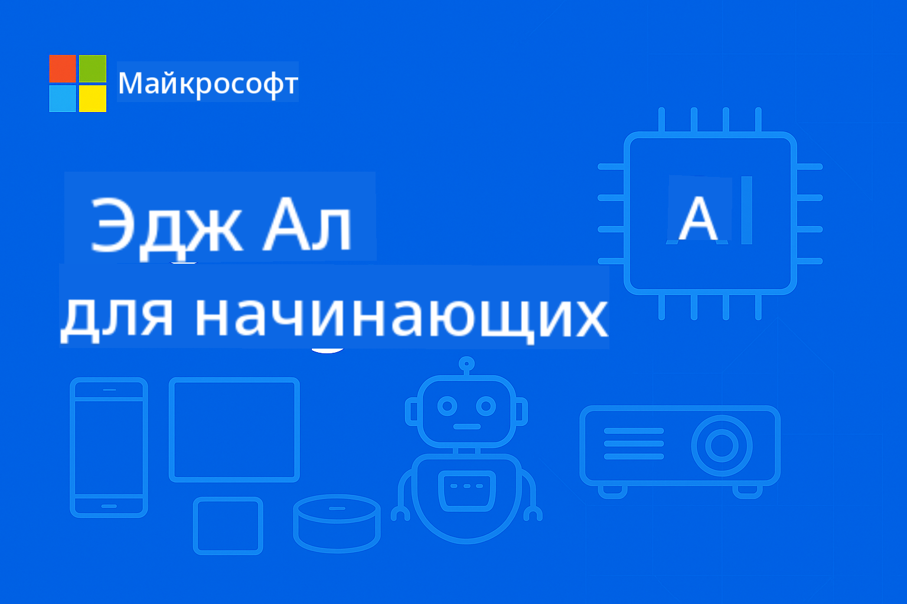

<!--
CO_OP_TRANSLATOR_METADATA:
{
  "original_hash": "cd9cb76aab17c30bfb19ef73060c5fb0",
  "translation_date": "2025-10-11T10:17:59+00:00",
  "source_file": "README.md",
  "language_code": "ru"
}
-->
# EdgeAI для начинающих



[](https://GitHub.com/microsoft/edgeai-for-beginners/graphs/contributors)
[](https://GitHub.com/microsoft/edgeai-for-beginners/issues)
[](https://GitHub.com/microsoft/edgeai-for-beginners/pulls)
[](http://makeapullrequest.com)

[](https://GitHub.com/microsoft/edgeai-for-beginners/watchers)
[](https://GitHub.com/microsoft/edgeai-for-beginners/fork)
[](https://GitHub.com/microsoft/edgeai-for-beginners/stargazers)

[](https://discord.com/invite/ByRwuEEgH4)

Следуйте этим шагам, чтобы начать использовать ресурсы:

1. **Сделайте форк репозитория**: Нажмите [](https://GitHub.com/microsoft/edgeai-for-beginners/fork)
2. **Клонируйте репозиторий**: `git clone https://github.com/microsoft/edgeai-for-beginners.git`
3. [**Присоединяйтесь к Azure AI Foundry Discord, чтобы встретиться с экспертами и разработчиками**](https://discord.com/invite/ByRwuEEgH4)

### 🌐 Поддержка нескольких языков

#### Поддерживается через GitHub Action (автоматически и всегда актуально)

<!-- CO-OP TRANSLATOR LANGUAGES TABLE START -->
[Арабский](../ar/README.md) | [Бенгальский](../bn/README.md) | [Болгарский](../bg/README.md) | [Бирманский (Мьянма)](../my/README.md) | [Китайский (упрощенный)](../zh/README.md) | [Китайский (традиционный, Гонконг)](../hk/README.md) | [Китайский (традиционный, Макао)](../mo/README.md) | [Китайский (традиционный, Тайвань)](../tw/README.md) | [Хорватский](../hr/README.md) | [Чешский](../cs/README.md) | [Датский](../da/README.md) | [Голландский](../nl/README.md) | [Эстонский](../et/README.md) | [Финский](../fi/README.md) | [Французский](../fr/README.md) | [Немецкий](../de/README.md) | [Греческий](../el/README.md) | [Иврит](../he/README.md) | [Хинди](../hi/README.md) | [Венгерский](../hu/README.md) | [Индонезийский](../id/README.md) | [Итальянский](../it/README.md) | [Японский](../ja/README.md) | [Корейский](../ko/README.md) | [Литовский](../lt/README.md) | [Малайский](../ms/README.md) | [Маратхи](../mr/README.md) | [Непальский](../ne/README.md) | [Норвежский](../no/README.md) | [Персидский (фарси)](../fa/README.md) | [Польский](../pl/README.md) | [Португальский (Бразилия)](../br/README.md) | [Португальский (Португалия)](../pt/README.md) | [Панджаби (Гурмукхи)](../pa/README.md) | [Румынский](../ro/README.md) | [Русский](./README.md) | [Сербский (кириллица)](../sr/README.md) | [Словацкий](../sk/README.md) | [Словенский](../sl/README.md) | [Испанский](../es/README.md) | [Суахили](../sw/README.md) | [Шведский](../sv/README.md) | [Тагальский (Филиппины)](../tl/README.md) | [Тамильский](../ta/README.md) | [Тайский](../th/README.md) | [Турецкий](../tr/README.md) | [Украинский](../uk/README.md) | [Урду](../ur/README.md) | [Вьетнамский](../vi/README.md)
<!-- CO-OP TRANSLATOR LANGUAGES TABLE END -->

**Если вы хотите добавить поддержку дополнительных языков, список доступных языков находится [здесь](https://github.com/Azure/co-op-translator/blob/main/getting_started/supported-languages.md)**

## Введение

Добро пожаловать в **EdgeAI для начинающих** – ваш полный путь в мир передовых технологий Edge искусственного интеллекта. Этот курс соединяет мощные возможности ИИ с практическим применением на устройствах, позволяя использовать потенциал ИИ там, где генерируются данные и принимаются решения.

### Чему вы научитесь

Курс охватывает все этапы – от базовых концепций до готовых к производству решений:
- **Малые языковые модели (SLM)**, оптимизированные для работы на устройствах
- **Оптимизация с учетом оборудования** для различных платформ
- **Инференс в реальном времени** с сохранением конфиденциальности
- **Стратегии развертывания** для корпоративных приложений

### Почему EdgeAI важен

Edge AI меняет подход к решению современных задач:
- **Конфиденциальность и безопасность**: обработка данных локально, без передачи в облако
- **Производительность в реальном времени**: устранение задержек сети для критически важных приложений
- **Экономия затрат**: снижение расходов на пропускную способность и облачные вычисления
- **Устойчивость работы**: поддержание функциональности при сбоях сети
- **Соответствие нормативным требованиям**: соблюдение правил суверенитета данных

### Edge AI

Edge AI – это выполнение алгоритмов ИИ и языковых моделей локально на оборудовании, рядом с местом генерации данных, без использования облачных ресурсов для инференса. Это снижает задержки, повышает конфиденциальность и позволяет принимать решения в реальном времени.

### Основные принципы:
- **Инференс на устройстве**: модели ИИ работают на устройствах (телефонах, маршрутизаторах, микроконтроллерах, промышленных ПК)
- **Работа без подключения к интернету**: функционирование без постоянного подключения к сети
- **Низкая задержка**: мгновенные ответы для систем реального времени
- **Суверенитет данных**: хранение конфиденциальных данных локально для повышения безопасности и соответствия требованиям

### Малые языковые модели (SLM)

SLM, такие как Phi-4, Mistral-7B и Gemma, представляют собой оптимизированные версии больших языковых моделей, обученные или дистиллированные для:
- **Снижения объема памяти**: эффективное использование ограниченной памяти устройств
- **Снижения вычислительных требований**: оптимизация для работы на CPU и edge GPU
- **Быстрого запуска**: быстрое инициализирование для отзывчивых приложений

Они предоставляют мощные возможности обработки естественного языка, соответствуя ограничениям:
- **Встроенных систем**: IoT-устройств и промышленных контроллеров
- **Мобильных устройств**: смартфонов и планшетов с возможностью работы офлайн
- **IoT-устройств**: датчиков и умных устройств с ограниченными ресурсами
- **Edge-серверов**: локальных вычислительных узлов с ограниченными ресурсами GPU
- **Персональных компьютеров**: сценарии развертывания на настольных и портативных ПК

## Модули курса и навигация

| Модуль | Тема | Область фокуса | Основное содержание | Уровень | Длительность |
|--------|-------|----------------|---------------------|---------|--------------|
| [📖 00 ](./introduction.md) | [Введение в EdgeAI](./introduction.md) | Основы и контекст | Обзор EdgeAI • Применение в индустрии • Введение в SLM • Цели обучения | Начальный | 1-2 часа |
| [📚 01](../../Module01) | [Основы EdgeAI](./Module01/README.md) | Сравнение облачного и Edge AI | Основы EdgeAI • Примеры из реального мира • Руководство по реализации • Развертывание на Edge | Начальный | 3-4 часа |
| [🧠 02](../../Module02) | [Основы моделей SLM](./Module02/README.md) | Семейства моделей и архитектура | Семейство Phi • Семейство Qwen • Семейство Gemma • BitNET • μModel • Phi-Silica | Начальный | 4-5 часов |
| [🚀 03](../../Module03) | [Практика развертывания SLM](./Module03/README.md) | Локальное и облачное развертывание | Углубленное обучение • Локальная среда • Облачное развертывание | Средний | 4-5 часов |
| [⚙️ 04](../../Module04) | [Инструменты оптимизации моделей](./Module04/README.md) | Кроссплатформенная оптимизация | Введение • Llama.cpp • Microsoft Olive • OpenVINO • Apple MLX • Синтез рабочих процессов | Средний | 5-6 часов |
| [🔧 05](../../Module05) | [SLMOps в производстве](./Module05/README.md) | Операции в производстве | Введение в SLMOps • Дистилляция моделей • Тонкая настройка • Производственное развертывание | Продвинутый | 5-6 часов |
| [🤖 06](../../Module06) | [AI-агенты и вызов функций](./Module06/README.md) | Фреймворки агентов и MCP | Введение в агентов • Вызов функций • Протокол контекста модели | Продвинутый | 4-5 часов |
| [💻 07](../../Module07) | [Реализация платформы](./Module07/README.md) | Примеры для разных платформ | Инструментарий ИИ • Foundry Local • Разработка для Windows | Продвинутый | 3-4 часа |
| [🏭 08](../../Module08) | [Инструментарий Foundry Local](./Module08/README.md) | Примеры, готовые к производству | Примерные приложения (см. детали ниже) | Эксперт | 8-10 часов |

### 🏭 **Модуль 08: Примерные приложения**

- [01: Быстрый старт REST Chat](./Module08/samples/01/README.md)
- [02: Интеграция OpenAI SDK](./Module08/samples/02/README.md)
- [03: Обнаружение моделей и тестирование производительности](./Module08/samples/03/README.md)
- [04: Приложение Chainlit RAG](./Module08/samples/04/README.md)
- [05: Оркестрация нескольких агентов](./Module08/samples/05/README.md)
- [06: Маршрутизатор моделей как инструментов](./Module08/samples/06/README.md)
- [07: Прямой API-клиент](./Module08/samples/07/README.md)
- [08: Приложение для чата Windows 11](./Module08/samples/08/README.md)
- [09: Система продвинутой оркестрации агентов](./Module08/samples/09/README.md)
- [10: Фреймворк инструментов Foundry](./Module08/samples/10/README.md)

### 🎓 **Мастерская: Практический путь обучения**

Полные материалы для практической мастерской с готовыми к производству реализациями:

- **[Руководство по мастерской](./Workshop/Readme.md)** - Полные цели обучения, результаты и навигация по ресурсам
- **Примеры на Python** (6 сессий) - Обновлены с учетом лучших практик, обработки ошибок и полной документации
- **Jupyter Notebooks** (8 интерактивных) - Пошаговые руководства с тестами производительности и мониторингом
- **Руководства по сессиям** - Подробные инструкции в формате markdown для каждой сессии мастерской
- **Инструменты проверки** - Скрипты для проверки качества кода и тестирования

**Что вы создадите:**
- Локальные приложения для чата с поддержкой потоковой передачи
- RAG-пайплайны с оценкой качества (RAGAS)
- Инструменты для тестирования и сравнения нескольких моделей
- Системы оркестрации нескольких агентов
- Интеллектуальный маршрутизатор моделей с выбором задач

### 📊 **Резюме пути обучения**
- **Общая длительность**: 36-45 часов
- **Начальный уровень**: Модули 01-02 (7-9 часов)  
- **Средний уровень**: Модули 03-04 (9-11 часов)
- **Продвинутый уровень**: Модули 05-07 (12-15 часов)
- **Экспертный уровень**: Модуль 08 (8-10 часов)

## Что вы создадите

### 🎯 Основные компетенции
- **Архитектура Edge AI**: Проектирование систем ИИ с локальным приоритетом и облачной интеграцией
- **Оптимизация моделей**: Квантование и сжатие моделей для развертывания на Edge (ускорение на 85%, уменьшение размера на 75%)
- **Кроссплатформенное развертывание**: Windows, мобильные устройства, встроенные системы и гибридные облачно-Edge системы
- **Производственные операции**: Мониторинг, масштабирование и поддержка Edge AI в продакшене

### 🏗️ Практические проекты
- **Foundry Local Chat Apps**: Нативное приложение для Windows 11 с переключением моделей
- **Мультиагентные системы**: Координатор со специализированными агентами для сложных рабочих процессов  
- **RAG-приложения**: Обработка локальных документов с использованием векторного поиска
- **Маршрутизаторы моделей**: Интеллектуальный выбор моделей на основе анализа задач
- **API-фреймворки**: Клиенты, готовые к продакшену, с потоковой передачей данных и мониторингом состояния
- **Кроссплатформенные инструменты**: Шаблоны интеграции LangChain/Semantic Kernel

### 🏢 Применение в индустрии
**Производство** • **Здравоохранение** • **Автономные транспортные средства** • **Умные города** • **Мобильные приложения**

## Быстрый старт

**Рекомендуемый путь обучения** (всего 20-30 часов):

0. **📖 Введение** ([Introduction.md](./introduction.md)): Основы EdgeAI + контекст индустрии + структура обучения
1. **📚 Основы** (Модули 01-02): Концепции EdgeAI + семейства моделей SLM
2. **⚙️ Оптимизация** (Модули 03-04): Развертывание + фреймворки квантования  
3. **🚀 Продакшен** (Модули 05-06): SLMOps + AI-агенты + вызов функций
4. **💻 Реализация** (Модули 07-08): Примеры платформ + инструментарий Foundry Local

Каждый модуль включает теорию, практические упражнения и примеры кода, готовые к продакшену.

## Влияние на карьеру

**Технические роли**: Архитектор решений EdgeAI • ML-инженер (Edge) • Разработчик IoT AI • Разработчик мобильного AI

**Секторы индустрии**: Производство 4.0 • Технологии здравоохранения • Автономные системы • Финтех • Потребительская электроника

**Проекты для портфолио**: Мультиагентные системы • RAG-приложения для продакшена • Кроссплатформенное развертывание • Оптимизация производительности

## Структура репозитория

```
edgeai-for-beginners/
├── 📖 introduction.md  # Foundation: EdgeAI Overview & Learning Framework
├── 📚 Module01-04/     # Fundamentals → SLMs → Deployment → Optimization  
├── 🔧 Module05-06/     # SLMOps → AI Agents → Function Calling
├── 💻 Module07/        # Platform Samples (VS Code, Windows, Jetson, Mobile)
├── 🏭 Module08/        # Foundry Local Toolkit + 10 Comprehensive Samples
│   ├── samples/01-06/  # Foundation: REST, SDK, RAG, Agents, Routing
│   └── samples/07-10/  # Advanced: API Client, Windows App, Enterprise Agents, Tools
├── 🌐 translations/    # Multi-language support (8+ languages)
└── 📋 STUDY_GUIDE.md   # Structured learning paths & time allocation
```

## Основные моменты курса

✅ **Постепенное обучение**: Теория → Практика → Развертывание в продакшене  
✅ **Реальные кейсы**: Microsoft, Japan Airlines, корпоративные внедрения  
✅ **Практические примеры**: Более 50 примеров, 10 комплексных Foundry Local демонстраций  
✅ **Фокус на производительности**: Ускорение на 85%, уменьшение размера на 75%  
✅ **Мультиплатформенность**: Windows, мобильные устройства, встроенные системы, гибрид облако-Edge  
✅ **Готовность к продакшену**: Мониторинг, масштабирование, безопасность, соответствие требованиям

📖 **[Доступно руководство по обучению](STUDY_GUIDE.md)**: Структурированный 20-часовой учебный план с рекомендациями по распределению времени и инструментами для самооценки.

---

**EdgeAI — это будущее развертывания AI**: локально-ориентированное, сохраняющее конфиденциальность и эффективное. Освойте эти навыки, чтобы создавать приложения нового поколения.

## Другие курсы

Наша команда создает и другие курсы! Ознакомьтесь:

- [MCP для начинающих](https://github.com/microsoft/mcp-for-beginners)
- [AI-агенты для начинающих](https://github.com/microsoft/ai-agents-for-beginners?WT.mc_id=academic-105485-koreyst)
- [Генеративный AI для начинающих с использованием .NET](https://github.com/microsoft/Generative-AI-for-beginners-dotnet?WT.mc_id=academic-105485-koreyst)
- [Генеративный AI для начинающих с использованием JavaScript](https://github.com/microsoft/generative-ai-with-javascript?WT.mc_id=academic-105485-koreyst)
- [Генеративный AI для начинающих](https://github.com/microsoft/generative-ai-for-beginners?WT.mc_id=academic-105485-koreyst)
- [ML для начинающих](https://aka.ms/ml-beginners?WT.mc_id=academic-105485-koreyst)
- [Data Science для начинающих](https://aka.ms/datascience-beginners?WT.mc_id=academic-105485-koreyst)
- [AI для начинающих](https://aka.ms/ai-beginners?WT.mc_id=academic-105485-koreyst)
- [Кибербезопасность для начинающих](https://github.com/microsoft/Security-101??WT.mc_id=academic-96948-sayoung)
- [Веб-разработка для начинающих](https://aka.ms/webdev-beginners?WT.mc_id=academic-105485-koreyst)
- [IoT для начинающих](https://aka.ms/iot-beginners?WT.mc_id=academic-105485-koreyst)
- [Разработка XR для начинающих](https://github.com/microsoft/xr-development-for-beginners?WT.mc_id=academic-105485-koreyst)
- [Мастерство GitHub Copilot для парного программирования с AI](https://aka.ms/GitHubCopilotAI?WT.mc_id=academic-105485-koreyst)
- [Мастерство GitHub Copilot для разработчиков C#/.NET](https://github.com/microsoft/mastering-github-copilot-for-dotnet-csharp-developers?WT.mc_id=academic-105485-koreyst)
- [Выбери свое приключение с Copilot](https://github.com/microsoft/CopilotAdventures?WT.mc_id=academic-105485-koreyst)

## Получение помощи

Если вы столкнулись с трудностями или у вас есть вопросы о создании AI-приложений, присоединяйтесь:

[](https://aka.ms/foundry/discord)

Если у вас есть отзывы о продукте или ошибки при разработке, посетите:

[](https://aka.ms/foundry/forum)

---

**Отказ от ответственности**:  
Этот документ был переведен с помощью сервиса автоматического перевода [Co-op Translator](https://github.com/Azure/co-op-translator). Несмотря на наши усилия обеспечить точность, автоматические переводы могут содержать ошибки или неточности. Оригинальный документ на его родном языке следует считать авторитетным источником. Для получения критически важной информации рекомендуется профессиональный перевод человеком. Мы не несем ответственности за любые недоразумения или неправильные интерпретации, возникшие в результате использования данного перевода.