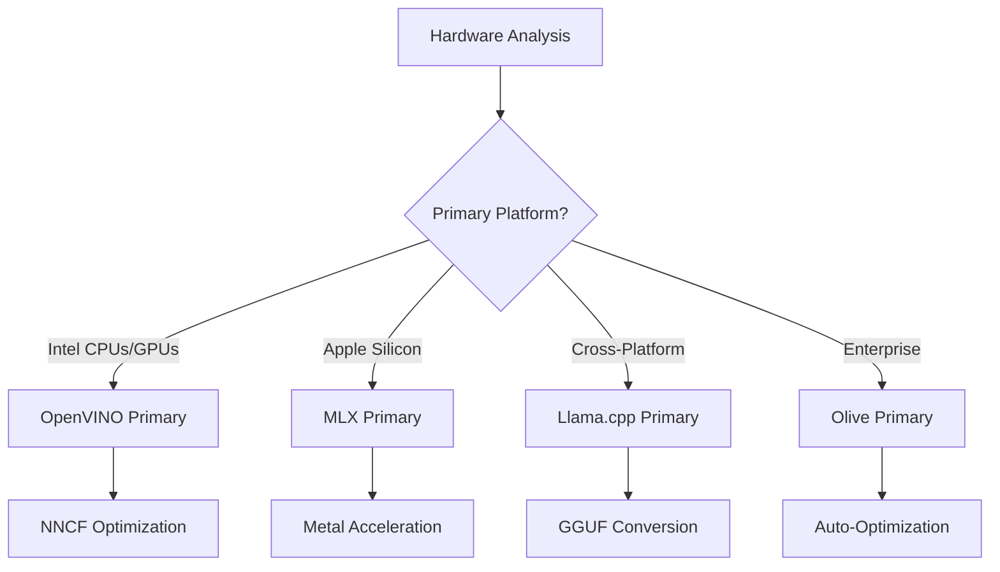
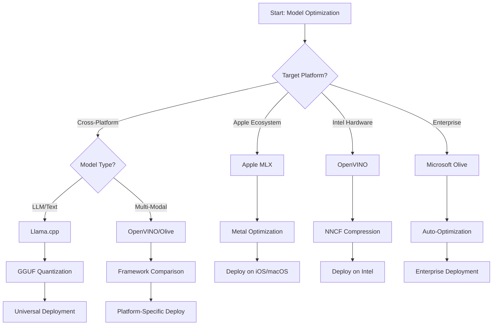
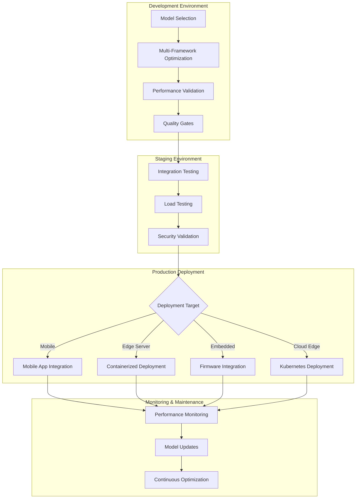

<!--
CO_OP_TRANSLATOR_METADATA:
{
  "original_hash": "6719c4a7e44b948230ac5f5cab3699bd",
  "translation_date": "2025-09-18T18:51:23+00:00",
  "source_file": "Module04/06.workflow-synthesis.md",
  "language_code": "sk"
}
-->
# Sekcia 6: Syntéza pracovného postupu vývoja Edge AI

## Obsah
1. [Úvod](../../../Module04)
2. [Ciele učenia](../../../Module04)
3. [Prehľad jednotného pracovného postupu](../../../Module04)
4. [Matica výberu rámca](../../../Module04)
5. [Syntéza najlepších postupov](../../../Module04)
6. [Sprievodca stratégiou nasadenia](../../../Module04)
7. [Pracovný postup optimalizácie výkonu](../../../Module04)
8. [Kontrolný zoznam pripravenosti na produkciu](../../../Module04)
9. [Riešenie problémov a monitorovanie](../../../Module04)
10. [Zabezpečenie budúcnosti vášho Edge AI pipeline](../../../Module04)

## Úvod

Vývoj Edge AI vyžaduje sofistikované pochopenie viacerých optimalizačných rámcov, stratégií nasadenia a hardvérových aspektov. Táto komplexná syntéza spája poznatky z Llama.cpp, Microsoft Olive, OpenVINO a Apple MLX, aby vytvorila jednotný pracovný postup, ktorý maximalizuje efektivitu, zachováva kvalitu a zabezpečuje úspešné nasadenie do produkcie.

Počas tohto kurzu sme preskúmali jednotlivé optimalizačné rámce, z ktorých každý má svoje jedinečné silné stránky a špecializované použitia. Avšak reálne projekty Edge AI často vyžadujú kombináciu techník z viacerých rámcov alebo strategické rozhodnutia o tom, ktorý prístup prinesie najlepšie výsledky pre konkrétne obmedzenia a požiadavky.

Táto sekcia syntetizuje kolektívne poznatky zo všetkých rámcov do praktických pracovných postupov, rozhodovacích stromov a najlepších postupov, ktoré vám umožnia efektívne a účinne vytvárať produkčne pripravené riešenia Edge AI. Či už optimalizujete pre mobilné zariadenia, zabudované systémy alebo edge servery, tento sprievodca poskytuje strategický rámec na informované rozhodovanie počas celého vývojového cyklu.

## Ciele učenia

Na konci tejto sekcie budete schopní:

### Strategické rozhodovanie
- **Vyhodnotiť a vybrať** optimálny optimalizačný rámec na základe požiadaviek projektu, hardvérových obmedzení a scenárov nasadenia
- **Navrhnúť komplexné pracovné postupy**, ktoré integrujú viaceré optimalizačné techniky pre maximálnu efektivitu
- **Posúdiť kompromisy** medzi presnosťou modelu, rýchlosťou inferencie, využitím pamäte a zložitosťou nasadenia naprieč rôznymi rámcami

### Integrácia pracovného postupu
- **Implementovať jednotné vývojové pipeline**, ktoré využívajú silné stránky viacerých optimalizačných rámcov
- **Vytvoriť reprodukovateľné pracovné postupy** pre konzistentnú optimalizáciu modelov a nasadenie v rôznych prostrediach
- **Zaviesť kontrolné brány kvality** a validačné procesy na zabezpečenie, že optimalizované modely spĺňajú požiadavky produkcie

### Optimalizácia výkonu
- **Aplikovať systematické optimalizačné stratégie** pomocou kvantizácie, prerezávania a techník špecifických pre hardvér
- **Monitorovať a benchmarkovať** výkon modelu naprieč rôznymi úrovňami optimalizácie a cieľovými platformami
- **Optimalizovať pre konkrétne hardvérové platformy**, vrátane CPU, GPU, NPU a špecializovaných edge akcelerátorov

### Nasadenie do produkcie
- **Navrhnúť škálovateľné architektúry nasadenia**, ktoré podporujú viaceré formáty modelov a inferenčné enginy
- **Implementovať monitorovanie a pozorovateľnosť** pre aplikácie Edge AI v produkčnom prostredí
- **Zaviesť pracovné postupy údržby** pre aktualizácie modelov, monitorovanie výkonu a optimalizáciu systému

### Excelencia naprieč platformami
- **Nasadiť optimalizované modely** na rôznych hardvérových platformách pri zachovaní konzistentného výkonu
- **Riešiť optimalizácie špecifické pre platformu** pre Windows, macOS, Linux, mobilné a zabudované systémy
- **Vytvoriť abstrakčné vrstvy**, ktoré umožňujú bezproblémové nasadenie v rôznych edge prostrediach

## Prehľad jednotného pracovného postupu

### Fáza 1: Analýza požiadaviek a výber rámca

Základ úspešného nasadenia Edge AI začína dôkladnou analýzou požiadaviek, ktorá informuje výber rámca a optimalizačnú stratégiu.

#### 1.1 Hodnotenie hardvéru


**Kľúčové aspekty:**
- **Architektúra CPU**: x86, ARM, schopnosti Apple Silicon
- **Dostupnosť akcelerátorov**: GPU, NPU, VPU, špecializované AI čipy
- **Obmedzenia pamäte**: Limity RAM, kapacita úložiska
- **Energetický rozpočet**: Výdrž batérie, tepelné obmedzenia
- **Konektivita**: Požiadavky na offline režim, obmedzenia šírky pásma

#### 1.2 Matica požiadaviek aplikácie

| Požiadavka | Llama.cpp | Microsoft Olive | OpenVINO | Apple MLX |
|------------|-----------|-----------------|----------|-----------|
| Naprieč platformami | ✅ Výborné | ⚡ Dobré | ⚡ Dobré | ❌ Len Apple |
| Integrácia do podnikov | ⚡ Základná | ✅ Výborná | ✅ Výborná | ⚡ Obmedzená |
| Nasadenie na mobil | ✅ Výborné | ⚡ Dobré | ⚡ Dobré | ✅ iOS Výborné |
| Inferencia v reálnom čase | ✅ Výborné | ✅ Výborné | ✅ Výborné | ✅ Výborné |
| Rozmanitosť modelov | ✅ Zamerané na LLM | ✅ Všetky modely | ✅ Všetky modely | ✅ Zamerané na LLM |
| Jednoduchosť použitia | ✅ Jednoduché | ✅ Automatizované | ⚡ Stredné | ✅ Jednoduché |

### Fáza 2: Príprava a optimalizácia modelu

#### 2.1 Univerzálny pipeline hodnotenia modelu

```python
# Universal Model Assessment Framework
class EdgeAIModelAssessment:
    def __init__(self, model_path, target_hardware):
        self.model_path = model_path
        self.target_hardware = target_hardware
        self.optimization_frameworks = []
        
    def assess_model_characteristics(self):
        """Analyze model size, architecture, and complexity"""
        return {
            'model_size': self.get_model_size(),
            'parameter_count': self.get_parameter_count(),
            'architecture_type': self.detect_architecture(),
            'quantization_compatibility': self.check_quantization_support()
        }
    
    def recommend_optimization_strategy(self):
        """Recommend optimal frameworks and techniques"""
        characteristics = self.assess_model_characteristics()
        
        if self.target_hardware.startswith('apple'):
            return self.mlx_optimization_strategy(characteristics)
        elif self.target_hardware.startswith('intel'):
            return self.openvino_optimization_strategy(characteristics)
        elif characteristics['model_size'] > 7_000_000_000:  # 7B+ parameters
            return self.enterprise_optimization_strategy(characteristics)
        else:
            return self.lightweight_optimization_strategy(characteristics)
```

#### 2.2 Pipeline optimalizácie pre viaceré rámce

**Sekvenčný prístup k optimalizácii:**
1. **Počiatočná konverzia**: Konverzia na intermediárny formát (ONNX, ak je to možné)
2. **Optimalizácia špecifická pre rámec**: Aplikácia špecializovaných techník
3. **Krížová validácia**: Overenie výkonu na cieľových platformách
4. **Finálne balenie**: Príprava na nasadenie

```bash
# Multi-Framework Optimization Script
#!/bin/bash

MODEL_NAME="phi-3-mini"
BASE_MODEL="microsoft/Phi-3-mini-4k-instruct"

# Phase 1: ONNX Conversion (Universal)
python convert_to_onnx.py --model $BASE_MODEL --output models/onnx/

# Phase 2: Platform-Specific Optimization
if [[ "$TARGET_PLATFORM" == "intel" ]]; then
    # OpenVINO Optimization
    python optimize_openvino.py --input models/onnx/ --output models/openvino/
elif [[ "$TARGET_PLATFORM" == "apple" ]]; then
    # MLX Optimization
    python optimize_mlx.py --input $BASE_MODEL --output models/mlx/
elif [[ "$TARGET_PLATFORM" == "cross" ]]; then
    # Llama.cpp Optimization
    python convert_to_gguf.py --input models/onnx/ --output models/gguf/
fi

# Phase 3: Validation
python validate_optimization.py --original $BASE_MODEL --optimized models/$TARGET_PLATFORM/
```

### Fáza 3: Validácia výkonu a benchmarkovanie

#### 3.1 Komplexný rámec benchmarkovania

```python
class EdgeAIBenchmark:
    def __init__(self, optimized_models):
        self.models = optimized_models
        self.metrics = {
            'inference_time': [],
            'memory_usage': [],
            'accuracy_score': [],
            'throughput': [],
            'energy_consumption': []
        }
    
    def run_comprehensive_benchmark(self):
        """Execute standardized benchmarks across all optimized models"""
        test_inputs = self.generate_test_inputs()
        
        for model_framework, model_path in self.models.items():
            print(f"Benchmarking {model_framework}...")
            
            # Latency Testing
            latency = self.measure_inference_latency(model_path, test_inputs)
            
            # Memory Profiling
            memory = self.profile_memory_usage(model_path)
            
            # Accuracy Validation
            accuracy = self.validate_model_accuracy(model_path, test_inputs)
            
            # Throughput Analysis
            throughput = self.measure_throughput(model_path)
            
            self.record_metrics(model_framework, latency, memory, accuracy, throughput)
    
    def generate_optimization_report(self):
        """Create comprehensive comparison report"""
        report = {
            'recommendations': self.analyze_performance_trade_offs(),
            'deployment_guidance': self.generate_deployment_recommendations(),
            'monitoring_requirements': self.define_monitoring_metrics()
        }
        return report
```

## Matica výberu rámca

### Rozhodovací strom pre výber rámca



### Komplexné kritériá výberu

#### 1. Zarovnanie s primárnym použitím

**Veľké jazykové modely (LLMs):**
- **Llama.cpp**: Najlepšie pre CPU zamerané, naprieč platformami
- **Apple MLX**: Optimálne pre Apple Silicon s jednotnou pamäťou
- **OpenVINO**: Výborné pre Intel hardvér s NNCF optimalizáciou
- **Microsoft Olive**: Ideálne pre podnikové workflowy s automatizáciou

**Multimodálne modely:**
- **OpenVINO**: Komplexná podpora pre vizuálne, audio a textové modely
- **Microsoft Olive**: Podniková optimalizácia pre komplexné pipeline
- **Llama.cpp**: Obmedzené na textové modely
- **Apple MLX**: Rastúca podpora pre multimodálne aplikácie

#### 2. Matica hardvérových platforiem

| Platforma | Primárny rámec | Sekundárna možnosť | Špecializované funkcie |
|-----------|----------------|--------------------|------------------------|
| Intel CPU/GPU | OpenVINO | Microsoft Olive | Kompresia NNCF, Intel optimalizácia |
| NVIDIA GPU | Microsoft Olive | OpenVINO | CUDA akcelerácia, podnikové funkcie |
| Apple Silicon | Apple MLX | Llama.cpp | Metal shadery, jednotná pamäť |
| ARM Mobile | Llama.cpp | OpenVINO | Naprieč platformami, minimálne závislosti |
| Edge TPU | OpenVINO | Microsoft Olive | Podpora špecializovaných akcelerátorov |
| Zabudovaný ARM | Llama.cpp | OpenVINO | Minimálna stopa, efektívna inferencia |

#### 3. Preferencie pracovného postupu vývoja

**Rýchle prototypovanie:**
1. **Llama.cpp**: Najrýchlejšia inštalácia, okamžité výsledky
2. **Apple MLX**: Jednoduché API v Pythone, rýchla iterácia
3. **Microsoft Olive**: Automatizovaná optimalizácia, minimálna konfigurácia
4. **OpenVINO**: Komplexnejšia inštalácia, rozsiahle funkcie

**Produkcia v podniku:**
1. **Microsoft Olive**: Podnikové funkcie, integrácia Azure
2. **OpenVINO**: Ekosystém Intel, komplexné nástroje
3. **Apple MLX**: Aplikácie špecifické pre Apple
4. **Llama.cpp**: Jednoduché nasadenie, obmedzené podnikové funkcie

## Syntéza najlepších postupov

### Univerzálne princípy optimalizácie

#### 1. Progresívna optimalizačná stratégia

```python
class ProgressiveOptimization:
    def __init__(self, base_model):
        self.base_model = base_model
        self.optimization_stages = [
            'baseline_measurement',
            'format_conversion',
            'quantization_optimization',
            'hardware_acceleration',
            'production_validation'
        ]
    
    def execute_progressive_optimization(self):
        """Apply optimization techniques incrementally"""
        
        # Stage 1: Baseline Measurement
        baseline_metrics = self.measure_baseline_performance()
        
        # Stage 2: Format Conversion
        converted_model = self.convert_to_optimal_format()
        conversion_metrics = self.measure_performance(converted_model)
        
        # Stage 3: Quantization
        quantized_model = self.apply_quantization(converted_model)
        quantization_metrics = self.measure_performance(quantized_model)
        
        # Stage 4: Hardware Acceleration
        accelerated_model = self.enable_hardware_acceleration(quantized_model)
        acceleration_metrics = self.measure_performance(accelerated_model)
        
        # Stage 5: Validation
        production_ready = self.validate_for_production(accelerated_model)
        
        return self.compile_optimization_report(
            baseline_metrics, conversion_metrics, 
            quantization_metrics, acceleration_metrics
        )
```

#### 2. Implementácia kontrolných brán kvality

**Brány zachovania presnosti:**
- Zachovať >95 % pôvodnej presnosti modelu
- Validovať na reprezentatívnych testovacích datasetoch
- Implementovať A/B testovanie pre validáciu v produkcii

**Brány zlepšenia výkonu:**
- Dosiahnuť minimálne 2x zlepšenie rýchlosti
- Znížiť pamäťovú stopu minimálne o 50 %
- Validovať konzistenciu času inferencie

**Brány pripravenosti na produkciu:**
- Prejsť záťažovým testovaním
- Demonštrovať stabilný výkon v čase
- Validovať požiadavky na bezpečnosť a súkromie

### Integrácia najlepších postupov špecifických pre rámec

#### 1. Syntéza stratégie kvantizácie

```python
# Unified Quantization Approach
class UnifiedQuantizationStrategy:
    def __init__(self, model, target_platform):
        self.model = model
        self.platform = target_platform
        
    def select_optimal_quantization(self):
        """Choose best quantization based on platform and requirements"""
        
        if self.platform == 'apple_silicon':
            return self.mlx_quantization_strategy()
        elif self.platform == 'intel_hardware':
            return self.openvino_quantization_strategy()
        elif self.platform == 'cross_platform':
            return self.llamacpp_quantization_strategy()
        else:
            return self.olive_quantization_strategy()
    
    def mlx_quantization_strategy(self):
        """Apple MLX-specific quantization"""
        return {
            'method': 'mlx_quantize',
            'precision': 'int4',
            'group_size': 64,
            'optimization_target': 'unified_memory'
        }
    
    def openvino_quantization_strategy(self):
        """OpenVINO NNCF quantization"""
        return {
            'method': 'nncf_quantize',
            'precision': 'int8',
            'calibration_method': 'post_training',
            'optimization_target': 'intel_hardware'
        }
```

#### 2. Optimalizácia hardvérovej akcelerácie

**Optimalizácia CPU:**
- **SIMD inštrukcie**: Využiť optimalizované jadrá naprieč rámcami
- **Šírka pamäte**: Optimalizovať rozloženie dát pre efektivitu cache
- **Vlákna**: Vyvážiť paralelizmus s obmedzeniami zdrojov

**Najlepšie postupy pre GPU akceleráciu:**
- **Batch spracovanie**: Maximalizovať priepustnosť s vhodnými veľkosťami batchov
- **Správa pamäte**: Optimalizovať alokáciu a prenosy pamäte GPU
- **Presnosť**: Použiť FP16, ak je podporované, pre lepší výkon

**Optimalizácia NPU/špecializovaných akcelerátorov:**
- **Architektúra modelu**: Zabezpečiť kompatibilitu s schopnosťami akcelerátora
- **Tok dát**: Optimalizovať vstupné/výstupné pipeline pre efektivitu akcelerátora
- **Záložné stratégie**: Implementovať CPU fallback pre nepodporované operácie

## Sprievodca stratégiou nasadenia

### Univerzálna architektúra nasadenia



### Vzory nasadenia špecifické pre platformu

#### 1. Stratégia nasadenia na mobil

```yaml
# Mobile Deployment Configuration
mobile_deployment:
  ios:
    framework: apple_mlx
    optimization:
      quantization: int4
      memory_mapping: true
      background_execution: limited
    packaging:
      format: mlx
      bundle_size: <50MB
      
  android:
    framework: llama_cpp
    optimization:
      quantization: q4_k_m
      threading: android_optimized
      memory_management: conservative
    packaging:
      format: gguf
      apk_size: <100MB
      
  cross_platform:
    framework: onnx_runtime
    optimization:
      quantization: int8
      execution_provider: cpu
    packaging:
      format: onnx
      shared_libraries: minimal
```

#### 2. Nasadenie na edge server

```yaml
# Edge Server Deployment Configuration
edge_server:
  intel_based:
    framework: openvino
    optimization:
      quantization: int8
      acceleration: cpu_gpu_auto
      batch_processing: dynamic
    deployment:
      container: openvino_runtime
      orchestration: kubernetes
      scaling: horizontal
      
  nvidia_based:
    framework: microsoft_olive
    optimization:
      quantization: int4
      acceleration: cuda
      tensor_parallelism: true
    deployment:
      container: nvidia_triton
      orchestration: kubernetes
      scaling: gpu_aware
```

### Najlepšie postupy kontajnerizácie

```dockerfile
# Multi-Framework Edge AI Container
FROM ubuntu:22.04 as base

# Install common dependencies
RUN apt-get update && apt-get install -y \
    python3 \
    python3-pip \
    build-essential \
    cmake \
    && rm -rf /var/lib/apt/lists/*

# Framework-specific stages
FROM base as openvino
RUN pip install openvino nncf optimum[intel]

FROM base as llamacpp
RUN git clone https://github.com/ggerganov/llama.cpp.git \
    && cd llama.cpp && make LLAMA_OPENBLAS=1

FROM base as olive
RUN pip install olive-ai[auto-opt] onnxruntime-genai

# Production stage with selected framework
FROM openvino as production
COPY models/ /app/models/
COPY src/ /app/src/
WORKDIR /app

EXPOSE 8080
CMD ["python3", "src/inference_server.py"]
```

## Pracovný postup optimalizácie výkonu

### Systematické ladenie výkonu

#### 1. Pipeline profilovania výkonu

```python
class EdgeAIPerformanceProfiler:
    def __init__(self, model_path, framework):
        self.model_path = model_path
        self.framework = framework
        self.profiling_results = {}
    
    def comprehensive_profiling(self):
        """Execute comprehensive performance analysis"""
        
        # CPU Profiling
        cpu_profile = self.profile_cpu_usage()
        
        # Memory Profiling
        memory_profile = self.profile_memory_usage()
        
        # Inference Latency
        latency_profile = self.profile_inference_latency()
        
        # Throughput Analysis
        throughput_profile = self.profile_throughput()
        
        # Energy Consumption (where available)
        energy_profile = self.profile_energy_consumption()
        
        return self.compile_performance_report(
            cpu_profile, memory_profile, latency_profile,
            throughput_profile, energy_profile
        )
    
    def identify_bottlenecks(self):
        """Automatically identify performance bottlenecks"""
        bottlenecks = []
        
        if self.profiling_results['cpu_utilization'] > 80:
            bottlenecks.append('cpu_bound')
        
        if self.profiling_results['memory_usage'] > 90:
            bottlenecks.append('memory_bound')
        
        if self.profiling_results['inference_variance'] > 20:
            bottlenecks.append('inconsistent_performance')
        
        return self.generate_optimization_recommendations(bottlenecks)
```

#### 2. Automatizovaný pipeline optimalizácie

```python
class AutomatedOptimizationPipeline:
    def __init__(self, base_model, target_constraints):
        self.base_model = base_model
        self.constraints = target_constraints
        self.optimization_history = []
    
    def execute_optimization_search(self):
        """Systematically search optimization space"""
        
        optimization_candidates = [
            {'quantization': 'int8', 'pruning': 0.1},
            {'quantization': 'int4', 'pruning': 0.2},
            {'quantization': 'int8', 'acceleration': 'gpu'},
            {'quantization': 'int4', 'acceleration': 'npu'}
        ]
        
        best_configuration = None
        best_score = 0
        
        for config in optimization_candidates:
            optimized_model = self.apply_optimization(config)
            score = self.evaluate_optimization(optimized_model)
            
            if score > best_score and self.meets_constraints(optimized_model):
                best_score = score
                best_configuration = config
            
            self.optimization_history.append({
                'config': config,
                'score': score,
                'model': optimized_model
            })
        
        return best_configuration, self.optimization_history
```

### Multi-objektívna optimalizácia

#### 1. Pareto optimalizácia pre Edge AI

```python
class ParetoOptimization:
    def __init__(self, objectives=['speed', 'accuracy', 'memory']):
        self.objectives = objectives
        self.pareto_frontier = []
    
    def find_pareto_optimal_solutions(self, optimization_results):
        """Identify Pareto-optimal configurations"""
        
        for result in optimization_results:
            is_dominated = False
            
            for frontier_point in self.pareto_frontier:
                if self.dominates(frontier_point, result):
                    is_dominated = True
                    break
            
            if not is_dominated:
                # Remove dominated points from frontier
                self.pareto_frontier = [
                    point for point in self.pareto_frontier 
                    if not self.dominates(result, point)
                ]
                
                self.pareto_frontier.append(result)
        
        return self.pareto_frontier
    
    def recommend_configuration(self, user_preferences):
        """Recommend configuration based on user preferences"""
        
        weighted_scores = []
        for config in self.pareto_frontier:
            score = sum(
                user_preferences[obj] * config['metrics'][obj] 
                for obj in self.objectives
            )
            weighted_scores.append((score, config))
        
        return max(weighted_scores, key=lambda x: x[0])[1]
```

## Kontrolný zoznam pripravenosti na produkciu

### Komplexná validácia produkcie

#### 1. Zabezpečenie kvality modelu

```python
class ProductionReadinessValidator:
    def __init__(self, optimized_model, production_requirements):
        self.model = optimized_model
        self.requirements = production_requirements
        self.validation_results = {}
    
    def validate_model_quality(self):
        """Comprehensive model quality validation"""
        
        # Accuracy Validation
        accuracy_result = self.validate_accuracy()
        
        # Performance Validation
        performance_result = self.validate_performance()
        
        # Robustness Testing
        robustness_result = self.validate_robustness()
        
        # Security Assessment
        security_result = self.validate_security()
        
        # Compliance Verification
        compliance_result = self.validate_compliance()
        
        return self.compile_validation_report(
            accuracy_result, performance_result, robustness_result,
            security_result, compliance_result
        )
    
    def generate_certification_report(self):
        """Generate production certification report"""
        return {
            'model_signature': self.generate_model_signature(),
            'validation_timestamp': datetime.now(),
            'validation_results': self.validation_results,
            'deployment_approval': self.check_deployment_approval(),
            'monitoring_requirements': self.define_monitoring_requirements()
        }
```

#### 2. Kontrolný zoznam nasadenia do produkcie

**Validácia pred nasadením:**
- [ ] Presnosť modelu spĺňa minimálne požiadavky (>95 % základnej hodnoty)
- [ ] Dosiahnuté ciele výkonu (latencia, priepustnosť, pamäť)
- [ ] Posúdené a zmiernené bezpečnostné zraniteľnosti
- [ ] Dokončené záťažové testovanie pri očakávanom zaťažení
- [ ] Otestované scenáre zlyhania a validované postupy obnovy
- [ ] Konfigurované systémy monitorovania a upozornení
- [ ] Otestované a zdokumentované postupy rollbacku

**Proces nasadenia:**
- [ ] Implementovaná stratégia blue-green nasadenia
- [ ] Konfigurované postupné zvyšovanie prevádzky
- [ ] Aktívne dashboardy monitorovania v reálnom čase
- [ ] Stanovené výkonnostné základné hodnoty
- [ ] Definované prahové hodnoty chybovosti
- [ ] Konfigurované automatizované spúšťače rollbacku

**Monitorovanie po nasadení:**
- [ ] Aktívna detekcia driftu modelu
- [ ] Konfigurované upozornenia na degradáciu výkonu
- [ ] Povolené monitorovanie využitia zdrojov
- [ ] Sledované metriky používateľskej skúsenosti
- [ ] Udržiavané verzovanie a rodokmeň modelu
- [ ] Naplánované pravidelné prehľady výkonu modelu

### Kontinuálna integrácia/kontinuálne nasadenie (CI/CD)

```yaml
# Edge AI CI/CD Pipeline Configuration
edge_ai_pipeline:
  stages:
    - model_validation
    - optimization
    - testing
    - staging_deployment
    - production_deployment
    - monitoring
  
  model_validation:
    accuracy_threshold: 0.95
    performance_baseline: required
    security_scan: enabled
    
  optimization:
    frameworks:
      - llama_cpp
      - openvino
      - microsoft_olive
    validation:
      cross_validation: enabled
      performance_comparison: required
      
  testing:
    unit_tests: comprehensive
    integration_tests: full_pipeline
    load_tests: production_scale
    security_tests: comprehensive
    
  deployment:
    strategy: blue_green
    traffic_ramping: gradual
    rollback: automatic
    monitoring: real_time
```

## Riešenie problémov a monitorovanie

### Univerzálny rámec riešenia problémov

#### 1. Bežné problémy a riešenia

**Problémy s výkonom:**
```python
class PerformanceTroubleshooter:
    def __init__(self, model_metrics):
        self.metrics = model_metrics
        
    def diagnose_performance_issues(self):
        """Systematic performance issue diagnosis"""
        
        issues = []
        
        # High latency diagnosis
        if self.metrics['avg_latency'] > self.metrics['target_latency']:
            issues.append(self.diagnose_latency_issues())
        
        # Memory usage diagnosis
        if self.metrics['memory_usage'] > self.metrics['memory_limit']:
            issues.append(self.diagnose_memory_issues())
        
        # Throughput diagnosis
        if self.metrics['throughput'] < self.metrics['target_throughput']:
            issues.append(self.diagnose_throughput_issues())
        
        return self.generate_resolution_plan(issues)
    
    def diagnose_latency_issues(self):
        """Specific latency troubleshooting"""
        potential_causes = []
        
        if self.metrics['cpu_utilization'] > 80:
            potential_causes.append('cpu_bottleneck')
        
        if self.metrics['memory_bandwidth'] > 90:
            potential_causes.append('memory_bandwidth_limit')
        
        if self.metrics['model_size'] > self.metrics['optimal_size']:
            potential_causes.append('model_too_large')
        
        return {
            'issue': 'high_latency',
            'causes': potential_causes,
            'solutions': self.generate_latency_solutions(potential_causes)
        }
```

**Riešenie problémov špecifické pre rámec:**

| Problém | Llama.cpp | Microsoft Olive | OpenVINO | Apple MLX |
|---------|-----------|-----------------|----------|-----------|
| Problémy s pamäťou | Znížiť dĺžku kontextu | Znížiť veľkosť batchu | Povoliť caching | Použiť mapovanie pamäte |
| Pomalá inferencia | Povoliť SIMD | Skontrolovať kvantizáciu | Optimalizovať vlákna | Povoliť Metal |
| Strata presnosti | Vyššia kvantizácia | Pretrénovať s QAT | Zvýšiť kalibráciu | Doladiť po kvantizácii |
| Kompatibilita | Skontrolovať formát modelu | Overiť verziu rámca | Aktualizovať ovládače | Skontrolovať verziu macOS |

#### 2. Stratégia monitorovania produkcie

```python
class EdgeAIMonitoring:
    def __init__(self, deployment_config):
        self.config = deployment_config
        self.metrics_collectors = []
        self.alerting_rules = []
    
    def setup_comprehensive_monitoring(self):
        """Configure comprehensive monitoring for Edge AI deployment"""
        
        # Model Performance Monitoring
        self.setup_model_performance_monitoring()
        
        # Infrastructure Monitoring
        self.setup_infrastructure_monitoring()
        
        # Business Metrics Monitoring
        self.setup_business_metrics_monitoring()
        
        # Security Monitoring
        self.setup_security_monitoring()
    
    def setup_model_performance_monitoring(self):
        """Model-specific performance monitoring"""
        metrics = [
            'inference_latency_p50',
            'inference_latency_p95',
            'inference_latency_p99',
            'model_accuracy_drift',
            'prediction_confidence_distribution',
            'error_rate',
            'throughput_requests_per_second'
        ]
        
        for metric in metrics:
            self.add_metric_collector(metric)
            self.add_alerting_rule(metric)
    
    def detect_model_drift(self):
        """Automated model drift detection"""
        drift_indicators = [
            self.statistical_drift_detection(),
            self.performance_drift_detection(),
            self.data_distribution_shift_detection()
        ]
        
        return self.aggregate_drift_signals(drift_indicators)
```

### Automatizované riešenie problémov

```python
class AutomatedIssueResolution:
    def __init__(self, monitoring_system):
        self.monitoring = monitoring_system
        self.resolution_strategies = {}
    
    def handle_performance_degradation(self, alert):
        """Automated performance issue resolution"""
        
        if alert['type'] == 'high_latency':
            return self.resolve_latency_issue(alert)
        elif alert['type'] == 'high_memory_usage':
            return self.resolve_memory_issue(alert)
        elif alert['type'] == 'accuracy_drift':
            return self.resolve_accuracy_issue(alert)
        
    def resolve_latency_issue(self, alert):
        """Automated latency issue resolution"""
        resolution_steps = [
            'increase_cpu_allocation',
            'enable_model_caching',
            'reduce_batch_size',
            'switch_to_quantized_model'
        ]
        
        for step in resolution_steps:
            if self.apply_resolution_step(step):
                return f"Resolved latency issue with: {step}"
        
        return "Escalating to human operator"
```

## Zabezpečenie budúcnosti vášho Edge AI pipeline

### Integrácia vznikajúcich technológií

#### 1. Podpora hardvéru novej generácie

```python
class FutureHardwareIntegration:
    def __init__(self):
        self.supported_accelerators = [
            'npu_next_gen',
            'quantum_processors',
            'neuromorphic_chips',
            'optical_processors'
        ]
    
    def design_adaptive_pipeline(self):
        """Create hardware-agnostic optimization pipeline"""
        
        pipeline = {
            'model_preparation': self.universal_model_preparation(),
            'hardware_detection': self.dynamic_hardware_detection(),
            'optimization_selection': self.adaptive_optimization_selection(),
            'performance_validation': self.hardware_agnostic_validation()
        }
        
        return pipeline
    
    def adaptive_optimization_selection(self):
        """Dynamically select optimization based on available hardware"""
        
        def optimize_for_hardware(model, available_hardware):
            if 'npu' in available_hardware:
                return self.npu_optimization(model)
            elif 'quantum' in available_hardware:
                return self.quantum_optimization(model)
            elif 'neuromorphic' in available_hardware:
                return self.neuromorphic_optimization(model)
            else:
                return self.fallback_optimization(model)
        
        return optimize_for_hardware
```

#### 2. Evolúcia architektúry modelu

**Podpora vznikajúcich architektúr:**
- **Mixture of Experts (MoE)**: Riedke architektúry modelov pre efektivitu
- **Retrieval-Augmented Generation**: Hybridné systémy model + databáza znalostí
- **Multimodálne modely**: Integrácia vizuálnych, jazykových a audio dát
- **Federované učenie**: Distribuované trénovanie a optimalizácia

```python
class NextGenModelSupport:
    def __init__(self):
        self.architecture_handlers = {
            'moe': self.handle_mixture_of_experts,
            'rag': self.handle_retrieval_augmented,
            'multimodal': self.handle_multimodal,
            'federated': self.handle_federated_learning
        }
    
    def handle_mixture_of_experts(self, model):
        """Optimize Mixture of Experts models for edge deployment"""
        optimization_strategy = {
            'expert_pruning': True,
            'routing_optimization': True,
            'expert_quantization': 'per_expert',
            'load_balancing': 'dynamic'
        }
        return self.apply_moe_optimization(model, optimization_strategy)
```

### Kontinuálne učenie a adaptácia

#### 1. Integrácia
Pamätajte, že najlepšia stratégia optimalizácie je tá, ktorá spĺňa vaše konkrétne požiadavky a zároveň si zachováva flexibilitu prispôsobiť sa, keď sa tieto požiadavky vyvíjajú. Použite tento návod ako rámec na informované rozhodovanie, ale vždy overujte svoje voľby prostredníctvom empirického testovania a skúseností z reálneho nasadenia.

## ➡️ Čo ďalej

Pokračujte vo svojej ceste Edge AI preskúmaním [Modulu 5: SLMOps a nasadenie do produkcie](../Module05/README.md), kde sa dozviete o operačných aspektoch správy životného cyklu malých jazykových modelov.

---

**Upozornenie**:  
Tento dokument bol preložený pomocou služby AI prekladu [Co-op Translator](https://github.com/Azure/co-op-translator). Hoci sa snažíme o presnosť, prosím, berte na vedomie, že automatizované preklady môžu obsahovať chyby alebo nepresnosti. Pôvodný dokument v jeho rodnom jazyku by mal byť považovaný za autoritatívny zdroj. Pre kritické informácie sa odporúča profesionálny ľudský preklad. Nie sme zodpovední za akékoľvek nedorozumenia alebo nesprávne interpretácie vyplývajúce z použitia tohto prekladu.