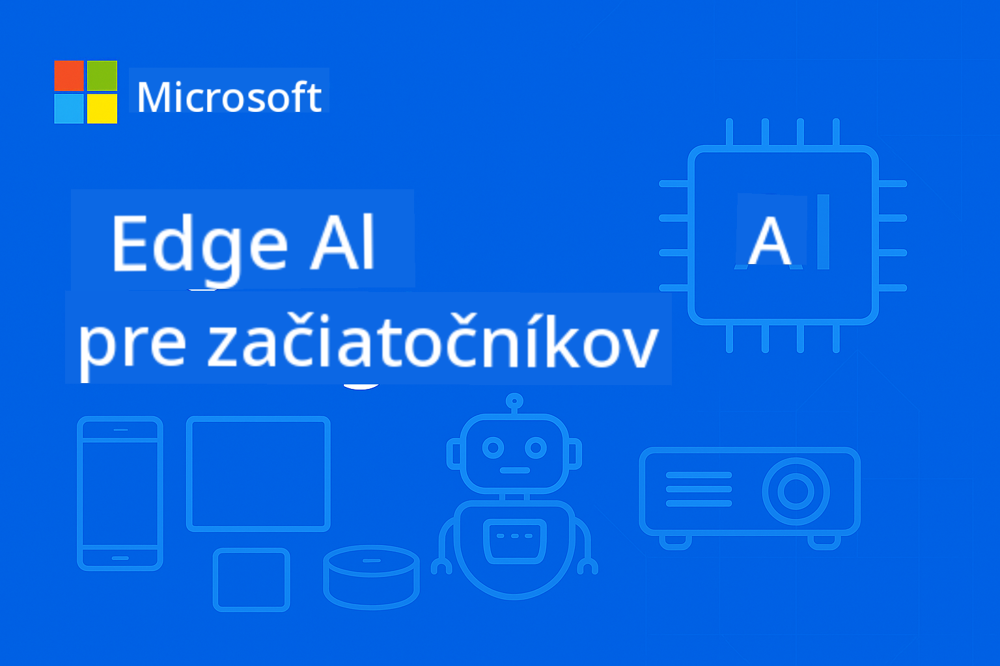

<!--
CO_OP_TRANSLATOR_METADATA:
{
  "original_hash": "22c6dae04591abc5f0d80f944ed663d5",
  "translation_date": "2025-09-26T10:43:10+00:00",
  "source_file": "introduction.md",
  "language_code": "sk"
}
-->
# Úvod do Edge AI pre začiatočníkov



Vitajte na vašej ceste do sveta **Edge Artificial Intelligence** – revolučného prístupu, ktorý prináša silu AI priamo tam, kde sa vytvárajú dáta a kde je potrebné robiť rozhodnutia. Tento úvod vám poskytne základy na pochopenie, prečo Edge AI predstavuje budúcnosť inteligentného výpočtového výkonu a ako zvládnuť jeho implementáciu.

## Čo je Edge AI?

Edge AI predstavuje zásadný posun od tradičného spracovania AI v cloude k **lokálnej inteligencii na zariadení**. Namiesto odosielania dát na vzdialené servery spracováva Edge AI informácie priamo na zariadeniach na okraji siete – smartfónoch, IoT senzoroch, priemyselných zariadeniach, autonómnych vozidlách a zabudovaných systémoch.

### Paradigma Edge AI

```
Traditional AI:     Device → Cloud → Processing → Response → Device
Edge AI:           Device → Local Processing → Immediate Response
```

Tento posun eliminuje potrebu komunikácie s cloudom, čo umožňuje:
- **Okamžité reakcie** (latencia pod milisekundu)
- **Zvýšenú ochranu súkromia** (dáta neopúšťajú zariadenie)
- **Spoľahlivú prevádzku** (funguje aj bez internetového pripojenia)
- **Znížené náklady** (minimálne využitie šírky pásma a cloudového výpočtového výkonu)

## Prečo je Edge AI dôležitý práve teraz

### Dokonalá búrka inovácií

Tri technologické trendy sa spojili, aby Edge AI nebol len možný, ale nevyhnutný:

1. **Revolúcia hardvéru**: Moderné čipsety (Apple Silicon, Qualcomm Snapdragon, NVIDIA Jetson) obsahujú AI akceleráciu v kompaktných, energeticky efektívnych balíkoch
2. **Optimalizácia modelov**: Malé jazykové modely (SLMs) ako Phi-4, Gemma a Mistral poskytujú 80-90% výkonu veľkých modelov pri 10-20% ich veľkosti
3. **Reálne požiadavky**: Priemysel vyžaduje okamžitú, súkromnú a spoľahlivú AI, ktorú cloudové riešenia nedokážu poskytnúť

### Kritické obchodné faktory

**Ochrana súkromia a súlad s predpismi**
- Zdravotníctvo: Dáta pacientov musia zostať na mieste (súlad s HIPAA)
- Financie: Spracovanie transakcií vyžaduje suverenitu dát
- Výroba: Vlastné procesy potrebujú ochranu pred zverejnením

**Požiadavky na výkon**
- Autonómne vozidlá: Životne dôležité rozhodnutia v milisekundách
- Priemyselná automatizácia: Kontrola kvality a monitorovanie bezpečnosti v reálnom čase
- Hranie hier a AR/VR: Pohlcujúce zážitky vyžadujú nulovú vnímateľnú latenciu

**Ekonomická efektívnosť**
- Telekomunikácie: Lokálne spracovanie miliónov IoT senzorových údajov
- Maloobchod: Analýza v obchodoch bez obrovských nákladov na šírku pásma
- Inteligentné mestá: Distribuovaná inteligencia na tisícoch zariadení

## Odvetvia transformované Edge AI

### 🏭 **Výroba a Priemysel 4.0**
- **Prediktívna údržba**: AI modely na priemyselných zariadeniach predpovedajú poruchy skôr, než nastanú
- **Kontrola kvality**: Detekcia chýb v reálnom čase na výrobných linkách
- **Monitorovanie bezpečnosti**: Okamžitá detekcia nebezpečenstva a reakcia
- **Dodávateľský reťazec**: Inteligentné riadenie zásob na každom uzle

**Reálny dopad**: Siemens využíva Edge AI na prediktívnu údržbu, čím znižuje prestoje o 30-50% a náklady na údržbu o 25%.

### 🏥 **Zdravotníctvo a medicínske zariadenia**
- **Diagnostické zobrazovanie**: Analýza röntgenových a MRI snímok pomocou AI priamo na mieste
- **Monitorovanie pacientov**: Neustále hodnotenie zdravia prostredníctvom nositeľných zariadení
- **Asistencia pri operáciách**: Usmernenie v reálnom čase počas zákrokov
- **Objavovanie liekov**: Lokálne spracovanie molekulárnych simulácií

**Reálny dopad**: Edge AI riešenia od Philips umožňujú rádiológom diagnostikovať stavy o 40% rýchlejšie pri zachovaní 99% presnosti.

### 🚗 **Autonómne systémy a doprava**
- **Autonómne vozidlá**: Rozhodovanie v zlomkoch sekundy pre navigáciu a bezpečnosť
- **Riadenie dopravy**: Inteligentné riadenie križovatiek a optimalizácia toku
- **Prevádzka flotily**: Optimalizácia trás a monitorovanie stavu vozidiel v reálnom čase
- **Logistika**: Autonómne skladové roboty a doručovacie systémy

**Reálny dopad**: Systém Full Self-Driving od Tesly spracováva senzorové údaje lokálne, pričom robí viac ako 40 rozhodnutí za sekundu pre bezpečnú autonómnu navigáciu.

### 🏙️ **Inteligentné mestá a infraštruktúra**
- **Verejná bezpečnosť**: Detekcia hrozieb a reakcia na núdzové situácie v reálnom čase
- **Riadenie energie**: Optimalizácia inteligentných sietí a integrácia obnoviteľných zdrojov
- **Monitorovanie životného prostredia**: Sledovanie kvality ovzdušia, hluku a klimatických zmien
- **Urbanistické plánovanie**: Analýza toku dopravy a optimalizácia infraštruktúry

**Reálny dopad**: Iniciatíva inteligentného mesta v Singapure využíva viac ako 100 000 Edge AI senzorov na riadenie dopravy, čím znižuje čas dochádzania o 25%.

### 📱 **Spotrebiteľská technológia a mobilné zariadenia**
- **AI na smartfónoch**: Vylepšená fotografia, hlasoví asistenti a personalizácia
- **Inteligentné domy**: Automatizácia a bezpečnostné systémy
- **Nositeľné zariadenia**: Monitorovanie zdravia a optimalizácia fitness
- **Hranie hier**: Vylepšenie grafiky v reálnom čase a optimalizácia hrania

**Reálny dopad**: Neural Engine od Apple spracováva 15,8 bilióna operácií za sekundu lokálne, čo umožňuje funkcie ako preklad v reálnom čase a výpočtová fotografia.

## Malé jazykové modely: Motor Edge AI

### Čo sú malé jazykové modely (SLMs)?

SLMs sú **komprimované, optimalizované verzie** veľkých jazykových modelov, špeciálne navrhnuté pre nasadenie na okraji siete:

- **Phi-4**: 14B parametrov, optimalizovaný na logické uvažovanie a generovanie kódu
- **Gemma 2B/7B**: Efektívne modely od Google pre rôzne NLP úlohy
- **Mistral-7B**: Výkonný model s komerčne priateľskou licenciou
- **Qwen Series**: Multijazykové modely od Alibaba optimalizované pre mobilné nasadenie

### Výhody SLM

| Schopnosť | Veľké jazykové modely | Malé jazykové modely |
|-----------|-----------------------|-----------------------|
| **Veľkosť** | 70B-405B parametrov | 1B-14B parametrov |
| **Pamäť** | 40-200GB RAM | 2-16GB RAM |
| **Rýchlosť inferencie** | 2-10 sekúnd | 50-500ms |
| **Nasadenie** | High-end servery | Smartfóny, zabudované zariadenia |
| **Náklady** | $1000s/mesiac | Jednorazové náklady na hardvér |
| **Ochrana súkromia** | Dáta odosielané do cloudu | Spracovanie zostáva lokálne |

### Realita výkonu

Moderné SLMs dosahujú pozoruhodné schopnosti:
- **90% výkonu GPT-3.5** v mnohých úlohách
- **Konverzácia v reálnom čase**
- **Generovanie a ladenie kódu**
- **Multijazykový preklad**
- **Analýza a sumarizácia dokumentov**

## Ciele učenia

Po absolvovaní kurzu EdgeAI pre začiatočníkov budete schopní:

### 🎯 **Základné znalosti**
- Pochopiť technické a obchodné faktory za adopciou Edge AI
- Porovnať architektúry Edge AI a cloud AI a ich vhodné použitie
- Identifikovať charakteristiky a schopnosti rôznych rodín SLM
- Analyzovať hardvérové požiadavky na nasadenie Edge AI

### 🛠️ **Technické zručnosti**
- Nasadiť SLMs na rôznych platformách (Windows, mobilné, zabudované, hybridné cloud-edge)
- Optimalizovať modely pre obmedzenia Edge pomocou kvantizácie, prerezávania a kompresie
- Implementovať produkčne pripravené Edge AI aplikácie s monitorovaním a škálovaním
- Vytvárať systémy s viacerými agentmi a rámce na volanie funkcií pre komplexné pracovné postupy

### 🏗️ **Praktická implementácia**
- Vytvárať chatovacie aplikácie s lokálnym prepínaním modelov a správou konverzácií
- Vyvíjať systémy RAG (Retrieval-Augmented Generation) s lokálnym spracovaním dokumentov
- Budovať smerovače modelov, ktoré inteligentne vyberajú medzi špecializovanými AI modelmi
- Navrhovať API rámce so streamovaním, monitorovaním zdravia a spracovaním chýb

### 🚀 **Nasadenie do produkcie**
- Zriadiť SLMOps pipeline pre verziovanie, testovanie a nasadenie modelov
- Implementovať bezpečnostné osvedčené postupy pre Edge AI aplikácie
- Navrhovať škálovateľné architektúry, ktoré vyvažujú spracovanie na okraji a v cloude
- Vytvárať stratégie monitorovania a údržby pre produkčné Edge AI systémy

## Výsledky učenia

Po absolvovaní kurzu budete pripravení:

### **Technická zdatnosť**
✅ **Nasadiť produkčne pripravené Edge AI riešenia** na Windows, mobilné a zabudované platformy  
✅ **Optimalizovať AI modely pre obmedzenia Edge** dosahujúc 75% zníženie veľkosti pri zachovaní 85% výkonu  
✅ **Budovať inteligentné systémy agentov** s volaním funkcií a orchestráciou viacerých modelov  
✅ **Vytvárať škálovateľné hybridné architektúry Edge-Cloud** pre podnikové aplikácie  

### **Aplikácie v priemysle**
✅ **Navrhovať riešenia pre výrobu** na prediktívnu údržbu a kontrolu kvality  
✅ **Vyvíjať zdravotnícke aplikácie** s ochranou súkromia pri spracovaní dát pacientov  
✅ **Budovať automobilové systémy** na rozhodovanie v reálnom čase a bezpečnosť  
✅ **Vytvárať infraštruktúru inteligentných miest** na monitorovanie dopravy, bezpečnosti a životného prostredia  

### **Kariérny rozvoj**
✅ **EdgeAI Solutions Architect**: Navrhovať komplexné stratégie Edge AI  
✅ **ML Engineer (Edge Specialization)**: Optimalizovať a nasadzovať modely pre prostredie Edge  
✅ **IoT AI Developer**: Vytvárať inteligentné IoT systémy s lokálnym spracovaním  
✅ **Mobile AI Developer**: Budovať AI-poháňané mobilné aplikácie s lokálnou inferenciou  

## Architektúra kurzu

Tento kurz nasleduje **progresívny prístup k zvládnutiu**:

### **Fáza 1: Základy** (Moduly 01-02)
Budovanie konceptuálneho porozumenia a skúmanie rodín modelov

### **Fáza 2: Implementácia** (Moduly 03-04) 
Zvládnutie techník nasadenia a optimalizácie

### **Fáza 3: Produkcia** (Moduly 05-06)
Naučenie sa SLMOps a pokročilých rámcov agentov

### **Fáza 4: Špecializácia** (Moduly 07-08)
Implementácia špecifická pre platformu a komplexné vzorové aplikácie

## Metriky úspechu

Sledujte svoj pokrok pomocou týchto konkrétnych výsledkov:

- **Projekty v portfóliu**: 10+ produkčne pripravených aplikácií naprieč rôznymi odvetviami
- **Výkonnostné benchmarky**: Modely bežiace s <500ms časom inferencie na Edge zariadeniach
- **Ciele nasadenia**: Aplikácie bežiace na Windows, mobilných a zabudovaných platformách
- **Pripravenosť pre podniky**: Riešenia s monitorovaním, škálovaním a bezpečnostnými rámcami

## Začíname

Pripravení transformovať svoje chápanie nasadenia AI? Vaša cesta začína s **[Module 01: EdgeAI Fundamentals](./Module01/README.md)**, kde preskúmate technické základy, ktoré umožňujú Edge AI, a preskúmate reálne prípadové štúdie od lídrov v priemysle.

**Ďalší krok**: [📚 Module 01 - EdgeAI Fundamentals →](./Module01/README.md)

---

**Budúcnosť AI je lokálna, okamžitá a súkromná. Zvládnite Edge AI a vytvorte ďalšiu generáciu inteligentných aplikácií.**

---

