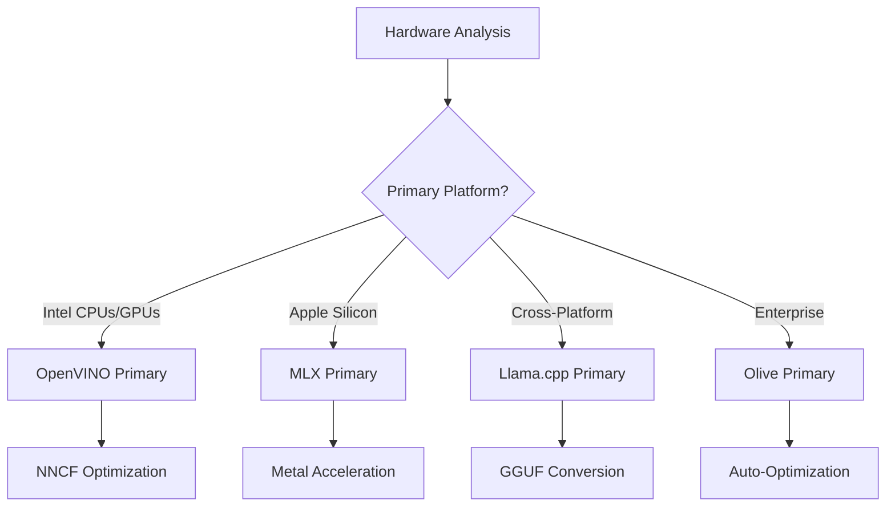
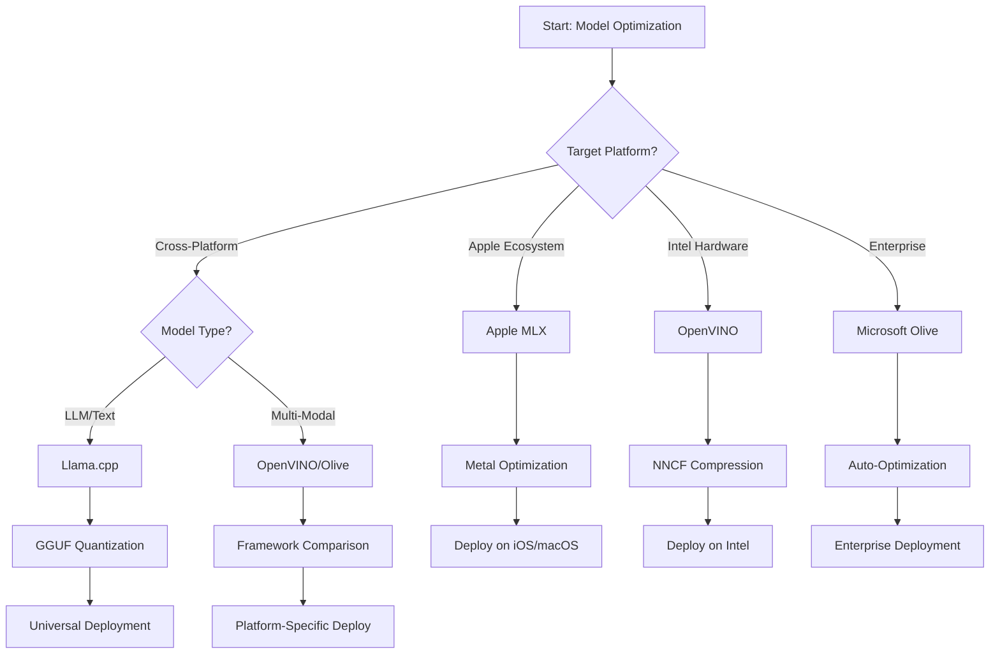
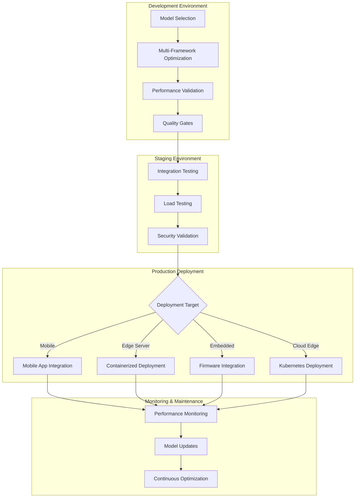

<!--
CO_OP_TRANSLATOR_METADATA:
{
  "original_hash": "6719c4a7e44b948230ac5f5cab3699bd",
  "translation_date": "2025-09-19T00:36:16+00:00",
  "source_file": "Module04/06.workflow-synthesis.md",
  "language_code": "sl"
}
-->
# Poglavje 6: Sinteza delovnega procesa razvoja Edge AI

## Kazalo
1. [Uvod](../../../Module04)
2. [Cilji učenja](../../../Module04)
3. [Pregled enotnega delovnega procesa](../../../Module04)
4. [Matrika izbire ogrodij](../../../Module04)
5. [Sinteza najboljših praks](../../../Module04)
6. [Vodnik za strategijo uvajanja](../../../Module04)
7. [Delovni proces optimizacije zmogljivosti](../../../Module04)
8. [Kontrolni seznam za pripravljenost na produkcijo](../../../Module04)
9. [Odpravljanje težav in spremljanje](../../../Module04)
10. [Priprava vaše Edge AI infrastrukture na prihodnost](../../../Module04)

## Uvod

Razvoj Edge AI zahteva poglobljeno razumevanje različnih optimizacijskih ogrodij, strategij uvajanja in strojnih zahtev. Ta celovita sinteza združuje znanje iz Llama.cpp, Microsoft Olive, OpenVINO in Apple MLX ter ustvarja enoten delovni proces, ki maksimizira učinkovitost, ohranja kakovost in zagotavlja uspešno uvajanje v produkcijo.

V tem tečaju smo raziskovali posamezna optimizacijska ogrodja, vsako s svojimi edinstvenimi prednostmi in specializiranimi primeri uporabe. Vendar pa resnični projekti Edge AI pogosto zahtevajo kombinacijo tehnik iz več ogrodij ali strateške odločitve o tem, kateri pristop bo prinesel najboljše rezultate glede na specifične omejitve in zahteve.

Ta razdelek združuje kolektivno znanje vseh ogrodij v izvedljive delovne procese, odločitvena drevesa in najboljše prakse, ki vam omogočajo učinkovito in uspešno gradnjo produkcijsko pripravljenih rešitev Edge AI. Ne glede na to, ali optimizirate za mobilne naprave, vgrajene sisteme ali strežnike na robu, ta vodnik ponuja strateški okvir za sprejemanje premišljenih odločitev skozi celoten razvojni cikel.

## Cilji učenja

Do konca tega razdelka boste sposobni:

### Strateško odločanje
- **Oceniti in izbrati** optimalno optimizacijsko ogrodje glede na zahteve projekta, strojne omejitve in scenarije uvajanja
- **Oblikovati celovite delovne procese**, ki vključujejo več optimizacijskih tehnik za maksimalno učinkovitost
- **Oceniti kompromise** med natančnostjo modela, hitrostjo sklepanja, porabo pomnilnika in kompleksnostjo uvajanja v različnih ogrodjih

### Integracija delovnih procesov
- **Izvesti enotne razvojne procese**, ki izkoriščajo prednosti več optimizacijskih ogrodij
- **Ustvariti ponovljive delovne procese** za dosledno optimizacijo modelov in uvajanje v različnih okoljih
- **Vzpostaviti kontrolne točke kakovosti** in validacijske procese, da zagotovite, da optimizirani modeli izpolnjujejo zahteve produkcije

### Optimizacija zmogljivosti
- **Uporabiti sistematične strategije optimizacije** z uporabo kvantizacije, obrezovanja in tehnik pospeševanja, specifičnih za strojno opremo
- **Spremljati in primerjati** zmogljivost modela na različnih ravneh optimizacije in ciljih uvajanja
- **Optimizirati za specifične strojne platforme**, vključno s CPU, GPU, NPU in specializiranimi pospeševalniki na robu

### Uvajanje v produkcijo
- **Oblikovati skalabilne arhitekture uvajanja**, ki omogočajo več formatov modelov in pogonskih mehanizmov sklepanja
- **Izvesti spremljanje in opazovanje** za aplikacije Edge AI v produkcijskih okoljih
- **Vzpostaviti delovne procese vzdrževanja** za posodobitve modelov, spremljanje zmogljivosti in optimizacijo sistema

### Odličnost na več platformah
- **Uvajati optimizirane modele** na različnih strojnih platformah ob ohranjanju dosledne zmogljivosti
- **Obravnavati optimizacije, specifične za platformo**, za Windows, macOS, Linux, mobilne in vgrajene sisteme
- **Ustvariti abstrakcijske plasti**, ki omogočajo brezhibno uvajanje v različnih okoljih na robu

## Pregled enotnega delovnega procesa

### Faza 1: Analiza zahtev in izbira ogrodja

Osnova uspešnega uvajanja Edge AI se začne z temeljito analizo zahtev, ki usmerja izbiro ogrodja in strategijo optimizacije.

#### 1.1 Ocena strojne opreme


**Ključni dejavniki:**
- **Arhitektura CPU**: zmožnosti x86, ARM, Apple Silicon
- **Razpoložljivost pospeševalnikov**: GPU, NPU, VPU, specializirani AI čipi
- **Omejitve pomnilnika**: omejitve RAM-a, kapaciteta shranjevanja
- **Poraba energije**: življenjska doba baterije, toplotne omejitve
- **Povezljivost**: zahteve za delo brez povezave, omejitve pasovne širine

#### 1.2 Matrika zahtev aplikacije

| Zahteva | Llama.cpp | Microsoft Olive | OpenVINO | Apple MLX |
|---------|-----------|-----------------|----------|-----------|
| Večplatformnost | ✅ Odlično | ⚡ Dobro | ⚡ Dobro | ❌ Samo Apple |
| Integracija v podjetje | ⚡ Osnovno | ✅ Odlično | ✅ Odlično | ⚡ Omejeno |
| Uvajanje na mobilne naprave | ✅ Odlično | ⚡ Dobro | ⚡ Dobro | ✅ iOS Odlično |
| Sklepanje v realnem času | ✅ Odlično | ✅ Odlično | ✅ Odlično | ✅ Odlično |
| Raznolikost modelov | ✅ Osredotočeno na LLM | ✅ Vsi modeli | ✅ Vsi modeli | ✅ Osredotočeno na LLM |
| Enostavnost uporabe | ✅ Preprosto | ✅ Avtomatizirano | ⚡ Zmerno | ✅ Preprosto |

### Faza 2: Priprava in optimizacija modela

#### 2.1 Univerzalni proces ocene modela

```python
# Universal Model Assessment Framework
class EdgeAIModelAssessment:
    def __init__(self, model_path, target_hardware):
        self.model_path = model_path
        self.target_hardware = target_hardware
        self.optimization_frameworks = []
        
    def assess_model_characteristics(self):
        """Analyze model size, architecture, and complexity"""
        return {
            'model_size': self.get_model_size(),
            'parameter_count': self.get_parameter_count(),
            'architecture_type': self.detect_architecture(),
            'quantization_compatibility': self.check_quantization_support()
        }
    
    def recommend_optimization_strategy(self):
        """Recommend optimal frameworks and techniques"""
        characteristics = self.assess_model_characteristics()
        
        if self.target_hardware.startswith('apple'):
            return self.mlx_optimization_strategy(characteristics)
        elif self.target_hardware.startswith('intel'):
            return self.openvino_optimization_strategy(characteristics)
        elif characteristics['model_size'] > 7_000_000_000:  # 7B+ parameters
            return self.enterprise_optimization_strategy(characteristics)
        else:
            return self.lightweight_optimization_strategy(characteristics)
```

#### 2.2 Večogrodni proces optimizacije

**Pristop zaporedne optimizacije:**
1. **Začetna pretvorba**: Pretvorba v vmesni format (ONNX, kadar je mogoče)
2. **Optimizacija, specifična za ogrodje**: Uporaba specializiranih tehnik
3. **Navzkrižna validacija**: Preverjanje zmogljivosti na ciljnih platformah
4. **Končno pakiranje**: Priprava za uvajanje

```bash
# Multi-Framework Optimization Script
#!/bin/bash

MODEL_NAME="phi-3-mini"
BASE_MODEL="microsoft/Phi-3-mini-4k-instruct"

# Phase 1: ONNX Conversion (Universal)
python convert_to_onnx.py --model $BASE_MODEL --output models/onnx/

# Phase 2: Platform-Specific Optimization
if [[ "$TARGET_PLATFORM" == "intel" ]]; then
    # OpenVINO Optimization
    python optimize_openvino.py --input models/onnx/ --output models/openvino/
elif [[ "$TARGET_PLATFORM" == "apple" ]]; then
    # MLX Optimization
    python optimize_mlx.py --input $BASE_MODEL --output models/mlx/
elif [[ "$TARGET_PLATFORM" == "cross" ]]; then
    # Llama.cpp Optimization
    python convert_to_gguf.py --input models/onnx/ --output models/gguf/
fi

# Phase 3: Validation
python validate_optimization.py --original $BASE_MODEL --optimized models/$TARGET_PLATFORM/
```

### Faza 3: Validacija zmogljivosti in primerjava

#### 3.1 Celovit okvir za primerjavo

```python
class EdgeAIBenchmark:
    def __init__(self, optimized_models):
        self.models = optimized_models
        self.metrics = {
            'inference_time': [],
            'memory_usage': [],
            'accuracy_score': [],
            'throughput': [],
            'energy_consumption': []
        }
    
    def run_comprehensive_benchmark(self):
        """Execute standardized benchmarks across all optimized models"""
        test_inputs = self.generate_test_inputs()
        
        for model_framework, model_path in self.models.items():
            print(f"Benchmarking {model_framework}...")
            
            # Latency Testing
            latency = self.measure_inference_latency(model_path, test_inputs)
            
            # Memory Profiling
            memory = self.profile_memory_usage(model_path)
            
            # Accuracy Validation
            accuracy = self.validate_model_accuracy(model_path, test_inputs)
            
            # Throughput Analysis
            throughput = self.measure_throughput(model_path)
            
            self.record_metrics(model_framework, latency, memory, accuracy, throughput)
    
    def generate_optimization_report(self):
        """Create comprehensive comparison report"""
        report = {
            'recommendations': self.analyze_performance_trade_offs(),
            'deployment_guidance': self.generate_deployment_recommendations(),
            'monitoring_requirements': self.define_monitoring_metrics()
        }
        return report
```

## Matrika izbire ogrodij

### Odločitveno drevo za izbiro ogrodja



### Celovita merila izbire

#### 1. Usklajenost s primarnim primerom uporabe

**Veliki jezikovni modeli (LLM):**
- **Llama.cpp**: Najboljše za uvajanje, osredotočeno na CPU in več platform
- **Apple MLX**: Optimalno za Apple Silicon z enotnim pomnilnikom
- **OpenVINO**: Odlično za Intel strojno opremo z optimizacijo NNCF
- **Microsoft Olive**: Idealno za podjetniške delovne procese z avtomatizacijo

**Multimodalni modeli:**
- **OpenVINO**: Celovita podpora za vizijo, zvok in besedilo
- **Microsoft Olive**: Podjetniška optimizacija za kompleksne procese
- **Llama.cpp**: Omejeno na modele, osredotočene na besedilo
- **Apple MLX**: Naraščajoča podpora za multimodalne aplikacije

#### 2. Matrika strojnih platform

| Platforma | Primarno ogrodje | Sekundarna možnost | Specializirane funkcije |
|-----------|------------------|-------------------|-------------------------|
| Intel CPU/GPU | OpenVINO | Microsoft Olive | Kompresija NNCF, Intel optimizacija |
| NVIDIA GPU | Microsoft Olive | OpenVINO | Pospeševanje CUDA, funkcije za podjetja |
| Apple Silicon | Apple MLX | Llama.cpp | Metal senčila, enotni pomnilnik |
| ARM mobilne naprave | Llama.cpp | OpenVINO | Večplatformnost, minimalne odvisnosti |
| Edge TPU | OpenVINO | Microsoft Olive | Podpora za specializirane pospeševalnike |
| Vgrajeni ARM | Llama.cpp | OpenVINO | Minimalen odtis, učinkovito sklepanje |

#### 3. Prednostne naloge delovnega procesa razvoja

**Hitro prototipiranje:**
1. **Llama.cpp**: Najhitrejša nastavitev, takojšnji rezultati
2. **Apple MLX**: Preprost Python API, hitra iteracija
3. **Microsoft Olive**: Avtomatizirana optimizacija, minimalna konfiguracija
4. **OpenVINO**: Bolj zapletena nastavitev, celovite funkcije

**Produkcija v podjetju:**
1. **Microsoft Olive**: Funkcije za podjetja, integracija z Azure
2. **OpenVINO**: Intel ekosistem, celovita orodja
3. **Apple MLX**: Specifične aplikacije za podjetja na Apple platformi
4. **Llama.cpp**: Preprosto uvajanje, omejene funkcije za podjetja

## Sinteza najboljših praks

### Univerzalna načela optimizacije

#### 1. Strategija postopne optimizacije

```python
class ProgressiveOptimization:
    def __init__(self, base_model):
        self.base_model = base_model
        self.optimization_stages = [
            'baseline_measurement',
            'format_conversion',
            'quantization_optimization',
            'hardware_acceleration',
            'production_validation'
        ]
    
    def execute_progressive_optimization(self):
        """Apply optimization techniques incrementally"""
        
        # Stage 1: Baseline Measurement
        baseline_metrics = self.measure_baseline_performance()
        
        # Stage 2: Format Conversion
        converted_model = self.convert_to_optimal_format()
        conversion_metrics = self.measure_performance(converted_model)
        
        # Stage 3: Quantization
        quantized_model = self.apply_quantization(converted_model)
        quantization_metrics = self.measure_performance(quantized_model)
        
        # Stage 4: Hardware Acceleration
        accelerated_model = self.enable_hardware_acceleration(quantized_model)
        acceleration_metrics = self.measure_performance(accelerated_model)
        
        # Stage 5: Validation
        production_ready = self.validate_for_production(accelerated_model)
        
        return self.compile_optimization_report(
            baseline_metrics, conversion_metrics, 
            quantization_metrics, acceleration_metrics
        )
```

#### 2. Vzpostavitev kontrolnih točk kakovosti

**Kontrolne točke za ohranjanje natančnosti:**
- Ohranjanje >95 % izvirne natančnosti modela
- Validacija na reprezentativnih testnih podatkovnih nizih
- Izvedba A/B testiranja za validacijo v produkciji

**Kontrolne točke za izboljšanje zmogljivosti:**
- Doseganje najmanj 2x izboljšanja hitrosti
- Zmanjšanje porabe pomnilnika za vsaj 50 %
- Validacija doslednosti časa sklepanja

**Kontrolne točke za pripravljenost na produkcijo:**
- Uspešno testiranje ob obremenitvi
- Stabilna zmogljivost skozi čas
- Validacija varnostnih in zasebnostnih zahtev

### Integracija najboljših praks, specifičnih za ogrodje

#### 1. Sinteza strategij kvantizacije

```python
# Unified Quantization Approach
class UnifiedQuantizationStrategy:
    def __init__(self, model, target_platform):
        self.model = model
        self.platform = target_platform
        
    def select_optimal_quantization(self):
        """Choose best quantization based on platform and requirements"""
        
        if self.platform == 'apple_silicon':
            return self.mlx_quantization_strategy()
        elif self.platform == 'intel_hardware':
            return self.openvino_quantization_strategy()
        elif self.platform == 'cross_platform':
            return self.llamacpp_quantization_strategy()
        else:
            return self.olive_quantization_strategy()
    
    def mlx_quantization_strategy(self):
        """Apple MLX-specific quantization"""
        return {
            'method': 'mlx_quantize',
            'precision': 'int4',
            'group_size': 64,
            'optimization_target': 'unified_memory'
        }
    
    def openvino_quantization_strategy(self):
        """OpenVINO NNCF quantization"""
        return {
            'method': 'nncf_quantize',
            'precision': 'int8',
            'calibration_method': 'post_training',
            'optimization_target': 'intel_hardware'
        }
```

#### 2. Optimizacija pospeševanja strojne opreme

**Optimizacija za CPU:**
- **SIMD navodila**: Uporaba optimiziranih jeder v vseh ogrodjih
- **Pasovna širina pomnilnika**: Optimizacija postavitve podatkov za učinkovitost predpomnilnika
- **Nitnost**: Uravnoteženje paralelizma z omejitvami virov

**Najboljše prakse za pospeševanje GPU:**
- **Obdelava v serijah**: Maksimizacija prepustnosti z ustreznimi velikostmi serij
- **Upravljanje pomnilnika**: Optimizacija dodeljevanja in prenosa GPU pomnilnika
- **Natančnost**: Uporaba FP16, kadar je podprta, za boljšo zmogljivost

**Optimizacija za NPU/specializirane pospeševalnike:**
- **Arhitektura modela**: Zagotavljanje združljivosti s sposobnostmi pospeševalnika
- **Tok podatkov**: Optimizacija vhodno/izhodnih procesov za učinkovitost pospeševalnika
- **Strategije za izpad**: Uvedba CPU rezerve za nepodprte operacije

## Vodnik za strategijo uvajanja

### Univerzalna arhitektura uvajanja



### Vzorci uvajanja, specifični za platformo

#### 1. Strategija uvajanja na mobilne naprave

```yaml
# Mobile Deployment Configuration
mobile_deployment:
  ios:
    framework: apple_mlx
    optimization:
      quantization: int4
      memory_mapping: true
      background_execution: limited
    packaging:
      format: mlx
      bundle_size: <50MB
      
  android:
    framework: llama_cpp
    optimization:
      quantization: q4_k_m
      threading: android_optimized
      memory_management: conservative
    packaging:
      format: gguf
      apk_size: <100MB
      
  cross_platform:
    framework: onnx_runtime
    optimization:
      quantization: int8
      execution_provider: cpu
    packaging:
      format: onnx
      shared_libraries: minimal
```

#### 2. Uvajanje na strežnike na robu

```yaml
# Edge Server Deployment Configuration
edge_server:
  intel_based:
    framework: openvino
    optimization:
      quantization: int8
      acceleration: cpu_gpu_auto
      batch_processing: dynamic
    deployment:
      container: openvino_runtime
      orchestration: kubernetes
      scaling: horizontal
      
  nvidia_based:
    framework: microsoft_olive
    optimization:
      quantization: int4
      acceleration: cuda
      tensor_parallelism: true
    deployment:
      container: nvidia_triton
      orchestration: kubernetes
      scaling: gpu_aware
```

### Najboljše prakse za kontejnerizacijo

```dockerfile
# Multi-Framework Edge AI Container
FROM ubuntu:22.04 as base

# Install common dependencies
RUN apt-get update && apt-get install -y \
    python3 \
    python3-pip \
    build-essential \
    cmake \
    && rm -rf /var/lib/apt/lists/*

# Framework-specific stages
FROM base as openvino
RUN pip install openvino nncf optimum[intel]

FROM base as llamacpp
RUN git clone https://github.com/ggerganov/llama.cpp.git \
    && cd llama.cpp && make LLAMA_OPENBLAS=1

FROM base as olive
RUN pip install olive-ai[auto-opt] onnxruntime-genai

# Production stage with selected framework
FROM openvino as production
COPY models/ /app/models/
COPY src/ /app/src/
WORKDIR /app

EXPOSE 8080
CMD ["python3", "src/inference_server.py"]
```

## Delovni proces optimizacije zmogljivosti

### Sistematično prilagajanje zmogljivosti

#### 1. Proces profiliranja zmogljivosti

```python
class EdgeAIPerformanceProfiler:
    def __init__(self, model_path, framework):
        self.model_path = model_path
        self.framework = framework
        self.profiling_results = {}
    
    def comprehensive_profiling(self):
        """Execute comprehensive performance analysis"""
        
        # CPU Profiling
        cpu_profile = self.profile_cpu_usage()
        
        # Memory Profiling
        memory_profile = self.profile_memory_usage()
        
        # Inference Latency
        latency_profile = self.profile_inference_latency()
        
        # Throughput Analysis
        throughput_profile = self.profile_throughput()
        
        # Energy Consumption (where available)
        energy_profile = self.profile_energy_consumption()
        
        return self.compile_performance_report(
            cpu_profile, memory_profile, latency_profile,
            throughput_profile, energy_profile
        )
    
    def identify_bottlenecks(self):
        """Automatically identify performance bottlenecks"""
        bottlenecks = []
        
        if self.profiling_results['cpu_utilization'] > 80:
            bottlenecks.append('cpu_bound')
        
        if self.profiling_results['memory_usage'] > 90:
            bottlenecks.append('memory_bound')
        
        if self.profiling_results['inference_variance'] > 20:
            bottlenecks.append('inconsistent_performance')
        
        return self.generate_optimization_recommendations(bottlenecks)
```

#### 2. Avtomatiziran proces optimizacije

```python
class AutomatedOptimizationPipeline:
    def __init__(self, base_model, target_constraints):
        self.base_model = base_model
        self.constraints = target_constraints
        self.optimization_history = []
    
    def execute_optimization_search(self):
        """Systematically search optimization space"""
        
        optimization_candidates = [
            {'quantization': 'int8', 'pruning': 0.1},
            {'quantization': 'int4', 'pruning': 0.2},
            {'quantization': 'int8', 'acceleration': 'gpu'},
            {'quantization': 'int4', 'acceleration': 'npu'}
        ]
        
        best_configuration = None
        best_score = 0
        
        for config in optimization_candidates:
            optimized_model = self.apply_optimization(config)
            score = self.evaluate_optimization(optimized_model)
            
            if score > best_score and self.meets_constraints(optimized_model):
                best_score = score
                best_configuration = config
            
            self.optimization_history.append({
                'config': config,
                'score': score,
                'model': optimized_model
            })
        
        return best_configuration, self.optimization_history
```

### Večciljna optimizacija

#### 1. Pareto optimizacija za Edge AI

```python
class ParetoOptimization:
    def __init__(self, objectives=['speed', 'accuracy', 'memory']):
        self.objectives = objectives
        self.pareto_frontier = []
    
    def find_pareto_optimal_solutions(self, optimization_results):
        """Identify Pareto-optimal configurations"""
        
        for result in optimization_results:
            is_dominated = False
            
            for frontier_point in self.pareto_frontier:
                if self.dominates(frontier_point, result):
                    is_dominated = True
                    break
            
            if not is_dominated:
                # Remove dominated points from frontier
                self.pareto_frontier = [
                    point for point in self.pareto_frontier 
                    if not self.dominates(result, point)
                ]
                
                self.pareto_frontier.append(result)
        
        return self.pareto_frontier
    
    def recommend_configuration(self, user_preferences):
        """Recommend configuration based on user preferences"""
        
        weighted_scores = []
        for config in self.pareto_frontier:
            score = sum(
                user_preferences[obj] * config['metrics'][obj] 
                for obj in self.objectives
            )
            weighted_scores.append((score, config))
        
        return max(weighted_scores, key=lambda x: x[0])[1]
```

## Kontrolni seznam za pripravljenost na produkcijo

### Celovita validacija produkcije

#### 1. Zagotavljanje kakovosti modela

```python
class ProductionReadinessValidator:
    def __init__(self, optimized_model, production_requirements):
        self.model = optimized_model
        self.requirements = production_requirements
        self.validation_results = {}
    
    def validate_model_quality(self):
        """Comprehensive model quality validation"""
        
        # Accuracy Validation
        accuracy_result = self.validate_accuracy()
        
        # Performance Validation
        performance_result = self.validate_performance()
        
        # Robustness Testing
        robustness_result = self.validate_robustness()
        
        # Security Assessment
        security_result = self.validate_security()
        
        # Compliance Verification
        compliance_result = self.validate_compliance()
        
        return self.compile_validation_report(
            accuracy_result, performance_result, robustness_result,
            security_result, compliance_result
        )
    
    def generate_certification_report(self):
        """Generate production certification report"""
        return {
            'model_signature': self.generate_model_signature(),
            'validation_timestamp': datetime.now(),
            'validation_results': self.validation_results,
            'deployment_approval': self.check_deployment_approval(),
            'monitoring_requirements': self.define_monitoring_requirements()
        }
```

#### 2. Kontrolni seznam za uvajanje v produkcijo

**Validacija pred uvajanjem:**
- [ ] Natančnost modela izpolnjuje minimalne zahteve (>95 % osnovne vrednosti)
- [ ] Doseženi cilji zmogljivosti (zakasnitev, prepustnost, pomnilnik)
- [ ] Ocenjene in odpravljene varnostne ranljivosti
- [ ] Zaključeno testiranje ob obremenitvi
- [ ] Testirani scenariji odpovedi in validirani postopki za obnovitev
- [ ] Konfigurirani sistemi za spremljanje in opozarjanje
- [ ] Testirani in dokumentirani postopki za povrnitev

**Postopek uvajanja:**
- [ ] Uvedena strategija modro-zelene uvedbe
- [ ] Konfigurirano postopno povečevanje prometa
- [ ] Aktivne nadzorne plošče za spremljanje v realnem času
- [ ] Ustanovljene osnovne vrednosti zmogljivosti
- [ ] Določeni pragovi stopnje napak
- [ ] Konfigurirani avtomatizirani sprožilci za povrnitev

**Spremljanje po uvajanju:**
- [ ] Aktivno zaznavanje odstopanja modela
- [ ] Konfigurirana opozorila za poslabšanje zmogljivosti
- [ ] Omogočeno spremljanje porabe virov
- [ ] Spremljanje metrik uporabniške izkušnje
- [ ] Vzdrževanje različic modela in sledljivosti
- [ ] Načrtovani redni pregledi zmogljivosti modela

### Neprekinjena integracija/uvajanje (CI/CD)

```yaml
# Edge AI CI/CD Pipeline Configuration
edge_ai_pipeline:
  stages:
    - model_validation
    - optimization
    - testing
    - staging_deployment
    - production_deployment
    - monitoring
  
  model_validation:
    accuracy_threshold: 0.95
    performance_baseline: required
    security_scan: enabled
    
  optimization:
    frameworks:
      - llama_cpp
      - openvino
      - microsoft_olive
    validation:
      cross_validation: enabled
      performance_comparison: required
      
  testing:
    unit_tests: comprehensive
    integration_tests: full_pipeline
    load_tests: production_scale
    security_tests: comprehensive
    
  deployment:
    strategy: blue_green
    traffic_ramping: gradual
    rollback: automatic
    monitoring: real_time
```

## Odpravljanje težav in spremljanje

### Univerzalni okvir za odpravljanje težav

#### 1. Pogoste težave in rešitve

**Težave z zmogljivostjo:**
```python
class PerformanceTroubleshooter:
    def __init__(self, model_metrics):
        self.metrics = model_metrics
        
    def diagnose_performance_issues(self):
        """Systematic performance issue diagnosis"""
        
        issues = []
        
        # High latency diagnosis
        if self.metrics['avg_latency'] > self.metrics['target_latency']:
            issues.append(self.diagnose_latency_issues())
        
        # Memory usage diagnosis
        if self.metrics['memory_usage'] > self.metrics['memory_limit']:
            issues.append(self.diagnose_memory_issues())
        
        # Throughput diagnosis
        if self.metrics['throughput'] < self.metrics['target_throughput']:
            issues.append(self.diagnose_throughput_issues())
        
        return self.generate_resolution_plan(issues)
    
    def diagnose_latency_issues(self):
        """Specific latency troubleshooting"""
        potential_causes = []
        
        if self.metrics['cpu_utilization'] > 80:
            potential_causes.append('cpu_bottleneck')
        
        if self.metrics['memory_bandwidth'] > 90:
            potential_causes.append('memory_bandwidth_limit')
        
        if self.metrics['model_size'] > self.metrics['optimal_size']:
            potential_causes.append('model_too_large')
        
        return {
            'issue': 'high_latency',
            'causes': potential_causes,
            'solutions': self.generate_latency_solutions(potential_causes)
        }
```

**Odpravljanje težav, specifičnih za ogrodje:**

| Težava | Llama.cpp | Microsoft Olive | OpenVINO | Apple MLX |
|--------|-----------|-----------------|----------|-----------|
| Težave s pomnilnikom | Zmanjšajte dolžino konteksta | Zmanjšajte velikost serije | Omogočite predpomnjenje | Uporabite preslikavo pomnilnika |
| Počasno sklepanje | Omogočite SIMD | Preverite kvantizacijo | Optimizirajte nitnost | Omogočite Metal |
| Izguba natančnosti | Višja kvantizacija | Ponovno usposabljanje z QAT | Povečajte kalibracijo | Fino nastavite po kvantizaciji |
| Združljivost | Preverite format modela | Preverite različico ogrodja | Posodobite gonilnike | Preverite različico macOS |

#### 2. Strategija spremljanja v produkciji

```python
class EdgeAIMonitoring:
    def __init__(self, deployment_config):
        self.config = deployment_config
        self.metrics_collectors = []
        self.alerting_rules = []
    
    def setup_comprehensive_monitoring(self):
        """Configure comprehensive monitoring for Edge AI deployment"""
        
        # Model Performance Monitoring
        self.setup_model_performance_monitoring()
        
        # Infrastructure Monitoring
        self.setup_infrastructure_monitoring()
        
        # Business Metrics Monitoring
        self.setup_business_metrics_monitoring()
        
        # Security Monitoring
        self.setup_security_monitoring()
    
    def setup_model_performance_monitoring(self):
        """Model-specific performance monitoring"""
        metrics = [
            'inference_latency_p50',
            'inference_latency_p95',
            'inference_latency_p99',
            'model_accuracy_drift',
            'prediction_confidence_distribution',
            'error_rate',
            'throughput_requests_per_second'
        ]
        
        for metric in metrics:
            self.add_metric_collector(metric)
            self.add_alerting_rule(metric)
    
    def detect_model_drift(self):
        """Automated model drift detection"""
        drift_indicators = [
            self.statistical_drift_detection(),
            self.performance_drift_detection(),
            self.data_distribution_shift_detection()
        ]
        
        return self.aggregate_drift_signals(drift_indicators)
```

### Avtomatizirano reševanje težav

```python
class AutomatedIssueResolution:
    def __init__(self, monitoring_system):
        self.monitoring = monitoring_system
        self.resolution_strategies = {}
    
    def handle_performance_degradation(self, alert):
        """Automated performance issue resolution"""
        
        if alert['type'] == 'high_latency':
            return self.resolve_latency_issue(alert)
        elif alert['type'] == 'high_memory_usage':
            return self.resolve_memory_issue(alert)
        elif alert['type'] == 'accuracy_drift':
            return self.resolve_accuracy_issue(alert)
        
    def resolve_latency_issue(self, alert):
        """Automated latency issue resolution"""
        resolution_steps = [
            'increase_cpu_allocation',
            'enable_model_caching',
            'reduce_batch_size',
            'switch_to_quantized_model'
        ]
        
        for step in resolution_steps:
            if self.apply_resolution_step(step):
                return f"Resolved latency issue with: {step}"
        
        return "Escalating to human operator"
```

## Priprava vaše Edge AI infrastrukture na prihodnost

### Integracija nastajajočih tehnologij

#### 1. Podpora za strojno opremo naslednje generacije

```python
class FutureHardwareIntegration:
    def __init__(self):
        self.supported_accelerators = [
            'npu_next_gen',
            'quantum_processors',
            'neuromorphic_chips',
            'optical_processors'
        ]
    
    def design_adaptive_pipeline(self):
        """Create hardware-agnostic optimization pipeline"""
        
        pipeline = {
            'model_preparation': self.universal_model_preparation(),
            'hardware_detection': self.dynamic_hardware_detection(),
            'optimization_selection': self.adaptive_optimization_selection(),
            'performance_validation': self.hardware_agnostic_validation()
        }
        
        return pipeline
    
    def adaptive_optimization_selection(self):
        """Dynamically select optimization based on available hardware"""
        
        def optimize_for_hardware(model, available_hardware):
            if 'npu' in available_hardware:
                return self.npu_optimization(model)
            elif 'quantum' in available_hardware:
                return self.quantum_optimization(model)
            elif 'neuromorphic' in available_hardware:
                return self.neuromorphic_optimization(model)
            else:
                return self.fallback_optimization(model)
        
        return optimize_for_hardware
```

#### 2. Evolucija arhitekture modela

**Podpora za nastajajoče arhitekture:**
- **Mešanica strokovnjakov (MoE)**: Redke arhitekture modelov za učinkovitost
- **Generacija, podprta z iskanjem**: Hibridni sistemi model + baza znanja
- **Multimodalni modeli**: Integracija vizije + jezika + zvoka
- **Federativno učenje**: Porazdeljeno usposabljanje in optimizacija

```python
class NextGenModelSupport:
    def __init__(self):
        self.architecture_handlers = {
            'moe': self.handle_mixture_of_experts,
            'rag': self.handle_retrieval_augmented,
            'multimodal': self.handle_multimodal,
            'federated': self.handle_federated_learning
        }
    
    def handle_mixture_of_experts(self, model):
        """Optimize Mixture of Experts models for edge deployment"""
        optimization_strategy = {
            'expert_pruning': True,
            'routing_optimization': True,
            'expert_quantization': 'per_expert',
            'load_balancing': 'dynamic'
        }
        return self.apply_moe_optimization(model, optimization_strategy)
```

### Neprekinjeno učenje
Ne pozabite, da je najboljša strategija optimizacije tista, ki ustreza vašim specifičnim zahtevam, hkrati pa ohranja prilagodljivost za prilagajanje, ko se te zahteve spreminjajo. Uporabite ta vodnik kot okvir za sprejemanje premišljenih odločitev, vendar vedno preverite svoje izbire z empiričnim testiranjem in izkušnjami iz resničnega sveta.

## ➡️ Kaj sledi

Nadaljujte svojo pot v Edge AI z raziskovanjem [Modula 5: SLMOps in produkcijska uvedba](../Module05/README.md), kjer boste spoznali operativne vidike upravljanja življenjskega cikla majhnih jezikovnih modelov.

---

**Omejitev odgovornosti**:  
Ta dokument je bil preveden z uporabo storitve za prevajanje z umetno inteligenco [Co-op Translator](https://github.com/Azure/co-op-translator). Čeprav si prizadevamo za natančnost, vas prosimo, da upoštevate, da lahko avtomatizirani prevodi vsebujejo napake ali netočnosti. Izvirni dokument v njegovem maternem jeziku je treba obravnavati kot avtoritativni vir. Za ključne informacije priporočamo profesionalni človeški prevod. Ne prevzemamo odgovornosti za morebitna nesporazumevanja ali napačne razlage, ki bi nastale zaradi uporabe tega prevoda.