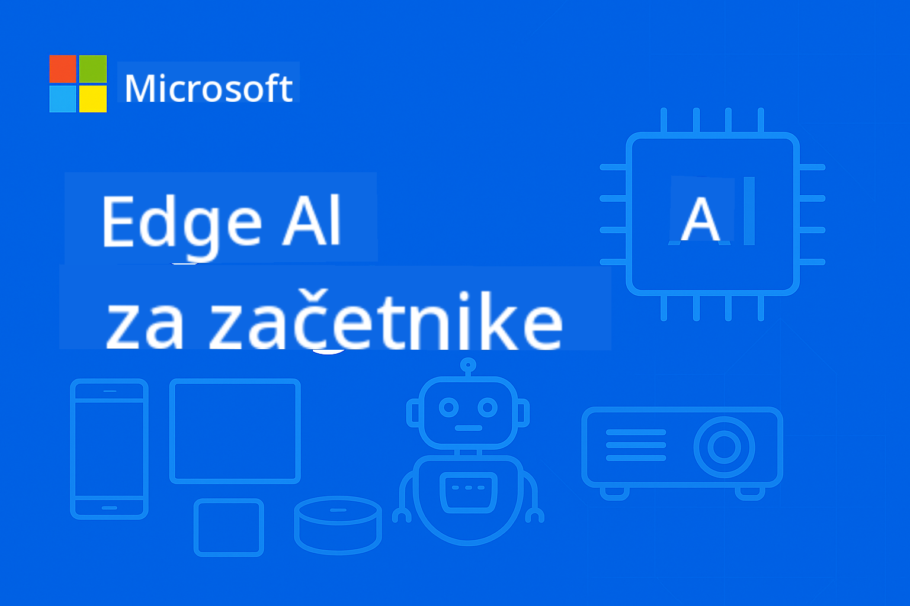

<!--
CO_OP_TRANSLATOR_METADATA:
{
  "original_hash": "dbe223abcd2955df69a08033ff16d389",
  "translation_date": "2025-10-03T08:16:39+00:00",
  "source_file": "README.md",
  "language_code": "sl"
}
-->
# EdgeAI za začetnike



[](https://GitHub.com/microsoft/edgeai-for-beginners/graphs/contributors)
[](https://GitHub.com/microsoft/edgeai-for-beginners/issues)
[](https://GitHub.com/microsoft/edgeai-for-beginners/pulls)
[](http://makeapullrequest.com)

[](https://GitHub.com/microsoft/edgeai-for-beginners/watchers)
[](https://GitHub.com/microsoft/edgeai-for-beginners/fork)
[](https://GitHub.com/microsoft/edgeai-for-beginners/stargazers)

[](https://discord.com/invite/ByRwuEEgH4)

Sledite tem korakom, da začnete uporabljati te vire:

1. **Razvejite repozitorij**: Kliknite [](https://GitHub.com/microsoft/edgeai-for-beginners/fork)
2. **Klonirajte repozitorij**: `git clone https://github.com/microsoft/edgeai-for-beginners.git`
3. [**Pridružite se Azure AI Foundry Discordu in spoznajte strokovnjake ter druge razvijalce**](https://discord.com/invite/ByRwuEEgH4)

### 🌐 Podpora za več jezikov

#### Podprto prek GitHub Action (samodejno in vedno posodobljeno)

[Arabščina](../ar/README.md) | [Bengalščina](../bn/README.md) | [Bolgarščina](../bg/README.md) | [Burmanščina (Mjanmar)](../my/README.md) | [Kitajščina (poenostavljena)](../zh/README.md) | [Kitajščina (tradicionalna, Hongkong)](../hk/README.md) | [Kitajščina (tradicionalna, Macao)](../mo/README.md) | [Kitajščina (tradicionalna, Tajvan)](../tw/README.md) | [Hrvaščina](../hr/README.md) | [Češčina](../cs/README.md) | [Danščina](../da/README.md) | [Nizozemščina](../nl/README.md) | [Finščina](../fi/README.md) | [Francoščina](../fr/README.md) | [Nemščina](../de/README.md) | [Grščina](../el/README.md) | [Hebrejščina](../he/README.md) | [Hindijščina](../hi/README.md) | [Madžarščina](../hu/README.md) | [Indonezijščina](../id/README.md) | [Italijanščina](../it/README.md) | [Japonščina](../ja/README.md) | [Korejščina](../ko/README.md) | [Malajščina](../ms/README.md) | [Maratščina](../mr/README.md) | [Nepalščina](../ne/README.md) | [Norveščina](../no/README.md) | [Perzijščina (Farsi)](../fa/README.md) | [Poljščina](../pl/README.md) | [Portugalščina (Brazilija)](../br/README.md) | [Portugalščina (Portugalska)](../pt/README.md) | [Pandžabščina (Gurmukhi)](../pa/README.md) | [Romunščina](../ro/README.md) | [Ruščina](../ru/README.md) | [Srbščina (cirilica)](../sr/README.md) | [Slovaščina](../sk/README.md) | [Slovenščina](./README.md) | [Španščina](../es/README.md) | [Svahili](../sw/README.md) | [Švedščina](../sv/README.md) | [Tagalog (Filipino)](../tl/README.md) | [Tajščina](../th/README.md) | [Turščina](../tr/README.md) | [Ukrajinščina](../uk/README.md) | [Urdu](../ur/README.md) | [Vietnamščina](../vi/README.md)

**Če želite dodati dodatne jezike, so podprti jeziki navedeni [tukaj](https://github.com/Azure/co-op-translator/blob/main/getting_started/supported-languages.md)**

## Uvod

Dobrodošli v **EdgeAI za začetnike** – vašem celovitem potovanju v preoblikovalni svet Edge umetne inteligence. Ta tečaj povezuje zmogljivosti AI z praktično uporabo na robnih napravah, kar vam omogoča, da izkoristite potencial AI neposredno tam, kjer se podatki ustvarjajo in kjer je treba sprejemati odločitve.

### Kaj boste obvladali

Ta tečaj vas vodi od osnovnih konceptov do implementacij, pripravljenih za proizvodnjo, in zajema:
- **Majhni jezikovni modeli (SLM)**, optimizirani za robno uporabo
- **Optimizacija, prilagojena strojni opremi** na različnih platformah
- **Inferenca v realnem času** z ohranjanjem zasebnosti
- **Strategije za proizvodno uporabo** v poslovnih aplikacijah

### Zakaj je EdgeAI pomemben

Edge AI predstavlja spremembo paradigme, ki obravnava ključne sodobne izzive:
- **Zasebnost in varnost**: Obdelava občutljivih podatkov lokalno, brez izpostavljanja oblaku
- **Zmogljivost v realnem času**: Odprava omrežne zakasnitve za časovno kritične aplikacije
- **Učinkovitost stroškov**: Zmanjšanje stroškov pasovne širine in oblačnega računalništva
- **Odporne operacije**: Ohranitev funkcionalnosti med izpadi omrežja
- **Skladnost z regulativami**: Izpolnjevanje zahtev glede suverenosti podatkov

### Edge AI

Edge AI se nanaša na izvajanje algoritmov umetne inteligence in jezikovnih modelov lokalno na strojni opremi, blizu mesta, kjer se podatki ustvarjajo, brez odvisnosti od oblačnih virov za inferenco. To zmanjšuje zakasnitev, izboljšuje zasebnost in omogoča sprejemanje odločitev v realnem času.

### Temeljna načela:
- **Inferenca na napravi**: AI modeli se izvajajo na robnih napravah (telefoni, usmerjevalniki, mikrokrmilniki, industrijski računalniki)
- **Zmožnost delovanja brez povezave**: Deluje brez stalne internetne povezave
- **Nizka zakasnitev**: Takojšnji odzivi, primerni za sisteme v realnem času
- **Suverenost podatkov**: Ohranja občutljive podatke lokalno, kar izboljšuje varnost in skladnost

### Majhni jezikovni modeli (SLM)

SLM, kot so Phi-4, Mistral-7B in Gemma, so optimizirane različice večjih LLM – trenirane ali destilirane za:
- **Zmanjšano porabo pomnilnika**: Učinkovita uporaba omejenega pomnilnika robnih naprav
- **Manjše zahteve po računski moči**: Optimizirano za zmogljivost CPU in robnih GPU
- **Hitrejši zagonski časi**: Hitro inicializacijo za odzivne aplikacije

Omogočajo zmogljive NLP funkcionalnosti, hkrati pa izpolnjujejo omejitve:
- **Vgrajeni sistemi**: IoT naprave in industrijski krmilniki
- **Mobilne naprave**: Pametni telefoni in tablice z možnostjo delovanja brez povezave
- **IoT naprave**: Senzorji in pametne naprave z omejenimi viri
- **Robni strežniki**: Lokalni procesni enoti z omejenimi GPU viri
- **Osebni računalniki**: Scenariji uporabe na namiznih in prenosnih računalnikih

## Moduli tečaja in navigacija

| Modul | Tema | Osrednje področje | Ključna vsebina | Stopnja | Trajanje |
|-------|------|-------------------|-----------------|---------|----------|
| [📖 00 ](./introduction.md) | [Uvod v EdgeAI](./introduction.md) | Osnove in kontekst | Pregled EdgeAI • Industrijske aplikacije • Uvod v SLM • Cilji učenja | Začetnik | 1-2 ure |
| [📚 01](../../Module01) | [Osnove EdgeAI](./Module01/README.md) | Primerjava med oblakom in Edge AI | Osnove EdgeAI • Primeri iz resničnega sveta • Vodnik za implementacijo • Robna uporaba | Začetnik | 3-4 ure |
| [🧠 02](../../Module02) | [Osnove modelov SLM](./Module02/README.md) | Družine modelov in arhitektura | Družina Phi • Družina Qwen • Družina Gemma • BitNET • μModel • Phi-Silica | Začetnik | 4-5 ur |
| [🚀 03](../../Module03) | [Praksa uporabe SLM](./Module03/README.md) | Lokalna in oblačna uporaba | Napredno učenje • Lokalno okolje • Uporaba v oblaku | Srednje zahtevno | 4-5 ur |
| [⚙️ 04](../../Module04) | [Orodje za optimizacijo modelov](./Module04/README.md) | Optimizacija na različnih platformah | Uvod • Llama.cpp • Microsoft Olive • OpenVINO • Apple MLX • Sinteza delovnih tokov | Srednje zahtevno | 5-6 ur |
| [🔧 05](../../Module05) | [SLMOps v proizvodnji](./Module05/README.md) | Operacije v proizvodnji | Uvod v SLMOps • Destilacija modelov • Fino prilagajanje • Uporaba v proizvodnji | Napredno | 5-6 ur |
| [🤖 06](../../Module06) | [AI agenti in klicanje funkcij](./Module06/README.md) | Okviri agentov in MCP | Uvod v agente • Klicanje funkcij • Protokol konteksta modela | Napredno | 4-5 ur |
| [💻 07](../../Module07) | [Implementacija na platformi](./Module07/README.md) | Primeri na različnih platformah | Orodje AI • Foundry Local • Razvoj na Windows | Napredno | 3-4 ure |
| [🏭 08](../../Module08) | [Orodje Foundry Local](./Module08/README.md) | Primeri, pripravljeni za proizvodnjo | Primeri aplikacij (glejte podrobnosti spodaj) | Strokovno | 8-10 ur |

### 🏭 **Modul 08: Primeri aplikacij**

- [01: REST Chat Quickstart](./Module08/samples/01/README.md)
- [02: Integracija OpenAI SDK](./Module08/samples/02/README.md)
- [03: Odkritje modelov in primerjava](./Module08/samples/03/README.md)
- [04: Chainlit RAG aplikacija](./Module08/samples/04/README.md)
- [05: Orkestracija več agentov](./Module08/samples/05/README.md)
- [06: Usmerjevalnik modelov kot orodij](./Module08/samples/06/README.md)
- [07: Neposredni API odjemalec](./Module08/samples/07/README.md)
- [08: Windows 11 aplikacija za klepet](./Module08/samples/08/README.md)
- [09: Napreden sistem več agentov](./Module08/samples/09/README.md)
- [10: Okvir orodij Foundry](./Module08/samples/10/README.md)

### 📊 **Povzetek učne poti**
- **Skupno trajanje**: 36-45 ur
- **Pot za začetnike**: Moduli 01-02 (7-9 ur)  
- **Pot za srednje zahtevne**: Moduli 03-04 (9-11 ur)
- **Pot za napredne**: Moduli 05-07 (12-15 ur)
- **Pot za strokovnjake**: Modul 08 (8-10 ur)

## Kaj boste ustvarili

### 🎯 Ključne kompetence
- **Arhitektura Edge AI**: Oblikovanje sistemov AI, ki delujejo lokalno, z integracijo v oblak
- **Optimizacija modelov**: Kvantizacija in stiskanje modelov za robno uporabo (85% hitrostna izboljšava, 75% zmanjšanje velikosti)
- **Uporaba na več platformah**: Windows, mobilne naprave, vgrajeni sistemi in hibridni sistemi oblak-rob
- **Operacije v proizvodnji**: Spremljanje, skaliranje in vzdrževanje Edge AI v proizvodnji

### 🏗️ Praktični projekti
- **Aplikacije za klepet Foundry Local**: Windows 11 aplikacija z možnostjo preklapljanja modelov
- **Sistemi več agentov**: Koordinator s specialističnimi agenti za kompleksne delovne tokove  
- **RAG aplikacije**: Lokalna obdelava dokumentov z iskanjem vektorjev
- **Usmerjevalniki modelov**: Inteligentna izbira med modeli glede na analizo nalog
- **Okviri API**: Odjemalci, pripravljeni za proizvodnjo, s pretakanjem in spremljanjem stanja
- **Orodja za več platform**: Vzorci integracije LangChain/Semantic Kernel

### 🏢 Industrijske aplikacije
**Proizvodnja** • **Zdravstvo** • **Avtonomna vozila** • **Pametna mesta** • **Mobilne aplikacije**

## Hitri začetek

**Priporočena učna pot** (skupno 20-30 ur):

0. **📖 Uvod** ([Introduction.md](./introduction.md)): Osnove EdgeAI + industrijski kontekst + učni okvir
1. **📚 Osnove** (Moduli 01-02): Koncepti EdgeAI + družine modelov SLM
2. **⚙️ Optimizacija** (Moduli 03-04): Uporaba + okviri za kvantizacijo  
3. **🚀 Proizvodnja** (Moduli 05-06): SLMOps + AI agenti + klicanje funkcij  
4. **💻 Implementacija** (Moduli 07-08): Primeri platforme + Foundry Local orodja  

Vsak modul vključuje teorijo, praktične vaje in vzorčne kode, pripravljene za proizvodnjo.

## Vpliv na kariero

**Tehnične vloge**: EdgeAI arhitekt rešitev • ML inženir (Edge) • IoT AI razvijalec • Mobilni AI razvijalec  

**Industrijski sektorji**: Industrija 4.0 • Zdravstvena tehnologija • Avtonomni sistemi • FinTech • Potrošniška elektronika  

**Projekti za portfelj**: Sistemi z več agenti • Proizvodne RAG aplikacije • Navzkrižna platformna implementacija • Optimizacija zmogljivosti  

## Struktura repozitorija

```
edgeai-for-beginners/
├── 📖 introduction.md  # Foundation: EdgeAI Overview & Learning Framework
├── 📚 Module01-04/     # Fundamentals → SLMs → Deployment → Optimization  
├── 🔧 Module05-06/     # SLMOps → AI Agents → Function Calling
├── 💻 Module07/        # Platform Samples (VS Code, Windows, Jetson, Mobile)
├── 🏭 Module08/        # Foundry Local Toolkit + 10 Comprehensive Samples
│   ├── samples/01-06/  # Foundation: REST, SDK, RAG, Agents, Routing
│   └── samples/07-10/  # Advanced: API Client, Windows App, Enterprise Agents, Tools
├── 🌐 translations/    # Multi-language support (8+ languages)
└── 📋 STUDY_GUIDE.md   # Structured learning paths & time allocation
```
  

## Poudarki tečaja

✅ **Progresivno učenje**: Teorija → Praksa → Implementacija v proizvodnjo  
✅ **Resnične študije primerov**: Microsoft, Japan Airlines, implementacije v podjetjih  
✅ **Praktični primeri**: 50+ primerov, 10 obsežnih Foundry Local demonstracij  
✅ **Osredotočenost na zmogljivost**: 85% izboljšanje hitrosti, 75% zmanjšanje velikosti  
✅ **Večplatformsko**: Windows, mobilne naprave, vgrajeni sistemi, hibridni oblak-rob  
✅ **Pripravljeno za proizvodnjo**: Spremljanje, skaliranje, varnost, okvirji skladnosti  

📖 **[Na voljo učni vodič](STUDY_GUIDE.md)**: Strukturirana 20-urna učna pot z usmeritvami za razporeditev časa in orodji za samoocenjevanje.

---

**EdgeAI predstavlja prihodnost implementacije AI**: lokalno usmerjeno, zasebnost ohranjajoče in učinkovito. Obvladajte te veščine za gradnjo naslednje generacije inteligentnih aplikacij.

## Drugi tečaji

Naša ekipa ponuja tudi druge tečaje! Oglejte si:  

- [MCP za začetnike](https://github.com/microsoft/mcp-for-beginners)  
- [AI agenti za začetnike](https://github.com/microsoft/ai-agents-for-beginners?WT.mc_id=academic-105485-koreyst)  
- [Generativni AI za začetnike z uporabo .NET](https://github.com/microsoft/Generative-AI-for-beginners-dotnet?WT.mc_id=academic-105485-koreyst)  
- [Generativni AI za začetnike z uporabo JavaScript](https://github.com/microsoft/generative-ai-with-javascript?WT.mc_id=academic-105485-koreyst)  
- [Generativni AI za začetnike](https://github.com/microsoft/generative-ai-for-beginners?WT.mc_id=academic-105485-koreyst)  
- [ML za začetnike](https://aka.ms/ml-beginners?WT.mc_id=academic-105485-koreyst)  
- [Podatkovna znanost za začetnike](https://aka.ms/datascience-beginners?WT.mc_id=academic-105485-koreyst)  
- [AI za začetnike](https://aka.ms/ai-beginners?WT.mc_id=academic-105485-koreyst)  
- [Kibernetska varnost za začetnike](https://github.com/microsoft/Security-101??WT.mc_id=academic-96948-sayoung)  
- [Spletni razvoj za začetnike](https://aka.ms/webdev-beginners?WT.mc_id=academic-105485-koreyst)  
- [IoT za začetnike](https://aka.ms/iot-beginners?WT.mc_id=academic-105485-koreyst)  
- [XR razvoj za začetnike](https://github.com/microsoft/xr-development-for-beginners?WT.mc_id=academic-105485-koreyst)  
- [Obvladovanje GitHub Copilot za AI parno programiranje](https://aka.ms/GitHubCopilotAI?WT.mc_id=academic-105485-koreyst)  
- [Obvladovanje GitHub Copilot za C#/.NET razvijalce](https://github.com/microsoft/mastering-github-copilot-for-dotnet-csharp-developers?WT.mc_id=academic-105485-koreyst)  
- [Izberite svojo Copilot pustolovščino](https://github.com/microsoft/CopilotAdventures?WT.mc_id=academic-105485-koreyst)  

## Pomoč

Če se zataknete ali imate vprašanja o gradnji AI aplikacij, se pridružite:  

[](https://aka.ms/foundry/discord)  

Če imate povratne informacije o izdelku ali naletite na napake med gradnjo, obiščite:  

[](https://aka.ms/foundry/forum)  

---

**Omejitev odgovornosti**:  
Ta dokument je bil preveden z uporabo storitve AI za prevajanje [Co-op Translator](https://github.com/Azure/co-op-translator). Čeprav si prizadevamo za natančnost, vas prosimo, da upoštevate, da lahko avtomatizirani prevodi vsebujejo napake ali netočnosti. Izvirni dokument v njegovem maternem jeziku naj se šteje za avtoritativni vir. Za ključne informacije priporočamo profesionalni človeški prevod. Ne prevzemamo odgovornosti za morebitna nesporazumevanja ali napačne razlage, ki izhajajo iz uporabe tega prevoda.