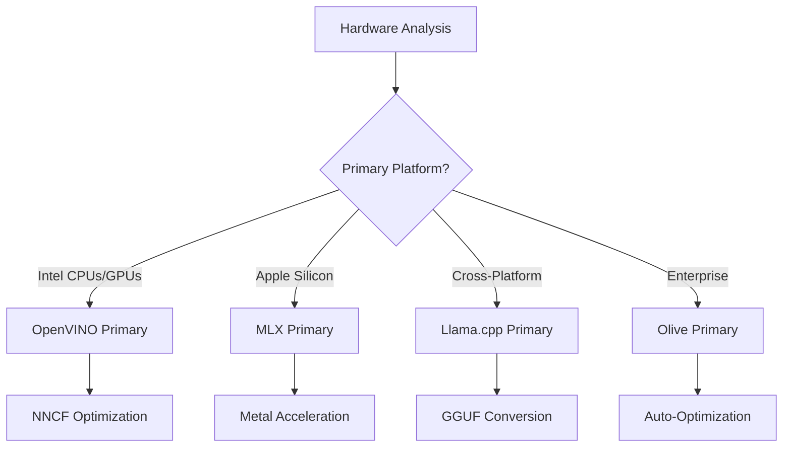
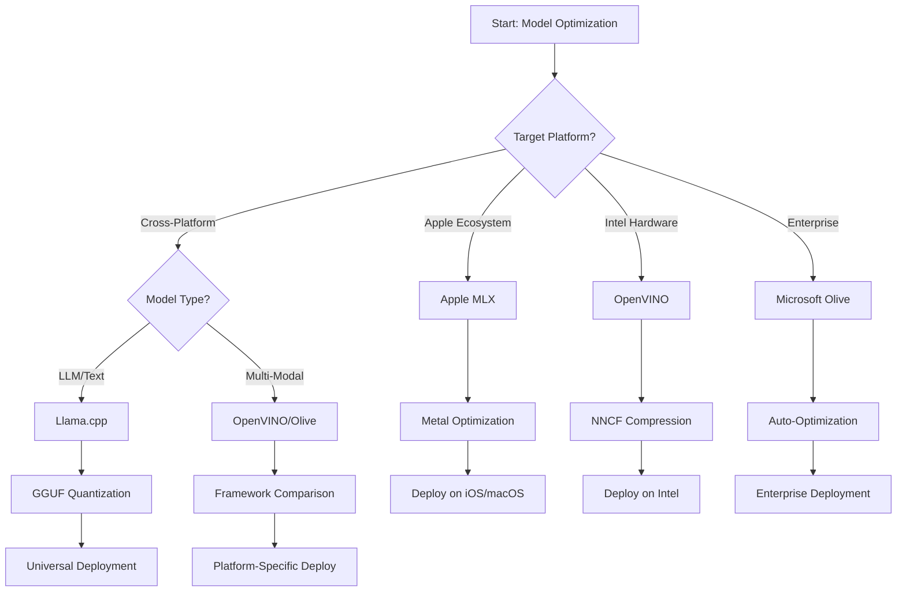
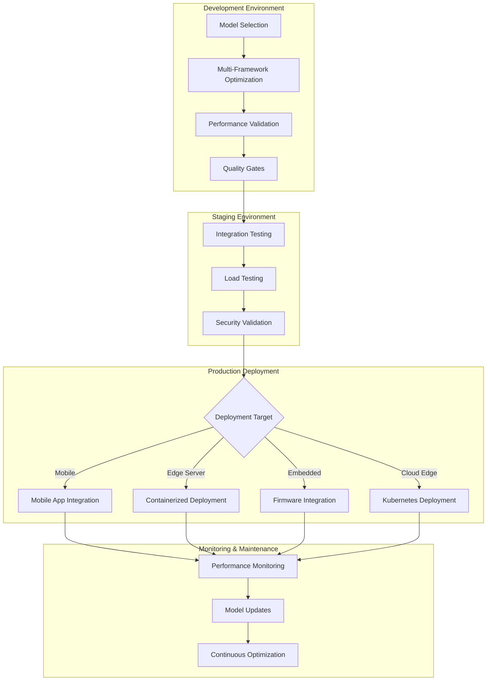

<!--
CO_OP_TRANSLATOR_METADATA:
{
  "original_hash": "6719c4a7e44b948230ac5f5cab3699bd",
  "translation_date": "2025-09-19T00:33:52+00:00",
  "source_file": "Module04/06.workflow-synthesis.md",
  "language_code": "sr"
}
-->
# Секција 6: Синтеза радног процеса развоја Edge AI

## Садржај
1. [Увод](../../../Module04)
2. [Циљеви учења](../../../Module04)
3. [Преглед уједињеног радног процеса](../../../Module04)
4. [Матрица избора оквира](../../../Module04)
5. [Синтеза најбољих пракси](../../../Module04)
6. [Водич за стратегију примене](../../../Module04)
7. [Радни процес оптимизације перформанси](../../../Module04)
8. [Контролна листа спремности за производњу](../../../Module04)
9. [Решавање проблема и праћење](../../../Module04)
10. [Осигурање будућности вашег Edge AI процеса](../../../Module04)

## Увод

Развој Edge AI захтева напредно разумевање различитих оквира за оптимизацију, стратегија примене и хардверских ограничења. Ова свеобухватна синтеза обједињује знање из Llama.cpp, Microsoft Olive, OpenVINO и Apple MLX како би се креирао уједињени радни процес који максимизира ефикасност, одржава квалитет и обезбеђује успешну примену у производњи.

Током овог курса, истраживали смо појединачне оквире за оптимизацију, сваки са својим јединственим предностима и специјализованим случајевима употребе. Међутим, пројекти Edge AI у стварном свету често захтевају комбинацију техника из више оквира или доношење стратешких одлука о томе који приступ ће донети најбоље резултате за специфична ограничења и захтеве.

Ова секција синтетише колективну мудрост свих оквира у применљиве радне процесе, одлуке и најбоље праксе које вам омогућавају да ефикасно и ефективно изградите решења Edge AI спремна за производњу. Без обзира да ли оптимизујете за мобилне уређаје, уграђене системе или edge сервере, овај водич пружа стратешки оквир за доношење информисаних одлука током целог животног циклуса развоја.

## Циљеви учења

На крају ове секције, бићете у могућности да:

### Стратешко доношење одлука
- **Процените и изаберете** оптимални оквир за оптимизацију на основу захтева пројекта, хардверских ограничења и сценарија примене
- **Дизајнирате свеобухватне радне процесе** који интегришу више техника оптимизације за максималну ефикасност
- **Процените компромисе** између тачности модела, брзине инференције, употребе меморије и сложености примене у различитим оквирима

### Интеграција радног процеса
- **Примените уједињене развојне процесе** који користе предности више оквира за оптимизацију
- **Креирајте репродуктивне радне процесе** за доследну оптимизацију модела и примену у различитим окружењима
- **Успоставите контролне тачке квалитета** и процесе валидације како би се осигурало да оптимизовани модели испуњавају захтеве производње

### Оптимизација перформанси
- **Примените систематске стратегије оптимизације** користећи квантовање, орезивање и технике специфичне за хардвер
- **Пратите и мерите** перформансе модела на различитим нивоима оптимизације и циљним платформама
- **Оптимизујте за специфичне хардверске платформе** укључујући CPU, GPU, NPU и специјализоване edge акцелераторе

### Примена у производњи
- **Дизајнирајте скалабилне архитектуре примене** које подржавају више формата модела и моторе за инференцију
- **Примените праћење и посматрање** за Edge AI апликације у производним окружењима
- **Успоставите радне процесе одржавања** за ажурирање модела, праћење перформанси и оптимизацију система

### Изврсност на више платформи
- **Примените оптимизоване моделе** на различитим хардверским платформама уз одржавање доследних перформанси
- **Решите оптимизације специфичне за платформу** за Windows, macOS, Linux, мобилне и уграђене системе
- **Креирајте слојеве апстракције** који омогућавају беспрекорну примену у различитим edge окружењима

## Преглед уједињеног радног процеса

### Фаза 1: Анализа захтева и избор оквира

Основа успешне примене Edge AI почиње са детаљном анализом захтева која информише избор оквира и стратегију оптимизације.

#### 1.1 Процена хардвера


**Кључни фактори:**
- **Архитектура CPU-а**: x86, ARM, могућности Apple Silicon-а
- **Доступност акцелератора**: GPU, NPU, VPU, специјализовани AI чипови
- **Ограничења меморије**: Ограничења RAM-а, капацитет складишта
- **Енергетски буџет**: Трајање батерије, термална ограничења
- **Повезивост**: Захтеви за офлајн рад, ограничења пропусног опсега

#### 1.2 Матрица захтева апликације

| Захтев | Llama.cpp | Microsoft Olive | OpenVINO | Apple MLX |
|--------|-----------|-----------------|----------|-----------|
| Више платформи | ✅ Одлично | ⚡ Добро | ⚡ Добро | ❌ Само Apple |
| Интеграција у предузеће | ⚡ Основно | ✅ Одлично | ✅ Одлично | ⚡ Ограничено |
| Примена на мобилним уређајима | ✅ Одлично | ⚡ Добро | ⚡ Добро | ✅ iOS Одлично |
| Инференција у реалном времену | ✅ Одлично | ✅ Одлично | ✅ Одлично | ✅ Одлично |
| Разноврсност модела | ✅ Фокус на LLM | ✅ Сви модели | ✅ Сви модели | ✅ Фокус на LLM |
| Лакоћа коришћења | ✅ Једноставно | ✅ Аутоматизовано | ⚡ Умерено | ✅ Једноставно |

### Фаза 2: Припрема и оптимизација модела

#### 2.1 Универзални процес процене модела

```python
# Universal Model Assessment Framework
class EdgeAIModelAssessment:
    def __init__(self, model_path, target_hardware):
        self.model_path = model_path
        self.target_hardware = target_hardware
        self.optimization_frameworks = []
        
    def assess_model_characteristics(self):
        """Analyze model size, architecture, and complexity"""
        return {
            'model_size': self.get_model_size(),
            'parameter_count': self.get_parameter_count(),
            'architecture_type': self.detect_architecture(),
            'quantization_compatibility': self.check_quantization_support()
        }
    
    def recommend_optimization_strategy(self):
        """Recommend optimal frameworks and techniques"""
        characteristics = self.assess_model_characteristics()
        
        if self.target_hardware.startswith('apple'):
            return self.mlx_optimization_strategy(characteristics)
        elif self.target_hardware.startswith('intel'):
            return self.openvino_optimization_strategy(characteristics)
        elif characteristics['model_size'] > 7_000_000_000:  # 7B+ parameters
            return self.enterprise_optimization_strategy(characteristics)
        else:
            return self.lightweight_optimization_strategy(characteristics)
```

#### 2.2 Вишеструки процес оптимизације оквира

**Секвенцијални приступ оптимизацији:**
1. **Иницијална конверзија**: Конвертујте у интермедијарни формат (ONNX када је могуће)
2. **Оптимизација специфична за оквир**: Примените специјализоване технике
3. **Крос-валидација**: Потврдите перформансе на циљним платформама
4. **Коначна припрема**: Припремите за примену

```bash
# Multi-Framework Optimization Script
#!/bin/bash

MODEL_NAME="phi-3-mini"
BASE_MODEL="microsoft/Phi-3-mini-4k-instruct"

# Phase 1: ONNX Conversion (Universal)
python convert_to_onnx.py --model $BASE_MODEL --output models/onnx/

# Phase 2: Platform-Specific Optimization
if [[ "$TARGET_PLATFORM" == "intel" ]]; then
    # OpenVINO Optimization
    python optimize_openvino.py --input models/onnx/ --output models/openvino/
elif [[ "$TARGET_PLATFORM" == "apple" ]]; then
    # MLX Optimization
    python optimize_mlx.py --input $BASE_MODEL --output models/mlx/
elif [[ "$TARGET_PLATFORM" == "cross" ]]; then
    # Llama.cpp Optimization
    python convert_to_gguf.py --input models/onnx/ --output models/gguf/
fi

# Phase 3: Validation
python validate_optimization.py --original $BASE_MODEL --optimized models/$TARGET_PLATFORM/
```

### Фаза 3: Валидација перформанси и бенчмаркинг

#### 3.1 Свеобухватни оквир за бенчмаркинг

```python
class EdgeAIBenchmark:
    def __init__(self, optimized_models):
        self.models = optimized_models
        self.metrics = {
            'inference_time': [],
            'memory_usage': [],
            'accuracy_score': [],
            'throughput': [],
            'energy_consumption': []
        }
    
    def run_comprehensive_benchmark(self):
        """Execute standardized benchmarks across all optimized models"""
        test_inputs = self.generate_test_inputs()
        
        for model_framework, model_path in self.models.items():
            print(f"Benchmarking {model_framework}...")
            
            # Latency Testing
            latency = self.measure_inference_latency(model_path, test_inputs)
            
            # Memory Profiling
            memory = self.profile_memory_usage(model_path)
            
            # Accuracy Validation
            accuracy = self.validate_model_accuracy(model_path, test_inputs)
            
            # Throughput Analysis
            throughput = self.measure_throughput(model_path)
            
            self.record_metrics(model_framework, latency, memory, accuracy, throughput)
    
    def generate_optimization_report(self):
        """Create comprehensive comparison report"""
        report = {
            'recommendations': self.analyze_performance_trade_offs(),
            'deployment_guidance': self.generate_deployment_recommendations(),
            'monitoring_requirements': self.define_monitoring_metrics()
        }
        return report
```

## Матрица избора оквира

### Одлука о избору оквира



### Свеобухватни критеријуми за избор

#### 1. Усклађеност са примарним случајем употребе

**Модели великих језика (LLMs):**
- **Llama.cpp**: Најбољи за примену фокусирану на CPU, више платформи
- **Apple MLX**: Оптимално за Apple Silicon са уједињеном меморијом
- **OpenVINO**: Одлично за Intel хардвер са NNCF оптимизацијом
- **Microsoft Olive**: Идеално за предузећа са аутоматизацијом

**Мултимодални модели:**
- **OpenVINO**: Свеобухватна подршка за визију, аудио и текст
- **Microsoft Olive**: Оптимизација за сложене предузетничке процесе
- **Llama.cpp**: Ограничено на текстуалне моделе
- **Apple MLX**: Растућа подршка за мултимодалне апликације

#### 2. Матрица хардверске платформе

| Платформа | Примарни оквир | Секундарна опција | Специјализоване карактеристике |
|-----------|---------------|------------------|-----------------------------|
| Intel CPU/GPU | OpenVINO | Microsoft Olive | NNCF компресија, Intel оптимизација |
| NVIDIA GPU | Microsoft Olive | OpenVINO | CUDA акцелерација, предузетничке карактеристике |
| Apple Silicon | Apple MLX | Llama.cpp | Metal shaders, уједињена меморија |
| ARM мобилни | Llama.cpp | OpenVINO | Више платформи, минималне зависности |
| Edge TPU | OpenVINO | Microsoft Olive | Подршка за специјализоване акцелераторе |
| Уграђени ARM | Llama.cpp | OpenVINO | Минимални отисак, ефикасна инференција |

#### 3. Преференције радног процеса развоја

**Брзо прототипирање:**
1. **Llama.cpp**: Најбржа поставка, тренутни резултати
2. **Apple MLX**: Једноставан Python API, брза итерација
3. **Microsoft Olive**: Аутоматизована оптимизација, минимална конфигурација
4. **OpenVINO**: Комплекснија поставка, свеобухватне карактеристике

**Продукција у предузећу:**
1. **Microsoft Olive**: Карактеристике за предузећа, Azure интеграција
2. **OpenVINO**: Intel екосистем, свеобухватни алати
3. **Apple MLX**: Апликације специфичне за Apple предузећа
4. **Llama.cpp**: Једноставна примена, ограничене карактеристике за предузећа

## Синтеза најбољих пракси

### Универзални принципи оптимизације

#### 1. Стратегија прогресивне оптимизације

```python
class ProgressiveOptimization:
    def __init__(self, base_model):
        self.base_model = base_model
        self.optimization_stages = [
            'baseline_measurement',
            'format_conversion',
            'quantization_optimization',
            'hardware_acceleration',
            'production_validation'
        ]
    
    def execute_progressive_optimization(self):
        """Apply optimization techniques incrementally"""
        
        # Stage 1: Baseline Measurement
        baseline_metrics = self.measure_baseline_performance()
        
        # Stage 2: Format Conversion
        converted_model = self.convert_to_optimal_format()
        conversion_metrics = self.measure_performance(converted_model)
        
        # Stage 3: Quantization
        quantized_model = self.apply_quantization(converted_model)
        quantization_metrics = self.measure_performance(quantized_model)
        
        # Stage 4: Hardware Acceleration
        accelerated_model = self.enable_hardware_acceleration(quantized_model)
        acceleration_metrics = self.measure_performance(accelerated_model)
        
        # Stage 5: Validation
        production_ready = self.validate_for_production(accelerated_model)
        
        return self.compile_optimization_report(
            baseline_metrics, conversion_metrics, 
            quantization_metrics, acceleration_metrics
        )
```

#### 2. Имплементација контролних тачака квалитета

**Контролне тачке за очување тачности:**
- Одржите >95% оригиналне тачности модела
- Валидација на репрезентативним тест сетовима
- Примените A/B тестирање за валидацију у производњи

**Контролне тачке за побољшање перформанси:**
- Постигните минимум 2x побољшање брзине
- Смањите меморијски отисак за најмање 50%
- Потврдите конзистентност времена инференције

**Контролне тачке спремности за производњу:**
- Прођите тестирање под оптерећењем
- Демонстрирајте стабилне перформансе током времена
- Потврдите захтеве за безбедност и приватност

### Интеграција најбољих пракси специфичних за оквир

#### 1. Синтеза стратегије квантовања

```python
# Unified Quantization Approach
class UnifiedQuantizationStrategy:
    def __init__(self, model, target_platform):
        self.model = model
        self.platform = target_platform
        
    def select_optimal_quantization(self):
        """Choose best quantization based on platform and requirements"""
        
        if self.platform == 'apple_silicon':
            return self.mlx_quantization_strategy()
        elif self.platform == 'intel_hardware':
            return self.openvino_quantization_strategy()
        elif self.platform == 'cross_platform':
            return self.llamacpp_quantization_strategy()
        else:
            return self.olive_quantization_strategy()
    
    def mlx_quantization_strategy(self):
        """Apple MLX-specific quantization"""
        return {
            'method': 'mlx_quantize',
            'precision': 'int4',
            'group_size': 64,
            'optimization_target': 'unified_memory'
        }
    
    def openvino_quantization_strategy(self):
        """OpenVINO NNCF quantization"""
        return {
            'method': 'nncf_quantize',
            'precision': 'int8',
            'calibration_method': 'post_training',
            'optimization_target': 'intel_hardware'
        }
```

#### 2. Оптимизација хардверске акцелерације

**Синтеза оптимизације за CPU:**
- **SIMD инструкције**: Искористите оптимизоване кернеле у оквирима
- **Пропусни опсег меморије**: Оптимизујте распореде података за ефикасност кеша
- **Трединг**: Балансирајте паралелизам са ограничењима ресурса

**Најбоље праксе за GPU акцелерацију:**
- **Обрада у серијама**: Максимизирајте пропусност са одговарајућим величинама серија
- **Управљање меморијом**: Оптимизујте GPU меморијску алокацију и трансфере
- **Прецизност**: Користите FP16 када је подржано за боље перформансе

**Оптимизација за NPU/специјализоване акцелераторе:**
- **Архитектура модела**: Осигурајте компатибилност са могућностима акцелератора
- **Проток података**: Оптимизујте улазно/излазне процесе за ефикасност акцелератора
- **Стратегије резерве**: Примените CPU резерву за неподржане операције

## Водич за стратегију примене

### Универзална архитектура примене



### Шаблони примене специфични за платформу

#### 1. Стратегија примене на мобилним уређајима

```yaml
# Mobile Deployment Configuration
mobile_deployment:
  ios:
    framework: apple_mlx
    optimization:
      quantization: int4
      memory_mapping: true
      background_execution: limited
    packaging:
      format: mlx
      bundle_size: <50MB
      
  android:
    framework: llama_cpp
    optimization:
      quantization: q4_k_m
      threading: android_optimized
      memory_management: conservative
    packaging:
      format: gguf
      apk_size: <100MB
      
  cross_platform:
    framework: onnx_runtime
    optimization:
      quantization: int8
      execution_provider: cpu
    packaging:
      format: onnx
      shared_libraries: minimal
```

#### 2. Примена на edge серверима

```yaml
# Edge Server Deployment Configuration
edge_server:
  intel_based:
    framework: openvino
    optimization:
      quantization: int8
      acceleration: cpu_gpu_auto
      batch_processing: dynamic
    deployment:
      container: openvino_runtime
      orchestration: kubernetes
      scaling: horizontal
      
  nvidia_based:
    framework: microsoft_olive
    optimization:
      quantization: int4
      acceleration: cuda
      tensor_parallelism: true
    deployment:
      container: nvidia_triton
      orchestration: kubernetes
      scaling: gpu_aware
```

### Најбоље праксе за контејнеризацију

```dockerfile
# Multi-Framework Edge AI Container
FROM ubuntu:22.04 as base

# Install common dependencies
RUN apt-get update && apt-get install -y \
    python3 \
    python3-pip \
    build-essential \
    cmake \
    && rm -rf /var/lib/apt/lists/*

# Framework-specific stages
FROM base as openvino
RUN pip install openvino nncf optimum[intel]

FROM base as llamacpp
RUN git clone https://github.com/ggerganov/llama.cpp.git \
    && cd llama.cpp && make LLAMA_OPENBLAS=1

FROM base as olive
RUN pip install olive-ai[auto-opt] onnxruntime-genai

# Production stage with selected framework
FROM openvino as production
COPY models/ /app/models/
COPY src/ /app/src/
WORKDIR /app

EXPOSE 8080
CMD ["python3", "src/inference_server.py"]
```

## Радни процес оптимизације перформанси

### Систематско подешавање перформанси

#### 1. Процес профилисања перформанси

```python
class EdgeAIPerformanceProfiler:
    def __init__(self, model_path, framework):
        self.model_path = model_path
        self.framework = framework
        self.profiling_results = {}
    
    def comprehensive_profiling(self):
        """Execute comprehensive performance analysis"""
        
        # CPU Profiling
        cpu_profile = self.profile_cpu_usage()
        
        # Memory Profiling
        memory_profile = self.profile_memory_usage()
        
        # Inference Latency
        latency_profile = self.profile_inference_latency()
        
        # Throughput Analysis
        throughput_profile = self.profile_throughput()
        
        # Energy Consumption (where available)
        energy_profile = self.profile_energy_consumption()
        
        return self.compile_performance_report(
            cpu_profile, memory_profile, latency_profile,
            throughput_profile, energy_profile
        )
    
    def identify_bottlenecks(self):
        """Automatically identify performance bottlenecks"""
        bottlenecks = []
        
        if self.profiling_results['cpu_utilization'] > 80:
            bottlenecks.append('cpu_bound')
        
        if self.profiling_results['memory_usage'] > 90:
            bottlenecks.append('memory_bound')
        
        if self.profiling_results['inference_variance'] > 20:
            bottlenecks.append('inconsistent_performance')
        
        return self.generate_optimization_recommendations(bottlenecks)
```

#### 2. Аутоматизовани процес оптимизације

```python
class AutomatedOptimizationPipeline:
    def __init__(self, base_model, target_constraints):
        self.base_model = base_model
        self.constraints = target_constraints
        self.optimization_history = []
    
    def execute_optimization_search(self):
        """Systematically search optimization space"""
        
        optimization_candidates = [
            {'quantization': 'int8', 'pruning': 0.1},
            {'quantization': 'int4', 'pruning': 0.2},
            {'quantization': 'int8', 'acceleration': 'gpu'},
            {'quantization': 'int4', 'acceleration': 'npu'}
        ]
        
        best_configuration = None
        best_score = 0
        
        for config in optimization_candidates:
            optimized_model = self.apply_optimization(config)
            score = self.evaluate_optimization(optimized_model)
            
            if score > best_score and self.meets_constraints(optimized_model):
                best_score = score
                best_configuration = config
            
            self.optimization_history.append({
                'config': config,
                'score': score,
                'model': optimized_model
            })
        
        return best_configuration, self.optimization_history
```

### Вишеструка оптимизација циљева

#### 1. Парето оптимизација за Edge AI

```python
class ParetoOptimization:
    def __init__(self, objectives=['speed', 'accuracy', 'memory']):
        self.objectives = objectives
        self.pareto_frontier = []
    
    def find_pareto_optimal_solutions(self, optimization_results):
        """Identify Pareto-optimal configurations"""
        
        for result in optimization_results:
            is_dominated = False
            
            for frontier_point in self.pareto_frontier:
                if self.dominates(frontier_point, result):
                    is_dominated = True
                    break
            
            if not is_dominated:
                # Remove dominated points from frontier
                self.pareto_frontier = [
                    point for point in self.pareto_frontier 
                    if not self.dominates(result, point)
                ]
                
                self.pareto_frontier.append(result)
        
        return self.pareto_frontier
    
    def recommend_configuration(self, user_preferences):
        """Recommend configuration based on user preferences"""
        
        weighted_scores = []
        for config in self.pareto_frontier:
            score = sum(
                user_preferences[obj] * config['metrics'][obj] 
                for obj in self.objectives
            )
            weighted_scores.append((score, config))
        
        return max(weighted_scores, key=lambda x: x[0])[1]
```

## Контролна листа спремности за производњу

### Свеобухватна валидација производње

#### 1. Осигурање квалитета модела

```python
class ProductionReadinessValidator:
    def __init__(self, optimized_model, production_requirements):
        self.model = optimized_model
        self.requirements = production_requirements
        self.validation_results = {}
    
    def validate_model_quality(self):
        """Comprehensive model quality validation"""
        
        # Accuracy Validation
        accuracy_result = self.validate_accuracy()
        
        # Performance Validation
        performance_result = self.validate_performance()
        
        # Robustness Testing
        robustness_result = self.validate_robustness()
        
        # Security Assessment
        security_result = self.validate_security()
        
        # Compliance Verification
        compliance_result = self.validate_compliance()
        
        return self.compile_validation_report(
            accuracy_result, performance_result, robustness_result,
            security_result, compliance_result
        )
    
    def generate_certification_report(self):
        """Generate production certification report"""
        return {
            'model_signature': self.generate_model_signature(),
            'validation_timestamp': datetime.now(),
            'validation_results': self.validation_results,
            'deployment_approval': self.check_deployment_approval(),
            'monitoring_requirements': self.define_monitoring_requirements()
        }
```

#### 2. Контролна листа примене у производњи

**Валидација пре примене:**
- [ ] Тачност модела испуњава минималне захтеве (>95% основног модела)
- [ ] Постигнути циљеви перформанси (латенција, пропусност, меморија)
- [ ] Процењене и ублажене рањивости у безбедности
- [ ] Завршено тестирање под очекиваним оптерећењем
- [ ] Тестирани сценарији отказа и валидирани поступци опоравка
- [ ] Конфигурисани системи за праћење и упозорења
- [ ] Тестирани и документовани поступци враћања

**Процес примене:**
- [ ] Примењена стратегија плаво-зелене примене
- [ ] Конфигурисано постепено повећање саобраћаја
- [ ] Активне контролне табле за праћење у реалном времену
- [ ] Успостављене основне вредности перформанси
- [ ] Дефинисани прагови стопе грешке
- [ ] Конфигурисани аутоматизовани тригери за враћање

**Праћење након примене:**
- [ ] Активна детекција одступања модела
- [ ] Конфигурисана упозорења за деградацију перформанси
- [ ] Омогућено праћење коришћења ресурса
- [ ] Праћени метрики корисничког искуства
- [ ] Одржавана верзија модела и његова историја
- [ ] Редовно заказани прегледи перформанси модела

### Континуирана интеграција/континуирана примена (CI/CD)

```yaml
# Edge AI CI/CD Pipeline Configuration
edge_ai_pipeline:
  stages:
    - model_validation
    - optimization
    - testing
    - staging_deployment
    - production_deployment
    - monitoring
  
  model_validation:
    accuracy_threshold: 0.95
    performance_baseline: required
    security_scan: enabled
    
  optimization:
    frameworks:
      - llama_cpp
      - openvino
      - microsoft_olive
    validation:
      cross_validation: enabled
      performance_comparison: required
      
  testing:
    unit_tests: comprehensive
    integration_tests: full_pipeline
    load_tests: production_scale
    security_tests: comprehensive
    
  deployment:
    strategy: blue_green
    traffic_ramping: gradual
    rollback: automatic
    monitoring: real_time
```

## Решавање проблема и праћење

### Универзални оквир за решавање проблема

#### 1. Уобичајени проблеми
Запамтите да је најбоља стратегија оптимизације она која испуњава ваше специфичне захтеве, уз истовремено одржавање флексибилности да се прилагоди како се ти захтеви развијају. Користите овај водич као оквир за доношење информисаних одлука, али увек потврдите своје изборе кроз емпиријско тестирање и искуство из стварне примене.

## ➡️ Шта је следеће

Наставите своје путовање кроз Edge AI истражујући [Модул 5: SLMOps и продукционо распоређивање](../Module05/README.md) како бисте научили о оперативним аспектима управљања животним циклусом малих језичких модела.

---

**Одрицање од одговорности**:  
Овај документ је преведен коришћењем услуге за превођење помоћу вештачке интелигенције [Co-op Translator](https://github.com/Azure/co-op-translator). Иако се трудимо да обезбедимо тачност, молимо вас да имате у виду да аутоматски преводи могу садржати грешке или нетачности. Оригинални документ на његовом изворном језику треба сматрати ауторитативним извором. За критичне информације препоручује се професионални превод од стране људи. Не сносимо одговорност за било каква погрешна тумачења или неспоразуме који могу настати услед коришћења овог превода.