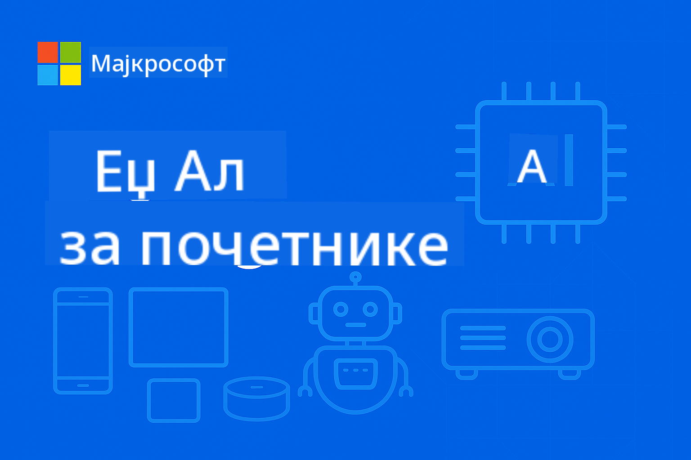

<!--
CO_OP_TRANSLATOR_METADATA:
{
  "original_hash": "22c6dae04591abc5f0d80f944ed663d5",
  "translation_date": "2025-09-26T10:45:22+00:00",
  "source_file": "introduction.md",
  "language_code": "sr"
}
-->
# Увод у Edge AI за почетнике



Добродошли на ваше путовање кроз **Edge вештачку интелигенцију** – револуционарни приступ који доноси моћ вештачке интелигенције директно тамо где се подаци стварају и где је потребно доносити одлуке. Овај увод ће поставити темеље за разумевање зашто Edge AI представља будућност интелигентног рачунарства и како можете савладати његову примену.

## Шта је Edge AI?

Edge AI представља суштинску промену од традиционалне обраде вештачке интелигенције у облаку ка **локалној, на-уређај интелигенцији**. Уместо слања података на удаљене сервере, Edge AI обрађује информације директно на уређајима на ивици – паметним телефонима, IoT сензорима, индустријској опреми, аутономним возилима и уграђеним системима.

### Парадигма Edge AI

```
Traditional AI:     Device → Cloud → Processing → Response → Device
Edge AI:           Device → Local Processing → Immediate Response
```

Ова промена парадигме елиминише потребу за слањем података у облак, омогућавајући:
- **Тренутне одговоре** (латенција испод милисекунде)
- **Побољшану приватност** (подаци никада не напуштају уређај)
- **Поуздан рад** (функционише без интернет конекције)
- **Смањене трошкове** (минимална употреба пропусног опсега и ресурса облака)

## Зашто је Edge AI важан сада

### Савршена олуја иновација

Три технолошка тренда су се спојила да учине Edge AI не само могућим, већ и неопходним:

1. **Револуција хардвера**: Модерни чипови (Apple Silicon, Qualcomm Snapdragon, NVIDIA Jetson) сада укључују AI акцелерацију у компактним, енергетски ефикасним пакетима
2. **Оптимизација модела**: Мали језички модели (SLM) као што су Phi-4, Gemma и Mistral пружају 80-90% перформанси великих модела у 10-20% величине
3. **Потражња у стварном свету**: Индустрије захтевају тренутну, приватну и поуздану AI коју решења у облаку не могу да обезбеде

### Критични пословни покретачи

**Приватност и усаглашеност**
- Здравство: Подаци пацијената морају остати локални (усаглашеност са HIPAA)
- Финансије: Обрада трансакција захтева суверенитет података
- Производња: Поверљиви процеси морају бити заштићени од излагања

**Захтеви за перформансама**
- Аутономна возила: Одлуке критичне за живот у милисекундама
- Индустријска аутоматизација: Контрола квалитета и праћење безбедности у реалном времену
- Игре и AR/VR: Уроњива искуства захтевају нулту приметну латенцију

**Економска ефикасност**
- Телекомуникације: Обрада милиона IoT сензорских очитавања локално
- Малопродаја: Аналитика у продавници без великих трошкова пропусног опсега
- Паметни градови: Распоређена интелигенција на хиљадама уређаја

## Индустрије трансформисане Edge AI-јем

### 🏭 **Производња и Индустрија 4.0**
- **Предиктивно одржавање**: AI модели на индустријској опреми предвиђају кварове пре него што се догоде
- **Контрола квалитета**: Откривање дефеката у реалном времену на производним линијама
- **Праћење безбедности**: Тренутно откривање опасности и реаговање
- **Ланац снабдевања**: Интелигентно управљање залихама на сваком чвору

**Утицај у стварном свету**: Siemens користи Edge AI за предиктивно одржавање, смањујући време застоја за 30-50% и трошкове одржавања за 25%.

### 🏥 **Здравство и медицински уређаји**
- **Дијагностичка слика**: Анализа X-зрака и MRI слика уз помоћ AI на месту пружања услуга
- **Праћење пацијената**: Континуирана процена здравља преко носивих уређаја
- **Асистенција у хирургији**: Водич у реалном времену током процедура
- **Откривање лекова**: Локална обрада молекуларних симулација

**Утицај у стварном свету**: Philips-ова Edge AI решења омогућавају радиолозима да дијагностикују стања 40% брже уз одржавање 99% тачности.

### 🚗 **Аутономни системи и транспорт**
- **Самовозећа возила**: Одлуке у делићу секунде за навигацију и безбедност
- **Управљање саобраћајем**: Интелигентна контрола раскрсница и оптимизација протока
- **Операције флоте**: Оптимизација рута у реалном времену и праћење здравља возила
- **Логистика**: Аутономни роботи у складиштима и системи за испоруку

**Утицај у стварном свету**: Tesla-ов Full Self-Driving систем локално обрађује сензорске податке, доносећи преко 40 одлука у секунди за безбедну аутономну навигацију.

### 🏙️ **Паметни градови и инфраструктура**
- **Јавна безбедност**: Откривање претњи и реаговање у реалном времену
- **Управљање енергијом**: Оптимизација паметне мреже и интеграција обновљиве енергије
- **Праћење животне средине**: Квалитет ваздуха, бука и праћење климе
- **Урбанистичко планирање**: Анализа протока саобраћаја и оптимизација инфраструктуре

**Утицај у стварном свету**: Иницијатива паметног града у Сингапуру користи преко 100,000 Edge AI сензора за управљање саобраћајем, смањујући време путовања за 25%.

### 📱 **Потрошачка технологија и мобилни уређаји**
- **AI на паметним телефонима**: Побољшана фотографија, гласовни асистенти и персонализација
- **Паметни домови**: Интелигентна аутоматизација и сигурносни системи
- **Носиви уређаји**: Праћење здравља и оптимизација фитнеса
- **Игре**: Побољшање графике у реалном времену и оптимизација играња

**Утицај у стварном свету**: Apple-ов Neural Engine локално обрађује 15.8 трилиона операција у секунди, омогућавајући функције као што су превођење језика у реалном времену и рачунарска фотографија.

## Мали језички модели: Мотор Edge AI-ја

### Шта су мали језички модели (SLM)?

SLM су **компресоване, оптимизоване верзије** великих језичких модела, посебно дизајниране за примену на ивици:

- **Phi-4**: 14B параметара, оптимизован за резоновање и генерисање кода
- **Gemma 2B/7B**: Google-ови ефикасни модели за разноврсне NLP задатке
- **Mistral-7B**: Високоперформансни модел са комерцијално пријатељском лиценцом
- **Qwen серија**: Alibaba-ови мултијезички модели оптимизовани за мобилну примену

### Предности SLM-а

| Способност | Велики језички модели | Мали језички модели |
|------------|----------------------|----------------------|
| **Величина** | 70B-405B параметара | 1B-14B параметара |
| **Меморија** | 40-200GB RAM | 2-16GB RAM |
| **Брзина инференције** | 2-10 секунди | 50-500ms |
| **Примена** | Висококвалитетни сервери | Паметни телефони, уграђени уређаји |
| **Трошкови** | $1000s/месечно | Једнократни трошак хардвера |
| **Приватност** | Подаци се шаљу у облак | Обрада остаје локална |

### Провера перформанси

Модерни SLM-ови постижу изузетне способности:
- **90% перформанси GPT-3.5** у многим задацима
- **Разговор у реалном времену**
- **Генерисање и отклањање грешака у коду**
- **Превођење на више језика**
- **Анализа и сумирање докумената**

## Циљеви учења

Завршетком курса EdgeAI за почетнике, научићете:

### 🎯 **Основно знање**
- Разумети техничке и пословне покретаче усвајања Edge AI-ја
- Упоредити архитектуре AI на ивици и у облаку и њихове одговарајуће случајеве употребе
- Идентификовати карактеристике и способности различитих породица SLM-а
- Анализирати хардверске захтеве за примену Edge AI-ја

### 🛠️ **Техничке вештине**
- Применити SLM-ове на различитим платформама (Windows, мобилни, уграђени, хибрид облак-ивица)
- Оптимизовати моделе за ограничења на ивици користећи квантовање, орезивање и компресију
- Имплементирати Edge AI апликације спремне за производњу уз праћење и скалирање
- Изградити системе са више агената и оквире за позивање функција за сложене токове рада

### 🏗️ **Практична примена**
- Креирати апликације за ћаскање са локалним пребацивањем модела и управљањем разговорима
- Развити RAG (генерација уз помоћ претраживања) системе са локалном обрадом докумената
- Изградити рутере модела који интелигентно бирају између специјализованих AI модела
- Дизајнирати API оквире са стримингом, праћењем здравља и руковањем грешкама

### 🚀 **Примена у производњи**
- Успоставити SLMOps процесе за верзионисање модела, тестирање и примену
- Имплементирати најбоље праксе безбедности за Edge AI апликације
- Дизајнирати скалабилне архитектуре које балансирају обраду на ивици и у облаку
- Креирати стратегије за праћење и одржавање Edge AI система у производњи

## Резултати учења

По завршетку курса, бићете опремљени да:

### **Техничко мајсторство**
✅ **Примените Edge AI решења спремна за производњу** на Windows, мобилним и уграђеним платформама  
✅ **Оптимизујете AI моделе за ограничења на ивици** постигавши 75% смањење величине уз задржавање 85% перформанси  
✅ **Изградите интелигентне системе агената** са позивањем функција и оркестрацијом више модела  
✅ **Креирате скалабилне хибридне архитектуре ивица-облак** за пословне апликације

### **Примена у индустрији**
✅ **Дизајнирате решења за производњу** за предиктивно одржавање и контролу квалитета  
✅ **Развијете здравствене апликације** са обрадом података пацијената у складу са приватношћу  
✅ **Изградите аутомобилске системе** за доношење одлука у реалном времену и безбедност  
✅ **Креирате инфраструктуру паметног града** за саобраћај, безбедност и праћење животне средине

### **Напредак у каријери**
✅ **EdgeAI архитекта решења**: Дизајнирајте свеобухватне стратегије Edge AI-ја  
✅ **ML инжењер (специјализација за ивицу)**: Оптимизујте и примените моделе за окружења на ивици  
✅ **IoT AI програмер**: Креирајте интелигентне IoT системе са локалном обрадом  
✅ **Мобилни AI програмер**: Изградите AI апликације за мобилне уређаје са локалном инференцијом

## Архитектура курса

Овај курс прати **прогресивни приступ мајсторству**:

### **Фаза 1: Основе** (Модули 01-02)
Изградите концептуално разумевање и истражите породице модела

### **Фаза 2: Примена** (Модули 03-04) 
Савладајте технике примене и оптимизације

### **Фаза 3: Производња** (Модули 05-06)
Научите SLMOps и напредне оквире агената

### **Фаза 4: Специјализација** (Модули 07-08)
Примена специфична за платформу и свеобухватни примери

## Мерила успеха

Пратите свој напредак кроз ове конкретне исходе:

- **Пројекти портфолија**: 10+ апликација спремних за производњу које покривају више индустрија
- **Бенчмаркови перформанси**: Модели који раде са <500ms временом инференције на уређајима на ивици
- **Циљеви примене**: Апликације које раде на Windows, мобилним и уграђеним платформама
- **Спремност за предузећа**: Решeња са оквирима за праћење, скалирање и безбедност

## Почетак

Спремни да трансформишете своје разумевање примене AI? Ваше путовање почиње са **[Модулом 01: Основе EdgeAI](./Module01/README.md)**, где ћете истражити техничке основе које чине Edge AI могућим и анализирати студије случаја из стварног света од водећих индустријских компанија.

**Следећи корак**: [📚 Модул 01 - Основе EdgeAI →](./Module01/README.md)

---

**Будућност AI је локална, тренутна и приватна. Савладајте Edge AI да изградите следећу генерацију интелигентних апликација.**

---

