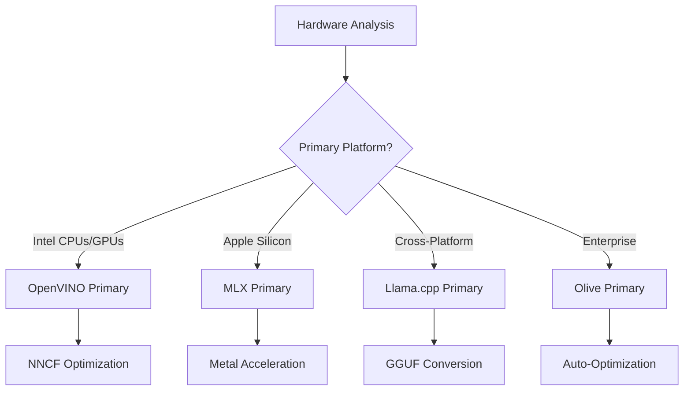
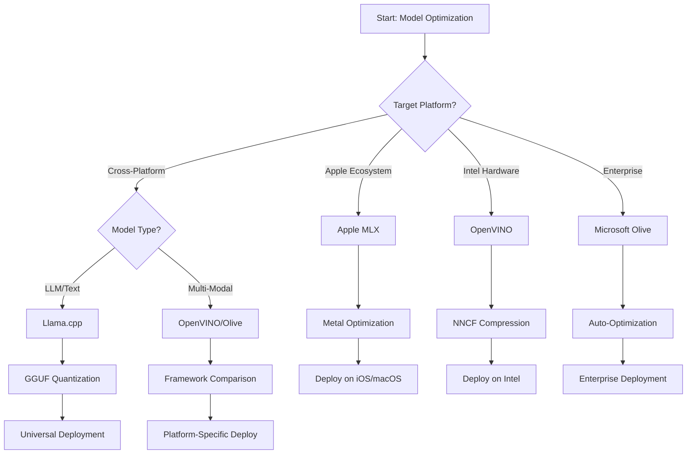
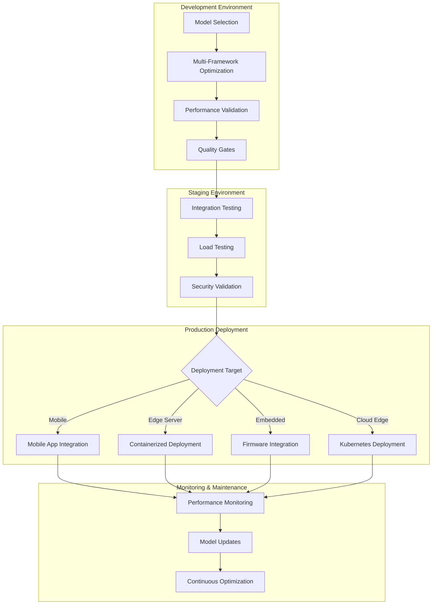

<!--
CO_OP_TRANSLATOR_METADATA:
{
  "original_hash": "6719c4a7e44b948230ac5f5cab3699bd",
  "translation_date": "2025-09-18T07:56:16+00:00",
  "source_file": "Module04/06.workflow-synthesis.md",
  "language_code": "sv"
}
-->
# Avsnitt 6: Sammanställning av arbetsflöde för Edge AI-utveckling

## Innehållsförteckning
1. [Introduktion](../../../Module04)
2. [Lärandemål](../../../Module04)
3. [Översikt över enhetligt arbetsflöde](../../../Module04)
4. [Matris för ramverksval](../../../Module04)
5. [Sammanställning av bästa praxis](../../../Module04)
6. [Guide för implementeringsstrategi](../../../Module04)
7. [Arbetsflöde för prestandaoptimering](../../../Module04)
8. [Checklista för produktionsberedskap](../../../Module04)
9. [Felsökning och övervakning](../../../Module04)
10. [Framtidssäkring av din Edge AI-pipeline](../../../Module04)

## Introduktion

Utveckling av Edge AI kräver en avancerad förståelse för flera optimeringsramverk, implementeringsstrategier och hårdvaruöverväganden. Denna omfattande sammanställning förenar kunskapen från Llama.cpp, Microsoft Olive, OpenVINO och Apple MLX för att skapa ett enhetligt arbetsflöde som maximerar effektivitet, bibehåller kvalitet och säkerställer framgångsrik produktionsimplementering.

Under kursens gång har vi utforskat individuella optimeringsramverk, var och en med sina unika styrkor och specialiserade användningsområden. Men verkliga Edge AI-projekt kräver ofta en kombination av tekniker från flera ramverk eller strategiska beslut om vilken metod som ger bäst resultat för specifika begränsningar och krav.

Detta avsnitt sammanställer den samlade kunskapen från alla ramverk till handlingsbara arbetsflöden, beslutsstöd och bästa praxis som gör det möjligt att bygga produktionsklara Edge AI-lösningar på ett effektivt och smidigt sätt. Oavsett om du optimerar för mobila enheter, inbyggda system eller edge-servrar, ger denna guide den strategiska ramen för att fatta välgrundade beslut under hela utvecklingscykeln.

## Lärandemål

I slutet av detta avsnitt kommer du att kunna:

### Strategiskt beslutsfattande
- **Utvärdera och välja** det optimala optimeringsramverket baserat på projektkrav, hårdvarubegränsningar och implementeringsscenarier
- **Designa omfattande arbetsflöden** som integrerar flera optimeringstekniker för maximal effektivitet
- **Bedöma avvägningar** mellan modellens noggrannhet, inferenshastighet, minnesanvändning och implementeringskomplexitet över olika ramverk

### Arbetsflödesintegration
- **Implementera enhetliga utvecklingspipelines** som utnyttjar styrkorna hos flera optimeringsramverk
- **Skapa reproducerbara arbetsflöden** för konsekvent modelloptimering och implementering i olika miljöer
- **Etablera kvalitetskontroller** och valideringsprocesser för att säkerställa att optimerade modeller uppfyller produktionskrav

### Prestandaoptimering
- **Tillämpa systematiska optimeringsstrategier** med kvantisering, beskärning och hårdvaruspecifika accelerationstekniker
- **Övervaka och benchmarka** modellprestanda över olika optimeringsnivåer och implementeringsmål
- **Optimera för specifika hårdvaruplattformar** inklusive CPU, GPU, NPU och specialiserade edge-acceleratorer

### Produktionsimplementering
- **Designa skalbara implementeringsarkitekturer** som rymmer flera modellformat och inferensmotorer
- **Implementera övervakning och observabilitet** för Edge AI-applikationer i produktionsmiljöer
- **Etablera underhållsarbetsflöden** för modelluppdateringar, prestandaövervakning och systemoptimering

### Plattformsexcellens
- **Implementera optimerade modeller** över olika hårdvaruplattformar samtidigt som konsekvent prestanda bibehålls
- **Hantera plattformsspecifika optimeringar** för Windows, macOS, Linux, mobila och inbyggda system
- **Skapa abstraktionslager** som möjliggör sömlös implementering över olika edge-miljöer

## Översikt över enhetligt arbetsflöde

### Fas 1: Kravanalys och ramverksval

Grunden för framgångsrik Edge AI-implementering börjar med en noggrann kravanalys som informerar ramverksval och optimeringsstrategi.

#### 1.1 Hårdvarubedömning


**Viktiga överväganden:**
- **CPU-arkitektur**: x86, ARM, Apple Silicon-funktioner
- **Acceleratorer**: GPU, NPU, VPU, specialiserade AI-chip
- **Minnesbegränsningar**: RAM-begränsningar, lagringskapacitet
- **Energibudget**: Batteritid, termiska begränsningar
- **Anslutning**: Offlinekrav, bandbreddsbegränsningar

#### 1.2 Matris för applikationskrav

| Krav | Llama.cpp | Microsoft Olive | OpenVINO | Apple MLX |
|------|-----------|-----------------|----------|-----------|
| Plattformskompatibilitet | ✅ Utmärkt | ⚡ Bra | ⚡ Bra | ❌ Endast Apple |
| Företagsintegration | ⚡ Grundläggande | ✅ Utmärkt | ✅ Utmärkt | ⚡ Begränsad |
| Mobil implementering | ✅ Utmärkt | ⚡ Bra | ⚡ Bra | ✅ iOS Utmärkt |
| Realtidsinferens | ✅ Utmärkt | ✅ Utmärkt | ✅ Utmärkt | ✅ Utmärkt |
| Modellmångfald | ✅ Fokus på LLM | ✅ Alla modeller | ✅ Alla modeller | ✅ Fokus på LLM |
| Enkel användning | ✅ Enkel | ✅ Automatiserad | ⚡ Måttlig | ✅ Enkel |

### Fas 2: Modellförberedelse och optimering

#### 2.1 Universell pipeline för modellbedömning

```python
# Universal Model Assessment Framework
class EdgeAIModelAssessment:
    def __init__(self, model_path, target_hardware):
        self.model_path = model_path
        self.target_hardware = target_hardware
        self.optimization_frameworks = []
        
    def assess_model_characteristics(self):
        """Analyze model size, architecture, and complexity"""
        return {
            'model_size': self.get_model_size(),
            'parameter_count': self.get_parameter_count(),
            'architecture_type': self.detect_architecture(),
            'quantization_compatibility': self.check_quantization_support()
        }
    
    def recommend_optimization_strategy(self):
        """Recommend optimal frameworks and techniques"""
        characteristics = self.assess_model_characteristics()
        
        if self.target_hardware.startswith('apple'):
            return self.mlx_optimization_strategy(characteristics)
        elif self.target_hardware.startswith('intel'):
            return self.openvino_optimization_strategy(characteristics)
        elif characteristics['model_size'] > 7_000_000_000:  # 7B+ parameters
            return self.enterprise_optimization_strategy(characteristics)
        else:
            return self.lightweight_optimization_strategy(characteristics)
```

#### 2.2 Multi-ramverk optimeringspipeline

**Sekventiell optimeringsmetod:**
1. **Initial konvertering**: Konvertera till mellanformat (ONNX när möjligt)
2. **Ramverksspecifik optimering**: Tillämpa specialiserade tekniker
3. **Korsvalidering**: Verifiera prestanda över målplattformar
4. **Slutlig paketering**: Förbered för implementering

```bash
# Multi-Framework Optimization Script
#!/bin/bash

MODEL_NAME="phi-3-mini"
BASE_MODEL="microsoft/Phi-3-mini-4k-instruct"

# Phase 1: ONNX Conversion (Universal)
python convert_to_onnx.py --model $BASE_MODEL --output models/onnx/

# Phase 2: Platform-Specific Optimization
if [[ "$TARGET_PLATFORM" == "intel" ]]; then
    # OpenVINO Optimization
    python optimize_openvino.py --input models/onnx/ --output models/openvino/
elif [[ "$TARGET_PLATFORM" == "apple" ]]; then
    # MLX Optimization
    python optimize_mlx.py --input $BASE_MODEL --output models/mlx/
elif [[ "$TARGET_PLATFORM" == "cross" ]]; then
    # Llama.cpp Optimization
    python convert_to_gguf.py --input models/onnx/ --output models/gguf/
fi

# Phase 3: Validation
python validate_optimization.py --original $BASE_MODEL --optimized models/$TARGET_PLATFORM/
```

### Fas 3: Prestandavalidering och benchmarking

#### 3.1 Omfattande benchmarkingramverk

```python
class EdgeAIBenchmark:
    def __init__(self, optimized_models):
        self.models = optimized_models
        self.metrics = {
            'inference_time': [],
            'memory_usage': [],
            'accuracy_score': [],
            'throughput': [],
            'energy_consumption': []
        }
    
    def run_comprehensive_benchmark(self):
        """Execute standardized benchmarks across all optimized models"""
        test_inputs = self.generate_test_inputs()
        
        for model_framework, model_path in self.models.items():
            print(f"Benchmarking {model_framework}...")
            
            # Latency Testing
            latency = self.measure_inference_latency(model_path, test_inputs)
            
            # Memory Profiling
            memory = self.profile_memory_usage(model_path)
            
            # Accuracy Validation
            accuracy = self.validate_model_accuracy(model_path, test_inputs)
            
            # Throughput Analysis
            throughput = self.measure_throughput(model_path)
            
            self.record_metrics(model_framework, latency, memory, accuracy, throughput)
    
    def generate_optimization_report(self):
        """Create comprehensive comparison report"""
        report = {
            'recommendations': self.analyze_performance_trade_offs(),
            'deployment_guidance': self.generate_deployment_recommendations(),
            'monitoring_requirements': self.define_monitoring_metrics()
        }
        return report
```

## Matris för ramverksval

### Beslutsträd för ramverksval



### Omfattande urvalskriterier

#### 1. Primär användningsfallanpassning

**Stora språkmodeller (LLMs):**
- **Llama.cpp**: Bäst för CPU-fokuserad, plattformsoberoende implementering
- **Apple MLX**: Optimalt för Apple Silicon med enhetligt minne
- **OpenVINO**: Utmärkt för Intel-hårdvara med NNCF-optimering
- **Microsoft Olive**: Idealiskt för företagsarbetsflöden med automatisering

**Multimodala modeller:**
- **OpenVINO**: Omfattande stöd för vision, ljud och text
- **Microsoft Olive**: Företagsklassad optimering för komplexa pipelines
- **Llama.cpp**: Begränsad till textbaserade modeller
- **Apple MLX**: Växande stöd för multimodala applikationer

#### 2. Hårdvaruplattformsanalys

| Plattform | Primärt ramverk | Sekundärt alternativ | Specialfunktioner |
|-----------|-----------------|----------------------|-------------------|
| Intel CPU/GPU | OpenVINO | Microsoft Olive | NNCF-kompression, Intel-optimering |
| NVIDIA GPU | Microsoft Olive | OpenVINO | CUDA-acceleration, företagsfunktioner |
| Apple Silicon | Apple MLX | Llama.cpp | Metal-shaders, enhetligt minne |
| ARM Mobile | Llama.cpp | OpenVINO | Plattformskompatibilitet, minimala beroenden |
| Edge TPU | OpenVINO | Microsoft Olive | Stöd för specialiserade acceleratorer |
| Inbyggd ARM | Llama.cpp | OpenVINO | Minimal footprint, effektiv inferens |

#### 3. Utvecklingsarbetsflödespreferenser

**Snabb prototypframtagning:**
1. **Llama.cpp**: Snabbast att sätta upp, omedelbara resultat
2. **Apple MLX**: Enkel Python-API, snabb iteration
3. **Microsoft Olive**: Automatiserad optimering, minimal konfiguration
4. **OpenVINO**: Mer komplex uppsättning, omfattande funktioner

**Företagsproduktion:**
1. **Microsoft Olive**: Företagsfunktioner, Azure-integration
2. **OpenVINO**: Intel-ekosystem, omfattande verktyg
3. **Apple MLX**: Apple-specifika företagsapplikationer
4. **Llama.cpp**: Enkel implementering, begränsade företagsfunktioner

## Sammanställning av bästa praxis

### Universella optimeringsprinciper

#### 1. Progressiv optimeringsstrategi

```python
class ProgressiveOptimization:
    def __init__(self, base_model):
        self.base_model = base_model
        self.optimization_stages = [
            'baseline_measurement',
            'format_conversion',
            'quantization_optimization',
            'hardware_acceleration',
            'production_validation'
        ]
    
    def execute_progressive_optimization(self):
        """Apply optimization techniques incrementally"""
        
        # Stage 1: Baseline Measurement
        baseline_metrics = self.measure_baseline_performance()
        
        # Stage 2: Format Conversion
        converted_model = self.convert_to_optimal_format()
        conversion_metrics = self.measure_performance(converted_model)
        
        # Stage 3: Quantization
        quantized_model = self.apply_quantization(converted_model)
        quantization_metrics = self.measure_performance(quantized_model)
        
        # Stage 4: Hardware Acceleration
        accelerated_model = self.enable_hardware_acceleration(quantized_model)
        acceleration_metrics = self.measure_performance(accelerated_model)
        
        # Stage 5: Validation
        production_ready = self.validate_for_production(accelerated_model)
        
        return self.compile_optimization_report(
            baseline_metrics, conversion_metrics, 
            quantization_metrics, acceleration_metrics
        )
```

#### 2. Implementering av kvalitetskontroller

**Noggrannhetskontroller:**
- Bibehåll >95% av modellens ursprungliga noggrannhet
- Validera mot representativa testdatamängder
- Genomför A/B-testning för produktionsvalidering

**Prestandaförbättringskontroller:**
- Uppnå minst 2x hastighetsförbättring
- Minska minnesanvändning med minst 50%
- Validera konsekvens i inferenstid

**Produktionsberedskapskontroller:**
- Genomför stresstestning under belastning
- Demonstrera stabil prestanda över tid
- Validera säkerhets- och integritetskrav

### Integration av ramverksspecifik bästa praxis

#### 1. Kvantiseringsstrategi

```python
# Unified Quantization Approach
class UnifiedQuantizationStrategy:
    def __init__(self, model, target_platform):
        self.model = model
        self.platform = target_platform
        
    def select_optimal_quantization(self):
        """Choose best quantization based on platform and requirements"""
        
        if self.platform == 'apple_silicon':
            return self.mlx_quantization_strategy()
        elif self.platform == 'intel_hardware':
            return self.openvino_quantization_strategy()
        elif self.platform == 'cross_platform':
            return self.llamacpp_quantization_strategy()
        else:
            return self.olive_quantization_strategy()
    
    def mlx_quantization_strategy(self):
        """Apple MLX-specific quantization"""
        return {
            'method': 'mlx_quantize',
            'precision': 'int4',
            'group_size': 64,
            'optimization_target': 'unified_memory'
        }
    
    def openvino_quantization_strategy(self):
        """OpenVINO NNCF quantization"""
        return {
            'method': 'nncf_quantize',
            'precision': 'int8',
            'calibration_method': 'post_training',
            'optimization_target': 'intel_hardware'
        }
```

#### 2. Optimering för hårdvaruacceleration

**CPU-optimering:**
- **SIMD-instruktioner**: Utnyttja optimerade kärnor över ramverk
- **Minnesbandbredd**: Optimera datalayout för cacheeffektivitet
- **Trådning**: Balansera parallellism med resursbegränsningar

**GPU-acceleration bästa praxis:**
- **Batchbearbetning**: Maximera genomströmning med lämpliga batchstorlekar
- **Minneshantering**: Optimera GPU-minnesallokering och överföringar
- **Precision**: Använd FP16 när det stöds för bättre prestanda

**NPU/specialiserad acceleratoroptimering:**
- **Modellarkitektur**: Säkerställ kompatibilitet med acceleratorfunktioner
- **Dataflöde**: Optimera in-/utgångspipelines för acceleratorns effektivitet
- **Fallback-strategier**: Implementera CPU-fallback för ej stödda operationer

## Guide för implementeringsstrategi

### Universell implementeringsarkitektur



### Plattformsspecifika implementeringsmönster

#### 1. Mobil implementeringsstrategi

```yaml
# Mobile Deployment Configuration
mobile_deployment:
  ios:
    framework: apple_mlx
    optimization:
      quantization: int4
      memory_mapping: true
      background_execution: limited
    packaging:
      format: mlx
      bundle_size: <50MB
      
  android:
    framework: llama_cpp
    optimization:
      quantization: q4_k_m
      threading: android_optimized
      memory_management: conservative
    packaging:
      format: gguf
      apk_size: <100MB
      
  cross_platform:
    framework: onnx_runtime
    optimization:
      quantization: int8
      execution_provider: cpu
    packaging:
      format: onnx
      shared_libraries: minimal
```

#### 2. Edge-server implementering

```yaml
# Edge Server Deployment Configuration
edge_server:
  intel_based:
    framework: openvino
    optimization:
      quantization: int8
      acceleration: cpu_gpu_auto
      batch_processing: dynamic
    deployment:
      container: openvino_runtime
      orchestration: kubernetes
      scaling: horizontal
      
  nvidia_based:
    framework: microsoft_olive
    optimization:
      quantization: int4
      acceleration: cuda
      tensor_parallelism: true
    deployment:
      container: nvidia_triton
      orchestration: kubernetes
      scaling: gpu_aware
```

### Containerisering bästa praxis

```dockerfile
# Multi-Framework Edge AI Container
FROM ubuntu:22.04 as base

# Install common dependencies
RUN apt-get update && apt-get install -y \
    python3 \
    python3-pip \
    build-essential \
    cmake \
    && rm -rf /var/lib/apt/lists/*

# Framework-specific stages
FROM base as openvino
RUN pip install openvino nncf optimum[intel]

FROM base as llamacpp
RUN git clone https://github.com/ggerganov/llama.cpp.git \
    && cd llama.cpp && make LLAMA_OPENBLAS=1

FROM base as olive
RUN pip install olive-ai[auto-opt] onnxruntime-genai

# Production stage with selected framework
FROM openvino as production
COPY models/ /app/models/
COPY src/ /app/src/
WORKDIR /app

EXPOSE 8080
CMD ["python3", "src/inference_server.py"]
```

## Arbetsflöde för prestandaoptimering

### Systematisk prestandajustering

#### 1. Pipeline för prestandaprofilering

```python
class EdgeAIPerformanceProfiler:
    def __init__(self, model_path, framework):
        self.model_path = model_path
        self.framework = framework
        self.profiling_results = {}
    
    def comprehensive_profiling(self):
        """Execute comprehensive performance analysis"""
        
        # CPU Profiling
        cpu_profile = self.profile_cpu_usage()
        
        # Memory Profiling
        memory_profile = self.profile_memory_usage()
        
        # Inference Latency
        latency_profile = self.profile_inference_latency()
        
        # Throughput Analysis
        throughput_profile = self.profile_throughput()
        
        # Energy Consumption (where available)
        energy_profile = self.profile_energy_consumption()
        
        return self.compile_performance_report(
            cpu_profile, memory_profile, latency_profile,
            throughput_profile, energy_profile
        )
    
    def identify_bottlenecks(self):
        """Automatically identify performance bottlenecks"""
        bottlenecks = []
        
        if self.profiling_results['cpu_utilization'] > 80:
            bottlenecks.append('cpu_bound')
        
        if self.profiling_results['memory_usage'] > 90:
            bottlenecks.append('memory_bound')
        
        if self.profiling_results['inference_variance'] > 20:
            bottlenecks.append('inconsistent_performance')
        
        return self.generate_optimization_recommendations(bottlenecks)
```

#### 2. Automatiserad optimeringspipeline

```python
class AutomatedOptimizationPipeline:
    def __init__(self, base_model, target_constraints):
        self.base_model = base_model
        self.constraints = target_constraints
        self.optimization_history = []
    
    def execute_optimization_search(self):
        """Systematically search optimization space"""
        
        optimization_candidates = [
            {'quantization': 'int8', 'pruning': 0.1},
            {'quantization': 'int4', 'pruning': 0.2},
            {'quantization': 'int8', 'acceleration': 'gpu'},
            {'quantization': 'int4', 'acceleration': 'npu'}
        ]
        
        best_configuration = None
        best_score = 0
        
        for config in optimization_candidates:
            optimized_model = self.apply_optimization(config)
            score = self.evaluate_optimization(optimized_model)
            
            if score > best_score and self.meets_constraints(optimized_model):
                best_score = score
                best_configuration = config
            
            self.optimization_history.append({
                'config': config,
                'score': score,
                'model': optimized_model
            })
        
        return best_configuration, self.optimization_history
```

### Multi-objektiv optimering

#### 1. Pareto-optimering för Edge AI

```python
class ParetoOptimization:
    def __init__(self, objectives=['speed', 'accuracy', 'memory']):
        self.objectives = objectives
        self.pareto_frontier = []
    
    def find_pareto_optimal_solutions(self, optimization_results):
        """Identify Pareto-optimal configurations"""
        
        for result in optimization_results:
            is_dominated = False
            
            for frontier_point in self.pareto_frontier:
                if self.dominates(frontier_point, result):
                    is_dominated = True
                    break
            
            if not is_dominated:
                # Remove dominated points from frontier
                self.pareto_frontier = [
                    point for point in self.pareto_frontier 
                    if not self.dominates(result, point)
                ]
                
                self.pareto_frontier.append(result)
        
        return self.pareto_frontier
    
    def recommend_configuration(self, user_preferences):
        """Recommend configuration based on user preferences"""
        
        weighted_scores = []
        for config in self.pareto_frontier:
            score = sum(
                user_preferences[obj] * config['metrics'][obj] 
                for obj in self.objectives
            )
            weighted_scores.append((score, config))
        
        return max(weighted_scores, key=lambda x: x[0])[1]
```

## Checklista för produktionsberedskap

### Omfattande produktionsvalidering

#### 1. Kvalitetssäkring för modeller

```python
class ProductionReadinessValidator:
    def __init__(self, optimized_model, production_requirements):
        self.model = optimized_model
        self.requirements = production_requirements
        self.validation_results = {}
    
    def validate_model_quality(self):
        """Comprehensive model quality validation"""
        
        # Accuracy Validation
        accuracy_result = self.validate_accuracy()
        
        # Performance Validation
        performance_result = self.validate_performance()
        
        # Robustness Testing
        robustness_result = self.validate_robustness()
        
        # Security Assessment
        security_result = self.validate_security()
        
        # Compliance Verification
        compliance_result = self.validate_compliance()
        
        return self.compile_validation_report(
            accuracy_result, performance_result, robustness_result,
            security_result, compliance_result
        )
    
    def generate_certification_report(self):
        """Generate production certification report"""
        return {
            'model_signature': self.generate_model_signature(),
            'validation_timestamp': datetime.now(),
            'validation_results': self.validation_results,
            'deployment_approval': self.check_deployment_approval(),
            'monitoring_requirements': self.define_monitoring_requirements()
        }
```

#### 2. Checklista för produktionsimplementering

**Validering före implementering:**
- [ ] Modellens noggrannhet uppfyller minimikrav (>95% av baslinjen)
- [ ] Prestandamål uppnådda (latens, genomströmning, minne)
- [ ] Säkerhetsrisker bedömda och åtgärdade
- [ ] Stresstestning genomförd under förväntad belastning
- [ ] Felhanteringsscenarier testade och återställningsprocedurer validerade
- [ ] Övervaknings- och varningssystem konfigurerade
- [ ] Återställningsprocedurer testade och dokumenterade

**Implementeringsprocess:**
- [ ] Blå-grön implementeringsstrategi implementerad
- [ ] Gradvis trafikökning konfigurerad
- [ ] Realtidsövervakningspaneler aktiva
- [ ] Prestandabaslinjer etablerade
- [ ] Felratetrösklar definierade
- [ ] Automatiserade återställningstriggers konfigurerade

**Övervakning efter implementering:**
- [ ] Modelldriftövervakning aktiv
- [ ] Prestandaförsämringsvarningar konfigurerade
- [ ] Resursanvändningsövervakning aktiverad
- [ ] Användarupplevelsemått spårade
- [ ] Modellversionering och härkomst upprätthållna
- [ ] Regelbundna modellprestandagranskningar schemalagda

### Kontinuerlig integration/kontinuerlig implementering (CI/CD)

```yaml
# Edge AI CI/CD Pipeline Configuration
edge_ai_pipeline:
  stages:
    - model_validation
    - optimization
    - testing
    - staging_deployment
    - production_deployment
    - monitoring
  
  model_validation:
    accuracy_threshold: 0.95
    performance_baseline: required
    security_scan: enabled
    
  optimization:
    frameworks:
      - llama_cpp
      - openvino
      - microsoft_olive
    validation:
      cross_validation: enabled
      performance_comparison: required
      
  testing:
    unit_tests: comprehensive
    integration_tests: full_pipeline
    load_tests: production_scale
    security_tests: comprehensive
    
  deployment:
    strategy: blue_green
    traffic_ramping: gradual
    rollback: automatic
    monitoring: real_time
```

## Felsökning och övervakning

### Universellt felsökningsramverk

#### 1. Vanliga problem och lösningar

**Prestandaproblem:**
```python
class PerformanceTroubleshooter:
    def __init__(self, model_metrics):
        self.metrics = model_metrics
        
    def diagnose_performance_issues(self):
        """Systematic performance issue diagnosis"""
        
        issues = []
        
        # High latency diagnosis
        if self.metrics['avg_latency'] > self.metrics['target_latency']:
            issues.append(self.diagnose_latency_issues())
        
        # Memory usage diagnosis
        if self.metrics['memory_usage'] > self.metrics['memory_limit']:
            issues.append(self.diagnose_memory_issues())
        
        # Throughput diagnosis
        if self.metrics['throughput'] < self.metrics['target_throughput']:
            issues.append(self.diagnose_throughput_issues())
        
        return self.generate_resolution_plan(issues)
    
    def diagnose_latency_issues(self):
        """Specific latency troubleshooting"""
        potential_causes = []
        
        if self.metrics['cpu_utilization'] > 80:
            potential_causes.append('cpu_bottleneck')
        
        if self.metrics['memory_bandwidth'] > 90:
            potential_causes.append('memory_bandwidth_limit')
        
        if self.metrics['model_size'] > self.metrics['optimal_size']:
            potential_causes.append('model_too_large')
        
        return {
            'issue': 'high_latency',
            'causes': potential_causes,
            'solutions': self.generate_latency_solutions(potential_causes)
        }
```

**Ramverksspecifik felsökning:**

| Problem | Llama.cpp | Microsoft Olive | OpenVINO | Apple MLX |
|---------|-----------|-----------------|----------|-----------|
| Minnesproblem | Minska kontextlängd | Sänk batchstorlek | Aktivera caching | Använd minnesmappning |
| Långsam inferens | Aktivera SIMD | Kontrollera kvantisering | Optimera trådning | Aktivera Metal |
| Noggrannhetsförlust | Högre kvantisering | Träna om med QAT | Öka kalibrering | Finjustera efter kvantisering |
| Kompatibilitet | Kontrollera modellformat | Verifiera ramverksversion | Uppdatera drivrutiner | Kontrollera macOS-version |

#### 2. Produktionsövervakningsstrategi

```python
class EdgeAIMonitoring:
    def __init__(self, deployment_config):
        self.config = deployment_config
        self.metrics_collectors = []
        self.alerting_rules = []
    
    def setup_comprehensive_monitoring(self):
        """Configure comprehensive monitoring for Edge AI deployment"""
        
        # Model Performance Monitoring
        self.setup_model_performance_monitoring()
        
        # Infrastructure Monitoring
        self.setup_infrastructure_monitoring()
        
        # Business Metrics Monitoring
        self.setup_business_metrics_monitoring()
        
        # Security Monitoring
        self.setup_security_monitoring()
    
    def setup_model_performance_monitoring(self):
        """Model-specific performance monitoring"""
        metrics = [
            'inference_latency_p50',
            'inference_latency_p95',
            'inference_latency_p99',
            'model_accuracy_drift',
            'prediction_confidence_distribution',
            'error_rate',
            'throughput_requests_per_second'
        ]
        
        for metric in metrics:
            self.add_metric_collector(metric)
            self.add_alerting_rule(metric)
    
    def detect_model_drift(self):
        """Automated model drift detection"""
        drift_indicators = [
            self.statistical_drift_detection(),
            self.performance_drift_detection(),
            self.data_distribution_shift_detection()
        ]
        
        return self.aggregate_drift_signals(drift_indicators)
```

### Automatiserad problemlösning

```python
class AutomatedIssueResolution:
    def __init__(self, monitoring_system):
        self.monitoring = monitoring_system
        self.resolution_strategies = {}
    
    def handle_performance_degradation(self, alert):
        """Automated performance issue resolution"""
        
        if alert['type'] == 'high_latency':
            return self.resolve_latency_issue(alert)
        elif alert['type'] == 'high_memory_usage':
            return self.resolve_memory_issue(alert)
        elif alert['type'] == 'accuracy_drift':
            return self.resolve_accuracy_issue(alert)
        
    def resolve_latency_issue(self, alert):
        """Automated latency issue resolution"""
        resolution_steps = [
            'increase_cpu_allocation',
            'enable_model_caching',
            'reduce_batch_size',
            'switch_to_quantized_model'
        ]
        
        for step in resolution_steps:
            if self.apply_resolution_step(step):
                return f"Resolved latency issue with: {step}"
        
        return "Escalating to human operator"
```

## Framtidssäkring av din Edge AI-pipeline

### Integration av framväxande teknologier

#### 1. Stöd för nästa generations hårdvara

```python
class FutureHardwareIntegration:
    def __init__(self):
        self.supported_accelerators = [
            'npu_next_gen',
            'quantum_processors',
            'neuromorphic_chips',
            'optical_processors'
        ]
    
    def design_adaptive_pipeline(self):
        """Create hardware-agnostic optimization pipeline"""
        
        pipeline = {
            'model_preparation': self.universal_model_preparation(),
            'hardware_detection': self.dynamic_hardware_detection(),
            'optimization_selection': self.adaptive_optimization_selection(),
            'performance_validation': self.hardware_agnostic_validation()
        }
        
        return pipeline
    
    def adaptive_optimization_selection(self):
        """Dynamically select optimization based on available hardware"""
        
        def optimize_for_hardware(model, available_hardware):
            if 'npu' in available_hardware:
                return self.npu_optimization(model)
            elif 'quantum' in available_hardware:
                return self.quantum_optimization(model)
            elif 'neuromorphic' in available_hardware:
                return self.neuromorphic_optimization(model)
            else:
                return self.fallback_optimization(model)
        
        return optimize_for_hardware
```

#### 2. Modellarkitekturens utveckling

**Stöd för framväxande arkitekturer:**
- **Mixture of Experts (MoE)**: Glesa modellarkitekturer för effektivitet
- **Retrieval-Augmented Generation**: Hybridmodell + kunskapsbaserade system
- **Multimodala modeller**: Integration av vision + språk + ljud
- **Federated Learning**: Distribuerad träning och optimering

```python
class NextGenModelSupport:
    def __init__(self):
        self.architecture_handlers = {
            'moe': self.handle_mixture_of_experts,
            'rag': self.handle_retrieval_augmented,
            'multimodal': self.handle_multimodal,
            'federated': self.handle_federated_learning
        }
    
    def handle_mixture_of_experts(self, model):
        """Optimize Mixture of Experts models for edge deployment"""
        optimization_strategy = {
            'expert_pruning': True,
            'routing_optimization': True,
            'expert_quantization': 'per_expert',
            'load_balancing': 'dynamic'
        }
        return self.apply_moe_optimization(model, optimization_strategy)
```

### Kontinuerligt lärande och anpassning

#### 1. Integration av online-lärande

```python
class EdgeOnlineLearning:
    def __init__(self, base_model, learning_rate=0.001):
        self.base_model = base_model
        self.learning_rate = learning_rate
        self.adaptation_buffer = []
    
    def continuous_adaptation(self, new_data, feedback):
        """Continuously adapt model based on edge data"""
        
        # Privacy-preserving local adaptation
        local_updates = self.compute_local_gradients(new_data, feedback)
        
        # Apply updates with constraints
        adapted_model = self.apply_constrained_updates(
            self.base_model, local_updates
        )
        
        # Validate adaptation quality
        if self.validate_adaptation(adapted_model):
            self.base_model = adapted_model
            return True
        
        return False
    
    def federated_learning_participation(self):
        """Participate in federated learning while preserving privacy"""
        
        # Compute local model updates
        local_updates = self.compute_private_updates()
        
        # Differential privacy protection
        private_updates = self.apply_differential_privacy(local_updates)
        
        # Share with federated learning coordinator
        return self.share_updates(private_updates)
```

#### 2. Hållbarhet och grön AI

```python
class GreenEdgeAI:
    def __init__(self, sustainability_targets):
        self.targets = sustainability_targets
        self.energy_monitor = EnergyMonitor()
    
    def optimize_for_sustainability(self, model):
        """Optimize model for minimal environmental impact"""
        
        optimization_objectives = [
            'minimize_energy_consumption',
            'maximize_hardware_utilization',
            'reduce_model_training_cost',
            'extend_device_lifetime'
        ]
        
        return self.multi_objective_green_optimization(
            model, optimization_objectives
        )
    
    def carbon_aware_deployment(self):
        """Deploy models considering carbon footprint"""
        
        deployment_strategy = {
            'prefer_renewable_energy_regions': True,
            'optimize_for_energy_efficiency': True,
            'minimize_data_transfer': True,
            'lifecycle_carbon_accounting': True
        }
        
        return deployment_strategy
```

## Slutsats

Denna omfattande arbetsflödessammanställning representerar kulmen av kunskap om Edge AI-optimering och förenar bästa praxis från alla större optimeringsramverk till en enhetlig, produktionsklar metod. Genom att följa dessa riktlinjer kan du:

**Uppnå optimal prestanda**: Genom systematiskt ramverksval, progressiv optimering och omfattande validering, säkerställa att dina Edge AI-applikationer levererar maximal effektivitet.

**Säkerställa produktionsberedskap**: Med noggrann testning, övervakning och kvalitetskontroller som garanterar pålitlig implementering och drift i verkliga miljöer.

**Bibehålla långsiktig framgång**: Genom kontinuerlig övervakning, automatiserad problemlösning och anpassningsstrategier som håller dina Edge AI-lösningar presterande och relevanta.

**Framtidssäkra din investering**: Genom att designa flexibla, hårdvaruoberoende pipelines som kan utvecklas med framväxande teknologier och krav.

Edge AI-landskapet fortsätter att utvecklas snabbt, med nya hårdvaruplattformar, optimeringstekniker och implementeringsstrategier som ständigt dyker upp. Denna sammanställning ger grunden för att navigera i denna komplexitet samtidigt som du bygger robusta, effektiva och underhållbara Edge AI-lösningar som levererar verkligt värde i produktionsmiljöer.
Kom ihåg att den bästa optimeringsstrategin är den som uppfyller dina specifika krav samtidigt som den behåller flexibiliteten att anpassa sig när dessa krav förändras. Använd denna guide som en ram för att fatta välgrundade beslut, men validera alltid dina val genom empiriska tester och erfarenheter från verklig implementering.

## ➡️ Vad händer härnäst

Fortsätt din Edge AI-resa genom att utforska [Modul 5: SLMOps och produktionsimplementering](../Module05/README.md) för att lära dig om de operativa aspekterna av livscykelhantering för Small Language Models.

---

**Ansvarsfriskrivning**:  
Detta dokument har översatts med hjälp av AI-översättningstjänsten [Co-op Translator](https://github.com/Azure/co-op-translator). Även om vi strävar efter noggrannhet, bör det noteras att automatiserade översättningar kan innehålla fel eller brister. Det ursprungliga dokumentet på dess originalspråk bör betraktas som den auktoritativa källan. För kritisk information rekommenderas professionell mänsklig översättning. Vi ansvarar inte för eventuella missförstånd eller feltolkningar som uppstår vid användning av denna översättning.