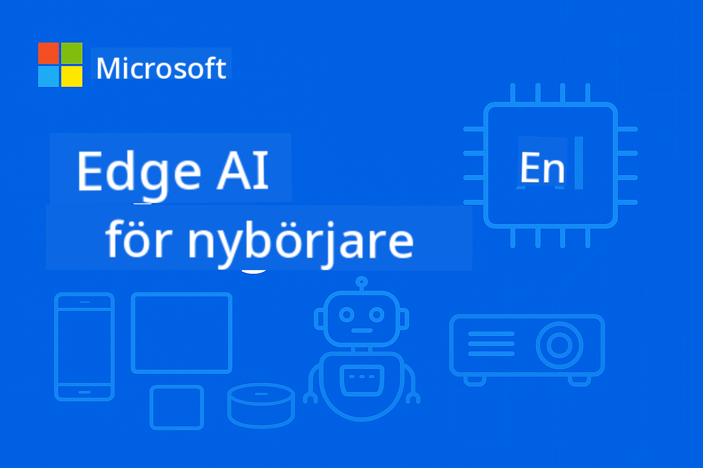

<!--
CO_OP_TRANSLATOR_METADATA:
{
  "original_hash": "8bcf70fe61c9007c880f9753cc9c3e01",
  "translation_date": "2025-10-09T12:44:41+00:00",
  "source_file": "README.md",
  "language_code": "sv"
}
-->
# EdgeAI för Nybörjare



[](https://GitHub.com/microsoft/edgeai-for-beginners/graphs/contributors)  
[](https://GitHub.com/microsoft/edgeai-for-beginners/issues)  
[](https://GitHub.com/microsoft/edgeai-for-beginners/pulls)  
[](http://makeapullrequest.com)  

[](https://GitHub.com/microsoft/edgeai-for-beginners/watchers)  
[](https://GitHub.com/microsoft/edgeai-for-beginners/fork)  
[](https://GitHub.com/microsoft/edgeai-for-beginners/stargazers)  

[](https://discord.com/invite/ByRwuEEgH4)

Följ dessa steg för att komma igång med dessa resurser:

1. **Forka Repositoriet**: Klicka [](https://GitHub.com/microsoft/edgeai-for-beginners/fork)  
2. **Klona Repositoriet**: `git clone https://github.com/microsoft/edgeai-for-beginners.git`  
3. [**Gå med i Azure AI Foundry Discord och träffa experter och andra utvecklare**](https://discord.com/invite/ByRwuEEgH4)  

### 🌐 Stöd för Flera Språk

#### Stöds via GitHub Action (Automatiserat & Alltid Uppdaterat)

[Arabiska](../ar/README.md) | [Bengali](../bn/README.md) | [Bulgariska](../bg/README.md) | [Burmesiska (Myanmar)](../my/README.md) | [Kinesiska (Förenklad)](../zh/README.md) | [Kinesiska (Traditionell, Hongkong)](../hk/README.md) | [Kinesiska (Traditionell, Macau)](../mo/README.md) | [Kinesiska (Traditionell, Taiwan)](../tw/README.md) | [Kroatiska](../hr/README.md) | [Tjeckiska](../cs/README.md) | [Danska](../da/README.md) | [Holländska](../nl/README.md) | [Finska](../fi/README.md) | [Franska](../fr/README.md) | [Tyska](../de/README.md) | [Grekiska](../el/README.md) | [Hebreiska](../he/README.md) | [Hindi](../hi/README.md) | [Ungerska](../hu/README.md) | [Indonesiska](../id/README.md) | [Italienska](../it/README.md) | [Japanska](../ja/README.md) | [Koreanska](../ko/README.md) | [Malajiska](../ms/README.md) | [Marathi](../mr/README.md) | [Nepalesiska](../ne/README.md) | [Norska](../no/README.md) | [Persiska (Farsi)](../fa/README.md) | [Polska](../pl/README.md) | [Portugisiska (Brasilien)](../br/README.md) | [Portugisiska (Portugal)](../pt/README.md) | [Punjabi (Gurmukhi)](../pa/README.md) | [Rumänska](../ro/README.md) | [Ryska](../ru/README.md) | [Serbiska (Kyrilliska)](../sr/README.md) | [Slovakiska](../sk/README.md) | [Slovenska](../sl/README.md) | [Spanska](../es/README.md) | [Swahili](../sw/README.md) | [Svenska](./README.md) | [Tagalog (Filippinska)](../tl/README.md) | [Thailändska](../th/README.md) | [Turkiska](../tr/README.md) | [Ukrainska](../uk/README.md) | [Urdu](../ur/README.md) | [Vietnamesiska](../vi/README.md)

**Om du vill ha ytterligare översättningar finns stödda språk listade [här](https://github.com/Azure/co-op-translator/blob/main/getting_started/supported-languages.md)**

## Introduktion

Välkommen till **EdgeAI för Nybörjare** – din omfattande resa in i den transformativa världen av Edge Artificial Intelligence. Denna kurs bygger en bro mellan kraftfulla AI-funktioner och praktisk, verklig implementering på edge-enheter, vilket ger dig möjlighet att utnyttja AI:s potential direkt där data genereras och beslut behöver fattas.

### Vad Du Kommer Att Behärska

Denna kurs tar dig från grundläggande koncept till produktionsklara implementationer och täcker:
- **Små Språkmodeller (SLMs)** optimerade för edge-distribution
- **Hårdvaruoptimering** över olika plattformar
- **Realtidsinferens** med integritetsskyddande funktioner
- **Produktionsdistribution** strategier för företagsapplikationer

### Varför EdgeAI Är Viktigt

Edge AI representerar ett paradigmskifte som adresserar moderna utmaningar:
- **Integritet & Säkerhet**: Bearbeta känslig data lokalt utan exponering för molnet
- **Realtidsprestanda**: Eliminera nätverksfördröjning för tidskritiska applikationer
- **Kostnadseffektivitet**: Minska bandbredd och molnberäkningskostnader
- **Robusta Operationer**: Upprätthåll funktionalitet under nätverksavbrott
- **Regulatorisk Efterlevnad**: Uppfyll krav på datasuveränitet

### Edge AI

Edge AI innebär att köra AI-algoritmer och språkmodeller lokalt på hårdvara, nära där data genereras, utan att förlita sig på molnresurser för inferens. Det minskar fördröjning, förbättrar integritet och möjliggör beslutsfattande i realtid.

### Grundprinciper:
- **Inferens på enheten**: AI-modeller körs på edge-enheter (telefoner, routrar, mikrokontroller, industriella PC)
- **Offlinekapacitet**: Fungerar utan konstant internetanslutning
- **Låg fördröjning**: Omedelbara svar som passar realtidssystem
- **Datasuveränitet**: Håller känslig data lokal, förbättrar säkerhet och efterlevnad

### Små Språkmodeller (SLMs)

SLMs som Phi-4, Mistral-7B och Gemma är optimerade versioner av större LLMs – tränade eller destillerade för:
- **Minskad minnesanvändning**: Effektiv användning av begränsat minne på edge-enheter
- **Lägre beräkningskrav**: Optimerade för CPU och edge GPU-prestanda
- **Snabbare starttider**: Snabb initialisering för responsiva applikationer

De låser upp kraftfulla NLP-funktioner samtidigt som de möter begränsningarna för:
- **Inbyggda system**: IoT-enheter och industriella kontroller
- **Mobila enheter**: Smartphones och surfplattor med offlinekapacitet
- **IoT-enheter**: Sensorer och smarta enheter med begränsade resurser
- **Edge-servrar**: Lokala bearbetningsenheter med begränsade GPU-resurser
- **Persondatorer**: Stationära och bärbara distributionsscenarier

## Kursmoduler & Navigering

| Modul | Ämne | Fokusområde | Nyckelinnehåll | Nivå | Varaktighet |
|-------|------|-------------|----------------|------|-------------|
| [📖 00 ](./introduction.md) | [Introduktion till EdgeAI](./introduction.md) | Grund & Kontext | Översikt över EdgeAI • Industriella Applikationer • Introduktion till SLM • Lärandemål | Nybörjare | 1-2 timmar |
| [📚 01](../../Module01) | [EdgeAI Grunder](./Module01/README.md) | Jämförelse mellan moln och edge AI | EdgeAI Grunder • Fallstudier från verkligheten • Implementeringsguide • Edge-distribution | Nybörjare | 3-4 timmar |
| [🧠 02](../../Module02) | [SLM Modellgrunder](./Module02/README.md) | Modellsfamiljer & arkitektur | Phi-familjen • Qwen-familjen • Gemma-familjen • BitNET • μModel • Phi-Silica | Nybörjare | 4-5 timmar |
| [🚀 03](../../Module03) | [SLM Distributionspraktik](./Module03/README.md) | Lokal & molndistribution | Avancerat lärande • Lokal miljö • Molndistribution | Mellanliggande | 4-5 timmar |
| [⚙️ 04](../../Module04) | [Verktyg för Modelloptimering](./Module04/README.md) | Plattformskorsande optimering | Introduktion • Llama.cpp • Microsoft Olive • OpenVINO • Apple MLX • Arbetsflödessyntes | Mellanliggande | 5-6 timmar |
| [🔧 05](../../Module05) | [SLMOps Produktion](./Module05/README.md) | Produktionsoperationer | Introduktion till SLMOps • Modell-destillation • Finjustering • Produktionsdistribution | Avancerad | 5-6 timmar |
| [🤖 06](../../Module06) | [AI-agenter & Funktionsanrop](./Module06/README.md) | Agentramverk & MCP | Introduktion till agenter • Funktionsanrop • Modellkontextprotokoll | Avancerad | 4-5 timmar |
| [💻 07](../../Module07) | [Plattformsimplementering](./Module07/README.md) | Plattformskorsande exempel | AI-verktyg • Foundry Local • Windows-utveckling | Avancerad | 3-4 timmar |
| [🏭 08](../../Module08) | [Foundry Local Toolkit](./Module08/README.md) | Produktionsklara exempel | Exempelapplikationer (se detaljer nedan) | Expert | 8-10 timmar |

### 🏭 **Modul 08: Exempelapplikationer**

- [01: REST Chat Snabbstart](./Module08/samples/01/README.md)  
- [02: OpenAI SDK Integration](./Module08/samples/02/README.md)  
- [03: Modellupptäckt & Benchmarking](./Module08/samples/03/README.md)  
- [04: Chainlit RAG Applikation](./Module08/samples/04/README.md)  
- [05: Multi-Agent Orkestrering](./Module08/samples/05/README.md)  
- [06: Modeller-som-Verktyg Router](./Module08/samples/06/README.md)  
- [07: Direkt API-klient](./Module08/samples/07/README.md)  
- [08: Windows 11 Chat App](./Module08/samples/08/README.md)  
- [09: Avancerat Multi-Agent System](./Module08/samples/09/README.md)  
- [10: Foundry Tools Framework](./Module08/samples/10/README.md)  

### 🎓 **Workshop: Praktisk Lärandebana**

Omfattande praktiska workshopmaterial med produktionsklara implementationer:

- **[Workshopguide](./Workshop/Readme.md)** - Kompletta lärandemål, resultat och resursnavigering  
- **Pythonexempel** (6 sessioner) - Uppdaterade med bästa praxis, felhantering och omfattande dokumentation  
- **Jupyter Notebooks** (8 interaktiva) - Steg-för-steg handledningar med benchmarking och prestandaövervakning  
- **Sessionsguider** - Detaljerade markdown-guider för varje workshopsession  
- **Valideringsverktyg** - Skript för att verifiera kodkvalitet och köra snabbtester  

**Vad Du Kommer Att Bygga:**
- Lokala AI-chattapplikationer med streamingstöd  
- RAG-pipelines med kvalitetsutvärdering (RAGAS)  
- Verktyg för benchmarking och jämförelse av flera modeller  
- Multi-agent orkestreringssystem  
- Intelligent modellrouting med uppgiftsbaserad selektion  

### 📊 **Sammanfattning av Lärandebanan**
- **Total Varaktighet**: 36-45 timmar  
- **Nybörjarbana**: Moduler 01-02 (7-9 timmar)  
- **Mellanliggande Bana**: Moduler 03-04 (9-11 timmar)  
- **Avancerad Bana**: Moduler 05-07 (12-15 timmar)  
- **Expertbana**: Modul 08 (8-10 timmar)  

## Vad Du Kommer Att Bygga

### 🎯 Kärnkompetenser
- **Edge AI Arkitektur**: Designa lokala AI-system med molnintegration  
- **Modelloptimering**: Kvantisera och komprimera modeller för edge-distribution (85% snabbare, 75% mindre storlek)  
- **Plattformskorsande Distribution**: Windows, mobila enheter, inbyggda system och hybridlösningar mellan moln och edge  
- **Produktionsoperationer**: Övervakning, skalning och underhåll av edge AI i produktion  

### 🏗️ Praktiska Projekt
- **Foundry Lokala Chattappar**: Windows 11 inbyggd applikation med modellväxling  
- **Multi-Agent System**: Koordinator med specialistagenter för komplexa arbetsflöden  
- **RAG Applikationer**: Lokal dokumentbearbetning med vektorsökning  
- **Modellroutrar**: Intelligent val mellan modeller baserat på uppgiftsanalys  
- **API-ramverk**: Produktionsklara klienter med streaming och hälsokontroll  
- **Plattformsoberoende verktyg**: Integrationsmönster för LangChain/Semantic Kernel  

### 🏢 Industriella tillämpningar  
**Tillverkning** • **Hälsovård** • **Autonoma fordon** • **Smarta städer** • **Mobilappar**  

## Snabbstart  

**Rekommenderad inlärningsväg** (totalt 20-30 timmar):  

0. **📖 Introduktion** ([Introduction.md](./introduction.md)): EdgeAI-grunder + industrikontext + inlärningsramverk  
1. **📚 Grundläggande** (Moduler 01-02): EdgeAI-koncept + SLM-modellfamiljer  
2. **⚙️ Optimering** (Moduler 03-04): Implementering + kvantiseringsramverk  
3. **🚀 Produktion** (Moduler 05-06): SLMOps + AI-agenter + funktionsanrop  
4. **💻 Implementering** (Moduler 07-08): Plattformsexempel + Foundry Local-verktyg  

Varje modul innehåller teori, praktiska övningar och produktionsklara kodexempel.  

## Karriärpåverkan  

**Tekniska roller**: EdgeAI-lösningsarkitekt • ML-ingenjör (Edge) • IoT AI-utvecklare • Mobil AI-utvecklare  

**Industrier**: Tillverkning 4.0 • Hälsoteknik • Autonoma system • FinTech • Konsumentelektronik  

**Portföljprojekt**: Multi-agent-system • Produktionsklara RAG-appar • Plattformsoberoende implementering • Prestandaoptimering  

## Repositoriets struktur  

```
edgeai-for-beginners/
├── 📖 introduction.md  # Foundation: EdgeAI Overview & Learning Framework
├── 📚 Module01-04/     # Fundamentals → SLMs → Deployment → Optimization  
├── 🔧 Module05-06/     # SLMOps → AI Agents → Function Calling
├── 💻 Module07/        # Platform Samples (VS Code, Windows, Jetson, Mobile)
├── 🏭 Module08/        # Foundry Local Toolkit + 10 Comprehensive Samples
│   ├── samples/01-06/  # Foundation: REST, SDK, RAG, Agents, Routing
│   └── samples/07-10/  # Advanced: API Client, Windows App, Enterprise Agents, Tools
├── 🌐 translations/    # Multi-language support (8+ languages)
└── 📋 STUDY_GUIDE.md   # Structured learning paths & time allocation
```
  

## Kursens höjdpunkter  

✅ **Progressiv inlärning**: Teori → Praktik → Produktionsimplementering  
✅ **Verkliga fallstudier**: Microsoft, Japan Airlines, företagsimplementeringar  
✅ **Praktiska exempel**: 50+ exempel, 10 omfattande Foundry Local-demonstrationer  
✅ **Fokus på prestanda**: 85 % snabbare, 75 % mindre storlek  
✅ **Plattformsoberoende**: Windows, mobil, inbäddad, hybridlösningar för moln och edge  
✅ **Produktionsklar**: Övervakning, skalning, säkerhet, efterlevnadsramverk  

📖 **[Studieguide tillgänglig](STUDY_GUIDE.md)**: Strukturerad 20-timmars inlärningsväg med tidsfördelningsråd och självbedömningsverktyg.  

---  

**EdgeAI representerar framtiden för AI-implementering**: lokal först, integritetsbevarande och effektiv. Behärska dessa färdigheter för att bygga nästa generation av intelligenta applikationer.  

## Andra kurser  

Vårt team producerar andra kurser! Kolla in:  

- [MCP för nybörjare](https://github.com/microsoft/mcp-for-beginners)  
- [AI-agenter för nybörjare](https://github.com/microsoft/ai-agents-for-beginners?WT.mc_id=academic-105485-koreyst)  
- [Generativ AI för nybörjare med .NET](https://github.com/microsoft/Generative-AI-for-beginners-dotnet?WT.mc_id=academic-105485-koreyst)  
- [Generativ AI för nybörjare med JavaScript](https://github.com/microsoft/generative-ai-with-javascript?WT.mc_id=academic-105485-koreyst)  
- [Generativ AI för nybörjare](https://github.com/microsoft/generative-ai-for-beginners?WT.mc_id=academic-105485-koreyst)  
- [ML för nybörjare](https://aka.ms/ml-beginners?WT.mc_id=academic-105485-koreyst)  
- [Data Science för nybörjare](https://aka.ms/datascience-beginners?WT.mc_id=academic-105485-koreyst)  
- [AI för nybörjare](https://aka.ms/ai-beginners?WT.mc_id=academic-105485-koreyst)  
- [Cybersäkerhet för nybörjare](https://github.com/microsoft/Security-101??WT.mc_id=academic-96948-sayoung)  
- [Webbutveckling för nybörjare](https://aka.ms/webdev-beginners?WT.mc_id=academic-105485-koreyst)  
- [IoT för nybörjare](https://aka.ms/iot-beginners?WT.mc_id=academic-105485-koreyst)  
- [XR-utveckling för nybörjare](https://github.com/microsoft/xr-development-for-beginners?WT.mc_id=academic-105485-koreyst)  
- [Bemästra GitHub Copilot för AI-parprogrammering](https://aka.ms/GitHubCopilotAI?WT.mc_id=academic-105485-koreyst)  
- [Bemästra GitHub Copilot för C#/.NET-utvecklare](https://github.com/microsoft/mastering-github-copilot-for-dotnet-csharp-developers?WT.mc_id=academic-105485-koreyst)  
- [Välj ditt eget Copilot-äventyr](https://github.com/microsoft/CopilotAdventures?WT.mc_id=academic-105485-koreyst)  

## Få hjälp  

Om du fastnar eller har frågor om att bygga AI-appar, gå med i:  

[](https://aka.ms/foundry/discord)  

Om du har produktfeedback eller stöter på fel under utvecklingen, besök:  

[](https://aka.ms/foundry/forum)  

---

**Ansvarsfriskrivning**:  
Detta dokument har översatts med hjälp av AI-översättningstjänsten [Co-op Translator](https://github.com/Azure/co-op-translator). Även om vi strävar efter noggrannhet, bör det noteras att automatiska översättningar kan innehålla fel eller felaktigheter. Det ursprungliga dokumentet på dess originalspråk bör betraktas som den auktoritativa källan. För kritisk information rekommenderas professionell mänsklig översättning. Vi ansvarar inte för eventuella missförstånd eller feltolkningar som uppstår vid användning av denna översättning.