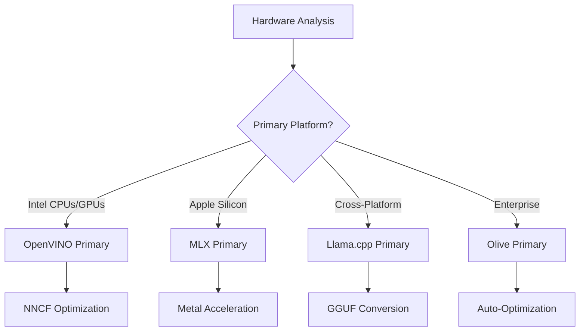
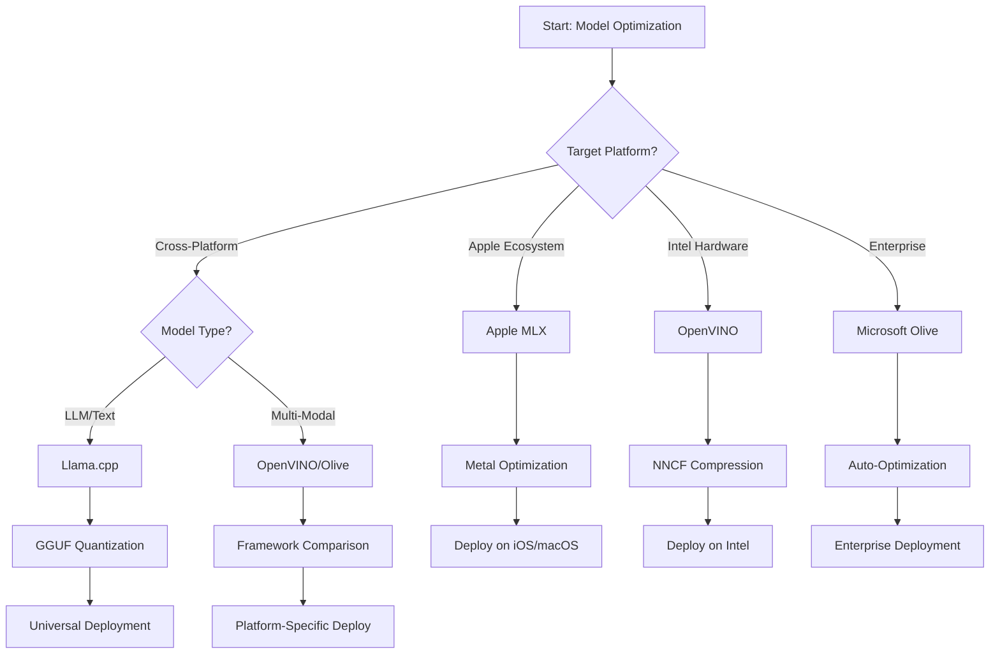
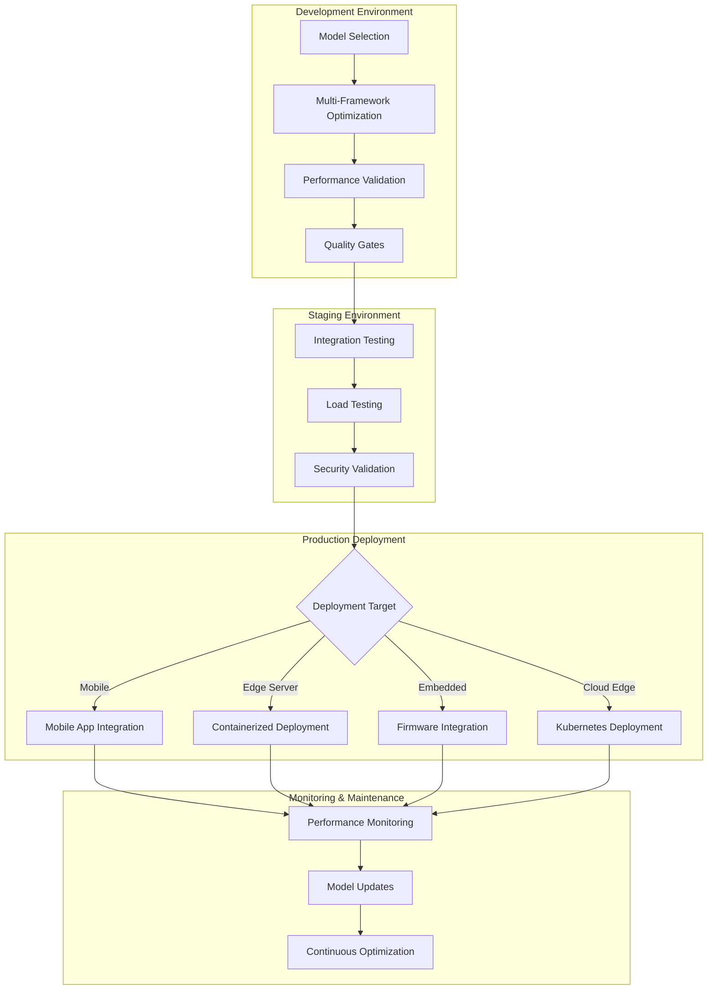

<!--
CO_OP_TRANSLATOR_METADATA:
{
  "original_hash": "6719c4a7e44b948230ac5f5cab3699bd",
  "translation_date": "2025-09-18T16:55:03+00:00",
  "source_file": "Module04/06.workflow-synthesis.md",
  "language_code": "sw"
}
-->
# Sehemu ya 6: Muhtasari wa Mtiririko wa Maendeleo ya Edge AI

## Jedwali la Maudhui
1. [Utangulizi](../../../Module04)
2. [Malengo ya Kujifunza](../../../Module04)
3. [Muhtasari wa Mtiririko wa Kazi wa Pamoja](../../../Module04)
4. [Matriki ya Uchaguzi wa Mfumo](../../../Module04)
5. [Muhtasari wa Mazoezi Bora](../../../Module04)
6. [Mwongozo wa Mkakati wa Utekelezaji](../../../Module04)
7. [Mtiririko wa Uboreshaji wa Utendaji](../../../Module04)
8. [Orodha ya Uhakiki wa Utayari wa Uzalishaji](../../../Module04)
9. [Utatuzi wa Matatizo na Ufuatiliaji](../../../Module04)
10. [Kuimarisha Mstari wa Edge AI kwa Baadaye](../../../Module04)

## Utangulizi

Maendeleo ya Edge AI yanahitaji uelewa wa kina wa mifumo mbalimbali ya uboreshaji, mikakati ya utekelezaji, na masuala ya vifaa. Muhtasari huu wa kina unakusanya maarifa kutoka Llama.cpp, Microsoft Olive, OpenVINO, na Apple MLX ili kuunda mtiririko wa kazi wa pamoja unaoongeza ufanisi, kudumisha ubora, na kuhakikisha utekelezaji wa mafanikio katika uzalishaji.

Katika kozi hii, tumetafiti mifumo ya uboreshaji mmoja mmoja, kila moja ikiwa na nguvu zake za kipekee na matumizi maalum. Hata hivyo, miradi halisi ya Edge AI mara nyingi huhitaji kuchanganya mbinu kutoka mifumo mbalimbali au kufanya maamuzi ya kimkakati kuhusu njia gani itatoa matokeo bora kwa vikwazo na mahitaji maalum.

Sehemu hii inachanganya hekima ya pamoja kutoka mifumo yote katika mtiririko wa kazi unaoweza kutekelezwa, miti ya maamuzi, na mazoea bora yanayokuwezesha kujenga suluhisho za Edge AI zinazofaa kwa uzalishaji kwa ufanisi na kwa ufanisi. Ikiwa unaboreshwa kwa vifaa vya rununu, mifumo iliyojengwa, au seva za ukingo, mwongozo huu unatoa mfumo wa kimkakati wa kufanya maamuzi sahihi katika mzunguko wako wa maendeleo.

## Malengo ya Kujifunza

Mwisho wa sehemu hii, utaweza:

### Uamuzi wa Kimkakati
- **Kutathmini na kuchagua** mfumo bora wa uboreshaji kulingana na mahitaji ya mradi, vikwazo vya vifaa, na hali za utekelezaji
- **Kubuni mtiririko wa kazi wa kina** unaojumuisha mbinu nyingi za uboreshaji kwa ufanisi wa juu
- **Kutathmini faida na hasara** kati ya usahihi wa modeli, kasi ya utambuzi, matumizi ya kumbukumbu, na ugumu wa utekelezaji katika mifumo tofauti

### Ujumuishaji wa Mtiririko wa Kazi
- **Kutekeleza mtiririko wa maendeleo wa pamoja** unaotumia nguvu za mifumo mbalimbali ya uboreshaji
- **Kuunda mtiririko wa kazi unaoweza kurudiwa** kwa uboreshaji wa modeli na utekelezaji thabiti katika mazingira tofauti
- **Kuweka milango ya ubora** na michakato ya uthibitishaji ili kuhakikisha modeli zilizoboreshwa zinakidhi mahitaji ya uzalishaji

### Uboreshaji wa Utendaji
- **Kutumia mikakati ya uboreshaji wa kimfumo** kwa kutumia upunguzaji, upunguzaji wa modeli, na mbinu maalum za kuongeza kasi ya vifaa
- **Kufuatilia na kupima** utendaji wa modeli katika viwango tofauti vya uboreshaji na malengo ya utekelezaji
- **Kuboresha kwa majukwaa maalum ya vifaa** ikiwa ni pamoja na CPU, GPU, NPU, na viharakishi maalum vya ukingo

### Utekelezaji wa Uzalishaji
- **Kubuni usanifu wa utekelezaji unaoweza kupanuka** unaochukua fomati nyingi za modeli na injini za utambuzi
- **Kutekeleza ufuatiliaji na ufuatiliaji wa hali** kwa programu za Edge AI katika mazingira ya uzalishaji
- **Kuweka mtiririko wa matengenezo** kwa masasisho ya modeli, ufuatiliaji wa utendaji, na uboreshaji wa mfumo

### Ubora wa Mifumo Mbalimbali
- **Kutekeleza modeli zilizoboreshwa** katika majukwaa mbalimbali ya vifaa huku ukidumisha utendaji thabiti
- **Kushughulikia uboreshaji maalum wa jukwaa** kwa Windows, macOS, Linux, rununu, na mifumo iliyojengwa
- **Kuunda tabaka za kuficha** zinazowezesha utekelezaji bila mshono katika mazingira tofauti ya ukingo

## Muhtasari wa Mtiririko wa Kazi wa Pamoja

### Awamu ya 1: Uchambuzi wa Mahitaji na Uchaguzi wa Mfumo

Msingi wa utekelezaji wa mafanikio wa Edge AI huanza na uchambuzi wa kina wa mahitaji unaoelekeza uchaguzi wa mfumo na mkakati wa uboreshaji.

#### 1.1 Tathmini ya Vifaa


**Masuala Muhimu:**
- **Muundo wa CPU**: Uwezo wa x86, ARM, Apple Silicon
- **Upatikanaji wa Viharibifu**: GPU, NPU, VPU, chipu maalum za AI
- **Vikwazo vya Kumbukumbu**: Kikwazo cha RAM, uwezo wa kuhifadhi
- **Bajeti ya Nguvu**: Muda wa betri, vikwazo vya joto
- **Uunganishaji**: Mahitaji ya nje ya mtandao, vikwazo vya bendi

#### 1.2 Matriki ya Mahitaji ya Programu

| Mahitaji | Llama.cpp | Microsoft Olive | OpenVINO | Apple MLX |
|----------|-----------|-----------------|----------|-----------|
| Mifumo Mbalimbali | ✅ Bora | ⚡ Nzuri | ⚡ Nzuri | ❌ Apple Pekee |
| Ujumuishaji wa Biashara | ⚡ Msingi | ✅ Bora | ✅ Bora | ⚡ Kidogo |
| Utekelezaji wa Rununu | ✅ Bora | ⚡ Nzuri | ⚡ Nzuri | ✅ iOS Bora |
| Utambuzi wa Wakati Halisi | ✅ Bora | ✅ Bora | ✅ Bora | ✅ Bora |
| Utofauti wa Modeli | ✅ LLM Pekee | ✅ Modeli Zote | ✅ Modeli Zote | ✅ LLM Pekee |
| Urahisi wa Matumizi | ✅ Rahisi | ✅ Kiotomatiki | ⚡ Kati | ✅ Rahisi |

### Awamu ya 2: Maandalizi ya Modeli na Uboreshaji

#### 2.1 Mtiririko wa Tathmini ya Modeli ya Ulimwengu

```python
# Universal Model Assessment Framework
class EdgeAIModelAssessment:
    def __init__(self, model_path, target_hardware):
        self.model_path = model_path
        self.target_hardware = target_hardware
        self.optimization_frameworks = []
        
    def assess_model_characteristics(self):
        """Analyze model size, architecture, and complexity"""
        return {
            'model_size': self.get_model_size(),
            'parameter_count': self.get_parameter_count(),
            'architecture_type': self.detect_architecture(),
            'quantization_compatibility': self.check_quantization_support()
        }
    
    def recommend_optimization_strategy(self):
        """Recommend optimal frameworks and techniques"""
        characteristics = self.assess_model_characteristics()
        
        if self.target_hardware.startswith('apple'):
            return self.mlx_optimization_strategy(characteristics)
        elif self.target_hardware.startswith('intel'):
            return self.openvino_optimization_strategy(characteristics)
        elif characteristics['model_size'] > 7_000_000_000:  # 7B+ parameters
            return self.enterprise_optimization_strategy(characteristics)
        else:
            return self.lightweight_optimization_strategy(characteristics)
```

#### 2.2 Mtiririko wa Uboreshaji wa Mfumo Mbalimbali

**Mbinu ya Uboreshaji wa Mfululizo:**
1. **Ubadilishaji wa Awali**: Badilisha kuwa fomati ya kati (ONNX inapowezekana)
2. **Uboreshaji Maalum wa Mfumo**: Tumia mbinu maalum
3. **Uthibitishaji wa Msalaba**: Thibitisha utendaji katika majukwaa lengwa
4. **Ufungaji wa Mwisho**: Andaa kwa utekelezaji

```bash
# Multi-Framework Optimization Script
#!/bin/bash

MODEL_NAME="phi-3-mini"
BASE_MODEL="microsoft/Phi-3-mini-4k-instruct"

# Phase 1: ONNX Conversion (Universal)
python convert_to_onnx.py --model $BASE_MODEL --output models/onnx/

# Phase 2: Platform-Specific Optimization
if [[ "$TARGET_PLATFORM" == "intel" ]]; then
    # OpenVINO Optimization
    python optimize_openvino.py --input models/onnx/ --output models/openvino/
elif [[ "$TARGET_PLATFORM" == "apple" ]]; then
    # MLX Optimization
    python optimize_mlx.py --input $BASE_MODEL --output models/mlx/
elif [[ "$TARGET_PLATFORM" == "cross" ]]; then
    # Llama.cpp Optimization
    python convert_to_gguf.py --input models/onnx/ --output models/gguf/
fi

# Phase 3: Validation
python validate_optimization.py --original $BASE_MODEL --optimized models/$TARGET_PLATFORM/
```

### Awamu ya 3: Uthibitishaji wa Utendaji na Upimaji

#### 3.1 Mfumo wa Upimaji wa Kina

```python
class EdgeAIBenchmark:
    def __init__(self, optimized_models):
        self.models = optimized_models
        self.metrics = {
            'inference_time': [],
            'memory_usage': [],
            'accuracy_score': [],
            'throughput': [],
            'energy_consumption': []
        }
    
    def run_comprehensive_benchmark(self):
        """Execute standardized benchmarks across all optimized models"""
        test_inputs = self.generate_test_inputs()
        
        for model_framework, model_path in self.models.items():
            print(f"Benchmarking {model_framework}...")
            
            # Latency Testing
            latency = self.measure_inference_latency(model_path, test_inputs)
            
            # Memory Profiling
            memory = self.profile_memory_usage(model_path)
            
            # Accuracy Validation
            accuracy = self.validate_model_accuracy(model_path, test_inputs)
            
            # Throughput Analysis
            throughput = self.measure_throughput(model_path)
            
            self.record_metrics(model_framework, latency, memory, accuracy, throughput)
    
    def generate_optimization_report(self):
        """Create comprehensive comparison report"""
        report = {
            'recommendations': self.analyze_performance_trade_offs(),
            'deployment_guidance': self.generate_deployment_recommendations(),
            'monitoring_requirements': self.define_monitoring_metrics()
        }
        return report
```

## Matriki ya Uchaguzi wa Mfumo

### Mti wa Maamuzi kwa Uchaguzi wa Mfumo



### Vigezo vya Uchaguzi wa Kina

#### 1. Ulinganifu wa Matumizi ya Kwanza

**Modeli Kubwa za Lugha (LLMs):**
- **Llama.cpp**: Bora kwa utekelezaji unaolenga CPU, mifumo mbalimbali
- **Apple MLX**: Bora kwa Apple Silicon na kumbukumbu iliyounganishwa
- **OpenVINO**: Bora kwa vifaa vya Intel na uboreshaji wa NNCF
- **Microsoft Olive**: Bora kwa mtiririko wa kazi wa biashara na kiotomatiki

**Modeli za Multi-Modal:**
- **OpenVINO**: Msaada wa kina kwa maono, sauti, na maandishi
- **Microsoft Olive**: Uboreshaji wa daraja la biashara kwa mitiririko changamano
- **Llama.cpp**: Inalenga modeli za maandishi pekee
- **Apple MLX**: Msaada unaokua kwa programu za multi-modal

#### 2. Matriki ya Jukwaa la Vifaa

| Jukwaa | Mfumo wa Kwanza | Chaguo la Pili | Vipengele Maalum |
|--------|-----------------|----------------|------------------|
| Intel CPU/GPU | OpenVINO | Microsoft Olive | Ukandamizaji wa NNCF, uboreshaji wa Intel |
| NVIDIA GPU | Microsoft Olive | OpenVINO | Kuongeza kasi ya CUDA, vipengele vya biashara |
| Apple Silicon | Apple MLX | Llama.cpp | Metal shaders, kumbukumbu iliyounganishwa |
| ARM Mobile | Llama.cpp | OpenVINO | Mifumo mbalimbali, utegemezi mdogo |
| Edge TPU | OpenVINO | Microsoft Olive | Msaada maalum wa viharibifu |
| ARM Iliyopachikwa | Llama.cpp | OpenVINO | Alama ndogo, utambuzi bora |

#### 3. Mapendeleo ya Mtiririko wa Kazi wa Maendeleo

**Prototyping ya Haraka:**
1. **Llama.cpp**: Usanidi wa haraka, matokeo ya papo hapo
2. **Apple MLX**: API rahisi ya Python, kurudia haraka
3. **Microsoft Olive**: Uboreshaji wa kiotomatiki, usanidi mdogo
4. **OpenVINO**: Usanidi changamano zaidi, vipengele vya kina

**Uzalishaji wa Biashara:**
1. **Microsoft Olive**: Vipengele vya biashara, ujumuishaji wa Azure
2. **OpenVINO**: Mfumo wa Intel, zana za kina
3. **Apple MLX**: Programu maalum za biashara za Apple
4. **Llama.cpp**: Utekelezaji rahisi, vipengele vya biashara vilivyopunguzwa

## Muhtasari wa Mazoezi Bora

### Kanuni za Uboreshaji wa Ulimwengu

#### 1. Mkakati wa Uboreshaji wa Hatua kwa Hatua

```python
class ProgressiveOptimization:
    def __init__(self, base_model):
        self.base_model = base_model
        self.optimization_stages = [
            'baseline_measurement',
            'format_conversion',
            'quantization_optimization',
            'hardware_acceleration',
            'production_validation'
        ]
    
    def execute_progressive_optimization(self):
        """Apply optimization techniques incrementally"""
        
        # Stage 1: Baseline Measurement
        baseline_metrics = self.measure_baseline_performance()
        
        # Stage 2: Format Conversion
        converted_model = self.convert_to_optimal_format()
        conversion_metrics = self.measure_performance(converted_model)
        
        # Stage 3: Quantization
        quantized_model = self.apply_quantization(converted_model)
        quantization_metrics = self.measure_performance(quantized_model)
        
        # Stage 4: Hardware Acceleration
        accelerated_model = self.enable_hardware_acceleration(quantized_model)
        acceleration_metrics = self.measure_performance(accelerated_model)
        
        # Stage 5: Validation
        production_ready = self.validate_for_production(accelerated_model)
        
        return self.compile_optimization_report(
            baseline_metrics, conversion_metrics, 
            quantization_metrics, acceleration_metrics
        )
```

#### 2. Utekelezaji wa Milango ya Ubora

**Milango ya Kuhifadhi Usahihi:**
- Kudumisha >95% ya usahihi wa modeli ya awali
- Thibitisha dhidi ya seti za majaribio zinazowakilisha
- Tekeleza majaribio ya A/B kwa uthibitishaji wa uzalishaji

**Milango ya Kuboresha Utendaji:**
- Kupata angalau mara 2 ya uboreshaji wa kasi
- Kupunguza alama ya kumbukumbu kwa angalau 50%
- Thibitisha uthabiti wa muda wa utambuzi

**Milango ya Utayari wa Uzalishaji:**
- Kupita majaribio ya mkazo chini ya mzigo
- Kuonyesha utendaji thabiti kwa muda
- Thibitisha mahitaji ya usalama na faragha

### Ujumuishaji wa Mazoezi Bora Maalum ya Mfumo

#### 1. Muhtasari wa Mkakati wa Upunguzaji

```python
# Unified Quantization Approach
class UnifiedQuantizationStrategy:
    def __init__(self, model, target_platform):
        self.model = model
        self.platform = target_platform
        
    def select_optimal_quantization(self):
        """Choose best quantization based on platform and requirements"""
        
        if self.platform == 'apple_silicon':
            return self.mlx_quantization_strategy()
        elif self.platform == 'intel_hardware':
            return self.openvino_quantization_strategy()
        elif self.platform == 'cross_platform':
            return self.llamacpp_quantization_strategy()
        else:
            return self.olive_quantization_strategy()
    
    def mlx_quantization_strategy(self):
        """Apple MLX-specific quantization"""
        return {
            'method': 'mlx_quantize',
            'precision': 'int4',
            'group_size': 64,
            'optimization_target': 'unified_memory'
        }
    
    def openvino_quantization_strategy(self):
        """OpenVINO NNCF quantization"""
        return {
            'method': 'nncf_quantize',
            'precision': 'int8',
            'calibration_method': 'post_training',
            'optimization_target': 'intel_hardware'
        }
```

#### 2. Uboreshaji wa Kuongeza Kasi ya Vifaa

**Muhtasari wa Uboreshaji wa CPU:**
- **Maelekezo ya SIMD**: Tumia kernels zilizoboreshwa katika mifumo
- **Upana wa Kumbukumbu**: Boresha mpangilio wa data kwa ufanisi wa cache
- **Threading**: Linganisha usawa wa ushirikiano na vikwazo vya rasilimali

**Mazoezi Bora ya Kuongeza Kasi ya GPU:**
- **Usindikaji wa Kundi**: Ongeza kasi kwa ukubwa wa kundi unaofaa
- **Usimamizi wa Kumbukumbu**: Boresha ugawaji wa kumbukumbu ya GPU na uhamisho
- **Usahihi**: Tumia FP16 inapowezekana kwa utendaji bora

**Uboreshaji wa Viharibifu Maalum vya NPU:**
- **Muundo wa Modeli**: Hakikisha utangamano na uwezo wa viharibifu
- **Mtiririko wa Data**: Boresha njia za kuingiza/kutoa kwa ufanisi wa viharibifu
- **Mikakati ya Mbadala**: Tekeleza mbadala wa CPU kwa operesheni zisizosaidiwa

## Mwongozo wa Mkakati wa Utekelezaji

### Usanifu wa Utekelezaji wa Ulimwengu



### Mifumo Maalum ya Utekelezaji

#### 1. Mkakati wa Utekelezaji wa Rununu

```yaml
# Mobile Deployment Configuration
mobile_deployment:
  ios:
    framework: apple_mlx
    optimization:
      quantization: int4
      memory_mapping: true
      background_execution: limited
    packaging:
      format: mlx
      bundle_size: <50MB
      
  android:
    framework: llama_cpp
    optimization:
      quantization: q4_k_m
      threading: android_optimized
      memory_management: conservative
    packaging:
      format: gguf
      apk_size: <100MB
      
  cross_platform:
    framework: onnx_runtime
    optimization:
      quantization: int8
      execution_provider: cpu
    packaging:
      format: onnx
      shared_libraries: minimal
```

#### 2. Utekelezaji wa Seva ya Ukingo

```yaml
# Edge Server Deployment Configuration
edge_server:
  intel_based:
    framework: openvino
    optimization:
      quantization: int8
      acceleration: cpu_gpu_auto
      batch_processing: dynamic
    deployment:
      container: openvino_runtime
      orchestration: kubernetes
      scaling: horizontal
      
  nvidia_based:
    framework: microsoft_olive
    optimization:
      quantization: int4
      acceleration: cuda
      tensor_parallelism: true
    deployment:
      container: nvidia_triton
      orchestration: kubernetes
      scaling: gpu_aware
```

### Mazoezi Bora ya Uwekaji wa Kontena

```dockerfile
# Multi-Framework Edge AI Container
FROM ubuntu:22.04 as base

# Install common dependencies
RUN apt-get update && apt-get install -y \
    python3 \
    python3-pip \
    build-essential \
    cmake \
    && rm -rf /var/lib/apt/lists/*

# Framework-specific stages
FROM base as openvino
RUN pip install openvino nncf optimum[intel]

FROM base as llamacpp
RUN git clone https://github.com/ggerganov/llama.cpp.git \
    && cd llama.cpp && make LLAMA_OPENBLAS=1

FROM base as olive
RUN pip install olive-ai[auto-opt] onnxruntime-genai

# Production stage with selected framework
FROM openvino as production
COPY models/ /app/models/
COPY src/ /app/src/
WORKDIR /app

EXPOSE 8080
CMD ["python3", "src/inference_server.py"]
```

## Mtiririko wa Uboreshaji wa Utendaji

### Urekebishaji wa Utendaji wa Kimfumo

#### 1. Mtiririko wa Upimaji wa Utendaji

```python
class EdgeAIPerformanceProfiler:
    def __init__(self, model_path, framework):
        self.model_path = model_path
        self.framework = framework
        self.profiling_results = {}
    
    def comprehensive_profiling(self):
        """Execute comprehensive performance analysis"""
        
        # CPU Profiling
        cpu_profile = self.profile_cpu_usage()
        
        # Memory Profiling
        memory_profile = self.profile_memory_usage()
        
        # Inference Latency
        latency_profile = self.profile_inference_latency()
        
        # Throughput Analysis
        throughput_profile = self.profile_throughput()
        
        # Energy Consumption (where available)
        energy_profile = self.profile_energy_consumption()
        
        return self.compile_performance_report(
            cpu_profile, memory_profile, latency_profile,
            throughput_profile, energy_profile
        )
    
    def identify_bottlenecks(self):
        """Automatically identify performance bottlenecks"""
        bottlenecks = []
        
        if self.profiling_results['cpu_utilization'] > 80:
            bottlenecks.append('cpu_bound')
        
        if self.profiling_results['memory_usage'] > 90:
            bottlenecks.append('memory_bound')
        
        if self.profiling_results['inference_variance'] > 20:
            bottlenecks.append('inconsistent_performance')
        
        return self.generate_optimization_recommendations(bottlenecks)
```

#### 2. Mtiririko wa Uboreshaji wa Kiotomatiki

```python
class AutomatedOptimizationPipeline:
    def __init__(self, base_model, target_constraints):
        self.base_model = base_model
        self.constraints = target_constraints
        self.optimization_history = []
    
    def execute_optimization_search(self):
        """Systematically search optimization space"""
        
        optimization_candidates = [
            {'quantization': 'int8', 'pruning': 0.1},
            {'quantization': 'int4', 'pruning': 0.2},
            {'quantization': 'int8', 'acceleration': 'gpu'},
            {'quantization': 'int4', 'acceleration': 'npu'}
        ]
        
        best_configuration = None
        best_score = 0
        
        for config in optimization_candidates:
            optimized_model = self.apply_optimization(config)
            score = self.evaluate_optimization(optimized_model)
            
            if score > best_score and self.meets_constraints(optimized_model):
                best_score = score
                best_configuration = config
            
            self.optimization_history.append({
                'config': config,
                'score': score,
                'model': optimized_model
            })
        
        return best_configuration, self.optimization_history
```

### Uboreshaji wa Malengo Mengi

#### 1. Uboreshaji wa Pareto kwa Edge AI

```python
class ParetoOptimization:
    def __init__(self, objectives=['speed', 'accuracy', 'memory']):
        self.objectives = objectives
        self.pareto_frontier = []
    
    def find_pareto_optimal_solutions(self, optimization_results):
        """Identify Pareto-optimal configurations"""
        
        for result in optimization_results:
            is_dominated = False
            
            for frontier_point in self.pareto_frontier:
                if self.dominates(frontier_point, result):
                    is_dominated = True
                    break
            
            if not is_dominated:
                # Remove dominated points from frontier
                self.pareto_frontier = [
                    point for point in self.pareto_frontier 
                    if not self.dominates(result, point)
                ]
                
                self.pareto_frontier.append(result)
        
        return self.pareto_frontier
    
    def recommend_configuration(self, user_preferences):
        """Recommend configuration based on user preferences"""
        
        weighted_scores = []
        for config in self.pareto_frontier:
            score = sum(
                user_preferences[obj] * config['metrics'][obj] 
                for obj in self.objectives
            )
            weighted_scores.append((score, config))
        
        return max(weighted_scores, key=lambda x: x[0])[1]
```

## Orodha ya Uhakiki wa Utayari wa Uzalishaji

### Uthibitishaji wa Kina wa Uzalishaji

#### 1. Uhakikisho wa Ubora wa Modeli

```python
class ProductionReadinessValidator:
    def __init__(self, optimized_model, production_requirements):
        self.model = optimized_model
        self.requirements = production_requirements
        self.validation_results = {}
    
    def validate_model_quality(self):
        """Comprehensive model quality validation"""
        
        # Accuracy Validation
        accuracy_result = self.validate_accuracy()
        
        # Performance Validation
        performance_result = self.validate_performance()
        
        # Robustness Testing
        robustness_result = self.validate_robustness()
        
        # Security Assessment
        security_result = self.validate_security()
        
        # Compliance Verification
        compliance_result = self.validate_compliance()
        
        return self.compile_validation_report(
            accuracy_result, performance_result, robustness_result,
            security_result, compliance_result
        )
    
    def generate_certification_report(self):
        """Generate production certification report"""
        return {
            'model_signature': self.generate_model_signature(),
            'validation_timestamp': datetime.now(),
            'validation_results': self.validation_results,
            'deployment_approval': self.check_deployment_approval(),
            'monitoring_requirements': self.define_monitoring_requirements()
        }
```

#### 2. Orodha ya Utekelezaji wa Uzalishaji

**Uthibitishaji Kabla ya Utekelezaji:**
- [ ] Usahihi wa modeli unakidhi mahitaji ya chini (>95% ya msingi)
- [ ] Malengo ya utendaji yamefikiwa (latency, throughput, kumbukumbu)
- [ ] Udhaifu wa usalama umepimwa na kupunguzwa
- [ ] Majaribio ya mkazo yamekamilika chini ya mzigo unaotarajiwa
- [ ] Hali za kushindwa zimejaribiwa na taratibu za kurejesha zimedhibitishwa
- [ ] Mifumo ya ufuatiliaji na tahadhari imewekwa
- [ ] Taratibu za kurudisha nyuma zimejaribiwa na kuandikwa

**Mchakato wa Utekelezaji:**
- [ ] Mkakati wa utekelezaji wa blue-green umetekelezwa
- [ ] Uongezaji wa trafiki hatua kwa hatua umewekwa
- [ ] Dashibodi za ufuatiliaji wa wakati halisi ziko hai
- [ ] Misingi ya utendaji imeanzishwa
- [ ] Viwango vya makosa vimefafanuliwa
- [ ] Vichocheo vya kurudisha nyuma kiotomatiki vimewekwa

**Ufuatiliaji Baada ya Utekelezaji:**
- [ ] Ufuatiliaji wa mwelekeo wa modeli uko hai
- [ ] Tahadhari za kupungua kwa utendaji zimewekwa
- [ ] Ufuatiliaji wa matumizi ya rasilimali umewezeshwa
- [ ] Metriki za uzoefu wa mtumiaji zinafuatiliwa
- [ ] Toleo la modeli na historia vinadumishwa
- [ ] Mapitio ya utendaji wa modeli yamepangwa mara kwa mara

### Ujumuishaji wa Kuendelea/Utekelezaji wa Kuendelea (CI/CD)

```yaml
# Edge AI CI/CD Pipeline Configuration
edge_ai_pipeline:
  stages:
    - model_validation
    - optimization
    - testing
    - staging_deployment
    - production_deployment
    - monitoring
  
  model_validation:
    accuracy_threshold: 0.95
    performance_baseline: required
    security_scan: enabled
    
  optimization:
    frameworks:
      - llama_cpp
      - openvino
      - microsoft_olive
    validation:
      cross_validation: enabled
      performance_comparison: required
      
  testing:
    unit_tests: comprehensive
    integration_tests: full_pipeline
    load_tests: production_scale
    security_tests: comprehensive
    
  deployment:
    strategy: blue_green
    traffic_ramping: gradual
    rollback: automatic
    monitoring: real_time
```

## Utatuzi wa Matatizo na Ufuatiliaji

### Mfumo wa Ulimwengu wa Utatuzi wa Matatizo

#### 1. Masuala ya Kawaida na Suluhisho

**Masuala ya Utendaji:**
```python
class PerformanceTroubleshooter:
    def __init__(self, model_metrics):
        self.metrics = model_metrics
        
    def diagnose_performance_issues(self):
        """Systematic performance issue diagnosis"""
        
        issues = []
        
        # High latency diagnosis
        if self.metrics['avg_latency'] > self.metrics['target_latency']:
            issues.append(self.diagnose_latency_issues())
        
        # Memory usage diagnosis
        if self.metrics['memory_usage'] > self.metrics['memory_limit']:
            issues.append(self.diagnose_memory_issues())
        
        # Throughput diagnosis
        if self.metrics['throughput'] < self.metrics['target_throughput']:
            issues.append(self.diagnose_throughput_issues())
        
        return self.generate_resolution_plan(issues)
    
    def diagnose_latency_issues(self):
        """Specific latency troubleshooting"""
        potential_causes = []
        
        if self.metrics['cpu_utilization'] > 80:
            potential_causes.append('cpu_bottleneck')
        
        if self.metrics['memory_bandwidth'] > 90:
            potential_causes.append('memory_bandwidth_limit')
        
        if self.metrics['model_size'] > self.metrics['optimal_size']:
            potential_causes.append('model_too_large')
        
        return {
            'issue': 'high_latency',
            'causes': potential_causes,
            'solutions': self.generate_latency_solutions(potential_causes)
        }
```

**Utatuzi Maalum wa Mfumo:**

| Tatizo | Llama.cpp | Microsoft Olive | OpenVINO | Apple MLX |
|--------|-----------|-----------------|----------|-----------|
| Masuala ya Kumbukumbu | Punguza urefu wa muktadha | Punguza ukubwa wa kundi | Washa caching | Tumia ramani ya kumbukumbu |
| Utambuzi Polepole | Washa SIMD | Angalia upunguzaji | Boresha threading | Washa Metal |
| Upotevu wa Usahihi | Upunguzaji wa juu | Fanya mafunzo tena na QAT | Ongeza calibration | Rekebisha baada ya upunguzaji |
| Utangamano | Angalia fomati ya modeli | Thibitisha toleo la mfumo | Sasisha madereva | Angalia toleo la macOS |

#### 2. Mkakati wa Ufuatiliaji wa Uzalishaji

```python
class EdgeAIMonitoring:
    def __init__(self, deployment_config):
        self.config = deployment_config
        self.metrics_collectors = []
        self.alerting_rules = []
    
    def setup_comprehensive_monitoring(self):
        """Configure comprehensive monitoring for Edge AI deployment"""
        
        # Model Performance Monitoring
        self.setup_model_performance_monitoring()
        
        # Infrastructure Monitoring
        self.setup_infrastructure_monitoring()
        
        # Business Metrics Monitoring
        self.setup_business_metrics_monitoring()
        
        # Security Monitoring
        self.setup_security_monitoring()
    
    def setup_model_performance_monitoring(self):
        """Model-specific performance monitoring"""
        metrics = [
            'inference_latency_p50',
            'inference_latency_p95',
            'inference_latency_p99',
            'model_accuracy_drift',
            'prediction_confidence_distribution',
            'error_rate',
            'throughput_requests_per_second'
        ]
        
        for metric in metrics:
            self.add_metric_collector(metric)
            self.add_alerting_rule(metric)
    
    def detect_model_drift(self):
        """Automated model drift detection"""
        drift_indicators = [
            self.statistical_drift_detection(),
            self.performance_drift_detection(),
            self.data_distribution_shift_detection()
        ]
        
        return self.aggregate_drift_signals(drift_indicators)
```

### Utatuzi wa Masuala Kiotomatiki

```python
class AutomatedIssueResolution:
    def __init__(self, monitoring_system):
        self.monitoring = monitoring_system
        self.resolution_strategies = {}
    
    def handle_performance_degradation(self, alert):
        """Automated performance issue resolution"""
        
        if alert['type'] == 'high_latency':
            return self.resolve_latency_issue(alert)
        elif alert['type'] == 'high_memory_usage':
            return self.resolve_memory_issue(alert)
        elif alert['type'] == 'accuracy_drift':
            return self.resolve_accuracy_issue(alert)
        
    def resolve_latency_issue(self, alert):
        """Automated latency issue resolution"""
        resolution_steps = [
            'increase_cpu_allocation',
            'enable_model_caching',
            'reduce_batch_size',
            'switch_to_quantized_model'
        ]
        
        for step in resolution_steps:
            if self.apply_resolution_step(step):
                return f"Resolved latency issue with: {step}"
        
        return "Escalating to human operator"
```

## Kuimarisha Mstari wa Edge AI kwa Baadaye

### Ujumuishaji wa Teknolojia Zinazojitokeza

#### 1. Msaada wa Vifaa vya Kizazi Kijacho

```python
class FutureHardwareIntegration:
    def __init__(self):
        self.supported_accelerators = [
            'npu_next_gen',
            'quantum_processors',
            'neuromorphic_chips',
            'optical_processors'
        ]
    
    def design_adaptive_pipeline(self):
        """Create hardware-agnostic optimization pipeline"""
        
        pipeline = {
            'model_preparation': self.universal_model_preparation(),
            'hardware_detection': self.dynamic_hardware_detection(),
            'optimization_selection': self.adaptive_optimization_selection(),
            'performance_validation': self.hardware_agnostic_validation()
        }
        
        return pipeline
    
    def adaptive_optimization_selection(self):
        """Dynamically select optimization based on available hardware"""
        
        def optimize_for_hardware(model, available_hardware):
            if 'npu' in available_hardware:
                return self.npu_optimization(model)
            elif 'quantum' in available_hardware:
                return self.quantum_optimization(model)
            elif 'neuromorphic' in available_hardware:
                return self.neuromorphic_optimization(model)
            else:
                return self.fallback_optimization(model)
        
        return optimize_for_hardware
```

#### 2. Mageuzi ya Muundo wa Modeli

**Msaada kwa Miundo Inayojitokeza:**
- **Mchanganyiko wa Wataalamu (MoE)**: Miundo ya modeli ya sparse kwa ufanisi
- **
Kumbuka kwamba mkakati bora wa uboreshaji ni ule unaokidhi mahitaji yako maalum huku ukidumisha uwezo wa kubadilika kadri mahitaji hayo yanavyobadilika. Tumia mwongozo huu kama msingi wa kufanya maamuzi yenye ufahamu, lakini daima thibitisha chaguo zako kupitia majaribio ya kiutendaji na uzoefu wa utekelezaji halisi.

## ➡️ Nini cha kufanya baadaye

Endelea na safari yako ya Edge AI kwa kuchunguza [Module 5: SLMOps and Production Deployment](../Module05/README.md) ili kujifunza kuhusu vipengele vya kiutendaji vya usimamizi wa mzunguko wa maisha wa Small Language Model.

---

**Kanusho**:  
Hati hii imetafsiriwa kwa kutumia huduma ya tafsiri ya AI [Co-op Translator](https://github.com/Azure/co-op-translator). Ingawa tunajitahidi kuhakikisha usahihi, tafsiri za kiotomatiki zinaweza kuwa na makosa au kutokuwa sahihi. Hati ya asili katika lugha yake ya awali inapaswa kuchukuliwa kama chanzo cha mamlaka. Kwa taarifa muhimu, tafsiri ya kitaalamu ya binadamu inapendekezwa. Hatutawajibika kwa kutoelewana au tafsiri zisizo sahihi zinazotokana na matumizi ya tafsiri hii.