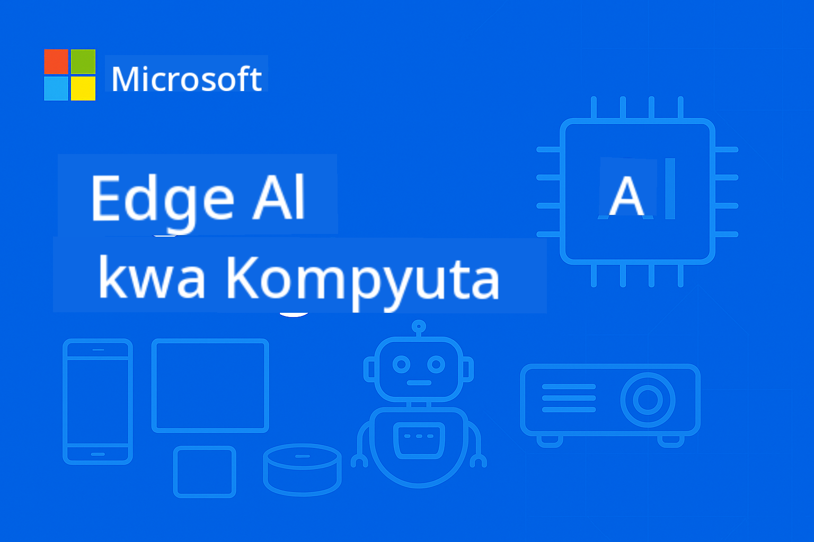

<!--
CO_OP_TRANSLATOR_METADATA:
{
  "original_hash": "cd9cb76aab17c30bfb19ef73060c5fb0",
  "translation_date": "2025-10-11T10:45:28+00:00",
  "source_file": "README.md",
  "language_code": "sw"
}
-->
# EdgeAI kwa Kompyuta



[](https://GitHub.com/microsoft/edgeai-for-beginners/graphs/contributors)
[](https://GitHub.com/microsoft/edgeai-for-beginners/issues)
[](https://GitHub.com/microsoft/edgeai-for-beginners/pulls)
[](http://makeapullrequest.com)

[](https://GitHub.com/microsoft/edgeai-for-beginners/watchers)
[](https://GitHub.com/microsoft/edgeai-for-beginners/fork)
[](https://GitHub.com/microsoft/edgeai-for-beginners/stargazers)

[](https://discord.com/invite/ByRwuEEgH4)

Fuata hatua hizi kuanza kutumia rasilimali hizi:

1. **Fork Hifadhi**: Bonyeza [](https://GitHub.com/microsoft/edgeai-for-beginners/fork)
2. **Clone Hifadhi**:   `git clone https://github.com/microsoft/edgeai-for-beginners.git`
3. [**Jiunge na Azure AI Foundry Discord na kutana na wataalamu na watengenezaji wenzako**](https://discord.com/invite/ByRwuEEgH4)

### 🌐 Msaada wa Lugha Nyingi

#### Inasaidiwa kupitia GitHub Action (Imefanywa Kiotomatiki & Daima Imeboreshwa)

[Kiarabu](../ar/README.md) | [Kibengali](../bn/README.md) | [Kibulgaria](../bg/README.md) | [Kiburma (Myanmar)](../my/README.md) | [Kichina (Rahisi)](../zh/README.md) | [Kichina (Kienyeji, Hong Kong)](../hk/README.md) | [Kichina (Kienyeji, Macau)](../mo/README.md) | [Kichina (Kienyeji, Taiwan)](../tw/README.md) | [Kikroeshia](../hr/README.md) | [Kicheki](../cs/README.md) | [Kideni](../da/README.md) | [Kiholanzi](../nl/README.md) | [Kiestonia](../et/README.md) | [Kifini](../fi/README.md) | [Kifaransa](../fr/README.md) | [Kijerumani](../de/README.md) | [Kigiriki](../el/README.md) | [Kiebrania](../he/README.md) | [Kihindi](../hi/README.md) | [Kihungari](../hu/README.md) | [Kiindonesia](../id/README.md) | [Kiitaliano](../it/README.md) | [Kijapani](../ja/README.md) | [Kikorea](../ko/README.md) | [Kilitwania](../lt/README.md) | [Kimalei](../ms/README.md) | [Kimarathi](../mr/README.md) | [Kinepali](../ne/README.md) | [Kinorwe](../no/README.md) | [Kifarsi](../fa/README.md) | [Kipolandi](../pl/README.md) | [Kireno (Brazil)](../br/README.md) | [Kireno (Ureno)](../pt/README.md) | [Kipunjabi (Gurmukhi)](../pa/README.md) | [Kiromania](../ro/README.md) | [Kirusi](../ru/README.md) | [Kiserbia (Kisiriliki)](../sr/README.md) | [Kislovakia](../sk/README.md) | [Kislovenia](../sl/README.md) | [Kihispania](../es/README.md) | [Kiswahili](./README.md) | [Kiswidi](../sv/README.md) | [Kitagalogi (Kifilipino)](../tl/README.md) | [Kitamil](../ta/README.md) | [Kithai](../th/README.md) | [Kituruki](../tr/README.md) | [Kiukraini](../uk/README.md) | [Kiurdu](../ur/README.md) | [Kivietinamu](../vi/README.md)

**Ikiwa unataka lugha za ziada za tafsiri, lugha zinazosaidiwa zimeorodheshwa [hapa](https://github.com/Azure/co-op-translator/blob/main/getting_started/supported-languages.md)**

## Utangulizi

Karibu kwenye **EdgeAI kwa Kompyuta** – safari yako ya kina katika ulimwengu wa mabadiliko wa Akili Bandia ya Edge. Kozi hii inaunganisha uwezo wa AI wenye nguvu na utekelezaji wa vitendo katika vifaa vya edge, ikikuwezesha kutumia uwezo wa AI moja kwa moja pale data inapotengenezwa na maamuzi yanapohitajika.

### Unachojifunza

Kozi hii inakuchukua kutoka dhana za msingi hadi utekelezaji tayari kwa uzalishaji, ikijumuisha:
- **Small Language Models (SLMs)** zilizoboreshwa kwa ajili ya utekelezaji wa edge
- **Uboreshaji unaozingatia vifaa** katika majukwaa mbalimbali
- **Utabiri wa wakati halisi** na uwezo wa kuhifadhi faragha
- **Mikakati ya utekelezaji wa uzalishaji** kwa programu za biashara

### Kwa Nini EdgeAI Ni Muhimu

Edge AI inawakilisha mabadiliko ya dhana yanayoshughulikia changamoto muhimu za kisasa:
- **Faragha & Usalama**: Kusindika data nyeti ndani bila kufichua kwa wingu
- **Utendaji wa Wakati Halisi**: Kuondoa ucheleweshaji wa mtandao kwa programu zinazohitaji muda
- **Ufanisi wa Gharama**: Kupunguza matumizi ya bandwidth na gharama za kompyuta za wingu
- **Uendeshaji Imara**: Kudumisha utendaji wakati wa kukatika kwa mtandao
- **Kuzingatia Kanuni**: Kukidhi mahitaji ya uhuru wa data

### Edge AI

Edge AI inahusu kuendesha algoriti za AI na mifano ya lugha ndani ya vifaa, karibu na pale data inapotengenezwa bila kutegemea rasilimali za wingu kwa utabiri. Inapunguza ucheleweshaji, inaboresha faragha, na kuwezesha maamuzi ya wakati halisi.

### Kanuni za Msingi:
- **Utabiri kwenye kifaa**: Mifano ya AI inaendeshwa kwenye vifaa vya edge (simu, router, microcontroller, PC za viwandani)
- **Uwezo wa nje ya mtandao**: Inafanya kazi bila muunganisho wa mtandao wa kudumu
- **Ucheleweshaji wa chini**: Majibu ya haraka yanayofaa kwa mifumo ya wakati halisi
- **Uhuru wa data**: Inahifadhi data nyeti ndani, ikiboresha usalama na uzingatiaji

### Small Language Models (SLMs)

SLMs kama Phi-4, Mistral-7B, na Gemma ni matoleo yaliyoboreshwa ya LLM kubwa—yaliyofundishwa au kupunguzwa kwa:
- **Matumizi ya kumbukumbu yaliyopunguzwa**: Matumizi bora ya kumbukumbu ndogo ya kifaa cha edge
- **Mahitaji ya kompyuta yaliyopunguzwa**: Yameboreshwa kwa utendaji wa CPU na GPU za edge
- **Nyakati za kuanza haraka**: Uanzishaji wa haraka kwa programu zinazojibu haraka

Zinatoa uwezo wa NLP wenye nguvu huku zikikidhi vikwazo vya:
- **Mifumo iliyojengwa**: Vifaa vya IoT na vidhibiti vya viwandani
- **Vifaa vya rununu**: Simu za mkononi na vidonge vyenye uwezo wa nje ya mtandao
- **Vifaa vya IoT**: Vihisi na vifaa mahiri vyenye rasilimali ndogo
- **Seva za edge**: Vitengo vya usindikaji wa ndani vyenye rasilimali ndogo za GPU
- **Kompyuta za Kibinafsi**: Matukio ya utekelezaji wa desktop na laptop

## Moduli za Kozi & Uabiri

| Moduli | Mada | Eneo la Kuzingatia | Maudhui Muhimu | Kiwango | Muda |
|--------|-------|------------|-------------|--------|----------|
| [📖 00 ](./introduction.md) | [Utangulizi wa EdgeAI](./introduction.md) | Msingi & Muktadha | Muhtasari wa EdgeAI • Matumizi ya Viwanda • Utangulizi wa SLM • Malengo ya Kujifunza | Kompyuta | 1-2 hrs |
| [📚 01](../../Module01) | [Misingi ya EdgeAI](./Module01/README.md) | Ulinganisho wa Cloud vs Edge AI | Misingi ya EdgeAI • Masomo ya Kesi ya Ulimwengu Halisi • Mwongozo wa Utekelezaji • Utekelezaji wa Edge | Kompyuta | 3-4 hrs |
| [🧠 02](../../Module02) | [Misingi ya Mfano wa SLM](./Module02/README.md) | Familia za mifano & usanifu | Familia ya Phi • Familia ya Qwen • Familia ya Gemma • BitNET • μModel • Phi-Silica | Kompyuta | 4-5 hrs |
| [🚀 03](../../Module03) | [Mazoezi ya Utekelezaji wa SLM](./Module03/README.md) | Utekelezaji wa ndani & wingu | Kujifunza kwa Kina • Mazingira ya Ndani • Utekelezaji wa Wingu | Kati | 4-5 hrs |
| [⚙️ 04](../../Module04) | [Kifaa cha Uboreshaji wa Mfano](./Module04/README.md) | Uboreshaji wa majukwaa mbalimbali | Utangulizi • Llama.cpp • Microsoft Olive • OpenVINO • Apple MLX • Muundo wa Kazi | Kati | 5-6 hrs |
| [🔧 05](../../Module05) | [SLMOps Uzalishaji](./Module05/README.md) | Uendeshaji wa uzalishaji | Utangulizi wa SLMOps • Kupunguza Mfano • Kurekebisha • Utekelezaji wa Uzalishaji | Juu | 5-6 hrs |
| [🤖 06](../../Module06) | [Wakala wa AI & Kuita Kazi](./Module06/README.md) | Mfumo wa wakala & MCP | Utangulizi wa Wakala • Kuita Kazi • Itifaki ya Muktadha wa Mfano | Juu | 4-5 hrs |
| [💻 07](../../Module07) | [Utekelezaji wa Jukwaa](./Module07/README.md) | Sampuli za majukwaa mbalimbali | Kifaa cha AI • Foundry Local • Maendeleo ya Windows | Juu | 3-4 hrs |
| [🏭 08](../../Module08) | [Kifaa cha Foundry Local](./Module08/README.md) | Sampuli tayari kwa uzalishaji | Programu za sampuli (angalia maelezo hapa chini) | Mtaalamu | 8-10 hrs |

### 🏭 **Moduli 08: Programu za Sampuli**

- [01: Mwanzo wa Haraka wa REST Chat](./Module08/samples/01/README.md)
- [02: Ujumuishaji wa OpenAI SDK](./Module08/samples/02/README.md)
- [03: Ugunduzi wa Mfano & Upimaji](./Module08/samples/03/README.md)
- [04: Programu ya Chainlit RAG](./Module08/samples/04/README.md)
- [05: Uratibu wa Wakala Wengi](./Module08/samples/05/README.md)
- [06: Router ya Models-as-Tools](./Module08/samples/06/README.md)
- [07: Mteja wa API ya Moja kwa Moja](./Module08/samples/07/README.md)
- [08: Programu ya Chat ya Windows 11](./Module08/samples/08/README.md)
- [09: Mfumo wa Wakala Wengi wa Juu](./Module08/samples/09/README.md)
- [10: Mfumo wa Zana za Foundry](./Module08/samples/10/README.md)

### 🎓 **Warsha: Njia ya Kujifunza kwa Vitendo**

Vifaa vya warsha vya kina vya kujifunza kwa vitendo na utekelezaji tayari kwa uzalishaji:

- **[Mwongozo wa Warsha](./Workshop/Readme.md)** - Malengo kamili ya kujifunza, matokeo, na uabiri wa rasilimali
- **Sampuli za Python** (vikao 6) - Zimeboreshwa na mbinu bora, utunzaji wa makosa, na nyaraka za kina
- **Noti za Jupyter** (8 za maingiliano) - Mafunzo ya hatua kwa hatua na upimaji wa utendaji
- **Miongozo ya Vikao** - Miongozo ya kina ya markdown kwa kila kikao cha warsha
- **Zana za Uthibitishaji** - Hati za kuthibitisha ubora wa msimbo na kuendesha majaribio ya haraka

**Unachojenga:**
- Programu za mazungumzo za AI za ndani zenye msaada wa utiririshaji
- Njia za RAG zenye tathmini ya ubora (RAGAS)
- Zana za upimaji na kulinganisha mifano nyingi
- Mifumo ya uratibu wa wakala wengi
- Uelekezaji wa mifano wenye akili kwa uteuzi wa kazi

### 📊 **Muhtasari wa Njia ya Kujifunza**
- **Muda Jumla**: Masaa 36-45
- **Njia ya Kompyuta**: Moduli 01-02 (Masaa 7-9)  
- **Njia ya Kati**: Moduli 03-04 (Masaa 9-11)
- **Njia ya Juu**: Moduli 05-07 (Masaa 12-15)
- **Njia ya Mtaalamu**: Moduli 08 (Masaa 8-10)

## Unachojenga

### 🎯 Uwezo wa Msingi
- **Usanifu wa Edge AI**: Buni mifumo ya AI ya ndani kwanza yenye ujumuishaji wa wingu
- **Uboreshaji wa Mfano**: Punguza ukubwa wa mifano na kuiboresha kwa utekelezaji wa edge (ongezeko la kasi 85%, upunguzaji wa ukubwa 75%)
- **Utekelezaji wa Majukwaa Mengi**: Windows, rununu, vifaa vilivyojengwa, na mifumo mseto ya wingu-edge
- **Operesheni za Uzalishaji**: Kufuatilia, kupanua, na kudumisha AI ya ukingo katika uzalishaji

### 🏗️ Miradi ya Kivitendo
- **Foundry Local Chat Apps**: Programu ya asili ya Windows 11 yenye kubadilisha modeli
- **Multi-Agent Systems**: Mratibu na mawakala maalum kwa kazi ngumu  
- **RAG Applications**: Usindikaji wa nyaraka za ndani kwa utafutaji wa vekta
- **Model Routers**: Uchaguzi wa akili kati ya modeli kulingana na uchambuzi wa kazi
- **API Frameworks**: Wateja tayari kwa uzalishaji wenye utiririshaji na ufuatiliaji wa afya
- **Cross-Platform Tools**: Mifumo ya ujumuishaji ya LangChain/Semantic Kernel

### 🏢 Matumizi ya Kiwandani
**Utengenezaji** • **Huduma za Afya** • **Magari Yanayojitegemea** • **Miji Mahiri** • **Programu za Simu**

## Kuanza Haraka

**Njia ya Kujifunza Inayopendekezwa** (jumla ya saa 20-30):

0. **📖 Utangulizi** ([Introduction.md](./introduction.md)): Msingi wa EdgeAI + muktadha wa sekta + mfumo wa kujifunza
1. **📚 Msingi** (Moduli 01-02): Dhana za EdgeAI + familia za modeli za SLM
2. **⚙️ Uboreshaji** (Moduli 03-04): Utekelezaji + mifumo ya upunguzaji  
3. **🚀 Uzalishaji** (Moduli 05-06): SLMOps + mawakala wa AI + kupiga kazi
4. **💻 Utekelezaji** (Moduli 07-08): Sampuli za jukwaa + zana za Foundry Local

Kila moduli inajumuisha nadharia, mazoezi ya vitendo, na sampuli za msimbo tayari kwa uzalishaji.

## Athari kwa Kazi

**Majukumu ya Kiufundi**: Mbunifu wa Suluhisho za EdgeAI • Mhandisi wa ML (Edge) • Msanidi wa IoT AI • Msanidi wa AI wa Simu

**Sekta za Viwanda**: Utengenezaji 4.0 • Teknolojia ya Afya • Mifumo ya Kujitegemea • FinTech • Elektroniki ya Watumiaji

**Miradi ya Portfolio**: Mifumo ya mawakala wengi • Programu za RAG za uzalishaji • Utekelezaji wa majukwaa mbalimbali • Uboreshaji wa utendaji

## Muundo wa Hifadhi

```
edgeai-for-beginners/
├── 📖 introduction.md  # Foundation: EdgeAI Overview & Learning Framework
├── 📚 Module01-04/     # Fundamentals → SLMs → Deployment → Optimization  
├── 🔧 Module05-06/     # SLMOps → AI Agents → Function Calling
├── 💻 Module07/        # Platform Samples (VS Code, Windows, Jetson, Mobile)
├── 🏭 Module08/        # Foundry Local Toolkit + 10 Comprehensive Samples
│   ├── samples/01-06/  # Foundation: REST, SDK, RAG, Agents, Routing
│   └── samples/07-10/  # Advanced: API Client, Windows App, Enterprise Agents, Tools
├── 🌐 translations/    # Multi-language support (8+ languages)
└── 📋 STUDY_GUIDE.md   # Structured learning paths & time allocation
```

## Vipengele vya Kozi

✅ **Kujifunza kwa Hatua**: Nadharia → Mazoezi → Utekelezaji wa uzalishaji  
✅ **Masomo Halisi**: Microsoft, Japan Airlines, utekelezaji wa biashara  
✅ **Sampuli za Vitendo**: Zaidi ya mifano 50, maonyesho 10 ya kina ya Foundry Local  
✅ **Mtazamo wa Utendaji**: Uboreshaji wa kasi kwa 85%, upunguzaji wa ukubwa kwa 75%  
✅ **Majukwaa Mbalimbali**: Windows, simu, vifaa vilivyowekwa, mseto wa ukingo wa wingu  
✅ **Tayari kwa Uzalishaji**: Ufuatiliaji, upanuzi, usalama, mifumo ya kufuata

📖 **[Mwongozo wa Kujifunza Unapatikana](STUDY_GUIDE.md)**: Njia ya kujifunza ya saa 20 yenye mwongozo wa ugawaji wa muda na zana za kujitathmini.

---

**EdgeAI inawakilisha mustakabali wa utekelezaji wa AI**: wa ndani kwanza, unaohifadhi faragha, na wenye ufanisi. Jifunze ujuzi huu ili kujenga kizazi kijacho cha programu za akili.

## Kozi Nyingine

Timu yetu inazalisha kozi nyingine! Angalia:

- [MCP kwa Kompyuta](https://github.com/microsoft/mcp-for-beginners)
- [Mawakala wa AI kwa Kompyuta](https://github.com/microsoft/ai-agents-for-beginners?WT.mc_id=academic-105485-koreyst)
- [Generative AI kwa Kompyuta kwa kutumia .NET](https://github.com/microsoft/Generative-AI-for-beginners-dotnet?WT.mc_id=academic-105485-koreyst)
- [Generative AI kwa Kompyuta kwa kutumia JavaScript](https://github.com/microsoft/generative-ai-with-javascript?WT.mc_id=academic-105485-koreyst)
- [Generative AI kwa Kompyuta](https://github.com/microsoft/generative-ai-for-beginners?WT.mc_id=academic-105485-koreyst)
- [ML kwa Kompyuta](https://aka.ms/ml-beginners?WT.mc_id=academic-105485-koreyst)
- [Sayansi ya Takwimu kwa Kompyuta](https://aka.ms/datascience-beginners?WT.mc_id=academic-105485-koreyst)
- [AI kwa Kompyuta](https://aka.ms/ai-beginners?WT.mc_id=academic-105485-koreyst)
- [Usalama wa Mtandao kwa Kompyuta](https://github.com/microsoft/Security-101??WT.mc_id=academic-96948-sayoung)
- [Web Dev kwa Kompyuta](https://aka.ms/webdev-beginners?WT.mc_id=academic-105485-koreyst)
- [IoT kwa Kompyuta](https://aka.ms/iot-beginners?WT.mc_id=academic-105485-koreyst)
- [Maendeleo ya XR kwa Kompyuta](https://github.com/microsoft/xr-development-for-beginners?WT.mc_id=academic-105485-koreyst)
- [Kumiliki GitHub Copilot kwa Uprogramu wa AI wa Pamoja](https://aka.ms/GitHubCopilotAI?WT.mc_id=academic-105485-koreyst)
- [Kumiliki GitHub Copilot kwa Wasanidi wa C#/.NET](https://github.com/microsoft/mastering-github-copilot-for-dotnet-csharp-developers?WT.mc_id=academic-105485-koreyst)
- [Chagua Safari Yako ya Copilot](https://github.com/microsoft/CopilotAdventures?WT.mc_id=academic-105485-koreyst)

## Kupata Msaada

Ikiwa utakwama au una maswali kuhusu kujenga programu za AI, jiunge:

[](https://aka.ms/foundry/discord)

Ikiwa una maoni ya bidhaa au makosa wakati wa kujenga tembelea:

[](https://aka.ms/foundry/forum)

---

**Kanusho**:  
Hati hii imetafsiriwa kwa kutumia huduma ya kutafsiri ya AI [Co-op Translator](https://github.com/Azure/co-op-translator). Ingawa tunajitahidi kwa usahihi, tafadhali fahamu kuwa tafsiri za kiotomatiki zinaweza kuwa na makosa au kutokuwa sahihi. Hati ya asili katika lugha yake ya awali inapaswa kuzingatiwa kama chanzo cha mamlaka. Kwa taarifa muhimu, tafsiri ya kitaalamu ya binadamu inapendekezwa. Hatutawajibika kwa kutoelewana au tafsiri zisizo sahihi zinazotokana na matumizi ya tafsiri hii.