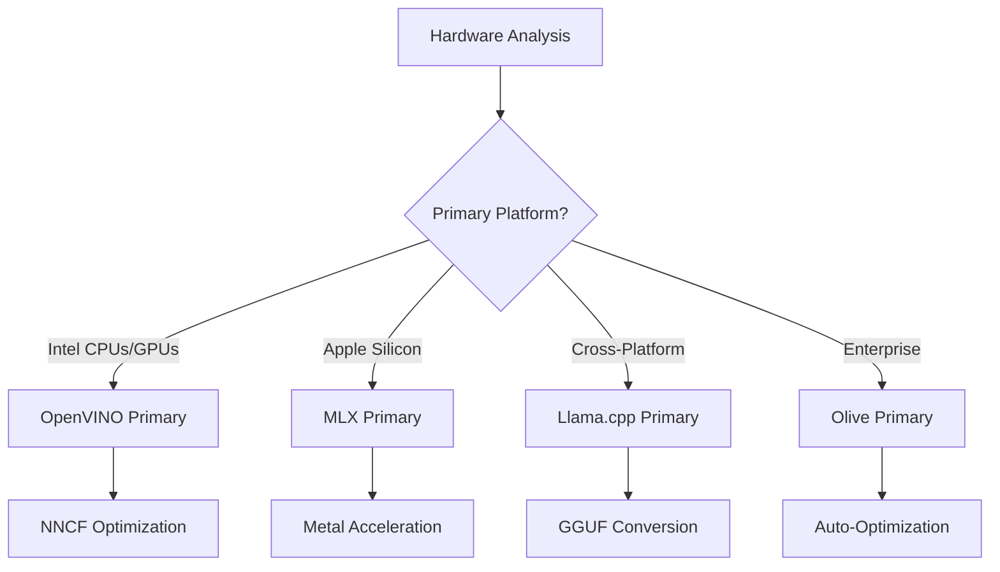
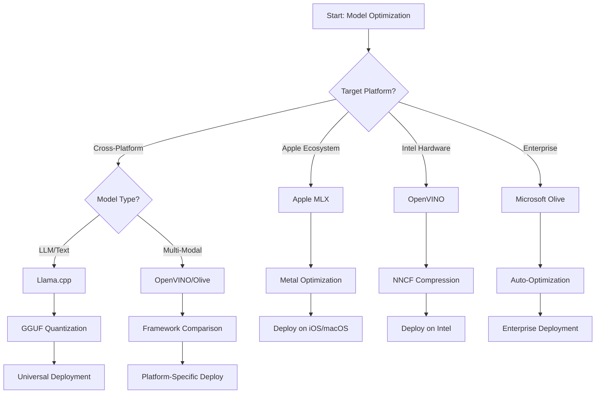
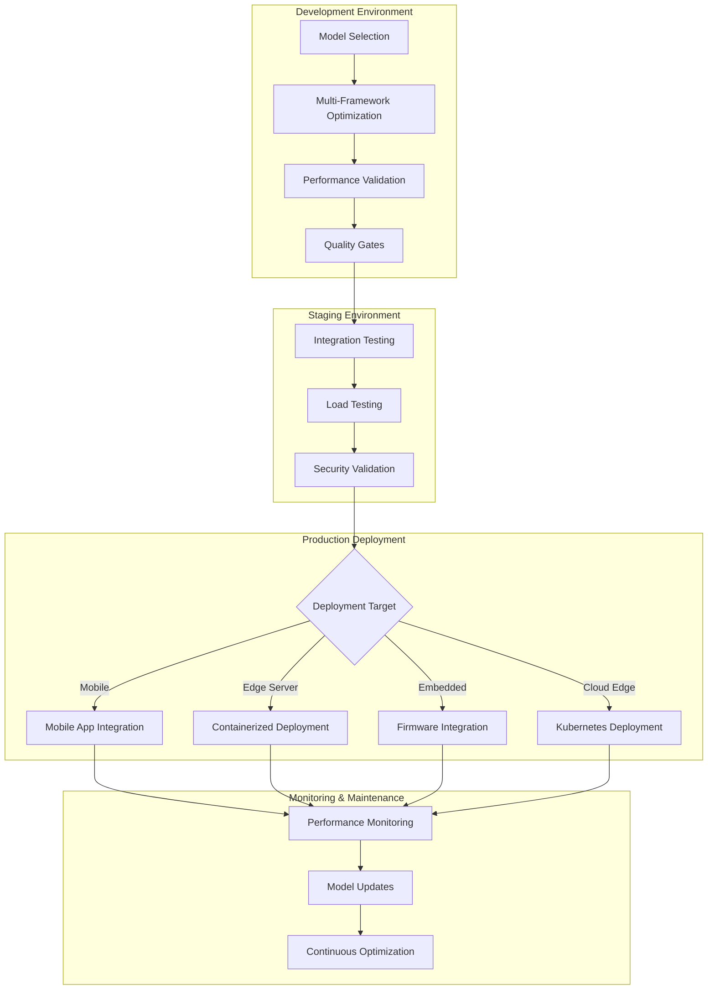

<!--
CO_OP_TRANSLATOR_METADATA:
{
  "original_hash": "6719c4a7e44b948230ac5f5cab3699bd",
  "translation_date": "2025-10-11T11:44:42+00:00",
  "source_file": "Module04/06.workflow-synthesis.md",
  "language_code": "ta"
}
-->
# பகுதி 6: எட்ஜ் ஏஐ மேம்பாட்டு பணியாளர் ஒத்திசைவு

## உள்ளடக்க அட்டவணை
1. [அறிமுகம்](../../../Module04)
2. [கற்றல் நோக்கங்கள்](../../../Module04)
3. [ஒற்றுமையான பணியாளர் மேற்பார்வை](../../../Module04)
4. [சட்டப்பூர்வமான கட்டமைப்பு தேர்வு அட்டவணை](../../../Module04)
5. [சிறந்த நடைமுறைகள் ஒத்திசைவு](../../../Module04)
6. [விநியோக உத்தி வழிகாட்டி](../../../Module04)
7. [செயல்திறன் மேம்பாட்டு பணியாளர்](../../../Module04)
8. [தயாரிப்பு தயார்நிலை சரிபார்ப்பு பட்டியல்](../../../Module04)
9. [சிக்கல்களை தீர்க்குதல் மற்றும் கண்காணித்தல்](../../../Module04)
10. [உங்கள் எட்ஜ் ஏஐ குழாய்களை எதிர்காலத்திற்கேற்ப மாற்றுதல்](../../../Module04)

## அறிமுகம்

எட்ஜ் ஏஐ மேம்பாடு பல்வேறு மேம்பாட்டு கட்டமைப்புகள், விநியோக உத்திகள் மற்றும் ஹார்ட்வேர் கருத்துக்களை நுட்பமாகப் புரிந்துகொள்வதை தேவைப்படுத்துகிறது. இந்த விரிவான ஒத்திசைவு Llama.cpp, Microsoft Olive, OpenVINO மற்றும் Apple MLX ஆகியவற்றின் அறிவுகளை ஒருங்கிணைத்து, திறன் அதிகரிப்பு, தரம் பராமரிப்பு மற்றும் வெற்றிகரமான தயாரிப்பு விநியோகத்தை உறுதிசெய்யும் ஒரு ஒற்றுமையான பணியாளரை உருவாக்குகிறது.

இந்த பாடநெறியின் முழுவதும், ஒவ்வொரு தனிப்பட்ட மேம்பாட்டு கட்டமைப்புகளையும் ஆராய்ந்துள்ளோம், ஒவ்வொன்றும் தனித்துவமான பலவீனங்கள் மற்றும் சிறப்பு பயன்பாட்டு வழக்குகளுடன். எனினும், உண்மையான உலக எட்ஜ் ஏஐ திட்டங்கள் பெரும்பாலும் பல கட்டமைப்புகளிலிருந்து தொழில்நுட்பங்களை இணைக்க அல்லது குறிப்பிட்ட கட்டுப்பாடுகள் மற்றும் தேவைகளுக்கு சிறந்த முடிவுகளை வழங்கும் அணுகுமுறைகளைப் பற்றி மூலதன முடிவுகளை எடுக்க வேண்டும்.

இந்த பகுதி அனைத்து கட்டமைப்புகளின் கூட்டு அறிவை செயல்படுத்தக்கூடிய பணியாளர்கள், முடிவெடுக்கும் மரங்கள் மற்றும் சிறந்த நடைமுறைகளாக ஒத்திசைக்கிறது, இது உங்களை தயாரிப்பு தயார்நிலை எட்ஜ் ஏஐ தீர்வுகளை திறம்படவும் திறமையாகவும் உருவாக்க உதவுகிறது. நீங்கள் மொபைல் சாதனங்கள், எம்பெடட் அமைப்புகள் அல்லது எட்ஜ் சர்வர்களுக்காக மேம்படுத்துகிறீர்களா என்பதை பொருட்படுத்தாமல், இந்த வழிகாட்டி உங்கள் மேம்பாட்டு வாழ்க்கைச் சுழற்சியின் முழு நீளத்திலும் தகவல்தரமான முடிவுகளை எடுக்க உங்களுக்கு மூலதன அமைப்பை வழங்குகிறது.

## கற்றல் நோக்கங்கள்

இந்தப் பகுதியின் முடிவில், நீங்கள் பின்வரும் திறன்களை பெறுவீர்கள்:

### மூலதன முடிவெடுக்கும் திறன்
- திட்ட தேவைகள், ஹார்ட்வேர் கட்டுப்பாடுகள் மற்றும் விநியோக சூழ்நிலைகளின் அடிப்படையில் **சிறந்த மேம்பாட்டு கட்டமைப்பை மதிப்பீடு செய்து தேர்வு செய்யவும்**
- **அதிகபட்ச திறனை வழங்கும் பல்வேறு மேம்பாட்டு தொழில்நுட்பங்களை ஒருங்கிணைக்கும் விரிவான பணியாளர்களை வடிவமைக்கவும்**
- **மாதிரியின் துல்லியம், தீர்மான வேகம், நினைவக பயன்பாடு மற்றும் விநியோக சிக்கல்களுக்கிடையிலான பரிமாற்றங்களை மதிப்பீடு செய்யவும்**

### பணியாளர் ஒருங்கிணைப்பு
- **பல மேம்பாட்டு கட்டமைப்புகளின் பலவீனங்களைப் பயன்படுத்தும் ஒற்றுமையான மேம்பாட்டு குழாய்களை செயல்படுத்தவும்**
- **வேறுபட்ட சூழல்களில் மாறுபாடற்ற மாதிரி மேம்பாடு மற்றும் விநியோகத்திற்கான மறுபடியும் செய்யக்கூடிய பணியாளர்களை உருவாக்கவும்**
- **தர நுழைவாயில்கள் மற்றும் சரிபார்ப்பு செயல்முறைகளை நிறுவவும்** மேம்படுத்தப்பட்ட மாதிரிகள் தயாரிப்பு தேவைகளை பூர்த்தி செய்ய உறுதிசெய்ய

### செயல்திறன் மேம்பாடு
- **குவாண்டைசேஷன், பிரூனிங் மற்றும் ஹார்ட்வேர்-சிறப்பு துரிதமாக்கல் தொழில்நுட்பங்களைப் பயன்படுத்தி முறைமையான மேம்பாட்டு உத்திகளைப் பயன்படுத்தவும்**
- **வேறுபட்ட மேம்பாட்டு நிலைகள் மற்றும் விநியோக இலக்குகளுக்கு மத்தியில் மாதிரி செயல்திறனை கண்காணித்து ஒப்பிடவும்**
- **குறிப்பிட்ட ஹார்ட்வேர் தளங்களுக்கு மேம்படுத்தவும்** CPU, GPU, NPU மற்றும் சிறப்பு எட்ஜ் துரிதமாக்கிகள் உட்பட

### தயாரிப்பு விநியோகம்
- **பல மாதிரி வடிவங்கள் மற்றும் தீர்மான இயந்திரங்களை ஏற்றுக்கொள்ளும் அளவிலான விநியோக கட்டமைப்புகளை வடிவமைக்கவும்**
- **தயாரிப்பு சூழல்களில் எட்ஜ் ஏஐ பயன்பாடுகளுக்கான கண்காணிப்பு மற்றும் கண்காணிப்பை செயல்படுத்தவும்**
- **மாதிரி புதுப்பிப்புகள், செயல்திறன் கண்காணிப்பு மற்றும் அமைப்பு மேம்பாட்டுக்கான பராமரிப்பு பணியாளர்களை நிறுவவும்**

### குறுக்கு தள சிறப்பம்சம்
- **மாறுபாடற்ற செயல்திறனை பராமரிக்கும்போது பல்வேறு ஹார்ட்வேர் தளங்களில் மேம்படுத்தப்பட்ட மாதிரிகளை விநியோகிக்கவும்**
- **Windows, macOS, Linux, மொபைல் மற்றும் எம்பெடட் அமைப்புகளுக்கான தள-சிறப்பு மேம்பாடுகளை கையாளவும்**
- **வேறுபட்ட எட்ஜ் சூழல்களில் மாறுபாடற்ற விநியோகத்தை இயக்கும் அப்ஸ்ட்ராக்ஷன் அடுக்குகளை உருவாக்கவும்**

## ஒற்றுமையான பணியாளர் மேற்பார்வை

### கட்டம் 1: தேவைகள் பகுப்பாய்வு மற்றும் கட்டமைப்பு தேர்வு

வெற்றிகரமான எட்ஜ் ஏஐ விநியோகத்தின் அடிப்படை தேவைகள் பகுப்பாய்வு மூலம் தொடங்குகிறது, இது கட்டமைப்பு தேர்வு மற்றும் மேம்பாட்டு உத்தியைத் தகவலளிக்கிறது.

#### 1.1 ஹார்ட்வேர் மதிப்பீடு


**முக்கிய கருத்துக்கள்:**
- **CPU கட்டமைப்பு**: x86, ARM, Apple Silicon திறன்கள்
- **துரிதமாக்கல் கிடைக்கும் தன்மை**: GPU, NPU, VPU, சிறப்பு ஏஐ சிப்
- **நினைவக கட்டுப்பாடுகள்**: RAM வரம்புகள், சேமிப்பு திறன்
- **மின்சார வரம்பு**: பேட்டரி ஆயுள், வெப்ப கட்டுப்பாடுகள்
- **இணைப்பு**: ஆஃப்லைன் தேவைகள், பேண்ட்விட்த் வரம்புகள்

#### 1.2 பயன்பாட்டு தேவைகள் அட்டவணை

| தேவைகள் | Llama.cpp | Microsoft Olive | OpenVINO | Apple MLX |
|---------|-----------|-----------------|----------|-----------|
| குறுக்கு தளம் | ✅ சிறந்தது | ⚡ நல்லது | ⚡ நல்லது | ❌ ஆப்பிள் மட்டும் |
| நிறுவன ஒருங்கிணைப்பு | ⚡ அடிப்படை | ✅ சிறந்தது | ✅ சிறந்தது | ⚡ வரையறுக்கப்பட்டது |
| மொபைல் விநியோகம் | ✅ சிறந்தது | ⚡ நல்லது | ⚡ நல்லது | ✅ iOS சிறந்தது |
| நேரடி தீர்மானம் | ✅ சிறந்தது | ✅ சிறந்தது | ✅ சிறந்தது | ✅ சிறந்தது |
| மாதிரி பல்வகைமை | ✅ LLM மையம் | ✅ அனைத்து மாதிரிகளும் | ✅ அனைத்து மாதிரிகளும் | ✅ LLM மையம் |
| பயன்படுத்த எளிது | ✅ எளிமையானது | ✅ தானியங்கி | ⚡ மிதமானது | ✅ எளிமையானது |

### கட்டம் 2: மாதிரி தயாரிப்பு மற்றும் மேம்பாடு

#### 2.1 உலகளாவிய மாதிரி மதிப்பீடு குழாய்

```python
# Universal Model Assessment Framework
class EdgeAIModelAssessment:
    def __init__(self, model_path, target_hardware):
        self.model_path = model_path
        self.target_hardware = target_hardware
        self.optimization_frameworks = []
        
    def assess_model_characteristics(self):
        """Analyze model size, architecture, and complexity"""
        return {
            'model_size': self.get_model_size(),
            'parameter_count': self.get_parameter_count(),
            'architecture_type': self.detect_architecture(),
            'quantization_compatibility': self.check_quantization_support()
        }
    
    def recommend_optimization_strategy(self):
        """Recommend optimal frameworks and techniques"""
        characteristics = self.assess_model_characteristics()
        
        if self.target_hardware.startswith('apple'):
            return self.mlx_optimization_strategy(characteristics)
        elif self.target_hardware.startswith('intel'):
            return self.openvino_optimization_strategy(characteristics)
        elif characteristics['model_size'] > 7_000_000_000:  # 7B+ parameters
            return self.enterprise_optimization_strategy(characteristics)
        else:
            return self.lightweight_optimization_strategy(characteristics)
```

#### 2.2 பல கட்டமைப்பு மேம்பாட்டு குழாய்

**தொடர்ச்சியான மேம்பாட்டு அணுகுமுறை:**
1. **ஆரம்ப மாற்றம்**: இடைநிலை வடிவத்திற்கு மாற்றவும் (ONNX சாத்தியமானால்)
2. **கட்டமைப்பு-சிறப்பு மேம்பாடு**: சிறப்பு தொழில்நுட்பங்களைப் பயன்படுத்தவும்
3. **குறுக்கு சரிபார்ப்பு**: இலக்கு தளங்களில் செயல்திறனை சரிபார்க்கவும்
4. **இறுதி தொகுப்பு**: விநியோகத்திற்காக தயாரிக்கவும்

```bash
# Multi-Framework Optimization Script
#!/bin/bash

MODEL_NAME="phi-3-mini"
BASE_MODEL="microsoft/Phi-3-mini-4k-instruct"

# Phase 1: ONNX Conversion (Universal)
python convert_to_onnx.py --model $BASE_MODEL --output models/onnx/

# Phase 2: Platform-Specific Optimization
if [[ "$TARGET_PLATFORM" == "intel" ]]; then
    # OpenVINO Optimization
    python optimize_openvino.py --input models/onnx/ --output models/openvino/
elif [[ "$TARGET_PLATFORM" == "apple" ]]; then
    # MLX Optimization
    python optimize_mlx.py --input $BASE_MODEL --output models/mlx/
elif [[ "$TARGET_PLATFORM" == "cross" ]]; then
    # Llama.cpp Optimization
    python convert_to_gguf.py --input models/onnx/ --output models/gguf/
fi

# Phase 3: Validation
python validate_optimization.py --original $BASE_MODEL --optimized models/$TARGET_PLATFORM/
```

### கட்டம் 3: செயல்திறன் சரிபார்ப்பு மற்றும் பெஞ்ச்மார்க்கிங்

#### 3.1 விரிவான பெஞ்ச்மார்க்கிங் கட்டமைப்பு

```python
class EdgeAIBenchmark:
    def __init__(self, optimized_models):
        self.models = optimized_models
        self.metrics = {
            'inference_time': [],
            'memory_usage': [],
            'accuracy_score': [],
            'throughput': [],
            'energy_consumption': []
        }
    
    def run_comprehensive_benchmark(self):
        """Execute standardized benchmarks across all optimized models"""
        test_inputs = self.generate_test_inputs()
        
        for model_framework, model_path in self.models.items():
            print(f"Benchmarking {model_framework}...")
            
            # Latency Testing
            latency = self.measure_inference_latency(model_path, test_inputs)
            
            # Memory Profiling
            memory = self.profile_memory_usage(model_path)
            
            # Accuracy Validation
            accuracy = self.validate_model_accuracy(model_path, test_inputs)
            
            # Throughput Analysis
            throughput = self.measure_throughput(model_path)
            
            self.record_metrics(model_framework, latency, memory, accuracy, throughput)
    
    def generate_optimization_report(self):
        """Create comprehensive comparison report"""
        report = {
            'recommendations': self.analyze_performance_trade_offs(),
            'deployment_guidance': self.generate_deployment_recommendations(),
            'monitoring_requirements': self.define_monitoring_metrics()
        }
        return report
```

## சட்டப்பூர்வமான கட்டமைப்பு தேர்வு அட்டவணை

### கட்டமைப்பு தேர்வுக்கான முடிவு மரம்



### விரிவான தேர்வு அளவுகோல்கள்

#### 1. முதன்மை பயன்பாட்டு வழக்கு ஒத்திசைவு

**பெரிய மொழி மாதிரிகள் (LLMs):**
- **Llama.cpp**: CPU மையம், குறுக்கு தள விநியோகத்திற்காக சிறந்தது
- **Apple MLX**: ஒருங்கிணைந்த நினைவகத்துடன் ஆப்பிள் சிலிகான் சிறந்தது
- **OpenVINO**: NNCF மேம்பாட்டுடன் இன்டெல் ஹார்ட்வேர் சிறந்தது
- **Microsoft Olive**: தானியக்கத்துடன் நிறுவன பணியாளர்களுக்கு சிறந்தது

**பலவகை மாதிரிகள்:**
- **OpenVINO**: பார்வை, ஒலி மற்றும் உரை ஆகியவற்றுக்கு விரிவான ஆதரவு
- **Microsoft Olive**: சிக்கலான குழாய்களுக்கு நிறுவன தரமான மேம்பாடு
- **Llama.cpp**: உரை அடிப்படையிலான மாதிரிகளுக்கு மட்டுமே
- **Apple MLX**: பலவகை பயன்பாடுகளுக்கான ஆதரவு வளர்ந்து வருகிறது

#### 2. ஹார்ட்வேர் தளம் அட்டவணை

| தளம் | முதன்மை கட்டமைப்பு | இரண்டாம் நிலை விருப்பம் | சிறப்பு அம்சங்கள் |
|------|------------------|------------------|---------------------|
| இன்டெல் CPU/GPU | OpenVINO | Microsoft Olive | NNCF சுருக்கம், இன்டெல் மேம்பாடு |
| NVIDIA GPU | Microsoft Olive | OpenVINO | CUDA துரிதமாக்கல், நிறுவன அம்சங்கள் |
| ஆப்பிள் சிலிகான் | Apple MLX | Llama.cpp | மெட்டல் ஷேடர்கள், ஒருங்கிணைந்த நினைவகம் |
| ARM மொபைல் | Llama.cpp | OpenVINO | குறுக்கு தளம், குறைந்த சார்பு |
| எட்ஜ் TPU | OpenVINO | Microsoft Olive | சிறப்பு துரிதமாக்கல் ஆதரவு |
| எம்பெடட் ARM | Llama.cpp | OpenVINO | குறைந்த அளவு, திறமையான தீர்மானம் |

#### 3. மேம்பாட்டு பணியாளர் விருப்பங்கள்

**விரைவான மாதிரி உருவாக்கம்:**
1. **Llama.cpp**: மிக வேகமான அமைப்பு, உடனடி முடிவுகள்
2. **Apple MLX**: எளிய Python API, விரைவான திருத்தம்
3. **Microsoft Olive**: தானியக்க மேம்பாடு, குறைந்த கட்டமைப்பு
4. **OpenVINO**: சிக்கலான அமைப்பு, விரிவான அம்சங்கள்

**நிறுவன தயாரிப்பு:**
1. **Microsoft Olive**: நிறுவன அம்சங்கள், Azure ஒருங்கிணைப்பு
2. **OpenVINO**: இன்டெல் சூழல், விரிவான கருவிகள்
3. **Apple MLX**: ஆப்பிள்-சிறப்பு நிறுவன பயன்பாடுகள்
4. **Llama.cpp**: எளிய விநியோகம், வரையறுக்கப்பட்ட நிறுவன அம்சங்கள்

## சிறந்த நடைமுறைகள் ஒத்திசைவு

### உலகளாவிய மேம்பாட்டு கொள்கைகள்

#### 1. முன்னேற்றமான மேம்பாட்டு உத்தி

```python
class ProgressiveOptimization:
    def __init__(self, base_model):
        self.base_model = base_model
        self.optimization_stages = [
            'baseline_measurement',
            'format_conversion',
            'quantization_optimization',
            'hardware_acceleration',
            'production_validation'
        ]
    
    def execute_progressive_optimization(self):
        """Apply optimization techniques incrementally"""
        
        # Stage 1: Baseline Measurement
        baseline_metrics = self.measure_baseline_performance()
        
        # Stage 2: Format Conversion
        converted_model = self.convert_to_optimal_format()
        conversion_metrics = self.measure_performance(converted_model)
        
        # Stage 3: Quantization
        quantized_model = self.apply_quantization(converted_model)
        quantization_metrics = self.measure_performance(quantized_model)
        
        # Stage 4: Hardware Acceleration
        accelerated_model = self.enable_hardware_acceleration(quantized_model)
        acceleration_metrics = self.measure_performance(accelerated_model)
        
        # Stage 5: Validation
        production_ready = self.validate_for_production(accelerated_model)
        
        return self.compile_optimization_report(
            baseline_metrics, conversion_metrics, 
            quantization_metrics, acceleration_metrics
        )
```

#### 2. தர நுழைவாயில் செயல்படுத்தல்

**துல்லியத்தை பராமரிக்கும் நுழைவாயில்கள்:**
- அசல் மாதிரி துல்லியத்தின் 95% க்கும் மேல் பராமரிக்கவும்
- பிரதிநிதித்துவ சோதனை தரவுத்தொகுப்புகளுக்கு எதிராக சரிபார்க்கவும்
- தயாரிப்பு சரிபார்ப்புக்கு A/B சோதனையை செயல்படுத்தவும்

**செயல்திறன் மேம்பாட்டு நுழைவாயில்கள்:**
- குறைந்தபட்சம் 2 மடங்கு வேக மேம்பாட்டை அடையவும்
- நினைவக அளவை குறைந்தது 50% குறைக்கவும்
- தீர்மான நேரத்தின் நிலைத்தன்மையை சரிபார்க்கவும்

**தயாரிப்பு தயார்நிலை நுழைவாயில்கள்:**
- சுமை கீழ் அழுத்த சோதனையை கடக்கவும்
- காலப்போக்கில் நிலையான செயல்திறனை நிரூபிக்கவும்
- பாதுகாப்பு மற்றும் தனியுரிமை தேவைகளை சரிபார்க்கவும்

### கட்டமைப்பு-சிறப்பு சிறந்த நடைமுறைகள் ஒருங்கிணைப்பு

#### 1. குவாண்டைசேஷன் உத்தி ஒத்திசைவு

```python
# Unified Quantization Approach
class UnifiedQuantizationStrategy:
    def __init__(self, model, target_platform):
        self.model = model
        self.platform = target_platform
        
    def select_optimal_quantization(self):
        """Choose best quantization based on platform and requirements"""
        
        if self.platform == 'apple_silicon':
            return self.mlx_quantization_strategy()
        elif self.platform == 'intel_hardware':
            return self.openvino_quantization_strategy()
        elif self.platform == 'cross_platform':
            return self.llamacpp_quantization_strategy()
        else:
            return self.olive_quantization_strategy()
    
    def mlx_quantization_strategy(self):
        """Apple MLX-specific quantization"""
        return {
            'method': 'mlx_quantize',
            'precision': 'int4',
            'group_size': 64,
            'optimization_target': 'unified_memory'
        }
    
    def openvino_quantization_strategy(self):
        """OpenVINO NNCF quantization"""
        return {
            'method': 'nncf_quantize',
            'precision': 'int8',
            'calibration_method': 'post_training',
            'optimization_target': 'intel_hardware'
        }
```

#### 2. ஹார்ட்வேர் துரிதமாக்கல் மேம்பாடு

**CPU மேம்பாட்டு ஒத்திசைவு:**
- **SIMD வழிமுறைகள்**: கட்டமைப்புகளின் முழுவதும் மேம்பட்ட கர்னல்களைப் பயன்படுத்தவும்
- **நினைவக அகலம்**: கேஷ் திறனுக்காக தரவுத் தளவமைப்புகளை மேம்படுத்தவும்
- **துணைமாற்றம்**: வளங்களின் கட்டுப்பாடுகளுடன் இணக்கமாக பாறலெலிசத்தை சமநிலைப்படுத்தவும்

**GPU துரிதமாக்கல் சிறந்த நடைமுறைகள்:**
- **தொகுப்பு செயலாக்கம்**: பொருத்தமான தொகுப்பு அளவுகளுடன் திறனைக் அதிகரிக்கவும்
- **நினைவக மேலாண்மை**: GPU நினைவக ஒதுக்கீடு மற்றும் பரிமாற்றங்களை மேம்படுத்தவும்
- **துல்லியம்**: சிறந்த செயல்திறனுக்காக FP16 ஐ பயன்படுத்தவும்

**NPU/சிறப்பு துரிதமாக்கல் மேம்பாடு:**
- **மாதிரி கட்டமைப்பு**: துரிதமாக்கல் திறன்களுடன் இணக்கமாக உறுதிசெய்யவும்
- **தரவு ஓட்டம்**: துரிதமாக்கல் திறனுக்காக உள்ளீடு/வெளியீடு குழாய்களை மேம்படுத்தவும்
- **மாற்று உத்திகள்**: ஆதரிக்கப்படாத செயல்பாடுகளுக்கு CPU மாற்று செயல்பாட்டை செயல்படுத்தவும்

## விநியோக உத்தி வழிகாட்டி

### உலகளாவிய விநியோக கட்டமைப்பு



### தளம்-சிறப்பு விநியோக முறை

#### 1. மொபைல் விநியோக உத்தி

```yaml
# Mobile Deployment Configuration
mobile_deployment:
  ios:
    framework: apple_mlx
    optimization:
      quantization: int4
      memory_mapping: true
      background_execution: limited
    packaging:
      format: mlx
      bundle_size: <50MB
      
  android:
    framework: llama_cpp
    optimization:
      quantization: q4_k_m
      threading: android_optimized
      memory_management: conservative
    packaging:
      format: gguf
      apk_size: <100MB
      
  cross_platform:
    framework: onnx_runtime
    optimization:
      quantization: int8
      execution_provider: cpu
    packaging:
      format: onnx
      shared_libraries: minimal
```

#### 2. எட்ஜ் சர்வர் விநியோகம்

```yaml
# Edge Server Deployment Configuration
edge_server:
  intel_based:
    framework: openvino
    optimization:
      quantization: int8
      acceleration: cpu_gpu_auto
      batch_processing: dynamic
    deployment:
      container: openvino_runtime
      orchestration: kubernetes
      scaling: horizontal
      
  nvidia_based:
    framework: microsoft_olive
    optimization:
      quantization: int4
      acceleration: cuda
      tensor_parallelism: true
    deployment:
      container: nvidia_triton
      orchestration: kubernetes
      scaling: gpu_aware
```

### கண்டெய்னரேஷன் சிறந்த நடைமுறைகள்

```dockerfile
# Multi-Framework Edge AI Container
FROM ubuntu:22.04 as base

# Install common dependencies
RUN apt-get update && apt-get install -y \
    python3 \
    python3-pip \
    build-essential \
    cmake \
    && rm -rf /var/lib/apt/lists/*

# Framework-specific stages
FROM base as openvino
RUN pip install openvino nncf optimum[intel]

FROM base as llamacpp
RUN git clone https://github.com/ggerganov/llama.cpp.git \
    && cd llama.cpp && make LLAMA_OPENBLAS=1

FROM base as olive
RUN pip install olive-ai[auto-opt] onnxruntime-genai

# Production stage with selected framework
FROM openvino as production
COPY models/ /app/models/
COPY src/ /app/src/
WORKDIR /app

EXPOSE 8080
CMD ["python3", "src/inference_server.py"]
```

## செயல்திறன் மேம்பாட்டு பணியாளர்

### முறைமையான செயல்திறன் சீரமைப்பு

#### 1. செயல்திறன் சுயவிவர குழாய்

```python
class EdgeAIPerformanceProfiler:
    def __init__(self, model_path, framework):
        self.model_path = model_path
        self.framework = framework
        self.profiling_results = {}
    
    def comprehensive_profiling(self):
        """Execute comprehensive performance analysis"""
        
        # CPU Profiling
        cpu_profile = self.profile_cpu_usage()
        
        # Memory Profiling
        memory_profile = self.profile_memory_usage()
        
        # Inference Latency
        latency_profile = self.profile_inference_latency()
        
        # Throughput Analysis
        throughput_profile = self.profile_throughput()
        
        # Energy Consumption (where available)
        energy_profile = self.profile_energy_consumption()
        
        return self.compile_performance_report(
            cpu_profile, memory_profile, latency_profile,
            throughput_profile, energy_profile
        )
    
    def identify_bottlenecks(self):
        """Automatically identify performance bottlenecks"""
        bottlenecks = []
        
        if self.profiling_results['cpu_utilization'] > 80:
            bottlenecks.append('cpu_bound')
        
        if self.profiling_results['memory_usage'] > 90:
            bottlenecks.append('memory_bound')
        
        if self.profiling_results['inference_variance'] > 20:
            bottlenecks.append('inconsistent_performance')
        
        return self.generate_optimization_recommendations(bottlenecks)
```

#### 2. தானியக்க மேம்பாட்டு குழாய்

```python
class AutomatedOptimizationPipeline:
    def __init__(self, base_model, target_constraints):
        self.base_model = base_model
        self.constraints = target_constraints
        self.optimization_history = []
    
    def execute_optimization_search(self):
        """Systematically search optimization space"""
        
        optimization_candidates = [
            {'quantization': 'int8', 'pruning': 0.1},
            {'quantization': 'int4', 'pruning': 0.2},
            {'quantization': 'int8', 'acceleration': 'gpu'},
            {'quantization': 'int4', 'acceleration': 'npu'}
        ]
        
        best_configuration = None
        best_score = 0
        
        for config in optimization_candidates:
            optimized_model = self.apply_optimization(config)
            score = self.evaluate_optimization(optimized_model)
            
            if score > best_score and self.meets_constraints(optimized_model):
                best_score = score
                best_configuration = config
            
            self.optimization_history.append({
                'config': config,
                'score': score,
                'model': optimized_model
            })
        
        return best_configuration, self.optimization_history
```

### பல நோக்கங்களுக்கான மேம்பாடு

#### 1. எட்ஜ் ஏஐக்கு பாரிடோ மேம்பாடு

```python
class ParetoOptimization:
    def __init__(self, objectives=['speed', 'accuracy', 'memory']):
        self.objectives = objectives
        self.pareto_frontier = []
    
    def find_pareto_optimal_solutions(self, optimization_results):
        """Identify Pareto-optimal configurations"""
        
        for result in optimization_results:
            is_dominated = False
            
            for frontier_point in self.pareto_frontier:
                if self.dominates(frontier_point, result):
                    is_dominated = True
                    break
            
            if not is_dominated:
                # Remove dominated points from frontier
                self.pareto_frontier = [
                    point for point in self.pareto_frontier 
                    if not self.dominates(result, point)
                ]
                
                self.pareto_frontier.append(result)
        
        return self.pareto_frontier
    
    def recommend_configuration(self, user_preferences):
        """Recommend configuration based on user preferences"""
        
        weighted_scores = []
        for config in self.pareto_frontier:
            score = sum(
                user_preferences[obj] * config['metrics'][obj] 
                for obj in self.objectives
            )
            weighted_scores.append((score, config))
        
        return max(weighted_scores, key=lambda x: x[0])[1]
```

## தயாரிப்பு தயார்நிலை சரிபார்ப்பு பட்டியல்

### விரிவான தயாரிப்பு சரிபார்ப்பு

#### 1. மாதிரி தர உறுதி

```python
class ProductionReadinessValidator:
    def __init__(self, optimized_model, production_requirements):
        self.model = optimized_model
        self.requirements = production_requirements
        self.validation_results = {}
    
    def validate_model_quality(self):
        """Comprehensive model quality validation"""
        
        # Accuracy Validation
        accuracy_result = self.validate_accuracy()
        
        # Performance Validation
        performance_result = self.validate_performance()
        
        # Robustness Testing
        robustness_result = self.validate_robustness()
        
        # Security Assessment
        security_result = self.validate_security()
        
        # Compliance Verification
        compliance_result = self.validate_compliance()
        
        return self.compile_validation_report(
            accuracy_result, performance_result, robustness_result,
            security_result, compliance_result
        )
    
    def generate_certification_report(self):
        """Generate production certification report"""
        return {
            'model_signature': self.generate_model_signature(),
            'validation_timestamp': datetime.now(),
            'validation_results': self.validation_results,
            'deployment_approval': self.check_deployment_approval(),
            'monitoring_requirements': self.define_monitoring_requirements()
        }
```

#### 2. தயாரிப்பு விநியோக சரிபார்ப்பு பட்டியல்

**விநியோகத்திற்கு முந்தைய சரிபார்ப்பு:**
- [ ] மாதிரி துல்லியம் குறைந்தபட்ச தேவைகளை பூர்த்தி செய்கிறது (>95% அடிப்படை)
- [ ] செயல்திறன் இலக்குகள் அடைந்துள்ளன (தாமதம், திறன், நினைவகம்)
- [ ] பாதுகாப்பு பாதிப்பு மதிப்பீடு செய்யப்பட்டு சரிசெய்யப்பட்டுள்ளது
- [ ] எதிர்பார்க்கப்பட்ட சுமை கீழ் அழுத்த சோதனை முடிந்தது
- [ ] தோல்வி சூழ்நிலைகள் சோதிக்கப்பட்டு மீட்பு செயல்முறைகள் உறுதிசெய்யப்பட்டுள்ளன
- [ ] கண்காணிப்பு மற்றும் எச்சரிக்கை அமைப்புகள் உள்ளன
- [ ] ரோல்பேக் செயல்முறைகள் சோதிக்கப்பட்டு ஆவணப்படுத்தப்பட்டுள்ளன

**விநியோக செயல்முறை:**
- [ ] ப்ளூ-கிரீன் விநியோக உத்தி செயல்படுத்தப்பட்டது
- [ ] படிப்படியாக போக்குவரத்து அதிகரிப்பு அமைக்கப்பட்டது
- [ ] நேரடி கண்காணிப்பு டாஷ்போர்டுகள் செயல்பாட்டில் உள்ளன
- [ ] செயல்திறன் அடிப்படைகள் நிறுவப்பட்டுள்ளன
- [ ] பிழை விகித வரம்புகள் வரையறுக்கப்பட்டுள்ள
உங்கள் குறிப்பிட்ட தேவைகளை பூர்த்தி செய்யவும், அவை மாறும் போது தழுவிக்கொள்ளும் சுதந்திரத்தையும் பராமரிக்கவும் உதவும் சிறந்த மேம்பாட்டு உத்தி தான் உங்களுக்கு ஏற்றது என்பதை நினைவில் கொள்ளுங்கள். இந்த வழிகாட்டியை தகவலறிந்த முடிவுகளை எடுக்க ஒரு அடிப்படையாக பயன்படுத்துங்கள், ஆனால் எப்போதும் உங்கள் தேர்வுகளை அனுபவ சோதனை மற்றும் நிஜ உலக பயன்பாட்டு அனுபவத்தின் மூலம் சரிபார்க்கவும்.

## ➡️ அடுத்தது என்ன

சிறிய மொழி மாதிரியின் வாழ்க்கைச் சுழற்சி மேலாண்மையின் செயல்பாட்டு அம்சங்களைப் பற்றி அறிய [Module 5: SLMOps and Production Deployment](../Module05/README.md) ஐ ஆராய்ந்து உங்கள் Edge AI பயணத்தை தொடருங்கள்.

---

**குறிப்பு**:  
இந்த ஆவணம் [Co-op Translator](https://github.com/Azure/co-op-translator) என்ற AI மொழிபெயர்ப்பு சேவையைப் பயன்படுத்தி மொழிபெயர்க்கப்பட்டுள்ளது. நாங்கள் துல்லியத்திற்காக முயற்சிக்கின்றோம், ஆனால் தானியங்கி மொழிபெயர்ப்புகளில் பிழைகள் அல்லது தவறான தகவல்கள் இருக்கக்கூடும் என்பதை கவனத்தில் கொள்ளவும். அதன் தாய்மொழியில் உள்ள மூல ஆவணம் அதிகாரப்பூர்வ ஆதாரமாக கருதப்பட வேண்டும். முக்கியமான தகவல்களுக்கு, தொழில்முறை மனித மொழிபெயர்ப்பு பரிந்துரைக்கப்படுகிறது. இந்த மொழிபெயர்ப்பைப் பயன்படுத்துவதால் ஏற்படும் எந்த தவறான புரிதல்கள் அல்லது தவறான விளக்கங்களுக்கு நாங்கள் பொறுப்பல்ல.