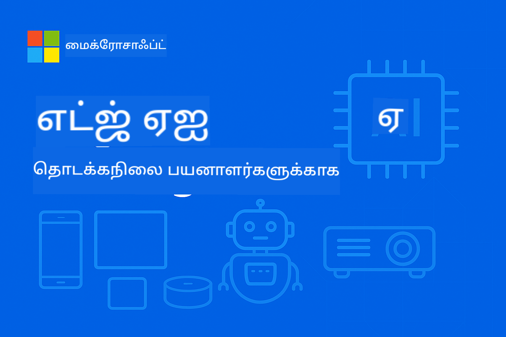

<!--
CO_OP_TRANSLATOR_METADATA:
{
  "original_hash": "22c6dae04591abc5f0d80f944ed663d5",
  "translation_date": "2025-10-11T10:57:07+00:00",
  "source_file": "introduction.md",
  "language_code": "ta"
}
-->
# Edge AI அறிமுகம் - தொடக்கநிலை பயிலரங்கம்



**Edge Artificial Intelligence**-இன் உலகத்திற்குள் உங்களை வரவேற்கிறோம் – இது ஒரு புரட்சிகரமான அணுகுமுறை, AI-யின் சக்தியை தரவுகள் உருவாகும் இடத்திலும், முடிவுகள் எடுக்க வேண்டிய இடத்திலும் நேரடியாக கொண்டு வருகிறது. Edge AI-யின் முக்கியத்துவத்தைப் புரிந்து கொள்ளவும், அதை செயல்படுத்துவதில் நிபுணத்துவம் பெறவும் இந்த அறிமுகம் அடித்தளத்தை அமைக்கிறது.

## Edge AI என்றால் என்ன?

Edge AI என்பது பாரம்பரிய cloud-அடிப்படையிலான AI செயலாக்கத்திலிருந்து **உள்ளூர், சாதனத்தில் உள்ள நுண்ணறிவு** நோக்கி ஒரு அடிப்படை மாற்றத்தை பிரதிநிதித்துவப்படுத்துகிறது. தரவுகளை தொலைதூர சேவையகங்களுக்கு அனுப்புவதற்குப் பதிலாக, Edge AI தகவல்களை edge சாதனங்களில் நேரடியாக செயலாக்குகிறது – ஸ்மார்ட்போன்கள், IoT சென்சார்கள், தொழில்துறை உபகரணங்கள், தானியங்கி வாகனங்கள் மற்றும் எம்பெடட் சிஸ்டம்கள்.

### Edge AI மாறுபாடு

```
Traditional AI:     Device → Cloud → Processing → Response → Device
Edge AI:           Device → Local Processing → Immediate Response
```

இந்த மாறுபாடு cloud-க்கு செல்லும் சுற்றுப்பயணத்தை நீக்குகிறது, இதனால்:
- **உடனடி பதில்கள்** (sub-millisecond latency)
- **மேம்பட்ட தனியுரிமை** (தரவு சாதனத்தை விட்டு வெளியே செல்லாது)
- **நம்பகமான செயல்பாடு** (இணைய இணைப்பு இல்லாமல் செயல்படுகிறது)
- **குறைந்த செலவுகள்** (குறைந்த bandwidth மற்றும் cloud கணினி பயன்பாடு)

## Edge AI இப்போது ஏன் முக்கியம்?

### புதுமையின் சரியான சூறாவளி

மூன்று தொழில்நுட்ப போக்குகள் Edge AI-யை சாத்தியமாக மட்டுமல்லாமல் அவசியமாகவும் மாற்றியுள்ளன:

1. **ஹார்ட்வேரில் புரட்சி**: நவீன chipsets (Apple Silicon, Qualcomm Snapdragon, NVIDIA Jetson) தற்போது AI acceleration-ஐ சுருக்கமான, சக்தி திறனுள்ள தொகுதிகளில் அடக்குகின்றன  
2. **மாதிரி மேம்பாடு**: Phi-4, Gemma, Mistral போன்ற Small Language Models (SLMs) பெரிய மாதிரிகளின் செயல்திறனில் 80-90% அளவுக்கு 10-20% அளவில் செயல்படுகின்றன  
3. **உலகளாவிய தேவை**: தொழில்துறைகள் cloud தீர்வுகள் வழங்க முடியாத உடனடி, தனியுரிமை மற்றும் நம்பகமான AI-யை தேவைப்படுகின்றன  

### முக்கிய வணிக இயக்கிகள்

**தனியுரிமை & ஒழுங்குமுறை**
- **மருத்துவம்**: நோயாளி தரவுகள் இடத்தில் இருக்க வேண்டும் (HIPAA ஒழுங்குமுறை)
- **நிதி**: பரிவர்த்தனை செயலாக்கம் தரவின் உரிமையை தேவைப்படுத்துகிறது
- **தொழில்துறை**: சொந்த செயல்முறைகள் வெளிப்பாட்டிலிருந்து பாதுகாப்பு தேவை

**செயல்திறன் தேவைகள்**
- **தானியங்கி வாகனங்கள்**: உயிருக்கு முக்கியமான முடிவுகள் மில்லி விநாடிகளில்
- **தொழில்துறை தானியக்கம்**: நேரடி தரம் கட்டுப்பாடு மற்றும் பாதுகாப்பு கண்காணிப்பு
- **விளையாட்டுகள் & AR/VR**: immersive அனுபவங்கள் perceptible latency இல்லாமல் தேவை

**பொருளாதார திறன்**
- **தொலைத்தொடர்பு**: IoT சென்சார் வாசிப்புகளை உள்ளூரில் செயலாக்குதல்
- **சில்லறை வணிகம்**: massive bandwidth செலவுகள் இல்லாமல் கடை உள்ளே பகுப்பாய்வு
- **சிறந்த நகரங்கள்**: ஆயிரக்கணக்கான சாதனங்களில் பகிர்ந்த நுண்ணறிவு

## Edge AI மூலம் மாற்றம் அடையும் தொழில்துறைகள்

### 🏭 **தொழில்துறை & தொழில்நுட்பம் 4.0**
- **Predictive Maintenance**: தொழில்துறை உபகரணங்களில் AI மாதிரிகள் பழுதுகளை முன்கூட்டியே கணிக்கின்றன  
- **Quality Control**: உற்பத்தி வரிசைகளில் நேரடி குறைபாடுகள் கண்டறிதல்  
- **Safety Monitoring**: உடனடி அபாய கண்டறிதல் மற்றும் பதிலளிப்பு  
- **Supply Chain**: ஒவ்வொரு node-இல் புத்திசாலி சரக்கு மேலாண்மை  

**உண்மையான தாக்கம்**: Siemens Edge AI-யை Predictive Maintenance-க்கு பயன்படுத்தி, downtime-ஐ 30-50% குறைத்து, பராமரிப்பு செலவுகளை 25% குறைத்துள்ளது.

### 🏥 **மருத்துவம் & மருத்துவ சாதனங்கள்**
- **Diagnostic Imaging**: AI-யால் இயக்கப்படும் X-ray மற்றும் MRI பகுப்பாய்வு  
- **Patient Monitoring**: அணியக்க சாதனங்கள் மூலம் தொடர்ச்சியான ஆரோக்கிய கண்காணிப்பு  
- **Surgical Assistance**: அறுவை சிகிச்சை செயல்பாடுகளின் போது நேரடி வழிகாட்டுதல்  
- **Drug Discovery**: molecular simulations-ஐ உள்ளூரில் செயலாக்குதல்  

**உண்மையான தாக்கம்**: Philips' Edge AI தீர்வுகள், radiologists-க்கு 40% வேகமாக நோய்களை கண்டறிய உதவுகிறது, 99% துல்லியத்துடன்.

### 🚗 **தானியங்கி அமைப்புகள் & போக்குவரத்து**
- **Self-Driving Vehicles**: வழிசெலுத்தல் மற்றும் பாதுகாப்புக்கான உடனடி முடிவெடுப்பு  
- **Traffic Management**: புத்திசாலி சந்திப்பு கட்டுப்பாடு மற்றும் ஓட்டம் மேம்பாடு  
- **Fleet Operations**: நேரடி பாதை மேம்பாடு மற்றும் வாகன ஆரோக்கிய கண்காணிப்பு  
- **Logistics**: தானியங்கி கிடங்கு ரோபோக்கள் மற்றும் விநியோக அமைப்புகள்  

**உண்மையான தாக்கம்**: Tesla's Full Self-Driving அமைப்பு, 40+ முடிவுகளை ஒரு விநாடியில் எடுத்து, பாதுகாப்பான தானியங்கி வழிசெலுத்தலை வழங்குகிறது.

### 🏙️ **சிறந்த நகரங்கள் & கட்டமைப்பு**
- **Public Safety**: நேரடி மிரட்டல் கண்டறிதல் மற்றும் அவசர பதிலளிப்பு  
- **Energy Management**: Smart grid optimization மற்றும் புதுப்பிக்கத்தக்க ஆற்றல் ஒருங்கிணைப்பு  
- **Environmental Monitoring**: காற்று தரம், ஒலி மாசு மற்றும் காலநிலை கண்காணிப்பு  
- **Urban Planning**: போக்குவரத்து ஓட்டம் பகுப்பாய்வு மற்றும் கட்டமைப்பு மேம்பாடு  

**உண்மையான தாக்கம்**: சிங்கப்பூரின் சிறந்த நகர திட்டம், போக்குவரத்து மேலாண்மைக்காக 100,000+ Edge AI சென்சார்களை பயன்படுத்தி, பயண நேரத்தை 25% குறைத்துள்ளது.

### 📱 **நுகர்வோர் தொழில்நுட்பம் & மொபைல்**
- **Smartphone AI**: மேம்பட்ட புகைப்படம், குரல் உதவியாளர்கள் மற்றும் தனிப்பயனாக்கம்  
- **Smart Homes**: புத்திசாலி தானியக்க மற்றும் பாதுகாப்பு அமைப்புகள்  
- **Wearable Devices**: ஆரோக்கிய கண்காணிப்பு மற்றும் உடற்பயிற்சி மேம்பாடு  
- **Gaming**: நேரடி கிராபிக்ஸ் மேம்பாடு மற்றும் விளையாட்டு மேம்பாடு  

**உண்மையான தாக்கம்**: Apple's Neural Engine, 15.8 trillion செயல்பாடுகளை ஒரு விநாடியில் உள்ளூரில் செயலாக்கி, நேரடி மொழிபெயர்ப்பு மற்றும் கணினி புகைப்படம் போன்ற அம்சங்களை இயக்குகிறது.

## Small Language Models: Edge AI-யின் இயந்திரம்

### Small Language Models (SLMs) என்றால் என்ன?

SLMs என்பது பெரிய மொழி மாதிரிகளின் **சுருக்கப்பட்ட, மேம்படுத்தப்பட்ட பதிப்புகள்**, edge deployment-க்கு குறிப்பாக வடிவமைக்கப்பட்டவை:

- **Phi-4**: 14B parameters, reasoning மற்றும் code generation-க்கு மேம்படுத்தப்பட்டது  
- **Gemma 2B/7B**: Google's பலவகை NLP பணிகளுக்கான திறமையான மாதிரிகள்  
- **Mistral-7B**: வணிகத்திற்கான அனுகூலமான உரிமத்துடன் உயர் செயல்திறன் மாதிரி  
- **Qwen Series**: Alibaba-வின் பல மொழி மாதிரிகள், மொபைல் deployment-க்கு மேம்படுத்தப்பட்டவை  

### SLM-களின் நன்மைகள்

| திறன் | பெரிய மொழி மாதிரிகள் | சிறிய மொழி மாதிரிகள் |
|------------|----------------------|----------------------|
| **அளவு** | 70B-405B parameters | 1B-14B parameters |
| **மெமரி** | 40-200GB RAM | 2-16GB RAM |
| **Inference Speed** | 2-10 seconds | 50-500ms |
| **Deployment** | High-end servers | Smartphones, embedded devices |
| **Cost** | $1000s/month | One-time hardware cost |
| **Privacy** | Data sent to cloud | Processing stays local |

### செயல்திறன் உண்மைச் சரிபார்ப்பு

நவீன SLM-கள் குறிப்பிடத்தக்க திறன்களை அடைகின்றன:
- GPT-3.5 செயல்திறனில் **90%** பல பணிகளில்  
- **நேரடி உரையாடல்** திறன்கள்  
- **Code generation மற்றும் debugging**  
- **பல மொழி மொழிபெயர்ப்பு**  
- **ஆவண பகுப்பாய்வு மற்றும் சுருக்கம்**

## கற்றல் நோக்கங்கள்

EdgeAI for Beginners course-ஐ முடிக்கும்போது, நீங்கள்:

### 🎯 **அடிப்படை அறிவு**
- Edge AI-யை ஏற்றுக்கொள்ளும் தொழில்நுட்ப மற்றும் வணிக இயக்கிகளைப் புரிந்து கொள்ளுங்கள்  
- edge மற்றும் cloud AI கட்டமைப்புகளை ஒப்பிட்டு, அவற்றின் சரியான பயன்பாடுகளை அடையாளம் காணுங்கள்  
- SLM குடும்பங்களின் பண்புகள் மற்றும் திறன்களை அடையாளம் காணுங்கள்  
- Edge AI deployment-க்கு தேவையான ஹார்ட்வேரை பகுப்பாய்வு செய்யுங்கள்  

### 🛠️ **தொழில்நுட்ப திறன்கள்**
- SLM-களை பல்வேறு தளங்களில் (Windows, mobile, embedded, cloud-edge hybrid) deploy செய்யுங்கள்  
- quantization, pruning மற்றும் compression-ஐப் பயன்படுத்தி edge கட்டுப்பாடுகளுக்கு மாதிரிகளை மேம்படுத்துங்கள்  
- Edge AI பயன்பாடுகளை கண்காணிப்பு மற்றும் அளவீட்டுடன் செயல்படுத்துங்கள்  
- சிக்கலான workflows-க்கு multi-agent systems மற்றும் function-calling frameworks உருவாக்குங்கள்  

### 🏗️ **நடைமுறை செயல்பாடு**
- உள்ளூர் மாதிரி மாற்றம் மற்றும் உரையாடல் மேலாண்மையுடன் chat பயன்பாடுகளை உருவாக்குங்கள்  
- உள்ளூர் ஆவண செயலாக்கத்துடன் RAG (Retrieval-Augmented Generation) அமைப்புகளை உருவாக்குங்கள்  
- சிறப்பு AI மாதிரிகளை புத்திசாலியாகத் தேர்ந்தெடுக்கும் model routers உருவாக்குங்கள்  
- streaming, health monitoring மற்றும் error handling உடன் API frameworks வடிவமைக்குங்கள்  

### 🚀 **உற்பத்தி deployment**
- மாதிரி பதிப்பாக்கம், சோதனை மற்றும் deployment-க்கு SLMOps pipelines அமைக்குங்கள்  
- Edge AI பயன்பாடுகளுக்கு பாதுகாப்பு சிறந்த நடைமுறைகளை செயல்படுத்துங்கள்  
- Edge மற்றும் cloud செயலாக்கத்தை சமநிலைப்படுத்தும் அளவீட்டு கட்டமைப்புகளை வடிவமைக்குங்கள்  
- உற்பத்தி Edge AI அமைப்புகளுக்கு கண்காணிப்பு மற்றும் பராமரிப்பு உத்திகளை உருவாக்குங்கள்  

## கற்றல் முடிவுகள்

பயிலரங்கத்தை முடித்தவுடன், நீங்கள்:

### **தொழில்நுட்ப நிபுணத்துவம்**
✅ **Windows, mobile மற்றும் embedded தளங்களில்** உற்பத்தி-தயார் Edge AI தீர்வுகளை deploy செய்யுங்கள்  
✅ **Edge கட்டுப்பாடுகளுக்கு AI மாதிரிகளை மேம்படுத்துங்கள்**, 75% அளவைக் குறைத்து 85% செயல்திறனைப் பெறுங்கள்  
✅ **Function calling மற்றும் multi-model orchestration உடன் புத்திசாலி agent அமைப்புகளை உருவாக்குங்கள்**  
✅ **Edge-cloud hybrid கட்டமைப்புகளை** நிறுவன பயன்பாடுகளுக்கு உருவாக்குங்கள்  

### **தொழில்துறை பயன்பாடுகள்**
✅ **Predictive maintenance மற்றும் quality control**-க்கு தொழில்துறை தீர்வுகளை வடிவமைக்குங்கள்  
✅ **தனியுரிமை-ஒழுங்குமுறை நோயாளி தரவுகளை செயலாக்க** மருத்துவ பயன்பாடுகளை உருவாக்குங்கள்  
✅ **நேரடி முடிவெடுப்பு மற்றும் பாதுகாப்புக்கான** வாகன அமைப்புகளை உருவாக்குங்கள்  
✅ **Traffic, safety மற்றும் environmental monitoring**-க்கு சிறந்த நகர கட்டமைப்புகளை உருவாக்குங்கள்  

### **தொழில் முன்னேற்றம்**
✅ **EdgeAI Solutions Architect**: முழுமையான Edge AI உத்திகளை வடிவமைக்குங்கள்  
✅ **ML Engineer (Edge Specialization)**: Edge சூழல்களுக்கு மாதிரிகளை மேம்படுத்தி deploy செய்யுங்கள்  
✅ **IoT AI Developer**: உள்ளூர் செயலாக்கத்துடன் புத்திசாலி IoT அமைப்புகளை உருவாக்குங்கள்  
✅ **Mobile AI Developer**: உள்ளூர் inference உடன் AI-யால் இயக்கப்படும் மொபைல் பயன்பாடுகளை உருவாக்குங்கள்  

## பாடத்திட்ட கட்டமைப்பு

இந்த course **progressive mastery approach**-ஐ பின்பற்றுகிறது:

### **அடித்தளம்: Phase 1** (Modules 01-02)
கோட்பாட்டை புரிந்து கொள்ளவும், மாதிரி குடும்பங்களை ஆராயவும்

### **செயல்படுத்தல்: Phase 2** (Modules 03-04) 
Deployment மற்றும் optimization தொழில்நுட்பங்களில் நிபுணத்துவம் பெறுங்கள்

### **உற்பத்தி: Phase 3** (Modules 05-06)
SLMOps மற்றும் மேம்பட்ட agent frameworks கற்றுக்கொள்ளுங்கள்

### **சிறப்பு: Phase 4** (Modules 07-08)
தள-குறிப்பான செயல்படுத்தல் மற்றும் விரிவான மாதிரிகள்

## வெற்றியின் அளவுகோல்கள்

இந்த tangible முடிவுகளுடன் உங்கள் முன்னேற்றத்தை கண்காணிக்கவும்:

- **Portfolio Projects**: பல தொழில்துறைகளை உள்ளடக்கிய 10+ உற்பத்தி-தயார் பயன்பாடுகள்  
- **Performance Benchmarks**: Edge சாதனங்களில் <500ms inference நேரத்துடன் மாதிரிகள்  
- **Deployment Targets**: Windows, mobile மற்றும் embedded தளங்களில் செயல்படும் பயன்பாடுகள்  
- **Enterprise Readiness**: கண்காணிப்பு, அளவீட்டு மற்றும் பாதுகாப்பு கட்டமைப்புகளுடன் தீர்வுகள்  

## தொடங்குதல்

AI deployment பற்றிய உங்கள் புரிதலை மாற்ற தயாரா? உங்கள் பயணம் **[Module 01: EdgeAI Fundamentals](./Module01/README.md)**-இன் மூலம் தொடங்குகிறது, Edge AI-யை சாத்தியமாக்கும் தொழில்நுட்ப அடித்தளங்களை ஆராயவும், தொழில்துறை முன்னோடிகளின் உண்மையான வழக்குக் களங்களைப் பரிசீலிக்கவும்.

**அடுத்த படி**: [📚 Module 01 - EdgeAI Fundamentals →](./Module01/README.md)

---

**AI-யின் எதிர்காலம் உள்ளூர், உடனடி மற்றும் தனியுரிமை கொண்டது. Edge AI-யை கற்றுக்கொண்டு புத்திசாலி பயன்பாடுகளின் அடுத்த தலைமுறையை உருவாக்குங்கள்.**

---

**குறிப்பு**:  
இந்த ஆவணம் [Co-op Translator](https://github.com/Azure/co-op-translator) என்ற AI மொழிபெயர்ப்பு சேவையைப் பயன்படுத்தி மொழிபெயர்க்கப்பட்டுள்ளது. நாங்கள் துல்லியத்திற்காக முயற்சிக்கின்றோம், ஆனால் தானியங்கி மொழிபெயர்ப்புகளில் பிழைகள் அல்லது தவறான தகவல்கள் இருக்கக்கூடும் என்பதை தயவுசெய்து கவனத்தில் கொள்ளவும். அதன் தாய்மொழியில் உள்ள மூல ஆவணம் அதிகாரப்பூர்வ ஆதாரமாக கருதப்பட வேண்டும். முக்கியமான தகவல்களுக்கு, தொழில்முறை மனித மொழிபெயர்ப்பு பரிந்துரைக்கப்படுகிறது. இந்த மொழிபெயர்ப்பைப் பயன்படுத்துவதால் ஏற்படும் எந்த தவறான புரிதல்கள் அல்லது தவறான விளக்கங்களுக்கு நாங்கள் பொறுப்பல்ல.