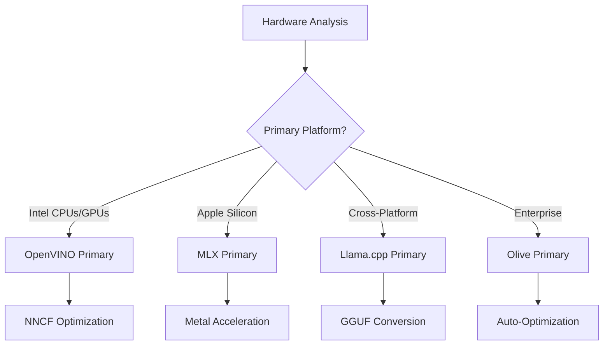
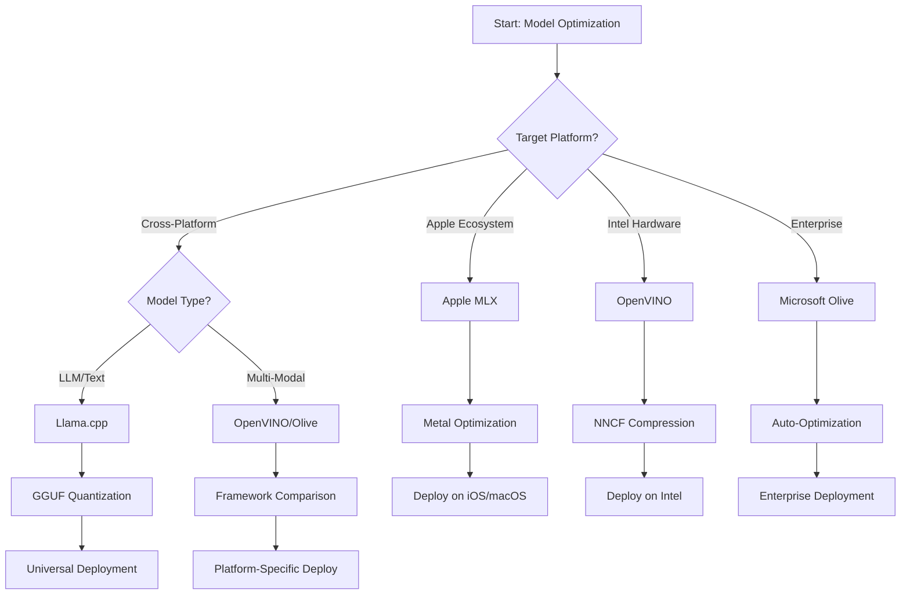
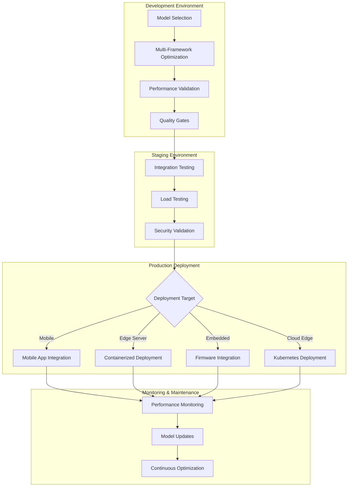

<!--
CO_OP_TRANSLATOR_METADATA:
{
  "original_hash": "6719c4a7e44b948230ac5f5cab3699bd",
  "translation_date": "2025-09-18T07:55:23+00:00",
  "source_file": "Module04/06.workflow-synthesis.md",
  "language_code": "th"
}
-->
# ส่วนที่ 6: การสังเคราะห์กระบวนการพัฒนา Edge AI

## สารบัญ
1. [บทนำ](../../../Module04)
2. [วัตถุประสงค์การเรียนรู้](../../../Module04)
3. [ภาพรวมกระบวนการแบบรวม](../../../Module04)
4. [เมทริกซ์การเลือกเฟรมเวิร์ก](../../../Module04)
5. [การสังเคราะห์แนวปฏิบัติที่ดีที่สุด](../../../Module04)
6. [คู่มือกลยุทธ์การปรับใช้](../../../Module04)
7. [กระบวนการปรับแต่งประสิทธิภาพ](../../../Module04)
8. [รายการตรวจสอบความพร้อมสำหรับการผลิต](../../../Module04)
9. [การแก้ไขปัญหาและการตรวจสอบ](../../../Module04)
10. [การเตรียมความพร้อมสำหรับอนาคตของ Edge AI Pipeline](../../../Module04)

## บทนำ

การพัฒนา Edge AI ต้องการความเข้าใจที่ลึกซึ้งเกี่ยวกับเฟรมเวิร์กการปรับแต่งหลายรูปแบบ กลยุทธ์การปรับใช้ และข้อพิจารณาด้านฮาร์ดแวร์ การสังเคราะห์ที่ครอบคลุมนี้รวบรวมความรู้จาก Llama.cpp, Microsoft Olive, OpenVINO และ Apple MLX เพื่อสร้างกระบวนการแบบรวมที่เพิ่มประสิทธิภาพสูงสุด รักษาคุณภาพ และรับประกันการปรับใช้ในระดับการผลิตที่ประสบความสำเร็จ

ตลอดหลักสูตรนี้ เราได้สำรวจเฟรมเวิร์กการปรับแต่งแต่ละตัว ซึ่งแต่ละตัวมีจุดแข็งและกรณีการใช้งานเฉพาะ อย่างไรก็ตาม โครงการ Edge AI ในโลกแห่งความเป็นจริงมักต้องการการผสมผสานเทคนิคจากหลายเฟรมเวิร์ก หรือการตัดสินใจเชิงกลยุทธ์เกี่ยวกับวิธีการที่ดีที่สุดในการตอบสนองข้อจำกัดและความต้องการเฉพาะ

ส่วนนี้สังเคราะห์ภูมิปัญญาร่วมจากทุกเฟรมเวิร์กเป็นกระบวนการที่นำไปใช้ได้จริง แผนผังการตัดสินใจ และแนวปฏิบัติที่ดีที่สุดที่ช่วยให้คุณสร้างโซลูชัน Edge AI ที่พร้อมสำหรับการผลิตได้อย่างมีประสิทธิภาพและประสิทธิผล ไม่ว่าคุณจะปรับแต่งสำหรับอุปกรณ์พกพา ระบบฝังตัว หรือเซิร์ฟเวอร์ Edge คู่มือนี้ให้กรอบกลยุทธ์สำหรับการตัดสินใจอย่างมีข้อมูลตลอดวงจรการพัฒนาของคุณ

## วัตถุประสงค์การเรียนรู้

เมื่อจบส่วนนี้ คุณจะสามารถ:

### การตัดสินใจเชิงกลยุทธ์
- **ประเมินและเลือก** เฟรมเวิร์กการปรับแต่งที่เหมาะสมที่สุดตามความต้องการของโครงการ ข้อจำกัดด้านฮาร์ดแวร์ และสถานการณ์การปรับใช้
- **ออกแบบกระบวนการที่ครอบคลุม** ที่ผสานเทคนิคการปรับแต่งหลายรูปแบบเพื่อประสิทธิภาพสูงสุด
- **ประเมินข้อแลกเปลี่ยน** ระหว่างความแม่นยำของโมเดล ความเร็วในการอนุมาน การใช้หน่วยความจำ และความซับซ้อนในการปรับใช้ในแต่ละเฟรมเวิร์ก

### การผสานกระบวนการทำงาน
- **นำไปใช้กระบวนการพัฒนาที่รวมเป็นหนึ่งเดียว** ที่ใช้จุดแข็งของเฟรมเวิร์กการปรับแต่งหลายรูปแบบ
- **สร้างกระบวนการที่ทำซ้ำได้** เพื่อการปรับแต่งและการปรับใช้โมเดลที่สอดคล้องกันในสภาพแวดล้อมต่างๆ
- **กำหนดเกณฑ์คุณภาพ** และกระบวนการตรวจสอบเพื่อให้แน่ใจว่าโมเดลที่ปรับแต่งแล้วตรงตามข้อกำหนดการผลิต

### การปรับแต่งประสิทธิภาพ
- **ใช้กลยุทธ์การปรับแต่งอย่างเป็นระบบ** โดยใช้การลดความละเอียด การตัดแต่ง และเทคนิคการเร่งความเร็วเฉพาะฮาร์ดแวร์
- **ตรวจสอบและเปรียบเทียบ** ประสิทธิภาพของโมเดลในระดับการปรับแต่งและเป้าหมายการปรับใช้ต่างๆ
- **ปรับแต่งสำหรับแพลตฟอร์มฮาร์ดแวร์เฉพาะ** เช่น CPU, GPU, NPU และตัวเร่งความเร็ว Edge เฉพาะทาง

### การปรับใช้ในระดับการผลิต
- **ออกแบบสถาปัตยกรรมการปรับใช้ที่ปรับขนาดได้** ที่รองรับรูปแบบโมเดลและเอนจินการอนุมานหลายรูปแบบ
- **นำไปใช้การตรวจสอบและการสังเกตการณ์** สำหรับแอปพลิเคชัน Edge AI ในสภาพแวดล้อมการผลิต
- **กำหนดกระบวนการบำรุงรักษา** สำหรับการอัปเดตโมเดล การตรวจสอบประสิทธิภาพ และการปรับแต่งระบบ

### ความเป็นเลิศข้ามแพลตฟอร์ม
- **ปรับใช้โมเดลที่ปรับแต่งแล้ว** ในแพลตฟอร์มฮาร์ดแวร์ที่หลากหลายโดยรักษาประสิทธิภาพที่สอดคล้องกัน
- **จัดการการปรับแต่งเฉพาะแพลตฟอร์ม** สำหรับ Windows, macOS, Linux, อุปกรณ์พกพา และระบบฝังตัว
- **สร้างชั้นนามธรรม** ที่ช่วยให้การปรับใช้ในสภาพแวดล้อม Edge ต่างๆ เป็นไปอย่างราบรื่น

## ภาพรวมกระบวนการแบบรวม

### เฟสที่ 1: การวิเคราะห์ความต้องการและการเลือกเฟรมเวิร์ก

พื้นฐานของการปรับใช้ Edge AI ที่ประสบความสำเร็จเริ่มต้นด้วยการวิเคราะห์ความต้องการอย่างละเอียดที่แจ้งการเลือกเฟรมเวิร์กและกลยุทธ์การปรับแต่ง

#### 1.1 การประเมินฮาร์ดแวร์


**ข้อควรพิจารณาหลัก:**
- **สถาปัตยกรรม CPU**: ความสามารถของ x86, ARM, Apple Silicon
- **การมีตัวเร่งความเร็ว**: GPU, NPU, VPU, ชิป AI เฉพาะทาง
- **ข้อจำกัดด้านหน่วยความจำ**: ข้อจำกัด RAM ความจุในการจัดเก็บ
- **งบประมาณพลังงาน**: อายุการใช้งานแบตเตอรี่ ข้อจำกัดด้านความร้อน
- **การเชื่อมต่อ**: ข้อกำหนดแบบออฟไลน์ ข้อจำกัดแบนด์วิดท์

#### 1.2 เมทริกซ์ความต้องการของแอปพลิเคชัน

| ความต้องการ | Llama.cpp | Microsoft Olive | OpenVINO | Apple MLX |
|--------------|-----------|-----------------|----------|-----------|
| ข้ามแพลตฟอร์ม | ✅ ยอดเยี่ยม | ⚡ ดี | ⚡ ดี | ❌ เฉพาะ Apple |
| การผสานองค์กร | ⚡ พื้นฐาน | ✅ ยอดเยี่ยม | ✅ ยอดเยี่ยม | ⚡ จำกัด |
| การปรับใช้บนมือถือ | ✅ ยอดเยี่ยม | ⚡ ดี | ⚡ ดี | ✅ iOS ยอดเยี่ยม |
| การอนุมานแบบเรียลไทม์ | ✅ ยอดเยี่ยม | ✅ ยอดเยี่ยม | ✅ ยอดเยี่ยม | ✅ ยอดเยี่ยม |
| ความหลากหลายของโมเดล | ✅ เน้น LLM | ✅ ทุกโมเดล | ✅ ทุกโมเดล | ✅ เน้น LLM |
| ใช้งานง่าย | ✅ ง่าย | ✅ อัตโนมัติ | ⚡ ปานกลาง | ✅ ง่าย |

### เฟสที่ 2: การเตรียมและการปรับแต่งโมเดล

#### 2.1 กระบวนการประเมินโมเดลแบบสากล

```python
# Universal Model Assessment Framework
class EdgeAIModelAssessment:
    def __init__(self, model_path, target_hardware):
        self.model_path = model_path
        self.target_hardware = target_hardware
        self.optimization_frameworks = []
        
    def assess_model_characteristics(self):
        """Analyze model size, architecture, and complexity"""
        return {
            'model_size': self.get_model_size(),
            'parameter_count': self.get_parameter_count(),
            'architecture_type': self.detect_architecture(),
            'quantization_compatibility': self.check_quantization_support()
        }
    
    def recommend_optimization_strategy(self):
        """Recommend optimal frameworks and techniques"""
        characteristics = self.assess_model_characteristics()
        
        if self.target_hardware.startswith('apple'):
            return self.mlx_optimization_strategy(characteristics)
        elif self.target_hardware.startswith('intel'):
            return self.openvino_optimization_strategy(characteristics)
        elif characteristics['model_size'] > 7_000_000_000:  # 7B+ parameters
            return self.enterprise_optimization_strategy(characteristics)
        else:
            return self.lightweight_optimization_strategy(characteristics)
```

#### 2.2 กระบวนการปรับแต่งหลายเฟรมเวิร์ก

**แนวทางการปรับแต่งแบบลำดับขั้น:**
1. **การแปลงเริ่มต้น**: แปลงเป็นรูปแบบกลาง (ONNX เมื่อเป็นไปได้)
2. **การปรับแต่งเฉพาะเฟรมเวิร์ก**: ใช้เทคนิคเฉพาะทาง
3. **การตรวจสอบข้ามแพลตฟอร์ม**: ตรวจสอบประสิทธิภาพในแพลตฟอร์มเป้าหมาย
4. **การบรรจุขั้นสุดท้าย**: เตรียมสำหรับการปรับใช้

```bash
# Multi-Framework Optimization Script
#!/bin/bash

MODEL_NAME="phi-3-mini"
BASE_MODEL="microsoft/Phi-3-mini-4k-instruct"

# Phase 1: ONNX Conversion (Universal)
python convert_to_onnx.py --model $BASE_MODEL --output models/onnx/

# Phase 2: Platform-Specific Optimization
if [[ "$TARGET_PLATFORM" == "intel" ]]; then
    # OpenVINO Optimization
    python optimize_openvino.py --input models/onnx/ --output models/openvino/
elif [[ "$TARGET_PLATFORM" == "apple" ]]; then
    # MLX Optimization
    python optimize_mlx.py --input $BASE_MODEL --output models/mlx/
elif [[ "$TARGET_PLATFORM" == "cross" ]]; then
    # Llama.cpp Optimization
    python convert_to_gguf.py --input models/onnx/ --output models/gguf/
fi

# Phase 3: Validation
python validate_optimization.py --original $BASE_MODEL --optimized models/$TARGET_PLATFORM/
```

### เฟสที่ 3: การตรวจสอบและการเปรียบเทียบประสิทธิภาพ

#### 3.1 เฟรมเวิร์กการเปรียบเทียบที่ครอบคลุม

```python
class EdgeAIBenchmark:
    def __init__(self, optimized_models):
        self.models = optimized_models
        self.metrics = {
            'inference_time': [],
            'memory_usage': [],
            'accuracy_score': [],
            'throughput': [],
            'energy_consumption': []
        }
    
    def run_comprehensive_benchmark(self):
        """Execute standardized benchmarks across all optimized models"""
        test_inputs = self.generate_test_inputs()
        
        for model_framework, model_path in self.models.items():
            print(f"Benchmarking {model_framework}...")
            
            # Latency Testing
            latency = self.measure_inference_latency(model_path, test_inputs)
            
            # Memory Profiling
            memory = self.profile_memory_usage(model_path)
            
            # Accuracy Validation
            accuracy = self.validate_model_accuracy(model_path, test_inputs)
            
            # Throughput Analysis
            throughput = self.measure_throughput(model_path)
            
            self.record_metrics(model_framework, latency, memory, accuracy, throughput)
    
    def generate_optimization_report(self):
        """Create comprehensive comparison report"""
        report = {
            'recommendations': self.analyze_performance_trade_offs(),
            'deployment_guidance': self.generate_deployment_recommendations(),
            'monitoring_requirements': self.define_monitoring_metrics()
        }
        return report
```

## เมทริกซ์การเลือกเฟรมเวิร์ก

### แผนผังการตัดสินใจสำหรับการเลือกเฟรมเวิร์ก



### เกณฑ์การเลือกที่ครอบคลุม

#### 1. การจัดแนวกรณีการใช้งานหลัก

**โมเดลภาษาขนาดใหญ่ (LLMs):**
- **Llama.cpp**: ดีที่สุดสำหรับการปรับใช้ที่เน้น CPU และข้ามแพลตฟอร์ม
- **Apple MLX**: เหมาะสำหรับ Apple Silicon ที่มีหน่วยความจำรวม
- **OpenVINO**: ยอดเยี่ยมสำหรับฮาร์ดแวร์ Intel พร้อมการปรับแต่ง NNCF
- **Microsoft Olive**: เหมาะสำหรับเวิร์กโฟลว์องค์กรที่มีระบบอัตโนมัติ

**โมเดลหลายรูปแบบ:**
- **OpenVINO**: รองรับการมองเห็น เสียง และข้อความอย่างครอบคลุม
- **Microsoft Olive**: การปรับแต่งระดับองค์กรสำหรับกระบวนการที่ซับซ้อน
- **Llama.cpp**: จำกัดเฉพาะโมเดลข้อความ
- **Apple MLX**: การสนับสนุนที่เพิ่มขึ้นสำหรับแอปพลิเคชันหลายรูปแบบ

#### 2. เมทริกซ์แพลตฟอร์มฮาร์ดแวร์

| แพลตฟอร์ม | เฟรมเวิร์กหลัก | ตัวเลือกสำรอง | คุณสมบัติเฉพาะ |
|-----------|----------------|----------------|----------------|
| Intel CPU/GPU | OpenVINO | Microsoft Olive | การบีบอัด NNCF การปรับแต่ง Intel |
| NVIDIA GPU | Microsoft Olive | OpenVINO | การเร่ง CUDA คุณสมบัติระดับองค์กร |
| Apple Silicon | Apple MLX | Llama.cpp | Metal shaders หน่วยความจำรวม |
| ARM Mobile | Llama.cpp | OpenVINO | ข้ามแพลตฟอร์ม การพึ่งพาน้อยที่สุด |
| Edge TPU | OpenVINO | Microsoft Olive | รองรับตัวเร่งความเร็วเฉพาะทาง |
| Embedded ARM | Llama.cpp | OpenVINO | ขนาดเล็ก การอนุมานที่มีประสิทธิภาพ |

#### 3. ความชอบในกระบวนการพัฒนา

**การสร้างต้นแบบอย่างรวดเร็ว:**
1. **Llama.cpp**: การตั้งค่าที่เร็วที่สุด ผลลัพธ์ทันที
2. **Apple MLX**: API Python ที่เรียบง่าย การทำซ้ำอย่างรวดเร็ว
3. **Microsoft Olive**: การปรับแต่งอัตโนมัติ การกำหนดค่าขั้นต่ำ
4. **OpenVINO**: การตั้งค่าที่ซับซ้อนกว่า คุณสมบัติที่ครอบคลุม

**การผลิตระดับองค์กร:**
1. **Microsoft Olive**: คุณสมบัติระดับองค์กร การผสาน Azure
2. **OpenVINO**: ระบบนิเวศ Intel เครื่องมือที่ครอบคลุม
3. **Apple MLX**: แอปพลิเคชันระดับองค์กรเฉพาะ Apple
4. **Llama.cpp**: การปรับใช้ง่าย คุณสมบัติระดับองค์กรจำกัด

## การสังเคราะห์แนวปฏิบัติที่ดีที่สุด

### หลักการปรับแต่งแบบสากล

#### 1. กลยุทธ์การปรับแต่งแบบก้าวหน้า

```python
class ProgressiveOptimization:
    def __init__(self, base_model):
        self.base_model = base_model
        self.optimization_stages = [
            'baseline_measurement',
            'format_conversion',
            'quantization_optimization',
            'hardware_acceleration',
            'production_validation'
        ]
    
    def execute_progressive_optimization(self):
        """Apply optimization techniques incrementally"""
        
        # Stage 1: Baseline Measurement
        baseline_metrics = self.measure_baseline_performance()
        
        # Stage 2: Format Conversion
        converted_model = self.convert_to_optimal_format()
        conversion_metrics = self.measure_performance(converted_model)
        
        # Stage 3: Quantization
        quantized_model = self.apply_quantization(converted_model)
        quantization_metrics = self.measure_performance(quantized_model)
        
        # Stage 4: Hardware Acceleration
        accelerated_model = self.enable_hardware_acceleration(quantized_model)
        acceleration_metrics = self.measure_performance(accelerated_model)
        
        # Stage 5: Validation
        production_ready = self.validate_for_production(accelerated_model)
        
        return self.compile_optimization_report(
            baseline_metrics, conversion_metrics, 
            quantization_metrics, acceleration_metrics
        )
```

#### 2. การนำไปใช้เกณฑ์คุณภาพ

**เกณฑ์การรักษาความแม่นยำ:**
- รักษาความแม่นยำของโมเดลต้นฉบับ >95%
- ตรวจสอบกับชุดข้อมูลทดสอบที่เป็นตัวแทน
- ใช้การทดสอบ A/B สำหรับการตรวจสอบการผลิต

**เกณฑ์การปรับปรุงประสิทธิภาพ:**
- บรรลุการปรับปรุงความเร็วขั้นต่ำ 2 เท่า
- ลดการใช้หน่วยความจำอย่างน้อย 50%
- ตรวจสอบความสม่ำเสมอของเวลาอนุมาน

**เกณฑ์ความพร้อมสำหรับการผลิต:**
- ผ่านการทดสอบความเครียดภายใต้โหลด
- แสดงประสิทธิภาพที่เสถียรเมื่อเวลาผ่านไป
- ตรวจสอบข้อกำหนดด้านความปลอดภัยและความเป็นส่วนตัว

### การผสานแนวปฏิบัติที่ดีที่สุดเฉพาะเฟรมเวิร์ก

#### 1. การสังเคราะห์กลยุทธ์การลดความละเอียด

```python
# Unified Quantization Approach
class UnifiedQuantizationStrategy:
    def __init__(self, model, target_platform):
        self.model = model
        self.platform = target_platform
        
    def select_optimal_quantization(self):
        """Choose best quantization based on platform and requirements"""
        
        if self.platform == 'apple_silicon':
            return self.mlx_quantization_strategy()
        elif self.platform == 'intel_hardware':
            return self.openvino_quantization_strategy()
        elif self.platform == 'cross_platform':
            return self.llamacpp_quantization_strategy()
        else:
            return self.olive_quantization_strategy()
    
    def mlx_quantization_strategy(self):
        """Apple MLX-specific quantization"""
        return {
            'method': 'mlx_quantize',
            'precision': 'int4',
            'group_size': 64,
            'optimization_target': 'unified_memory'
        }
    
    def openvino_quantization_strategy(self):
        """OpenVINO NNCF quantization"""
        return {
            'method': 'nncf_quantize',
            'precision': 'int8',
            'calibration_method': 'post_training',
            'optimization_target': 'intel_hardware'
        }
```

#### 2. การปรับแต่งการเร่งความเร็วฮาร์ดแวร์

**การสังเคราะห์การปรับแต่ง CPU:**
- **คำสั่ง SIMD**: ใช้เคอร์เนลที่ปรับแต่งในทุกเฟรมเวิร์ก
- **แบนด์วิดท์หน่วยความจำ**: ปรับเค้าโครงข้อมูลให้เหมาะสมสำหรับประสิทธิภาพแคช
- **การทำงานแบบเธรด**: ปรับสมดุลการประมวลผลแบบขนานกับข้อจำกัดทรัพยากร

**แนวปฏิบัติที่ดีที่สุดสำหรับการเร่ง GPU:**
- **การประมวลผลแบบแบตช์**: เพิ่มปริมาณงานสูงสุดด้วยขนาดแบตช์ที่เหมาะสม
- **การจัดการหน่วยความจำ**: ปรับการจัดสรรและการถ่ายโอนหน่วยความจำ GPU ให้เหมาะสม
- **ความแม่นยำ**: ใช้ FP16 เมื่อรองรับเพื่อประสิทธิภาพที่ดีกว่า

**การปรับแต่งตัวเร่งความเร็ว NPU/เฉพาะทาง:**
- **สถาปัตยกรรมโมเดล**: ตรวจสอบความเข้ากันได้กับความสามารถของตัวเร่งความเร็ว
- **การไหลของข้อมูล**: ปรับท่อส่งข้อมูลเข้า/ออกให้เหมาะสมสำหรับประสิทธิภาพของตัวเร่งความเร็ว
- **กลยุทธ์สำรอง**: ใช้ CPU สำรองสำหรับการดำเนินการที่ไม่รองรับ

## คู่มือกลยุทธ์การปรับใช้

### สถาปัตยกรรมการปรับใช้แบบสากล



### รูปแบบการปรับใช้เฉพาะแพลตฟอร์ม

#### 1. กลยุทธ์การปรับใช้บนมือถือ

```yaml
# Mobile Deployment Configuration
mobile_deployment:
  ios:
    framework: apple_mlx
    optimization:
      quantization: int4
      memory_mapping: true
      background_execution: limited
    packaging:
      format: mlx
      bundle_size: <50MB
      
  android:
    framework: llama_cpp
    optimization:
      quantization: q4_k_m
      threading: android_optimized
      memory_management: conservative
    packaging:
      format: gguf
      apk_size: <100MB
      
  cross_platform:
    framework: onnx_runtime
    optimization:
      quantization: int8
      execution_provider: cpu
    packaging:
      format: onnx
      shared_libraries: minimal
```

#### 2. การปรับใช้เซิร์ฟเวอร์ Edge

```yaml
# Edge Server Deployment Configuration
edge_server:
  intel_based:
    framework: openvino
    optimization:
      quantization: int8
      acceleration: cpu_gpu_auto
      batch_processing: dynamic
    deployment:
      container: openvino_runtime
      orchestration: kubernetes
      scaling: horizontal
      
  nvidia_based:
    framework: microsoft_olive
    optimization:
      quantization: int4
      acceleration: cuda
      tensor_parallelism: true
    deployment:
      container: nvidia_triton
      orchestration: kubernetes
      scaling: gpu_aware
```

### แนวปฏิบัติที่ดีที่สุดสำหรับการใช้คอนเทนเนอร์

```dockerfile
# Multi-Framework Edge AI Container
FROM ubuntu:22.04 as base

# Install common dependencies
RUN apt-get update && apt-get install -y \
    python3 \
    python3-pip \
    build-essential \
    cmake \
    && rm -rf /var/lib/apt/lists/*

# Framework-specific stages
FROM base as openvino
RUN pip install openvino nncf optimum[intel]

FROM base as llamacpp
RUN git clone https://github.com/ggerganov/llama.cpp.git \
    && cd llama.cpp && make LLAMA_OPENBLAS=1

FROM base as olive
RUN pip install olive-ai[auto-opt] onnxruntime-genai

# Production stage with selected framework
FROM openvino as production
COPY models/ /app/models/
COPY src/ /app/src/
WORKDIR /app

EXPOSE 8080
CMD ["python3", "src/inference_server.py"]
```

## กระบวนการปรับแต่งประสิทธิภาพ

### การปรับแต่งประสิทธิภาพอย่างเป็นระบบ

#### 1. กระบวนการสร้างโปรไฟล์ประสิทธิภาพ

```python
class EdgeAIPerformanceProfiler:
    def __init__(self, model_path, framework):
        self.model_path = model_path
        self.framework = framework
        self.profiling_results = {}
    
    def comprehensive_profiling(self):
        """Execute comprehensive performance analysis"""
        
        # CPU Profiling
        cpu_profile = self.profile_cpu_usage()
        
        # Memory Profiling
        memory_profile = self.profile_memory_usage()
        
        # Inference Latency
        latency_profile = self.profile_inference_latency()
        
        # Throughput Analysis
        throughput_profile = self.profile_throughput()
        
        # Energy Consumption (where available)
        energy_profile = self.profile_energy_consumption()
        
        return self.compile_performance_report(
            cpu_profile, memory_profile, latency_profile,
            throughput_profile, energy_profile
        )
    
    def identify_bottlenecks(self):
        """Automatically identify performance bottlenecks"""
        bottlenecks = []
        
        if self.profiling_results['cpu_utilization'] > 80:
            bottlenecks.append('cpu_bound')
        
        if self.profiling_results['memory_usage'] > 90:
            bottlenecks.append('memory_bound')
        
        if self.profiling_results['inference_variance'] > 20:
            bottlenecks.append('inconsistent_performance')
        
        return self.generate_optimization_recommendations(bottlenecks)
```

#### 2. กระบวนการปรับแต่งอัตโนมัติ

```python
class AutomatedOptimizationPipeline:
    def __init__(self, base_model, target_constraints):
        self.base_model = base_model
        self.constraints = target_constraints
        self.optimization_history = []
    
    def execute_optimization_search(self):
        """Systematically search optimization space"""
        
        optimization_candidates = [
            {'quantization': 'int8', 'pruning': 0.1},
            {'quantization': 'int4', 'pruning': 0.2},
            {'quantization': 'int8', 'acceleration': 'gpu'},
            {'quantization': 'int4', 'acceleration': 'npu'}
        ]
        
        best_configuration = None
        best_score = 0
        
        for config in optimization_candidates:
            optimized_model = self.apply_optimization(config)
            score = self.evaluate_optimization(optimized_model)
            
            if score > best_score and self.meets_constraints(optimized_model):
                best_score = score
                best_configuration = config
            
            self.optimization_history.append({
                'config': config,
                'score': score,
                'model': optimized_model
            })
        
        return best_configuration, self.optimization_history
```

### การปรับแต่งหลายวัตถุประสงค์

#### 1. การปรับแต่ง Pareto สำหรับ Edge AI

```python
class ParetoOptimization:
    def __init__(self, objectives=['speed', 'accuracy', 'memory']):
        self.objectives = objectives
        self.pareto_frontier = []
    
    def find_pareto_optimal_solutions(self, optimization_results):
        """Identify Pareto-optimal configurations"""
        
        for result in optimization_results:
            is_dominated = False
            
            for frontier_point in self.pareto_frontier:
                if self.dominates(frontier_point, result):
                    is_dominated = True
                    break
            
            if not is_dominated:
                # Remove dominated points from frontier
                self.pareto_frontier = [
                    point for point in self.pareto_frontier 
                    if not self.dominates(result, point)
                ]
                
                self.pareto_frontier.append(result)
        
        return self.pareto_frontier
    
    def recommend_configuration(self, user_preferences):
        """Recommend configuration based on user preferences"""
        
        weighted_scores = []
        for config in self.pareto_frontier:
            score = sum(
                user_preferences[obj] * config['metrics'][obj] 
                for obj in self.objectives
            )
            weighted_scores.append((score, config))
        
        return max(weighted_scores, key=lambda x: x[0])[1]
```

## รายการตรวจสอบความพร้อมสำหรับการผลิต

### การตรวจสอบการผลิตที่ครอบคลุม

#### 1. การประกันคุณภาพโมเดล

```python
class ProductionReadinessValidator:
    def __init__(self, optimized_model, production_requirements):
        self.model = optimized_model
        self.requirements = production_requirements
        self.validation_results = {}
    
    def validate_model_quality(self):
        """Comprehensive model quality validation"""
        
        # Accuracy Validation
        accuracy_result = self.validate_accuracy()
        
        # Performance Validation
        performance_result = self.validate_performance()
        
        # Robustness Testing
        robustness_result = self.validate_robustness()
        
        # Security Assessment
        security_result = self.validate_security()
        
        # Compliance Verification
        compliance_result = self.validate_compliance()
        
        return self.compile_validation_report(
            accuracy_result, performance_result, robustness_result,
            security_result, compliance_result
        )
    
    def generate_certification_report(self):
        """Generate production certification report"""
        return {
            'model_signature': self.generate_model_signature(),
            'validation_timestamp': datetime.now(),
            'validation_results': self.validation_results,
            'deployment_approval': self.check_deployment_approval(),
            'monitoring_requirements': self.define_monitoring_requirements()
        }
```

#### 2. รายการตรวจสอบการปรับใช้ในระดับการผลิต

**การตรวจสอบก่อนการปรับใช้:**
- [ ] ความแม่นยำของโมเดลตรงตามข้อกำหนดขั้นต่ำ (>95% ของพื้นฐาน)
- [ ] บรรลุเป้าหมายประสิทธิภาพ (เวลาแฝง ปริมาณงาน หน่วยความจำ)
- [ ] ประเมินและลดช่องโหว่ด้านความปลอดภัย
- [ ] การทดสอบความเครียดเสร็จสมบูรณ์ภายใต้โหลดที่คาดไว้
- [ ] ทดสอบสถานการณ์ความล้มเหลวและตรวจสอบขั้นตอนการกู้คืน
- [ ] กำหนดค่าระบบการตรวจสอบและการแจ้งเตือน
- [ ] ทดสอบและจัดทำเอกสารขั้นตอนการย้อนกลับ

**กระบวนการปรับใช้:**
- [ ] ใช้กลยุทธ์การปรับใช้แบบ Blue-green
- [ ] กำหนดค่าการเพิ่มปริมาณการใช้งานทีละน้อย
- [ ] เปิดใช้งานแดชบอร์ดการตรวจสอบแบบเรียลไทม์
- [ ] กำหนดค่ามาตรฐานประสิทธิภาพ
- [ ] กำหนดเกณฑ์ข้อผิดพลาด
- [ ] กำหนดค่าทริกเกอร์การย้อนกลับอัตโนมัติ

**การตรวจสอบหลังการปรับใช้:**
- [ ] เปิดใช้งานการตรวจจับการลอยของโมเดล
- [ ] กำหนดค่าการแจ้งเตือนการเสื่อมประ
โปรดจำไว้ว่า กลยุทธ์การปรับแต่งที่ดีที่สุดคือกลยุทธ์ที่ตอบสนองความต้องการเฉพาะของคุณ ในขณะเดียวกันก็ต้องรักษาความยืดหยุ่นเพื่อปรับตัวตามความต้องการที่เปลี่ยนแปลงไป ใช้คู่มือนี้เป็นกรอบในการตัดสินใจอย่างมีข้อมูล แต่ควรตรวจสอบความถูกต้องของตัวเลือกของคุณผ่านการทดสอบเชิงประจักษ์และประสบการณ์การใช้งานจริง

## ➡️ ขั้นตอนต่อไป

ดำเนินการต่อในเส้นทาง Edge AI ของคุณโดยสำรวจ [Module 5: SLMOps and Production Deployment](../Module05/README.md) เพื่อเรียนรู้เกี่ยวกับแง่มุมการดำเนินงานของการจัดการวงจรชีวิต Small Language Model

---

**ข้อจำกัดความรับผิดชอบ**:  
เอกสารนี้ได้รับการแปลโดยใช้บริการแปลภาษา AI [Co-op Translator](https://github.com/Azure/co-op-translator) แม้ว่าเราจะพยายามให้การแปลมีความถูกต้องมากที่สุด แต่โปรดทราบว่าการแปลอัตโนมัติอาจมีข้อผิดพลาดหรือความไม่ถูกต้อง เอกสารต้นฉบับในภาษาดั้งเดิมควรถือเป็นแหล่งข้อมูลที่เชื่อถือได้ สำหรับข้อมูลที่สำคัญ ขอแนะนำให้ใช้บริการแปลภาษามืออาชีพ เราไม่รับผิดชอบต่อความเข้าใจผิดหรือการตีความผิดที่เกิดจากการใช้การแปลนี้