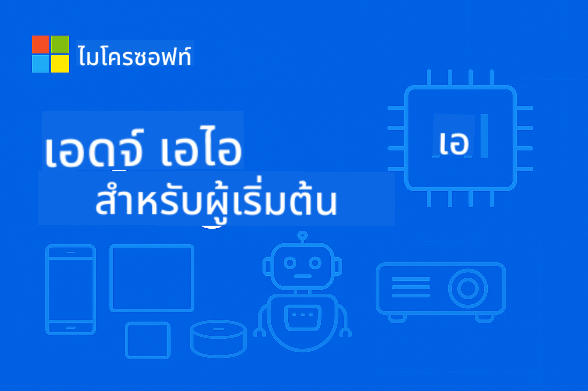

<!--
CO_OP_TRANSLATOR_METADATA:
{
  "original_hash": "ff006cd813df4152f5036e7b2bc5ed32",
  "translation_date": "2025-09-24T22:36:46+00:00",
  "source_file": "README.md",
  "language_code": "th"
}
-->
# EdgeAI สำหรับผู้เริ่มต้น



[](https://GitHub.com/microsoft/edgeai-for-beginners/graphs/contributors)  
[](https://GitHub.com/microsoft/edgeai-for-beginners/issues)  
[](https://GitHub.com/microsoft/edgeai-for-beginners/pulls)  
[](http://makeapullrequest.com)  

[](https://GitHub.com/microsoft/edgeai-for-beginners/watchers)  
[](https://GitHub.com/microsoft/edgeai-for-beginners/fork)  
[](https://GitHub.com/microsoft/edgeai-for-beginners/stargazers)  

[](https://discord.com/invite/ByRwuEEgH4)

ทำตามขั้นตอนเหล่านี้เพื่อเริ่มต้นใช้งานทรัพยากรเหล่านี้:

1. **Fork Repository**: คลิก [](https://GitHub.com/microsoft/edgeai-for-beginners/fork)  
2. **Clone Repository**: `git clone https://github.com/microsoft/edgeai-for-beginners.git`  
3. [**เข้าร่วม Azure AI Foundry Discord เพื่อพบปะผู้เชี่ยวชาญและนักพัฒนาคนอื่นๆ**](https://discord.com/invite/ByRwuEEgH4)

### 🌐 รองรับหลายภาษา

#### รองรับผ่าน GitHub Action (อัตโนมัติและอัปเดตเสมอ)

[Arabic](../ar/README.md) | [Bengali](../bn/README.md) | [Bulgarian](../bg/README.md) | [Burmese (Myanmar)](../my/README.md) | [Chinese (Simplified)](../zh/README.md) | [Chinese (Traditional, Hong Kong)](../hk/README.md) | [Chinese (Traditional, Macau)](../mo/README.md) | [Chinese (Traditional, Taiwan)](../tw/README.md) | [Croatian](../hr/README.md) | [Czech](../cs/README.md) | [Danish](../da/README.md) | [Dutch](../nl/README.md) | [Finnish](../fi/README.md) | [French](../fr/README.md) | [German](../de/README.md) | [Greek](../el/README.md) | [Hebrew](../he/README.md) | [Hindi](../hi/README.md) | [Hungarian](../hu/README.md) | [Indonesian](../id/README.md) | [Italian](../it/README.md) | [Japanese](../ja/README.md) | [Korean](../ko/README.md) | [Malay](../ms/README.md) | [Marathi](../mr/README.md) | [Nepali](../ne/README.md) | [Norwegian](../no/README.md) | [Persian (Farsi)](../fa/README.md) | [Polish](../pl/README.md) | [Portuguese (Brazil)](../br/README.md) | [Portuguese (Portugal)](../pt/README.md) | [Punjabi (Gurmukhi)](../pa/README.md) | [Romanian](../ro/README.md) | [Russian](../ru/README.md) | [Serbian (Cyrillic)](../sr/README.md) | [Slovak](../sk/README.md) | [Slovenian](../sl/README.md) | [Spanish](../es/README.md) | [Swahili](../sw/README.md) | [Swedish](../sv/README.md) | [Tagalog (Filipino)](../tl/README.md) | [Thai](./README.md) | [Turkish](../tr/README.md) | [Ukrainian](../uk/README.md) | [Urdu](../ur/README.md) | [Vietnamese](../vi/README.md)

**หากคุณต้องการให้มีการรองรับภาษาเพิ่มเติม รายการภาษาที่รองรับสามารถดูได้ [ที่นี่](https://github.com/Azure/co-op-translator/blob/main/getting_started/supported-languages.md)**

## บทนำ

ยินดีต้อนรับสู่ **EdgeAI สำหรับผู้เริ่มต้น** – การเดินทางที่ครอบคลุมสู่โลกแห่ง Edge Artificial Intelligence ที่เปลี่ยนแปลงวงการ คอร์สนี้จะช่วยให้คุณเข้าใจและนำความสามารถของ AI ไปใช้ในอุปกรณ์ Edge เพื่อการตัดสินใจที่รวดเร็วและมีประสิทธิภาพในที่ที่ข้อมูลถูกสร้างขึ้น

### สิ่งที่คุณจะได้เรียนรู้

คอร์สนี้จะพาคุณจากพื้นฐานไปจนถึงการใช้งานจริงในระดับผลิต โดยครอบคลุม:
- **Small Language Models (SLMs)** ที่ปรับแต่งสำหรับการใช้งานบน Edge
- **การปรับแต่งฮาร์ดแวร์** สำหรับแพลตฟอร์มที่หลากหลาย
- **การวิเคราะห์แบบเรียลไทม์** พร้อมความสามารถในการรักษาความเป็นส่วนตัว
- **กลยุทธ์การใช้งานในระดับผลิต** สำหรับแอปพลิเคชันในองค์กร

### ทำไม EdgeAI ถึงสำคัญ

Edge AI เป็นการเปลี่ยนแปลงที่ช่วยแก้ปัญหาสำคัญในยุคปัจจุบัน:
- **ความเป็นส่วนตัวและความปลอดภัย**: ประมวลผลข้อมูลสำคัญในพื้นที่โดยไม่ต้องส่งไปยังคลาวด์
- **ประสิทธิภาพแบบเรียลไทม์**: ลดความล่าช้าของเครือข่ายสำหรับแอปพลิเคชันที่ต้องการความรวดเร็ว
- **ความคุ้มค่า**: ลดค่าใช้จ่ายด้านแบนด์วิดท์และการประมวลผลในคลาวด์
- **การทำงานที่ยืดหยุ่น**: ทำงานได้แม้ในกรณีที่เครือข่ายล่ม
- **การปฏิบัติตามกฎระเบียบ**: ตอบสนองความต้องการด้านความเป็นเจ้าของข้อมูล

### Edge AI

Edge AI หมายถึงการรันอัลกอริทึม AI และโมเดลภาษาบนฮาร์ดแวร์ในพื้นที่ใกล้กับที่ข้อมูลถูกสร้างขึ้น โดยไม่ต้องพึ่งพาทรัพยากรคลาวด์สำหรับการวิเคราะห์ ช่วยลดความล่าช้า เพิ่มความเป็นส่วนตัว และช่วยให้ตัดสินใจได้แบบเรียลไทม์

### หลักการสำคัญ:
- **การวิเคราะห์บนอุปกรณ์**: โมเดล AI รันบนอุปกรณ์ Edge เช่น โทรศัพท์ เราเตอร์ ไมโครคอนโทรลเลอร์ และ PC อุตสาหกรรม
- **ความสามารถในการทำงานแบบออฟไลน์**: ทำงานได้โดยไม่ต้องเชื่อมต่ออินเทอร์เน็ตตลอดเวลา
- **ความล่าช้าต่ำ**: ตอบสนองทันทีเหมาะสำหรับระบบเรียลไทม์
- **ความเป็นเจ้าของข้อมูล**: เก็บข้อมูลสำคัญในพื้นที่เพื่อเพิ่มความปลอดภัยและการปฏิบัติตามกฎระเบียบ

### Small Language Models (SLMs)

SLMs เช่น Phi-4, Mistral-7B และ Gemma เป็นเวอร์ชันที่ปรับแต่งของ LLMs ขนาดใหญ่ โดยถูกฝึกหรือปรับแต่งเพื่อ:
- **ลดการใช้หน่วยความจำ**: ใช้หน่วยความจำในอุปกรณ์ Edge อย่างมีประสิทธิภาพ
- **ลดความต้องการในการประมวลผล**: ปรับแต่งให้เหมาะกับ CPU และ GPU บน Edge
- **เริ่มต้นใช้งานได้เร็วขึ้น**: การเริ่มต้นที่รวดเร็วสำหรับแอปพลิเคชันที่ตอบสนองไว

SLMs ช่วยให้สามารถใช้งาน NLP ที่ทรงพลังได้ในข้อจำกัดของ:
- **ระบบฝังตัว**: อุปกรณ์ IoT และตัวควบคุมอุตสาหกรรม
- **อุปกรณ์มือถือ**: สมาร์ทโฟนและแท็บเล็ตที่มีความสามารถออฟไลน์
- **อุปกรณ์ IoT**: เซ็นเซอร์และอุปกรณ์อัจฉริยะที่มีทรัพยากรจำกัด
- **เซิร์ฟเวอร์ Edge**: หน่วยประมวลผลในพื้นที่ที่มีทรัพยากร GPU จำกัด
- **คอมพิวเตอร์ส่วนบุคคล**: การใช้งานบนเดสก์ท็อปและแล็ปท็อป

## โมดูลคอร์สและการนำทาง

| โมดูล | หัวข้อ | พื้นที่โฟกัส | เนื้อหาหลัก | ระดับ | ระยะเวลา |
|-------|-------|------------|-------------|--------|----------|
| [📚 01](../../Module01) | [พื้นฐาน EdgeAI](./Module01/README.md) | เปรียบเทียบ Cloud กับ Edge AI | พื้นฐาน EdgeAI • กรณีศึกษาในโลกจริง • คู่มือการใช้งาน • การใช้งาน Edge | ผู้เริ่มต้น | 3-4 ชม. |
| [🧠 02](../../Module02) | [พื้นฐานโมเดล SLM](./Module02/README.md) | ครอบครัวโมเดลและสถาปัตยกรรม | ครอบครัว Phi • ครอบครัว Qwen • ครอบครัว Gemma • BitNET • μModel • Phi-Silica | ผู้เริ่มต้น | 4-5 ชม. |
| [🚀 03](../../Module03) | [การใช้งาน SLM](./Module03/README.md) | การใช้งานในพื้นที่และคลาวด์ | การเรียนรู้ขั้นสูง • สภาพแวดล้อมในพื้นที่ • การใช้งานในคลาวด์ | ระดับกลาง | 4-5 ชม. |
| [⚙️ 04](../../Module04) | [เครื่องมือปรับแต่งโมเดล](./Module04/README.md) | การปรับแต่งข้ามแพลตฟอร์ม | บทนำ • Llama.cpp • Microsoft Olive • OpenVINO • Apple MLX • การสังเคราะห์ Workflow | ระดับกลาง | 5-6 ชม. |
| [🔧 05](../../Module05) | [SLMOps ในระดับผลิต](./Module05/README.md) | การดำเนินงานในระดับผลิต | บทนำ SLMOps • การกลั่นโมเดล • การปรับแต่ง • การใช้งานในระดับผลิต | ระดับสูง | 5-6 ชม. |
| [🤖 06](../../Module06) | [AI Agents และการเรียกฟังก์ชัน](./Module06/README.md) | เฟรมเวิร์ก Agent และ MCP | บทนำ Agent • การเรียกฟังก์ชัน • โปรโตคอลบริบทโมเดล | ระดับสูง | 4-5 ชม. |
| [💻 07](../../Module07) | [การใช้งานแพลตฟอร์ม](./Module07/README.md) | ตัวอย่างข้ามแพลตฟอร์ม | เครื่องมือ AI • Foundry Local • การพัฒนาบน Windows | ระดับสูง | 3-4 ชม. |
| [🏭 08](../../Module08) | [เครื่องมือ Foundry Local](./Module08/README.md) | ตัวอย่างที่พร้อมใช้งานในระดับผลิต | แอปพลิเคชันตัวอย่าง (ดูรายละเอียดด้านล่าง) | ผู้เชี่ยวชาญ | 8-10 ชม. |

### 🏭 **โมดูล 08: แอปพลิเคชันตัวอย่าง**

- [01: REST Chat Quickstart](./Module08/samples/01/README.md)  
- [02: การรวม OpenAI SDK](./Module08/samples/02/README.md)  
- [03: การค้นหาและการวัดประสิทธิภาพโมเดล](./Module08/samples/03/README.md)  
- [04: แอปพลิเคชัน Chainlit RAG](./Module08/samples/04/README.md)  
- [05: การจัดการ Multi-Agent](./Module08/samples/05/README.md)  
- [06: ตัวเลือกโมเดลแบบ Router](./Module08/samples/06/README.md)  
- [07: API Client โดยตรง](./Module08/samples/07/README.md)  
- [08: แอปแชท Windows 11](./Module08/samples/08/README.md)  
- [09: ระบบ Multi-Agent ขั้นสูง](./Module08/samples/09/README.md)  
- [10: เฟรมเวิร์กเครื่องมือ Foundry](./Module08/samples/10/README.md)  

### 📊 **สรุปเส้นทางการเรียนรู้**
- **ระยะเวลารวม**: 36-45 ชั่วโมง  
- **เส้นทางผู้เริ่มต้น**: โมดูล 01-02 (7-9 ชั่วโมง)  
- **เส้นทางระดับกลาง**: โมดูล 03-04 (9-11 ชั่วโมง)  
- **เส้นทางระดับสูง**: โมดูล 05-07 (12-15 ชั่วโมง)  
- **เส้นทางผู้เชี่ยวชาญ**: โมดูล 08 (8-10 ชั่วโมง)

## สิ่งที่คุณจะสร้าง

### 🎯 ความสามารถหลัก
- **สถาปัตยกรรม Edge AI**: ออกแบบระบบ AI ที่เน้นการทำงานในพื้นที่พร้อมการรวมคลาวด์  
- **การปรับแต่งโมเดล**: การลดขนาดและการบีบอัดโมเดลสำหรับการใช้งานบน Edge (เพิ่มความเร็ว 85%, ลดขนาด 75%)  
- **การใช้งานข้ามแพลตฟอร์ม**: Windows, มือถือ, ระบบฝังตัว และระบบไฮบริดคลาวด์-Edge  
- **การดำเนินงานในระดับผลิต**: การตรวจสอบ, การปรับขนาด, และการบำรุงรักษา Edge AI ในระดับผลิต  

### 🏗️ โครงการปฏิบัติ
- **แอปแชท Foundry Local**: แอปพลิเคชัน Windows 11 ที่สามารถเปลี่ยนโมเดลได้  
- **ระบบ Multi-Agent**: ผู้ประสานงานที่มี Agent เฉพาะทางสำหรับการทำงานที่ซับซ้อน  
- **แอปพลิเคชัน RAG**: การประมวลผลเอกสารในพื้นที่พร้อมการค้นหาแบบเวกเตอร์  
- **Router โมเดล**: การเลือกโมเดลอย่างชาญฉลาดตามการวิเคราะห์งาน  
- **เฟรมเวิร์ก API**: Client ที่พร้อมใช้งานในระดับผลิตพร้อมการสตรีมและการตรวจสอบสุขภาพ  
- **เครื่องมือข้ามแพลตฟอร์ม**: รูปแบบการรวม LangChain/Semantic Kernel  

### 🏢 การใช้งานในอุตสาหกรรม
**การผลิต** • **การดูแลสุขภาพ** • **ยานยนต์อัตโนมัติ** • **เมืองอัจฉริยะ** • **แอปมือถือ**

## เริ่มต้นอย่างรวดเร็ว

**เส้นทางการเรียนรู้ที่แนะนำ** (รวม 20-30 ชั่วโมง):

1. **📚 พื้นฐาน** (โมดูล 01-02): แนวคิด EdgeAI + ครอบครัวโมเดล SLM  
2. **⚙️ การปรับแต่ง** (โมดูล 03-04): การใช้งาน + เฟรมเวิร์กการลดขนาด  
3. **🚀 การผลิต** (โมดูล 05-06): SLMOps + AI Agents + การเรียกฟังก์ชัน  
4. **💻 การใช้งาน** (โมดูล 07-08): ตัวอย่างแพลตฟอร์ม + เครื่องมือ Foundry Local  

แต่ละโมดูลประกอบด้วยทฤษฎี, การฝึกปฏิบัติ, และตัวอย่างโค้ดที่พร้อมใช้งานในระดับผลิต

## ผลกระทบต่ออาชีพ
**บทบาททางเทคนิค**: EdgeAI Solutions Architect • ML Engineer (Edge) • IoT AI Developer • Mobile AI Developer

**ภาคอุตสาหกรรม**: Manufacturing 4.0 • เทคโนโลยีด้านสุขภาพ • ระบบอัตโนมัติ • FinTech • อิเล็กทรอนิกส์สำหรับผู้บริโภค

**โปรเจกต์ในพอร์ตโฟลิโอ**: ระบบหลายตัวแทน • แอป RAG สำหรับการผลิต • การปรับใช้ข้ามแพลตฟอร์ม • การปรับปรุงประสิทธิภาพ

## โครงสร้างของ Repository

```
edgeai-for-beginners/
├── 📚 Module01-04/     # Fundamentals → SLMs → Deployment → Optimization  
├── 🔧 Module05-06/     # SLMOps → AI Agents → Function Calling
├── 💻 Module07/        # Platform Samples (VS Code, Windows, Jetson, Mobile)
├── 🏭 Module08/        # Foundry Local Toolkit + 10 Comprehensive Samples
│   ├── samples/01-06/  # Foundation: REST, SDK, RAG, Agents, Routing
│   └── samples/07-10/  # Advanced: API Client, Windows App, Enterprise Agents, Tools
├── 🌐 translations/    # Multi-language support (8+ languages)
└── 📋 STUDY_GUIDE.md   # Structured learning paths & time allocation
```

## ไฮไลต์ของคอร์ส

✅ **การเรียนรู้แบบก้าวหน้า**: ทฤษฎี → ปฏิบัติ → การปรับใช้ในระดับการผลิต  
✅ **กรณีศึกษาในโลกจริง**: Microsoft, Japan Airlines, การใช้งานในองค์กร  
✅ **ตัวอย่างที่ลงมือทำจริง**: ตัวอย่างกว่า 50 รายการ, เดโม Foundry Local ที่ครอบคลุม 10 รายการ  
✅ **เน้นประสิทธิภาพ**: ปรับปรุงความเร็ว 85%, ลดขนาด 75%  
✅ **รองรับหลายแพลตฟอร์ม**: Windows, มือถือ, อุปกรณ์ฝังตัว, ไฮบริดคลาวด์-เอดจ์  
✅ **พร้อมสำหรับการผลิต**: การตรวจสอบ, การขยายระบบ, ความปลอดภัย, กรอบการปฏิบัติตามข้อกำหนด  

📖 **[คู่มือการเรียนรู้](STUDY_GUIDE.md)**: เส้นทางการเรียนรู้ที่มีโครงสร้าง 20 ชั่วโมง พร้อมคำแนะนำการจัดสรรเวลาและเครื่องมือประเมินตนเอง

---

**EdgeAI คืออนาคตของการปรับใช้ AI**: เน้นการใช้งานในพื้นที่, รักษาความเป็นส่วนตัว, และมีประสิทธิภาพ ฝึกฝนทักษะเหล่านี้เพื่อสร้างแอปพลิเคชันอัจฉริยะรุ่นต่อไป

## คอร์สอื่น ๆ

ทีมของเรามีคอร์สอื่น ๆ ให้เลือก! ลองดู:

- [MCP สำหรับผู้เริ่มต้น](https://github.com/microsoft/mcp-for-beginners)
- [AI Agents สำหรับผู้เริ่มต้น](https://github.com/microsoft/ai-agents-for-beginners?WT.mc_id=academic-105485-koreyst)
- [Generative AI สำหรับผู้เริ่มต้นโดยใช้ .NET](https://github.com/microsoft/Generative-AI-for-beginners-dotnet?WT.mc_id=academic-105485-koreyst)
- [Generative AI สำหรับผู้เริ่มต้นโดยใช้ JavaScript](https://github.com/microsoft/generative-ai-with-javascript?WT.mc_id=academic-105485-koreyst)
- [Generative AI สำหรับผู้เริ่มต้น](https://github.com/microsoft/generative-ai-for-beginners?WT.mc_id=academic-105485-koreyst)
- [ML สำหรับผู้เริ่มต้น](https://aka.ms/ml-beginners?WT.mc_id=academic-105485-koreyst)
- [Data Science สำหรับผู้เริ่มต้น](https://aka.ms/datascience-beginners?WT.mc_id=academic-105485-koreyst)
- [AI สำหรับผู้เริ่มต้น](https://aka.ms/ai-beginners?WT.mc_id=academic-105485-koreyst)
- [Cybersecurity สำหรับผู้เริ่มต้น](https://github.com/microsoft/Security-101??WT.mc_id=academic-96948-sayoung)
- [Web Dev สำหรับผู้เริ่มต้น](https://aka.ms/webdev-beginners?WT.mc_id=academic-105485-koreyst)
- [IoT สำหรับผู้เริ่มต้น](https://aka.ms/iot-beginners?WT.mc_id=academic-105485-koreyst)
- [XR Development สำหรับผู้เริ่มต้น](https://github.com/microsoft/xr-development-for-beginners?WT.mc_id=academic-105485-koreyst)
- [การใช้งาน GitHub Copilot สำหรับ AI Paired Programming](https://aka.ms/GitHubCopilotAI?WT.mc_id=academic-105485-koreyst)
- [การใช้งาน GitHub Copilot สำหรับนักพัฒนา C#/.NET](https://github.com/microsoft/mastering-github-copilot-for-dotnet-csharp-developers?WT.mc_id=academic-105485-koreyst)
- [เลือกการผจญภัย Copilot ของคุณเอง](https://github.com/microsoft/CopilotAdventures?WT.mc_id=academic-105485-koreyst)

---

