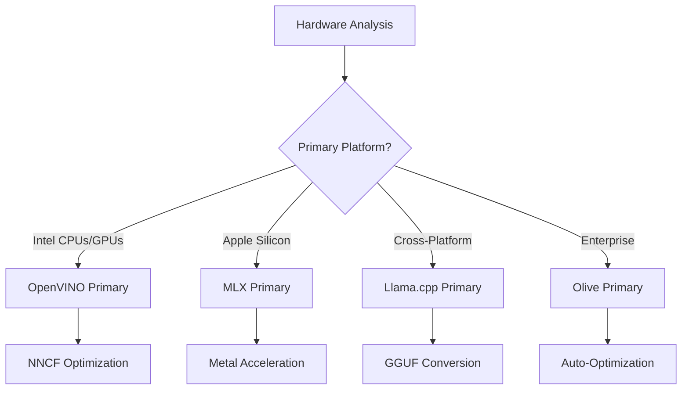
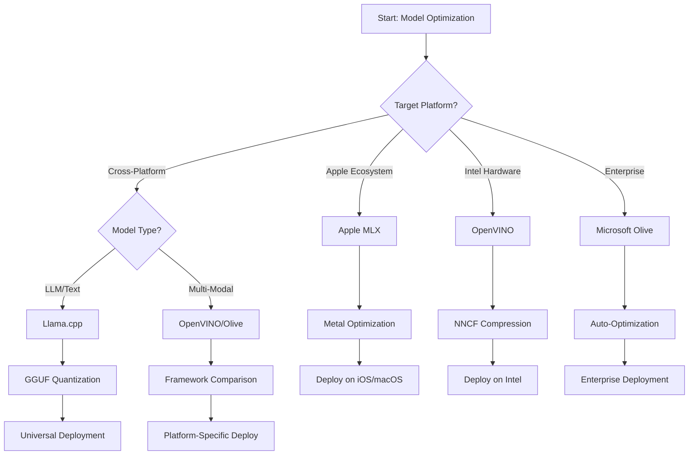
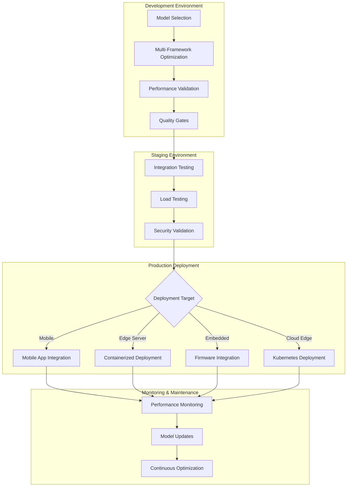

<!--
CO_OP_TRANSLATOR_METADATA:
{
  "original_hash": "6719c4a7e44b948230ac5f5cab3699bd",
  "translation_date": "2025-09-18T14:38:08+00:00",
  "source_file": "Module04/06.workflow-synthesis.md",
  "language_code": "tl"
}
-->
# Seksyon 6: Pagsasama ng Workflow para sa Edge AI Development

## Talaan ng Nilalaman
1. [Panimula](../../../Module04)
2. [Mga Layunin sa Pagkatuto](../../../Module04)
3. [Pangkalahatang-ideya ng Unified Workflow](../../../Module04)
4. [Matrix ng Pagpili ng Framework](../../../Module04)
5. [Pagsasama ng Mga Pinakamahusay na Kasanayan](../../../Module04)
6. [Gabay sa Deployment Strategy](../../../Module04)
7. [Workflow para sa Pag-optimize ng Performance](../../../Module04)
8. [Checklist para sa Kahandaan sa Produksyon](../../../Module04)
9. [Pag-troubleshoot at Pagmo-monitor](../../../Module04)
10. [Pagtiyak sa Hinaharap ng Iyong Edge AI Pipeline](../../../Module04)

## Panimula

Ang pag-develop ng Edge AI ay nangangailangan ng masusing pag-unawa sa iba't ibang optimization frameworks, deployment strategies, at hardware considerations. Ang komprehensibong pagsasamang ito ay pinagsasama ang kaalaman mula sa Llama.cpp, Microsoft Olive, OpenVINO, at Apple MLX upang makabuo ng isang unified workflow na nagmamaksimisa ng kahusayan, pinapanatili ang kalidad, at tinitiyak ang matagumpay na deployment sa produksyon.

Sa buong kursong ito, tinalakay natin ang mga indibidwal na optimization frameworks, bawat isa ay may natatanging lakas at espesyalisadong gamit. Gayunpaman, ang mga tunay na proyekto sa Edge AI ay madalas na nangangailangan ng pagsasama ng mga teknika mula sa maraming frameworks o paggawa ng mga estratehikong desisyon kung aling pamamaraan ang magbibigay ng pinakamahusay na resulta para sa mga partikular na limitasyon at pangangailangan.

Ang seksyong ito ay nagsasama ng kolektibong kaalaman mula sa lahat ng frameworks sa mga actionable workflows, decision trees, at pinakamahusay na kasanayan na magpapahintulot sa iyo na bumuo ng production-ready Edge AI solutions nang mahusay at epektibo. Kung ikaw man ay nag-o-optimize para sa mga mobile device, embedded systems, o edge servers, ang gabay na ito ay nagbibigay ng estratehikong balangkas para sa paggawa ng mga may kaalamang desisyon sa buong lifecycle ng iyong development.

## Mga Layunin sa Pagkatuto

Sa pagtatapos ng seksyong ito, magagawa mo ang sumusunod:

### Estratehikong Paggawa ng Desisyon
- **Suriin at piliin** ang pinakamainam na optimization framework batay sa mga pangangailangan ng proyekto, hardware constraints, at deployment scenarios
- **Magdisenyo ng komprehensibong workflows** na nagsasama ng maraming optimization techniques para sa pinakamataas na kahusayan
- **Timbangin ang mga trade-off** sa pagitan ng model accuracy, inference speed, memory usage, at deployment complexity sa iba't ibang frameworks

### Pagsasama ng Workflow
- **Ipatupad ang unified development pipelines** na gumagamit ng lakas ng maraming optimization frameworks
- **Lumikha ng reproducible workflows** para sa pare-parehong model optimization at deployment sa iba't ibang kapaligiran
- **Magtatag ng quality gates** at validation processes upang matiyak na ang mga optimized models ay nakakatugon sa mga kinakailangan sa produksyon

### Pag-optimize ng Performance
- **Gamitin ang sistematikong optimization strategies** gamit ang quantization, pruning, at hardware-specific acceleration techniques
- **I-monitor at i-benchmark** ang performance ng modelo sa iba't ibang antas ng optimization at deployment targets
- **I-optimize para sa mga partikular na hardware platforms** kabilang ang CPU, GPU, NPU, at mga espesyalisadong edge accelerators

### Deployment sa Produksyon
- **Magdisenyo ng scalable deployment architectures** na kayang tumanggap ng maraming model formats at inference engines
- **Ipatupad ang monitoring at observability** para sa Edge AI applications sa production environments
- **Magtatag ng maintenance workflows** para sa model updates, performance monitoring, at system optimization

### Kahusayan sa Cross-Platform
- **I-deploy ang mga optimized models** sa iba't ibang hardware platforms habang pinapanatili ang pare-parehong performance
- **Hawakan ang mga platform-specific optimizations** para sa Windows, macOS, Linux, mobile, at embedded systems
- **Lumikha ng abstraction layers** na nagpapadali ng seamless deployment sa iba't ibang edge environments

## Pangkalahatang-ideya ng Unified Workflow

### Phase 1: Pagsusuri ng Pangangailangan at Pagpili ng Framework

Ang pundasyon ng matagumpay na Edge AI deployment ay nagsisimula sa masusing pagsusuri ng pangangailangan na nagbibigay-alam sa pagpili ng framework at optimization strategy.

#### 1.1 Pagsusuri ng Hardware


**Mga Pangunahing Pagsasaalang-alang:**
- **CPU Architecture**: x86, ARM, Apple Silicon capabilities
- **Availability ng Accelerator**: GPU, NPU, VPU, mga espesyalisadong AI chips
- **Mga Limitasyon sa Memorya**: RAM limitations, storage capacity
- **Power Budget**: Battery life, thermal constraints
- **Koneksyon**: Offline requirements, bandwidth limitations

#### 1.2 Matrix ng Mga Pangangailangan ng Aplikasyon

| Pangangailangan | Llama.cpp | Microsoft Olive | OpenVINO | Apple MLX |
|-----------------|-----------|-----------------|----------|-----------|
| Cross-platform | ✅ Napakahusay | ⚡ Maganda | ⚡ Maganda | ❌ Para sa Apple lamang |
| Enterprise Integration | ⚡ Pangunahing antas | ✅ Napakahusay | ✅ Napakahusay | ⚡ Limitado |
| Mobile Deployment | ✅ Napakahusay | ⚡ Maganda | ⚡ Maganda | ✅ Napakahusay sa iOS |
| Real-time Inference | ✅ Napakahusay | ✅ Napakahusay | ✅ Napakahusay | ✅ Napakahusay |
| Model Diversity | ✅ LLM Focus | ✅ Lahat ng Modelo | ✅ Lahat ng Modelo | ✅ LLM Focus |
| Kadalian ng Paggamit | ✅ Simple | ✅ Automated | ⚡ Katamtaman | ✅ Simple |

### Phase 2: Paghahanda at Pag-optimize ng Modelo

#### 2.1 Universal Model Assessment Pipeline

```python
# Universal Model Assessment Framework
class EdgeAIModelAssessment:
    def __init__(self, model_path, target_hardware):
        self.model_path = model_path
        self.target_hardware = target_hardware
        self.optimization_frameworks = []
        
    def assess_model_characteristics(self):
        """Analyze model size, architecture, and complexity"""
        return {
            'model_size': self.get_model_size(),
            'parameter_count': self.get_parameter_count(),
            'architecture_type': self.detect_architecture(),
            'quantization_compatibility': self.check_quantization_support()
        }
    
    def recommend_optimization_strategy(self):
        """Recommend optimal frameworks and techniques"""
        characteristics = self.assess_model_characteristics()
        
        if self.target_hardware.startswith('apple'):
            return self.mlx_optimization_strategy(characteristics)
        elif self.target_hardware.startswith('intel'):
            return self.openvino_optimization_strategy(characteristics)
        elif characteristics['model_size'] > 7_000_000_000:  # 7B+ parameters
            return self.enterprise_optimization_strategy(characteristics)
        else:
            return self.lightweight_optimization_strategy(characteristics)
```

#### 2.2 Multi-Framework Optimization Pipeline

**Sequential Optimization Approach:**
1. **Initial Conversion**: I-convert sa intermediate format (ONNX kung maaari)
2. **Framework-Specific Optimization**: Ipatupad ang mga espesyalisadong teknika
3. **Cross-Validation**: I-verify ang performance sa mga target na platform
4. **Final Packaging**: Ihanda para sa deployment

```bash
# Multi-Framework Optimization Script
#!/bin/bash

MODEL_NAME="phi-3-mini"
BASE_MODEL="microsoft/Phi-3-mini-4k-instruct"

# Phase 1: ONNX Conversion (Universal)
python convert_to_onnx.py --model $BASE_MODEL --output models/onnx/

# Phase 2: Platform-Specific Optimization
if [[ "$TARGET_PLATFORM" == "intel" ]]; then
    # OpenVINO Optimization
    python optimize_openvino.py --input models/onnx/ --output models/openvino/
elif [[ "$TARGET_PLATFORM" == "apple" ]]; then
    # MLX Optimization
    python optimize_mlx.py --input $BASE_MODEL --output models/mlx/
elif [[ "$TARGET_PLATFORM" == "cross" ]]; then
    # Llama.cpp Optimization
    python convert_to_gguf.py --input models/onnx/ --output models/gguf/
fi

# Phase 3: Validation
python validate_optimization.py --original $BASE_MODEL --optimized models/$TARGET_PLATFORM/
```

### Phase 3: Pag-validate ng Performance at Benchmarking

#### 3.1 Comprehensive Benchmarking Framework

```python
class EdgeAIBenchmark:
    def __init__(self, optimized_models):
        self.models = optimized_models
        self.metrics = {
            'inference_time': [],
            'memory_usage': [],
            'accuracy_score': [],
            'throughput': [],
            'energy_consumption': []
        }
    
    def run_comprehensive_benchmark(self):
        """Execute standardized benchmarks across all optimized models"""
        test_inputs = self.generate_test_inputs()
        
        for model_framework, model_path in self.models.items():
            print(f"Benchmarking {model_framework}...")
            
            # Latency Testing
            latency = self.measure_inference_latency(model_path, test_inputs)
            
            # Memory Profiling
            memory = self.profile_memory_usage(model_path)
            
            # Accuracy Validation
            accuracy = self.validate_model_accuracy(model_path, test_inputs)
            
            # Throughput Analysis
            throughput = self.measure_throughput(model_path)
            
            self.record_metrics(model_framework, latency, memory, accuracy, throughput)
    
    def generate_optimization_report(self):
        """Create comprehensive comparison report"""
        report = {
            'recommendations': self.analyze_performance_trade_offs(),
            'deployment_guidance': self.generate_deployment_recommendations(),
            'monitoring_requirements': self.define_monitoring_metrics()
        }
        return report
```

## Matrix ng Pagpili ng Framework

### Decision Tree para sa Pagpili ng Framework



### Komprehensibong Pamantayan sa Pagpili

#### 1. Pagtutugma sa Pangunahing Gamit

**Large Language Models (LLMs):**
- **Llama.cpp**: Pinakamahusay para sa CPU-focused, cross-platform deployment
- **Apple MLX**: Optimal para sa Apple Silicon na may unified memory
- **OpenVINO**: Napakahusay para sa Intel hardware na may NNCF optimization
- **Microsoft Olive**: Ideal para sa enterprise workflows na may automation

**Multi-Modal Models:**
- **OpenVINO**: Komprehensibong suporta para sa vision, audio, at text
- **Microsoft Olive**: Enterprise-grade optimization para sa mga komplikadong pipeline
- **Llama.cpp**: Limitado sa text-based models
- **Apple MLX**: Lumalawak na suporta para sa multi-modal applications

#### 2. Matrix ng Hardware Platform

| Platform | Pangunahing Framework | Pangalawang Opsyon | Espesyalisadong Katangian |
|----------|-----------------------|--------------------|--------------------------|
| Intel CPU/GPU | OpenVINO | Microsoft Olive | NNCF compression, Intel optimization |
| NVIDIA GPU | Microsoft Olive | OpenVINO | CUDA acceleration, enterprise features |
| Apple Silicon | Apple MLX | Llama.cpp | Metal shaders, unified memory |
| ARM Mobile | Llama.cpp | OpenVINO | Cross-platform, minimal dependencies |
| Edge TPU | OpenVINO | Microsoft Olive | Suporta para sa espesyalisadong accelerator |
| Embedded ARM | Llama.cpp | OpenVINO | Minimal footprint, efficient inference |

#### 3. Mga Kagustuhan sa Workflow ng Development

**Mabilisang Prototyping:**
1. **Llama.cpp**: Pinakamabilis na setup, agarang resulta
2. **Apple MLX**: Simple Python API, mabilis na iteration
3. **Microsoft Olive**: Automated optimization, minimal na configuration
4. **OpenVINO**: Mas komplikadong setup, komprehensibong features

**Produksyon sa Enterprise:**
1. **Microsoft Olive**: Mga tampok para sa enterprise, Azure integration
2. **OpenVINO**: Intel ecosystem, komprehensibong tools
3. **Apple MLX**: Mga aplikasyon para sa enterprise na partikular sa Apple
4. **Llama.cpp**: Simpleng deployment, limitadong tampok para sa enterprise

## Pagsasama ng Mga Pinakamahusay na Kasanayan

### Mga Prinsipyo ng Universal Optimization

#### 1. Progressive Optimization Strategy

```python
class ProgressiveOptimization:
    def __init__(self, base_model):
        self.base_model = base_model
        self.optimization_stages = [
            'baseline_measurement',
            'format_conversion',
            'quantization_optimization',
            'hardware_acceleration',
            'production_validation'
        ]
    
    def execute_progressive_optimization(self):
        """Apply optimization techniques incrementally"""
        
        # Stage 1: Baseline Measurement
        baseline_metrics = self.measure_baseline_performance()
        
        # Stage 2: Format Conversion
        converted_model = self.convert_to_optimal_format()
        conversion_metrics = self.measure_performance(converted_model)
        
        # Stage 3: Quantization
        quantized_model = self.apply_quantization(converted_model)
        quantization_metrics = self.measure_performance(quantized_model)
        
        # Stage 4: Hardware Acceleration
        accelerated_model = self.enable_hardware_acceleration(quantized_model)
        acceleration_metrics = self.measure_performance(accelerated_model)
        
        # Stage 5: Validation
        production_ready = self.validate_for_production(accelerated_model)
        
        return self.compile_optimization_report(
            baseline_metrics, conversion_metrics, 
            quantization_metrics, acceleration_metrics
        )
```

#### 2. Pagpapatupad ng Quality Gate

**Mga Accuracy Preservation Gates:**
- Panatilihin ang >95% ng orihinal na accuracy ng modelo
- Mag-validate gamit ang mga representative test datasets
- Ipatupad ang A/B testing para sa validation sa produksyon

**Mga Performance Improvement Gates:**
- Makamit ang minimum na 2x na bilis ng pagpapabuti
- Bawasan ang memory footprint ng hindi bababa sa 50%
- I-validate ang consistency ng inference time

**Mga Production Readiness Gates:**
- Pumasa sa stress testing sa ilalim ng load
- Magpakita ng matatag na performance sa paglipas ng panahon
- I-validate ang mga kinakailangan sa seguridad at privacy

### Pagsasama ng Framework-Specific Best Practices

#### 1. Synthesis ng Quantization Strategy

```python
# Unified Quantization Approach
class UnifiedQuantizationStrategy:
    def __init__(self, model, target_platform):
        self.model = model
        self.platform = target_platform
        
    def select_optimal_quantization(self):
        """Choose best quantization based on platform and requirements"""
        
        if self.platform == 'apple_silicon':
            return self.mlx_quantization_strategy()
        elif self.platform == 'intel_hardware':
            return self.openvino_quantization_strategy()
        elif self.platform == 'cross_platform':
            return self.llamacpp_quantization_strategy()
        else:
            return self.olive_quantization_strategy()
    
    def mlx_quantization_strategy(self):
        """Apple MLX-specific quantization"""
        return {
            'method': 'mlx_quantize',
            'precision': 'int4',
            'group_size': 64,
            'optimization_target': 'unified_memory'
        }
    
    def openvino_quantization_strategy(self):
        """OpenVINO NNCF quantization"""
        return {
            'method': 'nncf_quantize',
            'precision': 'int8',
            'calibration_method': 'post_training',
            'optimization_target': 'intel_hardware'
        }
```

#### 2. Pag-optimize ng Hardware Acceleration

**CPU Optimization Synthesis:**
- **SIMD Instructions**: Gamitin ang mga optimized kernels sa lahat ng frameworks
- **Memory Bandwidth**: I-optimize ang data layouts para sa cache efficiency
- **Threading**: Balansehin ang parallelism sa mga resource constraints

**Mga Pinakamahusay na Kasanayan sa GPU Acceleration:**
- **Batch Processing**: I-maximize ang throughput gamit ang tamang batch sizes
- **Memory Management**: I-optimize ang GPU memory allocation at transfers
- **Precision**: Gamitin ang FP16 kung suportado para sa mas mahusay na performance

**Optimization para sa NPU/Specialized Accelerator:**
- **Model Architecture**: Siguraduhing compatible sa capabilities ng accelerator
- **Data Flow**: I-optimize ang input/output pipelines para sa efficiency ng accelerator
- **Fallback Strategies**: Ipatupad ang CPU fallback para sa mga hindi suportadong operasyon

## Gabay sa Deployment Strategy

### Universal Deployment Architecture



### Mga Pattern ng Deployment na Partikular sa Platform

#### 1. Estratehiya para sa Mobile Deployment

```yaml
# Mobile Deployment Configuration
mobile_deployment:
  ios:
    framework: apple_mlx
    optimization:
      quantization: int4
      memory_mapping: true
      background_execution: limited
    packaging:
      format: mlx
      bundle_size: <50MB
      
  android:
    framework: llama_cpp
    optimization:
      quantization: q4_k_m
      threading: android_optimized
      memory_management: conservative
    packaging:
      format: gguf
      apk_size: <100MB
      
  cross_platform:
    framework: onnx_runtime
    optimization:
      quantization: int8
      execution_provider: cpu
    packaging:
      format: onnx
      shared_libraries: minimal
```

#### 2. Deployment sa Edge Server

```yaml
# Edge Server Deployment Configuration
edge_server:
  intel_based:
    framework: openvino
    optimization:
      quantization: int8
      acceleration: cpu_gpu_auto
      batch_processing: dynamic
    deployment:
      container: openvino_runtime
      orchestration: kubernetes
      scaling: horizontal
      
  nvidia_based:
    framework: microsoft_olive
    optimization:
      quantization: int4
      acceleration: cuda
      tensor_parallelism: true
    deployment:
      container: nvidia_triton
      orchestration: kubernetes
      scaling: gpu_aware
```

### Mga Pinakamahusay na Kasanayan sa Containerization

```dockerfile
# Multi-Framework Edge AI Container
FROM ubuntu:22.04 as base

# Install common dependencies
RUN apt-get update && apt-get install -y \
    python3 \
    python3-pip \
    build-essential \
    cmake \
    && rm -rf /var/lib/apt/lists/*

# Framework-specific stages
FROM base as openvino
RUN pip install openvino nncf optimum[intel]

FROM base as llamacpp
RUN git clone https://github.com/ggerganov/llama.cpp.git \
    && cd llama.cpp && make LLAMA_OPENBLAS=1

FROM base as olive
RUN pip install olive-ai[auto-opt] onnxruntime-genai

# Production stage with selected framework
FROM openvino as production
COPY models/ /app/models/
COPY src/ /app/src/
WORKDIR /app

EXPOSE 8080
CMD ["python3", "src/inference_server.py"]
```

## Workflow para sa Pag-optimize ng Performance

### Sistematikong Pag-tune ng Performance

#### 1. Performance Profiling Pipeline

```python
class EdgeAIPerformanceProfiler:
    def __init__(self, model_path, framework):
        self.model_path = model_path
        self.framework = framework
        self.profiling_results = {}
    
    def comprehensive_profiling(self):
        """Execute comprehensive performance analysis"""
        
        # CPU Profiling
        cpu_profile = self.profile_cpu_usage()
        
        # Memory Profiling
        memory_profile = self.profile_memory_usage()
        
        # Inference Latency
        latency_profile = self.profile_inference_latency()
        
        # Throughput Analysis
        throughput_profile = self.profile_throughput()
        
        # Energy Consumption (where available)
        energy_profile = self.profile_energy_consumption()
        
        return self.compile_performance_report(
            cpu_profile, memory_profile, latency_profile,
            throughput_profile, energy_profile
        )
    
    def identify_bottlenecks(self):
        """Automatically identify performance bottlenecks"""
        bottlenecks = []
        
        if self.profiling_results['cpu_utilization'] > 80:
            bottlenecks.append('cpu_bound')
        
        if self.profiling_results['memory_usage'] > 90:
            bottlenecks.append('memory_bound')
        
        if self.profiling_results['inference_variance'] > 20:
            bottlenecks.append('inconsistent_performance')
        
        return self.generate_optimization_recommendations(bottlenecks)
```

#### 2. Automated Optimization Pipeline

```python
class AutomatedOptimizationPipeline:
    def __init__(self, base_model, target_constraints):
        self.base_model = base_model
        self.constraints = target_constraints
        self.optimization_history = []
    
    def execute_optimization_search(self):
        """Systematically search optimization space"""
        
        optimization_candidates = [
            {'quantization': 'int8', 'pruning': 0.1},
            {'quantization': 'int4', 'pruning': 0.2},
            {'quantization': 'int8', 'acceleration': 'gpu'},
            {'quantization': 'int4', 'acceleration': 'npu'}
        ]
        
        best_configuration = None
        best_score = 0
        
        for config in optimization_candidates:
            optimized_model = self.apply_optimization(config)
            score = self.evaluate_optimization(optimized_model)
            
            if score > best_score and self.meets_constraints(optimized_model):
                best_score = score
                best_configuration = config
            
            self.optimization_history.append({
                'config': config,
                'score': score,
                'model': optimized_model
            })
        
        return best_configuration, self.optimization_history
```

### Multi-Objective Optimization

#### 1. Pareto Optimization para sa Edge AI

```python
class ParetoOptimization:
    def __init__(self, objectives=['speed', 'accuracy', 'memory']):
        self.objectives = objectives
        self.pareto_frontier = []
    
    def find_pareto_optimal_solutions(self, optimization_results):
        """Identify Pareto-optimal configurations"""
        
        for result in optimization_results:
            is_dominated = False
            
            for frontier_point in self.pareto_frontier:
                if self.dominates(frontier_point, result):
                    is_dominated = True
                    break
            
            if not is_dominated:
                # Remove dominated points from frontier
                self.pareto_frontier = [
                    point for point in self.pareto_frontier 
                    if not self.dominates(result, point)
                ]
                
                self.pareto_frontier.append(result)
        
        return self.pareto_frontier
    
    def recommend_configuration(self, user_preferences):
        """Recommend configuration based on user preferences"""
        
        weighted_scores = []
        for config in self.pareto_frontier:
            score = sum(
                user_preferences[obj] * config['metrics'][obj] 
                for obj in self.objectives
            )
            weighted_scores.append((score, config))
        
        return max(weighted_scores, key=lambda x: x[0])[1]
```

## Checklist para sa Kahandaan sa Produksyon

### Komprehensibong Validation para sa Produksyon

#### 1. Assurance ng Kalidad ng Modelo

```python
class ProductionReadinessValidator:
    def __init__(self, optimized_model, production_requirements):
        self.model = optimized_model
        self.requirements = production_requirements
        self.validation_results = {}
    
    def validate_model_quality(self):
        """Comprehensive model quality validation"""
        
        # Accuracy Validation
        accuracy_result = self.validate_accuracy()
        
        # Performance Validation
        performance_result = self.validate_performance()
        
        # Robustness Testing
        robustness_result = self.validate_robustness()
        
        # Security Assessment
        security_result = self.validate_security()
        
        # Compliance Verification
        compliance_result = self.validate_compliance()
        
        return self.compile_validation_report(
            accuracy_result, performance_result, robustness_result,
            security_result, compliance_result
        )
    
    def generate_certification_report(self):
        """Generate production certification report"""
        return {
            'model_signature': self.generate_model_signature(),
            'validation_timestamp': datetime.now(),
            'validation_results': self.validation_results,
            'deployment_approval': self.check_deployment_approval(),
            'monitoring_requirements': self.define_monitoring_requirements()
        }
```

#### 2. Checklist para sa Deployment sa Produksyon

**Pre-Deployment Validation:**
- [ ] Ang accuracy ng modelo ay nakakatugon sa minimum na kinakailangan (>95% ng baseline)
- [ ] Naabot ang mga performance targets (latency, throughput, memory)
- [ ] Nasuri at naayos ang mga security vulnerabilities
- [ ] Nakumpleto ang stress testing sa ilalim ng inaasahang load
- [ ] Nasubukan ang mga failure scenarios at validated ang recovery procedures
- [ ] Nakumpigura ang monitoring at alerting systems
- [ ] Nasubukan at nadokumento ang rollback procedures

**Deployment Process:**
- [ ] Naipatupad ang blue-green deployment strategy
- [ ] Nakumpigura ang gradual traffic ramping
- [ ] Aktibo ang real-time monitoring dashboards
- [ ] Na-establish ang performance baselines
- [ ] Na-define ang error rate thresholds
- [ ] Nakumpigura ang automated rollback triggers

**Post-Deployment Monitoring:**
- [ ] Aktibo ang model drift detection
- [ ] Nakumpigura ang performance degradation alerts
- [ ] Aktibo ang resource utilization monitoring
- [ ] Na-track ang user experience metrics
- [ ] Na-maintain ang model versioning at lineage
- [ ] Na-schedule ang regular na model performance reviews

### Continuous Integration/Continuous Deployment (CI/CD)

```yaml
# Edge AI CI/CD Pipeline Configuration
edge_ai_pipeline:
  stages:
    - model_validation
    - optimization
    - testing
    - staging_deployment
    - production_deployment
    - monitoring
  
  model_validation:
    accuracy_threshold: 0.95
    performance_baseline: required
    security_scan: enabled
    
  optimization:
    frameworks:
      - llama_cpp
      - openvino
      - microsoft_olive
    validation:
      cross_validation: enabled
      performance_comparison: required
      
  testing:
    unit_tests: comprehensive
    integration_tests: full_pipeline
    load_tests: production_scale
    security_tests: comprehensive
    
  deployment:
    strategy: blue_green
    traffic_ramping: gradual
    rollback: automatic
    monitoring: real_time
```

## Pag-troubleshoot at Pagmo-monitor

### Universal Troubleshooting Framework

#### 1. Mga Karaniwang Isyu at Solusyon

**Mga Isyu sa Performance:**
```python
class PerformanceTroubleshooter:
    def __init__(self, model_metrics):
        self.metrics = model_metrics
        
    def diagnose_performance_issues(self):
        """Systematic performance issue diagnosis"""
        
        issues = []
        
        # High latency diagnosis
        if self.metrics['avg_latency'] > self.metrics['target_latency']:
            issues.append(self.diagnose_latency_issues())
        
        # Memory usage diagnosis
        if self.metrics['memory_usage'] > self.metrics['memory_limit']:
            issues.append(self.diagnose_memory_issues())
        
        # Throughput diagnosis
        if self.metrics['throughput'] < self.metrics['target_throughput']:
            issues.append(self.diagnose_throughput_issues())
        
        return self.generate_resolution_plan(issues)
    
    def diagnose_latency_issues(self):
        """Specific latency troubleshooting"""
        potential_causes = []
        
        if self.metrics['cpu_utilization'] > 80:
            potential_causes.append('cpu_bottleneck')
        
        if self.metrics['memory_bandwidth'] > 90:
            potential_causes.append('memory_bandwidth_limit')
        
        if self.metrics['model_size'] > self.metrics['optimal_size']:
            potential_causes.append('model_too_large')
        
        return {
            'issue': 'high_latency',
            'causes': potential_causes,
            'solutions': self.generate_latency_solutions(potential_causes)
        }
```

**Framework-Specific Troubleshooting:**

| Isyu | Llama.cpp | Microsoft Olive | OpenVINO | Apple MLX |
|------|-----------|-----------------|----------|-----------|
| Mga Isyu sa Memorya | Bawasan ang context length | Bawasan ang batch size | I-enable ang caching | Gumamit ng memory mapping |
| Mabagal na Inference | I-enable ang SIMD | Suriin ang quantization | I-optimize ang threading | I-enable ang Metal |
| Pagkawala ng Accuracy | Mas mataas na quantization | Retrain gamit ang QAT | Dagdagan ang calibration | Fine-tune post-quant |
| Compatibility | Suriin ang model format | I-verify ang framework version | I-update ang drivers | Suriin ang macOS version |

#### 2. Estratehiya sa Pagmo-monitor ng Produksyon

```python
class EdgeAIMonitoring:
    def __init__(self, deployment_config):
        self.config = deployment_config
        self.metrics_collectors = []
        self.alerting_rules = []
    
    def setup_comprehensive_monitoring(self):
        """Configure comprehensive monitoring for Edge AI deployment"""
        
        # Model Performance Monitoring
        self.setup_model_performance_monitoring()
        
        # Infrastructure Monitoring
        self.setup_infrastructure_monitoring()
        
        # Business Metrics Monitoring
        self.setup_business_metrics_monitoring()
        
        # Security Monitoring
        self.setup_security_monitoring()
    
    def setup_model_performance_monitoring(self):
        """Model-specific performance monitoring"""
        metrics = [
            'inference_latency_p50',
            'inference_latency_p95',
            'inference_latency_p99',
            'model_accuracy_drift',
            'prediction_confidence_distribution',
            'error_rate',
            'throughput_requests_per_second'
        ]
        
        for metric in metrics:
            self.add_metric_collector(metric)
            self.add_alerting_rule(metric)
    
    def detect_model_drift(self):
        """Automated model drift detection"""
        drift_indicators = [
            self.statistical_drift_detection(),
            self.performance_drift_detection(),
            self.data_distribution_shift_detection()
        ]
        
        return self.aggregate_drift_signals(drift_indicators)
```

### Automated Issue Resolution

```python
class AutomatedIssueResolution:
    def __init__(self, monitoring_system):
        self.monitoring = monitoring_system
        self.resolution_strategies = {}
    
    def handle_performance_degradation(self, alert):
        """Automated performance issue resolution"""
        
        if alert['type'] == 'high_latency':
            return self.resolve_latency_issue(alert)
        elif alert['type'] == 'high_memory_usage':
            return self.resolve_memory_issue(alert)
        elif alert['type'] == 'accuracy_drift':
            return self.resolve_accuracy_issue(alert)
        
    def resolve_latency_issue(self, alert):
        """Automated latency issue resolution"""
        resolution_steps = [
            'increase_cpu_allocation',
            'enable_model_caching',
            'reduce_batch_size',
            'switch_to_quantized_model'
        ]
        
        for step in resolution_steps:
            if self.apply_resolution_step(step):
                return f"Resolved latency issue with: {step}"
        
        return "Escalating to human operator"
```

## Pagtiyak sa Hinaharap ng Iyong Edge AI Pipeline

### Pagsasama ng Mga Umuusbong na Teknolohiya

#### 1. Suporta para sa Next-Generation Hardware

```python
class FutureHardwareIntegration:
    def __init__(self):
        self.supported_accelerators = [
            'npu_next_gen',
            'quantum_processors',
            'neuromorphic_chips',
            'optical_processors'
        ]
    
    def design_adaptive_pipeline(self):
        """Create hardware-agnostic optimization pipeline"""
        
        pipeline = {
            'model_preparation': self.universal_model_preparation(),
            'hardware_detection': self.dynamic_hardware_detection(),
            'optimization_selection': self.adaptive_optimization_selection(),
            'performance_validation': self.hardware_agnostic_validation()
        }
        
        return pipeline
    
    def adaptive_optimization_selection(self):
        """Dynamically select optimization based on available hardware"""
        
        def optimize_for_hardware(model, available_hardware):
            if 'npu' in available_hardware:
                return self.npu_optimization(model)
            elif 'quantum' in available_hardware:
                return self.quantum_optimization(model)
            elif 'neuromorphic' in available_hardware:
                return self.neuromorphic_optimization(model)
            else:
                return self.fallback_optimization(model)
        
        return optimize_for_hardware
```

#### 2. Ebolusyon ng Model Architecture

**Suporta para sa Umuusbong na Arkitektura:**
- **Mixture of Experts (MoE)**: Sparse model architectures para sa kahusayan
- **Retrieval-Augmented Generation**: Hybrid model + knowledge base systems
- **Multimodal Models**: Pagsasama ng Vision + Language + Audio
- **Federated Learning**: Distributed training at optimization

```python
class NextGenModelSupport:
    def __init__(self):
        self.architecture_handlers = {
            'moe': self.handle_mixture_of_experts,
            'rag': self.handle_retrieval_augmented,
            'multimodal': self.handle_multimodal,
            'federated': self.handle_federated_learning
        }
    
    def handle_mixture_of_experts(self, model):
        """Optimize Mixture of Experts models for edge deployment"""
        optimization_strategy = {
            'expert_pruning': True,
            'routing_optimization': True,
            'expert_quantization': 'per_expert',
            'load_balancing': 'dynamic'
        }
        return self.apply_moe_optimization(model, optimization_strategy)
```

### Patuloy na Pagkatuto at Pag-aangkop

#### 1. Pagsasama ng Online Learning

```python
class EdgeOnlineLearning:
    def __init__(self, base_model, learning_rate=0.001):
        self.base_model = base_model
        self.learning_rate = learning_rate
        self.adaptation_buffer = []
    
    def continuous_adaptation(self, new_data, feedback):
        """Continuously adapt model based on edge data"""
        
        # Privacy-preserving local adaptation
        local_updates = self.compute_local_gradients(new_data, feedback)
        
        # Apply updates with constraints
        adapted_model = self.apply_constrained_updates(
            self.base_model, local_updates
        )
        
        # Validate adaptation quality
        if self.validate_adaptation(adapted_model):
            self.base_model = adapted_model
            return True
        
        return False
    
    def federated_learning_participation(self):
        """Participate in federated learning while preserving privacy"""
        
        # Compute local model updates
        local_updates = self.compute_private_updates()
        
        # Differential privacy protection
        private_updates = self.apply_differential_privacy(local_updates)
        
        # Share with federated learning coordinator
        return self.share_updates(private_updates)
```

#### 2. Sustainability at Green AI

```python
class GreenEdgeAI:
    def __init__(self, sustainability_targets):
        self.targets = sustainability_targets
        self.energy_monitor = EnergyMonitor()
    
    def optimize_for_sustainability(self, model):
        """Optimize model for minimal environmental impact"""
        
        optimization_objectives = [
            'minimize_energy_consumption',
            'maximize_hardware_utilization',
            'reduce_model_training_cost',
            'extend_device_lifetime'
        ]
        
        return self.multi_objective_green_optimization(
            model, optimization_objectives
        )
    
    def carbon_aware_deployment(self):
        """Deploy models considering carbon footprint"""
        
        deployment_strategy = {
            'prefer_renewable_energy_regions': True,
            'optimize_for_energy_efficiency': True,
            'minimize_data_transfer': True,
            'lifecycle_carbon_accounting': True
        }
        
        return deployment_strategy
```

## Konklusyon

Ang komprehensibong workflow synthesis na ito ay kumakatawan sa pinagsama-samang kaalaman sa Edge AI optimization, pinagsasama ang pinakamahusay na kasanayan mula sa lahat ng pangunahing optimization frameworks sa isang unified, production-ready na approach. Sa pagsunod sa mga gabay na ito, magagawa mong:

**Makamit ang Pinakamataas na Performance**: Sa pamamagitan ng sistematikong pagpili ng framework, progresibong optimization, at komprehensibong validation, tinitiyak na ang iyong Edge AI applications ay nagbibigay ng pinakamataas na kahusayan.

**Tiyakin ang Kahandaan sa Produksyon**: Sa masusing testing, monitoring, at quality gates na ginagarantiyahan ang maaasahang deployment at operasyon sa mga tunay na kapaligiran.

**Panatilihin ang Pangmatagalang Tagumpay**: Sa pamamagitan ng patuloy na monitoring, automated issue resolution, at mga estratehiya sa pag-aangkop na nagpapanatili ng performance at kaugnayan ng iyong Edge AI solutions.

**Siguraduhin ang Hinaharap ng Iyong Investment**: Sa pamamagitan ng pagdidisenyo ng flexible, hardware-agnostic pipelines na maaaring umangkop sa mga umuusbong na teknolohiya at pangangailangan.

Ang landscape ng Edge AI ay patuloy na mabilis na nagbabago, na may mga bagong hardware platforms, optimization techniques, at deployment strategies na regular na lumalabas. Ang synthesis na ito ay nagbibigay ng pundasyon para sa pag-navigate sa kumplikasyong ito habang bumubuo ng matatag, mahusay, at ma-maintain na Edge AI solutions na nagbibigay ng tunay na halaga sa mga production environments.
Tandaan na ang pinakamainam na estratehiya sa pag-optimize ay ang tumutugon sa iyong partikular na pangangailangan habang pinapanatili ang kakayahang umangkop sa pagbabago ng mga pangangailangan. Gamitin ang gabay na ito bilang balangkas para sa paggawa ng mga may kaalamang desisyon, ngunit palaging i-validate ang iyong mga pagpipilian sa pamamagitan ng empirical na pagsusuri at karanasan sa aktwal na deployment.

## ➡️ Ano'ng susunod

Ipagpatuloy ang iyong paglalakbay sa Edge AI sa pamamagitan ng pag-explore sa [Module 5: SLMOps and Production Deployment](../Module05/README.md) upang matutunan ang mga operational na aspeto ng pamamahala sa lifecycle ng Small Language Model.

---

**Paunawa**:  
Ang dokumentong ito ay isinalin gamit ang AI translation service na [Co-op Translator](https://github.com/Azure/co-op-translator). Bagama't sinisikap naming maging tumpak, tandaan na ang mga awtomatikong pagsasalin ay maaaring maglaman ng mga pagkakamali o hindi pagkakatugma. Ang orihinal na dokumento sa kanyang katutubong wika ang dapat ituring na opisyal na sanggunian. Para sa mahalagang impormasyon, inirerekomenda ang propesyonal na pagsasalin ng tao. Hindi kami mananagot sa anumang hindi pagkakaunawaan o maling interpretasyon na maaaring magmula sa paggamit ng pagsasaling ito.