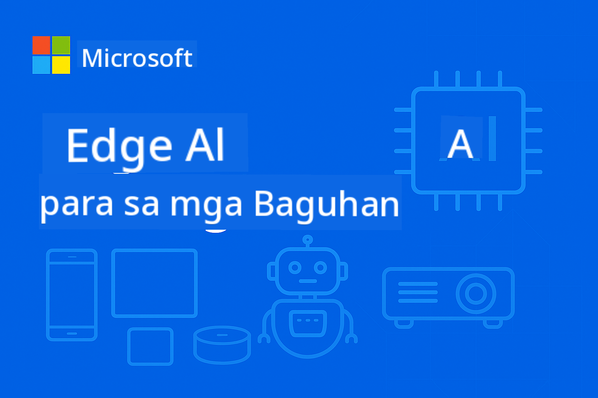

<!--
CO_OP_TRANSLATOR_METADATA:
{
  "original_hash": "ff006cd813df4152f5036e7b2bc5ed32",
  "translation_date": "2025-09-25T00:52:14+00:00",
  "source_file": "README.md",
  "language_code": "tl"
}
-->
# EdgeAI para sa mga Baguhan



Sundin ang mga hakbang na ito upang magsimula sa paggamit ng mga resources na ito:

1. **I-fork ang Repository**: I-click [](https://GitHub.com/microsoft/edgeai-for-beginners/fork)
2. **I-clone ang Repository**: `git clone https://github.com/microsoft/edgeai-for-beginners.git`
3. [**Sumali sa Azure AI Foundry Discord at makipag-ugnayan sa mga eksperto at kapwa developer**](https://discord.com/invite/ByRwuEEgH4)

### 🌐 Suporta sa Multi-Language

#### Sinusuportahan sa pamamagitan ng GitHub Action (Automated at Laging Napapanahon)

[Arabic](../ar/README.md) | [Bengali](../bn/README.md) | [Bulgarian](../bg/README.md) | [Burmese (Myanmar)](../my/README.md) | [Chinese (Simplified)](../zh/README.md) | [Chinese (Traditional, Hong Kong)](../hk/README.md) | [Chinese (Traditional, Macau)](../mo/README.md) | [Chinese (Traditional, Taiwan)](../tw/README.md) | [Croatian](../hr/README.md) | [Czech](../cs/README.md) | [Danish](../da/README.md) | [Dutch](../nl/README.md) | [Finnish](../fi/README.md) | [French](../fr/README.md) | [German](../de/README.md) | [Greek](../el/README.md) | [Hebrew](../he/README.md) | [Hindi](../hi/README.md) | [Hungarian](../hu/README.md) | [Indonesian](../id/README.md) | [Italian](../it/README.md) | [Japanese](../ja/README.md) | [Korean](../ko/README.md) | [Malay](../ms/README.md) | [Marathi](../mr/README.md) | [Nepali](../ne/README.md) | [Norwegian](../no/README.md) | [Persian (Farsi)](../fa/README.md) | [Polish](../pl/README.md) | [Portuguese (Brazil)](../br/README.md) | [Portuguese (Portugal)](../pt/README.md) | [Punjabi (Gurmukhi)](../pa/README.md) | [Romanian](../ro/README.md) | [Russian](../ru/README.md) | [Serbian (Cyrillic)](../sr/README.md) | [Slovak](../sk/README.md) | [Slovenian](../sl/README.md) | [Spanish](../es/README.md) | [Swahili](../sw/README.md) | [Swedish](../sv/README.md) | [Tagalog (Filipino)](./README.md) | [Thai](../th/README.md) | [Turkish](../tr/README.md) | [Ukrainian](../uk/README.md) | [Urdu](../ur/README.md) | [Vietnamese](../vi/README.md)

**Kung nais mong magkaroon ng karagdagang mga pagsasalin, ang mga sinusuportahang wika ay nakalista [dito](https://github.com/Azure/co-op-translator/blob/main/getting_started/supported-languages.md)**

## Panimula

Maligayang pagdating sa **EdgeAI para sa mga Baguhan** – ang iyong komprehensibong paglalakbay sa makabagong mundo ng Edge Artificial Intelligence. Ang kursong ito ay nag-uugnay sa makapangyarihang kakayahan ng AI at praktikal na deployment sa mga edge device, na nagbibigay-daan sa iyo upang magamit ang potensyal ng AI direkta kung saan nalilikha ang data at kinakailangan ang mga desisyon.

### Mga Matututunan Mo

Ang kursong ito ay magdadala sa iyo mula sa mga pangunahing konsepto hanggang sa mga handa nang ipatupad na solusyon, kabilang ang:
- **Small Language Models (SLMs)** na na-optimize para sa edge deployment
- **Hardware-aware optimization** sa iba't ibang platform
- **Real-time inference** na may kakayahang magpanatili ng privacy
- **Production deployment** na mga estratehiya para sa mga enterprise application

### Bakit Mahalaga ang EdgeAI

Ang Edge AI ay nagdadala ng pagbabago na tumutugon sa mga kritikal na hamon sa modernong panahon:
- **Privacy at Seguridad**: Iproseso ang sensitibong data nang lokal nang hindi kinakailangang ipadala sa cloud
- **Real-time Performance**: Tanggalin ang network latency para sa mga time-critical na aplikasyon
- **Cost Efficiency**: Bawasan ang bandwidth at gastos sa cloud computing
- **Resilient Operations**: Panatilihin ang functionality kahit may network outages
- **Regulatory Compliance**: Tugunan ang mga pangangailangan sa data sovereignty

### Edge AI

Ang Edge AI ay tumutukoy sa pagpapatakbo ng mga AI algorithm at language models nang lokal sa hardware, malapit sa kung saan nalilikha ang data, nang hindi umaasa sa cloud resources para sa inference. Binabawasan nito ang latency, pinapahusay ang privacy, at nagbibigay-daan sa real-time na paggawa ng desisyon.

### Mga Pangunahing Prinsipyo:
- **On-device inference**: Ang mga AI model ay tumatakbo sa mga edge device (mga telepono, router, microcontroller, industrial PC)
- **Offline capability**: Gumagana nang walang tuloy-tuloy na koneksyon sa internet
- **Low latency**: Agarang tugon na angkop para sa mga real-time na sistema
- **Data sovereignty**: Pinapanatili ang sensitibong data nang lokal, pinapabuti ang seguridad at pagsunod sa regulasyon

### Small Language Models (SLMs)

Ang mga SLM tulad ng Phi-4, Mistral-7B, at Gemma ay mga na-optimize na bersyon ng mas malalaking LLM—na sinanay o distilled para sa:
- **Mas maliit na memory footprint**: Epektibong paggamit ng limitadong memorya ng edge device
- **Mas mababang compute demand**: Na-optimize para sa CPU at edge GPU performance
- **Mas mabilis na startup times**: Mabilis na initialization para sa mga responsive na aplikasyon

Binubuksan nila ang makapangyarihang kakayahan sa NLP habang tinutugunan ang mga limitasyon ng:
- **Embedded systems**: Mga IoT device at industrial controller
- **Mobile devices**: Mga smartphone at tablet na may offline capabilities
- **IoT Devices**: Mga sensor at smart device na may limitadong resources
- **Edge servers**: Mga lokal na processing unit na may limitadong GPU resources
- **Personal Computers**: Mga desktop at laptop deployment scenarios

## Mga Module ng Kurso at Navigation

| Module | Paksa | Pokus na Lugar | Pangunahing Nilalaman | Antas | Tagal |
|--------|-------|----------------|-----------------------|-------|-------|
| [📚 01](../../Module01) | [Mga Pangunahing Konsepto ng EdgeAI](./Module01/README.md) | Paghahambing ng Cloud vs Edge AI | Mga Pangunahing Konsepto ng EdgeAI • Mga Real World Case Studies • Gabay sa Implementasyon • Edge Deployment | Baguhan | 3-4 oras |
| [🧠 02](../../Module02) | [Mga Batayan ng SLM Model](./Module02/README.md) | Mga pamilya ng modelo at arkitektura | Phi Family • Qwen Family • Gemma Family • BitNET • μModel • Phi-Silica | Baguhan | 4-5 oras |
| [🚀 03](../../Module03) | [Praktika sa Deployment ng SLM](./Module03/README.md) | Lokal at cloud deployment | Advanced Learning • Lokal na Kapaligiran • Cloud Deployment | Intermediate | 4-5 oras |
| [⚙️ 04](../../Module04) | [Toolkit sa Optimization ng Modelo](./Module04/README.md) | Cross-platform optimization | Panimula • Llama.cpp • Microsoft Olive • OpenVINO • Apple MLX • Workflow Synthesis | Intermediate | 5-6 oras |
| [🔧 05](../../Module05) | [SLMOps Production](./Module05/README.md) | Mga operasyon sa produksyon | Panimula sa SLMOps • Model Distillation • Fine-tuning • Production Deployment | Advanced | 5-6 oras |
| [🤖 06](../../Module06) | [AI Agents at Function Calling](./Module06/README.md) | Mga framework ng agent at MCP | Panimula sa Agent • Function Calling • Model Context Protocol | Advanced | 4-5 oras |
| [💻 07](../../Module07) | [Implementasyon ng Platform](./Module07/README.md) | Mga halimbawa ng cross-platform | AI Toolkit • Foundry Local • Windows Development | Advanced | 3-4 oras |
| [🏭 08](../../Module08) | [Foundry Local Toolkit](./Module08/README.md) | Mga handa nang ipatupad na halimbawa | Mga sample na aplikasyon (tingnan ang mga detalye sa ibaba) | Eksperto | 8-10 oras |

### 🏭 **Module 08: Mga Sample na Aplikasyon**

- [01: REST Chat Quickstart](./Module08/samples/01/README.md)
- [02: OpenAI SDK Integration](./Module08/samples/02/README.md)
- [03: Model Discovery & Benchmarking](./Module08/samples/03/README.md)
- [04: Chainlit RAG Application](./Module08/samples/04/README.md)
- [05: Multi-Agent Orchestration](./Module08/samples/05/README.md)
- [06: Models-as-Tools Router](./Module08/samples/06/README.md)
- [07: Direct API Client](./Module08/samples/07/README.md)
- [08: Windows 11 Chat App](./Module08/samples/08/README.md)
- [09: Advanced Multi-Agent System](./Module08/samples/09/README.md)
- [10: Foundry Tools Framework](./Module08/samples/10/README.md)

### 📊 **Buod ng Learning Path**
- **Kabuuang Tagal**: 36-45 oras
- **Path para sa Baguhan**: Modules 01-02 (7-9 oras)  
- **Path para sa Intermediate**: Modules 03-04 (9-11 oras)
- **Path para sa Advanced**: Modules 05-07 (12-15 oras)
- **Path para sa Eksperto**: Module 08 (8-10 oras)

## Ano ang Iyong Mabubuo

### 🎯 Pangunahing Kakayahan
- **Arkitektura ng Edge AI**: Magdisenyo ng mga lokal-first na AI system na may cloud integration
- **Optimization ng Modelo**: I-quantize at i-compress ang mga modelo para sa edge deployment (85% bilis na pagtaas, 75% pagbawas sa laki)
- **Multi-Platform Deployment**: Windows, mobile, embedded, at cloud-edge hybrid systems
- **Mga Operasyon sa Produksyon**: Monitoring, scaling, at pagpapanatili ng edge AI sa produksyon

### 🏗️ Praktikal na Mga Proyekto
- **Foundry Local Chat Apps**: Windows 11 native application na may model switching
- **Multi-Agent Systems**: Coordinator na may mga specialist agent para sa mga complex na workflow  
- **RAG Applications**: Lokal na pagproseso ng dokumento na may vector search
- **Model Routers**: Matalinong pagpili sa pagitan ng mga modelo batay sa task analysis
- **API Frameworks**: Mga handa nang ipatupad na client na may streaming at health monitoring
- **Cross-Platform Tools**: Mga pattern ng integration ng LangChain/Semantic Kernel

### 🏢 Mga Aplikasyon sa Industriya
**Paggawa** • **Healthcare** • **Autonomous Vehicles** • **Smart Cities** • **Mobile Apps**

## Mabilis na Pagsisimula

**Inirerekomendang Learning Path** (20-30 oras kabuuan):

1. **📚 Foundation** (Modules 01-02): Mga konsepto ng EdgeAI + mga pamilya ng SLM model
2. **⚙️ Optimization** (Modules 03-04): Deployment + mga framework ng quantization  
3. **🚀 Production** (Modules 05-06): SLMOps + AI agents + function calling
4. **💻 Implementasyon** (Modules 07-08): Mga sample ng platform + Foundry Local toolkit

Ang bawat module ay may kasamang teorya, mga hands-on na exercise, at mga handa nang ipatupad na code sample.

## Epekto sa Karera
**Mga Teknikal na Papel**: EdgeAI Solutions Architect • ML Engineer (Edge) • IoT AI Developer • Mobile AI Developer

**Mga Sektor ng Industriya**: Manufacturing 4.0 • Healthcare Tech • Autonomous Systems • FinTech • Consumer Electronics

**Mga Proyekto sa Portfolio**: Multi-agent systems • Production RAG apps • Cross-platform deployment • Performance optimization

## Istruktura ng Repository

```
edgeai-for-beginners/
├── 📚 Module01-04/     # Fundamentals → SLMs → Deployment → Optimization  
├── 🔧 Module05-06/     # SLMOps → AI Agents → Function Calling
├── 💻 Module07/        # Platform Samples (VS Code, Windows, Jetson, Mobile)
├── 🏭 Module08/        # Foundry Local Toolkit + 10 Comprehensive Samples
│   ├── samples/01-06/  # Foundation: REST, SDK, RAG, Agents, Routing
│   └── samples/07-10/  # Advanced: API Client, Windows App, Enterprise Agents, Tools
├── 🌐 translations/    # Multi-language support (8+ languages)
└── 📋 STUDY_GUIDE.md   # Structured learning paths & time allocation
```

## Mga Highlight ng Kurso

✅ **Progressive Learning**: Teorya → Praktika → Production deployment  
✅ **Mga Tunay na Kaso**: Microsoft, Japan Airlines, enterprise implementations  
✅ **Mga Hands-on na Halimbawa**: 50+ na halimbawa, 10 komprehensibong Foundry Local demos  
✅ **Pagtuon sa Performance**: 85% na pagbilis, 75% na pagbawas sa laki  
✅ **Multi-Platform**: Windows, mobile, embedded, cloud-edge hybrid  
✅ **Handa sa Produksyon**: Monitoring, scaling, security, compliance frameworks

📖 **[Available ang Gabay sa Pag-aaral](STUDY_GUIDE.md)**: Nakabalangkas na 20-oras na landas sa pag-aaral na may gabay sa paglalaan ng oras at mga tool para sa self-assessment.

---

**Ang EdgeAI ang kinabukasan ng AI deployment**: lokal muna, privacy-preserving, at mahusay. Masterin ang mga kasanayang ito upang makabuo ng susunod na henerasyon ng mga intelligent na aplikasyon.

## Iba Pang Mga Kurso

Ang aming koponan ay gumagawa ng iba pang mga kurso! Tingnan:

- [MCP para sa Mga Baguhan](https://github.com/microsoft/mcp-for-beginners)
- [AI Agents Para sa Mga Baguhan](https://github.com/microsoft/ai-agents-for-beginners?WT.mc_id=academic-105485-koreyst)
- [Generative AI para sa Mga Baguhan gamit ang .NET](https://github.com/microsoft/Generative-AI-for-beginners-dotnet?WT.mc_id=academic-105485-koreyst)
- [Generative AI para sa Mga Baguhan gamit ang JavaScript](https://github.com/microsoft/generative-ai-with-javascript?WT.mc_id=academic-105485-koreyst)
- [Generative AI para sa Mga Baguhan](https://github.com/microsoft/generative-ai-for-beginners?WT.mc_id=academic-105485-koreyst)
- [ML para sa Mga Baguhan](https://aka.ms/ml-beginners?WT.mc_id=academic-105485-koreyst)
- [Data Science para sa Mga Baguhan](https://aka.ms/datascience-beginners?WT.mc_id=academic-105485-koreyst)
- [AI para sa Mga Baguhan](https://aka.ms/ai-beginners?WT.mc_id=academic-105485-koreyst)
- [Cybersecurity para sa Mga Baguhan](https://github.com/microsoft/Security-101??WT.mc_id=academic-96948-sayoung)
- [Web Dev para sa Mga Baguhan](https://aka.ms/webdev-beginners?WT.mc_id=academic-105485-koreyst)
- [IoT para sa Mga Baguhan](https://aka.ms/iot-beginners?WT.mc_id=academic-105485-koreyst)
- [XR Development para sa Mga Baguhan](https://github.com/microsoft/xr-development-for-beginners?WT.mc_id=academic-105485-koreyst)
- [Mastering GitHub Copilot para sa AI Paired Programming](https://aka.ms/GitHubCopilotAI?WT.mc_id=academic-105485-koreyst)
- [Mastering GitHub Copilot para sa C#/.NET Developers](https://github.com/microsoft/mastering-github-copilot-for-dotnet-csharp-developers?WT.mc_id=academic-105485-koreyst)
- [Piliin ang Iyong Sariling Copilot Adventure](https://github.com/microsoft/CopilotAdventures?WT.mc_id=academic-105485-koreyst)

---

