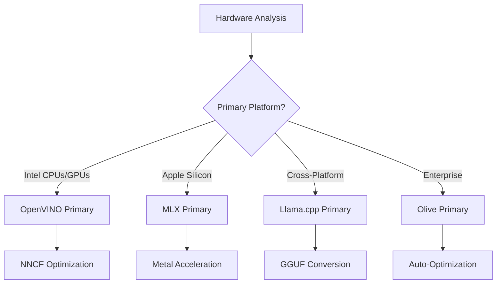
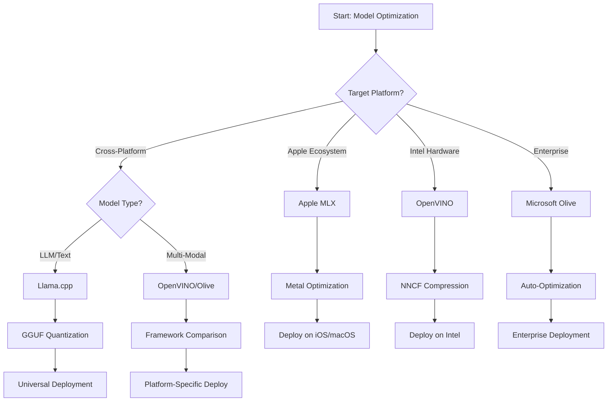
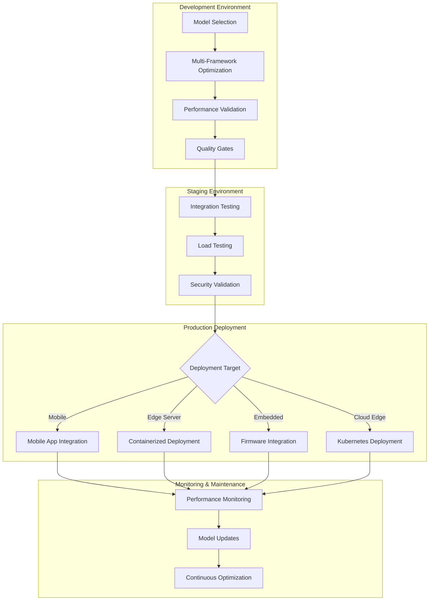

<!--
CO_OP_TRANSLATOR_METADATA:
{
  "original_hash": "6719c4a7e44b948230ac5f5cab3699bd",
  "translation_date": "2025-09-17T23:35:20+00:00",
  "source_file": "Module04/06.workflow-synthesis.md",
  "language_code": "tr"
}
-->
# Bölüm 6: Edge AI Geliştirme İş Akışı Sentezi

## İçindekiler
1. [Giriş](../../../Module04)
2. [Öğrenme Hedefleri](../../../Module04)
3. [Birleşik İş Akışı Genel Bakış](../../../Module04)
4. [Çerçeve Seçim Matrisi](../../../Module04)
5. [En İyi Uygulamalar Sentezi](../../../Module04)
6. [Dağıtım Stratejisi Rehberi](../../../Module04)
7. [Performans Optimizasyonu İş Akışı](../../../Module04)
8. [Üretim Hazırlık Kontrol Listesi](../../../Module04)
9. [Sorun Giderme ve İzleme](../../../Module04)
10. [Edge AI Boru Hattınızı Geleceğe Hazırlama](../../../Module04)

## Giriş

Edge AI geliştirme, birden fazla optimizasyon çerçevesi, dağıtım stratejisi ve donanım gereksinimlerini anlamayı gerektirir. Bu kapsamlı sentez, Llama.cpp, Microsoft Olive, OpenVINO ve Apple MLX'ten elde edilen bilgileri bir araya getirerek verimliliği en üst düzeye çıkaran, kaliteyi koruyan ve başarılı üretim dağıtımını sağlayan birleşik bir iş akışı oluşturur.

Bu kurs boyunca, her biri kendine özgü güçlü yönlere ve özel kullanım alanlarına sahip bireysel optimizasyon çerçevelerini inceledik. Ancak, gerçek dünya Edge AI projeleri genellikle birden fazla çerçeveden teknikleri birleştirmeyi veya belirli kısıtlamalar ve gereksinimler için en iyi sonuçları sağlayacak yaklaşımı seçmeyi gerektirir.

Bu bölüm, tüm çerçevelerden elde edilen kolektif bilgeliği, üretime hazır Edge AI çözümleri oluşturmanıza olanak tanıyan uygulanabilir iş akışları, karar ağaçları ve en iyi uygulamalar halinde sentezler. Mobil cihazlar, gömülü sistemler veya edge sunucular için optimize ediyor olun, bu rehber geliştirme yaşam döngünüz boyunca bilinçli kararlar almanız için stratejik bir çerçeve sunar.

## Öğrenme Hedefleri

Bu bölümün sonunda şunları yapabileceksiniz:

### Stratejik Karar Verme
- Proje gereksinimleri, donanım kısıtlamaları ve dağıtım senaryolarına göre **en uygun optimizasyon çerçevesini değerlendirin ve seçin**
- **Birden fazla optimizasyon tekniğini entegre eden kapsamlı iş akışları tasarlayın** ve maksimum verimlilik sağlayın
- Farklı çerçeveler arasında model doğruluğu, çıkarım hızı, bellek kullanımı ve dağıtım karmaşıklığı arasındaki **takasları değerlendirin**

### İş Akışı Entegrasyonu
- **Birden fazla optimizasyon çerçevesinin güçlü yönlerinden yararlanan birleşik geliştirme boru hatlarını uygulayın**
- Farklı ortamlar arasında tutarlı model optimizasyonu ve dağıtımı için **tekrarlanabilir iş akışları oluşturun**
- Optimize edilmiş modellerin üretim gereksinimlerini karşıladığından emin olmak için **kalite kapıları ve doğrulama süreçleri oluşturun**

### Performans Optimizasyonu
- Kuantizasyon, budama ve donanıma özel hızlandırma tekniklerini kullanarak **sistematik optimizasyon stratejileri uygulayın**
- Farklı optimizasyon seviyeleri ve dağıtım hedefleri arasında model performansını **izleyin ve karşılaştırın**
- CPU, GPU, NPU ve özel edge hızlandırıcılar dahil olmak üzere **belirli donanım platformları için optimize edin**

### Üretim Dağıtımı
- Birden fazla model formatı ve çıkarım motorunu destekleyen **ölçeklenebilir dağıtım mimarileri tasarlayın**
- Üretim ortamlarında Edge AI uygulamaları için **izleme ve gözlemlenebilirlik uygulayın**
- Model güncellemeleri, performans izleme ve sistem optimizasyonu için **bakım iş akışları oluşturun**

### Çapraz Platform Mükemmelliği
- Farklı donanım platformlarında optimize edilmiş modelleri **dağıtın** ve tutarlı performansı koruyun
- Windows, macOS, Linux, mobil ve gömülü sistemler için **platforma özel optimizasyonları yönetin**
- Farklı edge ortamlarında sorunsuz dağıtımı sağlayan **soyutlama katmanları oluşturun**

## Birleşik İş Akışı Genel Bakış

### Aşama 1: Gereksinim Analizi ve Çerçeve Seçimi

Başarılı Edge AI dağıtımının temeli, çerçeve seçimi ve optimizasyon stratejisini bilgilendiren kapsamlı gereksinim analizidir.

#### 1.1 Donanım Değerlendirmesi


**Anahtar Hususlar:**
- **CPU Mimarisi**: x86, ARM, Apple Silicon yetenekleri
- **Hızlandırıcı Mevcudiyeti**: GPU, NPU, VPU, özel AI çipleri
- **Bellek Kısıtlamaları**: RAM sınırlamaları, depolama kapasitesi
- **Güç Bütçesi**: Pil ömrü, termal kısıtlamalar
- **Bağlantı**: Çevrimdışı gereksinimler, bant genişliği sınırlamaları

#### 1.2 Uygulama Gereksinimleri Matrisi

| Gereksinim | Llama.cpp | Microsoft Olive | OpenVINO | Apple MLX |
|------------|-----------|-----------------|----------|-----------|
| Çapraz platform | ✅ Mükemmel | ⚡ İyi | ⚡ İyi | ❌ Sadece Apple |
| Kurumsal Entegrasyon | ⚡ Temel | ✅ Mükemmel | ✅ Mükemmel | ⚡ Sınırlı |
| Mobil Dağıtım | ✅ Mükemmel | ⚡ İyi | ⚡ İyi | ✅ iOS Mükemmel |
| Gerçek zamanlı çıkarım | ✅ Mükemmel | ✅ Mükemmel | ✅ Mükemmel | ✅ Mükemmel |
| Model Çeşitliliği | ✅ LLM Odaklı | ✅ Tüm Modeller | ✅ Tüm Modeller | ✅ LLM Odaklı |
| Kullanım Kolaylığı | ✅ Basit | ✅ Otomatik | ⚡ Orta | ✅ Basit |

### Aşama 2: Model Hazırlığı ve Optimizasyonu

#### 2.1 Evrensel Model Değerlendirme Boru Hattı

```python
# Universal Model Assessment Framework
class EdgeAIModelAssessment:
    def __init__(self, model_path, target_hardware):
        self.model_path = model_path
        self.target_hardware = target_hardware
        self.optimization_frameworks = []
        
    def assess_model_characteristics(self):
        """Analyze model size, architecture, and complexity"""
        return {
            'model_size': self.get_model_size(),
            'parameter_count': self.get_parameter_count(),
            'architecture_type': self.detect_architecture(),
            'quantization_compatibility': self.check_quantization_support()
        }
    
    def recommend_optimization_strategy(self):
        """Recommend optimal frameworks and techniques"""
        characteristics = self.assess_model_characteristics()
        
        if self.target_hardware.startswith('apple'):
            return self.mlx_optimization_strategy(characteristics)
        elif self.target_hardware.startswith('intel'):
            return self.openvino_optimization_strategy(characteristics)
        elif characteristics['model_size'] > 7_000_000_000:  # 7B+ parameters
            return self.enterprise_optimization_strategy(characteristics)
        else:
            return self.lightweight_optimization_strategy(characteristics)
```

#### 2.2 Çoklu Çerçeve Optimizasyon Boru Hattı

**Sıralı Optimizasyon Yaklaşımı:**
1. **İlk Dönüşüm**: Ara formatlara dönüştürme (mümkünse ONNX)
2. **Çerçeveye Özgü Optimizasyon**: Özel teknikleri uygulama
3. **Çapraz Doğrulama**: Hedef platformlar arasında performansı doğrulama
4. **Son Paketleme**: Dağıtıma hazırlık

```bash
# Multi-Framework Optimization Script
#!/bin/bash

MODEL_NAME="phi-3-mini"
BASE_MODEL="microsoft/Phi-3-mini-4k-instruct"

# Phase 1: ONNX Conversion (Universal)
python convert_to_onnx.py --model $BASE_MODEL --output models/onnx/

# Phase 2: Platform-Specific Optimization
if [[ "$TARGET_PLATFORM" == "intel" ]]; then
    # OpenVINO Optimization
    python optimize_openvino.py --input models/onnx/ --output models/openvino/
elif [[ "$TARGET_PLATFORM" == "apple" ]]; then
    # MLX Optimization
    python optimize_mlx.py --input $BASE_MODEL --output models/mlx/
elif [[ "$TARGET_PLATFORM" == "cross" ]]; then
    # Llama.cpp Optimization
    python convert_to_gguf.py --input models/onnx/ --output models/gguf/
fi

# Phase 3: Validation
python validate_optimization.py --original $BASE_MODEL --optimized models/$TARGET_PLATFORM/
```

### Aşama 3: Performans Doğrulama ve Karşılaştırma

#### 3.1 Kapsamlı Karşılaştırma Çerçevesi

```python
class EdgeAIBenchmark:
    def __init__(self, optimized_models):
        self.models = optimized_models
        self.metrics = {
            'inference_time': [],
            'memory_usage': [],
            'accuracy_score': [],
            'throughput': [],
            'energy_consumption': []
        }
    
    def run_comprehensive_benchmark(self):
        """Execute standardized benchmarks across all optimized models"""
        test_inputs = self.generate_test_inputs()
        
        for model_framework, model_path in self.models.items():
            print(f"Benchmarking {model_framework}...")
            
            # Latency Testing
            latency = self.measure_inference_latency(model_path, test_inputs)
            
            # Memory Profiling
            memory = self.profile_memory_usage(model_path)
            
            # Accuracy Validation
            accuracy = self.validate_model_accuracy(model_path, test_inputs)
            
            # Throughput Analysis
            throughput = self.measure_throughput(model_path)
            
            self.record_metrics(model_framework, latency, memory, accuracy, throughput)
    
    def generate_optimization_report(self):
        """Create comprehensive comparison report"""
        report = {
            'recommendations': self.analyze_performance_trade_offs(),
            'deployment_guidance': self.generate_deployment_recommendations(),
            'monitoring_requirements': self.define_monitoring_metrics()
        }
        return report
```

## Çerçeve Seçim Matrisi

### Çerçeve Seçimi için Karar Ağacı



### Kapsamlı Seçim Kriterleri

#### 1. Birincil Kullanım Alanı Uyumu

**Büyük Dil Modelleri (LLM):**
- **Llama.cpp**: CPU odaklı, çapraz platform dağıtımı için en iyisi
- **Apple MLX**: Apple Silicon için optimal, birleşik bellek ile
- **OpenVINO**: Intel donanımı için mükemmel, NNCF optimizasyonu ile
- **Microsoft Olive**: Otomasyonlu kurumsal iş akışları için ideal

**Çok Modlu Modeller:**
- **OpenVINO**: Görüntü, ses ve metin için kapsamlı destek
- **Microsoft Olive**: Karmaşık boru hatları için kurumsal düzeyde optimizasyon
- **Llama.cpp**: Sadece metin tabanlı modellerle sınırlı
- **Apple MLX**: Çok modlu uygulamalar için artan destek

#### 2. Donanım Platform Matrisi

| Platform | Birincil Çerçeve | İkincil Seçenek | Özel Özellikler |
|----------|------------------|-----------------|-----------------|
| Intel CPU/GPU | OpenVINO | Microsoft Olive | NNCF sıkıştırma, Intel optimizasyonu |
| NVIDIA GPU | Microsoft Olive | OpenVINO | CUDA hızlandırma, kurumsal özellikler |
| Apple Silicon | Apple MLX | Llama.cpp | Metal gölgelendiriciler, birleşik bellek |
| ARM Mobil | Llama.cpp | OpenVINO | Çapraz platform, minimum bağımlılıklar |
| Edge TPU | OpenVINO | Microsoft Olive | Özel hızlandırıcı desteği |
| Gömülü ARM | Llama.cpp | OpenVINO | Minimum ayak izi, verimli çıkarım |

#### 3. Geliştirme İş Akışı Tercihleri

**Hızlı Prototipleme:**
1. **Llama.cpp**: En hızlı kurulum, anında sonuçlar
2. **Apple MLX**: Basit Python API, hızlı iterasyon
3. **Microsoft Olive**: Otomatik optimizasyon, minimum yapılandırma
4. **OpenVINO**: Daha karmaşık kurulum, kapsamlı özellikler

**Kurumsal Üretim:**
1. **Microsoft Olive**: Kurumsal özellikler, Azure entegrasyonu
2. **OpenVINO**: Intel ekosistemi, kapsamlı araçlar
3. **Apple MLX**: Apple'a özel kurumsal uygulamalar
4. **Llama.cpp**: Basit dağıtım, sınırlı kurumsal özellikler

## En İyi Uygulamalar Sentezi

### Evrensel Optimizasyon İlkeleri

#### 1. Aşamalı Optimizasyon Stratejisi

```python
class ProgressiveOptimization:
    def __init__(self, base_model):
        self.base_model = base_model
        self.optimization_stages = [
            'baseline_measurement',
            'format_conversion',
            'quantization_optimization',
            'hardware_acceleration',
            'production_validation'
        ]
    
    def execute_progressive_optimization(self):
        """Apply optimization techniques incrementally"""
        
        # Stage 1: Baseline Measurement
        baseline_metrics = self.measure_baseline_performance()
        
        # Stage 2: Format Conversion
        converted_model = self.convert_to_optimal_format()
        conversion_metrics = self.measure_performance(converted_model)
        
        # Stage 3: Quantization
        quantized_model = self.apply_quantization(converted_model)
        quantization_metrics = self.measure_performance(quantized_model)
        
        # Stage 4: Hardware Acceleration
        accelerated_model = self.enable_hardware_acceleration(quantized_model)
        acceleration_metrics = self.measure_performance(accelerated_model)
        
        # Stage 5: Validation
        production_ready = self.validate_for_production(accelerated_model)
        
        return self.compile_optimization_report(
            baseline_metrics, conversion_metrics, 
            quantization_metrics, acceleration_metrics
        )
```

#### 2. Kalite Kapısı Uygulaması

**Doğruluk Koruma Kapıları:**
- Orijinal model doğruluğunun %95'inden fazlasını koruyun
- Temsili test veri setlerine karşı doğrulama yapın
- Üretim doğrulaması için A/B testi uygulayın

**Performans İyileştirme Kapıları:**
- Minimum 2 kat hız iyileştirmesi sağlayın
- Bellek kullanımını en az %50 azaltın
- Çıkarım süresi tutarlılığını doğrulayın

**Üretim Hazırlık Kapıları:**
- Yük altında stres testlerini geçin
- Zaman içinde istikrarlı performans gösterin
- Güvenlik ve gizlilik gereksinimlerini doğrulayın

### Çerçeveye Özgü En İyi Uygulamalar Entegrasyonu

#### 1. Kuantizasyon Stratejisi Sentezi

```python
# Unified Quantization Approach
class UnifiedQuantizationStrategy:
    def __init__(self, model, target_platform):
        self.model = model
        self.platform = target_platform
        
    def select_optimal_quantization(self):
        """Choose best quantization based on platform and requirements"""
        
        if self.platform == 'apple_silicon':
            return self.mlx_quantization_strategy()
        elif self.platform == 'intel_hardware':
            return self.openvino_quantization_strategy()
        elif self.platform == 'cross_platform':
            return self.llamacpp_quantization_strategy()
        else:
            return self.olive_quantization_strategy()
    
    def mlx_quantization_strategy(self):
        """Apple MLX-specific quantization"""
        return {
            'method': 'mlx_quantize',
            'precision': 'int4',
            'group_size': 64,
            'optimization_target': 'unified_memory'
        }
    
    def openvino_quantization_strategy(self):
        """OpenVINO NNCF quantization"""
        return {
            'method': 'nncf_quantize',
            'precision': 'int8',
            'calibration_method': 'post_training',
            'optimization_target': 'intel_hardware'
        }
```

#### 2. Donanım Hızlandırma Optimizasyonu

**CPU Optimizasyon Sentezi:**
- **SIMD Talimatları**: Çerçeveler arasında optimize edilmiş çekirdeklerden yararlanın
- **Bellek Bant Genişliği**: Önbellek verimliliği için veri düzenlerini optimize edin
- **İş Parçacığı Yönetimi**: Paralellik ile kaynak kısıtlamalarını dengeleyin

**GPU Hızlandırma En İyi Uygulamaları:**
- **Toplu İşleme**: Uygun toplu boyutlarla verimi en üst düzeye çıkarın
- **Bellek Yönetimi**: GPU bellek tahsisini ve transferlerini optimize edin
- **Hassasiyet**: Daha iyi performans için desteklendiğinde FP16 kullanın

**NPU/Özel Hızlandırıcı Optimizasyonu:**
- **Model Mimarisi**: Hızlandırıcı yetenekleriyle uyumluluğu sağlayın
- **Veri Akışı**: Hızlandırıcı verimliliği için giriş/çıkış boru hatlarını optimize edin
- **Yedekleme Stratejileri**: Desteklenmeyen işlemler için CPU yedekleme uygulayın

## Dağıtım Stratejisi Rehberi

### Evrensel Dağıtım Mimarisi



### Platforma Özgü Dağıtım Modelleri

#### 1. Mobil Dağıtım Stratejisi

```yaml
# Mobile Deployment Configuration
mobile_deployment:
  ios:
    framework: apple_mlx
    optimization:
      quantization: int4
      memory_mapping: true
      background_execution: limited
    packaging:
      format: mlx
      bundle_size: <50MB
      
  android:
    framework: llama_cpp
    optimization:
      quantization: q4_k_m
      threading: android_optimized
      memory_management: conservative
    packaging:
      format: gguf
      apk_size: <100MB
      
  cross_platform:
    framework: onnx_runtime
    optimization:
      quantization: int8
      execution_provider: cpu
    packaging:
      format: onnx
      shared_libraries: minimal
```

#### 2. Edge Sunucu Dağıtımı

```yaml
# Edge Server Deployment Configuration
edge_server:
  intel_based:
    framework: openvino
    optimization:
      quantization: int8
      acceleration: cpu_gpu_auto
      batch_processing: dynamic
    deployment:
      container: openvino_runtime
      orchestration: kubernetes
      scaling: horizontal
      
  nvidia_based:
    framework: microsoft_olive
    optimization:
      quantization: int4
      acceleration: cuda
      tensor_parallelism: true
    deployment:
      container: nvidia_triton
      orchestration: kubernetes
      scaling: gpu_aware
```

### Konteynerleştirme En İyi Uygulamaları

```dockerfile
# Multi-Framework Edge AI Container
FROM ubuntu:22.04 as base

# Install common dependencies
RUN apt-get update && apt-get install -y \
    python3 \
    python3-pip \
    build-essential \
    cmake \
    && rm -rf /var/lib/apt/lists/*

# Framework-specific stages
FROM base as openvino
RUN pip install openvino nncf optimum[intel]

FROM base as llamacpp
RUN git clone https://github.com/ggerganov/llama.cpp.git \
    && cd llama.cpp && make LLAMA_OPENBLAS=1

FROM base as olive
RUN pip install olive-ai[auto-opt] onnxruntime-genai

# Production stage with selected framework
FROM openvino as production
COPY models/ /app/models/
COPY src/ /app/src/
WORKDIR /app

EXPOSE 8080
CMD ["python3", "src/inference_server.py"]
```

## Performans Optimizasyonu İş Akışı

### Sistematik Performans Ayarı

#### 1. Performans Profilleme Boru Hattı

```python
class EdgeAIPerformanceProfiler:
    def __init__(self, model_path, framework):
        self.model_path = model_path
        self.framework = framework
        self.profiling_results = {}
    
    def comprehensive_profiling(self):
        """Execute comprehensive performance analysis"""
        
        # CPU Profiling
        cpu_profile = self.profile_cpu_usage()
        
        # Memory Profiling
        memory_profile = self.profile_memory_usage()
        
        # Inference Latency
        latency_profile = self.profile_inference_latency()
        
        # Throughput Analysis
        throughput_profile = self.profile_throughput()
        
        # Energy Consumption (where available)
        energy_profile = self.profile_energy_consumption()
        
        return self.compile_performance_report(
            cpu_profile, memory_profile, latency_profile,
            throughput_profile, energy_profile
        )
    
    def identify_bottlenecks(self):
        """Automatically identify performance bottlenecks"""
        bottlenecks = []
        
        if self.profiling_results['cpu_utilization'] > 80:
            bottlenecks.append('cpu_bound')
        
        if self.profiling_results['memory_usage'] > 90:
            bottlenecks.append('memory_bound')
        
        if self.profiling_results['inference_variance'] > 20:
            bottlenecks.append('inconsistent_performance')
        
        return self.generate_optimization_recommendations(bottlenecks)
```

#### 2. Otomatik Optimizasyon Boru Hattı

```python
class AutomatedOptimizationPipeline:
    def __init__(self, base_model, target_constraints):
        self.base_model = base_model
        self.constraints = target_constraints
        self.optimization_history = []
    
    def execute_optimization_search(self):
        """Systematically search optimization space"""
        
        optimization_candidates = [
            {'quantization': 'int8', 'pruning': 0.1},
            {'quantization': 'int4', 'pruning': 0.2},
            {'quantization': 'int8', 'acceleration': 'gpu'},
            {'quantization': 'int4', 'acceleration': 'npu'}
        ]
        
        best_configuration = None
        best_score = 0
        
        for config in optimization_candidates:
            optimized_model = self.apply_optimization(config)
            score = self.evaluate_optimization(optimized_model)
            
            if score > best_score and self.meets_constraints(optimized_model):
                best_score = score
                best_configuration = config
            
            self.optimization_history.append({
                'config': config,
                'score': score,
                'model': optimized_model
            })
        
        return best_configuration, self.optimization_history
```

### Çok Amaçlı Optimizasyon

#### 1. Edge AI için Pareto Optimizasyonu

```python
class ParetoOptimization:
    def __init__(self, objectives=['speed', 'accuracy', 'memory']):
        self.objectives = objectives
        self.pareto_frontier = []
    
    def find_pareto_optimal_solutions(self, optimization_results):
        """Identify Pareto-optimal configurations"""
        
        for result in optimization_results:
            is_dominated = False
            
            for frontier_point in self.pareto_frontier:
                if self.dominates(frontier_point, result):
                    is_dominated = True
                    break
            
            if not is_dominated:
                # Remove dominated points from frontier
                self.pareto_frontier = [
                    point for point in self.pareto_frontier 
                    if not self.dominates(result, point)
                ]
                
                self.pareto_frontier.append(result)
        
        return self.pareto_frontier
    
    def recommend_configuration(self, user_preferences):
        """Recommend configuration based on user preferences"""
        
        weighted_scores = []
        for config in self.pareto_frontier:
            score = sum(
                user_preferences[obj] * config['metrics'][obj] 
                for obj in self.objectives
            )
            weighted_scores.append((score, config))
        
        return max(weighted_scores, key=lambda x: x[0])[1]
```

## Üretim Hazırlık Kontrol Listesi

### Kapsamlı Üretim Doğrulaması

#### 1. Model Kalite Güvencesi

```python
class ProductionReadinessValidator:
    def __init__(self, optimized_model, production_requirements):
        self.model = optimized_model
        self.requirements = production_requirements
        self.validation_results = {}
    
    def validate_model_quality(self):
        """Comprehensive model quality validation"""
        
        # Accuracy Validation
        accuracy_result = self.validate_accuracy()
        
        # Performance Validation
        performance_result = self.validate_performance()
        
        # Robustness Testing
        robustness_result = self.validate_robustness()
        
        # Security Assessment
        security_result = self.validate_security()
        
        # Compliance Verification
        compliance_result = self.validate_compliance()
        
        return self.compile_validation_report(
            accuracy_result, performance_result, robustness_result,
            security_result, compliance_result
        )
    
    def generate_certification_report(self):
        """Generate production certification report"""
        return {
            'model_signature': self.generate_model_signature(),
            'validation_timestamp': datetime.now(),
            'validation_results': self.validation_results,
            'deployment_approval': self.check_deployment_approval(),
            'monitoring_requirements': self.define_monitoring_requirements()
        }
```

#### 2. Üretim Dağıtım Kontrol Listesi

**Dağıtım Öncesi Doğrulama:**
- [ ] Model doğruluğu minimum gereksinimleri karşılıyor (>%95 temel değer)
- [ ] Performans hedefleri karşılandı (gecikme, verim, bellek)
- [ ] Güvenlik açıkları değerlendirildi ve giderildi
- [ ] Beklenen yük altında stres testi tamamlandı
- [ ] Hata senaryoları test edildi ve kurtarma prosedürleri doğrulandı
- [ ] İzleme ve uyarı sistemleri yapılandırıldı
- [ ] Geri alma prosedürleri test edildi ve belgelenmiş

**Dağıtım Süreci:**
- [ ] Mavi-yeşil dağıtım stratejisi uygulandı
- [ ] Kademeli trafik artırımı yapılandırıldı
- [ ] Gerçek zamanlı izleme panoları aktif
- [ ] Performans temel değerleri oluşturuldu
- [ ] Hata oranı eşikleri tanımlandı
- [ ] Otomatik geri alma tetikleyicileri yapılandırıldı

**Dağıtım Sonrası İzleme:**
- [ ] Model sapma algılama aktif
- [ ] Performans bozulma uyarıları yapılandırıldı
- [ ] Kaynak kullanımı izleme etkinleştirildi
- [ ] Kullanıcı deneyimi metrikleri takip edildi
- [ ] Model sürümleme ve soy geçmişi korundu
- [ ] Düzenli model performans incelemeleri planlandı

### Sürekli Entegrasyon/Sürekli Dağıtım (CI/CD)

```yaml
# Edge AI CI/CD Pipeline Configuration
edge_ai_pipeline:
  stages:
    - model_validation
    - optimization
    - testing
    - staging_deployment
    - production_deployment
    - monitoring
  
  model_validation:
    accuracy_threshold: 0.95
    performance_baseline: required
    security_scan: enabled
    
  optimization:
    frameworks:
      - llama_cpp
      - openvino
      - microsoft_olive
    validation:
      cross_validation: enabled
      performance_comparison: required
      
  testing:
    unit_tests: comprehensive
    integration_tests: full_pipeline
    load_tests: production_scale
    security_tests: comprehensive
    
  deployment:
    strategy: blue_green
    traffic_ramping: gradual
    rollback: automatic
    monitoring: real_time
```

## Sorun Giderme ve İzleme

### Evrensel Sorun Giderme Çerçevesi

#### 1. Yaygın Sorunlar ve Çözümler

**Performans Sorunları:**
```python
class PerformanceTroubleshooter:
    def __init__(self, model_metrics):
        self.metrics = model_metrics
        
    def diagnose_performance_issues(self):
        """Systematic performance issue diagnosis"""
        
        issues = []
        
        # High latency diagnosis
        if self.metrics['avg_latency'] > self.metrics['target_latency']:
            issues.append(self.diagnose_latency_issues())
        
        # Memory usage diagnosis
        if self.metrics['memory_usage'] > self.metrics['memory_limit']:
            issues.append(self.diagnose_memory_issues())
        
        # Throughput diagnosis
        if self.metrics['throughput'] < self.metrics['target_throughput']:
            issues.append(self.diagnose_throughput_issues())
        
        return self.generate_resolution_plan(issues)
    
    def diagnose_latency_issues(self):
        """Specific latency troubleshooting"""
        potential_causes = []
        
        if self.metrics['cpu_utilization'] > 80:
            potential_causes.append('cpu_bottleneck')
        
        if self.metrics['memory_bandwidth'] > 90:
            potential_causes.append('memory_bandwidth_limit')
        
        if self.metrics['model_size'] > self.metrics['optimal_size']:
            potential_causes.append('model_too_large')
        
        return {
            'issue': 'high_latency',
            'causes': potential_causes,
            'solutions': self.generate_latency_solutions(potential_causes)
        }
```

**Çerçeveye Özgü Sorun Giderme:**

| Sorun | Llama.cpp | Microsoft Olive | OpenVINO | Apple MLX |
|-------|-----------|-----------------|----------|-----------|
| Bellek Sorunları | Bağlam uzunluğunu azaltın | Toplu boyutu düşürün | Önbelleği etkinleştirin | Bellek eşlemesini kullanın |
| Yavaş Çıkarım | SIMD'yi etkinleştirin | Kuantizasyonu kontrol edin | İş parçacığını optimize edin | Metal'i etkinleştirin |
| Doğruluk Kaybı | Daha yüksek kuantizasyon | QAT ile yeniden eğitin | Kalibrasyonu artırın | Kuantizasyondan sonra ince ayar yapın |
| Uyumluluk | Model formatını kontrol edin | Çerçeve sürümünü doğrulayın | Sürücüleri güncelleyin | macOS sürümünü kontrol edin |

#### 2. Üretim İzleme Stratejisi

```python
class EdgeAIMonitoring:
    def __init__(self, deployment_config):
        self.config = deployment_config
        self.metrics_collectors = []
        self.alerting_rules = []
    
    def setup_comprehensive_monitoring(self):
        """Configure comprehensive monitoring for Edge AI deployment"""
        
        # Model Performance Monitoring
        self.setup_model_performance_monitoring()
        
        # Infrastructure Monitoring
        self.setup_infrastructure_monitoring()
        
        # Business Metrics Monitoring
        self.setup_business_metrics_monitoring()
        
        # Security Monitoring
        self.setup_security_monitoring()
    
    def setup_model_performance_monitoring(self):
        """Model-specific performance monitoring"""
        metrics = [
            'inference_latency_p50',
            'inference_latency_p95',
            'inference_latency_p99',
            'model_accuracy_drift',
            'prediction_confidence_distribution',
            'error_rate',
            'throughput_requests_per_second'
        ]
        
        for metric in metrics:
            self.add_metric_collector(metric)
            self.add_alerting_rule(metric)
    
    def detect_model_drift(self):
        """Automated model drift detection"""
        drift_indicators = [
            self.statistical_drift_detection(),
            self.performance_drift_detection(),
            self.data_distribution_shift_detection()
        ]
        
        return self.aggregate_drift_signals(drift_indicators)
```

### Otomatik Sorun Çözümü

```python
class AutomatedIssueResolution:
    def __init__(self, monitoring_system):
        self.monitoring = monitoring_system
        self.resolution_strategies = {}
    
    def handle_performance_degradation(self, alert):
        """Automated performance issue resolution"""
        
        if alert['type'] == 'high_latency':
            return self.resolve_latency_issue(alert)
        elif alert['type'] == 'high_memory_usage':
            return self.resolve_memory_issue(alert)
        elif alert['type'] == 'accuracy_drift':
            return self.resolve_accuracy_issue(alert)
        
    def resolve_latency_issue(self, alert):
        """Automated latency issue resolution"""
        resolution_steps = [
            'increase_cpu_allocation',
            'enable_model_caching',
            'reduce_batch_size',
            'switch_to_quantized_model'
        ]
        
        for step in resolution_steps:
            if self.apply_resolution_step(step):
                return f"Resolved latency issue with: {step}"
        
        return "Escalating to human operator"
```

## Edge AI Boru Hattınızı Geleceğe Hazırlama

### Gelişen Teknolojilerin Entegrasyonu

#### 1. Yeni Nesil Donanım Desteği

```python
class FutureHardwareIntegration:
    def __init__(self):
        self.supported_accelerators = [
            'npu_next_gen',
            'quantum_processors',
            'neuromorphic_chips',
            'optical_processors'
        ]
    
    def design_adaptive_pipeline(self):
        """Create hardware-agnostic optimization pipeline"""
        
        pipeline = {
            'model_preparation': self.universal_model_preparation(),
            'hardware_detection': self.dynamic_hardware_detection(),
            'optimization_selection': self.adaptive_optimization_selection(),
            'performance_validation': self.hardware_agnostic_validation()
        }
        
        return pipeline
    
    def adaptive_optimization_selection(self):
        """Dynamically select optimization based on available hardware"""
        
        def optimize_for_hardware(model, available_hardware):
            if 'npu' in available_hardware:
                return self.npu_optimization(model)
            elif 'quantum' in available_hardware:
                return self.quantum_optimization(model)
            elif 'neuromorphic' in available_hardware:
                return self.neuromorphic_optimization(model)
            else:
                return self.fallback_optimization(model)
        
        return optimize_for_hardware
```

#### 2. Model Mimarisi Evrimi

**Gelişen Mimariler için Destek:**
- **Uzmanlar Karışımı (MoE)**: Verimlilik için seyrek model mimarileri
- **Geri Çağırma Destekli Üretim**: Hibrit model + bilgi tabanı sistemleri
- **Çok Modlu Modeller**: Görüntü + Dil + Ses entegrasyonu
- **Federatif Öğrenme**: Dağıtılmış eğitim ve optimizasyon

```python
class NextGenModelSupport:
    def __init__(self):
        self.architecture_handlers = {
            'moe': self.handle_mixture_of_experts,
            'rag': self.handle_retrieval_augmented,
            'multimodal': self.handle_multimodal,
            'federated': self.handle_federated_learning
        }
    
    def handle_mixture_of_experts(self, model):
        """Optimize Mixture of Experts models for edge deployment"""
        optimization_strategy = {
            'expert_pruning': True,
            'routing_optimization': True,
            'expert_quantization': 'per_expert',
            'load_balancing': 'dynamic'
        }
        return self.apply_moe_optimization(model, optimization_strategy)
```

### Sürekli Öğrenme ve Adaptasyon

#### 1. Çevrimiçi Öğrenme Entegrasyonu

```python
class EdgeOnlineLearning:
    def __init__(self, base_model, learning_rate=0.001):
        self.base_model = base_model
        self.learning_rate = learning_rate
        self.adaptation_buffer = []
    
    def continuous_adaptation(self, new_data, feedback):
        """Continuously adapt model based on edge data"""
        
        # Privacy-preserving local adaptation
        local_updates = self.compute_local_gradients(new_data, feedback)
        
        # Apply updates with constraints
        adapted_model = self.apply_constrained_updates(
            self.base_model, local_updates
        )
        
        # Validate adaptation quality
        if self.validate_adaptation(adapted_model):
            self.base_model = adapted_model
            return True
        
        return False
    
    def federated_learning_participation(self):
        """Participate in federated learning while preserving privacy"""
        
        # Compute local model updates
        local_updates = self.compute_private_updates()
        
        # Differential privacy protection
        private_updates = self.apply_differential_privacy(local_updates)
        
        # Share with federated learning coordinator
        return self.share_updates(private_updates)
```

#### 2. Sürdürülebilirlik ve Yeşil AI

```python
class GreenEdgeAI:
    def __init__(self, sustainability_targets):
        self.targets = sustainability_targets
        self.energy_monitor = EnergyMonitor()
    
    def optimize_for_sustainability(self, model):
        """Optimize model for minimal environmental impact"""
        
        optimization_objectives = [
            'minimize_energy_consumption',
            'maximize_hardware_utilization',
            'reduce_model_training_cost',
            'extend_device_lifetime'
        ]
        
        return self.multi_objective_green_optimization(
            model, optimization_objectives
        )
    
    def carbon_aware_deployment(self):
        """Deploy models considering carbon footprint"""
        
        deployment_strategy = {
            'prefer_renewable_energy_regions': True,
            'optimize_for_energy_efficiency': True,
            'minimize_data_transfer': True,
            'lifecycle_carbon_accounting': True
        }
        
        return deployment_strategy
```

## Sonuç

Bu kapsamlı iş akışı sentezi, Edge AI optimizasyon bilgeliğinin doruk noktasıdır ve tüm büyük optimizasyon çerçevelerinden en iyi uygulamaları birleşik, üretime hazır bir yaklaşıma dön
Unutmayın, en iyi optimizasyon stratejisi, belirli gereksinimlerinizi karşılayan ve bu gereksinimler değiştikçe uyum sağlayacak esnekliği koruyan stratejidir. Bu rehberi bilinçli kararlar almak için bir çerçeve olarak kullanın, ancak her zaman seçimlerinizi ampirik testler ve gerçek dünya dağıtım deneyimiyle doğrulayın.

## ➡️ Sırada ne var

Küçük Dil Modeli yaşam döngüsü yönetiminin operasyonel yönlerini öğrenmek için [Modül 5: SLMOps ve Üretim Dağıtımı](../Module05/README.md) bölümünü keşfederek Edge AI yolculuğunuza devam edin.

---

**Feragatname**:  
Bu belge, AI çeviri hizmeti [Co-op Translator](https://github.com/Azure/co-op-translator) kullanılarak çevrilmiştir. Doğruluk için çaba göstersek de, otomatik çevirilerin hata veya yanlışlıklar içerebileceğini lütfen unutmayın. Belgenin orijinal dili, yetkili kaynak olarak kabul edilmelidir. Kritik bilgiler için profesyonel insan çevirisi önerilir. Bu çevirinin kullanımından kaynaklanan yanlış anlamalar veya yanlış yorumlamalar için sorumluluk kabul etmiyoruz.