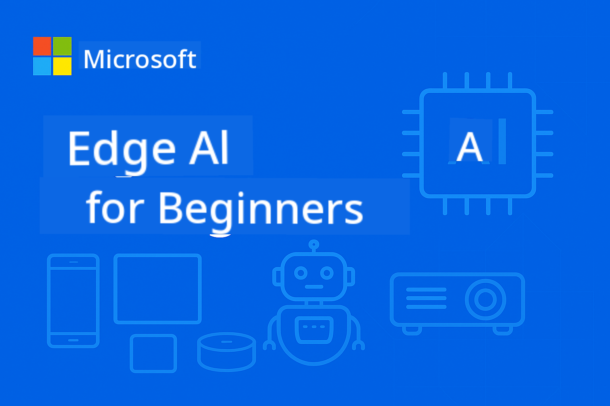

<!--
CO_OP_TRANSLATOR_METADATA:
{
  "original_hash": "22c6dae04591abc5f0d80f944ed663d5",
  "translation_date": "2025-09-26T10:33:03+00:00",
  "source_file": "introduction.md",
  "language_code": "tr"
}
-->
# Edge AI'ye Giriş: Yeni Başlayanlar İçin



**Edge Yapay Zeka** dünyasına hoş geldiniz – verilerin oluşturulduğu ve kararların alınması gerektiği yere yapay zekanın gücünü getiren devrim niteliğinde bir yaklaşım. Bu giriş bölümü, Edge AI'nin neden akıllı bilişimin geleceğini temsil ettiğini ve nasıl uygulanacağını öğrenebileceğinizi anlamanız için temel oluşturacak.

## Edge AI Nedir?

Edge AI, geleneksel bulut tabanlı yapay zeka işleminden **yerel, cihaz üzerinde zeka** anlayışına temel bir geçişi temsil eder. Verileri uzak sunuculara göndermek yerine, Edge AI bilgiyi doğrudan uç cihazlarda işler – akıllı telefonlar, IoT sensörleri, endüstriyel ekipmanlar, otonom araçlar ve gömülü sistemler.

### Edge AI Paradigması

```
Traditional AI:     Device → Cloud → Processing → Response → Device
Edge AI:           Device → Local Processing → Immediate Response
```

Bu paradigma değişimi, buluta yapılan gidiş-dönüşü ortadan kaldırarak şu avantajları sağlar:
- **Anında yanıtlar** (milisaniye altı gecikme)
- **Gelişmiş gizlilik** (veriler cihazdan ayrılmaz)
- **Güvenilir çalışma** (internet bağlantısı olmadan çalışır)
- **Düşük maliyetler** (minimum bant genişliği ve bulut işlem kullanımı)

## Edge AI Neden Şimdi Önemli?

### İnovasyonun Mükemmel Fırtınası

Üç teknolojik trend, Edge AI'yi sadece mümkün değil, aynı zamanda gerekli hale getirdi:

1. **Donanım Devrimi**: Modern çipsetler (Apple Silicon, Qualcomm Snapdragon, NVIDIA Jetson) artık kompakt, enerji verimli paketlerde yapay zeka hızlandırma sunuyor.
2. **Model Optimizasyonu**: Phi-4, Gemma ve Mistral gibi Küçük Dil Modelleri (SLM'ler), büyük modellerin performansının %80-90'ını %10-20 boyutunda sunuyor.
3. **Gerçek Dünya Talebi**: Endüstriler, bulut çözümlerinin sağlayamayacağı anlık, özel ve güvenilir yapay zekaya ihtiyaç duyuyor.

### Kritik İş Etkenleri

**Gizlilik ve Uyumluluk**
- Sağlık: Hasta verileri yerel kalmalı (HIPAA uyumluluğu)
- Finans: İşlem işleme veri egemenliği gerektirir
- Üretim: Özel süreçlerin ifşa edilmeden korunması gerekir

**Performans Gereksinimleri**
- Otonom araçlar: Milisaniyeler içinde hayati kararlar
- Endüstriyel otomasyon: Gerçek zamanlı kalite kontrol ve güvenlik izleme
- Oyun & AR/VR: Sıfır algılanabilir gecikme gerektiren sürükleyici deneyimler

**Ekonomik Verimlilik**
- Telekomünikasyon: Milyonlarca IoT sensör okumasını yerel olarak işleme
- Perakende: Büyük bant genişliği maliyetleri olmadan mağaza içi analiz
- Akıllı şehirler: Binlerce cihazda dağıtılmış zeka

## Edge AI ile Dönüşen Endüstriler

### 🏭 **Üretim & Endüstri 4.0**
- **Tahmine Dayalı Bakım**: Endüstriyel ekipmanlarda yapay zeka modelleri, arızaları oluşmadan önce tahmin eder.
- **Kalite Kontrol**: Üretim hatlarında gerçek zamanlı kusur tespiti.
- **Güvenlik İzleme**: Anında tehlike tespiti ve müdahale.
- **Tedarik Zinciri**: Her düğümde akıllı envanter yönetimi.

**Gerçek Dünya Etkisi**: Siemens, tahmine dayalı bakım için Edge AI kullanarak arıza sürelerini %30-50 ve bakım maliyetlerini %25 oranında azaltıyor.

### 🏥 **Sağlık & Medikal Cihazlar**
- **Tanısal Görüntüleme**: Nokta bakımda yapay zeka destekli X-ray ve MRI analizi.
- **Hasta İzleme**: Giyilebilir cihazlarla sürekli sağlık değerlendirmesi.
- **Cerrahi Yardım**: Prosedürler sırasında gerçek zamanlı rehberlik.
- **İlaç Keşfi**: Moleküler simülasyonların yerel işlenmesi.

**Gerçek Dünya Etkisi**: Philips'in Edge AI çözümleri, radyologların koşulları %40 daha hızlı teşhis etmesini sağlarken %99 doğruluk oranını koruyor.

### 🚗 **Otonom Sistemler & Ulaşım**
- **Otonom Araçlar**: Navigasyon ve güvenlik için anlık karar verme.
- **Trafik Yönetimi**: Akıllı kavşak kontrolü ve akış optimizasyonu.
- **Filo Operasyonları**: Gerçek zamanlı rota optimizasyonu ve araç sağlığı izleme.
- **Lojistik**: Otonom depo robotları ve teslimat sistemleri.

**Gerçek Dünya Etkisi**: Tesla'nın Tam Otonom Sürüş sistemi, sensör verilerini yerel olarak işleyerek güvenli otonom navigasyon için saniyede 40+ karar alıyor.

### 🏙️ **Akıllı Şehirler & Altyapı**
- **Kamu Güvenliği**: Gerçek zamanlı tehdit tespiti ve acil durum müdahalesi.
- **Enerji Yönetimi**: Akıllı şebeke optimizasyonu ve yenilenebilir enerji entegrasyonu.
- **Çevresel İzleme**: Hava kalitesi, gürültü kirliliği ve iklim takibi.
- **Kentsel Planlama**: Trafik akışı analizi ve altyapı optimizasyonu.

**Gerçek Dünya Etkisi**: Singapur'un akıllı şehir girişimi, trafik yönetimi için 100.000+ Edge AI sensörü kullanarak yolculuk sürelerini %25 oranında azaltıyor.

### 📱 **Tüketici Teknolojisi & Mobil**
- **Akıllı Telefon AI**: Gelişmiş fotoğrafçılık, sesli asistanlar ve kişiselleştirme.
- **Akıllı Evler**: Akıllı otomasyon ve güvenlik sistemleri.
- **Giyilebilir Cihazlar**: Sağlık izleme ve fitness optimizasyonu.
- **Oyun**: Gerçek zamanlı grafik iyileştirme ve oyun optimizasyonu.

**Gerçek Dünya Etkisi**: Apple'ın Neural Engine'i, yerel olarak saniyede 15.8 trilyon işlem gerçekleştirerek gerçek zamanlı dil çevirisi ve hesaplamalı fotoğrafçılık gibi özellikleri mümkün kılıyor.

## Küçük Dil Modelleri: Edge AI'nin Motoru

### Küçük Dil Modelleri (SLM'ler) Nedir?

SLM'ler, büyük dil modellerinin **sıkıştırılmış, optimize edilmiş versiyonlarıdır** ve özellikle uç cihazlarda kullanım için tasarlanmıştır:

- **Phi-4**: 14B parametre, akıl yürütme ve kod üretimi için optimize edilmiş.
- **Gemma 2B/7B**: Google'ın çeşitli NLP görevleri için verimli modelleri.
- **Mistral-7B**: Ticari dostu lisanslama ile yüksek performanslı model.
- **Qwen Serisi**: Alibaba'nın mobil dağıtım için optimize edilmiş çok dilli modelleri.

### SLM Avantajı

| Özellik | Büyük Dil Modelleri | Küçük Dil Modelleri |
|---------|---------------------|---------------------|
| **Boyut** | 70B-405B parametre | 1B-14B parametre |
| **Bellek** | 40-200GB RAM | 2-16GB RAM |
| **Çıkarım Hızı** | 2-10 saniye | 50-500ms |
| **Dağıtım** | Yüksek performanslı sunucular | Akıllı telefonlar, gömülü cihazlar |
| **Maliyet** | Aylık $1000'lar | Tek seferlik donanım maliyeti |
| **Gizlilik** | Veri buluta gönderilir | İşleme yerel kalır |

### Performans Gerçekliği

Modern SLM'ler olağanüstü yeteneklere ulaşır:
- **GPT-3.5 performansının %90'ı** birçok görevde
- **Gerçek zamanlı konuşma** yetenekleri
- **Kod üretimi ve hata ayıklama**
- **Çok dilli çeviri**
- **Belge analizi ve özetleme**

## Öğrenme Hedefleri

Bu EdgeAI için Yeni Başlayanlar kursunu tamamlayarak şunları öğreneceksiniz:

### 🎯 **Temel Bilgi**
- Edge AI benimsenmesinin teknik ve iş etkenlerini anlayın.
- Edge ve bulut AI mimarilerini karşılaştırın ve uygun kullanım alanlarını belirleyin.
- Farklı SLM ailelerinin özelliklerini ve yeteneklerini tanıyın.
- Edge AI dağıtımı için donanım gereksinimlerini analiz edin.

### 🛠️ **Teknik Beceriler**
- SLM'leri çeşitli platformlarda (Windows, mobil, gömülü, bulut-uç hibrit) dağıtın.
- Modelleri kuantizasyon, budama ve sıkıştırma kullanarak uç kısıtlamalar için optimize edin.
- İzleme ve ölçeklendirme ile üretime hazır Edge AI uygulamaları uygulayın.
- Karmaşık iş akışları için çoklu ajan sistemleri ve işlev çağırma çerçeveleri oluşturun.

### 🏗️ **Pratik Uygulama**
- Yerel model geçişi ve konuşma yönetimi ile sohbet uygulamaları oluşturun.
- Yerel belge işleme ile RAG (Retrieval-Augmented Generation) sistemleri geliştirin.
- Uzmanlaşmış yapay zeka modelleri arasında akıllıca seçim yapan model yönlendiriciler oluşturun.
- Akış, sağlık izleme ve hata işleme ile API çerçeveleri tasarlayın.

### 🚀 **Üretim Dağıtımı**
- Model sürümleme, test ve dağıtım için SLMOps boru hatları oluşturun.
- Edge AI uygulamaları için güvenlik en iyi uygulamalarını uygulayın.
- Edge ve bulut işlemeyi dengeleyen ölçeklenebilir mimariler tasarlayın.
- Üretim Edge AI sistemleri için izleme ve bakım stratejileri oluşturun.

## Öğrenme Çıktıları

Kursu tamamladığınızda şunları yapabilecek donanıma sahip olacaksınız:

### **Teknik Uzmanlık**
✅ **Üretime hazır Edge AI çözümleri** Windows, mobil ve gömülü platformlarda dağıtın  
✅ **Edge kısıtlamaları için yapay zeka modellerini optimize edin** %75 boyut azaltımı ve %85 performans koruma sağlayın  
✅ **Akıllı ajan sistemleri oluşturun** işlev çağırma ve çoklu model orkestrasyonu ile  
✅ **Kurumsal uygulamalar için ölçeklenebilir uç-bulut hibrit mimariler tasarlayın**

### **Endüstri Uygulamaları**
✅ **Tahmine dayalı bakım ve kalite kontrol için üretim çözümleri tasarlayın**  
✅ **Hasta verilerini gizlilik uyumlu şekilde işleyen sağlık uygulamaları geliştirin**  
✅ **Gerçek zamanlı karar verme ve güvenlik için otomotiv sistemleri oluşturun**  
✅ **Trafik, güvenlik ve çevresel izleme için akıllı şehir altyapısı oluşturun**

### **Kariyer İlerlemesi**
✅ **EdgeAI Çözümleri Mimarı**: Kapsamlı Edge AI stratejileri tasarlayın  
✅ **ML Mühendisi (Edge Uzmanlığı)**: Modelleri uç ortamlar için optimize edin ve dağıtın  
✅ **IoT AI Geliştiricisi**: Yerel işlemle akıllı IoT sistemleri oluşturun  
✅ **Mobil AI Geliştiricisi**: Yerel çıkarımla AI destekli mobil uygulamalar geliştirin

## Kurs Mimarisi

Bu kurs **ilerlemeli ustalık yaklaşımını** takip eder:

### **Faz 1: Temel** (Modüller 01-02)
Kavramsal anlayış oluşturun ve model ailelerini keşfedin.

### **Faz 2: Uygulama** (Modüller 03-04) 
Dağıtım ve optimizasyon tekniklerinde ustalaşın.

### **Faz 3: Üretim** (Modüller 05-06)
SLMOps ve gelişmiş ajan çerçevelerini öğrenin.

### **Faz 4: Uzmanlık** (Modüller 07-08)
Platforma özel uygulama ve kapsamlı örnekler.

## Başarı Ölçütleri

İlerlemenizi şu somut çıktılarla takip edin:

- **Portföy Projeleri**: Birden fazla endüstriyi kapsayan 10+ üretime hazır uygulama.
- **Performans Kriterleri**: Edge cihazlarda <500ms çıkarım süresiyle çalışan modeller.
- **Dağıtım Hedefleri**: Windows, mobil ve gömülü platformlarda çalışan uygulamalar.
- **Kurumsal Hazırlık**: İzleme, ölçeklendirme ve güvenlik çerçeveleriyle çözümler.

## Başlarken

AI dağıtım anlayışınızı dönüştürmeye hazır mısınız? Yolculuğunuz **[Modül 01: EdgeAI Temelleri](./Module01/README.md)** ile başlıyor. Burada Edge AI'yi mümkün kılan teknik temelleri keşfedecek ve sektör liderlerinden gerçek dünya vaka çalışmalarını inceleyeceksiniz.

**Sonraki Adım**: [📚 Modül 01 - EdgeAI Temelleri →](./Module01/README.md)

---

**Yapay zekanın geleceği yerel, anlık ve özel. Edge AI'yi öğrenerek bir sonraki nesil akıllı uygulamaları oluşturun.**

---

