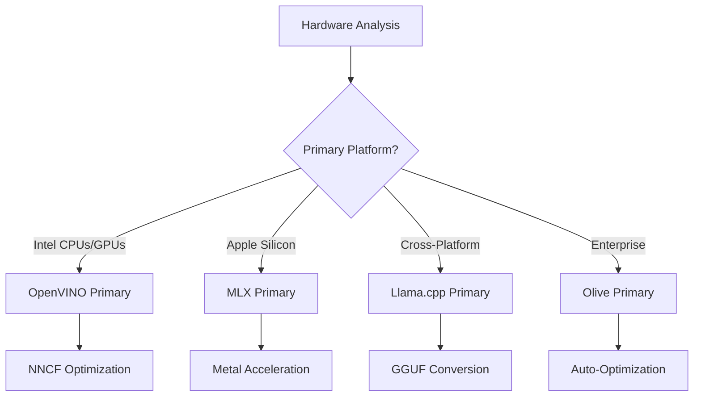
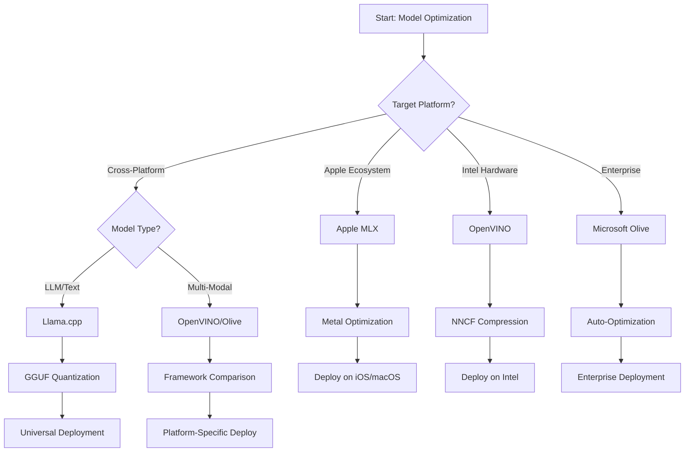
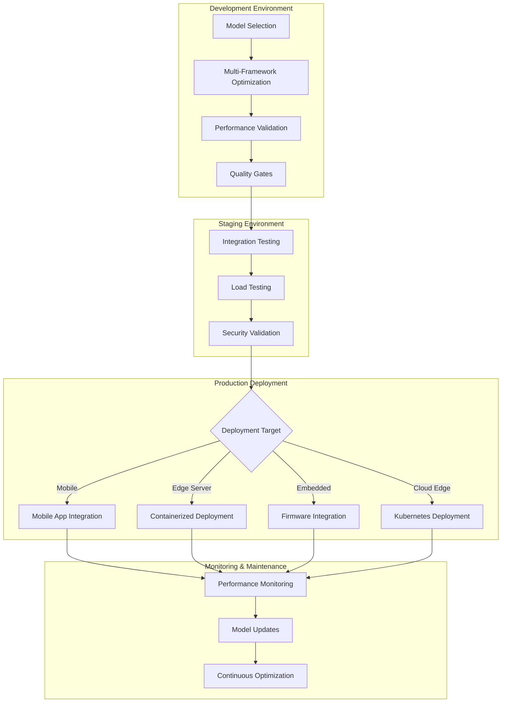

<!--
CO_OP_TRANSLATOR_METADATA:
{
  "original_hash": "6719c4a7e44b948230ac5f5cab3699bd",
  "translation_date": "2025-09-19T00:38:34+00:00",
  "source_file": "Module04/06.workflow-synthesis.md",
  "language_code": "uk"
}
-->
# Розділ 6: Синтез робочого процесу розробки Edge AI

## Зміст
1. [Вступ](../../../Module04)
2. [Цілі навчання](../../../Module04)
3. [Огляд уніфікованого робочого процесу](../../../Module04)
4. [Матриця вибору фреймворків](../../../Module04)
5. [Синтез найкращих практик](../../../Module04)
6. [Посібник зі стратегії розгортання](../../../Module04)
7. [Робочий процес оптимізації продуктивності](../../../Module04)
8. [Контрольний список готовності до виробництва](../../../Module04)
9. [Вирішення проблем і моніторинг](../../../Module04)
10. [Забезпечення майбутньої готовності вашого Edge AI конвеєра](../../../Module04)

## Вступ

Розробка Edge AI вимагає глибокого розуміння численних фреймворків оптимізації, стратегій розгортання та апаратних особливостей. Цей комплексний синтез об'єднує знання з Llama.cpp, Microsoft Olive, OpenVINO та Apple MLX, створюючи уніфікований робочий процес, який максимізує ефективність, підтримує якість і забезпечує успішне розгортання у виробництві.

Протягом цього курсу ми досліджували окремі фреймворки оптимізації, кожен із яких має свої сильні сторони та спеціалізовані випадки використання. Однак реальні проєкти Edge AI часто вимагають комбінування технік із кількох фреймворків або прийняття стратегічних рішень щодо того, який підхід забезпечить найкращі результати для конкретних обмежень і вимог.

Цей розділ синтезує колективну мудрість усіх фреймворків у практичні робочі процеси, дерева рішень і найкращі практики, які дозволяють ефективно та результативно створювати готові до виробництва рішення Edge AI. Незалежно від того, чи ви оптимізуєте для мобільних пристроїв, вбудованих систем або серверів на периферії, цей посібник надає стратегічну основу для прийняття обґрунтованих рішень протягом усього циклу розробки.

## Цілі навчання

До кінця цього розділу ви зможете:

### Стратегічне прийняття рішень
- **Оцінювати та вибирати** оптимальний фреймворк оптимізації на основі вимог проєкту, апаратних обмежень і сценаріїв розгортання
- **Проєктувати комплексні робочі процеси**, які інтегрують кілька технік оптимізації для максимальної ефективності
- **Оцінювати компроміси** між точністю моделі, швидкістю інференсу, використанням пам'яті та складністю розгортання в різних фреймворках

### Інтеграція робочих процесів
- **Реалізовувати уніфіковані конвеєри розробки**, які використовують сильні сторони кількох фреймворків оптимізації
- **Створювати відтворювані робочі процеси** для послідовної оптимізації моделей і розгортання в різних середовищах
- **Встановлювати контрольні точки якості** та процеси валідації, щоб переконатися, що оптимізовані моделі відповідають вимогам виробництва

### Оптимізація продуктивності
- **Застосовувати систематичні стратегії оптимізації** за допомогою квантування, обрізання та апаратно-специфічних технік прискорення
- **Моніторити та проводити бенчмаркінг** продуктивності моделі на різних рівнях оптимізації та цільових платформах
- **Оптимізувати для конкретних апаратних платформ**, включаючи CPU, GPU, NPU та спеціалізовані акселератори на периферії

### Розгортання у виробництві
- **Проєктувати масштабовані архітектури розгортання**, які підтримують кілька форматів моделей і рушіїв інференсу
- **Реалізовувати моніторинг і спостереження** для застосунків Edge AI у виробничих середовищах
- **Встановлювати робочі процеси обслуговування** для оновлення моделей, моніторингу продуктивності та оптимізації системи

### Відмінність на різних платформах
- **Розгортати оптимізовані моделі** на різних апаратних платформах, зберігаючи стабільну продуктивність
- **Вирішувати специфічні для платформи оптимізації** для Windows, macOS, Linux, мобільних і вбудованих систем
- **Створювати шари абстракції**, які забезпечують безперешкодне розгортання в різних середовищах на периферії

## Огляд уніфікованого робочого процесу

### Фаза 1: Аналіз вимог і вибір фреймворку

Успішне розгортання Edge AI починається з ретельного аналізу вимог, який визначає вибір фреймворку та стратегію оптимізації.

#### 1.1 Оцінка апаратного забезпечення


**Основні аспекти:**
- **Архітектура CPU**: можливості x86, ARM, Apple Silicon
- **Наявність акселераторів**: GPU, NPU, VPU, спеціалізовані AI-чіпи
- **Обмеження пам'яті**: обсяг RAM, ємність сховища
- **Енергетичний бюджет**: тривалість роботи батареї, теплові обмеження
- **Підключення**: вимоги до роботи офлайн, обмеження пропускної здатності

#### 1.2 Матриця вимог до застосунків

| Вимога | Llama.cpp | Microsoft Olive | OpenVINO | Apple MLX |
|--------|-----------|-----------------|----------|-----------|
| Кросплатформеність | ✅ Відмінно | ⚡ Добре | ⚡ Добре | ❌ Тільки Apple |
| Інтеграція в підприємства | ⚡ Базова | ✅ Відмінно | ✅ Відмінно | ⚡ Обмежена |
| Розгортання на мобільних | ✅ Відмінно | ⚡ Добре | ⚡ Добре | ✅ iOS Відмінно |
| Інференс у реальному часі | ✅ Відмінно | ✅ Відмінно | ✅ Відмінно | ✅ Відмінно |
| Різноманітність моделей | ✅ Фокус на LLM | ✅ Усі моделі | ✅ Усі моделі | ✅ Фокус на LLM |
| Простота використання | ✅ Проста | ✅ Автоматизована | ⚡ Помірна | ✅ Проста |

### Фаза 2: Підготовка та оптимізація моделі

#### 2.1 Універсальний конвеєр оцінки моделі

```python
# Universal Model Assessment Framework
class EdgeAIModelAssessment:
    def __init__(self, model_path, target_hardware):
        self.model_path = model_path
        self.target_hardware = target_hardware
        self.optimization_frameworks = []
        
    def assess_model_characteristics(self):
        """Analyze model size, architecture, and complexity"""
        return {
            'model_size': self.get_model_size(),
            'parameter_count': self.get_parameter_count(),
            'architecture_type': self.detect_architecture(),
            'quantization_compatibility': self.check_quantization_support()
        }
    
    def recommend_optimization_strategy(self):
        """Recommend optimal frameworks and techniques"""
        characteristics = self.assess_model_characteristics()
        
        if self.target_hardware.startswith('apple'):
            return self.mlx_optimization_strategy(characteristics)
        elif self.target_hardware.startswith('intel'):
            return self.openvino_optimization_strategy(characteristics)
        elif characteristics['model_size'] > 7_000_000_000:  # 7B+ parameters
            return self.enterprise_optimization_strategy(characteristics)
        else:
            return self.lightweight_optimization_strategy(characteristics)
```

#### 2.2 Багатофреймворковий конвеєр оптимізації

**Послідовний підхід до оптимізації:**
1. **Початкове перетворення**: Перетворення в проміжний формат (ONNX, якщо можливо)
2. **Оптимізація для конкретного фреймворку**: Застосування спеціалізованих технік
3. **Кросплатформена валідація**: Перевірка продуктивності на цільових платформах
4. **Фінальне пакування**: Підготовка до розгортання

```bash
# Multi-Framework Optimization Script
#!/bin/bash

MODEL_NAME="phi-3-mini"
BASE_MODEL="microsoft/Phi-3-mini-4k-instruct"

# Phase 1: ONNX Conversion (Universal)
python convert_to_onnx.py --model $BASE_MODEL --output models/onnx/

# Phase 2: Platform-Specific Optimization
if [[ "$TARGET_PLATFORM" == "intel" ]]; then
    # OpenVINO Optimization
    python optimize_openvino.py --input models/onnx/ --output models/openvino/
elif [[ "$TARGET_PLATFORM" == "apple" ]]; then
    # MLX Optimization
    python optimize_mlx.py --input $BASE_MODEL --output models/mlx/
elif [[ "$TARGET_PLATFORM" == "cross" ]]; then
    # Llama.cpp Optimization
    python convert_to_gguf.py --input models/onnx/ --output models/gguf/
fi

# Phase 3: Validation
python validate_optimization.py --original $BASE_MODEL --optimized models/$TARGET_PLATFORM/
```

### Фаза 3: Валідація продуктивності та бенчмаркінг

#### 3.1 Комплексний фреймворк бенчмаркінгу

```python
class EdgeAIBenchmark:
    def __init__(self, optimized_models):
        self.models = optimized_models
        self.metrics = {
            'inference_time': [],
            'memory_usage': [],
            'accuracy_score': [],
            'throughput': [],
            'energy_consumption': []
        }
    
    def run_comprehensive_benchmark(self):
        """Execute standardized benchmarks across all optimized models"""
        test_inputs = self.generate_test_inputs()
        
        for model_framework, model_path in self.models.items():
            print(f"Benchmarking {model_framework}...")
            
            # Latency Testing
            latency = self.measure_inference_latency(model_path, test_inputs)
            
            # Memory Profiling
            memory = self.profile_memory_usage(model_path)
            
            # Accuracy Validation
            accuracy = self.validate_model_accuracy(model_path, test_inputs)
            
            # Throughput Analysis
            throughput = self.measure_throughput(model_path)
            
            self.record_metrics(model_framework, latency, memory, accuracy, throughput)
    
    def generate_optimization_report(self):
        """Create comprehensive comparison report"""
        report = {
            'recommendations': self.analyze_performance_trade_offs(),
            'deployment_guidance': self.generate_deployment_recommendations(),
            'monitoring_requirements': self.define_monitoring_metrics()
        }
        return report
```

## Матриця вибору фреймворків

### Дерево рішень для вибору фреймворку



### Комплексні критерії вибору

#### 1. Відповідність основному випадку використання

**Великі мовні моделі (LLM):**
- **Llama.cpp**: Найкраще для CPU-орієнтованого, кросплатформеного розгортання
- **Apple MLX**: Оптимально для Apple Silicon із уніфікованою пам'яттю
- **OpenVINO**: Відмінно для апаратного забезпечення Intel із оптимізацією NNCF
- **Microsoft Olive**: Ідеально для підприємств із автоматизацією робочих процесів

**Мультимодальні моделі:**
- **OpenVINO**: Комплексна підтримка зору, аудіо та тексту
- **Microsoft Olive**: Оптимізація корпоративного рівня для складних конвеєрів
- **Llama.cpp**: Обмежено текстовими моделями
- **Apple MLX**: Зростаюча підтримка мультимодальних застосунків

#### 2. Матриця апаратних платформ

| Платформа | Основний фреймворк | Додатковий варіант | Спеціалізовані функції |
|-----------|--------------------|--------------------|-----------------------|
| Intel CPU/GPU | OpenVINO | Microsoft Olive | Стиснення NNCF, оптимізація Intel |
| NVIDIA GPU | Microsoft Olive | OpenVINO | Прискорення CUDA, функції для підприємств |
| Apple Silicon | Apple MLX | Llama.cpp | Шейдери Metal, уніфікована пам'ять |
| ARM Mobile | Llama.cpp | OpenVINO | Кросплатформеність, мінімальні залежності |
| Edge TPU | OpenVINO | Microsoft Olive | Підтримка спеціалізованих акселераторів |
| Вбудований ARM | Llama.cpp | OpenVINO | Мінімальний розмір, ефективний інференс |

#### 3. Переваги робочого процесу розробки

**Швидке прототипування:**
1. **Llama.cpp**: Найшвидше налаштування, миттєві результати
2. **Apple MLX**: Простий Python API, швидка ітерація
3. **Microsoft Olive**: Автоматизована оптимізація, мінімальна конфігурація
4. **OpenVINO**: Більш складне налаштування, комплексні функції

**Виробниче використання в підприємствах:**
1. **Microsoft Olive**: Функції для підприємств, інтеграція з Azure
2. **OpenVINO**: Екосистема Intel, комплексні інструменти
3. **Apple MLX**: Застосунки для підприємств, специфічні для Apple
4. **Llama.cpp**: Просте розгортання, обмежені функції для підприємств

## Синтез найкращих практик

### Універсальні принципи оптимізації

#### 1. Стратегія прогресивної оптимізації

```python
class ProgressiveOptimization:
    def __init__(self, base_model):
        self.base_model = base_model
        self.optimization_stages = [
            'baseline_measurement',
            'format_conversion',
            'quantization_optimization',
            'hardware_acceleration',
            'production_validation'
        ]
    
    def execute_progressive_optimization(self):
        """Apply optimization techniques incrementally"""
        
        # Stage 1: Baseline Measurement
        baseline_metrics = self.measure_baseline_performance()
        
        # Stage 2: Format Conversion
        converted_model = self.convert_to_optimal_format()
        conversion_metrics = self.measure_performance(converted_model)
        
        # Stage 3: Quantization
        quantized_model = self.apply_quantization(converted_model)
        quantization_metrics = self.measure_performance(quantized_model)
        
        # Stage 4: Hardware Acceleration
        accelerated_model = self.enable_hardware_acceleration(quantized_model)
        acceleration_metrics = self.measure_performance(accelerated_model)
        
        # Stage 5: Validation
        production_ready = self.validate_for_production(accelerated_model)
        
        return self.compile_optimization_report(
            baseline_metrics, conversion_metrics, 
            quantization_metrics, acceleration_metrics
        )
```

#### 2. Впровадження контрольних точок якості

**Контрольні точки збереження точності:**
- Зберігати >95% початкової точності моделі
- Перевіряти на репрезентативних тестових наборах даних
- Реалізовувати A/B тестування для валідації у виробництві

**Контрольні точки покращення продуктивності:**
- Досягати мінімум 2x покращення швидкості
- Зменшувати обсяг пам'яті щонайменше на 50%
- Перевіряти стабільність часу інференсу

**Контрольні точки готовності до виробництва:**
- Проходити стрес-тестування під навантаженням
- Демонструвати стабільну продуктивність з часом
- Перевіряти вимоги до безпеки та конфіденційності

### Інтеграція найкращих практик для конкретних фреймворків

#### 1. Синтез стратегії квантування

```python
# Unified Quantization Approach
class UnifiedQuantizationStrategy:
    def __init__(self, model, target_platform):
        self.model = model
        self.platform = target_platform
        
    def select_optimal_quantization(self):
        """Choose best quantization based on platform and requirements"""
        
        if self.platform == 'apple_silicon':
            return self.mlx_quantization_strategy()
        elif self.platform == 'intel_hardware':
            return self.openvino_quantization_strategy()
        elif self.platform == 'cross_platform':
            return self.llamacpp_quantization_strategy()
        else:
            return self.olive_quantization_strategy()
    
    def mlx_quantization_strategy(self):
        """Apple MLX-specific quantization"""
        return {
            'method': 'mlx_quantize',
            'precision': 'int4',
            'group_size': 64,
            'optimization_target': 'unified_memory'
        }
    
    def openvino_quantization_strategy(self):
        """OpenVINO NNCF quantization"""
        return {
            'method': 'nncf_quantize',
            'precision': 'int8',
            'calibration_method': 'post_training',
            'optimization_target': 'intel_hardware'
        }
```

#### 2. Оптимізація апаратного прискорення

**Синтез оптимізації для CPU:**
- **SIMD інструкції**: Використовувати оптимізовані ядра в різних фреймворках
- **Пропускна здатність пам'яті**: Оптимізувати макети даних для ефективності кешу
- **Потоки**: Балансувати паралелізм із обмеженнями ресурсів

**Найкращі практики прискорення GPU:**
- **Пакетна обробка**: Максимізувати пропускну здатність за допомогою відповідних розмірів пакетів
- **Управління пам'яттю**: Оптимізувати розподіл і передачу пам'яті GPU
- **Точність**: Використовувати FP16, якщо підтримується, для кращої продуктивності

**Оптимізація для NPU/спеціалізованих акселераторів:**
- **Архітектура моделі**: Забезпечувати сумісність із можливостями акселератора
- **Потік даних**: Оптимізувати конвеєри вводу/виводу для ефективності акселератора
- **Стратегії резервування**: Реалізовувати резервування на CPU для непідтримуваних операцій

## Посібник зі стратегії розгортання

### Універсальна архітектура розгортання



### Шаблони розгортання для конкретних платформ

#### 1. Стратегія розгортання на мобільних пристроях

```yaml
# Mobile Deployment Configuration
mobile_deployment:
  ios:
    framework: apple_mlx
    optimization:
      quantization: int4
      memory_mapping: true
      background_execution: limited
    packaging:
      format: mlx
      bundle_size: <50MB
      
  android:
    framework: llama_cpp
    optimization:
      quantization: q4_k_m
      threading: android_optimized
      memory_management: conservative
    packaging:
      format: gguf
      apk_size: <100MB
      
  cross_platform:
    framework: onnx_runtime
    optimization:
      quantization: int8
      execution_provider: cpu
    packaging:
      format: onnx
      shared_libraries: minimal
```

#### 2. Розгортання на сервері периферії

```yaml
# Edge Server Deployment Configuration
edge_server:
  intel_based:
    framework: openvino
    optimization:
      quantization: int8
      acceleration: cpu_gpu_auto
      batch_processing: dynamic
    deployment:
      container: openvino_runtime
      orchestration: kubernetes
      scaling: horizontal
      
  nvidia_based:
    framework: microsoft_olive
    optimization:
      quantization: int4
      acceleration: cuda
      tensor_parallelism: true
    deployment:
      container: nvidia_triton
      orchestration: kubernetes
      scaling: gpu_aware
```

### Найкращі практики контейнеризації

```dockerfile
# Multi-Framework Edge AI Container
FROM ubuntu:22.04 as base

# Install common dependencies
RUN apt-get update && apt-get install -y \
    python3 \
    python3-pip \
    build-essential \
    cmake \
    && rm -rf /var/lib/apt/lists/*

# Framework-specific stages
FROM base as openvino
RUN pip install openvino nncf optimum[intel]

FROM base as llamacpp
RUN git clone https://github.com/ggerganov/llama.cpp.git \
    && cd llama.cpp && make LLAMA_OPENBLAS=1

FROM base as olive
RUN pip install olive-ai[auto-opt] onnxruntime-genai

# Production stage with selected framework
FROM openvino as production
COPY models/ /app/models/
COPY src/ /app/src/
WORKDIR /app

EXPOSE 8080
CMD ["python3", "src/inference_server.py"]
```

## Робочий процес оптимізації продуктивності

### Систематичне налаштування продуктивності

#### 1. Конвеєр профілювання продуктивності

```python
class EdgeAIPerformanceProfiler:
    def __init__(self, model_path, framework):
        self.model_path = model_path
        self.framework = framework
        self.profiling_results = {}
    
    def comprehensive_profiling(self):
        """Execute comprehensive performance analysis"""
        
        # CPU Profiling
        cpu_profile = self.profile_cpu_usage()
        
        # Memory Profiling
        memory_profile = self.profile_memory_usage()
        
        # Inference Latency
        latency_profile = self.profile_inference_latency()
        
        # Throughput Analysis
        throughput_profile = self.profile_throughput()
        
        # Energy Consumption (where available)
        energy_profile = self.profile_energy_consumption()
        
        return self.compile_performance_report(
            cpu_profile, memory_profile, latency_profile,
            throughput_profile, energy_profile
        )
    
    def identify_bottlenecks(self):
        """Automatically identify performance bottlenecks"""
        bottlenecks = []
        
        if self.profiling_results['cpu_utilization'] > 80:
            bottlenecks.append('cpu_bound')
        
        if self.profiling_results['memory_usage'] > 90:
            bottlenecks.append('memory_bound')
        
        if self.profiling_results['inference_variance'] > 20:
            bottlenecks.append('inconsistent_performance')
        
        return self.generate_optimization_recommendations(bottlenecks)
```

#### 2. Автоматизований конвеєр оптимізації

```python
class AutomatedOptimizationPipeline:
    def __init__(self, base_model, target_constraints):
        self.base_model = base_model
        self.constraints = target_constraints
        self.optimization_history = []
    
    def execute_optimization_search(self):
        """Systematically search optimization space"""
        
        optimization_candidates = [
            {'quantization': 'int8', 'pruning': 0.1},
            {'quantization': 'int4', 'pruning': 0.2},
            {'quantization': 'int8', 'acceleration': 'gpu'},
            {'quantization': 'int4', 'acceleration': 'npu'}
        ]
        
        best_configuration = None
        best_score = 0
        
        for config in optimization_candidates:
            optimized_model = self.apply_optimization(config)
            score = self.evaluate_optimization(optimized_model)
            
            if score > best_score and self.meets_constraints(optimized_model):
                best_score = score
                best_configuration = config
            
            self.optimization_history.append({
                'config': config,
                'score': score,
                'model': optimized_model
            })
        
        return best_configuration, self.optimization_history
```

### Багатоцільова оптимізація

#### 1. Оптимізація Парето для Edge AI

```python
class ParetoOptimization:
    def __init__(self, objectives=['speed', 'accuracy', 'memory']):
        self.objectives = objectives
        self.pareto_frontier = []
    
    def find_pareto_optimal_solutions(self, optimization_results):
        """Identify Pareto-optimal configurations"""
        
        for result in optimization_results:
            is_dominated = False
            
            for frontier_point in self.pareto_frontier:
                if self.dominates(frontier_point, result):
                    is_dominated = True
                    break
            
            if not is_dominated:
                # Remove dominated points from frontier
                self.pareto_frontier = [
                    point for point in self.pareto_frontier 
                    if not self.dominates(result, point)
                ]
                
                self.pareto_frontier.append(result)
        
        return self.pareto_frontier
    
    def recommend_configuration(self, user_preferences):
        """Recommend configuration based on user preferences"""
        
        weighted_scores = []
        for config in self.pareto_frontier:
            score = sum(
                user_preferences[obj] * config['metrics'][obj] 
                for obj in self.objectives
            )
            weighted_scores.append((score, config))
        
        return max(weighted_scores, key=lambda x: x[0])[1]
```

## Контрольний список готовності до виробництва

### Комплексна валідація для виробництва

#### 1. Гарантія якості моделі

```python
class ProductionReadinessValidator:
    def __init__(self, optimized_model, production_requirements):
        self.model = optimized_model
        self.requirements = production_requirements
        self.validation_results = {}
    
    def validate_model_quality(self):
        """Comprehensive model quality validation"""
        
        # Accuracy Validation
        accuracy_result = self.validate_accuracy()
        
        # Performance Validation
        performance_result = self.validate_performance()
        
        # Robustness Testing
        robustness_result = self.validate_robustness()
        
        # Security Assessment
        security_result = self.validate_security()
        
        # Compliance Verification
        compliance_result = self.validate_compliance()
        
        return self.compile_validation_report(
            accuracy_result, performance_result, robustness_result,
            security_result, compliance_result
        )
    
    def generate_certification_report(self):
        """Generate production certification report"""
        return {
            'model_signature': self.generate_model_signature(),
            'validation_timestamp': datetime.now(),
            'validation_results': self.validation_results,
            'deployment_approval': self.check_deployment_approval(),
            'monitoring_requirements': self.define_monitoring_requirements()
        }
```

#### 2. Контрольний список розгортання у виробництво

**Валідація перед розгортанням:**
- [ ] Точність моделі відповідає мінімальним вимогам (>95% від базового рівня)
- [ ] Досягнуто цільові показники продуктивності (затримка, пропускна здатність, пам'ять)
- [ ] Оцінено та усунено вразливості безпеки
- [ ] Завершено стрес-тестування під очікуваним навантаженням
- [ ] Перевірено сценарії відмов і процедури відновлення
- [ ] Налаштовано системи моніторингу та сповіщення
- [ ] Перевірено та задокументовано процедури відкату

**Процес розгортання:**
- [ ] Реалізовано стратегію розгортання "синьо-зелений"
- [ ] Налаштовано поступове збільшення трафіку
- [ ] Активовано інформаційні панелі моніторингу в реальному часі
- [ ] Встановлено базові показники продуктивності
- [ ] Визначено порогові значення рівня помилок
- [ ] Налаштовано автоматизовані тригери відкату

**Моніторинг після розгортання:**
- [ ] Активовано виявлення дрейфу моделі
- [ ] Налаштовано сповіщення про деградацію продуктивності
- [ ] Увімкнено моніторинг використання ресурсів
- [ ] Відстежуються метрики користувацького досвіду
- [ ] Підтримується версійність і походження моделі
- [ ] Заплановано регулярні огляди продуктивності моделі

### Безперервна інтеграція/безперервне розгортання (CI/CD)

```yaml
# Edge AI CI/CD Pipeline Configuration
edge_ai_pipeline:
  stages:
    - model_validation
    - optimization
    - testing
    - staging_deployment
    - production_deployment
    - monitoring
  
  model_validation:
    accuracy_threshold: 0.95
    performance_baseline: required
    security_scan: enabled
    
  optimization:
    frameworks:
      - llama_cpp
      - openvino
      - microsoft_olive
    validation:
      cross_validation: enabled
      performance_comparison: required
      
  testing:
    unit_tests: comprehensive
    integration_tests: full_pipeline
    load_tests: production_scale
    security_tests: comprehensive
    
  deployment:
    strategy: blue_green
    traffic_ramping: gradual
    rollback: automatic
    monitoring: real_time
```

## Вирішення проблем і моніторинг

### Універсальний фреймворк вирішення проблем

#### 1. П
Пам’ятайте, що найкраща стратегія оптимізації — це та, яка відповідає вашим конкретним вимогам, зберігаючи при цьому гнучкість для адаптації до змін цих вимог. Використовуйте цей посібник як основу для прийняття обґрунтованих рішень, але завжди перевіряйте свої вибори через емпіричне тестування та досвід реального впровадження.

## ➡️ Що далі

Продовжуйте свою подорож у сфері Edge AI, досліджуючи [Модуль 5: SLMOps та впровадження у виробництво](../Module05/README.md), щоб дізнатися про операційні аспекти управління життєвим циклом малих мовних моделей.

---

**Відмова від відповідальності**:  
Цей документ був перекладений за допомогою сервісу автоматичного перекладу [Co-op Translator](https://github.com/Azure/co-op-translator). Хоча ми прагнемо до точності, будь ласка, майте на увазі, що автоматичні переклади можуть містити помилки або неточності. Оригінальний документ на його рідній мові слід вважати авторитетним джерелом. Для критичної інформації рекомендується професійний людський переклад. Ми не несемо відповідальності за будь-які непорозуміння або неправильні тлумачення, що виникають внаслідок використання цього перекладу.