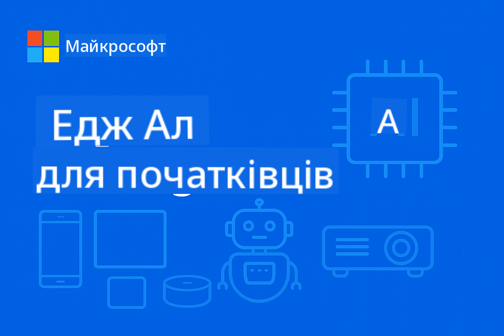

<!--
CO_OP_TRANSLATOR_METADATA:
{
  "original_hash": "dbe223abcd2955df69a08033ff16d389",
  "translation_date": "2025-10-03T08:18:27+00:00",
  "source_file": "README.md",
  "language_code": "uk"
}
-->
# EdgeAI для початківців



[](https://GitHub.com/microsoft/edgeai-for-beginners/graphs/contributors)  
[](https://GitHub.com/microsoft/edgeai-for-beginners/issues)  
[](https://GitHub.com/microsoft/edgeai-for-beginners/pulls)  
[](http://makeapullrequest.com)  

[](https://GitHub.com/microsoft/edgeai-for-beginners/watchers)  
[](https://GitHub.com/microsoft/edgeai-for-beginners/fork)  
[](https://GitHub.com/microsoft/edgeai-for-beginners/stargazers)  

[](https://discord.com/invite/ByRwuEEgH4)

Дотримуйтесь цих кроків, щоб почати використовувати ці ресурси:

1. **Форк репозиторію**: Натисніть [](https://GitHub.com/microsoft/edgeai-for-beginners/fork)  
2. **Клонування репозиторію**: `git clone https://github.com/microsoft/edgeai-for-beginners.git`  
3. [**Приєднайтеся до Azure AI Foundry Discord, щоб зустрітися з експертами та іншими розробниками**](https://discord.com/invite/ByRwuEEgH4)

### 🌐 Підтримка багатомовності

#### Підтримується через GitHub Action (автоматично та завжди актуально)

[Арабська](../ar/README.md) | [Бенгальська](../bn/README.md) | [Болгарська](../bg/README.md) | [Бірманська (М'янма)](../my/README.md) | [Китайська (спрощена)](../zh/README.md) | [Китайська (традиційна, Гонконг)](../hk/README.md) | [Китайська (традиційна, Макао)](../mo/README.md) | [Китайська (традиційна, Тайвань)](../tw/README.md) | [Хорватська](../hr/README.md) | [Чеська](../cs/README.md) | [Данська](../da/README.md) | [Нідерландська](../nl/README.md) | [Фінська](../fi/README.md) | [Французька](../fr/README.md) | [Німецька](../de/README.md) | [Грецька](../el/README.md) | [Іврит](../he/README.md) | [Гінді](../hi/README.md) | [Угорська](../hu/README.md) | [Індонезійська](../id/README.md) | [Італійська](../it/README.md) | [Японська](../ja/README.md) | [Корейська](../ko/README.md) | [Малайська](../ms/README.md) | [Маратхі](../mr/README.md) | [Непальська](../ne/README.md) | [Норвезька](../no/README.md) | [Перська (фарсі)](../fa/README.md) | [Польська](../pl/README.md) | [Португальська (Бразилія)](../br/README.md) | [Португальська (Португалія)](../pt/README.md) | [Панджабі (Гурмухі)](../pa/README.md) | [Румунська](../ro/README.md) | [Російська](../ru/README.md) | [Сербська (кирилиця)](../sr/README.md) | [Словацька](../sk/README.md) | [Словенська](../sl/README.md) | [Іспанська](../es/README.md) | [Суахілі](../sw/README.md) | [Шведська](../sv/README.md) | [Тагальська (Філіппіни)](../tl/README.md) | [Тайська](../th/README.md) | [Турецька](../tr/README.md) | [Українська](./README.md) | [Урду](../ur/README.md) | [В'єтнамська](../vi/README.md)

**Якщо ви хочете додати додаткові мови перекладу, список підтримуваних мов доступний [тут](https://github.com/Azure/co-op-translator/blob/main/getting_started/supported-languages.md)**

## Вступ

Ласкаво просимо до **EdgeAI для початківців** – вашої комплексної подорожі у світ Edge штучного інтелекту. Цей курс об'єднує потужні можливості AI з практичним впровадженням на пристроях, дозволяючи використовувати потенціал AI там, де генерується дані та приймаються рішення.

### Що ви освоїте

Цей курс охоплює все – від основних концепцій до готових до виробництва рішень:
- **Малі мовні моделі (SLM)**, оптимізовані для використання на пристроях
- **Оптимізація з урахуванням апаратного забезпечення** для різних платформ
- **Інференція в реальному часі** з функціями збереження конфіденційності
- **Стратегії впровадження** для корпоративних додатків

### Чому EdgeAI важливий

Edge AI змінює правила гри, вирішуючи сучасні виклики:
- **Конфіденційність і безпека**: Обробка чутливих даних локально без передачі в хмару
- **Продуктивність у реальному часі**: Усунення затримок мережі для критичних додатків
- **Економічна ефективність**: Зниження витрат на пропускну здатність і хмарні обчислення
- **Стійкість роботи**: Збереження функціональності під час перебоїв у мережі
- **Відповідність регуляторним вимогам**: Дотримання вимог щодо суверенітету даних

### Edge AI

Edge AI означає виконання алгоритмів AI і мовних моделей локально на апаратному забезпеченні, близько до місця генерації даних, без залежності від хмарних ресурсів для інференції. Це знижує затримку, покращує конфіденційність і дозволяє приймати рішення в реальному часі.

### Основні принципи:
- **Інференція на пристрої**: Моделі AI працюють на пристроях (телефонах, маршрутизаторах, мікроконтролерах, промислових ПК)
- **Офлайн-можливості**: Функціонування без постійного підключення до інтернету
- **Низька затримка**: Миттєві відповіді, які підходять для систем реального часу
- **Суверенітет даних**: Збереження чутливих даних локально, покращення безпеки та відповідності

### Малі мовні моделі (SLM)

SLM, такі як Phi-4, Mistral-7B і Gemma, є оптимізованими версіями великих мовних моделей (LLM), які були навчені або дистильовані для:
- **Зменшення обсягу пам'яті**: Ефективне використання обмеженої пам'яті пристроїв
- **Зниження вимог до обчислень**: Оптимізація для продуктивності CPU і GPU на пристроях
- **Швидший запуск**: Швидка ініціалізація для чутливих додатків

Вони забезпечують потужні можливості NLP, відповідаючи обмеженням:
- **Вбудованих систем**: IoT-пристроїв і промислових контролерів
- **Мобільних пристроїв**: Смартфонів і планшетів з офлайн-можливостями
- **IoT-пристроїв**: Датчиків і розумних пристроїв з обмеженими ресурсами
- **Серверів на краю**: Локальних обчислювальних одиниць з обмеженими ресурсами GPU
- **Персональних комп'ютерів**: Сценарії розгортання на настільних і портативних ПК

## Модулі курсу та навігація

| Модуль | Тема | Область фокусу | Основний зміст | Рівень | Тривалість |
|--------|-------|----------------|----------------|--------|------------|
| [📖 00 ](./introduction.md) | [Вступ до EdgeAI](./introduction.md) | Основи та контекст | Огляд EdgeAI • Галузеві застосування • Вступ до SLM • Цілі навчання | Початковий | 1-2 год |
| [📚 01](../../Module01) | [Основи EdgeAI](./Module01/README.md) | Порівняння хмари та Edge AI | Основи EdgeAI • Реальні кейси • Посібник з впровадження • Розгортання на краю | Початковий | 3-4 год |
| [🧠 02](../../Module02) | [Основи моделей SLM](./Module02/README.md) | Сімейства моделей та архітектура | Сімейство Phi • Сімейство Qwen • Сімейство Gemma • BitNET • μModel • Phi-Silica | Початковий | 4-5 год |
| [🚀 03](../../Module03) | [Практика розгортання SLM](./Module03/README.md) | Локальне та хмарне розгортання | Розширене навчання • Локальне середовище • Хмарне розгортання | Середній | 4-5 год |
| [⚙️ 04](../../Module04) | [Інструментарій оптимізації моделей](./Module04/README.md) | Оптимізація для різних платформ | Вступ • Llama.cpp • Microsoft Olive • OpenVINO • Apple MLX • Синтез робочих процесів | Середній | 5-6 год |
| [🔧 05](../../Module05) | [SLMOps у виробництві](./Module05/README.md) | Операції у виробництві | Вступ до SLMOps • Дистиляція моделей • Тонке налаштування • Розгортання у виробництві | Високий | 5-6 год |
| [🤖 06](../../Module06) | [AI-агенти та виклик функцій](./Module06/README.md) | Фреймворки агентів та MCP | Вступ до агентів • Виклик функцій • Протокол контексту моделі | Високий | 4-5 год |
| [💻 07](../../Module07) | [Реалізація платформи](./Module07/README.md) | Зразки для різних платформ | Інструментарій AI • Foundry Local • Розробка для Windows | Високий | 3-4 год |
| [🏭 08](../../Module08) | [Інструментарій Foundry Local](./Module08/README.md) | Зразки, готові до виробництва | Зразки додатків (див. деталі нижче) | Експерт | 8-10 год |

### 🏭 **Модуль 08: Зразки додатків**

- [01: Швидкий старт REST Chat](./Module08/samples/01/README.md)  
- [02: Інтеграція OpenAI SDK](./Module08/samples/02/README.md)  
- [03: Відкриття моделей та тестування](./Module08/samples/03/README.md)  
- [04: Chainlit RAG-додаток](./Module08/samples/04/README.md)  
- [05: Оркестрація мультиагентної системи](./Module08/samples/05/README.md)  
- [06: Маршрутизатор моделей як інструментів](./Module08/samples/06/README.md)  
- [07: Прямий клієнт API](./Module08/samples/07/README.md)  
- [08: Чат-додаток для Windows 11](./Module08/samples/08/README.md)  
- [09: Розширена мультиагентна система](./Module08/samples/09/README.md)  
- [10: Фреймворк інструментів Foundry](./Module08/samples/10/README.md)  

### 📊 **Резюме навчального шляху**
- **Загальна тривалість**: 36-45 годин  
- **Шлях для початківців**: Модулі 01-02 (7-9 годин)  
- **Середній шлях**: Модулі 03-04 (9-11 годин)  
- **Високий рівень**: Модулі 05-07 (12-15 годин)  
- **Експертний рівень**: Модуль 08 (8-10 годин)  

## Що ви створите

### 🎯 Основні компетенції
- **Архітектура Edge AI**: Проектування систем AI з локальним пріоритетом та інтеграцією хмари  
- **Оптимізація моделей**: Квантування та стиснення моделей для розгортання на пристроях (85% прискорення, 75% зменшення розміру)  
- **Розгортання на різних платформах**: Windows, мобільні пристрої, вбудовані системи та гібридні хмарно-крайові системи  
- **Операції у виробництві**: Моніторинг, масштабування та підтримка Edge AI у виробництві  

### 🏗️ Практичні проекти
- **Локальні чат-додатки Foundry**: Нативний додаток для Windows 11 з перемиканням моделей  
- **Мультиагентні системи**: Координатор зі спеціалізованими агентами для складних робочих процесів  
- **RAG-додатки**: Локальна обробка документів з пошуком вектора  
- **Маршрутизатори моделей**: Інтелектуальний вибір між моделями на основі аналізу завдань  
- **Фреймворки API**: Клієнти, готові до виробництва, зі стрімінгом та моніторингом стану  
- **Інструменти для різних платформ**: Шаблони інтеграції LangChain/Semantic Kernel  

### 🏢 Галузеві застосування
**Виробництво** • **Охорона здоров'я** • **Автономні транспортні засоби** • **Розумні міста** • **Мобільні додатки**

## Швидкий старт

**Рекомендований навчальний шлях** (загалом 20-30 годин):

0. **📖 Вступ** ([Introduction.md](./introduction.md)): Основи EdgeAI + галузевий контекст + навчальна структура  
1. **📚 Основи** (Модулі 01-02): Концепції EdgeAI + сімейства моделей SLM  
2. **⚙️ Оптимізація** (Модулі 03-04): Розгортання + фреймворки квантування  
3. **🚀 Виробництво** (Модулі 05-06): SLMOps + AI-агенти + виклик функцій  
4. **💻 Реалізація** (Модулі 07-08): Зразки платформ + локальний інструментарій Foundry  

Кожен модуль включає теорію, практичні вправи та готові до виробництва приклади коду.

## Вплив на кар'єру

**Технічні ролі**: Архітектор рішень EdgeAI • ML-інженер (Edge) • Розробник IoT AI • Розробник мобільного AI  

**Сектори промисловості**: Виробництво 4.0 • Технології охорони здоров'я • Автономні системи • FinTech • Споживча електроніка  

**Проєкти для портфоліо**: Системи з багатьма агентами • Виробничі RAG-додатки • Кросплатформенне розгортання • Оптимізація продуктивності  

## Структура репозиторію

```
edgeai-for-beginners/
├── 📖 introduction.md  # Foundation: EdgeAI Overview & Learning Framework
├── 📚 Module01-04/     # Fundamentals → SLMs → Deployment → Optimization  
├── 🔧 Module05-06/     # SLMOps → AI Agents → Function Calling
├── 💻 Module07/        # Platform Samples (VS Code, Windows, Jetson, Mobile)
├── 🏭 Module08/        # Foundry Local Toolkit + 10 Comprehensive Samples
│   ├── samples/01-06/  # Foundation: REST, SDK, RAG, Agents, Routing
│   └── samples/07-10/  # Advanced: API Client, Windows App, Enterprise Agents, Tools
├── 🌐 translations/    # Multi-language support (8+ languages)
└── 📋 STUDY_GUIDE.md   # Structured learning paths & time allocation
```
  

## Основні моменти курсу

✅ **Прогресивне навчання**: Теорія → Практика → Розгортання у виробництві  
✅ **Реальні кейси**: Microsoft, Japan Airlines, корпоративні впровадження  
✅ **Практичні приклади**: 50+ зразків, 10 комплексних демонстрацій Foundry Local  
✅ **Фокус на продуктивності**: 85% покращення швидкості, 75% зменшення розміру  
✅ **Багатоплатформність**: Windows, мобільні пристрої, вбудовані системи, гібридні хмарно-периферійні рішення  
✅ **Готовність до виробництва**: Моніторинг, масштабування, безпека, відповідність стандартам  

📖 **[Доступний навчальний посібник](STUDY_GUIDE.md)**: Структурований 20-годинний навчальний план з рекомендаціями щодо розподілу часу та інструментами для самооцінки.

---

**EdgeAI представляє майбутнє впровадження AI**: локально-орієнтоване, конфіденційне та ефективне. Опановуйте ці навички, щоб створювати наступне покоління інтелектуальних додатків.

## Інші курси

Наша команда створює й інші курси! Ознайомтеся з:  

- [MCP для початківців](https://github.com/microsoft/mcp-for-beginners)  
- [AI-агенти для початківців](https://github.com/microsoft/ai-agents-for-beginners?WT.mc_id=academic-105485-koreyst)  
- [Генеративний AI для початківців з використанням .NET](https://github.com/microsoft/Generative-AI-for-beginners-dotnet?WT.mc_id=academic-105485-koreyst)  
- [Генеративний AI для початківців з використанням JavaScript](https://github.com/microsoft/generative-ai-with-javascript?WT.mc_id=academic-105485-koreyst)  
- [Генеративний AI для початківців](https://github.com/microsoft/generative-ai-for-beginners?WT.mc_id=academic-105485-koreyst)  
- [ML для початківців](https://aka.ms/ml-beginners?WT.mc_id=academic-105485-koreyst)  
- [Наука про дані для початківців](https://aka.ms/datascience-beginners?WT.mc_id=academic-105485-koreyst)  
- [AI для початківців](https://aka.ms/ai-beginners?WT.mc_id=academic-105485-koreyst)  
- [Кібербезпека для початківців](https://github.com/microsoft/Security-101??WT.mc_id=academic-96948-sayoung)  
- [Веб-розробка для початківців](https://aka.ms/webdev-beginners?WT.mc_id=academic-105485-koreyst)  
- [IoT для початківців](https://aka.ms/iot-beginners?WT.mc_id=academic-105485-koreyst)  
- [Розробка XR для початківців](https://github.com/microsoft/xr-development-for-beginners?WT.mc_id=academic-105485-koreyst)  
- [Опанування GitHub Copilot для парного програмування з AI](https://aka.ms/GitHubCopilotAI?WT.mc_id=academic-105485-koreyst)  
- [Опанування GitHub Copilot для розробників C#/.NET](https://github.com/microsoft/mastering-github-copilot-for-dotnet-csharp-developers?WT.mc_id=academic-105485-koreyst)  
- [Вибери свою пригоду з Copilot](https://github.com/microsoft/CopilotAdventures?WT.mc_id=academic-105485-koreyst)  

## Отримання допомоги

Якщо ви застрягли або маєте запитання щодо створення AI-додатків, приєднуйтесь:  

[](https://aka.ms/foundry/discord)  

Якщо у вас є відгуки про продукт або виникають помилки під час створення, відвідайте:  

[](https://aka.ms/foundry/forum)  

---

**Відмова від відповідальності**:  
Цей документ був перекладений за допомогою сервісу автоматичного перекладу [Co-op Translator](https://github.com/Azure/co-op-translator). Хоча ми прагнемо до точності, будь ласка, майте на увазі, що автоматичні переклади можуть містити помилки або неточності. Оригінальний документ на його рідній мові слід вважати авторитетним джерелом. Для критичної інформації рекомендується професійний людський переклад. Ми не несемо відповідальності за будь-які непорозуміння або неправильні тлумачення, що виникають внаслідок використання цього перекладу.