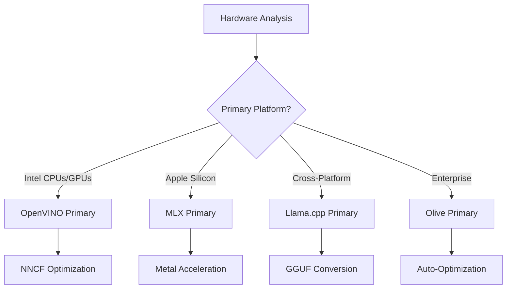
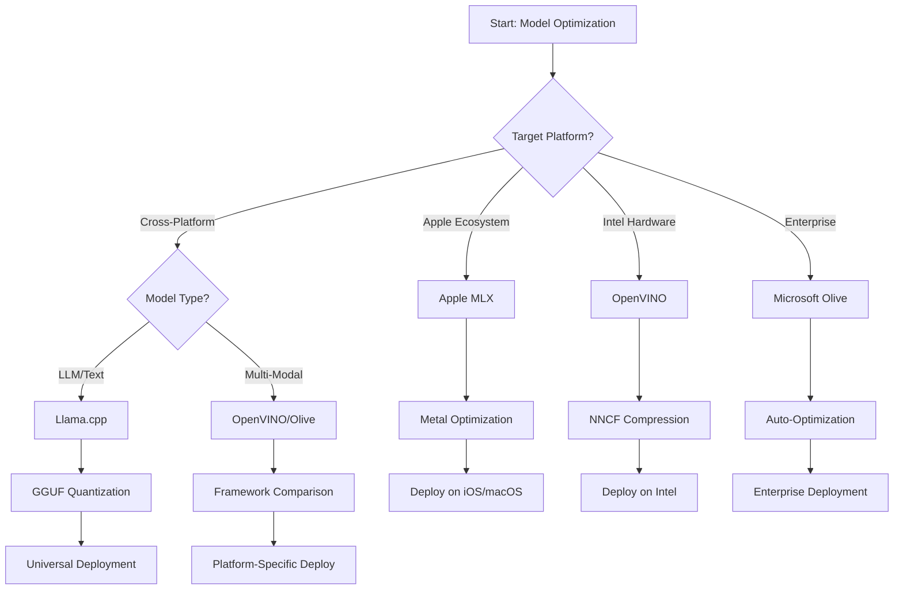
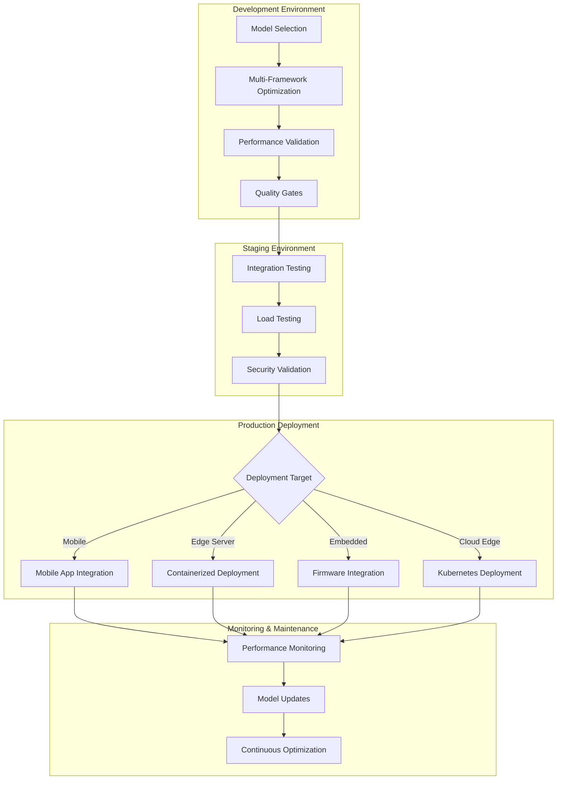

<!--
CO_OP_TRANSLATOR_METADATA:
{
  "original_hash": "6719c4a7e44b948230ac5f5cab3699bd",
  "translation_date": "2025-09-17T17:52:56+00:00",
  "source_file": "Module04/06.workflow-synthesis.md",
  "language_code": "ur"
}
-->
# سیکشن 6: ایج اے آئی ڈیولپمنٹ ورک فلو کا خلاصہ

## فہرست مضامین
1. [تعارف](../../../Module04)
2. [سیکھنے کے مقاصد](../../../Module04)
3. [متحدہ ورک فلو کا جائزہ](../../../Module04)
4. [فریم ورک انتخاب میٹرکس](../../../Module04)
5. [بہترین طریقوں کا خلاصہ](../../../Module04)
6. [ڈیپلائمنٹ اسٹریٹجی گائیڈ](../../../Module04)
7. [کارکردگی کی اصلاح کا ورک فلو](../../../Module04)
8. [پروڈکشن تیاری چیک لسٹ](../../../Module04)
9. [مسائل کا حل اور مانیٹرنگ](../../../Module04)
10. [اپنے ایج اے آئی پائپ لائن کو مستقبل کے لیے تیار کرنا](../../../Module04)

## تعارف

ایج اے آئی کی ترقی کے لیے مختلف آپٹیمائزیشن فریم ورک، ڈیپلائمنٹ اسٹریٹجیز، اور ہارڈویئر کے پہلوؤں کی گہری سمجھ ضروری ہے۔ یہ جامع خلاصہ Llama.cpp، Microsoft Olive، OpenVINO، اور Apple MLX سے حاصل کردہ معلومات کو یکجا کرتا ہے تاکہ ایک متحدہ ورک فلو بنایا جا سکے جو کارکردگی کو زیادہ سے زیادہ کرے، معیار کو برقرار رکھے، اور پروڈکشن ڈیپلائمنٹ کو کامیاب بنائے۔

اس کورس کے دوران، ہم نے انفرادی آپٹیمائزیشن فریم ورک کا جائزہ لیا، جن میں ہر ایک کی منفرد طاقتیں اور مخصوص استعمال کے کیسز ہیں۔ تاہم، حقیقی دنیا کے ایج اے آئی پروجیکٹس اکثر متعدد فریم ورک کے تکنیکوں کو یکجا کرنے یا اسٹریٹجک فیصلے کرنے کی ضرورت ہوتی ہے کہ کون سا طریقہ مخصوص پابندیوں اور ضروریات کے لیے بہترین نتائج فراہم کرے گا۔

یہ سیکشن تمام فریم ورک سے حاصل کردہ اجتماعی دانش کو قابل عمل ورک فلو، فیصلہ سازی کے درخت، اور بہترین طریقوں میں تبدیل کرتا ہے تاکہ آپ پروڈکشن کے لیے تیار ایج اے آئی حل کو مؤثر طریقے سے اور مؤثر طریقے سے بنا سکیں۔ چاہے آپ موبائل ڈیوائسز، ایمبیڈڈ سسٹمز، یا ایج سرورز کے لیے آپٹیمائز کر رہے ہوں، یہ گائیڈ آپ کے ترقیاتی لائف سائیکل کے دوران باخبر فیصلے کرنے کے لیے اسٹریٹجک فریم ورک فراہم کرتا ہے۔

## سیکھنے کے مقاصد

### اسٹریٹجک فیصلہ سازی
- **تشخیص کریں اور منتخب کریں** بہترین آپٹیمائزیشن فریم ورک کو پروجیکٹ کی ضروریات، ہارڈویئر کی پابندیوں، اور ڈیپلائمنٹ کے منظرناموں کی بنیاد پر
- **جامع ورک فلو ڈیزائن کریں** جو زیادہ سے زیادہ کارکردگی کے لیے متعدد آپٹیمائزیشن تکنیکوں کو یکجا کرے
- **تجزیہ کریں** ماڈل کی درستگی، انفرنس کی رفتار، میموری کے استعمال، اور مختلف فریم ورک کے درمیان ڈیپلائمنٹ کی پیچیدگی کے درمیان سمجھوتے

### ورک فلو انضمام
- **متحدہ ترقیاتی پائپ لائنز نافذ کریں** جو متعدد آپٹیمائزیشن فریم ورک کی طاقتوں کو استعمال کریں
- **دوبارہ قابل عمل ورک فلو بنائیں** مختلف ماحول میں ماڈل آپٹیمائزیشن اور ڈیپلائمنٹ کے لیے
- **معیار کے دروازے قائم کریں** اور توثیق کے عمل تاکہ آپٹیمائزڈ ماڈل پروڈکشن کی ضروریات کو پورا کریں

### کارکردگی کی اصلاح
- **منظم آپٹیمائزیشن حکمت عملیوں کا اطلاق کریں** جیسے کوانٹائزیشن، پروننگ، اور ہارڈویئر مخصوص ایکسیلیریشن تکنیک
- **مانیٹر کریں اور بینچ مارک کریں** ماڈل کی کارکردگی مختلف آپٹیمائزیشن لیولز اور ڈیپلائمنٹ کے اہداف پر
- **مخصوص ہارڈویئر پلیٹ فارمز کے لیے آپٹیمائز کریں** جیسے CPU، GPU، NPU، اور خصوصی ایج ایکسیلیریٹرز

### پروڈکشن ڈیپلائمنٹ
- **اسکیل ایبل ڈیپلائمنٹ آرکیٹیکچرز ڈیزائن کریں** جو متعدد ماڈل فارمیٹس اور انفرنس انجنز کو ایڈجسٹ کریں
- **مانیٹرنگ اور مشاہدہ نافذ کریں** پروڈکشن ماحول میں ایج اے آئی ایپلیکیشنز کے لیے
- **مینٹیننس ورک فلو قائم کریں** ماڈل اپڈیٹس، کارکردگی کی نگرانی، اور سسٹم کی اصلاح کے لیے

### کراس پلیٹ فارم ایکسیلنس
- **آپٹیمائزڈ ماڈلز ڈیپلائے کریں** مختلف ہارڈویئر پلیٹ فارمز پر جبکہ مستقل کارکردگی کو برقرار رکھیں
- **پلیٹ فارم مخصوص آپٹیمائزیشنز کو ہینڈل کریں** ونڈوز، میک او ایس، لینکس، موبائل، اور ایمبیڈڈ سسٹمز کے لیے
- **ایبسٹریکشن لیئرز بنائیں** جو مختلف ایج ماحول میں بغیر کسی رکاوٹ کے ڈیپلائمنٹ کو ممکن بنائیں

## متحدہ ورک فلو کا جائزہ

### مرحلہ 1: ضروریات کا تجزیہ اور فریم ورک کا انتخاب

ایج اے آئی ڈیپلائمنٹ کی کامیابی کی بنیاد مکمل ضروریات کے تجزیے سے شروع ہوتی ہے جو فریم ورک کے انتخاب اور آپٹیمائزیشن حکمت عملی کو مطلع کرتی ہے۔

#### 1.1 ہارڈویئر کا جائزہ


**اہم پہلو:**
- **CPU آرکیٹیکچر**: x86، ARM، Apple Silicon کی صلاحیتیں
- **ایکسیلیریٹر کی دستیابی**: GPU، NPU، VPU، خصوصی AI چپس
- **میموری کی پابندیاں**: RAM کی حدود، اسٹوریج کی گنجائش
- **پاور بجٹ**: بیٹری کی زندگی، تھرمل پابندیاں
- **کنیکٹیویٹی**: آف لائن ضروریات، بینڈوڈتھ کی حدود

#### 1.2 ایپلیکیشن ضروریات میٹرکس

| ضرورت | Llama.cpp | Microsoft Olive | OpenVINO | Apple MLX |
|--------|-----------|-----------------|----------|-----------|
| کراس پلیٹ فارم | ✅ بہترین | ⚡ اچھا | ⚡ اچھا | ❌ صرف ایپل |
| انٹرپرائز انضمام | ⚡ بنیادی | ✅ بہترین | ✅ بہترین | ⚡ محدود |
| موبائل ڈیپلائمنٹ | ✅ بہترین | ⚡ اچھا | ⚡ اچھا | ✅ iOS بہترین |
| ریئل ٹائم انفرنس | ✅ بہترین | ✅ بہترین | ✅ بہترین | ✅ بہترین |
| ماڈل کی تنوع | ✅ LLM فوکس | ✅ تمام ماڈلز | ✅ تمام ماڈلز | ✅ LLM فوکس |
| استعمال میں آسانی | ✅ سادہ | ✅ خودکار | ⚡ معتدل | ✅ سادہ | 

### مرحلہ 2: ماڈل کی تیاری اور آپٹیمائزیشن

#### 2.1 یونیورسل ماڈل اسسمنٹ پائپ لائن

```python
# Universal Model Assessment Framework
class EdgeAIModelAssessment:
    def __init__(self, model_path, target_hardware):
        self.model_path = model_path
        self.target_hardware = target_hardware
        self.optimization_frameworks = []
        
    def assess_model_characteristics(self):
        """Analyze model size, architecture, and complexity"""
        return {
            'model_size': self.get_model_size(),
            'parameter_count': self.get_parameter_count(),
            'architecture_type': self.detect_architecture(),
            'quantization_compatibility': self.check_quantization_support()
        }
    
    def recommend_optimization_strategy(self):
        """Recommend optimal frameworks and techniques"""
        characteristics = self.assess_model_characteristics()
        
        if self.target_hardware.startswith('apple'):
            return self.mlx_optimization_strategy(characteristics)
        elif self.target_hardware.startswith('intel'):
            return self.openvino_optimization_strategy(characteristics)
        elif characteristics['model_size'] > 7_000_000_000:  # 7B+ parameters
            return self.enterprise_optimization_strategy(characteristics)
        else:
            return self.lightweight_optimization_strategy(characteristics)
```

#### 2.2 ملٹی فریم ورک آپٹیمائزیشن پائپ لائن

**تسلسل آپٹیمائزیشن طریقہ:**
1. **ابتدائی تبدیلی**: درمیانی فارمیٹ میں تبدیل کریں (ممکن ہو تو ONNX)
2. **فریم ورک مخصوص آپٹیمائزیشن**: خصوصی تکنیکوں کا اطلاق کریں
3. **کراس ویلیڈیشن**: مختلف ہدف پلیٹ فارمز پر کارکردگی کی تصدیق کریں
4. **حتمی پیکجنگ**: ڈیپلائمنٹ کے لیے تیار کریں

```bash
# Multi-Framework Optimization Script
#!/bin/bash

MODEL_NAME="phi-3-mini"
BASE_MODEL="microsoft/Phi-3-mini-4k-instruct"

# Phase 1: ONNX Conversion (Universal)
python convert_to_onnx.py --model $BASE_MODEL --output models/onnx/

# Phase 2: Platform-Specific Optimization
if [[ "$TARGET_PLATFORM" == "intel" ]]; then
    # OpenVINO Optimization
    python optimize_openvino.py --input models/onnx/ --output models/openvino/
elif [[ "$TARGET_PLATFORM" == "apple" ]]; then
    # MLX Optimization
    python optimize_mlx.py --input $BASE_MODEL --output models/mlx/
elif [[ "$TARGET_PLATFORM" == "cross" ]]; then
    # Llama.cpp Optimization
    python convert_to_gguf.py --input models/onnx/ --output models/gguf/
fi

# Phase 3: Validation
python validate_optimization.py --original $BASE_MODEL --optimized models/$TARGET_PLATFORM/
```

### مرحلہ 3: کارکردگی کی توثیق اور بینچ مارکنگ

#### 3.1 جامع بینچ مارکنگ فریم ورک

```python
class EdgeAIBenchmark:
    def __init__(self, optimized_models):
        self.models = optimized_models
        self.metrics = {
            'inference_time': [],
            'memory_usage': [],
            'accuracy_score': [],
            'throughput': [],
            'energy_consumption': []
        }
    
    def run_comprehensive_benchmark(self):
        """Execute standardized benchmarks across all optimized models"""
        test_inputs = self.generate_test_inputs()
        
        for model_framework, model_path in self.models.items():
            print(f"Benchmarking {model_framework}...")
            
            # Latency Testing
            latency = self.measure_inference_latency(model_path, test_inputs)
            
            # Memory Profiling
            memory = self.profile_memory_usage(model_path)
            
            # Accuracy Validation
            accuracy = self.validate_model_accuracy(model_path, test_inputs)
            
            # Throughput Analysis
            throughput = self.measure_throughput(model_path)
            
            self.record_metrics(model_framework, latency, memory, accuracy, throughput)
    
    def generate_optimization_report(self):
        """Create comprehensive comparison report"""
        report = {
            'recommendations': self.analyze_performance_trade_offs(),
            'deployment_guidance': self.generate_deployment_recommendations(),
            'monitoring_requirements': self.define_monitoring_metrics()
        }
        return report
```

## فریم ورک انتخاب میٹرکس

### فریم ورک انتخاب کے لیے فیصلہ سازی کا درخت



### جامع انتخاب کے معیار

#### 1. بنیادی استعمال کے کیس کی مطابقت

**بڑے لینگویج ماڈلز (LLMs):**
- **Llama.cpp**: CPU فوکس، کراس پلیٹ فارم ڈیپلائمنٹ کے لیے بہترین
- **Apple MLX**: ایپل سلیکون کے لیے بہترین، متحدہ میموری کے ساتھ
- **OpenVINO**: انٹیل ہارڈویئر کے لیے بہترین، NNCF آپٹیمائزیشن کے ساتھ
- **Microsoft Olive**: انٹرپرائز ورک فلو کے لیے مثالی، خودکار آپٹیمائزیشن کے ساتھ

**ملٹی موڈل ماڈلز:**
- **OpenVINO**: وژن، آڈیو، اور ٹیکسٹ کے لیے جامع سپورٹ
- **Microsoft Olive**: پیچیدہ پائپ لائنز کے لیے انٹرپرائز گریڈ آپٹیمائزیشن
- **Llama.cpp**: صرف ٹیکسٹ پر مبنی ماڈلز تک محدود
- **Apple MLX**: ملٹی موڈل ایپلیکیشنز کے لیے بڑھتی ہوئی سپورٹ

#### 2. ہارڈویئر پلیٹ فارم میٹرکس

| پلیٹ فارم | بنیادی فریم ورک | ثانوی آپشن | خصوصی خصوصیات |
|-----------|------------------|------------|----------------|
| انٹیل CPU/GPU | OpenVINO | Microsoft Olive | NNCF کمپریشن، انٹیل آپٹیمائزیشن |
| NVIDIA GPU | Microsoft Olive | OpenVINO | CUDA ایکسیلیریشن، انٹرپرائز خصوصیات |
| Apple Silicon | Apple MLX | Llama.cpp | میٹل شیڈرز، متحدہ میموری |
| ARM موبائل | Llama.cpp | OpenVINO | کراس پلیٹ فارم، کم از کم انحصار |
| Edge TPU | OpenVINO | Microsoft Olive | خصوصی ایکسیلیریٹر سپورٹ |
| ایمبیڈڈ ARM | Llama.cpp | OpenVINO | کم سے کم فٹ پرنٹ، مؤثر انفرنس |

#### 3. ترقیاتی ورک فلو کی ترجیحات

**تیز پروٹو ٹائپنگ:**
1. **Llama.cpp**: سب سے تیز سیٹ اپ، فوری نتائج
2. **Apple MLX**: سادہ پائتھون API، تیز تکرار
3. **Microsoft Olive**: خودکار آپٹیمائزیشن، کم سے کم کنفیگریشن
4. **OpenVINO**: زیادہ پیچیدہ سیٹ اپ، جامع خصوصیات

**انٹرپرائز پروڈکشن:**
1. **Microsoft Olive**: انٹرپرائز خصوصیات، Azure انضمام
2. **OpenVINO**: انٹیل ایکو سسٹم، جامع ٹولز
3. **Apple MLX**: ایپل مخصوص انٹرپرائز ایپلیکیشنز
4. **Llama.cpp**: سادہ ڈیپلائمنٹ، محدود انٹرپرائز خصوصیات

## بہترین طریقوں کا خلاصہ

### یونیورسل آپٹیمائزیشن اصول

#### 1. ترقی پسند آپٹیمائزیشن حکمت عملی

```python
class ProgressiveOptimization:
    def __init__(self, base_model):
        self.base_model = base_model
        self.optimization_stages = [
            'baseline_measurement',
            'format_conversion',
            'quantization_optimization',
            'hardware_acceleration',
            'production_validation'
        ]
    
    def execute_progressive_optimization(self):
        """Apply optimization techniques incrementally"""
        
        # Stage 1: Baseline Measurement
        baseline_metrics = self.measure_baseline_performance()
        
        # Stage 2: Format Conversion
        converted_model = self.convert_to_optimal_format()
        conversion_metrics = self.measure_performance(converted_model)
        
        # Stage 3: Quantization
        quantized_model = self.apply_quantization(converted_model)
        quantization_metrics = self.measure_performance(quantized_model)
        
        # Stage 4: Hardware Acceleration
        accelerated_model = self.enable_hardware_acceleration(quantized_model)
        acceleration_metrics = self.measure_performance(accelerated_model)
        
        # Stage 5: Validation
        production_ready = self.validate_for_production(accelerated_model)
        
        return self.compile_optimization_report(
            baseline_metrics, conversion_metrics, 
            quantization_metrics, acceleration_metrics
        )
```

#### 2. معیار کے دروازے کا نفاذ

**درستگی کے تحفظ کے دروازے:**
- اصل ماڈل کی درستگی کا >95% برقرار رکھیں
- نمائندہ ٹیسٹ ڈیٹا سیٹس کے خلاف توثیق کریں
- پروڈکشن توثیق کے لیے A/B ٹیسٹنگ نافذ کریں

**کارکردگی میں بہتری کے دروازے:**
- کم از کم 2x رفتار میں بہتری حاصل کریں
- میموری فٹ پرنٹ کو کم از کم 50% تک کم کریں
- انفرنس وقت کی مستقل مزاجی کی توثیق کریں

**پروڈکشن تیاری کے دروازے:**
- لوڈ کے تحت دباؤ کی جانچ پاس کریں
- وقت کے ساتھ مستحکم کارکردگی کا مظاہرہ کریں
- سیکیورٹی اور پرائیویسی کی ضروریات کی توثیق کریں

### فریم ورک مخصوص بہترین طریقوں کا انضمام

#### 1. کوانٹائزیشن حکمت عملی کا خلاصہ

```python
# Unified Quantization Approach
class UnifiedQuantizationStrategy:
    def __init__(self, model, target_platform):
        self.model = model
        self.platform = target_platform
        
    def select_optimal_quantization(self):
        """Choose best quantization based on platform and requirements"""
        
        if self.platform == 'apple_silicon':
            return self.mlx_quantization_strategy()
        elif self.platform == 'intel_hardware':
            return self.openvino_quantization_strategy()
        elif self.platform == 'cross_platform':
            return self.llamacpp_quantization_strategy()
        else:
            return self.olive_quantization_strategy()
    
    def mlx_quantization_strategy(self):
        """Apple MLX-specific quantization"""
        return {
            'method': 'mlx_quantize',
            'precision': 'int4',
            'group_size': 64,
            'optimization_target': 'unified_memory'
        }
    
    def openvino_quantization_strategy(self):
        """OpenVINO NNCF quantization"""
        return {
            'method': 'nncf_quantize',
            'precision': 'int8',
            'calibration_method': 'post_training',
            'optimization_target': 'intel_hardware'
        }
```

#### 2. ہارڈویئر ایکسیلیریشن کی اصلاح

**CPU آپٹیمائزیشن کا خلاصہ:**
- **SIMD انسٹرکشنز**: فریم ورک کے ذریعے آپٹیمائزڈ کرنلز کا فائدہ اٹھائیں
- **میموری بینڈوڈتھ**: کیش کی کارکردگی کے لیے ڈیٹا لے آؤٹ کو آپٹیمائز کریں
- **تھریڈنگ**: متوازی عمل کو وسائل کی پابندیوں کے ساتھ متوازن کریں

**GPU ایکسیلیریشن بہترین طریقے:**
- **بیچ پروسیسنگ**: مناسب بیچ سائز کے ساتھ تھروپٹ کو زیادہ سے زیادہ کریں
- **میموری مینجمنٹ**: GPU میموری کی مختص اور منتقلی کو آپٹیمائز کریں
- **پریسیشن**: FP16 استعمال کریں جب بہتر کارکردگی کے لیے سپورٹ ہو

**NPU/خصوصی ایکسیلیریٹر کی اصلاح:**
- **ماڈل آرکیٹیکچر**: ایکسیلیریٹر کی صلاحیتوں کے ساتھ مطابقت کو یقینی بنائیں
- **ڈیٹا فلو**: ایکسیلیریٹر کی کارکردگی کے لیے ان پٹ/آؤٹ پٹ پائپ لائنز کو آپٹیمائز کریں
- **فال بیک حکمت عملی**: غیر تعاون یافتہ آپریشنز کے لیے CPU فال بیک نافذ کریں

## ڈیپلائمنٹ اسٹریٹجی گائیڈ

### یونیورسل ڈیپلائمنٹ آرکیٹیکچر



### پلیٹ فارم مخصوص ڈیپلائمنٹ پیٹرنز

#### 1. موبائل ڈیپلائمنٹ اسٹریٹجی

```yaml
# Mobile Deployment Configuration
mobile_deployment:
  ios:
    framework: apple_mlx
    optimization:
      quantization: int4
      memory_mapping: true
      background_execution: limited
    packaging:
      format: mlx
      bundle_size: <50MB
      
  android:
    framework: llama_cpp
    optimization:
      quantization: q4_k_m
      threading: android_optimized
      memory_management: conservative
    packaging:
      format: gguf
      apk_size: <100MB
      
  cross_platform:
    framework: onnx_runtime
    optimization:
      quantization: int8
      execution_provider: cpu
    packaging:
      format: onnx
      shared_libraries: minimal
```

#### 2. ایج سرور ڈیپلائمنٹ

```yaml
# Edge Server Deployment Configuration
edge_server:
  intel_based:
    framework: openvino
    optimization:
      quantization: int8
      acceleration: cpu_gpu_auto
      batch_processing: dynamic
    deployment:
      container: openvino_runtime
      orchestration: kubernetes
      scaling: horizontal
      
  nvidia_based:
    framework: microsoft_olive
    optimization:
      quantization: int4
      acceleration: cuda
      tensor_parallelism: true
    deployment:
      container: nvidia_triton
      orchestration: kubernetes
      scaling: gpu_aware
```

### کنٹینرائزیشن بہترین طریقے

```dockerfile
# Multi-Framework Edge AI Container
FROM ubuntu:22.04 as base

# Install common dependencies
RUN apt-get update && apt-get install -y \
    python3 \
    python3-pip \
    build-essential \
    cmake \
    && rm -rf /var/lib/apt/lists/*

# Framework-specific stages
FROM base as openvino
RUN pip install openvino nncf optimum[intel]

FROM base as llamacpp
RUN git clone https://github.com/ggerganov/llama.cpp.git \
    && cd llama.cpp && make LLAMA_OPENBLAS=1

FROM base as olive
RUN pip install olive-ai[auto-opt] onnxruntime-genai

# Production stage with selected framework
FROM openvino as production
COPY models/ /app/models/
COPY src/ /app/src/
WORKDIR /app

EXPOSE 8080
CMD ["python3", "src/inference_server.py"]
```

## کارکردگی کی اصلاح کا ورک فلو

### منظم کارکردگی کی ٹیوننگ

#### 1. کارکردگی پروفائلنگ پائپ لائن

```python
class EdgeAIPerformanceProfiler:
    def __init__(self, model_path, framework):
        self.model_path = model_path
        self.framework = framework
        self.profiling_results = {}
    
    def comprehensive_profiling(self):
        """Execute comprehensive performance analysis"""
        
        # CPU Profiling
        cpu_profile = self.profile_cpu_usage()
        
        # Memory Profiling
        memory_profile = self.profile_memory_usage()
        
        # Inference Latency
        latency_profile = self.profile_inference_latency()
        
        # Throughput Analysis
        throughput_profile = self.profile_throughput()
        
        # Energy Consumption (where available)
        energy_profile = self.profile_energy_consumption()
        
        return self.compile_performance_report(
            cpu_profile, memory_profile, latency_profile,
            throughput_profile, energy_profile
        )
    
    def identify_bottlenecks(self):
        """Automatically identify performance bottlenecks"""
        bottlenecks = []
        
        if self.profiling_results['cpu_utilization'] > 80:
            bottlenecks.append('cpu_bound')
        
        if self.profiling_results['memory_usage'] > 90:
            bottlenecks.append('memory_bound')
        
        if self.profiling_results['inference_variance'] > 20:
            bottlenecks.append('inconsistent_performance')
        
        return self.generate_optimization_recommendations(bottlenecks)
```

#### 2. خودکار آپٹیمائزیشن پائپ لائن

```python
class AutomatedOptimizationPipeline:
    def __init__(self, base_model, target_constraints):
        self.base_model = base_model
        self.constraints = target_constraints
        self.optimization_history = []
    
    def execute_optimization_search(self):
        """Systematically search optimization space"""
        
        optimization_candidates = [
            {'quantization': 'int8', 'pruning': 0.1},
            {'quantization': 'int4', 'pruning': 0.2},
            {'quantization': 'int8', 'acceleration': 'gpu'},
            {'quantization': 'int4', 'acceleration': 'npu'}
        ]
        
        best_configuration = None
        best_score = 0
        
        for config in optimization_candidates:
            optimized_model = self.apply_optimization(config)
            score = self.evaluate_optimization(optimized_model)
            
            if score > best_score and self.meets_constraints(optimized_model):
                best_score = score
                best_configuration = config
            
            self.optimization_history.append({
                'config': config,
                'score': score,
                'model': optimized_model
            })
        
        return best_configuration, self.optimization_history
```

### ملٹی آبجیکٹیو آپٹیمائزیشن

#### 1. ایج اے آئی کے لیے پیریٹو آپٹیمائزیشن

```python
class ParetoOptimization:
    def __init__(self, objectives=['speed', 'accuracy', 'memory']):
        self.objectives = objectives
        self.pareto_frontier = []
    
    def find_pareto_optimal_solutions(self, optimization_results):
        """Identify Pareto-optimal configurations"""
        
        for result in optimization_results:
            is_dominated = False
            
            for frontier_point in self.pareto_frontier:
                if self.dominates(frontier_point, result):
                    is_dominated = True
                    break
            
            if not is_dominated:
                # Remove dominated points from frontier
                self.pareto_frontier = [
                    point for point in self.pareto_frontier 
                    if not self.dominates(result, point)
                ]
                
                self.pareto_frontier.append(result)
        
        return self.pareto_frontier
    
    def recommend_configuration(self, user_preferences):
        """Recommend configuration based on user preferences"""
        
        weighted_scores = []
        for config in self.pareto_frontier:
            score = sum(
                user_preferences[obj] * config['metrics'][obj] 
                for obj in self.objectives
            )
            weighted_scores.append((score, config))
        
        return max(weighted_scores, key=lambda x: x[0])[1]
```

## پروڈکشن تیاری چیک لسٹ

### جامع پروڈکشن توثیق

#### 1. ماڈل کوالٹی ایشورنس

```python
class ProductionReadinessValidator:
    def __init__(self, optimized_model, production_requirements):
        self.model = optimized_model
        self.requirements = production_requirements
        self.validation_results = {}
    
    def validate_model_quality(self):
        """Comprehensive model quality validation"""
        
        # Accuracy Validation
        accuracy_result = self.validate_accuracy()
        
        # Performance Validation
        performance_result = self.validate_performance()
        
        # Robustness Testing
        robustness_result = self.validate_robustness()
        
        # Security Assessment
        security_result = self.validate_security()
        
        # Compliance Verification
        compliance_result = self.validate_compliance()
        
        return self.compile_validation_report(
            accuracy_result, performance_result, robustness_result,
            security_result, compliance_result
        )
    
    def generate_certification_report(self):
        """Generate production certification report"""
        return {
            'model_signature': self.generate_model_signature(),
            'validation_timestamp': datetime.now(),
            'validation_results': self.validation_results,
            'deployment_approval': self.check_deployment_approval(),
            'monitoring_requirements': self.define_monitoring_requirements()
        }
```

#### 2. پروڈکشن ڈیپلائمنٹ چیک لسٹ

**پری ڈیپلائمنٹ توثیق:**
- [ ] ماڈل کی درستگی کم از کم ضروریات کو پورا کرتی ہے (>95% بیس لائن)
- [ ] کارکردگی کے اہداف حاصل کیے گئے ہیں (لیٹنسی، تھروپٹ، میموری)
- [ ] سیکیورٹی کی کمزوریوں کا جائزہ لیا گیا اور ان کا ازالہ کیا گیا
- [ ] متوقع لوڈ کے تحت دباؤ کی جانچ مکمل ہوئی
- [ ] ناکامی کے منظرنامے کی جانچ کی گئی اور بحالی کے طریقہ کار کی توثیق کی گئی
- [ ] مانیٹرنگ اور الرٹ سسٹمز کو ترتیب دیا گیا
- [ ] رول بیک کے طریقہ کار کی جانچ کی گئی اور دستاویز کیا گیا

**ڈیپلائمنٹ عمل:**
- [ ] بلیو-گرین ڈیپلائمنٹ اسٹریٹجی نافذ کی گئی
- [ ] ٹریفک کو بتدریج بڑھانے کی ترتیب دی گئی
- [ ] ریئل ٹائم مانیٹرنگ ڈیش بورڈز فعال ہیں
- [ ] کارکردگی کے بیس لائنز قائم کیے گئے ہیں
- [ ] ایرر ریٹ کی حدیں متعین کی گئی ہیں
- [ ] خودکار رول بیک ٹرگرز ترتیب دیے گئے ہیں

**پوسٹ ڈیپلائمنٹ مانیٹرنگ:**
- [ ] ماڈل ڈرفٹ ڈیٹیکشن فعال ہے
- [ ] کارکردگی کی خرابی کے الرٹس ترتیب دیے گئے ہیں
- [ ] وسائل کے استعمال کی نگرانی فعال ہے
- [ ] صارف کے تجربے کے میٹرکس کو ٹریک کیا گیا ہے
- [ ] ماڈل ورژننگ اور نسب برقرار رکھا گیا ہے
- [ ] ماڈل کی کارکردگی کے باقاعدہ جائزے شیڈول کیے گئے ہیں

### مسلسل انضمام/مسلسل ڈیپلائمنٹ (CI/CD)

```yaml
# Edge AI CI/CD Pipeline Configuration
edge_ai_pipeline:
  stages:
    - model_validation
    - optimization
    - testing
    - staging_deployment
    - production_deployment
    - monitoring
  
  model_validation:
    accuracy_threshold: 0.95
    performance_baseline: required
    security_scan: enabled
    
  optimization:
    frameworks:
      - llama_cpp
      - openvino
      - microsoft_olive
    validation:
      cross_validation: enabled
      performance_comparison: required
      
  testing:
    unit_tests: comprehensive
    integration_tests: full_pipeline
    load_tests: production_scale
    security_tests: comprehensive
    
  deployment:
    strategy: blue_green
    traffic_ramping: gradual
    rollback: automatic
    monitoring: real_time
```

## مسائل کا حل اور مانیٹرنگ

### یونیورسل ٹربل شوٹنگ فریم ورک

#### 1. عام مسائل اور حل

**کارکردگی کے مسائل:**
```python
class PerformanceTroubleshooter:
    def __init__(self, model_metrics):
        self.metrics = model_metrics
        
    def diagnose_performance_issues(self):
        """Systematic performance issue diagnosis"""
        
        issues = []
        
        # High latency diagnosis
        if self.metrics['avg_latency'] > self.metrics['target_latency']:
            issues.append(self.diagnose_latency_issues())
        
        # Memory usage diagnosis
        if self.metrics['memory_usage'] > self.metrics['memory_limit']:
            issues.append(self.diagnose_memory_issues())
        
        # Throughput diagnosis
        if self.metrics['throughput'] < self.metrics['target_throughput']:
            issues.append(self.diagnose_throughput_issues())
        
        return self.generate_resolution_plan(issues)
    
    def diagnose_latency_issues(self):
        """Specific latency troubleshooting"""
        potential_causes = []
        
        if self.metrics['cpu_utilization'] > 80:
            potential_causes.append('cpu_bottleneck')
        
        if self.metrics['memory_bandwidth'] > 90:
            potential_causes.append('memory_bandwidth_limit')
        
        if self.metrics['model_size'] > self.metrics['optimal_size']:
            potential_causes.append('model_too_large')
        
        return {
            'issue': 'high_latency',
            'causes': potential_causes,
            'solutions': self.generate_latency_solutions(potential_causes)
        }
```

**فریم ورک مخصوص ٹربل شوٹنگ:**

| مسئلہ | Llama.cpp | Microsoft Olive | OpenVINO | Apple MLX |
|-------|-----------|-----------------|----------|-----------|
| میموری کے مسائل | کانٹیکسٹ کی لمبائی کم کریں | بیچ سائز کم کریں | کیشنگ فعال کریں | میموری میپنگ استعمال کریں |
| سست انفرنس | SIMD فعال کریں | کوانٹائزیشن چیک کریں | تھریڈنگ کو آپٹیمائز کریں | میٹل فعال کریں |
| درستگی کا نقصان | زیادہ کوانٹائزیشن | QAT کے ساتھ دوبارہ تربیت کریں | کیلیبریشن بڑھائیں | پوسٹ کوانٹ فائن ٹیون کریں |
| مطابقت | ماڈل فارمیٹ چیک کریں | فریم ورک ورژن کی تصدیق کریں | ڈرائیورز کو اپ ڈیٹ کریں | macOS ورژن چیک کریں |

#### 
یاد رکھیں کہ بہترین اصلاحی حکمت عملی وہی ہے جو آپ کی مخصوص ضروریات کو پورا کرے اور ساتھ ہی ان ضروریات کے بدلنے پر لچکدار رہنے کی صلاحیت رکھے۔ اس گائیڈ کو ایک فریم ورک کے طور پر استعمال کریں تاکہ معلوماتی فیصلے کیے جا سکیں، لیکن ہمیشہ اپنے انتخاب کو عملی تجربات اور حقیقی دنیا کی تعیناتی کے ذریعے جانچیں۔

## ➡️ آگے کیا کریں

اپنے Edge AI سفر کو جاری رکھیں اور [Module 5: SLMOps and Production Deployment](../Module05/README.md) کو دریافت کریں تاکہ Small Language Model کے زندگی کے دورانیے کے انتظام کے عملی پہلوؤں کے بارے میں سیکھ سکیں۔

---

**ڈسکلیمر**:  
یہ دستاویز AI ترجمہ سروس [Co-op Translator](https://github.com/Azure/co-op-translator) کا استعمال کرتے ہوئے ترجمہ کی گئی ہے۔ ہم درستگی کے لیے کوشش کرتے ہیں، لیکن براہ کرم آگاہ رہیں کہ خودکار ترجمے میں غلطیاں یا غیر درستیاں ہو سکتی ہیں۔ اصل دستاویز کو اس کی اصل زبان میں مستند ذریعہ سمجھا جانا چاہیے۔ اہم معلومات کے لیے، پیشہ ور انسانی ترجمہ کی سفارش کی جاتی ہے۔ ہم اس ترجمے کے استعمال سے پیدا ہونے والی کسی بھی غلط فہمی یا غلط تشریح کے ذمہ دار نہیں ہیں۔