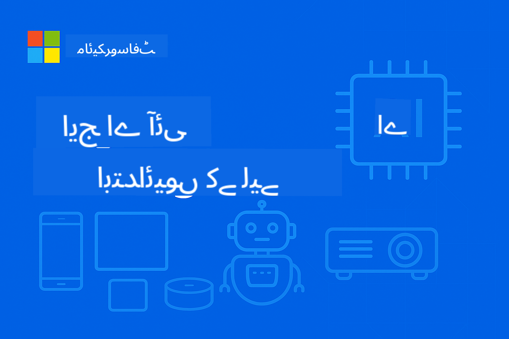

<!--
CO_OP_TRANSLATOR_METADATA:
{
  "original_hash": "8bcf70fe61c9007c880f9753cc9c3e01",
  "translation_date": "2025-10-09T06:36:59+00:00",
  "source_file": "README.md",
  "language_code": "ur"
}
-->
# ایج اے آئی کے ابتدائی افراد کے لیے



[](https://GitHub.com/microsoft/edgeai-for-beginners/graphs/contributors)
[](https://GitHub.com/microsoft/edgeai-for-beginners/issues)
[](https://GitHub.com/microsoft/edgeai-for-beginners/pulls)
[](http://makeapullrequest.com)

[](https://GitHub.com/microsoft/edgeai-for-beginners/watchers)
[](https://GitHub.com/microsoft/edgeai-for-beginners/fork)
[](https://GitHub.com/microsoft/edgeai-for-beginners/stargazers)

[](https://discord.com/invite/ByRwuEEgH4)

ان وسائل کو استعمال کرنے کے لیے درج ذیل اقدامات کریں:

1. **ریپوزیٹری کو فورک کریں**: کلک کریں [](https://GitHub.com/microsoft/edgeai-for-beginners/fork)
2. **ریپوزیٹری کو کلون کریں**: `git clone https://github.com/microsoft/edgeai-for-beginners.git`
3. [**Azure AI Foundry Discord میں شامل ہوں اور ماہرین اور دیگر ڈویلپرز سے ملاقات کریں**](https://discord.com/invite/ByRwuEEgH4)

### 🌐 کثیر زبان کی حمایت

#### GitHub ایکشن کے ذریعے سپورٹ (خودکار اور ہمیشہ اپ ڈیٹ)

[عربی](../ar/README.md) | [بنگالی](../bn/README.md) | [بلغاریائی](../bg/README.md) | [برمی (میانمار)](../my/README.md) | [چینی (سادہ)](../zh/README.md) | [چینی (روایتی، ہانگ کانگ)](../hk/README.md) | [چینی (روایتی، مکاؤ)](../mo/README.md) | [چینی (روایتی، تائیوان)](../tw/README.md) | [کروشین](../hr/README.md) | [چیک](../cs/README.md) | [ڈینش](../da/README.md) | [ڈچ](../nl/README.md) | [فنش](../fi/README.md) | [فرانسیسی](../fr/README.md) | [جرمن](../de/README.md) | [یونانی](../el/README.md) | [عبرانی](../he/README.md) | [ہندی](../hi/README.md) | [ہنگریائی](../hu/README.md) | [انڈونیشیائی](../id/README.md) | [اطالوی](../it/README.md) | [جاپانی](../ja/README.md) | [کوریائی](../ko/README.md) | [مالائی](../ms/README.md) | [مراٹھی](../mr/README.md) | [نیپالی](../ne/README.md) | [نارویجین](../no/README.md) | [فارسی (ایرانی)](../fa/README.md) | [پولش](../pl/README.md) | [پرتگالی (برازیل)](../br/README.md) | [پرتگالی (پرتگال)](../pt/README.md) | [پنجابی (گرمکھی)](../pa/README.md) | [رومانیائی](../ro/README.md) | [روسی](../ru/README.md) | [سربیائی (سیریلک)](../sr/README.md) | [سلوواک](../sk/README.md) | [سلووینیائی](../sl/README.md) | [ہسپانوی](../es/README.md) | [سواحلی](../sw/README.md) | [سویڈش](../sv/README.md) | [ٹیگالوگ (فلپائنی)](../tl/README.md) | [تھائی](../th/README.md) | [ترکی](../tr/README.md) | [یوکرینی](../uk/README.md) | [اردو](./README.md) | [ویتنامی](../vi/README.md)

**اگر آپ اضافی زبانوں کی ترجمہ کی حمایت چاہتے ہیں تو یہاں درج ہیں [یہاں](https://github.com/Azure/co-op-translator/blob/main/getting_started/supported-languages.md)**

## تعارف

**ایج اے آئی کے ابتدائی افراد کے لیے** میں خوش آمدید – یہ کورس آپ کو ایج آرٹیفیشل انٹیلیجنس کی دنیا میں لے کر جائے گا۔ یہ کورس طاقتور اے آئی صلاحیتوں اور ایج ڈیوائسز پر حقیقی دنیا میں ان کے استعمال کے درمیان پل بناتا ہے، تاکہ آپ اے آئی کی صلاحیتوں کو براہ راست وہاں استعمال کر سکیں جہاں ڈیٹا پیدا ہوتا ہے اور فیصلے کیے جاتے ہیں۔

### آپ کیا سیکھیں گے

یہ کورس آپ کو بنیادی تصورات سے لے کر پروڈکشن کے لیے تیار عمل تک لے جائے گا، جس میں شامل ہیں:
- **چھوٹے زبان ماڈلز (SLMs)** جو ایج پر تعیناتی کے لیے بہتر بنائے گئے ہیں
- **ہارڈویئر کے مطابق اصلاح** مختلف پلیٹ فارمز پر
- **ریئل ٹائم انفرنس** کے ساتھ پرائیویسی کو محفوظ رکھنے کی صلاحیتیں
- **پروڈکشن تعیناتی** کی حکمت عملی کاروباری ایپلیکیشنز کے لیے

### ایج اے آئی کیوں اہم ہے

ایج اے آئی ایک نیا رجحان ہے جو جدید چیلنجز کو حل کرتا ہے:
- **پرائیویسی اور سیکیورٹی**: حساس ڈیٹا کو مقامی طور پر پراسیس کریں بغیر کلاؤڈ میں بھیجنے کے
- **ریئل ٹائم کارکردگی**: وقت کے حساس ایپلیکیشنز کے لیے نیٹ ورک لیٹنسی ختم کریں
- **لاگت کی بچت**: بینڈوڈتھ اور کلاؤڈ کمپیوٹنگ کے اخراجات کم کریں
- **مستحکم آپریشنز**: نیٹ ورک کی خرابی کے دوران بھی کام جاری رکھیں
- **قانونی تقاضے**: ڈیٹا کی خودمختاری کے اصولوں پر پورا اتریں

### ایج اے آئی

ایج اے آئی کا مطلب ہے کہ اے آئی الگورتھمز اور زبان ماڈلز کو مقامی طور پر ہارڈویئر پر چلانا، جہاں ڈیٹا پیدا ہوتا ہے، بغیر کلاؤڈ وسائل پر انحصار کیے۔ یہ لیٹنسی کو کم کرتا ہے، پرائیویسی کو بہتر بناتا ہے، اور ریئل ٹائم فیصلے کرنے کی صلاحیت فراہم کرتا ہے۔

### بنیادی اصول:
- **آن ڈیوائس انفرنس**: اے آئی ماڈلز ایج ڈیوائسز (فونز، روٹرز، مائیکرو کنٹرولرز، صنعتی پی سی) پر چلتے ہیں
- **آف لائن صلاحیت**: مستقل انٹرنیٹ کنیکٹیویٹی کے بغیر کام کرتا ہے
- **کم لیٹنسی**: فوری ردعمل جو ریئل ٹائم سسٹمز کے لیے موزوں ہیں
- **ڈیٹا کی خودمختاری**: حساس ڈیٹا کو مقامی رکھتا ہے، سیکیورٹی اور قانون کی پاسداری کو بہتر بناتا ہے

### چھوٹے زبان ماڈلز (SLMs)

SLMs جیسے Phi-4، Mistral-7B، اور Gemma بڑے LLMs کے بہتر ورژن ہیں – جو تربیت یافتہ یا ڈسٹل کیے گئے ہیں:
- **کم میموری استعمال**: ایج ڈیوائسز کی محدود میموری کا مؤثر استعمال
- **کم کمپیوٹ کی ضرورت**: CPU اور ایج GPU کی کارکردگی کے لیے بہتر بنایا گیا
- **تیز آغاز کے اوقات**: فوری آغاز کے لیے جو ایپلیکیشنز کو جوابدہ بناتا ہے

یہ طاقتور NLP صلاحیتیں فراہم کرتے ہیں جبکہ درج ذیل حدود کو پورا کرتے ہیں:
- **ایمبیڈڈ سسٹمز**: IoT ڈیوائسز اور صنعتی کنٹرولرز
- **موبائل ڈیوائسز**: اسمارٹ فونز اور ٹیبلٹس آف لائن صلاحیتوں کے ساتھ
- **IoT ڈیوائسز**: سینسرز اور سمارٹ ڈیوائسز محدود وسائل کے ساتھ
- **ایج سرورز**: مقامی پراسیسنگ یونٹس محدود GPU وسائل کے ساتھ
- **ذاتی کمپیوٹرز**: ڈیسک ٹاپ اور لیپ ٹاپ تعیناتی کے منظرنامے

## کورس ماڈیولز اور نیویگیشن

| ماڈیول | موضوع | فوکس ایریا | کلیدی مواد | سطح | دورانیہ |
|--------|-------|------------|-------------|--------|----------|
| [📖 00 ](./introduction.md) | [ایج اے آئی کا تعارف](./introduction.md) | بنیاد اور سیاق و سباق | ایج اے آئی کا جائزہ • صنعت کے اطلاقات • SLM کا تعارف • سیکھنے کے مقاصد | ابتدائی | 1-2 گھنٹے |
| [📚 01](../../Module01) | [ایج اے آئی کے بنیادی اصول](./Module01/README.md) | کلاؤڈ بمقابلہ ایج اے آئی کا موازنہ | ایج اے آئی کے بنیادی اصول • حقیقی دنیا کے کیس اسٹڈیز • عمل درآمد گائیڈ • ایج تعیناتی | ابتدائی | 3-4 گھنٹے |
| [🧠 02](../../Module02) | [SLM ماڈل کی بنیادیں](./Module02/README.md) | ماڈل خاندان اور فن تعمیر | Phi خاندان • Qwen خاندان • Gemma خاندان • BitNET • μModel • Phi-Silica | ابتدائی | 4-5 گھنٹے |
| [🚀 03](../../Module03) | [SLM تعیناتی کی مشق](./Module03/README.md) | مقامی اور کلاؤڈ تعیناتی | اعلیٰ درجے کی سیکھنے • مقامی ماحول • کلاؤڈ تعیناتی | درمیانی | 4-5 گھنٹے |
| [⚙️ 04](../../Module04) | [ماڈل اصلاحی ٹول کٹ](./Module04/README.md) | کراس پلیٹ فارم اصلاح | تعارف • Llama.cpp • Microsoft Olive • OpenVINO • Apple MLX • ورک فلو ترکیب | درمیانی | 5-6 گھنٹے |
| [🔧 05](../../Module05) | [SLMOps پروڈکشن](./Module05/README.md) | پروڈکشن آپریشنز | SLMOps تعارف • ماڈل ڈسٹلیشن • فائن ٹیوننگ • پروڈکشن تعیناتی | اعلیٰ | 5-6 گھنٹے |
| [🤖 06](../../Module06) | [اے آئی ایجنٹس اور فنکشن کالنگ](./Module06/README.md) | ایجنٹ فریم ورک اور MCP | ایجنٹ تعارف • فنکشن کالنگ • ماڈل سیاق و سباق پروٹوکول | اعلیٰ | 4-5 گھنٹے |
| [💻 07](../../Module07) | [پلیٹ فارم عمل درآمد](./Module07/README.md) | کراس پلیٹ فارم نمونے | اے آئی ٹول کٹ • Foundry Local • ونڈوز ڈیولپمنٹ | اعلیٰ | 3-4 گھنٹے |
| [🏭 08](../../Module08) | [Foundry Local ٹول کٹ](./Module08/README.md) | پروڈکشن کے لیے تیار نمونے | نمونہ ایپلیکیشنز (تفصیلات نیچے دیکھیں) | ماہر | 8-10 گھنٹے |

### 🏭 **ماڈیول 08: نمونہ ایپلیکیشنز**

- [01: REST چیٹ کوئیک اسٹارٹ](./Module08/samples/01/README.md)
- [02: OpenAI SDK انٹیگریشن](./Module08/samples/02/README.md)
- [03: ماڈل دریافت اور بینچ مارکنگ](./Module08/samples/03/README.md)
- [04: Chainlit RAG ایپلیکیشن](./Module08/samples/04/README.md)
- [05: ملٹی ایجنٹ آرکیسٹریشن](./Module08/samples/05/README.md)
- [06: ماڈلز-ایز-ٹولز روٹر](./Module08/samples/06/README.md)
- [07: ڈائریکٹ API کلائنٹ](./Module08/samples/07/README.md)
- [08: ونڈوز 11 چیٹ ایپ](./Module08/samples/08/README.md)
- [09: اعلیٰ درجے کا ملٹی ایجنٹ سسٹم](./Module08/samples/09/README.md)
- [10: Foundry Tools فریم ورک](./Module08/samples/10/README.md)

### 🎓 **ورکشاپ: عملی سیکھنے کا راستہ**

پروڈکشن کے لیے تیار عمل درآمد کے ساتھ جامع عملی ورکشاپ مواد:

- **[ورکشاپ گائیڈ](./Workshop/Readme.md)** - مکمل سیکھنے کے مقاصد، نتائج، اور وسائل کی نیویگیشن
- **پائتھون نمونے** (6 سیشنز) - بہترین طریقوں، ایرر ہینڈلنگ، اور جامع دستاویزات کے ساتھ اپ ڈیٹ
- **Jupyter نوٹ بکس** (8 انٹرایکٹو) - مرحلہ وار ٹیوٹوریلز بینچ مارکس اور کارکردگی کی نگرانی کے ساتھ
- **سیشن گائیڈز** - ہر ورکشاپ سیشن کے لیے تفصیلی مارک ڈاؤن گائیڈز
- **توثیق کے ٹولز** - کوڈ کے معیار کی تصدیق اور اسموک ٹیسٹ چلانے کے اسکرپٹس

**آپ کیا بنائیں گے:**
- مقامی اے آئی چیٹ ایپلیکیشنز اسٹریمنگ سپورٹ کے ساتھ
- RAG پائپ لائنز کوالٹی ایویلیوایشن (RAGAS) کے ساتھ
- ملٹی ماڈل بینچ مارکنگ اور موازنہ کے ٹولز
- ملٹی ایجنٹ آرکیسٹریشن سسٹمز
- ذہین ماڈل روٹنگ ٹاسک پر مبنی انتخاب کے ساتھ

### 📊 **سیکھنے کا راستہ خلاصہ**
- **کل دورانیہ**: 36-45 گھنٹے
- **ابتدائی راستہ**: ماڈیولز 01-02 (7-9 گھنٹے)  
- **درمیانی راستہ**: ماڈیولز 03-04 (9-11 گھنٹے)
- **اعلیٰ راستہ**: ماڈیولز 05-07 (12-15 گھنٹے)
- **ماہر راستہ**: ماڈیول 08 (8-10 گھنٹے)

## آپ کیا بنائیں گے

### 🎯 بنیادی صلاحیتیں
- **ایج اے آئی آرکیٹیکچر**: مقامی-پہلے اے آئی سسٹمز کو کلاؤڈ انٹیگریشن کے ساتھ ڈیزائن کریں
- **ماڈل اصلاح**: ماڈلز کو ایج تعیناتی کے لیے کوانٹائز اور کمپریس کریں (85% رفتار میں اضافہ، 75% سائز میں کمی)
- **ملٹی پلیٹ فارم تعیناتی**: ونڈوز، موبائل، ایمبیڈڈ، اور کلاؤڈ-ایج ہائبرڈ سسٹمز
- **پروڈکشن آپریشنز**: ایج اے آئی کی نگرانی، اسکیلنگ، اور پروڈکشن میں برقرار رکھنا

### 🏗️ عملی منصوبے
- **Foundry Local چیٹ ایپس**: ونڈوز 11 کی مقامی ایپلیکیشن ماڈل سوئچنگ کے ساتھ
- **ملٹی ایجنٹ سسٹمز**: کوآرڈینیٹر کے ساتھ ماہر ایجنٹس پیچیدہ ورک فلو کے لیے  
- **RAG ایپلیکیشنز**: مقامی دستاویز پراسیسنگ وییکٹر سرچ کے ساتھ
- **ماڈل روٹرز**: کام کے تجزیے کی بنیاد پر ماڈلز کا ذہین انتخاب  
- **API فریم ورک**: پروڈکشن کے لیے تیار کلائنٹس، اسٹریمنگ اور صحت کی نگرانی کے ساتھ  
- **کراس پلیٹ فارم ٹولز**: LangChain/Semantic Kernel انٹیگریشن کے پیٹرنز  

### 🏢 صنعتی اطلاقات  
**مینوفیکچرنگ** • **صحت کی دیکھ بھال** • **خود مختار گاڑیاں** • **سمارٹ شہر** • **موبائل ایپس**  

## فوری آغاز  

**تجویز کردہ سیکھنے کا راستہ** (کل 20-30 گھنٹے):  

0. **📖 تعارف** ([Introduction.md](./introduction.md)): EdgeAI کی بنیاد + صنعتی سیاق و سباق + سیکھنے کا فریم ورک  
1. **📚 بنیاد** (ماڈیولز 01-02): EdgeAI کے تصورات + SLM ماڈل خاندان  
2. **⚙️ آپٹیمائزیشن** (ماڈیولز 03-04): تعیناتی + کوانٹائزیشن فریم ورک  
3. **🚀 پروڈکشن** (ماڈیولز 05-06): SLMOps + AI ایجنٹس + فنکشن کالنگ  
4. **💻 عمل درآمد** (ماڈیولز 07-08): پلیٹ فارم کے نمونے + Foundry Local ٹول کٹ  

ہر ماڈیول میں نظریہ، عملی مشقیں، اور پروڈکشن کے لیے تیار کوڈ کے نمونے شامل ہیں۔  

## کیریئر پر اثر  

**تکنیکی کردار**: EdgeAI سلوشن آرکیٹیکٹ • ML انجینئر (Edge) • IoT AI ڈویلپر • موبائل AI ڈویلپر  

**صنعتی شعبے**: مینوفیکچرنگ 4.0 • صحت کی ٹیکنالوجی • خود مختار نظام • FinTech • صارف الیکٹرانکس  

**پورٹ فولیو پروجیکٹس**: ملٹی ایجنٹ سسٹمز • پروڈکشن RAG ایپس • کراس پلیٹ فارم تعیناتی • کارکردگی کی اصلاح  

## ریپوزٹری کا ڈھانچہ  

```
edgeai-for-beginners/
├── 📖 introduction.md  # Foundation: EdgeAI Overview & Learning Framework
├── 📚 Module01-04/     # Fundamentals → SLMs → Deployment → Optimization  
├── 🔧 Module05-06/     # SLMOps → AI Agents → Function Calling
├── 💻 Module07/        # Platform Samples (VS Code, Windows, Jetson, Mobile)
├── 🏭 Module08/        # Foundry Local Toolkit + 10 Comprehensive Samples
│   ├── samples/01-06/  # Foundation: REST, SDK, RAG, Agents, Routing
│   └── samples/07-10/  # Advanced: API Client, Windows App, Enterprise Agents, Tools
├── 🌐 translations/    # Multi-language support (8+ languages)
└── 📋 STUDY_GUIDE.md   # Structured learning paths & time allocation
```
  

## کورس کی جھلکیاں  

✅ **ترقی پسند سیکھنا**: نظریہ → عملی → پروڈکشن تعیناتی  
✅ **حقیقی کیس اسٹڈیز**: Microsoft، Japan Airlines، انٹرپرائز نفاذ  
✅ **عملی نمونے**: 50+ مثالیں، 10 جامع Foundry Local ڈیمو  
✅ **کارکردگی پر توجہ**: 85% رفتار میں بہتری، 75% سائز میں کمی  
✅ **ملٹی پلیٹ فارم**: ونڈوز، موبائل، ایمبیڈڈ، کلاؤڈ-ایج ہائبرڈ  
✅ **پروڈکشن کے لیے تیار**: نگرانی، اسکیلنگ، سیکیورٹی، تعمیل کے فریم ورک  

📖 **[مطالعہ گائیڈ دستیاب ہے](STUDY_GUIDE.md)**: 20 گھنٹے کا منظم سیکھنے کا راستہ، وقت کی تقسیم کی رہنمائی اور خود تشخیصی ٹولز کے ساتھ۔  

---

**EdgeAI AI تعیناتی کا مستقبل ہے**: مقامی-پہلا، پرائیویسی کو محفوظ رکھنے والا، اور مؤثر۔ ان مہارتوں کو سیکھیں تاکہ اگلی نسل کی ذہین ایپلیکیشنز بنائی جا سکیں۔  

## دیگر کورسز  

ہماری ٹیم دیگر کورسز بھی تیار کرتی ہے! دیکھیں:  

- [MCP for Beginners](https://github.com/microsoft/mcp-for-beginners)  
- [AI Agents For Beginners](https://github.com/microsoft/ai-agents-for-beginners?WT.mc_id=academic-105485-koreyst)  
- [Generative AI for Beginners using .NET](https://github.com/microsoft/Generative-AI-for-beginners-dotnet?WT.mc_id=academic-105485-koreyst)  
- [Generative AI for Beginners using JavaScript](https://github.com/microsoft/generative-ai-with-javascript?WT.mc_id=academic-105485-koreyst)  
- [Generative AI for Beginners](https://github.com/microsoft/generative-ai-for-beginners?WT.mc_id=academic-105485-koreyst)  
- [ML for Beginners](https://aka.ms/ml-beginners?WT.mc_id=academic-105485-koreyst)  
- [Data Science for Beginners](https://aka.ms/datascience-beginners?WT.mc_id=academic-105485-koreyst)  
- [AI for Beginners](https://aka.ms/ai-beginners?WT.mc_id=academic-105485-koreyst)  
- [Cybersecurity for Beginners](https://github.com/microsoft/Security-101??WT.mc_id=academic-96948-sayoung)  
- [Web Dev for Beginners](https://aka.ms/webdev-beginners?WT.mc_id=academic-105485-koreyst)  
- [IoT for Beginners](https://aka.ms/iot-beginners?WT.mc_id=academic-105485-koreyst)  
- [XR Development for Beginners](https://github.com/microsoft/xr-development-for-beginners?WT.mc_id=academic-105485-koreyst)  
- [Mastering GitHub Copilot for AI Paired Programming](https://aka.ms/GitHubCopilotAI?WT.mc_id=academic-105485-koreyst)  
- [Mastering GitHub Copilot for C#/.NET Developers](https://github.com/microsoft/mastering-github-copilot-for-dotnet-csharp-developers?WT.mc_id=academic-105485-koreyst)  
- [Choose Your Own Copilot Adventure](https://github.com/microsoft/CopilotAdventures?WT.mc_id=academic-105485-koreyst)  

## مدد حاصل کریں  

اگر آپ پھنس جائیں یا AI ایپس بنانے کے بارے میں کوئی سوال ہو، تو شامل ہوں:  

[](https://aka.ms/foundry/discord)  

اگر آپ کو پروڈکٹ کے بارے میں رائے دینی ہو یا تعمیر کے دوران کوئی خرابی ہو تو دیکھیں:  

[](https://aka.ms/foundry/forum)  

---

**ڈسکلیمر**:  
یہ دستاویز AI ترجمہ سروس [Co-op Translator](https://github.com/Azure/co-op-translator) کا استعمال کرتے ہوئے ترجمہ کی گئی ہے۔ ہم درستگی کے لیے کوشش کرتے ہیں، لیکن براہ کرم آگاہ رہیں کہ خودکار ترجمے میں غلطیاں یا غیر درستیاں ہو سکتی ہیں۔ اصل دستاویز، جو اس کی اصل زبان میں ہے، کو مستند ذریعہ سمجھا جانا چاہیے۔ اہم معلومات کے لیے، پیشہ ور انسانی ترجمہ کی سفارش کی جاتی ہے۔ ہم اس ترجمے کے استعمال سے پیدا ہونے والی کسی بھی غلط فہمی یا غلط تشریح کے ذمہ دار نہیں ہیں۔