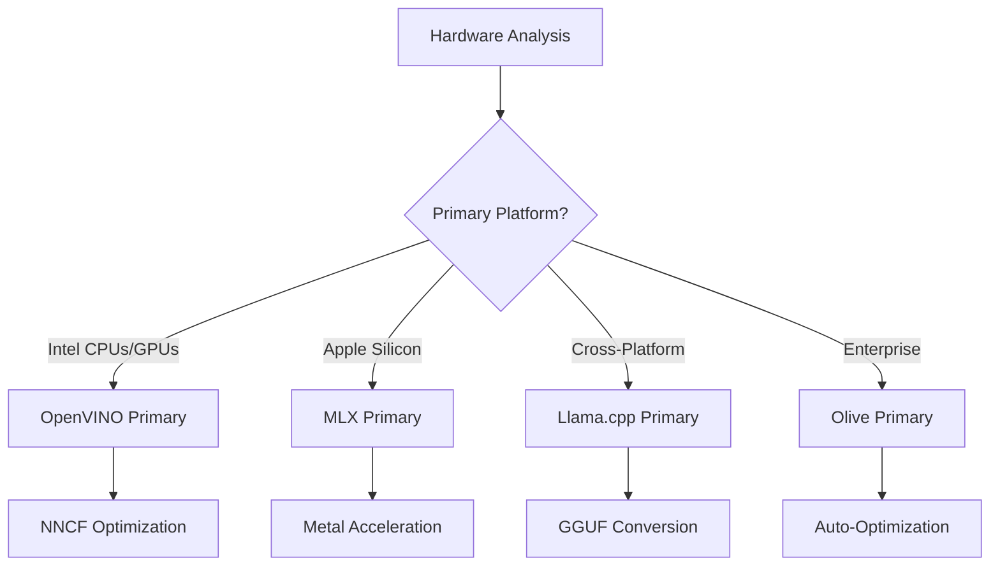
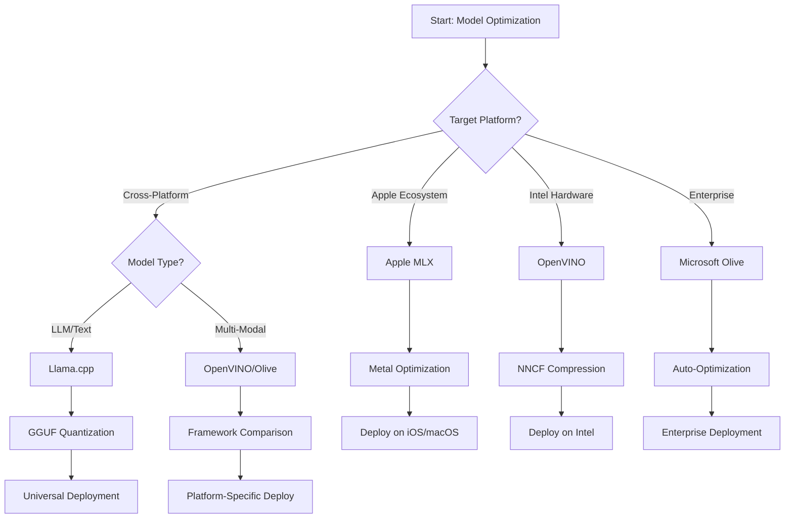
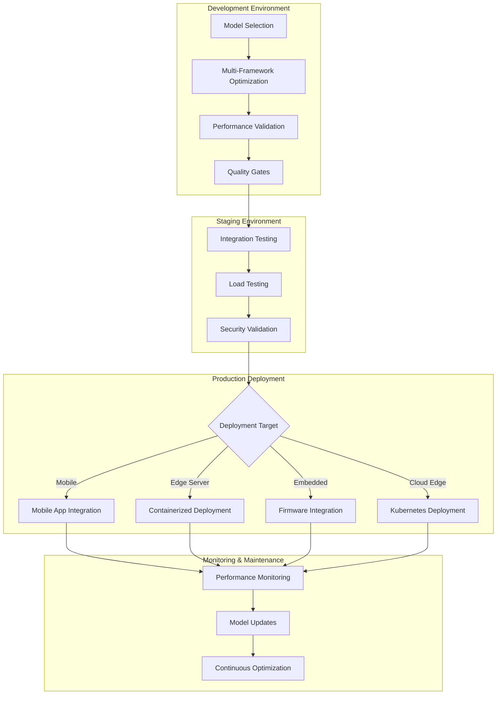

<!--
CO_OP_TRANSLATOR_METADATA:
{
  "original_hash": "6719c4a7e44b948230ac5f5cab3699bd",
  "translation_date": "2025-09-18T12:48:56+00:00",
  "source_file": "Module04/06.workflow-synthesis.md",
  "language_code": "vi"
}
-->
# Phần 6: Tổng hợp Quy trình Phát triển Edge AI

## Mục lục
1. [Giới thiệu](../../../Module04)
2. [Mục tiêu học tập](../../../Module04)
3. [Tổng quan Quy trình Thống nhất](../../../Module04)
4. [Ma trận Lựa chọn Khung làm việc](../../../Module04)
5. [Tổng hợp Các Thực hành Tốt nhất](../../../Module04)
6. [Hướng dẫn Chiến lược Triển khai](../../../Module04)
7. [Quy trình Tối ưu hóa Hiệu suất](../../../Module04)
8. [Danh sách Kiểm tra Sẵn sàng Sản xuất](../../../Module04)
9. [Khắc phục sự cố và Giám sát](../../../Module04)
10. [Đảm bảo Tương lai cho Quy trình Edge AI của bạn](../../../Module04)

## Giới thiệu

Phát triển Edge AI đòi hỏi sự hiểu biết sâu sắc về nhiều khung tối ưu hóa, chiến lược triển khai và các yếu tố phần cứng. Tổng hợp toàn diện này kết hợp kiến thức từ Llama.cpp, Microsoft Olive, OpenVINO và Apple MLX để tạo ra một quy trình thống nhất nhằm tối đa hóa hiệu quả, duy trì chất lượng và đảm bảo triển khai thành công trong sản xuất.

Trong suốt khóa học này, chúng ta đã khám phá từng khung tối ưu hóa riêng lẻ, mỗi khung có những điểm mạnh và trường hợp sử dụng chuyên biệt. Tuy nhiên, các dự án Edge AI thực tế thường yêu cầu kết hợp các kỹ thuật từ nhiều khung hoặc đưa ra quyết định chiến lược về cách tiếp cận nào sẽ mang lại kết quả tốt nhất cho các ràng buộc và yêu cầu cụ thể.

Phần này tổng hợp trí tuệ tập thể từ tất cả các khung thành các quy trình hành động, cây quyết định và các thực hành tốt nhất, giúp bạn xây dựng các giải pháp Edge AI sẵn sàng sản xuất một cách hiệu quả và hiệu quả. Cho dù bạn đang tối ưu hóa cho thiết bị di động, hệ thống nhúng hay máy chủ biên, hướng dẫn này cung cấp khung chiến lược để đưa ra các quyết định sáng suốt trong suốt vòng đời phát triển của bạn.

## Mục tiêu học tập

Đến cuối phần này, bạn sẽ có thể:

### Ra quyết định chiến lược
- **Đánh giá và lựa chọn** khung tối ưu hóa tối ưu dựa trên yêu cầu dự án, ràng buộc phần cứng và kịch bản triển khai
- **Thiết kế quy trình toàn diện** tích hợp nhiều kỹ thuật tối ưu hóa để đạt hiệu quả tối đa
- **Đánh giá các đánh đổi** giữa độ chính xác của mô hình, tốc độ suy luận, sử dụng bộ nhớ và độ phức tạp triển khai trên các khung khác nhau

### Tích hợp quy trình làm việc
- **Triển khai các quy trình phát triển thống nhất** tận dụng điểm mạnh của nhiều khung tối ưu hóa
- **Tạo quy trình làm việc có thể tái tạo** để tối ưu hóa và triển khai mô hình nhất quán trên các môi trường khác nhau
- **Thiết lập các cổng chất lượng** và quy trình xác thực để đảm bảo các mô hình tối ưu hóa đáp ứng yêu cầu sản xuất

### Tối ưu hóa hiệu suất
- **Áp dụng các chiến lược tối ưu hóa có hệ thống** bằng cách sử dụng lượng hóa, cắt tỉa và các kỹ thuật tăng tốc phần cứng cụ thể
- **Giám sát và đánh giá** hiệu suất mô hình trên các cấp độ tối ưu hóa và mục tiêu triển khai khác nhau
- **Tối ưu hóa cho các nền tảng phần cứng cụ thể** bao gồm CPU, GPU, NPU và các bộ tăng tốc biên chuyên dụng

### Triển khai sản xuất
- **Thiết kế kiến trúc triển khai có thể mở rộng** phù hợp với nhiều định dạng mô hình và công cụ suy luận
- **Triển khai giám sát và khả năng quan sát** cho các ứng dụng Edge AI trong môi trường sản xuất
- **Thiết lập quy trình bảo trì** để cập nhật mô hình, giám sát hiệu suất và tối ưu hóa hệ thống

### Xuất sắc trên nhiều nền tảng
- **Triển khai các mô hình tối ưu hóa** trên các nền tảng phần cứng đa dạng trong khi duy trì hiệu suất nhất quán
- **Xử lý các tối ưu hóa cụ thể cho nền tảng** trên Windows, macOS, Linux, thiết bị di động và hệ thống nhúng
- **Tạo các lớp trừu tượng** cho phép triển khai liền mạch trên các môi trường biên khác nhau

## Tổng quan Quy trình Thống nhất

### Giai đoạn 1: Phân tích Yêu cầu và Lựa chọn Khung làm việc

Nền tảng của việc triển khai Edge AI thành công bắt đầu bằng phân tích yêu cầu kỹ lưỡng, cung cấp thông tin cho việc lựa chọn khung và chiến lược tối ưu hóa.

#### 1.1 Đánh giá Phần cứng


**Các yếu tố chính cần xem xét:**
- **Kiến trúc CPU**: x86, ARM, khả năng của Apple Silicon
- **Khả năng tăng tốc**: GPU, NPU, VPU, chip AI chuyên dụng
- **Ràng buộc bộ nhớ**: Giới hạn RAM, dung lượng lưu trữ
- **Ngân sách năng lượng**: Tuổi thọ pin, ràng buộc nhiệt
- **Kết nối**: Yêu cầu ngoại tuyến, giới hạn băng thông

#### 1.2 Ma trận Yêu cầu Ứng dụng

| Yêu cầu | Llama.cpp | Microsoft Olive | OpenVINO | Apple MLX |
|---------|-----------|-----------------|----------|-----------|
| Đa nền tảng | ✅ Xuất sắc | ⚡ Tốt | ⚡ Tốt | ❌ Chỉ Apple |
| Tích hợp doanh nghiệp | ⚡ Cơ bản | ✅ Xuất sắc | ✅ Xuất sắc | ⚡ Hạn chế |
| Triển khai di động | ✅ Xuất sắc | ⚡ Tốt | ⚡ Tốt | ✅ iOS Xuất sắc |
| Suy luận thời gian thực | ✅ Xuất sắc | ✅ Xuất sắc | ✅ Xuất sắc | ✅ Xuất sắc |
| Đa dạng mô hình | ✅ Tập trung LLM | ✅ Tất cả mô hình | ✅ Tất cả mô hình | ✅ Tập trung LLM |
| Dễ sử dụng | ✅ Đơn giản | ✅ Tự động hóa | ⚡ Trung bình | ✅ Đơn giản |

### Giai đoạn 2: Chuẩn bị và Tối ưu hóa Mô hình

#### 2.1 Quy trình Đánh giá Mô hình Toàn cầu

```python
# Universal Model Assessment Framework
class EdgeAIModelAssessment:
    def __init__(self, model_path, target_hardware):
        self.model_path = model_path
        self.target_hardware = target_hardware
        self.optimization_frameworks = []
        
    def assess_model_characteristics(self):
        """Analyze model size, architecture, and complexity"""
        return {
            'model_size': self.get_model_size(),
            'parameter_count': self.get_parameter_count(),
            'architecture_type': self.detect_architecture(),
            'quantization_compatibility': self.check_quantization_support()
        }
    
    def recommend_optimization_strategy(self):
        """Recommend optimal frameworks and techniques"""
        characteristics = self.assess_model_characteristics()
        
        if self.target_hardware.startswith('apple'):
            return self.mlx_optimization_strategy(characteristics)
        elif self.target_hardware.startswith('intel'):
            return self.openvino_optimization_strategy(characteristics)
        elif characteristics['model_size'] > 7_000_000_000:  # 7B+ parameters
            return self.enterprise_optimization_strategy(characteristics)
        else:
            return self.lightweight_optimization_strategy(characteristics)
```

#### 2.2 Quy trình Tối ưu hóa Đa Khung

**Cách tiếp cận tối ưu hóa tuần tự:**
1. **Chuyển đổi ban đầu**: Chuyển đổi sang định dạng trung gian (ONNX nếu có thể)
2. **Tối ưu hóa theo khung cụ thể**: Áp dụng các kỹ thuật chuyên biệt
3. **Xác thực chéo**: Xác minh hiệu suất trên các nền tảng mục tiêu
4. **Đóng gói cuối cùng**: Chuẩn bị cho triển khai

```bash
# Multi-Framework Optimization Script
#!/bin/bash

MODEL_NAME="phi-3-mini"
BASE_MODEL="microsoft/Phi-3-mini-4k-instruct"

# Phase 1: ONNX Conversion (Universal)
python convert_to_onnx.py --model $BASE_MODEL --output models/onnx/

# Phase 2: Platform-Specific Optimization
if [[ "$TARGET_PLATFORM" == "intel" ]]; then
    # OpenVINO Optimization
    python optimize_openvino.py --input models/onnx/ --output models/openvino/
elif [[ "$TARGET_PLATFORM" == "apple" ]]; then
    # MLX Optimization
    python optimize_mlx.py --input $BASE_MODEL --output models/mlx/
elif [[ "$TARGET_PLATFORM" == "cross" ]]; then
    # Llama.cpp Optimization
    python convert_to_gguf.py --input models/onnx/ --output models/gguf/
fi

# Phase 3: Validation
python validate_optimization.py --original $BASE_MODEL --optimized models/$TARGET_PLATFORM/
```

### Giai đoạn 3: Xác thực Hiệu suất và Đánh giá

#### 3.1 Khung Đánh giá Toàn diện

```python
class EdgeAIBenchmark:
    def __init__(self, optimized_models):
        self.models = optimized_models
        self.metrics = {
            'inference_time': [],
            'memory_usage': [],
            'accuracy_score': [],
            'throughput': [],
            'energy_consumption': []
        }
    
    def run_comprehensive_benchmark(self):
        """Execute standardized benchmarks across all optimized models"""
        test_inputs = self.generate_test_inputs()
        
        for model_framework, model_path in self.models.items():
            print(f"Benchmarking {model_framework}...")
            
            # Latency Testing
            latency = self.measure_inference_latency(model_path, test_inputs)
            
            # Memory Profiling
            memory = self.profile_memory_usage(model_path)
            
            # Accuracy Validation
            accuracy = self.validate_model_accuracy(model_path, test_inputs)
            
            # Throughput Analysis
            throughput = self.measure_throughput(model_path)
            
            self.record_metrics(model_framework, latency, memory, accuracy, throughput)
    
    def generate_optimization_report(self):
        """Create comprehensive comparison report"""
        report = {
            'recommendations': self.analyze_performance_trade_offs(),
            'deployment_guidance': self.generate_deployment_recommendations(),
            'monitoring_requirements': self.define_monitoring_metrics()
        }
        return report
```

## Ma trận Lựa chọn Khung làm việc

### Cây Quyết định cho Lựa chọn Khung



### Tiêu chí Lựa chọn Toàn diện

#### 1. Phù hợp với Trường hợp Sử dụng Chính

**Mô hình Ngôn ngữ Lớn (LLMs):**
- **Llama.cpp**: Tốt nhất cho triển khai tập trung vào CPU, đa nền tảng
- **Apple MLX**: Tối ưu cho Apple Silicon với bộ nhớ hợp nhất
- **OpenVINO**: Xuất sắc cho phần cứng Intel với tối ưu hóa NNCF
- **Microsoft Olive**: Lý tưởng cho quy trình doanh nghiệp với tự động hóa

**Mô hình Đa phương thức:**
- **OpenVINO**: Hỗ trợ toàn diện cho hình ảnh, âm thanh và văn bản
- **Microsoft Olive**: Tối ưu hóa cấp doanh nghiệp cho các quy trình phức tạp
- **Llama.cpp**: Giới hạn ở các mô hình dựa trên văn bản
- **Apple MLX**: Hỗ trợ ngày càng tăng cho các ứng dụng đa phương thức

#### 2. Ma trận Nền tảng Phần cứng

| Nền tảng | Khung chính | Tùy chọn thứ cấp | Tính năng chuyên biệt |
|----------|-------------|------------------|-----------------------|
| Intel CPU/GPU | OpenVINO | Microsoft Olive | Nén NNCF, tối ưu hóa Intel |
| NVIDIA GPU | Microsoft Olive | OpenVINO | Tăng tốc CUDA, tính năng doanh nghiệp |
| Apple Silicon | Apple MLX | Llama.cpp | Metal shaders, bộ nhớ hợp nhất |
| ARM Mobile | Llama.cpp | OpenVINO | Đa nền tảng, phụ thuộc tối thiểu |
| Edge TPU | OpenVINO | Microsoft Olive | Hỗ trợ bộ tăng tốc chuyên dụng |
| ARM Nhúng | Llama.cpp | OpenVINO | Dấu chân tối thiểu, suy luận hiệu quả |

#### 3. Sở thích Quy trình Phát triển

**Nguyên mẫu nhanh:**
1. **Llama.cpp**: Thiết lập nhanh nhất, kết quả ngay lập tức
2. **Apple MLX**: API Python đơn giản, lặp lại nhanh chóng
3. **Microsoft Olive**: Tối ưu hóa tự động, cấu hình tối thiểu
4. **OpenVINO**: Thiết lập phức tạp hơn, tính năng toàn diện

**Sản xuất doanh nghiệp:**
1. **Microsoft Olive**: Tính năng doanh nghiệp, tích hợp Azure
2. **OpenVINO**: Hệ sinh thái Intel, công cụ toàn diện
3. **Apple MLX**: Ứng dụng doanh nghiệp cụ thể của Apple
4. **Llama.cpp**: Triển khai đơn giản, tính năng doanh nghiệp hạn chế

## Tổng hợp Các Thực hành Tốt nhất

### Nguyên tắc Tối ưu hóa Toàn cầu

#### 1. Chiến lược Tối ưu hóa Tiến bộ

```python
class ProgressiveOptimization:
    def __init__(self, base_model):
        self.base_model = base_model
        self.optimization_stages = [
            'baseline_measurement',
            'format_conversion',
            'quantization_optimization',
            'hardware_acceleration',
            'production_validation'
        ]
    
    def execute_progressive_optimization(self):
        """Apply optimization techniques incrementally"""
        
        # Stage 1: Baseline Measurement
        baseline_metrics = self.measure_baseline_performance()
        
        # Stage 2: Format Conversion
        converted_model = self.convert_to_optimal_format()
        conversion_metrics = self.measure_performance(converted_model)
        
        # Stage 3: Quantization
        quantized_model = self.apply_quantization(converted_model)
        quantization_metrics = self.measure_performance(quantized_model)
        
        # Stage 4: Hardware Acceleration
        accelerated_model = self.enable_hardware_acceleration(quantized_model)
        acceleration_metrics = self.measure_performance(accelerated_model)
        
        # Stage 5: Validation
        production_ready = self.validate_for_production(accelerated_model)
        
        return self.compile_optimization_report(
            baseline_metrics, conversion_metrics, 
            quantization_metrics, acceleration_metrics
        )
```

#### 2. Triển khai Cổng Chất lượng

**Cổng Bảo toàn Độ chính xác:**
- Duy trì >95% độ chính xác của mô hình gốc
- Xác thực với các tập dữ liệu kiểm tra đại diện
- Triển khai thử nghiệm A/B để xác thực sản xuất

**Cổng Cải thiện Hiệu suất:**
- Đạt được cải thiện tốc độ tối thiểu 2 lần
- Giảm dấu chân bộ nhớ ít nhất 50%
- Xác thực tính nhất quán thời gian suy luận

**Cổng Sẵn sàng Sản xuất:**
- Vượt qua kiểm tra căng thẳng dưới tải
- Chứng minh hiệu suất ổn định theo thời gian
- Xác thực các yêu cầu về bảo mật và quyền riêng tư

### Tích hợp Thực hành Tốt nhất Theo Khung

#### 1. Tổng hợp Chiến lược Lượng hóa

```python
# Unified Quantization Approach
class UnifiedQuantizationStrategy:
    def __init__(self, model, target_platform):
        self.model = model
        self.platform = target_platform
        
    def select_optimal_quantization(self):
        """Choose best quantization based on platform and requirements"""
        
        if self.platform == 'apple_silicon':
            return self.mlx_quantization_strategy()
        elif self.platform == 'intel_hardware':
            return self.openvino_quantization_strategy()
        elif self.platform == 'cross_platform':
            return self.llamacpp_quantization_strategy()
        else:
            return self.olive_quantization_strategy()
    
    def mlx_quantization_strategy(self):
        """Apple MLX-specific quantization"""
        return {
            'method': 'mlx_quantize',
            'precision': 'int4',
            'group_size': 64,
            'optimization_target': 'unified_memory'
        }
    
    def openvino_quantization_strategy(self):
        """OpenVINO NNCF quantization"""
        return {
            'method': 'nncf_quantize',
            'precision': 'int8',
            'calibration_method': 'post_training',
            'optimization_target': 'intel_hardware'
        }
```

#### 2. Tối ưu hóa Tăng tốc Phần cứng

**Tổng hợp Tối ưu hóa CPU:**
- **Hướng dẫn SIMD**: Tận dụng các lõi tối ưu hóa trên các khung
- **Băng thông bộ nhớ**: Tối ưu hóa bố cục dữ liệu để đạt hiệu quả bộ nhớ đệm
- **Luồng**: Cân bằng song song hóa với các ràng buộc tài nguyên

**Thực hành Tốt nhất Tăng tốc GPU:**
- **Xử lý theo lô**: Tối đa hóa thông lượng với kích thước lô phù hợp
- **Quản lý bộ nhớ**: Tối ưu hóa phân bổ và truyền bộ nhớ GPU
- **Độ chính xác**: Sử dụng FP16 khi được hỗ trợ để có hiệu suất tốt hơn

**Tối ưu hóa Bộ tăng tốc NPU/Chuyên dụng:**
- **Kiến trúc Mô hình**: Đảm bảo tương thích với khả năng của bộ tăng tốc
- **Luồng Dữ liệu**: Tối ưu hóa các đường dẫn đầu vào/đầu ra để đạt hiệu quả của bộ tăng tốc
- **Chiến lược Dự phòng**: Triển khai dự phòng CPU cho các thao tác không được hỗ trợ

## Hướng dẫn Chiến lược Triển khai

### Kiến trúc Triển khai Toàn cầu



### Mẫu Triển khai Cụ thể cho Nền tảng

#### 1. Chiến lược Triển khai Di động

```yaml
# Mobile Deployment Configuration
mobile_deployment:
  ios:
    framework: apple_mlx
    optimization:
      quantization: int4
      memory_mapping: true
      background_execution: limited
    packaging:
      format: mlx
      bundle_size: <50MB
      
  android:
    framework: llama_cpp
    optimization:
      quantization: q4_k_m
      threading: android_optimized
      memory_management: conservative
    packaging:
      format: gguf
      apk_size: <100MB
      
  cross_platform:
    framework: onnx_runtime
    optimization:
      quantization: int8
      execution_provider: cpu
    packaging:
      format: onnx
      shared_libraries: minimal
```

#### 2. Triển khai Máy chủ Biên

```yaml
# Edge Server Deployment Configuration
edge_server:
  intel_based:
    framework: openvino
    optimization:
      quantization: int8
      acceleration: cpu_gpu_auto
      batch_processing: dynamic
    deployment:
      container: openvino_runtime
      orchestration: kubernetes
      scaling: horizontal
      
  nvidia_based:
    framework: microsoft_olive
    optimization:
      quantization: int4
      acceleration: cuda
      tensor_parallelism: true
    deployment:
      container: nvidia_triton
      orchestration: kubernetes
      scaling: gpu_aware
```

### Thực hành Tốt nhất về Container hóa

```dockerfile
# Multi-Framework Edge AI Container
FROM ubuntu:22.04 as base

# Install common dependencies
RUN apt-get update && apt-get install -y \
    python3 \
    python3-pip \
    build-essential \
    cmake \
    && rm -rf /var/lib/apt/lists/*

# Framework-specific stages
FROM base as openvino
RUN pip install openvino nncf optimum[intel]

FROM base as llamacpp
RUN git clone https://github.com/ggerganov/llama.cpp.git \
    && cd llama.cpp && make LLAMA_OPENBLAS=1

FROM base as olive
RUN pip install olive-ai[auto-opt] onnxruntime-genai

# Production stage with selected framework
FROM openvino as production
COPY models/ /app/models/
COPY src/ /app/src/
WORKDIR /app

EXPOSE 8080
CMD ["python3", "src/inference_server.py"]
```

## Quy trình Tối ưu hóa Hiệu suất

### Điều chỉnh Hiệu suất Có hệ thống

#### 1. Quy trình Đánh giá Hiệu suất

```python
class EdgeAIPerformanceProfiler:
    def __init__(self, model_path, framework):
        self.model_path = model_path
        self.framework = framework
        self.profiling_results = {}
    
    def comprehensive_profiling(self):
        """Execute comprehensive performance analysis"""
        
        # CPU Profiling
        cpu_profile = self.profile_cpu_usage()
        
        # Memory Profiling
        memory_profile = self.profile_memory_usage()
        
        # Inference Latency
        latency_profile = self.profile_inference_latency()
        
        # Throughput Analysis
        throughput_profile = self.profile_throughput()
        
        # Energy Consumption (where available)
        energy_profile = self.profile_energy_consumption()
        
        return self.compile_performance_report(
            cpu_profile, memory_profile, latency_profile,
            throughput_profile, energy_profile
        )
    
    def identify_bottlenecks(self):
        """Automatically identify performance bottlenecks"""
        bottlenecks = []
        
        if self.profiling_results['cpu_utilization'] > 80:
            bottlenecks.append('cpu_bound')
        
        if self.profiling_results['memory_usage'] > 90:
            bottlenecks.append('memory_bound')
        
        if self.profiling_results['inference_variance'] > 20:
            bottlenecks.append('inconsistent_performance')
        
        return self.generate_optimization_recommendations(bottlenecks)
```

#### 2. Quy trình Tối ưu hóa Tự động

```python
class AutomatedOptimizationPipeline:
    def __init__(self, base_model, target_constraints):
        self.base_model = base_model
        self.constraints = target_constraints
        self.optimization_history = []
    
    def execute_optimization_search(self):
        """Systematically search optimization space"""
        
        optimization_candidates = [
            {'quantization': 'int8', 'pruning': 0.1},
            {'quantization': 'int4', 'pruning': 0.2},
            {'quantization': 'int8', 'acceleration': 'gpu'},
            {'quantization': 'int4', 'acceleration': 'npu'}
        ]
        
        best_configuration = None
        best_score = 0
        
        for config in optimization_candidates:
            optimized_model = self.apply_optimization(config)
            score = self.evaluate_optimization(optimized_model)
            
            if score > best_score and self.meets_constraints(optimized_model):
                best_score = score
                best_configuration = config
            
            self.optimization_history.append({
                'config': config,
                'score': score,
                'model': optimized_model
            })
        
        return best_configuration, self.optimization_history
```

### Tối ưu hóa Đa mục tiêu

#### 1. Tối ưu hóa Pareto cho Edge AI

```python
class ParetoOptimization:
    def __init__(self, objectives=['speed', 'accuracy', 'memory']):
        self.objectives = objectives
        self.pareto_frontier = []
    
    def find_pareto_optimal_solutions(self, optimization_results):
        """Identify Pareto-optimal configurations"""
        
        for result in optimization_results:
            is_dominated = False
            
            for frontier_point in self.pareto_frontier:
                if self.dominates(frontier_point, result):
                    is_dominated = True
                    break
            
            if not is_dominated:
                # Remove dominated points from frontier
                self.pareto_frontier = [
                    point for point in self.pareto_frontier 
                    if not self.dominates(result, point)
                ]
                
                self.pareto_frontier.append(result)
        
        return self.pareto_frontier
    
    def recommend_configuration(self, user_preferences):
        """Recommend configuration based on user preferences"""
        
        weighted_scores = []
        for config in self.pareto_frontier:
            score = sum(
                user_preferences[obj] * config['metrics'][obj] 
                for obj in self.objectives
            )
            weighted_scores.append((score, config))
        
        return max(weighted_scores, key=lambda x: x[0])[1]
```

## Danh sách Kiểm tra Sẵn sàng Sản xuất

### Xác thực Sản xuất Toàn diện

#### 1. Đảm bảo Chất lượng Mô hình

```python
class ProductionReadinessValidator:
    def __init__(self, optimized_model, production_requirements):
        self.model = optimized_model
        self.requirements = production_requirements
        self.validation_results = {}
    
    def validate_model_quality(self):
        """Comprehensive model quality validation"""
        
        # Accuracy Validation
        accuracy_result = self.validate_accuracy()
        
        # Performance Validation
        performance_result = self.validate_performance()
        
        # Robustness Testing
        robustness_result = self.validate_robustness()
        
        # Security Assessment
        security_result = self.validate_security()
        
        # Compliance Verification
        compliance_result = self.validate_compliance()
        
        return self.compile_validation_report(
            accuracy_result, performance_result, robustness_result,
            security_result, compliance_result
        )
    
    def generate_certification_report(self):
        """Generate production certification report"""
        return {
            'model_signature': self.generate_model_signature(),
            'validation_timestamp': datetime.now(),
            'validation_results': self.validation_results,
            'deployment_approval': self.check_deployment_approval(),
            'monitoring_requirements': self.define_monitoring_requirements()
        }
```

#### 2. Danh sách Kiểm tra Triển khai Sản xuất

**Xác thực Trước Triển khai:**
- [ ] Độ chính xác của mô hình đáp ứng yêu cầu tối thiểu (>95% so với cơ sở)
- [ ] Các mục tiêu hiệu suất đạt được (độ trễ, thông lượng, bộ nhớ)
- [ ] Các lỗ hổng bảo mật được đánh giá và giảm thiểu
- [ ] Kiểm tra căng thẳng hoàn tất dưới tải dự kiến
- [ ] Các kịch bản lỗi được kiểm tra và quy trình khôi phục được xác thực
- [ ] Hệ thống giám sát và cảnh báo được cấu hình
- [ ] Quy trình hoàn tác được kiểm tra và ghi lại

**Quy trình Triển khai:**
- [ ] Chiến lược triển khai xanh-xanh được thực hiện
- [ ] Cấu hình tăng dần lưu lượng truy cập
- [ ] Bảng điều khiển giám sát thời gian thực hoạt động
- [ ] Các đường cơ sở hiệu suất được thiết lập
- [ ] Ngưỡng tỷ lệ lỗi được xác định
- [ ] Kích hoạt hoàn tác tự động được cấu hình

**Giám sát Sau Triển khai:**
- [ ] Phát hiện trôi mô hình hoạt động
- [ ] Cảnh báo suy giảm hiệu suất được cấu hình
- [ ] Giám sát sử dụng tài nguyên được bật
- [ ] Các chỉ số trải nghiệm người dùng được theo dõi
- [ ] Phiên bản và nguồn gốc mô hình được duy trì
- [ ] Các đánh giá hiệu suất mô hình định kỳ được lên lịch

### Tích hợp/Triển khai Liên tục (CI/CD)

```yaml
# Edge AI CI/CD Pipeline Configuration
edge_ai_pipeline:
  stages:
    - model_validation
    - optimization
    - testing
    - staging_deployment
    - production_deployment
    - monitoring
  
  model_validation:
    accuracy_threshold: 0.95
    performance_baseline: required
    security_scan: enabled
    
  optimization:
    frameworks:
      - llama_cpp
      - openvino
      - microsoft_olive
    validation:
      cross_validation: enabled
      performance_comparison: required
      
  testing:
    unit_tests: comprehensive
    integration_tests: full_pipeline
    load_tests: production_scale
    security_tests: comprehensive
    
  deployment:
    strategy: blue_green
    traffic_ramping: gradual
    rollback: automatic
    monitoring: real_time
```

## Khắc phục sự cố và Giám sát

### Khung Khắc phục sự cố Toàn cầu

#### 1. Các vấn đề phổ biến và Giải pháp

**Vấn đề Hiệu suất:**
```python
class PerformanceTroubleshooter:
    def __init__(self, model_metrics):
        self.metrics = model_metrics
        
    def diagnose_performance_issues(self):
        """Systematic performance issue diagnosis"""
        
        issues = []
        
        # High latency diagnosis
        if self.metrics['avg_latency'] > self.metrics['target_latency']:
            issues.append(self.diagnose_latency_issues())
        
        # Memory usage diagnosis
        if self.metrics['memory_usage'] > self.metrics['memory_limit']:
            issues.append(self.diagnose_memory_issues())
        
        # Throughput diagnosis
        if self.metrics['throughput'] < self.metrics['target_throughput']:
            issues.append(self.diagnose_throughput_issues())
        
        return self.generate_resolution_plan(issues)
    
    def diagnose_latency_issues(self):
        """Specific latency troubleshooting"""
        potential_causes = []
        
        if self.metrics['cpu_utilization'] > 80:
            potential_causes.append('cpu_bottleneck')
        
        if self.metrics['memory_bandwidth'] > 90:
            potential_causes.append('memory_bandwidth_limit')
        
        if self.metrics['model_size'] > self.metrics['optimal_size']:
            potential_causes.append('model_too_large')
        
        return {
            'issue': 'high_latency',
            'causes': potential_causes,
            'solutions': self.generate_latency_solutions(potential_causes)
        }
```

**Khắc phục sự cố Cụ thể theo Khung:**

| Vấn đề | Llama.cpp | Microsoft Olive | OpenVINO | Apple MLX |
|-------|-----------|-----------------|----------|-----------|
| Vấn đề bộ nhớ | Giảm độ dài ngữ cảnh | Giảm kích thước lô | Bật bộ nhớ đệm | Sử dụng ánh xạ bộ nhớ |
| Suy luận chậm | Bật SIMD | Kiểm tra lượng hóa | Tối ưu hóa luồng | Bật Metal |
| Mất độ chính xác | Lượng hóa cao hơn | Huấn luyện lại với QAT | Tăng hiệu chuẩn | Tinh chỉnh sau lượng hóa |
| Tương thích | Kiểm tra định dạng mô hình | Xác minh phiên bản khung | Cập nhật trình điều khiển | Kiểm tra phiên bản macOS |

#### 2. Chiến lược Giám sát Sản xuất

```python
class EdgeAIMonitoring:
    def __init__(self, deployment_config):
        self.config = deployment_config
        self.metrics_collectors = []
        self.alerting_rules = []
    
    def setup_comprehensive_monitoring(self):
        """Configure comprehensive monitoring for Edge AI deployment"""
        
        # Model Performance Monitoring
        self.setup_model_performance_monitoring()
        
        # Infrastructure Monitoring
        self.setup_infrastructure_monitoring()
        
        # Business Metrics Monitoring
        self.setup_business_metrics_monitoring()
        
        # Security Monitoring
        self.setup_security_monitoring()
    
    def setup_model_performance_monitoring(self):
        """Model-specific performance monitoring"""
        metrics = [
            'inference_latency_p50',
            'inference_latency_p95',
            'inference_latency_p99',
            'model_accuracy_drift',
            'prediction_confidence_distribution',
            'error_rate',
            'throughput_requests_per_second'
        ]
        
        for metric in metrics:
            self.add_metric_collector(metric)
            self.add_alerting_rule(metric)
    
    def detect_model_drift(self):
        """Automated model drift detection"""
        drift_indicators = [
            self.statistical_drift_detection(),
            self.performance_drift_detection(),
            self.data_distribution_shift_detection()
        ]
        
        return self.aggregate_drift_signals(drift_indicators)
```

### Giải quyết Vấn đề Tự động

```python
class AutomatedIssueResolution:
    def __init__(self, monitoring_system):
        self.monitoring = monitoring_system
        self.resolution_strategies = {}
    
    def handle_performance_degradation(self, alert):
        """Automated performance issue resolution"""
        
        if alert['type'] == 'high_latency':
            return self.resolve_latency_issue(alert)
        elif alert['type'] == 'high_memory_usage':
            return self.resolve_memory_issue(alert)
        elif alert['type'] == 'accuracy_drift':
            return self.resolve_accuracy_issue(alert)
        
    def resolve_latency_issue(self, alert):
        """Automated latency issue resolution"""
        resolution_steps = [
            'increase_cpu_allocation',
            'enable_model_caching',
            'reduce_batch_size',
            'switch_to_quantized_model'
        ]
        
        for step in resolution_steps:
            if self.apply_resolution_step(step):
                return f"Resolved latency issue with: {step}"
        
        return "Escalating to human operator"
```

## Đảm bảo Tương lai cho Quy trình Edge AI của bạn

### Tích hợp Công nghệ Mới nổi

#### 1. Hỗ trợ Phần cứng Thế hệ Tiếp theo

```python
class FutureHardwareIntegration:
    def __init__(self):
        self.supported_accelerators = [
            'npu_next_gen',
            'quantum_processors',
            'neuromorphic_chips',
            'optical_processors'
        ]
    
    def design_adaptive_pipeline(self):
        """Create hardware-agnostic optimization pipeline"""
        
        pipeline = {
            'model_preparation': self.universal_model_preparation(),
            'hardware_detection': self.dynamic_hardware_detection(),
            'optimization_selection': self.adaptive_optimization_selection(),
            'performance_validation': self.hardware_agnostic_validation()
        }
        
        return pipeline
    
    def adaptive_optimization_selection(self):
        """Dynamically select optimization based on available hardware"""
        
        def optimize_for_hardware(model, available_hardware):
            if 'npu' in available_hardware:
                return self.npu_optimization(model)
            elif 'quantum' in available_hardware:
                return self.quantum_optimization(model)
            elif 'neuromorphic' in available_hardware:
                return self.neuromorphic_optimization(model)
            else:
                return self.fallback_optimization(model)
        
        return optimize_for_hardware
```

#### 2. Tiến hóa Kiến trúc Mô hình

**Hỗ trợ cho Kiến trúc Mới nổi:**
- **Mixture of Experts (MoE)**: Kiến trúc mô hình thưa thớt để đạt hiệu quả
- **Retrieval-Augmented Generation**: Hệ thống mô hình lai + cơ sở tri thức
- **Mô hình Đa phương thức**: Tích hợp Hình ảnh + Ngôn ngữ + Âm thanh
- **Học Liên kết**: Huấn luyện và tối ưu hóa phân tán

```python
class NextGenModelSupport:
    def __init__(self):
        self.architecture_handlers = {
            'moe': self.handle_mixture_of_experts,
            'rag': self.handle_retrieval_augmented,
            'multimodal': self.handle_multimodal,
            'federated': self.handle_federated_learning
        }
    
    def handle_mixture_of_experts(self, model):
        """Optimize Mixture of Experts models for edge deployment"""
        optimization_strategy = {
            'expert_pruning': True,
            'routing_optimization': True,
            'expert_quantization': 'per_expert',
            'load_balancing': 'dynamic'
        }
        return self.apply_moe_optimization(model, optimization_strategy)
```

### Học tập và Thích nghi Liên tục

#### 1. Tích hợp Học trực tuyến

```python
class EdgeOnlineLearning:
    def __init__(self, base_model, learning_rate=0.001):
        self.base_model = base_model
        self.learning_rate = learning_rate
        self.adaptation_buffer = []
    
    def continuous_adaptation(self, new_data, feedback):
        """Continuously adapt model based on edge data"""
        
        # Privacy-preserving local adaptation
        local_updates = self.compute_local_gradients(new_data, feedback)
        
        # Apply updates with constraints
        adapted_model = self.apply_constrained_updates(
            self.base_model, local_updates
        )
        
        # Validate adaptation quality
        if self.validate_adaptation(adapted_model):
            self.base_model = adapted_model
            return True
        
        return False
    
    def federated_learning_participation(self):
        """Participate in federated learning while preserving privacy"""
        
        # Compute local model updates
        local_updates = self.compute_private_updates()
        
        # Differential privacy protection
        private_updates = self.apply_differential_privacy(local_updates)
        
        # Share with federated learning coordinator
        return self.share_updates(private_updates)
```

#### 2. Tính bền vững và AI Xanh

```python
class GreenEdgeAI:
    def __init__(self, sustainability_targets):
        self.targets = sustainability_targets
        self.energy_monitor = EnergyMonitor()
    
    def optimize_for_sustainability(self, model):
        """Optimize model for minimal environmental impact"""
        
        optimization_objectives = [
            'minimize_energy_consumption',
            'maximize_hardware_utilization',
            'reduce_model_training_cost',
            'extend_device_lifetime'
        ]
        
        return self.multi_objective_green_optimization(
            model, optimization_objectives
        )
    
    def carbon_aware_deployment(self):
        """Deploy models considering carbon footprint"""
        
        deployment_strategy = {
            'prefer_renewable_energy_regions': True,
            'optimize_for_energy_efficiency': True,
            'minimize_data_transfer': True,
            'lifecycle_carbon_accounting': True
        }
        
        return deployment_strategy
```

## Kết luận

Tổng hợp quy trình toàn diện này đại diện cho sự kết tinh của kiến thức tối ưu hóa Edge AI, kết hợp các thực hành tốt nhất từ tất cả các khung tối
Hãy nhớ rằng chiến lược tối ưu hóa tốt nhất là chiến lược đáp ứng các yêu cầu cụ thể của bạn trong khi vẫn duy trì sự linh hoạt để thích nghi khi các yêu cầu đó thay đổi. Sử dụng hướng dẫn này như một khung để đưa ra các quyết định sáng suốt, nhưng luôn xác nhận lựa chọn của bạn thông qua thử nghiệm thực tế và kinh nghiệm triển khai trong thế giới thực.

## ➡️ Tiếp theo

Tiếp tục hành trình Edge AI của bạn bằng cách khám phá [Module 5: SLMOps và Triển khai Sản phẩm](../Module05/README.md) để tìm hiểu về các khía cạnh vận hành trong quản lý vòng đời của Mô hình Ngôn ngữ Nhỏ.

---

**Tuyên bố miễn trừ trách nhiệm**:  
Tài liệu này đã được dịch bằng dịch vụ dịch thuật AI [Co-op Translator](https://github.com/Azure/co-op-translator). Mặc dù chúng tôi cố gắng đảm bảo độ chính xác, xin lưu ý rằng các bản dịch tự động có thể chứa lỗi hoặc không chính xác. Tài liệu gốc bằng ngôn ngữ bản địa nên được coi là nguồn thông tin chính thức. Đối với các thông tin quan trọng, khuyến nghị sử dụng dịch vụ dịch thuật chuyên nghiệp bởi con người. Chúng tôi không chịu trách nhiệm cho bất kỳ sự hiểu lầm hoặc diễn giải sai nào phát sinh từ việc sử dụng bản dịch này.