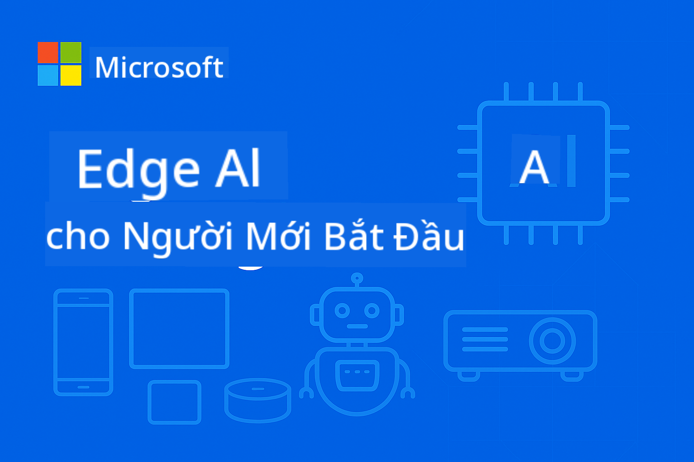

<!--
CO_OP_TRANSLATOR_METADATA:
{
  "original_hash": "dbe223abcd2955df69a08033ff16d389",
  "translation_date": "2025-10-03T08:03:58+00:00",
  "source_file": "README.md",
  "language_code": "vi"
}
-->
# EdgeAI cho Người Mới Bắt Đầu



[](https://GitHub.com/microsoft/edgeai-for-beginners/graphs/contributors)
[](https://GitHub.com/microsoft/edgeai-for-beginners/issues)
[](https://GitHub.com/microsoft/edgeai-for-beginners/pulls)
[](http://makeapullrequest.com)

[](https://GitHub.com/microsoft/edgeai-for-beginners/watchers)
[](https://GitHub.com/microsoft/edgeai-for-beginners/fork)
[](https://GitHub.com/microsoft/edgeai-for-beginners/stargazers)

[](https://discord.com/invite/ByRwuEEgH4)

Hãy làm theo các bước sau để bắt đầu sử dụng tài nguyên này:

1. **Fork Repository**: Nhấn [](https://GitHub.com/microsoft/edgeai-for-beginners/fork)
2. **Clone Repository**: `git clone https://github.com/microsoft/edgeai-for-beginners.git`
3. [**Tham gia Discord Azure AI Foundry và gặp gỡ các chuyên gia cùng các nhà phát triển khác**](https://discord.com/invite/ByRwuEEgH4)

### 🌐 Hỗ trợ đa ngôn ngữ

#### Được hỗ trợ qua GitHub Action (Tự động & Luôn cập nhật)

[Arabic](../ar/README.md) | [Bengali](../bn/README.md) | [Bulgarian](../bg/README.md) | [Burmese (Myanmar)](../my/README.md) | [Chinese (Simplified)](../zh/README.md) | [Chinese (Traditional, Hong Kong)](../hk/README.md) | [Chinese (Traditional, Macau)](../mo/README.md) | [Chinese (Traditional, Taiwan)](../tw/README.md) | [Croatian](../hr/README.md) | [Czech](../cs/README.md) | [Danish](../da/README.md) | [Dutch](../nl/README.md) | [Finnish](../fi/README.md) | [French](../fr/README.md) | [German](../de/README.md) | [Greek](../el/README.md) | [Hebrew](../he/README.md) | [Hindi](../hi/README.md) | [Hungarian](../hu/README.md) | [Indonesian](../id/README.md) | [Italian](../it/README.md) | [Japanese](../ja/README.md) | [Korean](../ko/README.md) | [Malay](../ms/README.md) | [Marathi](../mr/README.md) | [Nepali](../ne/README.md) | [Norwegian](../no/README.md) | [Persian (Farsi)](../fa/README.md) | [Polish](../pl/README.md) | [Portuguese (Brazil)](../br/README.md) | [Portuguese (Portugal)](../pt/README.md) | [Punjabi (Gurmukhi)](../pa/README.md) | [Romanian](../ro/README.md) | [Russian](../ru/README.md) | [Serbian (Cyrillic)](../sr/README.md) | [Slovak](../sk/README.md) | [Slovenian](../sl/README.md) | [Spanish](../es/README.md) | [Swahili](../sw/README.md) | [Swedish](../sv/README.md) | [Tagalog (Filipino)](../tl/README.md) | [Thai](../th/README.md) | [Turkish](../tr/README.md) | [Ukrainian](../uk/README.md) | [Urdu](../ur/README.md) | [Vietnamese](./README.md)

**Nếu bạn muốn hỗ trợ thêm các ngôn ngữ, danh sách các ngôn ngữ được hỗ trợ có tại [đây](https://github.com/Azure/co-op-translator/blob/main/getting_started/supported-languages.md)**

## Giới thiệu

Chào mừng bạn đến với **EdgeAI cho Người Mới Bắt Đầu** – hành trình toàn diện của bạn vào thế giới đầy biến đổi của Trí tuệ Nhân tạo tại Edge. Khóa học này kết nối khả năng AI mạnh mẽ với triển khai thực tế trên các thiết bị edge, giúp bạn khai thác tiềm năng của AI ngay tại nơi dữ liệu được tạo ra và quyết định cần được thực hiện.

### Những gì bạn sẽ học được

Khóa học này sẽ đưa bạn từ các khái niệm cơ bản đến các triển khai sẵn sàng sản xuất, bao gồm:
- **Mô hình ngôn ngữ nhỏ (SLMs)** tối ưu hóa cho triển khai tại edge
- **Tối ưu hóa phần cứng** trên các nền tảng đa dạng
- **Suy luận thời gian thực** với khả năng bảo vệ quyền riêng tư
- **Chiến lược triển khai sản xuất** cho các ứng dụng doanh nghiệp

### Tại sao EdgeAI quan trọng

Edge AI đại diện cho một sự thay đổi mô hình giải quyết các thách thức hiện đại quan trọng:
- **Quyền riêng tư & Bảo mật**: Xử lý dữ liệu nhạy cảm tại chỗ mà không cần đưa lên đám mây
- **Hiệu suất thời gian thực**: Loại bỏ độ trễ mạng cho các ứng dụng yêu cầu thời gian thực
- **Hiệu quả chi phí**: Giảm chi phí băng thông và tính toán đám mây
- **Hoạt động bền vững**: Duy trì chức năng trong trường hợp mất kết nối mạng
- **Tuân thủ quy định**: Đáp ứng các yêu cầu về chủ quyền dữ liệu

### Edge AI

Edge AI là việc chạy các thuật toán AI và mô hình ngôn ngữ trực tiếp trên phần cứng, gần nơi dữ liệu được tạo ra mà không cần dựa vào tài nguyên đám mây để suy luận. Nó giảm độ trễ, tăng cường quyền riêng tư và cho phép ra quyết định thời gian thực.

### Nguyên tắc cốt lõi:
- **Suy luận trên thiết bị**: Các mô hình AI chạy trên các thiết bị edge (điện thoại, router, vi điều khiển, PC công nghiệp)
- **Khả năng hoạt động ngoại tuyến**: Hoạt động mà không cần kết nối internet liên tục
- **Độ trễ thấp**: Phản hồi ngay lập tức phù hợp với các hệ thống thời gian thực
- **Chủ quyền dữ liệu**: Giữ dữ liệu nhạy cảm tại chỗ, cải thiện bảo mật và tuân thủ

### Mô hình ngôn ngữ nhỏ (SLMs)

Các SLM như Phi-4, Mistral-7B và Gemma là các phiên bản tối ưu hóa của các LLM lớn hơn—được huấn luyện hoặc giảm kích thước để:
- **Giảm dung lượng bộ nhớ**: Sử dụng hiệu quả bộ nhớ hạn chế của thiết bị edge
- **Yêu cầu tính toán thấp hơn**: Tối ưu hóa cho hiệu suất CPU và GPU edge
- **Thời gian khởi động nhanh hơn**: Khởi tạo nhanh cho các ứng dụng đáp ứng nhanh

Chúng mở khóa các khả năng NLP mạnh mẽ trong khi đáp ứng các hạn chế của:
- **Hệ thống nhúng**: Thiết bị IoT và bộ điều khiển công nghiệp
- **Thiết bị di động**: Điện thoại thông minh và máy tính bảng với khả năng ngoại tuyến
- **Thiết bị IoT**: Cảm biến và thiết bị thông minh với tài nguyên hạn chế
- **Máy chủ edge**: Các đơn vị xử lý cục bộ với tài nguyên GPU hạn chế
- **Máy tính cá nhân**: Các kịch bản triển khai trên máy tính để bàn và laptop

## Các module khóa học & Điều hướng

| Module | Chủ đề | Khu vực trọng tâm | Nội dung chính | Cấp độ | Thời lượng |
|--------|-------|------------|-------------|--------|----------|
| [📖 00 ](./introduction.md) | [Giới thiệu về EdgeAI](./introduction.md) | Nền tảng & Bối cảnh | Tổng quan EdgeAI • Ứng dụng ngành • Giới thiệu SLM • Mục tiêu học tập | Người mới bắt đầu | 1-2 giờ |
| [📚 01](../../Module01) | [Kiến thức cơ bản về EdgeAI](./Module01/README.md) | So sánh Cloud vs Edge AI | Kiến thức cơ bản về EdgeAI • Các nghiên cứu thực tế • Hướng dẫn triển khai • Triển khai Edge | Người mới bắt đầu | 3-4 giờ |
| [🧠 02](../../Module02) | [Nền tảng mô hình SLM](./Module02/README.md) | Các họ mô hình & kiến trúc | Họ Phi • Họ Qwen • Họ Gemma • BitNET • μModel • Phi-Silica | Người mới bắt đầu | 4-5 giờ |
| [🚀 03](../../Module03) | [Thực hành triển khai SLM](./Module03/README.md) | Triển khai cục bộ & đám mây | Học nâng cao • Môi trường cục bộ • Triển khai đám mây | Trung cấp | 4-5 giờ |
| [⚙️ 04](../../Module04) | [Bộ công cụ tối ưu hóa mô hình](./Module04/README.md) | Tối ưu hóa đa nền tảng | Giới thiệu • Llama.cpp • Microsoft Olive • OpenVINO • Apple MLX • Tổng hợp quy trình làm việc | Trung cấp | 5-6 giờ |
| [🔧 05](../../Module05) | [SLMOps Sản xuất](./Module05/README.md) | Hoạt động sản xuất | Giới thiệu SLMOps • Giảm kích thước mô hình • Tinh chỉnh • Triển khai sản xuất | Nâng cao | 5-6 giờ |
| [🤖 06](../../Module06) | [Các tác nhân AI & Gọi hàm](./Module06/README.md) | Khung tác nhân & MCP | Giới thiệu tác nhân • Gọi hàm • Giao thức ngữ cảnh mô hình | Nâng cao | 4-5 giờ |
| [💻 07](../../Module07) | [Triển khai nền tảng](./Module07/README.md) | Mẫu đa nền tảng | Bộ công cụ AI • Foundry Local • Phát triển Windows | Nâng cao | 3-4 giờ |
| [🏭 08](../../Module08) | [Bộ công cụ Foundry Local](./Module08/README.md) | Mẫu sẵn sàng sản xuất | Ứng dụng mẫu (xem chi tiết bên dưới) | Chuyên gia | 8-10 giờ |

### 🏭 **Module 08: Ứng dụng mẫu**

- [01: REST Chat Quickstart](./Module08/samples/01/README.md)
- [02: Tích hợp OpenAI SDK](./Module08/samples/02/README.md)
- [03: Khám phá & Đánh giá mô hình](./Module08/samples/03/README.md)
- [04: Ứng dụng Chainlit RAG](./Module08/samples/04/README.md)
- [05: Điều phối đa tác nhân](./Module08/samples/05/README.md)
- [06: Bộ định tuyến Models-as-Tools](./Module08/samples/06/README.md)
- [07: API Client trực tiếp](./Module08/samples/07/README.md)
- [08: Ứng dụng Chat Windows 11](./Module08/samples/08/README.md)
- [09: Hệ thống đa tác nhân nâng cao](./Module08/samples/09/README.md)
- [10: Khung công cụ Foundry Tools](./Module08/samples/10/README.md)

### 📊 **Tóm tắt lộ trình học tập**
- **Tổng thời lượng**: 36-45 giờ
- **Lộ trình Người mới bắt đầu**: Module 01-02 (7-9 giờ)  
- **Lộ trình Trung cấp**: Module 03-04 (9-11 giờ)
- **Lộ trình Nâng cao**: Module 05-07 (12-15 giờ)
- **Lộ trình Chuyên gia**: Module 08 (8-10 giờ)

## Những gì bạn sẽ xây dựng

### 🎯 Năng lực cốt lõi
- **Kiến trúc Edge AI**: Thiết kế hệ thống AI ưu tiên cục bộ với tích hợp đám mây
- **Tối ưu hóa mô hình**: Giảm kích thước và nén mô hình cho triển khai tại edge (tăng tốc độ 85%, giảm kích thước 75%)
- **Triển khai đa nền tảng**: Windows, di động, nhúng và hệ thống lai edge-cloud
- **Hoạt động sản xuất**: Giám sát, mở rộng và duy trì Edge AI trong sản xuất

### 🏗️ Dự án thực tế
- **Ứng dụng Chat Foundry Local**: Ứng dụng gốc Windows 11 với khả năng chuyển đổi mô hình
- **Hệ thống đa tác nhân**: Điều phối viên với các tác nhân chuyên biệt cho quy trình phức tạp  
- **Ứng dụng RAG**: Xử lý tài liệu cục bộ với tìm kiếm vector
- **Bộ định tuyến mô hình**: Lựa chọn thông minh giữa các mô hình dựa trên phân tích nhiệm vụ
- **Khung API**: Các client sẵn sàng sản xuất với khả năng streaming và giám sát sức khỏe
- **Công cụ đa nền tảng**: Mẫu tích hợp LangChain/Semantic Kernel

### 🏢 Ứng dụng ngành
**Sản xuất** • **Chăm sóc sức khỏe** • **Phương tiện tự hành** • **Thành phố thông minh** • **Ứng dụng di động**

## Bắt đầu nhanh

**Lộ trình học tập được khuyến nghị** (tổng cộng 20-30 giờ):

0. **📖 Giới thiệu** ([Introduction.md](./introduction.md)): Nền tảng EdgeAI + bối cảnh ngành + khung học tập
1. **📚 Nền tảng** (Module 01-02): Các khái niệm EdgeAI + họ mô hình SLM
2. **⚙️ Tối ưu hóa** (Module 03-04): Triển khai + khung tối ưu hóa  
3. **🚀 Sản xuất** (Modules 05-06): SLMOps + AI agents + gọi hàm  
4. **💻 Triển khai** (Modules 07-08): Mẫu nền tảng + Bộ công cụ Foundry Local  

Mỗi module bao gồm lý thuyết, bài tập thực hành và các mẫu mã sẵn sàng cho sản xuất.

## Tác động đến sự nghiệp

**Vai trò kỹ thuật**: Kiến trúc sư giải pháp EdgeAI • Kỹ sư ML (Edge) • Nhà phát triển IoT AI • Nhà phát triển AI di động  

**Ngành công nghiệp**: Sản xuất 4.0 • Công nghệ y tế • Hệ thống tự động • FinTech • Điện tử tiêu dùng  

**Dự án danh mục đầu tư**: Hệ thống đa tác nhân • Ứng dụng RAG sản xuất • Triển khai đa nền tảng • Tối ưu hóa hiệu suất  

## Cấu trúc kho lưu trữ

```
edgeai-for-beginners/
├── 📖 introduction.md  # Foundation: EdgeAI Overview & Learning Framework
├── 📚 Module01-04/     # Fundamentals → SLMs → Deployment → Optimization  
├── 🔧 Module05-06/     # SLMOps → AI Agents → Function Calling
├── 💻 Module07/        # Platform Samples (VS Code, Windows, Jetson, Mobile)
├── 🏭 Module08/        # Foundry Local Toolkit + 10 Comprehensive Samples
│   ├── samples/01-06/  # Foundation: REST, SDK, RAG, Agents, Routing
│   └── samples/07-10/  # Advanced: API Client, Windows App, Enterprise Agents, Tools
├── 🌐 translations/    # Multi-language support (8+ languages)
└── 📋 STUDY_GUIDE.md   # Structured learning paths & time allocation
```
  

## Điểm nổi bật của khóa học

✅ **Học tập tiến bộ**: Lý thuyết → Thực hành → Triển khai sản xuất  
✅ **Nghiên cứu trường hợp thực tế**: Microsoft, Japan Airlines, triển khai doanh nghiệp  
✅ **Mẫu thực hành**: Hơn 50 ví dụ, 10 bản demo Foundry Local toàn diện  
✅ **Tập trung vào hiệu suất**: Cải thiện tốc độ 85%, giảm kích thước 75%  
✅ **Đa nền tảng**: Windows, di động, nhúng, kết hợp đám mây-edge  
✅ **Sẵn sàng sản xuất**: Giám sát, mở rộng, bảo mật, khung tuân thủ  

📖 **[Hướng dẫn học tập có sẵn](STUDY_GUIDE.md)**: Lộ trình học tập 20 giờ có cấu trúc với hướng dẫn phân bổ thời gian và công cụ tự đánh giá.

---

**EdgeAI đại diện cho tương lai của triển khai AI**: ưu tiên cục bộ, bảo vệ quyền riêng tư và hiệu quả. Làm chủ các kỹ năng này để xây dựng thế hệ ứng dụng thông minh tiếp theo.

## Các khóa học khác

Nhóm của chúng tôi còn cung cấp các khóa học khác! Hãy tham khảo:

- [MCP cho người mới bắt đầu](https://github.com/microsoft/mcp-for-beginners)  
- [AI Agents cho người mới bắt đầu](https://github.com/microsoft/ai-agents-for-beginners?WT.mc_id=academic-105485-koreyst)  
- [Generative AI cho người mới bắt đầu sử dụng .NET](https://github.com/microsoft/Generative-AI-for-beginners-dotnet?WT.mc_id=academic-105485-koreyst)  
- [Generative AI cho người mới bắt đầu sử dụng JavaScript](https://github.com/microsoft/generative-ai-with-javascript?WT.mc_id=academic-105485-koreyst)  
- [Generative AI cho người mới bắt đầu](https://github.com/microsoft/generative-ai-for-beginners?WT.mc_id=academic-105485-koreyst)  
- [ML cho người mới bắt đầu](https://aka.ms/ml-beginners?WT.mc_id=academic-105485-koreyst)  
- [Khoa học dữ liệu cho người mới bắt đầu](https://aka.ms/datascience-beginners?WT.mc_id=academic-105485-koreyst)  
- [AI cho người mới bắt đầu](https://aka.ms/ai-beginners?WT.mc_id=academic-105485-koreyst)  
- [An ninh mạng cho người mới bắt đầu](https://github.com/microsoft/Security-101??WT.mc_id=academic-96948-sayoung)  
- [Phát triển web cho người mới bắt đầu](https://aka.ms/webdev-beginners?WT.mc_id=academic-105485-koreyst)  
- [IoT cho người mới bắt đầu](https://aka.ms/iot-beginners?WT.mc_id=academic-105485-koreyst)  
- [Phát triển XR cho người mới bắt đầu](https://github.com/microsoft/xr-development-for-beginners?WT.mc_id=academic-105485-koreyst)  
- [Làm chủ GitHub Copilot cho lập trình AI ghép đôi](https://aka.ms/GitHubCopilotAI?WT.mc_id=academic-105485-koreyst)  
- [Làm chủ GitHub Copilot cho nhà phát triển C#/.NET](https://github.com/microsoft/mastering-github-copilot-for-dotnet-csharp-developers?WT.mc_id=academic-105485-koreyst)  
- [Chọn cuộc phiêu lưu Copilot của riêng bạn](https://github.com/microsoft/CopilotAdventures?WT.mc_id=academic-105485-koreyst)  

## Nhận hỗ trợ

Nếu bạn gặp khó khăn hoặc có bất kỳ câu hỏi nào về việc xây dựng ứng dụng AI, hãy tham gia:

[](https://aka.ms/foundry/discord)  

Nếu bạn có phản hồi về sản phẩm hoặc gặp lỗi khi xây dựng, hãy truy cập:

[](https://aka.ms/foundry/forum)  

---

**Tuyên bố miễn trừ trách nhiệm**:  
Tài liệu này đã được dịch bằng dịch vụ dịch thuật AI [Co-op Translator](https://github.com/Azure/co-op-translator). Mặc dù chúng tôi cố gắng đảm bảo độ chính xác, xin lưu ý rằng các bản dịch tự động có thể chứa lỗi hoặc không chính xác. Tài liệu gốc bằng ngôn ngữ bản địa nên được coi là nguồn thông tin chính thức. Đối với các thông tin quan trọng, khuyến nghị sử dụng dịch vụ dịch thuật chuyên nghiệp bởi con người. Chúng tôi không chịu trách nhiệm về bất kỳ sự hiểu lầm hoặc diễn giải sai nào phát sinh từ việc sử dụng bản dịch này.