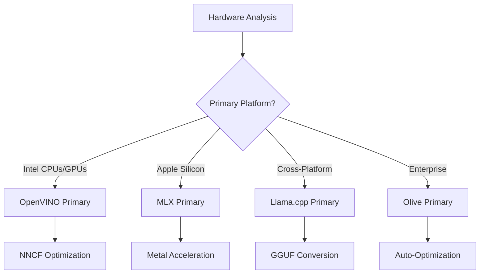
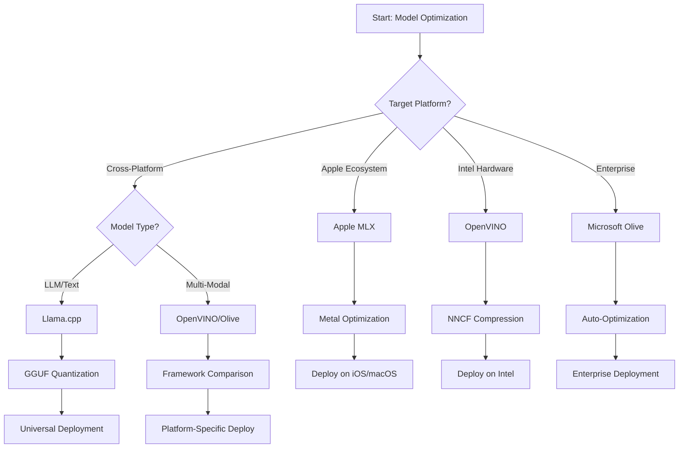
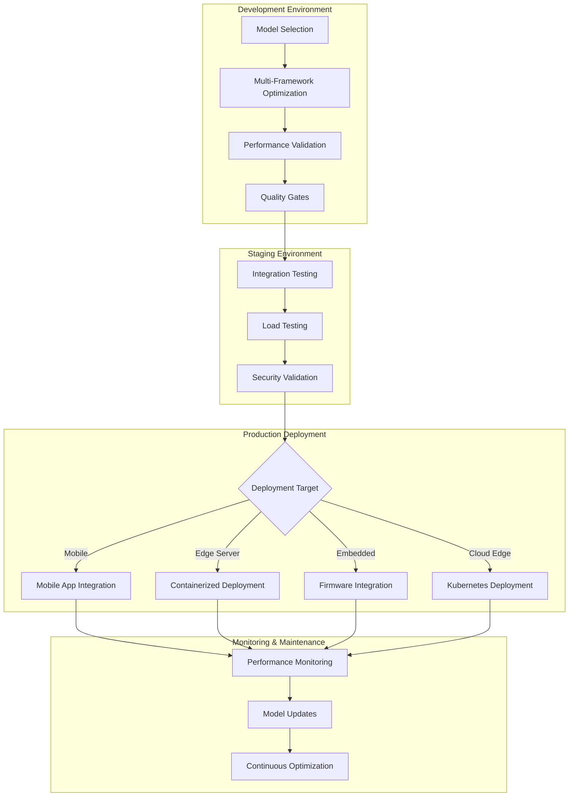

<!--
CO_OP_TRANSLATOR_METADATA:
{
  "original_hash": "6719c4a7e44b948230ac5f5cab3699bd",
  "translation_date": "2025-09-15T17:07:58+00:00",
  "source_file": "Module04/06.workflow-synthesis.md",
  "language_code": "zh"
}
-->
# 第六章：边缘AI开发工作流程综合

## 目录
1. [简介](../../../Module04)
2. [学习目标](../../../Module04)
3. [统一工作流程概述](../../../Module04)
4. [框架选择矩阵](../../../Module04)
5. [最佳实践综合](../../../Module04)
6. [部署策略指南](../../../Module04)
7. [性能优化工作流程](../../../Module04)
8. [生产准备检查表](../../../Module04)
9. [故障排除与监控](../../../Module04)
10. [未来保障您的边缘AI管道](../../../Module04)

## 简介

边缘AI开发需要对多种优化框架、部署策略和硬件考虑有深入理解。本章将整合来自 Llama.cpp、Microsoft Olive、OpenVINO 和 Apple MLX 的知识，创建一个统一的工作流程，以最大化效率、保持质量并确保成功的生产部署。

在整个课程中，我们探讨了各个优化框架的独特优势和专用用例。然而，现实中的边缘AI项目通常需要结合多个框架的技术，或在特定约束和需求下做出战略决策，以选择最佳方法。

本章将所有框架的集体智慧综合为可操作的工作流程、决策树和最佳实践，帮助您高效构建生产就绪的边缘AI解决方案。无论您是为移动设备、嵌入式系统还是边缘服务器进行优化，本指南都提供了开发生命周期中做出明智决策的战略框架。

## 学习目标

完成本章后，您将能够：

### 战略决策
- **评估并选择**基于项目需求、硬件约束和部署场景的最佳优化框架
- **设计全面的工作流程**，整合多种优化技术以实现最大效率
- **权衡取舍**，在不同框架中平衡模型准确性、推理速度、内存使用和部署复杂性

### 工作流程整合
- **实施统一开发管道**，利用多个优化框架的优势
- **创建可复现的工作流程**，确保模型优化和部署在不同环境中的一致性
- **建立质量门**和验证流程，确保优化后的模型符合生产要求

### 性能优化
- **应用系统化优化策略**，使用量化、剪枝和硬件加速技术
- **监控和基准测试**模型在不同优化级别和部署目标上的性能
- **针对特定硬件平台优化**，包括CPU、GPU、NPU和专用边缘加速器

### 生产部署
- **设计可扩展的部署架构**，支持多种模型格式和推理引擎
- **实施监控和可观测性**，确保边缘AI应用在生产环境中的稳定运行
- **建立维护工作流程**，用于模型更新、性能监控和系统优化

### 跨平台卓越
- **部署优化模型**，在多种硬件平台上保持一致性能
- **处理平台特定优化**，支持Windows、macOS、Linux、移动设备和嵌入式系统
- **创建抽象层**，实现不同边缘环境的无缝部署

## 统一工作流程概述

### 阶段一：需求分析与框架选择

成功的边缘AI部署始于全面的需求分析，以指导框架选择和优化策略。

#### 1.1 硬件评估


**关键考虑因素：**
- **CPU架构**：x86、ARM、Apple Silicon能力
- **加速器可用性**：GPU、NPU、VPU、专用AI芯片
- **内存约束**：RAM限制、存储容量
- **功耗预算**：电池寿命、热量约束
- **连接性**：离线需求、带宽限制

#### 1.2 应用需求矩阵

| 需求 | Llama.cpp | Microsoft Olive | OpenVINO | Apple MLX |
|------|-----------|-----------------|----------|-----------|
| 跨平台 | ✅ 优秀 | ⚡ 良好 | ⚡ 良好 | ❌ 仅限Apple |
| 企业集成 | ⚡ 基础 | ✅ 优秀 | ✅ 优秀 | ⚡ 有限 |
| 移动部署 | ✅ 优秀 | ⚡ 良好 | ⚡ 良好 | ✅ iOS优秀 |
| 实时推理 | ✅ 优秀 | ✅ 优秀 | ✅ 优秀 | ✅ 优秀 |
| 模型多样性 | ✅ 专注LLM | ✅ 全模型 | ✅ 全模型 | ✅ 专注LLM |
| 易用性 | ✅ 简单 | ✅ 自动化 | ⚡ 中等 | ✅ 简单 |

### 阶段二：模型准备与优化

#### 2.1 通用模型评估管道

```python
# Universal Model Assessment Framework
class EdgeAIModelAssessment:
    def __init__(self, model_path, target_hardware):
        self.model_path = model_path
        self.target_hardware = target_hardware
        self.optimization_frameworks = []
        
    def assess_model_characteristics(self):
        """Analyze model size, architecture, and complexity"""
        return {
            'model_size': self.get_model_size(),
            'parameter_count': self.get_parameter_count(),
            'architecture_type': self.detect_architecture(),
            'quantization_compatibility': self.check_quantization_support()
        }
    
    def recommend_optimization_strategy(self):
        """Recommend optimal frameworks and techniques"""
        characteristics = self.assess_model_characteristics()
        
        if self.target_hardware.startswith('apple'):
            return self.mlx_optimization_strategy(characteristics)
        elif self.target_hardware.startswith('intel'):
            return self.openvino_optimization_strategy(characteristics)
        elif characteristics['model_size'] > 7_000_000_000:  # 7B+ parameters
            return self.enterprise_optimization_strategy(characteristics)
        else:
            return self.lightweight_optimization_strategy(characteristics)
```

#### 2.2 多框架优化管道

**顺序优化方法：**
1. **初始转换**：转换为中间格式（尽可能使用ONNX）
2. **框架特定优化**：应用专用技术
3. **交叉验证**：验证目标平台上的性能
4. **最终打包**：准备部署

```bash
# Multi-Framework Optimization Script
#!/bin/bash

MODEL_NAME="phi-3-mini"
BASE_MODEL="microsoft/Phi-3-mini-4k-instruct"

# Phase 1: ONNX Conversion (Universal)
python convert_to_onnx.py --model $BASE_MODEL --output models/onnx/

# Phase 2: Platform-Specific Optimization
if [[ "$TARGET_PLATFORM" == "intel" ]]; then
    # OpenVINO Optimization
    python optimize_openvino.py --input models/onnx/ --output models/openvino/
elif [[ "$TARGET_PLATFORM" == "apple" ]]; then
    # MLX Optimization
    python optimize_mlx.py --input $BASE_MODEL --output models/mlx/
elif [[ "$TARGET_PLATFORM" == "cross" ]]; then
    # Llama.cpp Optimization
    python convert_to_gguf.py --input models/onnx/ --output models/gguf/
fi

# Phase 3: Validation
python validate_optimization.py --original $BASE_MODEL --optimized models/$TARGET_PLATFORM/
```

### 阶段三：性能验证与基准测试

#### 3.1 综合基准测试框架

```python
class EdgeAIBenchmark:
    def __init__(self, optimized_models):
        self.models = optimized_models
        self.metrics = {
            'inference_time': [],
            'memory_usage': [],
            'accuracy_score': [],
            'throughput': [],
            'energy_consumption': []
        }
    
    def run_comprehensive_benchmark(self):
        """Execute standardized benchmarks across all optimized models"""
        test_inputs = self.generate_test_inputs()
        
        for model_framework, model_path in self.models.items():
            print(f"Benchmarking {model_framework}...")
            
            # Latency Testing
            latency = self.measure_inference_latency(model_path, test_inputs)
            
            # Memory Profiling
            memory = self.profile_memory_usage(model_path)
            
            # Accuracy Validation
            accuracy = self.validate_model_accuracy(model_path, test_inputs)
            
            # Throughput Analysis
            throughput = self.measure_throughput(model_path)
            
            self.record_metrics(model_framework, latency, memory, accuracy, throughput)
    
    def generate_optimization_report(self):
        """Create comprehensive comparison report"""
        report = {
            'recommendations': self.analyze_performance_trade_offs(),
            'deployment_guidance': self.generate_deployment_recommendations(),
            'monitoring_requirements': self.define_monitoring_metrics()
        }
        return report
```

## 框架选择矩阵

### 框架选择决策树



### 综合选择标准

#### 1. 主要用例匹配

**大型语言模型（LLMs）：**
- **Llama.cpp**：适合以CPU为主的跨平台部署
- **Apple MLX**：适合Apple Silicon，支持统一内存
- **OpenVINO**：适合Intel硬件，支持NNCF优化
- **Microsoft Olive**：适合企业工作流，支持自动化

**多模态模型：**
- **OpenVINO**：全面支持视觉、音频和文本
- **Microsoft Olive**：企业级优化，支持复杂管道
- **Llama.cpp**：仅限文本模型
- **Apple MLX**：逐步支持多模态应用

#### 2. 硬件平台矩阵

| 平台 | 主要框架 | 次要选项 | 专用功能 |
|------|----------|----------|----------|
| Intel CPU/GPU | OpenVINO | Microsoft Olive | NNCF压缩，Intel优化 |
| NVIDIA GPU | Microsoft Olive | OpenVINO | CUDA加速，企业功能 |
| Apple Silicon | Apple MLX | Llama.cpp | Metal着色器，统一内存 |
| ARM移动设备 | Llama.cpp | OpenVINO | 跨平台，依赖最少 |
| Edge TPU | OpenVINO | Microsoft Olive | 专用加速器支持 |
| 嵌入式ARM | Llama.cpp | OpenVINO | 最小占用，高效推理 |

#### 3. 开发工作流程偏好

**快速原型：**
1. **Llama.cpp**：最快设置，立即见效
2. **Apple MLX**：简单Python API，快速迭代
3. **Microsoft Olive**：自动化优化，配置最少
4. **OpenVINO**：设置较复杂，功能全面

**企业生产：**
1. **Microsoft Olive**：企业功能，Azure集成
2. **OpenVINO**：Intel生态系统，工具全面
3. **Apple MLX**：适用于Apple特定企业应用
4. **Llama.cpp**：简单部署，企业功能有限

## 最佳实践综合

### 通用优化原则

#### 1. 渐进式优化策略

```python
class ProgressiveOptimization:
    def __init__(self, base_model):
        self.base_model = base_model
        self.optimization_stages = [
            'baseline_measurement',
            'format_conversion',
            'quantization_optimization',
            'hardware_acceleration',
            'production_validation'
        ]
    
    def execute_progressive_optimization(self):
        """Apply optimization techniques incrementally"""
        
        # Stage 1: Baseline Measurement
        baseline_metrics = self.measure_baseline_performance()
        
        # Stage 2: Format Conversion
        converted_model = self.convert_to_optimal_format()
        conversion_metrics = self.measure_performance(converted_model)
        
        # Stage 3: Quantization
        quantized_model = self.apply_quantization(converted_model)
        quantization_metrics = self.measure_performance(quantized_model)
        
        # Stage 4: Hardware Acceleration
        accelerated_model = self.enable_hardware_acceleration(quantized_model)
        acceleration_metrics = self.measure_performance(accelerated_model)
        
        # Stage 5: Validation
        production_ready = self.validate_for_production(accelerated_model)
        
        return self.compile_optimization_report(
            baseline_metrics, conversion_metrics, 
            quantization_metrics, acceleration_metrics
        )
```

#### 2. 质量门实施

**准确性保留门：**
- 保持原始模型准确性>95%
- 使用代表性测试数据集验证
- 实施生产环境的A/B测试

**性能提升门：**
- 实现至少2倍速度提升
- 内存占用减少至少50%
- 验证推理时间一致性

**生产准备门：**
- 在负载下通过压力测试
- 展示长期稳定性能
- 验证安全性和隐私要求

### 框架特定最佳实践整合

#### 1. 量化策略综合

```python
# Unified Quantization Approach
class UnifiedQuantizationStrategy:
    def __init__(self, model, target_platform):
        self.model = model
        self.platform = target_platform
        
    def select_optimal_quantization(self):
        """Choose best quantization based on platform and requirements"""
        
        if self.platform == 'apple_silicon':
            return self.mlx_quantization_strategy()
        elif self.platform == 'intel_hardware':
            return self.openvino_quantization_strategy()
        elif self.platform == 'cross_platform':
            return self.llamacpp_quantization_strategy()
        else:
            return self.olive_quantization_strategy()
    
    def mlx_quantization_strategy(self):
        """Apple MLX-specific quantization"""
        return {
            'method': 'mlx_quantize',
            'precision': 'int4',
            'group_size': 64,
            'optimization_target': 'unified_memory'
        }
    
    def openvino_quantization_strategy(self):
        """OpenVINO NNCF quantization"""
        return {
            'method': 'nncf_quantize',
            'precision': 'int8',
            'calibration_method': 'post_training',
            'optimization_target': 'intel_hardware'
        }
```

#### 2. 硬件加速优化

**CPU优化综合：**
- **SIMD指令**：利用框架优化内核
- **内存带宽**：优化数据布局以提高缓存效率
- **线程化**：平衡并行性与资源约束

**GPU加速最佳实践：**
- **批处理**：通过适当的批量大小最大化吞吐量
- **内存管理**：优化GPU内存分配和传输
- **精度**：支持时使用FP16以提高性能

**NPU/专用加速器优化：**
- **模型架构**：确保与加速器能力兼容
- **数据流**：优化输入/输出管道以提高加速器效率
- **回退策略**：为不支持的操作实施CPU回退

## 部署策略指南

### 通用部署架构



### 平台特定部署模式

#### 1. 移动部署策略

```yaml
# Mobile Deployment Configuration
mobile_deployment:
  ios:
    framework: apple_mlx
    optimization:
      quantization: int4
      memory_mapping: true
      background_execution: limited
    packaging:
      format: mlx
      bundle_size: <50MB
      
  android:
    framework: llama_cpp
    optimization:
      quantization: q4_k_m
      threading: android_optimized
      memory_management: conservative
    packaging:
      format: gguf
      apk_size: <100MB
      
  cross_platform:
    framework: onnx_runtime
    optimization:
      quantization: int8
      execution_provider: cpu
    packaging:
      format: onnx
      shared_libraries: minimal
```

#### 2. 边缘服务器部署

```yaml
# Edge Server Deployment Configuration
edge_server:
  intel_based:
    framework: openvino
    optimization:
      quantization: int8
      acceleration: cpu_gpu_auto
      batch_processing: dynamic
    deployment:
      container: openvino_runtime
      orchestration: kubernetes
      scaling: horizontal
      
  nvidia_based:
    framework: microsoft_olive
    optimization:
      quantization: int4
      acceleration: cuda
      tensor_parallelism: true
    deployment:
      container: nvidia_triton
      orchestration: kubernetes
      scaling: gpu_aware
```

### 容器化最佳实践

```dockerfile
# Multi-Framework Edge AI Container
FROM ubuntu:22.04 as base

# Install common dependencies
RUN apt-get update && apt-get install -y \
    python3 \
    python3-pip \
    build-essential \
    cmake \
    && rm -rf /var/lib/apt/lists/*

# Framework-specific stages
FROM base as openvino
RUN pip install openvino nncf optimum[intel]

FROM base as llamacpp
RUN git clone https://github.com/ggerganov/llama.cpp.git \
    && cd llama.cpp && make LLAMA_OPENBLAS=1

FROM base as olive
RUN pip install olive-ai[auto-opt] onnxruntime-genai

# Production stage with selected framework
FROM openvino as production
COPY models/ /app/models/
COPY src/ /app/src/
WORKDIR /app

EXPOSE 8080
CMD ["python3", "src/inference_server.py"]
```

## 性能优化工作流程

### 系统化性能调优

#### 1. 性能分析管道

```python
class EdgeAIPerformanceProfiler:
    def __init__(self, model_path, framework):
        self.model_path = model_path
        self.framework = framework
        self.profiling_results = {}
    
    def comprehensive_profiling(self):
        """Execute comprehensive performance analysis"""
        
        # CPU Profiling
        cpu_profile = self.profile_cpu_usage()
        
        # Memory Profiling
        memory_profile = self.profile_memory_usage()
        
        # Inference Latency
        latency_profile = self.profile_inference_latency()
        
        # Throughput Analysis
        throughput_profile = self.profile_throughput()
        
        # Energy Consumption (where available)
        energy_profile = self.profile_energy_consumption()
        
        return self.compile_performance_report(
            cpu_profile, memory_profile, latency_profile,
            throughput_profile, energy_profile
        )
    
    def identify_bottlenecks(self):
        """Automatically identify performance bottlenecks"""
        bottlenecks = []
        
        if self.profiling_results['cpu_utilization'] > 80:
            bottlenecks.append('cpu_bound')
        
        if self.profiling_results['memory_usage'] > 90:
            bottlenecks.append('memory_bound')
        
        if self.profiling_results['inference_variance'] > 20:
            bottlenecks.append('inconsistent_performance')
        
        return self.generate_optimization_recommendations(bottlenecks)
```

#### 2. 自动化优化管道

```python
class AutomatedOptimizationPipeline:
    def __init__(self, base_model, target_constraints):
        self.base_model = base_model
        self.constraints = target_constraints
        self.optimization_history = []
    
    def execute_optimization_search(self):
        """Systematically search optimization space"""
        
        optimization_candidates = [
            {'quantization': 'int8', 'pruning': 0.1},
            {'quantization': 'int4', 'pruning': 0.2},
            {'quantization': 'int8', 'acceleration': 'gpu'},
            {'quantization': 'int4', 'acceleration': 'npu'}
        ]
        
        best_configuration = None
        best_score = 0
        
        for config in optimization_candidates:
            optimized_model = self.apply_optimization(config)
            score = self.evaluate_optimization(optimized_model)
            
            if score > best_score and self.meets_constraints(optimized_model):
                best_score = score
                best_configuration = config
            
            self.optimization_history.append({
                'config': config,
                'score': score,
                'model': optimized_model
            })
        
        return best_configuration, self.optimization_history
```

### 多目标优化

#### 1. 边缘AI的帕累托优化

```python
class ParetoOptimization:
    def __init__(self, objectives=['speed', 'accuracy', 'memory']):
        self.objectives = objectives
        self.pareto_frontier = []
    
    def find_pareto_optimal_solutions(self, optimization_results):
        """Identify Pareto-optimal configurations"""
        
        for result in optimization_results:
            is_dominated = False
            
            for frontier_point in self.pareto_frontier:
                if self.dominates(frontier_point, result):
                    is_dominated = True
                    break
            
            if not is_dominated:
                # Remove dominated points from frontier
                self.pareto_frontier = [
                    point for point in self.pareto_frontier 
                    if not self.dominates(result, point)
                ]
                
                self.pareto_frontier.append(result)
        
        return self.pareto_frontier
    
    def recommend_configuration(self, user_preferences):
        """Recommend configuration based on user preferences"""
        
        weighted_scores = []
        for config in self.pareto_frontier:
            score = sum(
                user_preferences[obj] * config['metrics'][obj] 
                for obj in self.objectives
            )
            weighted_scores.append((score, config))
        
        return max(weighted_scores, key=lambda x: x[0])[1]
```

## 生产准备检查表

### 综合生产验证

#### 1. 模型质量保证

```python
class ProductionReadinessValidator:
    def __init__(self, optimized_model, production_requirements):
        self.model = optimized_model
        self.requirements = production_requirements
        self.validation_results = {}
    
    def validate_model_quality(self):
        """Comprehensive model quality validation"""
        
        # Accuracy Validation
        accuracy_result = self.validate_accuracy()
        
        # Performance Validation
        performance_result = self.validate_performance()
        
        # Robustness Testing
        robustness_result = self.validate_robustness()
        
        # Security Assessment
        security_result = self.validate_security()
        
        # Compliance Verification
        compliance_result = self.validate_compliance()
        
        return self.compile_validation_report(
            accuracy_result, performance_result, robustness_result,
            security_result, compliance_result
        )
    
    def generate_certification_report(self):
        """Generate production certification report"""
        return {
            'model_signature': self.generate_model_signature(),
            'validation_timestamp': datetime.now(),
            'validation_results': self.validation_results,
            'deployment_approval': self.check_deployment_approval(),
            'monitoring_requirements': self.define_monitoring_requirements()
        }
```

#### 2. 生产部署检查表

**部署前验证：**
- [ ] 模型准确性达到最低要求（>95%基线）
- [ ] 性能目标达成（延迟、吞吐量、内存）
- [ ] 安全漏洞评估并解决
- [ ] 在预期负载下完成压力测试
- [ ] 测试故障场景并验证恢复流程
- [ ] 配置监控和警报系统
- [ ] 测试并记录回滚流程

**部署过程：**
- [ ] 实施蓝绿部署策略
- [ ] 配置逐步流量提升
- [ ] 激活实时监控仪表板
- [ ] 建立性能基线
- [ ] 定义错误率阈值
- [ ] 配置自动回滚触发器

**部署后监控：**
- [ ] 激活模型漂移检测
- [ ] 配置性能退化警报
- [ ] 启用资源利用率监控
- [ ] 跟踪用户体验指标
- [ ] 维护模型版本和谱系
- [ ] 定期安排模型性能审查

### 持续集成/持续部署（CI/CD）

```yaml
# Edge AI CI/CD Pipeline Configuration
edge_ai_pipeline:
  stages:
    - model_validation
    - optimization
    - testing
    - staging_deployment
    - production_deployment
    - monitoring
  
  model_validation:
    accuracy_threshold: 0.95
    performance_baseline: required
    security_scan: enabled
    
  optimization:
    frameworks:
      - llama_cpp
      - openvino
      - microsoft_olive
    validation:
      cross_validation: enabled
      performance_comparison: required
      
  testing:
    unit_tests: comprehensive
    integration_tests: full_pipeline
    load_tests: production_scale
    security_tests: comprehensive
    
  deployment:
    strategy: blue_green
    traffic_ramping: gradual
    rollback: automatic
    monitoring: real_time
```

## 故障排除与监控

### 通用故障排除框架

#### 1. 常见问题与解决方案

**性能问题：**
```python
class PerformanceTroubleshooter:
    def __init__(self, model_metrics):
        self.metrics = model_metrics
        
    def diagnose_performance_issues(self):
        """Systematic performance issue diagnosis"""
        
        issues = []
        
        # High latency diagnosis
        if self.metrics['avg_latency'] > self.metrics['target_latency']:
            issues.append(self.diagnose_latency_issues())
        
        # Memory usage diagnosis
        if self.metrics['memory_usage'] > self.metrics['memory_limit']:
            issues.append(self.diagnose_memory_issues())
        
        # Throughput diagnosis
        if self.metrics['throughput'] < self.metrics['target_throughput']:
            issues.append(self.diagnose_throughput_issues())
        
        return self.generate_resolution_plan(issues)
    
    def diagnose_latency_issues(self):
        """Specific latency troubleshooting"""
        potential_causes = []
        
        if self.metrics['cpu_utilization'] > 80:
            potential_causes.append('cpu_bottleneck')
        
        if self.metrics['memory_bandwidth'] > 90:
            potential_causes.append('memory_bandwidth_limit')
        
        if self.metrics['model_size'] > self.metrics['optimal_size']:
            potential_causes.append('model_too_large')
        
        return {
            'issue': 'high_latency',
            'causes': potential_causes,
            'solutions': self.generate_latency_solutions(potential_causes)
        }
```

**框架特定故障排除：**

| 问题 | Llama.cpp | Microsoft Olive | OpenVINO | Apple MLX |
|------|-----------|-----------------|----------|-----------|
| 内存问题 | 减少上下文长度 | 降低批量大小 | 启用缓存 | 使用内存映射 |
| 推理速度慢 | 启用SIMD | 检查量化 | 优化线程化 | 启用Metal |
| 准确性下降 | 更高量化 | 使用QAT重新训练 | 增加校准 | 量化后微调 |
| 兼容性 | 检查模型格式 | 验证框架版本 | 更新驱动 | 检查macOS版本 |

#### 2. 生产监控策略

```python
class EdgeAIMonitoring:
    def __init__(self, deployment_config):
        self.config = deployment_config
        self.metrics_collectors = []
        self.alerting_rules = []
    
    def setup_comprehensive_monitoring(self):
        """Configure comprehensive monitoring for Edge AI deployment"""
        
        # Model Performance Monitoring
        self.setup_model_performance_monitoring()
        
        # Infrastructure Monitoring
        self.setup_infrastructure_monitoring()
        
        # Business Metrics Monitoring
        self.setup_business_metrics_monitoring()
        
        # Security Monitoring
        self.setup_security_monitoring()
    
    def setup_model_performance_monitoring(self):
        """Model-specific performance monitoring"""
        metrics = [
            'inference_latency_p50',
            'inference_latency_p95',
            'inference_latency_p99',
            'model_accuracy_drift',
            'prediction_confidence_distribution',
            'error_rate',
            'throughput_requests_per_second'
        ]
        
        for metric in metrics:
            self.add_metric_collector(metric)
            self.add_alerting_rule(metric)
    
    def detect_model_drift(self):
        """Automated model drift detection"""
        drift_indicators = [
            self.statistical_drift_detection(),
            self.performance_drift_detection(),
            self.data_distribution_shift_detection()
        ]
        
        return self.aggregate_drift_signals(drift_indicators)
```

### 自动化问题解决

```python
class AutomatedIssueResolution:
    def __init__(self, monitoring_system):
        self.monitoring = monitoring_system
        self.resolution_strategies = {}
    
    def handle_performance_degradation(self, alert):
        """Automated performance issue resolution"""
        
        if alert['type'] == 'high_latency':
            return self.resolve_latency_issue(alert)
        elif alert['type'] == 'high_memory_usage':
            return self.resolve_memory_issue(alert)
        elif alert['type'] == 'accuracy_drift':
            return self.resolve_accuracy_issue(alert)
        
    def resolve_latency_issue(self, alert):
        """Automated latency issue resolution"""
        resolution_steps = [
            'increase_cpu_allocation',
            'enable_model_caching',
            'reduce_batch_size',
            'switch_to_quantized_model'
        ]
        
        for step in resolution_steps:
            if self.apply_resolution_step(step):
                return f"Resolved latency issue with: {step}"
        
        return "Escalating to human operator"
```

## 未来保障您的边缘AI管道

### 新兴技术整合

#### 1. 下一代硬件支持

```python
class FutureHardwareIntegration:
    def __init__(self):
        self.supported_accelerators = [
            'npu_next_gen',
            'quantum_processors',
            'neuromorphic_chips',
            'optical_processors'
        ]
    
    def design_adaptive_pipeline(self):
        """Create hardware-agnostic optimization pipeline"""
        
        pipeline = {
            'model_preparation': self.universal_model_preparation(),
            'hardware_detection': self.dynamic_hardware_detection(),
            'optimization_selection': self.adaptive_optimization_selection(),
            'performance_validation': self.hardware_agnostic_validation()
        }
        
        return pipeline
    
    def adaptive_optimization_selection(self):
        """Dynamically select optimization based on available hardware"""
        
        def optimize_for_hardware(model, available_hardware):
            if 'npu' in available_hardware:
                return self.npu_optimization(model)
            elif 'quantum' in available_hardware:
                return self.quantum_optimization(model)
            elif 'neuromorphic' in available_hardware:
                return self.neuromorphic_optimization(model)
            else:
                return self.fallback_optimization(model)
        
        return optimize_for_hardware
```

#### 2. 模型架构演进

**支持新兴架构：**
- **专家混合模型（MoE）**：稀疏模型架构以提高效率
- **检索增强生成**：混合模型+知识库系统
- **多模态模型**：视觉+语言+音频整合
- **联邦学习**：分布式训练与优化

```python
class NextGenModelSupport:
    def __init__(self):
        self.architecture_handlers = {
            'moe': self.handle_mixture_of_experts,
            'rag': self.handle_retrieval_augmented,
            'multimodal': self.handle_multimodal,
            'federated': self.handle_federated_learning
        }
    
    def handle_mixture_of_experts(self, model):
        """Optimize Mixture of Experts models for edge deployment"""
        optimization_strategy = {
            'expert_pruning': True,
            'routing_optimization': True,
            'expert_quantization': 'per_expert',
            'load_balancing': 'dynamic'
        }
        return self.apply_moe_optimization(model, optimization_strategy)
```

### 持续学习与适应

#### 1. 在线学习整合

```python
class EdgeOnlineLearning:
    def __init__(self, base_model, learning_rate=0.001):
        self.base_model = base_model
        self.learning_rate = learning_rate
        self.adaptation_buffer = []
    
    def continuous_adaptation(self, new_data, feedback):
        """Continuously adapt model based on edge data"""
        
        # Privacy-preserving local adaptation
        local_updates = self.compute_local_gradients(new_data, feedback)
        
        # Apply updates with constraints
        adapted_model = self.apply_constrained_updates(
            self.base_model, local_updates
        )
        
        # Validate adaptation quality
        if self.validate_adaptation(adapted_model):
            self.base_model = adapted_model
            return True
        
        return False
    
    def federated_learning_participation(self):
        """Participate in federated learning while preserving privacy"""
        
        # Compute local model updates
        local_updates = self.compute_private_updates()
        
        # Differential privacy protection
        private_updates = self.apply_differential_privacy(local_updates)
        
        # Share with federated learning coordinator
        return self.share_updates(private_updates)
```

#### 2. 可持续性与绿色AI

```python
class GreenEdgeAI:
    def __init__(self, sustainability_targets):
        self.targets = sustainability_targets
        self.energy_monitor = EnergyMonitor()
    
    def optimize_for_sustainability(self, model):
        """Optimize model for minimal environmental impact"""
        
        optimization_objectives = [
            'minimize_energy_consumption',
            'maximize_hardware_utilization',
            'reduce_model_training_cost',
            'extend_device_lifetime'
        ]
        
        return self.multi_objective_green_optimization(
            model, optimization_objectives
        )
    
    def carbon_aware_deployment(self):
        """Deploy models considering carbon footprint"""
        
        deployment_strategy = {
            'prefer_renewable_energy_regions': True,
            'optimize_for_energy_efficiency': True,
            'minimize_data_transfer': True,
            'lifecycle_carbon_accounting': True
        }
        
        return deployment_strategy
```

## 结论

本综合工作流程代表了边缘AI优化知识的集大成，将所有主要优化框架的最佳实践整合为统一的生产就绪方法。通过遵循这些指南，您将能够：

**实现最佳性能**：通过系统化框架选择、渐进式优化和全面验证，确保您的边缘AI应用实现最大效率。

**确保生产准备**：通过全面测试、监控和质量门，保证在真实环境中的可靠部署和运行。

**保持长期成功**：通过持续监控、自动化问题解决和适应策略，确保您的边缘AI解决方案保持性能和相关性。

**保障未来投资**：通过设计灵活、硬件无关的管道，适应新兴技术和需求。

边缘AI领域正在快速发展，新硬件平台、优化技术和部署策略不断涌现。本综合指南为您提供了应对复杂性、构建稳健、高效且可维护的边缘AI解决方案的基础，确保在生产环境中实现真正价值。
记住，最好的优化策略是能够满足您的具体需求，同时保持适应需求变化的灵活性。将本指南作为制定明智决策的框架，但始终通过实证测试和实际部署经验验证您的选择。

## ➡️ 接下来

继续您的边缘AI旅程，探索[模块5：SLMOps和生产部署](../Module05/README.md)，了解小型语言模型生命周期管理的运营方面。

---

**免责声明**：  
本文档使用AI翻译服务[Co-op Translator](https://github.com/Azure/co-op-translator)进行翻译。尽管我们努力确保翻译的准确性，但请注意，自动翻译可能包含错误或不准确之处。原始语言的文档应被视为权威来源。对于关键信息，建议使用专业人工翻译。我们不对因使用此翻译而产生的任何误解或误读承担责任。