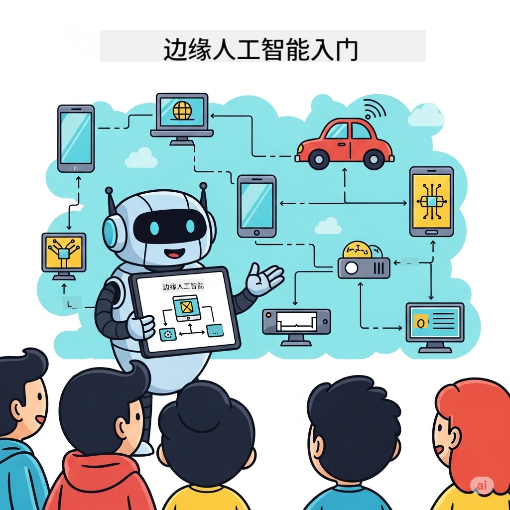

<!--
CO_OP_TRANSLATOR_METADATA:
{
  "original_hash": "22c6dae04591abc5f0d80f944ed663d5",
  "translation_date": "2025-09-26T10:23:25+00:00",
  "source_file": "introduction.md",
  "language_code": "zh"
}
-->
# Edge AI 初学者指南



欢迎踏上探索**边缘人工智能（Edge AI）**的旅程！这是一种革命性的技术，将人工智能的强大功能直接带到数据生成和决策发生的地方。本指南将为您奠定基础，帮助您理解为什么边缘人工智能代表了智能计算的未来，以及如何掌握其实现方法。

## 什么是边缘人工智能？

边缘人工智能是一种从传统云端AI处理转向**本地设备智能**的根本性转变。与将数据发送到远程服务器不同，边缘人工智能直接在边缘设备上处理信息——如智能手机、物联网传感器、工业设备、自动驾驶汽车和嵌入式系统。

### 边缘人工智能的范式

```
Traditional AI:     Device → Cloud → Processing → Response → Device
Edge AI:           Device → Local Processing → Immediate Response
```

这种范式转变消除了数据往返云端的过程，实现了：
- **即时响应**（亚毫秒级延迟）
- **增强隐私**（数据不离开设备）
- **可靠运行**（无需互联网连接即可工作）
- **降低成本**（最小化带宽和云计算资源使用）

## 为什么边缘人工智能现在如此重要？

### 创新的完美风暴

三大技术趋势的融合使边缘人工智能不仅成为可能，更成为必需：
1. **硬件革命**：现代芯片（如Apple Silicon、Qualcomm Snapdragon、NVIDIA Jetson）将AI加速集成到紧凑且高效的硬件中
2. **模型优化**：小型语言模型（SLMs）如Phi-4、Gemma和Mistral，在仅10-20%大小的情况下提供80-90%的大型模型性能
3. **现实需求**：各行业需要云解决方案无法提供的即时、私密和可靠的AI

### 关键业务驱动因素

**隐私与合规**
- 医疗：患者数据需留在本地（符合HIPAA合规要求）
- 金融：交易处理需要数据主权
- 制造业：专有流程需防止数据泄露

**性能需求**
- 自动驾驶：毫秒级的生命关键决策
- 工业自动化：实时质量控制和安全监测
- 游戏与AR/VR：沉浸式体验要求零感知延迟

**经济效益**
- 电信：本地处理数百万物联网传感器数据
- 零售：无需高昂带宽成本的店内分析
- 智慧城市：分布式智能覆盖数千设备

## 被边缘人工智能变革的行业

### 🏭 **制造业与工业4.0**
- **预测性维护**：工业设备上的AI模型预测故障发生
- **质量控制**：生产线上的实时缺陷检测
- **安全监测**：即时危险检测与响应
- **供应链**：每个节点的智能库存管理

**实际影响**：西门子利用边缘人工智能进行预测性维护，将停机时间减少30-50%，维护成本降低25%。

### 🏥 **医疗与医疗设备**
- **诊断成像**：AI驱动的X光和MRI分析直接在护理点完成
- **患者监测**：通过可穿戴设备进行持续健康评估
- **手术辅助**：手术过程中的实时指导
- **药物研发**：分子模拟的本地处理

**实际影响**：飞利浦的边缘人工智能解决方案使放射科医生诊断速度提高40%，同时保持99%的准确率。

### 🚗 **自动化系统与交通**
- **自动驾驶车辆**：导航和安全的瞬时决策
- **交通管理**：智能路口控制和流量优化
- **车队运营**：实时路线优化和车辆健康监测
- **物流**：自动化仓储机器人和配送系统

**实际影响**：特斯拉的全自动驾驶系统本地处理传感器数据，每秒做出40多个决策，确保安全的自动导航。

### 🏙️ **智慧城市与基础设施**
- **公共安全**：实时威胁检测和紧急响应
- **能源管理**：智能电网优化和可再生能源整合
- **环境监测**：空气质量、噪音污染和气候追踪
- **城市规划**：交通流量分析和基础设施优化

**实际影响**：新加坡的智慧城市计划使用超过10万个边缘人工智能传感器进行交通管理，通勤时间减少25%。

### 📱 **消费科技与移动设备**
- **智能手机AI**：增强摄影、语音助手和个性化功能
- **智能家居**：智能化自动化和安全系统
- **可穿戴设备**：健康监测和健身优化
- **游戏**：实时图形增强和游戏优化

**实际影响**：苹果的神经引擎每秒处理15.8万亿次操作，支持实时语言翻译和计算摄影等功能。

## 小型语言模型：边缘人工智能的引擎

### 什么是小型语言模型（SLMs）？

SLMs是**大型语言模型的压缩和优化版本**，专为边缘部署设计：
- **Phi-4**：14B参数，优化用于推理和代码生成
- **Gemma 2B/7B**：谷歌高效模型，适用于多种NLP任务
- **Mistral-7B**：高性能模型，具有商业友好许可
- **Qwen系列**：阿里巴巴的多语言模型，优化用于移动部署

### SLM的优势

| 能力 | 大型语言模型 | 小型语言模型 |
|------|-------------|-------------|
| **规模** | 70B-405B参数 | 1B-14B参数 |
| **内存** | 40-200GB RAM | 2-16GB RAM |
| **推理速度** | 2-10秒 | 50-500毫秒 |
| **部署** | 高端服务器 | 智能手机、嵌入式设备 |
| **成本** | 每月数千美元 | 一次性硬件成本 |
| **隐私** | 数据发送到云端 | 本地处理数据 |

### 性能现实

现代SLMs实现了惊人的能力：
- **90% GPT-3.5性能**，适用于许多任务
- **实时对话**能力
- **代码生成与调试**
- **多语言翻译**
- **文档分析与摘要**

## 学习目标

通过完成本课程，您将：

### 🎯 **基础知识**
- 理解边缘人工智能采用的技术和业务驱动因素
- 比较边缘与云AI架构及其适用场景
- 识别不同SLM家族的特点和能力
- 分析边缘人工智能部署的硬件需求

### 🛠️ **技术技能**
- 在多种平台上部署SLMs（Windows、移动设备、嵌入式、云-边缘混合）
- 使用量化、剪枝和压缩优化模型以适应边缘限制
- 实现生产级边缘人工智能应用，包括监控和扩展
- 构建多代理系统和功能调用框架以处理复杂工作流

### 🏗️ **实践应用**
- 创建具有本地模型切换和对话管理的聊天应用
- 开发基于RAG（检索增强生成）的系统，处理本地文档
- 构建智能模型路由器，动态选择专用AI模型
- 设计具有流式处理、健康监控和错误处理的API框架

### 🚀 **生产部署**
- 建立SLMOps流水线，用于模型版本管理、测试和部署
- 实现边缘人工智能应用的安全最佳实践
- 设计平衡边缘与云处理的可扩展架构
- 创建生产边缘人工智能系统的监控和维护策略

## 学习成果

完成课程后，您将具备以下能力：

### **技术精通**
✅ **部署生产级边缘人工智能解决方案**，覆盖Windows、移动设备和嵌入式平台  
✅ **优化AI模型以适应边缘限制**，实现75%体积缩减和85%性能保留  
✅ **构建智能代理系统**，支持功能调用和多模型编排  
✅ **创建可扩展的边缘-云混合架构**，适用于企业应用  

### **行业应用**
✅ **设计制造业解决方案**，实现预测性维护和质量控制  
✅ **开发医疗应用**，实现隐私合规的患者数据处理  
✅ **构建汽车系统**，支持实时决策和安全保障  
✅ **创建智慧城市基础设施**，涵盖交通、安全和环境监测  

### **职业发展**
✅ **边缘人工智能解决方案架构师**：设计全面的边缘AI战略  
✅ **机器学习工程师（边缘方向）**：优化并部署边缘环境的模型  
✅ **物联网AI开发者**：创建具有本地处理能力的智能物联网系统  
✅ **移动AI开发者**：构建支持本地推理的AI驱动移动应用  

## 课程架构

本课程采用**渐进式掌握方法**：

### **阶段1：基础**（模块01-02）
建立概念理解，探索模型家族

### **阶段2：实现**（模块03-04）
掌握部署和优化技术

### **阶段3：生产**（模块05-06）
学习SLMOps和高级代理框架

### **阶段4：专精**（模块07-08）
平台特定实现和综合案例

## 成功指标

通过以下具体成果跟踪您的进展：
- **作品集项目**：10+个跨多个行业的生产级应用
- **性能基准**：边缘设备上模型推理时间<500毫秒
- **部署目标**：应用运行于Windows、移动设备和嵌入式平台
- **企业准备度**：具备监控、扩展和安全框架的解决方案

## 开始学习

准备好改变您对AI部署的理解了吗？您的旅程从**[模块01：边缘人工智能基础](./Module01/README.md)**开始，在这里您将探索边缘人工智能的技术基础，并研究行业领导者的实际案例。

**下一步**：[📚 模块01 - 边缘人工智能基础 →](./Module01/README.md)

---

**人工智能的未来是本地化、即时化和私密化的。掌握边缘人工智能，构建下一代智能应用。**

---

